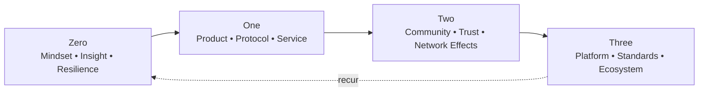

# INTRODUCTION: THE NEW LANDSCAPE

> *Last Updated: March 2026*

> TL;DR
> - Two converging revolutions—AI and Web3—change how we build, trust, and scale.
> - Winning playbooks shift from product features to systems, incentives, and governance.
> - Use the Zero → One → Two → Three framework to decide where to focus now.

## 1. Setting the Stage: A Transformative Era

We stand at the threshold of an extraordinary period in human history. The pace of technological change has accelerated beyond anything we've previously experienced, fundamentally reshaping not just industries but the fabric of society itself. Artificial intelligence systems now generate art, write code, and engage in complex reasoning. Blockchain networks enable trustless cooperation at global scale. The metaverse promises to blur the boundaries between physical and digital reality.

This isn't merely evolution—it's transformation. In the span of a single decade, we've witnessed the emergence of cryptocurrencies valued in the trillions, AI systems that can pass bar exams, and decentralized organizations coordinating thousands of contributors without traditional hierarchies. These developments aren't isolated phenomena but interconnected waves in a broader technological tsunami.

Traditional entrepreneurial models—built for a world of relative stability and linear progress—struggle to provide adequate guidance in this environment. The mental models, organizational structures, and strategic frameworks that served previous generations of founders are increasingly misaligned with today's realities. We need new maps for navigating this territory—maps that embrace complexity, adaptability, and systemic thinking.

## 2. The Zero to Three Framework: Mapping the Entrepreneurial Journey

In 2014, Peter Thiel's seminal work "Zero to One" captured a profound insight: true innovation means creating something entirely new (going from zero to one) rather than copying what works (going from one to n). This vertical progress, Thiel argued, is the source of real value creation and technological advancement.

This insight remains powerful. However, in today's interconnected technological landscape, it represents just the beginning of the entrepreneurial journey. Creating something new is necessary but insufficient. The most successful ventures of our era move beyond initial innovation to build communities, platforms, and eventually ecosystems.

The Zero to Three framework expands our understanding of this journey through four distinct stages:

**ZERO:** The foundation begins with the founder—developing the mindset, resilience, and asymmetric insights necessary for genuine innovation. This stage encompasses personal development, mental model formation, and the cultivation of differentiated thinking. Without this foundation, even brilliant technical innovations often fail to achieve their potential.

**ONE:** Building on this foundation, the entrepreneur creates something tangible—a product, protocol, or service that solves a real problem. This stage aligns with Thiel's vertical progress, bringing something new into existence. In the Web3 and AI era, this requires navigating complex technical considerations, from token economics to AI system design.

**TWO:** With a working product, the focus shifts to gaining traction—building community, establishing trust, and creating network effects. This stage transcends traditional marketing to encompass governance design, community engagement, and the careful balance between centralization and decentralization.

**THREE:** The ultimate achievement is system leadership—creating infrastructure and ecosystems that enable others to build and innovate. At this stage, the venture evolves beyond its original creators to become a platform that supports an entire community of builders. The founder becomes a steward rather than a controller.

Three is the most novel—and most misunderstood—stage in this framework. It is not simply "scaling bigger." It is a qualitative shift in what the venture *is*. At Three, your creation becomes infrastructure that others depend on, build upon, and extend in directions you never imagined. You stop measuring success by your own output and start measuring it by the output of everyone building on top of you.

Consider the difference concretely:

- **At One**, Ethereum was a smart contract platform. **At Three**, it became the settlement layer for an entire financial system—DeFi protocols, NFT marketplaces, Layer 2 networks, and thousands of applications its creators never envisioned.
- **At One**, OpenAI built GPT. **At Three**, the API became infrastructure powering tens of thousands of applications across every industry, with an ecosystem of fine-tuners, prompt engineers, and tool builders creating value independently.
- **At One**, Linux was an operating system. **At Three**, it became the substrate of the internet itself—running servers, phones, embedded systems, and cloud infrastructure in ways Linus Torvalds never planned.

The defining characteristics of Three are:

1. **Others build without asking permission.** Your system has clear enough interfaces and incentives that independent builders can create value without your involvement.
2. **The system generates value you don't capture.** The total value created by the ecosystem vastly exceeds what accrues to you—and that's the point.
3. **Removal of the founder wouldn't kill the system.** The venture has developed distributed intelligence, governance, and momentum that persists beyond any individual.
4. **The venture sets standards others follow.** Your protocols, APIs, or conventions become the default that new entrants build against.

Most ventures never reach Three. Many shouldn't try—building an excellent product at One or a thriving community at Two is achievement enough. But for founders with the ambition and patience, Three represents the transition from building a company to building a piece of civilizational infrastructure.

**Figure 0.1:** Visual representation of the Zero to Three journey, showing the progression from individual insight to ecosystem orchestration.

This framework isn't linear but recursive. Entrepreneurs may cycle through these stages multiple times, facing new challenges and opportunities at each iteration. The most successful founders understand when to focus on which stage and how the stages interconnect.

## 3. Beyond "Zero to One": Embracing Complexity

While "Zero to One" provided invaluable wisdom for an earlier era of technology entrepreneurship, today's landscape demands frameworks that embrace greater complexity. Several limitations of traditional models have become increasingly apparent:

First, traditional approaches often overemphasize product development at the expense of community building and ecosystem design. In Web3 and AI ventures, community isn't merely a marketing channel—it's a core component of the product itself, providing governance, development resources, and network effects.

Second, conventional models typically assume centralized organizations with clear boundaries. Yet many of today's most innovative ventures operate as distributed networks with fluid participation models, requiring fundamentally different governance and incentive structures.

Third, traditional frameworks often treat technology as a tool rather than a co-creator. In an era where AI systems can generate code, design products, and even develop business strategies, we need models that account for human-technology collaboration rather than simply human use of technology.

Finally, earlier approaches frequently focused on disrupting or replacing existing systems. Today's most promising ventures often take a more integrative approach, building bridges between traditional and emerging systems rather than seeking to overthrow them entirely.

These limitations aren't failures of previous wisdom but natural boundaries that emerge as circumstances evolve. By acknowledging these constraints, we can develop more nuanced, adaptive approaches suited to our current reality.

## 4. The Convergence of Web3 and AI: A Paradigm Shift

At the heart of today's technological transformation is the convergence of two revolutionary forces: Web3 and artificial intelligence.

Web3 represents the movement toward decentralized digital infrastructure—systems built on blockchain technology that enable trustless transactions, distributed governance, and user ownership of data and digital assets. At its core, Web3 aims to redistribute power from centralized platforms to networks of participants.

Artificial intelligence, particularly in its modern incarnation as large language models and multimodal systems, represents unprecedented capabilities in processing, generating, and acting upon information. These systems can now create content indistinguishable from human work, reason about complex problems, and even design new technologies.

The convergence of these technologies creates possibilities that neither could achieve alone:

- AI systems that operate on decentralized infrastructure, ensuring that intelligence remains broadly accessible rather than concentrated in a few powerful entities
- Blockchain networks enhanced by intelligence, enabling more sophisticated governance, security, and coordination mechanisms
- New coordination models where humans and AI systems collaborate as peers rather than in strictly hierarchical relationships
- Digital economies with sophisticated incentive mechanisms designed and maintained by hybrid human-AI systems

For entrepreneurs, this convergence represents both extraordinary opportunity and unique challenges. Building in this space requires understanding not just individual technologies but their interactions and emergent properties. It demands technical depth, ethical consideration, and systems thinking beyond what previous generations of founders needed.

## 5. The Evolving Founder Archetype: From Solo Visionary to Ecosystem Builder

The archetype of the entrepreneur has evolved alongside these technological shifts. The traditional image of the lone visionary—think Steve Jobs unveiling the iPhone or Bill Gates creating Microsoft—has given way to a more nuanced understanding of entrepreneurial leadership.

Today's most successful founders aren't just product visionaries; they're ecosystem architects. They understand that their role isn't to control every aspect of their creation but to establish the conditions under which diverse contributors can participate, innovate, and share in value creation.

This shift requires a different set of competencies:

- **Systems Thinking:** Understanding how components interact in complex, nonlinear ways
- **Community Leadership:** Building and guiding distributed teams with diverse motivations
- **Technical Polyglotism:** Navigating multiple technical domains rather than specializing in one
- **Ethical Discernment:** Making principled decisions about how technologies should and shouldn't be applied
- **Adaptive Strategy:** Maintaining vision while adjusting tactics in rapidly changing conditions

These aren't replacing traditional entrepreneurial skills like product sense, market understanding, and execution ability. Rather, they're additional layers of competence required for success in more complex technological and social environments.

## Counter-Arguments: Steelmanning the Skeptics

Before proceeding, intellectual honesty demands we confront the strongest arguments against this book's core thesis. If we cannot address these critiques, our framework is built on sand.

### "Web3 Is Irrelevant"

The strongest case against Web3's significance runs as follows: After more than a decade of development, blockchain technology has failed to produce a consumer application used by more than a small fraction of the global population for non-speculative purposes. Bitcoin remains primarily a speculative asset rather than a medium of exchange. DeFi protocols serve mostly as venues for leveraged crypto trading rather than genuine financial innovation. NFTs experienced a >95% market collapse from their 2021 peaks. DAOs have consistently struggled with voter apathy, plutocratic capture, and slow decision-making compared to traditional organizations.

The skeptic argues that the entire Web3 ecosystem is a solution looking for a problem—that decentralization introduces costs (latency, complexity, poor UX) without delivering benefits that matter to ordinary users. Centralized systems, they note, are faster, cheaper, and more user-friendly. The burden of proof, they insist, remains squarely on Web3 advocates.

**Our response**: These criticisms contain substantial truth, particularly regarding the gap between Web3's promises and current reality. However, they confuse early-stage limitations with fundamental constraints. Similar arguments were made about the internet in 1995 (slow, no killer app, inferior to existing media) and about mobile computing in 2005 (small screens, bad keyboards, why not use a laptop?). The relevant question is not whether Web3 has achieved mainstream adoption today, but whether the underlying capabilities—programmable trust, composable value transfer, censorship-resistant coordination—will find product-market fit as UX improves and infrastructure matures. The evidence from emerging markets (see Chapter 04: Nigeria's crypto adoption) suggests utility-driven adoption is already occurring where existing systems fail.

### "AI Will Centralize Everything"

The counter-thesis argues that AI's trajectory leads inexorably toward centralization, not the decentralization Web3 envisions. Training frontier models requires billions of dollars in compute infrastructure that only a handful of companies can afford. Data advantages compound—the largest companies accumulate the most data, train the best models, attract the most users, and generate even more data. The talent pool for frontier AI research numbers in the low thousands globally, concentrated at a few well-funded labs. If AI is the dominant technology of the coming decades, the argument goes, it will produce an unprecedented concentration of power in the hands of a few large corporations—rendering Web3's decentralization aspirations irrelevant at best and naive at worst.

**Our response**: This is perhaps the strongest structural argument against our thesis, and we take it seriously. The compute and data advantages of large AI labs are real and unlikely to disappear. However, several countervailing forces deserve consideration. First, open-source and open-weight models (Llama, Mistral, DeepSeek) have consistently closed the gap with proprietary models faster than predicted, suggesting moat durability is weaker than incumbents claim. Second, inference costs are declining exponentially, making deployment accessible to small teams even when training remains expensive. Third, the most valuable AI applications may not require frontier models—domain-specific fine-tuned models often outperform general-purpose models for specific tasks. Fourth, the regulatory environment is evolving toward mandating transparency and interoperability in AI systems, which favors more distributed architectures. We do not claim that decentralization is inevitable—only that it remains a viable and potentially preferable path, particularly for applications where trust, censorship resistance, or user sovereignty matter.

### "This Is Just Hype Cycle Recycling"

The most cynical critique argues that every technology generation produces breathless books claiming revolutionary transformation, most of which are forgotten within a decade. The dot-com era produced dozens of "new economy" manifestos. The social media era generated countless "platform revolution" books. Now AI and Web3 are the objects of similar enthusiasm. The base rate for these predictions is poor.

**Our response**: This is a legitimate caution, and we've attempted to address it throughout by grounding claims in observable data rather than projections (see the Hard Signals table in Chapter 01), including failure case studies alongside successes, and explicitly distinguishing our analysis from speculation. Readers should evaluate the frameworks in this book based on their current explanatory power, not on predictions about the future. If Web3/AI convergence does not materialize as we describe, the foundational principles—systems thinking, incentive design, community building—remain applicable to technology entrepreneurship broadly.

## A Note on Research and Evidence

This book synthesizes insights from three categories of research:

**Primary Research**: The frameworks in this book were informed by conversations with over 40 founders, operators, and investors active in Web3 and AI between 2022 and 2025. These were informal, unstructured conversations rather than formal academic interviews—they shaped our thinking but do not constitute rigorous primary research. Where we reference specific founder insights, they are attributed with permission or drawn from publicly available interviews.

**Secondary Source Synthesis**: The majority of evidence is drawn from industry reports (McKinsey, a16z, CB Insights, Stanford AI Index), public filings, published interviews, and academic research. We have prioritized Tier 1 sources (peer-reviewed research, primary company documents) over Tier 2 (industry publications) and Tier 3 (blog posts, conference talks). See the Appendix for our full source hierarchy.

**Analytical Frameworks**: The Zero-to-Three framework, stage models, and strategic recommendations are original analytical constructs developed by the authors. They represent our interpretation of the evidence, not established theory. We have attempted to distinguish clearly between factual claims (supported by cited evidence) and analytical interpretations (our framework applied to the facts).

> **Convention used throughout this book**: Statements of fact are supported by inline citations. Author opinions and projections are introduced with phrases like "we believe," "in our view," "our analysis suggests," or are placed in clearly labeled opinion markers. Future projections are marked as speculative where they go beyond available data. See the Methodology section in the Appendix for details on case study selection and evidence standards.

### A Note on Statistics and Data Currency

This book was written and updated through March 2026. Technology markets evolve rapidly, and specific statistics—market capitalizations, funding totals, user counts, pricing—may have changed by the time you read this. We have adopted the following conventions:

- **Date-stamped data**: Where possible, statistics include the date of measurement in parentheses (e.g., "as of Q3 2024").
- **Directional accuracy**: We have prioritized citing figures that illustrate trends and orders of magnitude rather than precise point-in-time numbers.
- **Living document updates**: Each chapter includes a "Last Updated" date. The most current version of this book, with refreshed statistics, is available in the GitHub repository.
- **Reader verification**: For time-sensitive decisions (fundraising, market entry, pricing), we strongly recommend verifying cited statistics against current sources rather than relying on any printed figure.

## 6. Navigating This Book: A User's Guide

"Zero to Three" is designed as a modular resource rather than a linear narrative. Each section addresses specific aspects of the entrepreneurial journey in the Web3 and AI era, allowing you to focus on what's most relevant to your current challenges.

**Part I: Understanding the New Terrain** provides foundational context on the technological, economic, and social shifts reshaping entrepreneurship. These chapters establish a shared vocabulary and conceptual framework for the more specific guidance that follows.

**Part II: Zero - The Founder's Journey** focuses on developing the personal qualities and mental models necessary for innovation in complex technological environments. These chapters address psychological resilience, differentiated thinking, and navigating uncertainty.

**Part III: One - Building What Works** explores the technical and practical aspects of creating products in the Web3 and AI space, from system architecture to funding models to minimum viable product design.

**Part IV: Two - Gaining Traction** examines strategies for building community, establishing trust, and creating sustainable growth in decentralized and intelligent systems.

**Part V: Three - Leading Systems** addresses the challenges and opportunities of creating and stewarding technological ecosystems that transcend individual products or companies.

**Part VI: The New Geography of Innovation** explores how these technological shifts are changing the global landscape of entrepreneurship, opening opportunities beyond traditional innovation hubs.

Throughout the book, you'll find QR codes linking to additional resources—interviews with founders, technical demonstrations, code repositories, and community forums where you can engage with others on similar journeys. These elements transform reading from a passive to an active experience, connecting you with tools and communities that can support your venture.

We encourage you to approach this book not as a definitive guide but as a living conversation. The field is evolving too rapidly for any single text to provide all the answers. Rather, we hope to equip you with models, questions, and perspectives that will inform your own explorations and innovations.

The journey from Zero to Three is challenging, nonlinear, and often deeply personal. But it also represents one of the most meaningful paths available in our rapidly changing world—the opportunity to create systems that enable human flourishing through technological advancement.

Welcome to the new landscape. Let's build.
## Short Glossary

- Web3: Internet infrastructure with verifiable ownership, programmable assets, and decentralized coordination.
- Tokenomics: Incentive design using tokens for contribution, security, and resource allocation.
- Decentralization: Shifting control/trust from single operators to distributed protocols and communities.
- Alignment: Incentive, information, and authority structures that keep behavior pointed at shared goals.
- Governance: How changes are proposed, approved, and enacted—on-chain, off-chain, or hybrid.

## Where to Go Next

- If you’re at **Zero** (founder foundations): Ch. 17 Self-Leadership, Ch. 25 Building in Uncertainty
- If you’re at **One** (build the system): Ch. 04 Technical Paradigm Shift, Ch. 23 Web3 Architecture & Security, Ch. 27 AI System Design
- If you’re at **Two** (earn trust/traction): Ch. 33 Community Building, Ch. 28 Decentralized Governance
- If you’re at **Three** (system leadership): Ch. 36 System Leadership, Ch. 24 Building What Works (as platform design refresher)

For full reading pathways by role, see the [front matter](front-matter.md#reading-pathways-by-role). For term definitions, see the [Glossary](glossary.md).
