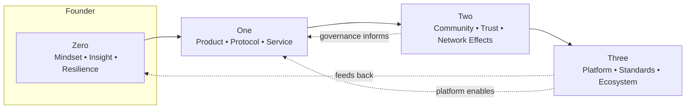

INTRODUCTION: THE NEW LANDSCAPE

1. Setting the Stage: A Transformative Era
We stand at the threshold of a remarkable period. The pace of technological change now reshapes not only industries but social and institutional life. AI systems generate art, write code, and reason through complex problems. Blockchains enable trustless cooperation at global scale. Immersive digital environments blur boundaries between physical and virtual experience.

This isn’t incremental change—it’s transformation. In a decade, we’ve seen cryptocurrencies reach trillion‑dollar scale, AI models pass professional exams, and decentralized networks coordinate thousands without traditional hierarchies. These are not isolated events but interlocking waves within a broader technological shift.

Traditional entrepreneurial playbooks—built for relative stability and linear progress—no longer suffice. The mental models, organizational structures, and strategies of yesterday misalign with today’s dynamic, networked reality. We need maps that embrace complexity, adaptability, and systems thinking.

2. The Zero to Three Framework: Mapping the Entrepreneurial Journey
Peter Thiel’s “Zero to One” highlighted a vital truth: real value creation comes from bringing something new into existence, not from copying what already works. That insight remains powerful—but in today’s interconnected landscape, it is only the beginning.

The most successful ventures move beyond initial innovation to build communities, platforms, and eventually ecosystems. The Zero to Three framework describes this journey across four recursive stages:

ZERO: The founder’s foundation—mindset, resilience, and asymmetric insight. This is personal development, mental models, and differentiated thinking. Without it, even strong technical ideas stall.

ONE: Creation—building a product, protocol, or service that solves a real problem. In the Web3 and AI era, this includes token design, data and model strategy, and robust system architecture.

TWO: Traction—growing community, trust, and network effects. Beyond marketing, this includes governance choices, contributor pathways, and careful design of decentralization over time.

THREE: System leadership—evolving into infrastructure and ecosystems where others can build. The founder shifts from controller to steward as the platform supports a broader community of creators.

Figure 1: Zero → One → Two → Three (recursive)

This progression is not linear. Entrepreneurs cycle through stages, revisiting earlier ones as context changes. Mastery is knowing where to focus when—and how each stage informs the others.

3. Beyond “Zero to One”: Embracing Complexity
Earlier models underemphasized dimensions that are now decisive:

- Community as product: In Web3 and AI, community is not just distribution; it is governance, development capacity, and network effect engine.
- Fluid organizational boundaries: Many ventures operate as distributed networks, demanding new incentive and governance mechanisms.
- Technology as co‑creator: AI increasingly collaborates with humans to write code, design systems, and shape strategy—changing the nature of work and value creation.
- Integration over disruption: High‑leverage ventures often bridge legacy and emerging systems, compounding value instead of replacing everything outright.

These aren’t failures of prior wisdom; they are natural limits. Acknowledging them lets us adopt more adaptive, multi‑scale models.

4. The Convergence of Web3 and AI: A Paradigm Shift
Two revolutions are converging:

Web3 decentralizes infrastructure—enabling trustless transactions, distributed governance, and user ownership. It shifts power from centralized platforms to networks.

AI expands intelligence—processing, generating, and acting on information at unprecedented scale. Modern multimodal systems create content, reason strategically, and design technologies.

Together, they unlock possibilities neither achieves alone:

- AI that runs on decentralized rails, keeping intelligence accessible rather than concentrated.
- Intelligent blockchains with richer governance, security, and coordination.
- New human–AI collaboration models that aren’t strictly hierarchical.
- Digital economies governed by sophisticated, evolving incentive systems co‑designed by humans and AI.

For founders, this is extraordinary opportunity with uncommon complexity. Success requires understanding the technologies, their interactions, and their emergent properties—alongside deep ethical consideration.

5. The Evolving Founder Archetype: From Solo Visionary to Ecosystem Builder
The lone visionary gives way to the ecosystem architect. Today’s founders design conditions where diverse contributors participate, innovate, and share value. Core competencies include:

- Systems thinking: Seeing nonlinear interactions and multi‑order effects.
- Community leadership: Guiding distributed contributors with varied motivations.
- Technical polyglotism: Navigating multiple domains across software, AI, cryptography, and economics.
- Ethical discernment: Making principled choices about deployment and governance.
- Adaptive strategy: Holding vision while flexing tactics under uncertainty.

These build on, not replace, product sense, market insight, and execution.

6. Navigating This Book: A User’s Guide
Zero to Three is modular. Use it as a toolkit to meet your current stage and constraints.

- Part I: The New Terrain—technological, economic, and social shifts; shared vocabulary and mental models.
- Part II: Zero—founder psychology, differentiated insight, and navigating uncertainty.
- Part III: One—system architecture, funding, AI and token design, and viable product formation.
- Part IV: Two—community growth, trust, governance, and sustainable network effects.
- Part V: Three—ecosystem stewardship, standards, and platform orchestration.
- Part VI: The New Geography—how these shifts reshape where and how innovation happens.

Throughout, QR codes link to living resources: founder interviews, technical demos, code, and forums. Reading becomes participatory—connecting you to tools and communities.

Treat this as a conversation, not a doctrine. The field is evolving too quickly for final answers. Our goal is to equip you with models, questions, and practices to guide your own explorations.

The journey from Zero to Three is challenging and deeply personal. It is also one of the most meaningful paths available today: building systems that enable human flourishing through technological progress.

Welcome to the new landscape. Let’s build.

