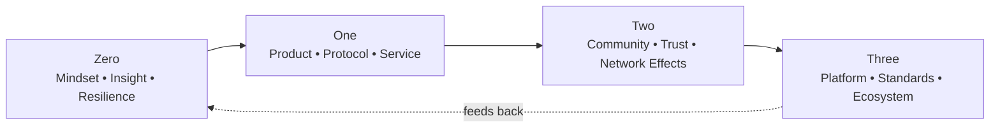

# Zero to Three: Entrepreneurship in the Age of Web3 and AI

**A Web3 Innovation Framework**

---

## Publishing Information

**Author:** Will Schulz
**Publisher:** TBD
**Publication Year:** 2024
**ISBN:** TBD
**Format:** Digital and Print

---

## Copyright Notice

This work is licensed under Creative Commons Attribution-NonCommercial-ShareAlike 4.0 International License.

You are free to:
- **Share** — copy and redistribute the material in any medium or format
- **Adapt** — remix, transform, and build upon the material

Under the following terms:
- **Attribution** — You must give appropriate credit, provide a link to the license, and indicate if changes were made
- **NonCommercial** — You may not use the material for commercial purposes without permission
- **ShareAlike** — If you remix, transform, or build upon the material, you must distribute your contributions under the same license

---

## Book Description

*Zero to Three* is the definitive guide for building successful ventures in the age of Web3 and AI. Inspired by Peter Thiel's "Zero to One," this book addresses the unique challenges and opportunities of decentralized technology and artificial intelligence.

The book presents a comprehensive framework for entrepreneurship that acknowledges how Web3 and AI represent fundamentally new technological paradigms requiring different approaches than traditional Silicon Valley startup methodologies.

---

## How to Use This Book

- Start where it hurts: jump to the chapter that matches your current bottleneck. Every chapter begins with “In This Chapter” and ends with a Checklist and Exercises.
- Skim intelligently: look for “Skim This” callouts to capture the gist in under five minutes.
- Follow the links: each chapter cross‑links to tools and case studies; use them for concrete patterns and anti‑patterns.
- Revisit by stage: as you move from Zero → One → Two → Three, different chapters become most relevant.

Quick links by part:
- Part I — Understanding the New Terrain: [Chapter 1](part-01-understanding-the-new-terrain/ch01-the-new-paradigm.md)
- Part II — Zero: The Founder’s Journey: [Chapter 8](part-02-zero-the-founders-journey/ch08-market-validation.md)
- Part III — One: Building Systems: [Chapter 17](part-03-one-building-systems/ch17-system-thinking.md)
- Part IV — Two: Scaling Systems: [Chapter 27](part-04-two-scaling-systems/ch27-community-building.md)
- Part V — Three: Leading Systems: [Chapter 30](part-05-three-leading-systems/ch30-system-leadership.md)
- Part VI — Beyond Three: [Chapter 34](part-06-beyond-three/ch34-exponential-impact.md)

## Frameworks at a Glance

- Zero → One → Two → Three
  - Zero: Mindset, resilience, asymmetric insight
  - One: Working system and viable architecture
  - Two: Trust, community, network effects, governance
  - Three: Standards, platforms, ecosystem stewardship

## Reading Map by Role

- Solo Founder: Ch. 15 (Self‑Leadership), Ch. 8 (Market Validation), Ch. 17 (System Thinking)
- CTO/Tech Lead: Ch. 3 (Technical Paradigm Shift), Ch. 21 (Web3 Architecture & Security), Ch. 24 (AI System Design)
- Product/GM: Ch. 22 (Building What Works), Ch. 19 (User Experience), Ch. 27 (Community Building)
- Policy/Legal: Ch. 6 (Global Perspectives), governance chapters in Part III/IV, Case Studies Compendium
- Investor: Ch. 4 (Economic Fundamentals), Ch. 5 (Innovation Hierarchy), Ch. 30 (System Leadership)

> Skim This (Front Matter)
> - What to do now: pick your stage, scan two adjacent chapters’ “In This Chapter,” then commit to their checklists.
> - What to do later: bookmark the case studies and governance chapters to revisit when traction begins.

---

## Preface

This project is intentionally living: it updates as the landscape shifts. Contributions, critiques, and case studies are welcome, and governance follows open collaboration principles. Treat this as a practical playbook—use the checklists and exercises.

## Prologue

Why this book and why now: after successes and failures across AI and Web3, the most durable pattern was a shift from product‑centric thinking to system stewardship. The journey from Zero to Three is recursive—this book helps you know where you are and what to do next.

---

## Target Audience

- Web3 and AI founders and entrepreneurs
- Venture capitalists and investors in emerging technologies
- Product managers and technical leaders in crypto/AI companies
- Anyone seeking to understand the future of decentralized innovation

---

## Acknowledgments

*To be completed*

---

*Zero to Three: Entrepreneurship in the Age of Web3 and AI*
