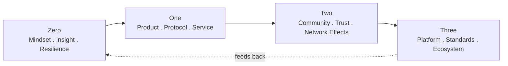

# Zero to Three: Entrepreneurship in the Age of Web3 and AI

**A Web3 Innovation Framework**

---

## How to Read This Book

> **Start here.** This section helps you get the most from *Zero to Three* regardless of your background or time constraints.

**Start where it hurts.** Jump to the chapter that matches your current bottleneck. Every chapter begins with "In This Chapter" learning objectives and ends with a Founder's Checklist and Exercises.

**Skim intelligently.** Look for the TL;DR boxes and "Skim This" callouts to capture the gist of any chapter in under five minutes.

**Follow the links.** Each chapter cross-links to tools and case studies. Use the [Glossary](glossary.md) for unfamiliar terms and the [Index](index.md) for keyword cross-references.

**Revisit by stage.** As you move from Zero to One to Two to Three, different chapters become most relevant. Use the Book Map below to see where you are.

Quick links by part:
- Part I — Understanding the New Terrain: [Chapter 01](part-01-understanding-the-new-terrain/ch01-the-new-paradigm.md)
- Part II — Zero: The Founder's Journey: [Chapter 11](part-02-zero-the-founders-journey/ch11-market-validation.md)
- Part III — One: Building Systems: [Chapter 19](part-03-one-building-systems/ch19-system-thinking.md)
- Part IV — Two: Scaling Systems: [Chapter 32](part-04-two-scaling-systems/ch32-creator-founder-crossroad.md)
- Part V — Three: Leading Systems: [Chapter 36](part-05-three-leading-systems/ch36-system-leadership.md)
- Part VI — Beyond Three: [Chapter 40](part-06-beyond-three/ch40-exponential-impact.md)

---

## Book at a Glance

*Zero to Three* argues that building successful ventures in Web3 and AI requires progressing through four stages, each demanding different skills and mindsets:

| Stage | Core Question | What You Build | Key Chapters |
|-------|--------------|----------------|--------------|
| **Zero** | "What do I uniquely see?" | Founder mindset, resilience, asymmetric insight | 11-18 |
| **One** | "Does this work and create value?" | Working product, protocol, or service | 19-31 |
| **Two** | "Do people trust this enough to depend on it?" | Community, network effects, governance | 32-35 |
| **Three** | "Can this thrive without me?" | Platform, standards, ecosystem stewardship | 36-39 |

**Part I** (Chapters 01-10, 42) sets the foundation: the technological, economic, and global context every builder needs. **Part VI** (Chapters 40-41) looks beyond, at exponential impact and cross-industry transformation.

**The framework is recursive, not linear.** Founders cycle through these stages multiple times. A Chapter 36 insight may send you back to Chapter 13.

---

## Book Map: How the Stages Connect

```
                    +-----------------------------------------+
                    |      PART I: THE NEW TERRAIN            |
                    |  Context . Economics . Global View       |
                    |     Chapters 01-10, 42                  |
                    +-------------------+---------------------+
                                        |
                    +-------------------v---------------------+
                    |   PART II: ZERO -- FOUNDER'S JOURNEY    |
                    |  Mindset . Validation . Psychology       |
                    |     Chapters 11-18, 43-44               |
                    +-------------------+---------------------+
                                        |
                    +-------------------v---------------------+
                    |   PART III: ONE -- BUILDING SYSTEMS     |
                    |  Architecture . Design . Governance      |
                    |     Chapters 19-31, 45-46               |
                    +-------------------+---------------------+
                                        |
                    +-------------------v---------------------+
                    |   PART IV: TWO -- SCALING SYSTEMS       |
                    |  Community . Network Effects . Ops       |
                    |     Chapters 32-35                       |
                    +-------------------+---------------------+
                                        |
                    +-------------------v---------------------+
                    |   PART V: THREE -- LEADING SYSTEMS      |
                    |  Platform . Standards . Stewardship      |
                    |     Chapters 36-39                       |
                    +-------------------+---------------------+
                                        |
                    +-------------------v---------------------+
                    |      PART VI: BEYOND THREE              |
                    |  Exponential Impact . Transformation     |
                    |     Chapters 40-41                       |
                    +-------------------+---------------------+
                                        |
                                        +---- Recursive: feeds back to Zero
                                        |
                                        v
                                  (Back to Part II)
```

**Cross-cutting themes** that thread through multiple parts:
- **Governance:** Ch. 28 (design) -> Ch. 34 (scaling) -> Ch. 36 (system-level)
- **Economics:** Ch. 05 (fundamentals) -> Ch. 16 (capital) -> Ch. 22 (tokenomics) -> Ch. 35 (operations)
- **Global perspective:** Ch. 07 (overview) -> Ch. 08 (financial centers) -> Ch. 09 (emerging markets) -> Ch. 30 (expansion)
- **Trust and security:** Ch. 23 (architecture) -> Ch. 33 (community) -> Ch. 36 (system leadership)

---

## Reading Pathways by Role

Each pathway suggests a reading order tailored to your role. Icons mark chapters throughout the book:

> [F] = Solo Founder | [T] = CTO/Tech Lead | [P] = Product/GM | [L] = Policy/Legal | [I] = Investor

### [F] Solo Founder Track
Ch. 17 (Self Leadership) -> Ch. 11 (Market Validation) -> Ch. 10 (Idea Development) -> Ch. 18 (Solo Founders AI Era) -> Ch. 19 (System Thinking) -> Ch. 24 (Building What Works) -> Ch. 33 (Community Building)

### [T] CTO / Tech Lead Track
Ch. 04 (Technical Paradigm Shift) -> Ch. 20 (Technology Decisions) -> Ch. 23 (Web3 Architecture) -> Ch. 27 (AI System Design) -> Ch. 22 (Tokenomics) -> Ch. 31 (Defensible Advantages) -> Ch. 46 (Data Privacy)

### [P] Product / GM Track
Ch. 21 (User Experience) -> Ch. 24 (Building What Works) -> Ch. 11 (Market Validation) -> Ch. 33 (Community Building) -> Ch. 35 (Operational Excellence) -> Ch. 29 (Convergence Opportunities)

### [L] Policy / Legal Track
Ch. 07 (Global Perspectives) -> Ch. 42 (Regulatory Landscape) -> Ch. 28 (Decentralized Governance) -> Ch. 46 (Data Privacy) -> Ch. 08 (Financial Centers) -> Case Studies Compendium

### [I] Investor Track
Ch. 05 (Economic Fundamentals) -> Ch. 06 (Innovation Hierarchy) -> Ch. 16 (Navigating Modern Capital) -> Ch. 15 (Anti-Pattern Recognition) -> Ch. 36 (System Leadership) -> Case Studies Compendium

---

## Frameworks at a Glance

- Zero -> One -> Two -> Three
  - Zero: Mindset, resilience, asymmetric insight
  - One: Working system and viable architecture
  - Two: Trust, community, network effects, governance
  - Three: Standards, platforms, ecosystem stewardship


```mermaid
flowchart LR
  Z[Zero\nMindset . Insight . Resilience]
  O[One\nProduct . Protocol . Service]
  T[Two\nCommunity . Trust . Network Effects]
  E[Three\nPlatform . Standards . Ecosystem]
  Z --> O --> T --> E
  E -.feeds back .-> Z
```

---

## Chapter Difficulty Guide

Each chapter is rated so you can calibrate your reading:

| Rating | Meaning | Who should read |
|--------|---------|-----------------|
| **Beginner** | No prior Web3/AI knowledge needed | Everyone |
| **Intermediate** | Assumes familiarity with startup concepts and basic technology terminology | Founders, product leads, investors |
| **Advanced** | Requires technical background in software engineering, cryptography, or ML | CTOs, protocol engineers, technical founders |

See the [Table of Contents](SUMMARY.md) for the full chapter listing.

## Fast Track: The 10 Essential Chapters

Short on time? Read these ten chapters in order for the core argument and most actionable frameworks:

1. **Ch. 01 -- The New Paradigm** (Beginner) -- Why Web3+AI changes the rules
2. **Ch. 05 -- Economic Fundamentals** (Intermediate) -- Unit economics and scarcity in the new era
3. **Ch. 10 -- Idea Development** (Beginner) -- The 7-day sprint and idea scoring rubric
4. **Ch. 11 -- Market Validation** (Beginner) -- Testing demand before building
5. **Ch. 15 -- Anti-Pattern Recognition** (Intermediate) -- How ventures fail and how to avoid it
6. **Ch. 18 -- Solo Founders AI Era** (Beginner) -- Building alone with AI leverage
7. **Ch. 19 -- System Thinking** (Intermediate) -- Designing systems, not just products
8. **Ch. 24 -- Building What Works** (Intermediate) -- Practical engineering for ship speed
9. **Ch. 33 -- Community Building** (Intermediate) -- Network effects and trust loops
10. **Ch. 36 -- System Leadership** (Advanced) -- Scaling from founder to ecosystem steward

> This track covers roughly 40% of the book and takes an experienced reader 6-8 hours.

---

## Publishing Information

**Author:** Will Schulz
**Publisher:** TBD
**Publication Year:** 2024
**ISBN:** TBD
**Format:** Digital and Print

---

## Copyright Notice

This work is licensed under Creative Commons Attribution-NonCommercial-ShareAlike 4.0 International License.

You are free to:
- **Share** -- copy and redistribute the material in any medium or format
- **Adapt** -- remix, transform, and build upon the material

Under the following terms:
- **Attribution** -- You must give appropriate credit, provide a link to the license, and indicate if changes were made
- **NonCommercial** -- You may not use the material for commercial purposes without permission
- **ShareAlike** -- If you remix, transform, or build upon the material, you must distribute your contributions under the same license

---

## Book Description

*Zero to Three* is the definitive guide for building successful ventures in the age of Web3 and AI. Inspired by Peter Thiel's "Zero to One," this book addresses the unique challenges and opportunities of decentralized technology and artificial intelligence.

The book presents a comprehensive framework for entrepreneurship that acknowledges how Web3 and AI represent fundamentally new technological paradigms requiring different approaches than traditional Silicon Valley startup methodologies.

---

## Companion Website

Visit **zeroto3.book** for interactive resources that extend the printed book:

- **Idea Scoring Rubric** -- Interactive version of the scoring tool from Ch. 10, with auto-calculated weighted scores
- **Financial Model Templates** -- Downloadable spreadsheets for token flow simulation, inference cost calculators, and unit economics
- **7-Day Sprint Template** -- Standalone printable/digital version of the Idea Exploration Sprint (also available at [resources/7-day-sprint-template.md](../resources/7-day-sprint-template.md))
- **Stack Selection Matrix** -- Interactive technology decision tool from the Appendix
- **Community Building Playbook** -- Discord templates, content calendars, and onboarding flows
- **Case Study Database** -- Searchable, updated versions of all case studies with new additions

> **QR Codes**: Throughout the printed edition, QR codes link to the latest version of each resource. Since Web3 and AI move faster than print cycles, these links ensure you always access current data, updated case studies, and new tools added after publication. All QR codes resolve to pages on **zeroto3.book**.

## Audio and Podcast Companion

Key chapters are available as conversational audio episodes on the *Zero to Three Podcast*, where topics are discussed in an accessible, interview-style format. Available on major podcast platforms and at **zeroto3.book/podcast**.

Suggested listening order for non-readers:
1. Episode 1: The Zero to Three Framework (pairs with Ch. 01-02)
2. Episode 2: Economics That Actually Matter (pairs with Ch. 05-06)
3. Episode 3: From Idea to Prototype in 7 Days (pairs with Ch. 10-11)
4. Episode 4: Building and Scaling Systems (pairs with Ch. 19, 24)
5. Episode 5: Community, Governance, and Legacy (pairs with Ch. 33, 36)

---

## Preface

This project is intentionally living: it updates as the landscape shifts. Contributions, critiques, and case studies are welcome, and governance follows open collaboration principles. Treat this as a practical playbook -- use the checklists and exercises.

## Prologue

Why this book and why now: after successes and failures across AI and Web3, the most durable pattern was a shift from product-centric thinking to system stewardship. The journey from Zero to Three is recursive -- this book helps you know where you are and what to do next.

---

## Who This Book Is For

**Primary audience: Founders and builders** creating ventures at the intersection of Web3 and AI. Every framework, checklist, and case study is designed for people actively building -- whether you are a solo founder shipping your first protocol, a technical co-founder choosing your stack, or a repeat entrepreneur entering the Web3/AI space for the first time.

**Secondary audiences** will also find value here, though the lens is always entrepreneurial:

- **Investors** evaluating Web3/AI ventures -- use the frameworks to sharpen due diligence (start with Part I and the Case Studies Compendium)
- **Product and technical leaders** at crypto/AI companies -- use Parts III-IV for systems thinking and scaling playbooks
- **Policy and legal professionals** -- see the governance chapters (Ch. 28, 34) and Global Perspectives (Ch. 07) for regulatory context
- **Students and researchers** -- treat the book as a survey with primary sources; the bibliography and Further Reading sections provide jumping-off points

> If you are not building something, you will still learn -- but this book will constantly ask you to *do* things. That is by design.

---

*Zero to Three: Entrepreneurship in the Age of Web3 and AI*
