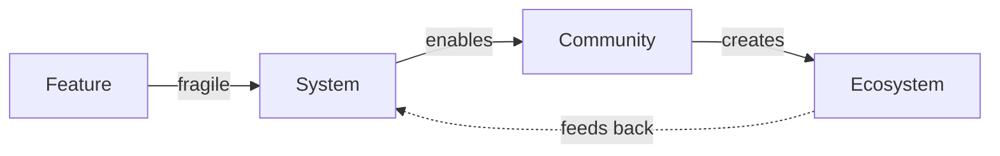

# Chapter 01: The New Paradigm

> *Last Updated: March 2026*

> Skim This Chapter
> - Principles: systems over features; trust-by-architecture; ecosystem compounding.
> - Output: a lens to evaluate opportunities in AI/Web3 convergence.

In January 2024, a solo developer in Lisbon shipped an AI agent that could negotiate smart contracts, manage a treasury, and coordinate with other autonomous agents across three blockchains. Within ninety days the agent had processed over $2 million in transactions. No board of directors. No legal team. No office. Just a founder, an inference API, and a wallet.

Five years earlier, this scenario would have been science fiction. Today it is a GitHub repository with four thousand stars.

Welcome to the new paradigm. The convergence of artificial intelligence and decentralized infrastructure has produced an entrepreneurial landscape that bears almost no resemblance to the one founders navigated a decade ago. The rules have not merely changed. The game itself is different.

## In This Chapter, You Will

- Name the core forces redefining entrepreneurship in the AI + Web3 era
- Map how systems thinking reshapes product, go-to-market, and governance
- Identify where trust must be engineered and made verifiable
- Choose near-term focus areas that compound into ecosystem leverage

## Three Principles That Define the Shift

Most startup advice still assumes the world of 2014: write code, find users, raise venture capital, scale. That playbook produced extraordinary companies, but it was designed for an era of application-layer dominance. Today's most consequential ventures operate at the infrastructure layer, and they follow a different set of principles.

### 1. Systems Over Features

The old game rewarded shipping features faster than competitors. The new game rewards designing interconnected mechanisms---protocols, incentives, and governance structures---that generate compounding value over time.

> **The shift in one sentence:** Stop asking "What feature should we build next?" and start asking "What system should we design so that others build features for us?"

Ethereum did not win by shipping a better cryptocurrency. It won by creating a programmable trust layer that thousands of teams built on top of. The lesson generalizes: a single well-designed system beats a roadmap of features because systems create surface area for external innovation while features create maintenance burden.

### 2. Trust-by-Architecture

In traditional software, trust flows from brands and legal agreements. Users trust Stripe because Stripe has a reputation. In the new paradigm, founders can design systems where trust is verifiable by default---through cryptographic proofs, transparent governance rules, and reproducible computation.

This does not mean every product needs a blockchain. It means founders should ask: *Where does our system require trust, and can we replace that trust with verification?* Verifiable AI inference, on-chain audit trails, and transparent tokenomics are tools for reducing trust assumptions---the technical surface area where users must simply take your word for it---not ends in themselves.

### 3. Ecosystem Compounding

The most durable ventures maximize the surface area for third-party creation. When outside developers, creators, and communities can build on your infrastructure, platform effects outlast any single growth hack.

This principle separates protocols that become industry standards from products that remain single-player tools. Bitcoin did not grow because of a marketing budget. It grew because anyone could build on it, and every new application reinforced the network's value.

**What this means for you:** Before optimizing your conversion funnel, ask whether your architecture allows others to create value on top of your work. If it does, their growth becomes your growth.

## The Evidence: Hard Signals of a Paradigm Shift

The transition to AI and Web3 infrastructure is not theoretical. Concrete metrics separate this shift from hype:

| **Metric** | **2020** | **2024** | **What It Means** |
|------------|----------|----------|-------------------|
| **On-chain Monthly Active Users** | ~2.5M | ~15M | Crossed the mainstream adoption threshold |
| **Layer 2 Transaction Throughput** | ~500 TPS | ~25,000 TPS | New application categories are now viable |
| **AI Inference Cost (per 1M tokens)** | $20--60 | $0.50--2.00 | Intelligence is becoming a commodity input |

These inflection points matter because they represent the crossing of utility thresholds that enable fundamentally new applications---not just cheaper versions of existing ones. When inference costs drop 95%, a solo founder gains capabilities that required a fifty-person team three years ago. When transaction throughput increases 50x, applications that were economically impossible become trivially cheap to run.

## Where AI and Web3 Converge

The paradigm shift is not two separate revolutions happening in parallel. AI and Web3 are converging into a single infrastructure stack, and the most important opportunities sit at their intersection.

**Verifiable AI.** Today, when an AI model produces an output, users have no way to confirm how that output was generated. Cryptographic proofs of inference and fine-tuning change this. Founders building marketplaces for model outputs on decentralized rails can offer something no centralized provider can: mathematical guarantees about what model produced a result and on what data it was trained.

**On-chain agents.** Autonomous AI services with their own wallets and permissions can coordinate via smart contracts---negotiating, transacting, and collaborating without human intermediaries. This is not a thought experiment. Agent-to-agent commerce is already processing real value on Ethereum and Solana.

**Open schemas as platforms.** When founders publish open data standards paired with economic incentives, they enable alternative clients, plugins, and entirely new applications built on shared infrastructure. The data standard becomes the platform. Farcaster demonstrated this with social protocols; the pattern applies to any domain where data portability creates network effects.

## Operating Principles for Today's Builders

These principles translate the paradigm shift into daily decisions:

**Design for composability.** Build with clean interfaces, stable contracts, and portable data. Composability---the ability for independent components to be combined in ways the original designers did not anticipate---is what allows ecosystems to form around your work. If another developer cannot integrate with your system in an afternoon, you have a composability problem.

**Treat ethics as infrastructure.** Privacy, consent, and recourse are not features to ship in version 2. They are load-bearing walls. Build them into the architecture from day one, because retrofitting trust is orders of magnitude harder than designing for it.

**Prefer progressive decentralization.** Ship centrally to move fast. Plan a credible path toward distributing control as the system matures. This is not hypocrisy---it is engineering pragmatism. Even Ethereum launched with a single client implementation before its ecosystem diversified.

**Make trust verifiable.** Audits, proofs, transparent governance, and aligned incentives are the new table stakes. If users must take your word for something, ask whether architecture could replace that trust assumption.

**Close the loop with learning.** Ship, measure, adapt---but do it at system boundaries, not just feature boundaries. Track how your protocol is being used, how your agents are behaving, how your incentives are aligning. The feedback loops that matter most are the ones you did not design intentionally.

## Where This Breaks: Honest Constraints

No paradigm shift is inevitable. Founders who bet their companies on convergence should understand the forces that could slow or reverse it.

**Regulatory capture.** Heavy-handed regulation could force innovation offshore or underground, fragmenting global development and limiting mainstream adoption. Founders building in regulated domains need compliance strategies, not just technical roadmaps.

**Compute bottlenecks.** Physical limits on chip production and energy availability could create supply constraints that make advanced AI accessible only to well-funded incumbents---recreating the centralization these technologies claim to solve.

**Talent concentration.** If Web3 and AI expertise remains concentrated in a handful of geographic and institutional hubs, the promised democratization rings hollow. Founders outside these hubs face real disadvantages in recruiting, fundraising, and ecosystem access.

Understanding these constraints is not pessimism. It is the strategic clarity that separates founders who build durable companies from those who ride hype cycles.

### The Strongest Case Against This Paradigm

Beyond constraints, critics offer a more fundamental challenge: that the AI/Web3 convergence thesis is fundamentally misguided because these technologies pull in opposite directions. AI concentrates power (requiring massive compute and data), while Web3 distributes it (requiring consensus among many participants). The skeptic argues these are inherently incompatible paradigms dressed up as complementary ones.

*This is a serious objection.* We address it at length in the Introduction's counter-arguments section, but founders should carry this tension as a productive question throughout the book: Where does convergence genuinely create new value, and where does it merely paper over conflicting architectures? The ventures most likely to succeed will be those that honestly navigate this tension rather than pretending it doesn't exist.

> **Opinion marker**: The convergence thesis is the authors' analytical framework, not established fact. Reasonable experts disagree about whether AI and Web3 will prove complementary or contradictory at scale. We present our case but encourage readers to evaluate the evidence independently.

## What Thiel Got Right---and Where We Go Further

Peter Thiel's *Zero to One* remains the best articulation of first-principles entrepreneurial thinking ever published. His insights on monopoly power, contrarian secrets, and definite optimism are as relevant today as they were in 2014. Chapter 03 examines these principles in depth and maps them onto the Web3 and AI landscape.

But Thiel wrote for an era of application-layer startups with centralized teams and equity-based ownership. The new paradigm demands an expanded framework---one that accounts for community governance, token economics, protocol design, and the AI-enabled solo founder. That expanded framework is what the rest of this book provides.

## Key Takeaways

### Systems Beat Features
Design interconnected mechanisms---protocols, incentives, governance---rather than racing to ship the next feature. Systems create compounding value; features create maintenance burden.

### Trust Is Now an Architecture Problem
Founders can replace trust assumptions with cryptographic verification, transparent governance, and reproducible processes. Ask where your system requires trust, then ask whether architecture can eliminate that requirement.

### The Convergence Is the Opportunity
The most consequential ventures will not be pure AI companies or pure Web3 companies. They will sit at the intersection, combining AI's ability to generate and reason with Web3's ability to verify and coordinate.

### Constraints Are Real
Regulatory capture, compute bottlenecks, and talent concentration can all slow or reverse the paradigm shift. Build with awareness of these risks, not blind optimism.

## Founder's Checklist

- [ ] Does our venture design systems that enable third-party creation, or just ship features?
- [ ] Where does our architecture require users to trust us, and can we replace that trust with verification?
- [ ] Are we building at the AI/Web3 convergence, or treating them as separate opportunities?
- [ ] Have we identified the regulatory, compute, and talent constraints specific to our domain?
- [ ] Can another developer integrate with our system in a single afternoon?

## Exercise: Paradigm Lens Assessment

Take your current venture idea (or an existing product you admire) and evaluate it against the three principles:

1. **Systems over features:** Draw a diagram of the system your product creates. Who are the third parties that could build on it? What would they build? If you cannot identify at least three plausible third-party use cases, your architecture may be too closed.

2. **Trust-by-architecture:** List every point in your system where a user must trust you or a third party. For each, write down whether that trust assumption could be replaced by a proof, an audit, or a transparent rule. Prioritize the three highest-impact replacements.

3. **Ecosystem compounding:** Describe the flywheel your system creates. Does usage by one participant make the system more valuable for other participants? If not, what architectural change would create that dynamic?

## Further Reading

- **The Infinite Machine** by Camila Russo — A narrative history of Ethereum's creation that illustrates how systems thinking and ecosystem design drove the most important Web3 platform.
- **Prediction Machines: The Simple Economics of Artificial Intelligence** by Ajay Agrawal, Joshua Gans, and Avi Goldfarb — Breaks down how AI changes the cost of prediction, providing an economic lens on the AI side of the convergence.
- **Token Economy: How the Web3 Reinvents the Internet** by Shermin Voshmgir — A thorough primer on token-based coordination mechanisms and trust-by-architecture in decentralized systems.
- **The Network State** by Balaji Srinivasan — Explores how digitally-native communities can coordinate and govern at scale, connecting ecosystem compounding to broader societal structures.

## Sources

1. Ethereum Foundation. (2024). *Ethereum Ecosystem Report 2024*. Ethereum.org.

2. L2Beat. (2024). *Layer 2 Scaling Solutions: Transaction Throughput Analysis*. l2beat.com.

3. a16z Crypto. (2024). *State of Crypto 2024*. a16z.com/state-of-crypto.

4. OpenAI. (2024). *API Pricing History and Inference Cost Trends*. platform.openai.com.

5. Thiel, P. & Masters, B. (2014). *Zero to One: Notes on Startups, or How to Build the Future*. Crown Business.

## Related Case Studies
- Bitcoin: ../case-studies/compendium.md#bitcoin
- Cosmos: ../case-studies/compendium.md#cosmos
- See the Case Studies Compendium for curated examples relevant to this chapter: ../case-studies/compendium.md

---

*This is the first chapter of Zero to Three.*

**Next:** [Chapter 02: Evolution of Entrepreneurship](ch02-evolution-of-entrepreneurship.md) — Traces how the startup playbook has evolved and introduces the Zero to Three framework for navigating today's multi-stage entrepreneurial journey.
