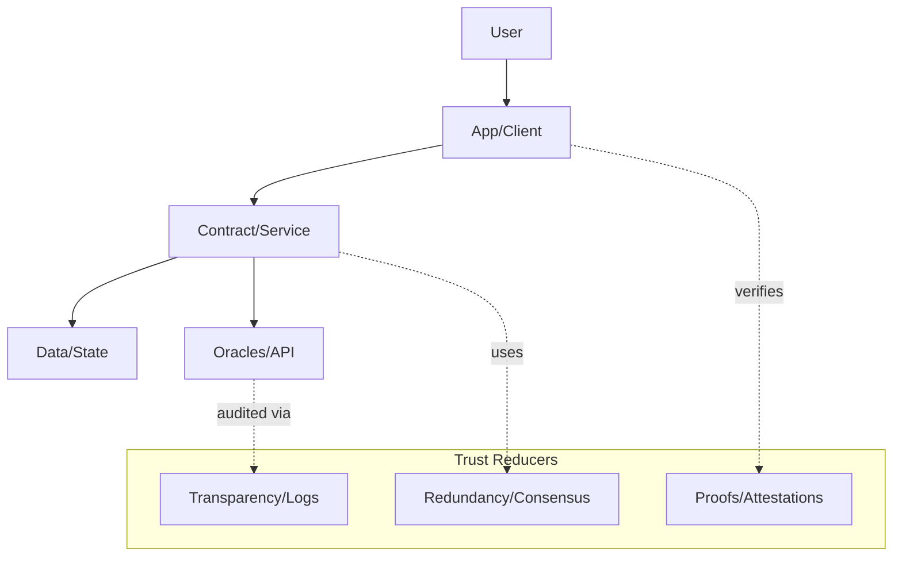
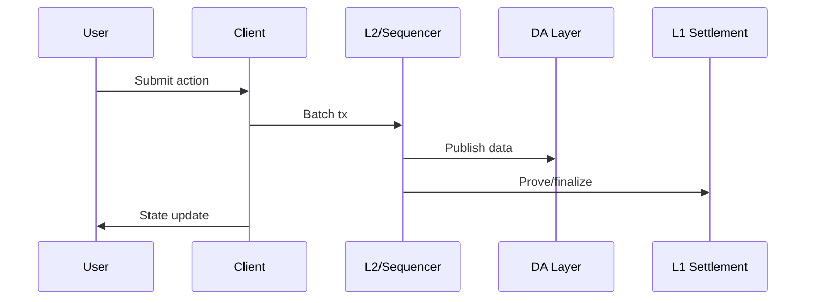

# Chapter 03: Technical Paradigm Shift

## 1. Introduction: The Collapse of Familiar Terrain

The technological landscape has undergone a seismic shift. The once-celebrated mantra of "move fast and break things"—which defined a generation of software startups throughout the 2010s—has given way to a more sobering imperative: "move wisely or perish." This transformation didn't happen gradually; it occurred with remarkable speed, catalyzed by the convergence of several forces in 2021-2022: the end of near-zero interest rates, the maturation of frontier technologies, and the fracturing of the global technology commons.

For entrepreneurs who cut their teeth building mobile apps or SaaS platforms, this new terrain feels almost unrecognizable. Success no longer hinges primarily on user acquisition or iterative improvement of digital experiences. Instead, it increasingly depends on mastery of infrastructure layers, understanding of global supply chains, navigation of complex geopolitical realities, and design of resilient systems that can withstand both technical and regulatory challenges.

This chapter examines the new rules of technology entrepreneurship—exploring how the fundamental building blocks of innovation have changed and what this means for founders navigating the Web3 and AI era. Through case studies spanning sovereign AI development, cryptocurrency exchange collapse, semiconductor manufacturing, and GPU-powered AI infrastructure, we'll uncover the patterns that define successful ventures in this new landscape.

The stakes have never been higher. As technological capabilities grow more powerful, so too does their potential impact—both positive and negative. Founders are no longer building mere applications; they're creating infrastructure that may ultimately reshape economies, governance systems, and social structures. With this power comes unprecedented responsibility and complexity.

## In This Chapter, You Will

- Recognize how AI and Web3 represent infrastructure layers, not just tools
- Understand the shift from application-layer to protocol/model-layer dominance
- Learn from detailed case studies of paradigm-defining companies and failures
- Master new principles for building in the infrastructure-centric era

## Founder's Checklist

- Are we building infrastructure or just applications on infrastructure?
- How do geopolitical forces affect our technology dependencies?
- What physical constraints underpin our seemingly digital systems?
- How do we balance speed with the stewardship our systems require?

## Reference Diagrams

Trust model (what is trusted, and how to reduce it):

Peer‑to‑peer data flow (simplified L2 to app):

## Infra vs App Primitives (By Use Case)

| Use Case | Infra Primitive | App Primitive |
|---|---|---|
| Payments | L2 + DA layer, stablecoins | Custody UX, risk limits, refunds |
| AI Agents | Oracles, verifiable compute, key mgmt | Agent policy, memory, task routing |
| Identity | DID/VC standards | Wallet UX, consent flows, recovery |
| Data | Content addressing, availability | Schemas, moderation, access control |
| Governance | Timelocks, multisig, modules | Roles, proposals, quorum design |

## 2. AI and Web3 Are Not Tools—They Are Infrastructures

The most profound shift in today's technology landscape is conceptual: AI and Web3 are not simply tools that entrepreneurs can incorporate into products—they represent entirely new infrastructure layers upon which entire ecosystems will be built. This distinction has far-reaching implications for how founders should approach venture creation and development.

### Shift from "App Layer" to "Protocol Layer" and "Model Layer" Dominance

For over a decade, the application layer dominated technology entrepreneurship. Founders could create significant value by building consumer or enterprise applications on top of established infrastructure: cloud computing platforms, mobile operating systems, payment processors, and identity systems. The primary challenges were user experience design, growth optimization, and business model refinement.

Today, the center of gravity has shifted downward to what we might call the "protocol layer" in Web3 and the "model layer" in AI:

**In Web3**, the most valuable innovation happens at the level of protocols—systems that define how information and value flow through decentralized networks. Successful protocols like Ethereum, Celestia, and Chainlink create foundational infrastructure that enables thousands of applications rather than serving end-users directly.

**In AI**, the equivalent transformation has occurred through foundation models—large-scale machine learning systems trained on vast datasets that serve as platforms for multiple downstream applications. Models like those from OpenAI, Anthropic, and DeepSeek provide general-purpose capabilities that can be specialized for countless use cases.

This infrastructural shift means that founders must think differently about value creation and competitive advantage. Network effects, standardization, and ecosystem development often matter more than direct monetization or user experience optimization.

### LLMs and Blockchain Systems as Emergent Operating Systems

As these technologies mature, they increasingly function as operating systems—providing core services that applications can build upon through standardized interfaces:

**Large Language Models** now offer reasoning, content generation, and information processing capabilities through APIs, effectively serving as cognitive operating systems for a new generation of applications. Rather than programming specific behaviors, developers increasingly "prompt" these models to perform complex tasks, creating a fundamentally different development paradigm.

**Similarly, blockchain systems** provide programmable trust, value transfer, and coordination mechanisms through smart contracts and tokenization. These primitives enable new forms of organization, economic activity, and governance that weren't possible in traditional computing environments.

These infrastructure layers exhibit operating system-like characteristics: they mediate access to valuable resources, create standardized interfaces for developers, exhibit strong network effects, and become more valuable as their ecosystems grow. This parallel suggests that similar dynamics may govern their evolution and value capture.

### Founders as Infrastructure Architects

For entrepreneurs building in this landscape, the implications are profound. Success increasingly requires thinking like an infrastructure architect rather than a product designer. This means:

**Long-Term Horizon:** Infrastructure development typically requires longer timeframes than application development, with years rather than months needed to achieve meaningful adoption.

**System Design Focus:** Technical decisions must consider not just immediate functionality but long-term scalability, security, governance, and ecosystem health.

**Stakeholder Orchestration:** Infrastructure builders must align diverse stakeholders—developers, investors, regulators, and end-users—around shared standards and value creation models.

**Capital Intensity:** Building foundational technologies often requires more significant investment than application development, with corresponding changes to funding strategies and business models.

This shift doesn't mean applications no longer matter—successful ecosystems need both infrastructure and applications that make that infrastructure accessible and valuable. However, it does suggest that the greatest opportunities and challenges often lie in building the foundations rather than individual use cases.

## 3. DeepSeek: China's Sovereign AI Infrastructure

### Overview

DeepSeek represents a fascinating case study of how geopolitical imperatives can shape technological development. Founded in China with backing from both private venture capital and indirect support from state-aligned entities, DeepSeek has developed open-weight large language models designed to ensure China's AI independence in an increasingly fragmented global technology landscape.

Unlike closed-source AI systems typical in Western markets, DeepSeek emphasizes transparency in training methodology, architecture, and evaluation. Their models' weights and architectures are publicly available, enabling academic institutions, government entities, and businesses throughout China's technology ecosystem to analyze, refine, and deploy these systems without dependency on potentially restricted Western alternatives.

### Key Themes

**Infrastructure as Geopolitics**

DeepSeek's emergence reflects the growing recognition that AI foundation models represent critical national infrastructure. As tensions between China and Western countries increased, concerns about potential restrictions on advanced AI technologies accelerated efforts to develop domestic alternatives to models from OpenAI, Anthropic, and other Western leaders.

This dynamic highlights how infrastructure development now extends beyond purely commercial or technical considerations to encompass national security and technological sovereignty. For founders, this suggests that understanding geopolitical context has become essential to navigating frontier technology markets.

**Open-Source as a Trust-Building Mechanism**

Interestingly, DeepSeek's open-weight approach contrasts with the increasingly closed models dominant in Western markets. This openness serves multiple strategic purposes:

- It accelerates adoption by allowing researchers and developers to verify model behavior directly
- It facilitates customization for specific applications across different industries
- It builds trust in the domestic ecosystem by enabling independent validation
- It potentially accelerates innovation through collaborative improvement

This strategy recognizes that in foundation technologies, community trust and ecosystem development often matter more than direct intellectual property protection.

**Vertical Integration of Compute, Research, and Deployment**

DeepSeek's approach isn't limited to model development but encompasses the entire AI stack—from specialized hardware optimization to research methodologies to deployment frameworks. This vertical integration strategy ensures resilience against potential supply chain disruptions and creates compounding advantages as each layer of the stack can be optimized for the others.

### Lessons

**Open Systems Can Rival Closed Ones**

DeepSeek's approach challenges the assumption that AI leadership requires closely guarded proprietary technology. Their open-weight models demonstrate that transparency and ecosystem engagement can create different but equally powerful competitive advantages. For entrepreneurs, this suggests considering alternative intellectual property strategies beyond traditional closed-source approaches.

**National Strategy and Startup Ambition Can Align**

The DeepSeek case illustrates how entrepreneurs can succeed by aligning venture objectives with broader national strategic priorities. In an era of increased government involvement in technology development, understanding how startup goals may complement policy objectives can unlock resources and market opportunities that might otherwise be inaccessible.

**Community and Trust Matter More in Foundational Systems**

Perhaps most importantly, DeepSeek demonstrates that community development and trust-building become disproportionately important when building infrastructure-level technologies. Unlike consumer applications where marketing and user experience might drive adoption, foundation technologies require deep confidence from developers and institutional users before they achieve meaningful traction.

## 4. The FTX Collapse: Growth Without Grounding

### Overview

Few cautionary tales in recent technology history offer as many lessons as the meteoric rise and catastrophic collapse of FTX. Founded in 2019 by Sam Bankman-Fried, the cryptocurrency exchange grew to a $32 billion valuation in just three years, only to implode spectacularly in November 2022 amid revelations of misappropriated customer funds, nonexistent risk controls, and fundamental corporate governance failures.

FTX's collapse sent shockwaves through the cryptocurrency industry and beyond, destroying billions in value and undermining trust in an ecosystem already struggling with credibility challenges. The exchange's failure wasn't merely a business setback but a systemic failure that revealed profound weaknesses in how technology ventures approached governance, regulatory compliance, and operational infrastructure during the easy-money era.

### Key Themes

**Fragile Institutions in a Trustless Economy**

The irony of FTX's collapse lies in its positioning within an industry ostensibly built around trustless systems and transparent ledgers. Despite blockchain technology's promise to reduce reliance on trusted intermediaries, cryptocurrency exchanges like FTX represented highly centralized points of failure requiring extraordinary trust from users.

This contradiction exemplifies a broader pattern in the Web3 space: while the underlying protocols often embody decentralization principles, many of the businesses built on these protocols reverted to traditional centralized structures without corresponding governance safeguards. The result was a dangerous combination of new technological risks and old institutional weaknesses.

**The Illusion of Decentralization Without Transparency**

FTX marketed itself as part of the decentralized financial revolution while operating with less transparency and oversight than conventional financial institutions. The exchange maintained an opaque corporate structure spanning multiple jurisdictions specifically designed to minimize regulatory scrutiny, while concentrating decision-making power in an extremely small group of insiders.

This pattern—claiming the revolutionary potential of decentralization while practicing extreme centralization—created a disconnect between narrative and reality that ultimately proved unsustainable. For founders, this suggests that alignment between technological values and organizational structure is essential for long-term credibility.

**The End of the "Easy Money" Bull Run and Its Moral Hazard**

FTX's rise coincided with an unprecedented period of low interest rates, abundant venture capital, and speculative cryptocurrency investments. This environment created moral hazard by rewarding growth at all costs while minimizing scrutiny of fundamental business practices and infrastructure.

As market conditions tightened in 2022, these underlying weaknesses became exposed, revealing that many of the practices that enabled rapid growth were fundamentally unsustainable. This pattern extended beyond FTX to numerous ventures that prioritized expansion over operational excellence during the bull market.

### Lessons

**Governance Is Infrastructure**

Perhaps the most crucial lesson from FTX's collapse is that governance systems—boards, financial controls, risk management, and compliance frameworks—represent essential infrastructure rather than optional bureaucracy. The absence of these systems at FTX wasn't merely an operational oversight but a fundamental architectural flaw that made collapse inevitable.

For founders building in complex and regulated domains, this suggests that governance infrastructure deserves the same attention as technical infrastructure. Both are essential foundations for sustainable growth.

**Speed Kills When Systems Are Immature**

FTX's breathtaking growth—from founding to $32 billion valuation in three years—became a liability when not matched by corresponding development of operational systems and controls. This mismatch between growth rate and organizational maturity created vulnerabilities that might have been manageable in a slower-growing entity but proved catastrophic at scale.

This pattern suggests that founders should carefully match growth rates to operational capabilities, particularly in domains involving significant financial or regulatory risk. Sometimes the wisest strategic choice is to grow more slowly to ensure system integrity.

**Trust ≠ Hype, Especially in Financial Systems**

FTX maintained apparent credibility through high-profile partnerships, celebrity endorsements, and aggressive marketing rather than through transparent operations or robust controls. This approach worked until it suddenly didn't—when questions emerged about the company's financial stability, the lack of substantive trust foundations triggered a rapid collapse.

For entrepreneurs, this highlights the distinction between perception and reality in trust relationships. While marketing can create temporary impressions, sustainable trust requires demonstrable integrity, particularly in financial or other high-stakes domains.

## 5. NVIDIA: From GPUs to the AI Empire

### Overview

Few companies embody the infrastructure-centric paradigm shift more perfectly than NVIDIA. Founded in 1993 as a graphics processor company focused on gaming, NVIDIA has transformed itself into the backbone of the AI revolution through a series of strategic pivots. Under CEO Jensen Huang's leadership, the company recognized that the parallel processing capabilities of graphics processing units (GPUs) could be applied to machine learning tasks, positioning NVIDIA at the center of the AI compute ecosystem.

This transformation has been nothing short of extraordinary. By 2023, NVIDIA's market capitalization exceeded $1 trillion, making it one of the world's most valuable companies. More significantly, NVIDIA has established itself as the essential infrastructure provider for AI development, with its GPUs powering everything from research labs to production deployments of the most advanced foundation models.

### Key Themes

**Foundational Leverage: Control the Scarce Resource (Compute)**

NVIDIA's success stems from a fundamental insight: artificial intelligence development is constrained primarily by computational resources. By developing specialized hardware optimized for the mathematical operations underlying neural networks, NVIDIA gained leverage over the entire AI value chain.

As models grew larger and more complex—from millions to billions to trillions of parameters—this computational advantage became increasingly decisive. Organizations developing frontier AI systems found themselves structurally dependent on NVIDIA's hardware, creating extraordinary pricing power and market dominance.

This dynamic highlights the strategic importance of identifying and controlling genuinely scarce resources in emerging technology stacks. While many companies focus on applications, those that secure critical infrastructure components often capture disproportionate value.

**Software-Hardware Synergy: CUDA, TensorRT, Ecosystem Lock-In**

NVIDIA's dominance isn't based solely on superior hardware. The company's creation of CUDA (Compute Unified Device Architecture)—a parallel computing platform and programming model—established a software ecosystem that dramatically accelerated AI development while creating powerful switching costs for developers.

By investing in comprehensive software stacks including libraries, frameworks, and development tools, NVIDIA transformed GPUs from specialized hardware components into complete platforms for AI research and deployment. This integrated approach made adoption easier while making migration to alternative solutions increasingly difficult.

This strategy demonstrates how software and hardware co-evolution can create more defensible positions than either component alone. For entrepreneurs, this suggests looking for opportunities where integrated approaches can solve problems more effectively than point solutions.

**Monetizing Platform Scale in AI's Cambrian Explosion**

As AI applications proliferated across industries—from autonomous vehicles to healthcare to financial services—NVIDIA maintained its central position through a platform strategy that supported diverse use cases rather than focusing on specific applications. This approach allowed the company to capture value from the entire ecosystem rather than competing with its customers.

By providing the tools and infrastructure for others to innovate, NVIDIA benefited from every new AI breakthrough regardless of which company developed it. This platform-centric approach exemplifies how infrastructure providers can thrive amidst rapid technological change by enabling innovation rather than trying to predict specific winners.

### Lessons

**Infrastructure Players Eat Entire Value Chains**

NVIDIA's trajectory demonstrates how companies that control critical infrastructure layers can capture extraordinary value compared to application-level innovators. While thousands of AI startups have emerged, many remain fundamentally dependent on NVIDIA's ecosystem, allowing the infrastructure provider to extract a significant share of the overall economic value.

For entrepreneurs, this suggests carefully evaluating where to position ventures within technology stacks. Infrastructure layers often offer greater defensibility and value capture potential, though they typically require more capital, longer timeframes, and different go-to-market strategies than application-level innovations.

**Developer Ecosystems > Features**

NVIDIA's investment in developer tools, libraries, and education created network effects that proved more defensible than simple hardware performance advantages. By making its technology accessible and productive for researchers and engineers, the company built relationships that transcended transactional purchases.

This approach highlights the increasing importance of developer experience and ecosystem development in technology strategy. Features can be copied, but vibrant developer communities create compounding advantages that competitors struggle to replicate.

**Hardware-as-Destiny in the AI Era**

Perhaps most fundamentally, NVIDIA's rise reminds us that despite software's flexibility, hardware capabilities ultimately define the boundaries of technological possibility. The explosion of AI capabilities in recent years correlates directly with increased computational resources, with hardware improvements enabling conceptual breakthroughs that were previously impractical.

This reality challenges pure software determinism and suggests that entrepreneurs working in frontier technologies should develop deep understanding of hardware constraints and opportunities. Sometimes the most transformative software innovations require corresponding hardware evolution.

## 6. TSMC: The Fab That Shapes the World

### Overview

Taiwan Semiconductor Manufacturing Company (TSMC) represents perhaps the purest example of how critical infrastructure shapes technological possibility. Founded in 1987, TSMC pioneered the "pure-play foundry" business model, focusing exclusively on manufacturing semiconductors designed by other companies rather than creating its own chips.

This specialization strategy has made TSMC the world's most advanced semiconductor manufacturer, producing chips for companies like Apple, AMD, NVIDIA, and Qualcomm. More significantly, TSMC has achieved near-monopoly status in leading-edge semiconductor manufacturing, with over 90% market share in the most advanced process nodes.

TSMC's strategic importance extends far beyond business metrics. As digital technologies permeate every aspect of the modern economy, the company's manufacturing capabilities have become essential global infrastructure with profound geopolitical implications. This case study illuminates how physical production capabilities underpin seemingly virtual technologies and how geographic concentration of critical infrastructure creates both opportunities and vulnerabilities.

### Key Themes

**Geographic Fragility in Critical Infrastructure**

TSMC's dominance highlights a paradox of the modern technology ecosystem: despite the supposed globalization of the digital economy, its most critical physical infrastructure remains highly concentrated geographically. The majority of advanced semiconductor manufacturing occurs in a handful of facilities in Taiwan, creating single points of failure in global supply chains.

This concentration stems from the extraordinary complexity and capital requirements of semiconductor manufacturing. Leading-edge chip fabrication requires tens of billions of dollars in investment, decades of accumulated expertise, and ecosystem advantages that have proven extremely difficult to replicate in new locations.

The resulting geographic fragility has profound implications for technology strategy, particularly as geopolitical tensions involving Taiwan have increased. Companies and countries dependent on advanced semiconductors face systemic risks that cannot be easily mitigated through conventional supply chain diversification.

**Industrial Policy Meets Technological Supremacy**

TSMC's development reflects the intersection of deliberate industrial policy and technological capability building. Taiwan's government played a crucial role in the company's early formation, recognizing semiconductors as a strategic industry and providing supportive policies while allowing the company to operate with commercial discipline.

This successful integration of state strategic planning and private sector execution offers important lessons as more countries pursue industrial policies aimed at technological development. Rather than choosing between market-driven innovation and government direction, TSMC demonstrates how these approaches can complement each other when properly structured.

For entrepreneurs, this suggests opportunities in working with rather than against strategic government initiatives, particularly in infrastructure domains where policy support can provide crucial advantages in capital-intensive industries.

**How Physical Supply Chains Underwrite Digital Futures**

Perhaps most fundamentally, TSMC reminds us that even the most virtual technologies depend on physical manufacturing capabilities. Advances in artificial intelligence, cloud computing, mobile devices, and virtually every other digital domain ultimately rely on semiconductor improvements that cannot be created through software alone.

This physical foundation means that technology development remains subject to material constraints, supply chain dynamics, and manufacturing expertise that purely digital businesses might prefer to ignore. As Marc Andreessen's famous observation that "software is eating the world" comes to fruition, we must recognize that hardware enables that consumption.

### Lessons

**Resilience Must Be Built into Every Layer—From Chip to Cloud**

TSMC's critical role in global technology supply chains highlights the importance of resilience planning across the entire technology stack. Founders building on advanced hardware must consider not just immediate suppliers but the entire chain of dependencies that enable their products or services to function.

This perspective suggests incorporating supply chain risk assessment into technology strategy rather than treating it as a separate operational concern. Architectural choices, business continuity planning, and even product design may need to account for potential disruptions in foundational infrastructure.

**Geopolitical Strategy Is Inseparable from Technical Capability**

The concentration of advanced semiconductor manufacturing in geopolitically sensitive locations demonstrates how technical capabilities and international relations have become inextricably linked. Technology companies can no longer operate as if immune from geopolitical considerations, particularly when building on or creating critical infrastructure.

For entrepreneurs, this suggests developing geopolitical literacy alongside technical expertise. Understanding how global dynamics might affect access to essential technologies, markets, or talent has become a core strategic competency rather than a peripheral consideration.

**Founders Must Understand the Cost of Dependencies**

Most significantly, TSMC's case illustrates that technology builders must thoroughly understand the dependencies they create through their architectural and sourcing decisions. The apparent convenience of standardizing on particular components or platforms may create hidden vulnerabilities if those dependencies involve concentrated or potentially unstable supply chains.

This doesn't mean avoiding dependencies altogether—specialization and comparative advantage remain powerful economic forces. However, it does suggest that founders should make dependency decisions with full awareness of potential risks and, where possible, develop contingency options for critical components.

## 7. New Principles for the Next Builders

The case studies examined in this chapter reveal patterns that translate into actionable principles for entrepreneurs building in the Web3 and AI era. These principles don't replace fundamental startup wisdom but rather complement it with insights specific to today's infrastructure-centric technological landscape.

### Decentralize Carefully: Decentralization Without Design Creates Chaos

Web3 technologies enable unprecedented decentralization of coordination, governance, and value distribution. However, the FTX collapse demonstrates that decentralization requires thoughtful design rather than mere technical implementation. Without appropriate structures and incentives, decentralized systems can create new forms of concentration and fragility rather than genuine resilience.

Successful decentralization requires:
- Clear governance mechanisms with appropriate checks and balances
- Transparent operations that enable community oversight
- Incentive structures that align participant behavior with system health
- Graduated resilience measures that address various failure scenarios

Entrepreneurs building decentralized systems should approach them as governance design challenges as much as technical problems. The technology enables decentralization, but human systems determine whether it functions effectively.

### Build Beneath the Surface: Real Value Accrues at the Infra Layer

NVIDIA's transformation from component supplier to essential infrastructure provider demonstrates how controlling foundational layers of technology stacks can create extraordinary value. While application-level innovation remains important, infrastructure positions often offer greater defensibility and value capture potential.

For founders, this suggests carefully considering where to position ventures within technology stacks:
- Protocol and foundation model layers may offer the greatest long-term value
- Middleware that connects infrastructure to applications often creates strategic leverage
- Application layers may provide faster market validation but face commoditization pressure

This doesn't mean every entrepreneur should build infrastructure—these positions typically require more capital, longer timeframes, and different distribution strategies. However, it does suggest evaluating whether opportunities exist to establish infrastructural rather than merely incremental positions.

### Understand Physical Dependencies: Silicon, Power, Regulation All Shape Software

TSMC's critical role in the technology ecosystem reminds us that even the most virtual innovations depend on physical infrastructure with its own constraints and dynamics. Semiconductor manufacturing, data centers, energy supplies, and other material foundations enable digital technologies while imposing their own limitations.

Entrepreneurs should develop awareness of these physical dependencies by:
- Mapping supply chains for critical components and identifying concentration risks
- Understanding energy requirements and constraints for compute-intensive applications
- Recognizing how geographic dispersion of physical infrastructure affects system resilience
- Incorporating hardware evolution timelines into technology roadmaps

This perspective helps avoid planning based on purely theoretical capabilities without accounting for practical constraints on their implementation.

### Balance Speed and Stewardship: Build Fast Enough to Lead, Slow Enough to Last

The FTX collapse illustrates the dangers of prioritizing growth above all else, particularly in domains involving significant financial or societal impact. Conversely, NVIDIA's patient development of AI infrastructure over many years demonstrates how sustained investment in foundational capabilities can create dominant positions.

Founders should seek balance between pace and sustainability by:
- Matching growth rates to operational maturity and governance capabilities
- Investing in compliance and risk management as integral to system architecture
- Developing metrics that capture system health alongside growth indicators
- Creating cultural values that emphasize long-term integrity over short-term gains

This balanced approach acknowledges the competitive importance of speed while recognizing that durable value creation requires sustainable foundations.

### Design for Resilience: Your Weakest System Will Define Your Failure

Each case study reveals how system-level resilience—or its absence—ultimately determines success or failure. FTX collapsed due to governance weaknesses despite technical capabilities. TSMC's geographic concentration creates vulnerabilities despite manufacturing excellence. DeepSeek's open-source approach builds resilience against supply chain disruptions but creates different challenges around value capture.

Entrepreneurs can enhance system resilience by:
- Conducting regular vulnerability assessments across technical, operational, financial, and regulatory dimensions
- Designing redundancy and fallback mechanisms for critical systems
- Creating transparency that enables early identification of potential failures
- Establishing organizational processes that support continuous improvement

This resilience-focused approach acknowledges that in complex systems, failures often emerge from interactions between components rather than individual weaknesses.

## 8. Key Takeaways

### We Are in a New Era Where Infrastructure Is Identity

The defining characteristic of today's technological landscape is the shift from applications to infrastructure as the primary locus of value creation and competitive advantage. The companies that define this era—NVIDIA in AI compute, TSMC in semiconductor manufacturing, Ethereum in programmable blockchain—derive their strategic positions from control of fundamental infrastructure layers rather than end-user experiences.

This infrastructure-centric paradigm means that technical architecture decisions increasingly define company identity and destiny. Strategic choices about what layers of the technology stack to occupy, what dependencies to accept, and what systems to control often matter more than traditional business model or market positioning decisions.

### The Best Founders Today Are Builders of Long-Range Systems, Not Short-Term Trends

The most significant opportunities in today's landscape require longer time horizons and more systemic thinking than previous technology waves. Building infrastructure for AI development, creating blockchain protocols, or establishing new semiconductor manufacturing capabilities demands multi-year commitment and patience that contrasts with the rapid iteration cycles of mobile app or web service development.

Successful founders in this environment think in terms of decades rather than quarters, focusing on fundamental capabilities rather than temporary advantages. They design systems that can evolve through multiple technology cycles while maintaining core value propositions.

### To Lead This Shift, You Must Understand Geopolitics, Governance, and Deep Tech

The technical paradigm shift has expanded the knowledge requirements for effective leadership. Founders must now complement traditional business and product expertise with understanding of:

**Geopolitical Dynamics:** How international relations and national strategies affect technology access, market opportunities, and regulatory environments

**Governance Systems:** How decision rights, accountability mechanisms, and incentive structures shape organizational and technological outcomes

**Deep Technology:** How fundamental scientific and engineering constraints determine what's possible and how capabilities may evolve

This expanded skill set doesn't mean founders must become experts in every domain, but it does require sufficient literacy to make informed strategic decisions and assemble appropriate teams.

### Build Not Just for Innovation—But for Integrity, Scale, and Time

Perhaps most fundamentally, the current paradigm requires founders to broaden their definition of success beyond traditional metrics of innovation and growth. As technological capabilities increase, so too does responsibility for their deployment and impact.

Building for integrity means creating systems with appropriate safeguards, transparency, and accountability rather than maximizing short-term growth or flexibility. Building for scale means designing architectures that can serve billions of users rather than thousands. Building for time means creating foundations that can evolve and endure through multiple technology cycles rather than riding single waves.

These expanded success criteria reflect the increasing importance of technological infrastructure in global economic and social systems. As founders create the foundations upon which others will build, their decisions shape not just company outcomes but broader technological trajectories.

The technical paradigm shift described in this chapter creates both unprecedented challenges and extraordinary opportunities for entrepreneurs. The increasing importance of infrastructure layers, the convergence of physical and digital systems, and the growing intersections between technology and geopolitics have transformed the landscape in which founders operate.

Those who understand these shifts—who build with awareness of infrastructure leverage points, physical dependencies, and system resilience requirements—will be positioned to create ventures with lasting impact. By moving beyond application-level thinking to infrastructure-level strategy, entrepreneurs can build technologies that don't merely participate in transformation but fundamentally enable it.

In subsequent chapters, we'll explore how these principles operate at each stage of the Zero to Three journey—from personal development through product creation to community building and systemic leadership.

## Exercises

- Map your venture's position in the technology stack: are you building infrastructure, platforms, or applications?
- Identify the 3 most critical dependencies in your system and assess their concentration risks
- Design a resilience stress test: what would break your system and how would you recover?
- Create a 5-year technology roadmap that accounts for both infrastructure evolution and geopolitical constraints

## Related Case Studies
- DeepSeek: ../case-studies/compendium.md#deepseek
- FTX (Cautionary Tale): ../case-studies/compendium.md#ftx-cautionary-tale
- NVIDIA / TSMC: ../case-studies/compendium.md#nvidia--tsmc
- Cursor (Anysphere): ../case-studies/ai-infrastructure-case-studies.md#anysphere-cursor-redefining-development-tools
- Modal Labs: ../case-studies/ai-infrastructure-case-studies.md#modal-labs-serverless-computing-for-ai
- See the Case Studies Compendium for curated examples relevant to this chapter: ../case-studies/compendium.md

## Sources

### Books and Industry Analysis
1. Huang, Jensen. NVIDIA earnings calls and investor presentations, 2020-2024.
2. Liu, Chang. *The TSMC Way: How a Taiwanese Chipmaker Became a Global Powerhouse*. McGraw Hill, 2023.
3. Mack, Chris. *The Guide to Semiconductor Manufacturing*. SPIE Press, 2020.
4. Miller, Chris. *Chip War: The Fight for the World's Most Critical Technology*. Scribner, 2022.
5. Andreessen, Marc. "Why Software Is Eating the World." Wall Street Journal, 2011.

### AI and Deep Learning Research
1. Attention Is All You Need (Transformer Paper). Vaswani et al., 2017.
2. Brown, Tom, et al. "Language Models are Few-Shot Learners" (GPT-3 Paper). arXiv, 2020.
3. DeepSeek Technical Reports and Model Cards. deepseek.com, 2023-2024.
4. OpenAI GPT-4 Technical Report. OpenAI, 2023.
5. Various foundation model research from Google DeepMind, Anthropic, Meta AI.

### Web3 and Blockchain Infrastructure
1. Buterin, Vitalik. "Ethereum: A Next-Generation Smart Contract and Decentralized Application Platform." 2013.
2. Wood, Gavin. "Ethereum: A Secure Decentralised Generalised Transaction Ledger." 2014.
3. Celestia Whitepaper: "A Modular Blockchain Network." 2019.
4. Cosmos Network Documentation and Inter-Blockchain Communication Protocol specifications.
5. Layer 2 scaling solutions technical documentation (Polygon, Arbitrum, Optimism).

### Financial and Market Analysis
1. FTX bankruptcy court filings and examiner reports, 2022-2023.
2. Federal Reserve Economic Data on interest rates and monetary policy, 2010-2024.
3. Venture capital industry reports from PitchBook, CB Insights on funding trends.
4. Cryptocurrency market analysis from various industry sources.
5. TSMC and semiconductor industry financial reports and analyst coverage.

### Geopolitical and Supply Chain
1. U.S. CHIPS and Science Act documentation and analysis, 2022.
2. Taiwan-China relations impact on semiconductor supply chains - academic and policy analysis.
3. Export control regulations on advanced semiconductors - U.S. Commerce Department.
4. China's AI and semiconductor development strategies - government policy documents.
5. Global supply chain resilience studies from McKinsey, BCG, and academic institutions.

### Technology Infrastructure Studies
1. Data center energy consumption and sustainability reports.
2. Cloud computing infrastructure evolution - AWS, Google Cloud, Azure documentation.
3. GPU computing architecture evolution - CUDA documentation and academic papers.
4. Blockchain consensus mechanisms and their energy/security trade-offs.
5. Edge computing and distributed systems research papers.

### News and Industry Coverage
1. "The AI Boom and Its Infrastructure Requirements." *The Information*, various articles 2023-2024.
2. "FTX Collapse: Timeline and Analysis." *Financial Times*, November 2022 - ongoing.
3. "Global Semiconductor Competition." *The Economist*, various articles 2022-2024.
4. Technology industry coverage from *TechCrunch*, *Ars Technica*, *Wired*.
5. Cryptocurrency and DeFi analysis from *CoinDesk*, *The Block*, *DeFi Pulse*.
