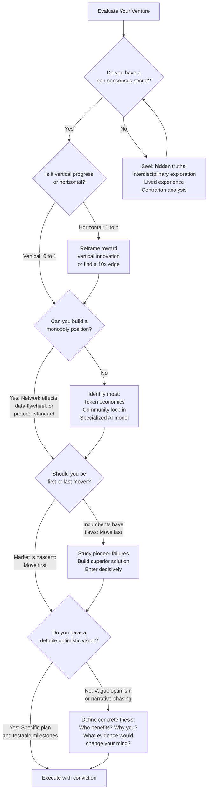

# Chapter 03: Timeless Wisdom from "Zero to One"

> *Last Updated: March 2026*

> **Skim This Chapter**
> - Peter Thiel's core principles -- monopoly, secrets, vertical progress, last mover advantage, and definite optimism -- remain powerful strategic guides for Web3 and AI founders, though their application has evolved.
> - Output: A set of stress-tested Thielian frameworks you can apply to your own venture's positioning, innovation strategy, and competitive advantage.

## 1. The Foundation We Build On

In 2012, a Stanford computer science student sat in Peter Thiel's CS 183 lecture and heard something that contradicted everything his economics professors had taught him: competition destroys profits, and the companies that change the world are the ones that escape competition entirely. Two years later, Thiel published those lectures as *Zero to One*, and the book rewired how a generation of founders thought about building companies.

A decade later, the technological landscape looks nothing like 2014. Blockchains have created programmable trust. Large language models have commoditized cognitive labor. Solo founders wield tools that rival what hundred-person teams deployed five years ago. Yet when you strip away the surface changes, Thiel's deepest insights---about monopoly, about secrets, about the difference between copying and creating---remain as sharp as ever.

This chapter examines five Thielian principles that every founder building in Web3 and AI should internalize. For each, we explore the original insight and then stress-test it against today's landscape, asking: does this still hold? And if so, how does its application change when the game board looks fundamentally different?

> **Why this chapter matters now:** The new paradigm described in Chapter 01 does not replace these principles. It transforms how they manifest. Understanding the foundation helps you see where the new rules diverge---and where timeless strategy still applies.

## 2. The Power of Monopolies: Striving for Market Dominance

### Thiel's Perspective

Perhaps Thiel's most controversial assertion was his celebration of monopolies as drivers of innovation and progress. Contradicting conventional economic wisdom that praises perfect competition, Thiel argued that "competition is for losers"—companies in perfectly competitive markets struggle to differentiate themselves, driving down profits and limiting resources for long-term innovation.

True monopolies, according to Thiel, don't stifle innovation through rent-seeking; rather, they enable it by providing the stability and resources necessary for ambitious research and development. Google's dominance in search, for example, generated the profits that funded its exploration of autonomous vehicles, life extension research, and artificial intelligence—innovations that might never have emerged from a fragmented search market with razor-thin margins.

### Characteristics of Successful Monopolies

Thiel identified several key characteristics that enable companies to establish and maintain monopolistic positions:

**Proprietary Technology**: Creating technological advantages that competitors cannot easily replicate provides the most durable form of monopoly. Thiel suggested that these advantages should be at least 10x better than existing alternatives to overcome switching costs and inertia.

**Network Effects**: Products that become more valuable as more people use them create powerful feedback loops that reinforce early advantages. Classic examples include telephone networks, social media platforms, and marketplaces where increased participation on one side attracts more participants on the other.

**Economies of Scale**: Businesses with high fixed costs and low marginal costs benefit disproportionately from growth, as fixed costs are spread across more units. Software exemplifies this dynamic, with development costs that remain relatively constant regardless of user numbers.

**Strong Branding**: Distinctive and compelling brand identities create emotional connections with users that transcend rational product comparisons. Apple's brand, for instance, enables premium pricing and customer loyalty that extend beyond feature-by-feature competition.

### Application in Web3/AI

In the Web3 and AI era, Thiel's monopoly concept manifests in nuanced ways that both reinforce and challenge his original formulation.

For blockchain protocols, network effects remain paramount but operate differently than in Web2 platforms. Bitcoin's dominance as a store of value, for example, stems largely from its status as the first cryptocurrency and its unparalleled security, which increases with network growth. However, unlike traditional monopolies, blockchain protocols are often open-source and permissionless, making proprietary technology a less viable moat.

Instead, Web3 monopolies frequently emerge through community adoption, protocol standardization, and liquidity concentration. Ethereum's dominance in smart contracts persists despite technical limitations because of its developer ecosystem, established standards (like ERC-20 and ERC-721), and the liquidity present in its DeFi applications. These advantages create powerful switching costs even without centralized control.

In artificial intelligence, monopolistic advantages manifest through data flywheels, compute resources, and talent concentration. Companies with access to vast proprietary datasets can train more effective models, which attract more users, generating more data and further improving the models. This dynamic has allowed organizations like OpenAI and Anthropic to establish dominant positions in foundation models despite the theoretical replicability of their approaches.

Entrepreneurs building in Web3 and AI must therefore pursue monopolistic positions through different mechanisms than their Web2 predecessors. Successful strategies often include:

- Creating novel token economics that incentivize early adoption and reward community contribution
- Establishing interoperability standards that position protocols as essential infrastructure
- Developing specialized AI models for underserved domains with unique data requirements
- Building interfaces that dramatically simplify complex technologies for mainstream users

While the mechanisms differ, Thiel's fundamental insight remains valid: sustainable innovation requires building positions that are protected from perfect competition.

## 3. The Importance of Secrets: Uncovering Hidden Opportunities

### Defining 'Secrets'

Another cornerstone of Thiel's philosophy is the concept of "secrets"—important truths that few people agree with or recognize. These aren't necessarily hidden facts but rather non-consensus insights about how the world works or could work. The most valuable startup opportunities, Thiel argued, emerge from identifying and acting on these secrets before they become widely recognized.

"Every great business is built around a secret that's hidden from the outside," Thiel wrote. "A great company is a conspiracy to change the world; when you share your secret, the recipient becomes a fellow conspirator."

This perspective challenges both conventional pessimism ("everything valuable has already been discovered") and technological determinism ("progress happens automatically"). Instead, it suggests that transformative opportunities exist for those willing to think independently and question prevailing wisdom.

### Identifying Secrets Today

In today's technological landscape, several approaches can help entrepreneurs uncover valuable secrets:

**Interdisciplinary Exploration**: Many secrets exist at the intersections of fields, where specialized knowledge from one domain can unlock opportunities in another. The application of machine learning to protein folding (as with DeepMind's AlphaFold) exemplifies this approach, bringing computational techniques to biological problems.

**Lived Experience**: Direct experience with problems often reveals inefficiencies or possibilities invisible to outsiders. Founders who have personally experienced the limitations of existing solutions may recognize opportunities that market research would miss.

**Contrarian Analysis**: Deliberately challenging consensus views can reveal overlooked possibilities. Asking why conventional wisdom might be wrong often leads to valuable insights, particularly in domains experiencing rapid technological change.

**First Principles Thinking**: Breaking complex systems down to fundamental truths and reasoning up from there can identify assumptions that limit current approaches. This method has proven particularly valuable in areas like renewable energy and space launch, where established players often operate based on historical constraints rather than current possibilities.

### Case Examples

Several modern startups have built substantial value by identifying and acting on secrets:

**Celestia** discovered that blockchain architecture could be fundamentally reimagined by separating execution from data availability, creating a modular approach that dramatically improves scalability. This insight challenged the prevailing assumption that blockchains must handle all functions monolithically.

**Anthropic** recognized that large language models could be aligned with human values through constitutional AI approaches rather than relying solely on reinforcement learning from human feedback. This secret enabled them to develop models with improved safety characteristics without sacrificing capability.

**Midjourney** identified that existing AI image generation systems prioritized technical metrics over aesthetic quality. By focusing on the artistic aspects of image synthesis, they created a product that resonated powerfully with creative professionals, building a vibrant community despite entering the market after competitors like DALL-E.

## 4. Vertical vs. Horizontal Progress: Innovation Over Imitation

### Understanding the Distinction

The central metaphor of Thiel's book—going from zero to one versus one to n—highlights the distinction between vertical and horizontal progress. This conceptual framework remains essential for entrepreneurs navigating technological frontiers.

**Horizontal Progress** involves copying what works—taking something successful and replicating it in new contexts. It spreads existing innovation rather than creating fundamentally new capabilities. Examples include bringing established business models to new geographic markets or applying proven technologies to adjacent industries.

**Vertical Progress** creates something entirely new—technological or conceptual breakthroughs that unlock previously impossible capabilities. It represents the movement from zero to one, from impossibility to reality. Examples include the development of nuclear energy, the internet, or CRISPR gene editing.

### Emphasis on Vertical Progress

Thiel emphasized vertical progress as the primary driver of both economic growth and entrepreneurial success. While horizontal progress distributes benefits more widely, only vertical progress can create exponential gains in productivity and possibility. A society that focuses exclusively on optimization and distribution will eventually exhaust its resources without creating new frontiers.

For entrepreneurs, this perspective suggests prioritizing fundamental innovation over incremental improvements or geographic expansion. The most valuable companies don't just capture larger shares of existing markets—they create entirely new markets through technological breakthroughs.

### Relevance in Web3/AI

In the Web3 and AI landscape, distinguishing between vertical and horizontal progress has become simultaneously more important and more challenging. The rapid evolution of these technologies creates opportunities for both fundamental breakthroughs and the application of existing approaches to new domains.

Vertical progress in Web3 includes innovations like zero-knowledge proofs, which enable privacy-preserving computation; optimistic rollups, which dramatically improve blockchain scalability; and new consensus mechanisms that reduce energy consumption while maintaining security. These breakthroughs create entirely new possibility spaces rather than incrementally improving existing technologies.

In artificial intelligence, vertical progress encompasses developments like diffusion models, which revolutionized image generation; transformer architectures, which enabled unprecedented advances in natural language processing; and multimodal models that can reason across text, images, and audio simultaneously. These innovations represent genuine zero-to-one moments that fundamentally expanded AI capabilities.

However, many successful ventures in these domains also leverage horizontal progress—applying established Web3 or AI approaches to specific industries or problems. These applications can create substantial value by bringing powerful technologies to underserved markets, even without pushing technological boundaries.

Entrepreneurs must therefore make strategic choices about where to focus their innovation efforts. True vertical progress typically requires deeper technical expertise, longer development timelines, and greater uncertainty, but can create more defensible and valuable positions. Horizontal progress often enables faster time-to-market and clearer product-market fit, but may face stronger competitive pressures.

The most successful ventures frequently combine both approaches—making targeted vertical innovations in specific aspects of their technology while leveraging established approaches for other components. This balanced strategy allows them to create meaningful differentiation without reinventing every aspect of their product or service.

## 5. Last Mover Advantage: The Strategic Benefit of Delayed Entry

### Concept Explanation

Contrary to the common startup emphasis on "first mover advantage," Thiel proposed that being the "last mover"—the final company to dominate a particular market category—often provides the greatest returns. While first movers may pioneer new markets, they frequently make costly mistakes and face the burden of market education. Last movers learn from these pioneers' experiences, enter with superior technology or business models, and establish enduring dominance.

"It's much better to be the last mover—that is, to make the last great development in a specific market and enjoy years or even decades of monopoly profits," Thiel wrote. He cited Facebook's emergence after earlier social networks like Friendster and MySpace as an example of successful last mover strategy.

This perspective doesn't advocate simply waiting and copying others. Rather, it suggests entering markets when you can make definitive improvements that establish lasting advantages—moving decisively to create the definitive solution in a category rather than being the first to attempt it.

### Strategic Implementation

For entrepreneurs applying last mover strategy today, several approaches prove valuable:

**Patient Observation**: Monitoring early market entrants to identify their successes and failures without incurring similar costs. This observation should focus not just on product features but on business model experimentation, regulatory challenges, and user adoption patterns.

**Targeted Innovation**: Developing specific technological or experience improvements that address the most significant limitations of existing solutions. These innovations should create substantial value for users while being difficult for incumbents to replicate.

**Comprehensive Execution**: Building complete solutions rather than minimum viable products, leveraging accumulated market knowledge to address all key user needs simultaneously. This approach contrasts with early movers who often must experiment iteratively in public.

**Decisive Scaling**: Expanding rapidly once product-market fit is established, leveraging superior technology and user experience to quickly capture market share from less sophisticated incumbents.

### Modern Examples

Several notable companies have successfully employed last mover strategies in technology markets:

**Google** entered the search engine market years after pioneers like Yahoo, Lycos, and AltaVista, but introduced superior page-ranking technology that delivered dramatically better results. Their late entry allowed them to observe earlier approaches, identify their limitations, and develop a fundamentally better solution.

**Apple's iPhone** wasn't the first smartphone—it followed years of offerings from BlackBerry, Palm, and others. However, Apple's comprehensive rethinking of the mobile experience, centered around touch interfaces and a vibrant app ecosystem, allowed them to dominate the category despite their delayed entry.

**Solana** entered the layer-1 blockchain market well after Ethereum and other competitors, but leveraged this timing to develop a more scalable architecture built around proof of history. Their observation of earlier platforms' limitations informed design choices that enabled dramatically higher transaction throughput.

These examples demonstrate that in fast-evolving technological domains, thoughtful late entry with superior solutions can overcome first mover advantages, particularly when network effects haven't yet created insurmountable barriers to entry.

## 6. Definite Optimism: Planning for a Better Future

### Defining Definite Optimism

Thiel's framework for viewing the future distinguishes between four attitudes: definite optimism, indefinite optimism, definite pessimism, and indefinite pessimism. Of these, he champions definite optimism—the belief that the future will be better than the present, coupled with concrete plans to make it so.

This perspective contrasts with:

- **Indefinite Optimism**: The belief that the future will improve but without specific plans for how (characteristic of much of Western society since the 1980s)
- **Definite Pessimism**: The belief that the future will be worse, with specific expectations of what will go wrong (common in certain environmental and societal discourses)
- **Indefinite Pessimism**: The belief that decline is inevitable but unpredictable (prevalent in societies experiencing prolonged stagnation)

Definite optimism represents not just positive thinking but the conviction that deliberate action can shape technological and social progress in beneficial directions. It views the future as neither predetermined nor random, but as something to be actively created through careful planning and bold execution.

### Importance in Entrepreneurship

For entrepreneurs, definite optimism provides both psychological and strategic advantages. Psychologically, it enables persistence through inevitable challenges by maintaining conviction in an achievable better future. Strategically, it focuses efforts on specific, ambitious goals rather than diffuse optimization or reactive adaptation.

As Thiel observed, many of the most transformative companies were built by founders with definite visions—from Thomas Edison's electric lighting systems to Steve Jobs' personal computing revolution to Elon Musk's electric vehicle ecosystem. These entrepreneurs succeeded not by reacting to market feedback but by pursuing concrete visions of what the world could become.

This approach doesn't imply ignoring market realities or customer needs. Rather, it suggests that the most significant innovations often anticipate needs that customers themselves cannot yet articulate. As Henry Ford supposedly remarked, "If I had asked people what they wanted, they would have said faster horses."

### Application in Web3/AI

In Web3 and AI, definite optimism manifests through clear technological and social visions that guide development despite market volatility and technical uncertainty.

Successful Web3 projects typically begin with specific theses about how decentralization can transform particular industries or social structures. These theses inform technical architecture, governance design, and ecosystem development strategies. Without such definite visions, projects risk becoming aimless technology demonstrations rather than catalysts for meaningful change.

Similarly, impactful AI ventures are built around concrete beliefs about how intelligence augmentation can solve specific problems or create new capabilities. These beliefs guide technical research, user experience design, and ethical frameworks. In the absence of such definite direction, AI projects may produce impressive demonstrations without delivering lasting value.

The challenge for entrepreneurs in these domains is balancing definite vision with appropriate adaptability. As technologies evolve and market realities emerge, rigid adherence to initial plans can become counterproductive. The art of definite optimism in Web3 and AI thus involves maintaining clear directional conviction while remaining flexible about specific implementation details.

### The Honest Problem: Most Web3/AI Founders Are Indefinite Optimists

Thiel's framework is aspirational, but we owe readers an honest assessment of how it actually plays out in Web3 and AI. The uncomfortable truth is that most founders in these spaces practice *indefinite* optimism—they believe the future will be great but have no concrete plan for how to get there. They are riding a wave, not charting a course.

The symptoms are recognizable:

**Narrative-chasing instead of thesis-building.** When DeFi is hot, they build DeFi. When NFTs trend, they pivot to NFTs. When AI becomes the dominant narrative, they add "AI-powered" to their pitch deck. Each pivot comes with a new vision statement and a new fundraising round, but the underlying pattern is reactive: they are optimizing for investor attention, not for a specific view of how the world should work.

**Vague roadmaps masquerading as definite plans.** A definite optimist can describe the specific future they're building toward and the concrete steps required to get there. An indefinite optimist has a pitch deck with "Q4: Scale" and "2026: Market Leadership" on the roadmap slide. The difference isn't ambition—it's specificity. Thiel's definite optimism demands that you can articulate *why* your approach will win, *what* evidence would change your mind, and *how* you'll know if you're on track.

**Technology worship without utility grounding.** Many Web3 founders are optimistic about decentralization in the abstract but cannot articulate which specific users will benefit from their specific application of decentralization and why those users would choose a decentralized solution over a centralized alternative. Similarly, many AI founders are optimistic about intelligence augmentation but cannot explain why their product is better than a well-designed traditional tool for the specific task they're targeting. This is indefinite optimism—faith in a technological trajectory without a concrete plan for creating value within it.

**Hype-cycle timing as strategy.** The most damaging form of indefinite optimism is treating market momentum as a substitute for strategic clarity. Founders who raise money because "AI is hot right now" without a defensible thesis about their specific niche are implicitly betting that the hype cycle will last long enough for them to figure things out. History suggests this bet fails roughly 90% of the time.

**How to tell the difference in yourself:**

Ask: "If the market narrative shifts against me tomorrow—if 'AI winter' or 'crypto is dead' becomes the consensus—would I still be building this?" If the honest answer is no, your optimism is indefinite. You're optimistic about the market, not about your specific solution.

Ask: "Can I describe the specific future my product creates for specific users, with enough detail that an engineer could start building it today?" If the answer requires qualifiers like "once the technology matures" or "when adoption reaches critical mass," you may be building for a future that's further away than you think—or that may never arrive in the form you imagine.

Definite optimism isn't about being more confident. It's about being more specific. The founders who embody Thiel's ideal can point to concrete evidence, articulate specific mechanisms, and describe testable milestones. They are optimistic *because* they have a plan, not optimistic *instead of* having one.

## 7. Case Study: Anthropic – Embodying Definite Optimism

### Company Overview

Anthropic, founded in 2021 by former members of OpenAI including Dario and Daniela Amodei, exemplifies definite optimism in the AI safety and development space. The company was established with a clear mission: to develop AI systems that are steerable, interpretable, and safe while remaining at the frontier of capabilities.

This mission reflects a definite vision of AI's future—one where powerful systems can be beneficial and aligned with human values rather than potentially harmful or uncontrollable. Rather than viewing safety and capability as inherently opposed, Anthropic's founders believed that the right approaches could advance both simultaneously.

### Strategic Approach

Anthropic's development of "Constitutional AI" demonstrates the practical application of definite optimism. Rather than relying solely on reinforcement learning from human feedback—the dominant paradigm for aligning large language models—Anthropic pioneered an approach where models are trained to follow a set of principles or constitution.

This methodological innovation stemmed from a definite belief that AI systems should be guided by explicit values rather than implicit preferences extracted from human feedback data. The constitutional approach allows for more transparent, consistent, and theoretically grounded alignment, potentially addressing limitations in existing methods.

Anthropic's business strategy similarly reflects definite planning. From an initial $450 million round in 2023, the company executed one of the most remarkable funding trajectories in tech history—$13 billion at $183 billion in September 2025, then a staggering $30 billion Series G at $380 billion in February 2026 (the second-largest venture deal ever, behind only OpenAI's $40 billion raise). With annualized revenue exceeding $14 billion and estimated at $19 billion by early 2026, Anthropic proved that safety-first AI development could achieve commercial dominance. Claude Code alone reached $2.5 billion in annualized revenue, with business subscriptions quadrupling since the start of 2026.

The company's product deployment strategy has balanced ambition with responsibility. Rather than rushing products to market, Anthropic has taken a measured approach to releasing its Claude AI assistant, incorporating safety measures and focusing on domains where the technology can provide clear benefits while minimizing potential harms. The company began preparations for a potential IPO in 2026.

### Lessons Learned

Anthropic's approach offers several valuable lessons for entrepreneurs working at technological frontiers:

**Principled Innovation**: Having clear ethical principles can guide technical development more effectively than purely technical metrics. Anthropic's constitutional approach demonstrates how values can be operationalized in AI systems.

**Long-Term Planning**: Significant technological breakthroughs often require sustained investment over multiple years. Anthropic secured resources for an extended research program rather than optimizing for short-term commercial outcomes.

**Strategic Sequencing**: Introducing products to specific markets or use cases before general availability can allow for valuable learning while managing risks. Anthropic's gradual expansion of Claude access exemplifies this measured approach.

**Technical Differentiation**: Even in crowded markets, distinctive technical approaches can create meaningful advantages. Anthropic's constitutional methods provided differentiation from other AI companies pursuing similar capabilities.

These lessons illustrate how definite optimism can be translated into practical entrepreneurial strategy, particularly in domains with both tremendous potential and significant risks.

## Applying Thiel's Principles: A Decision Framework

The following decision tree helps founders systematically evaluate their venture against Thiel's five core principles and determine which strategic moves to prioritize in Web3 and AI contexts.

## Key Takeaways

While the technological landscape has evolved dramatically since "Zero to One" was published, Thiel's core principles remain valuable guides for entrepreneurs building in Web3 and AI. These timeless insights, adapted for today's context, provide crucial orientation for navigating complex and rapidly evolving domains.

### Monopoly as a Goal

In Web3 and AI ventures, strive for monopolistic positions through network effects, protocol standardization, data advantages, or unique technological approaches. Focus on creating offerings that are genuinely differentiated rather than marginally better than existing solutions.

For Web3 entrepreneurs, this might mean establishing protocols that become essential infrastructure or creating network-based applications with powerful incentive alignment. For AI founders, it could involve developing specialized models for underserved domains or interfaces that dramatically simplify AI utilization for specific user groups.

### Seek Hidden Truths

Actively search for non-consensus insights about technological possibilities, market needs, or user behavior. These secrets often emerge from interdisciplinary exploration, direct experience with problems, or deliberate challenges to prevailing wisdom.

In Web3, valuable secrets might relate to unexplored consensus mechanisms, novel economic designs, or previously impossible coordination systems. In AI, they could involve underutilized model architectures, overlooked data sources, or application domains where existing approaches fall short.

### Prioritize Innovation

Focus on vertical progress—creating fundamentally new capabilities rather than applying existing technologies to new domains. While horizontal applications can create value, the most significant opportunities typically involve technological or conceptual breakthroughs.

For blockchain entrepreneurs, this means pushing the boundaries of scalability, privacy, or interoperability rather than simply launching another token or dApp. For AI founders, it involves advancing model capabilities, developing novel training approaches, or creating unprecedented application possibilities.

### Strategic Market Entry

Consider the potential advantages of thoughtful, well-timed market entry rather than rushing to be first. Observe pioneers' successes and failures, develop superior approaches based on these insights, and enter decisively when you can establish lasting advantages.

In Web3, this might mean learning from the limitations of earlier protocols before launching your own, or waiting until infrastructure matures enough to support your application vision. In AI, it could involve developing more sophisticated models based on research from initial implementations, or creating interfaces that address usability challenges identified in earlier products.

### Maintain a Clear Vision

Approach entrepreneurship with definite optimism—a concrete vision of a better future coupled with specific plans to create it. This orientation provides both psychological resilience and strategic direction in highly uncertain environments.

For Web3 founders, definite optimism means articulating specific theories about how decentralization can transform particular domains, then systematically building toward that vision. For AI entrepreneurs, it involves developing clear perspectives on how intelligence augmentation can solve meaningful problems, then executing with both ambition and responsibility.

The following table summarizes how each of Thiel's core principles translates into the Web3 and AI landscape, highlighting both the enduring insight and how its application has evolved.

| **Thiel Principle** | **Original Insight** | **Web3 Application** | **AI Application** | **Key Shift** |
|---|---|---|---|---|
| Monopoly | Escape competition through 10x advantages and network effects | Protocol standardization, liquidity concentration, community adoption (e.g., Ethereum's ERC standards) | Data flywheels, compute resources, talent concentration (e.g., OpenAI, Anthropic) | Moats shift from proprietary code to ecosystems, data, and network effects |
| Secrets | Build on non-consensus insights hidden from the mainstream | Modular blockchain architecture (Celestia), novel token economics, unexplored consensus mechanisms | Constitutional AI (Anthropic), aesthetic-first image generation (Midjourney), underutilized model architectures | Secrets increasingly emerge at interdisciplinary intersections |
| Vertical Progress (0 to 1) | Create fundamentally new capabilities rather than copying existing ones | Zero-knowledge proofs, optimistic rollups, new consensus mechanisms | Diffusion models, transformer architectures, multimodal reasoning | Vertical and horizontal progress are often combined in a single venture |
| Last Mover Advantage | Enter decisively with a superior solution after observing pioneers' mistakes | Solana observed Ethereum's scalability limits, then built proof-of-history architecture | Google entered search late with PageRank; Apple entered smartphones late with touch + app ecosystem | Fast-evolving tech domains reward patient, well-timed entry over first-mover rushes |
| Definite Optimism | Hold a concrete vision of a better future with specific plans to create it | Specific theses about how decentralization transforms particular industries or structures | Concrete beliefs about intelligence augmentation solving specific problems (e.g., Anthropic's safety-first AI) | Most founders default to indefinite optimism; definite optimism demands specificity and testable milestones |

These principles, derived from Thiel's work but adapted for today's technological context, provide enduring guidance for entrepreneurs navigating the Web3 and AI landscape. While our Zero to Three framework extends beyond Thiel's original focus, it builds upon these foundational insights, acknowledging their continued relevance even as we address the unique challenges of building in decentralized and intelligent systems.

As we proceed through subsequent chapters, we'll explore how these timeless principles interact with the novel requirements of each stage in the Zero to Three journey, from personal development through product creation to community building and system leadership.

## In This Chapter, You Will

- Learn how Thiel's monopoly framework applies to open-source protocols, data flywheels, and token-driven network effects
- Identify non-consensus "secrets" at the intersection of Web3, AI, and underserved domains
- Evaluate whether your venture represents vertical (0-to-1) progress or horizontal (1-to-n) replication
- Apply definite optimism to build conviction-driven strategy rather than narrative-chasing reactivity

## Founder's Checklist

- [ ] Have we identified a non-consensus insight or "secret" that forms the foundation of our venture?
- [ ] Are we pursuing monopolistic advantages through network effects, technical differentiation, or ecosystem positioning?
- [ ] Does our innovation represent vertical progress (0→1) rather than horizontal copying (1→n)?
- [ ] Have we considered whether being a thoughtful "last mover" might be more advantageous than being first?
- [ ] Do we have a definite optimistic vision that guides our decisions and strategy?
- [ ] Are we building something 10x better than existing alternatives, not just marginally improved?

## Exercises

1. **Secret Identification**: Write down three widely-held beliefs in your industry that you think might be wrong. For each, develop a contrarian thesis and identify what evidence would support or refute it.

2. **Monopoly Pathway**: Design your path to monopoly by identifying which of Thiel's four characteristics (proprietary technology, network effects, economies of scale, strong branding) applies most to your venture and how you'll develop it.

3. **Vision Clarity**: Draft a one-page definite optimistic vision for your venture that describes not just what you're building, but the specific better future you're creating and your concrete plan to achieve it.

## Sources

1. Thiel, P. & Masters, B. (2014). *Zero to One: Notes on Startups, or How to Build the Future*. Crown Business.
2. Varian, H. R. (2010). *Intermediate Microeconomics: A Modern Approach* (8th ed.). W. W. Norton & Company.
3. Bai, Y., Chen, S., & Viswanath, P. (2023). "Constitutional AI: Harmlessness from AI Feedback." *arXiv preprint arXiv:2212.08073*.
4. Vaswani, A. et al. (2017). "Attention Is All You Need." *Advances in Neural Information Processing Systems*, 30.
5. Jumper, J. et al. (2021). "Highly Accurate Protein Structure Prediction with AlphaFold." *Nature*, 596, 583-589.
6. Shapiro, C. & Varian, H. R. (1999). *Information Rules: A Strategic Guide to the Network Economy*. Harvard Business School Press.
7. Arthur, W. B. (1994). *Increasing Returns and Path Dependence in the Economy*. University of Michigan Press.
8. Christensen, C. M. (1997). *The Innovator's Dilemma: When New Technologies Cause Great Firms to Fail*. Harvard Business School Press.
9. Schumpeter, J. A. (1942). *Capitalism, Socialism and Democracy*. Harper & Brothers.
10. Romer, P. M. (1990). "Endogenous Technological Change." *Journal of Political Economy*, 98(5), S71-S102.

## Further Reading

- **Zero to One: Notes on Startups, or How to Build the Future** by Peter Thiel and Blake Masters — The primary source text for the frameworks discussed in this chapter; essential for founders who want the full depth of Thiel's arguments.
- **The Hard Thing About Hard Things** by Ben Horowitz — Complements Thiel's strategic optimism with the operational reality of building startups, including the difficult decisions that monopoly-building requires.
- **Competition Demystified** by Bruce Greenwald and Judd Kahn — A rigorous economic treatment of competitive advantage and barriers to entry that deepens the monopoly concepts Thiel popularized.
- **Loonshots** by Safi Bahcall — Explores why good teams kill great ideas and how to structure organizations to nurture the kind of "secrets" and vertical breakthroughs Thiel champions.
- **Blue Ocean Strategy** by W. Chan Kim and Renee Mauborgne — A complementary framework for creating uncontested market space, offering practical tools for the contrarian market creation Thiel advocates.

## Related Case Studies

- Anthropic (Constitutional AI and Definite Optimism): ../case-studies/compendium.md#anthropic
- Celestia (Secrets in Modular Blockchain Architecture): ../case-studies/compendium.md#celestia
- Midjourney (Last Mover Advantage in AI Image Generation): ../case-studies/compendium.md#midjourney
- Solana (Last Mover Advantage in Layer-1 Blockchains): ../case-studies/compendium.md#solana

---

**Previously:** [Chapter 02: Evolution of Entrepreneurship](ch02-evolution-of-entrepreneurship.md) — Introduced the Zero to Three framework and showed why building a product is only the first stage of a modern venture.

**Next:** [Chapter 04: Technical Paradigm Shift](ch04-technical-paradigm-shift.md) — Examines how the technology landscape has shifted from application-layer dominance to infrastructure-layer primacy, with case studies from AI and Web3.
