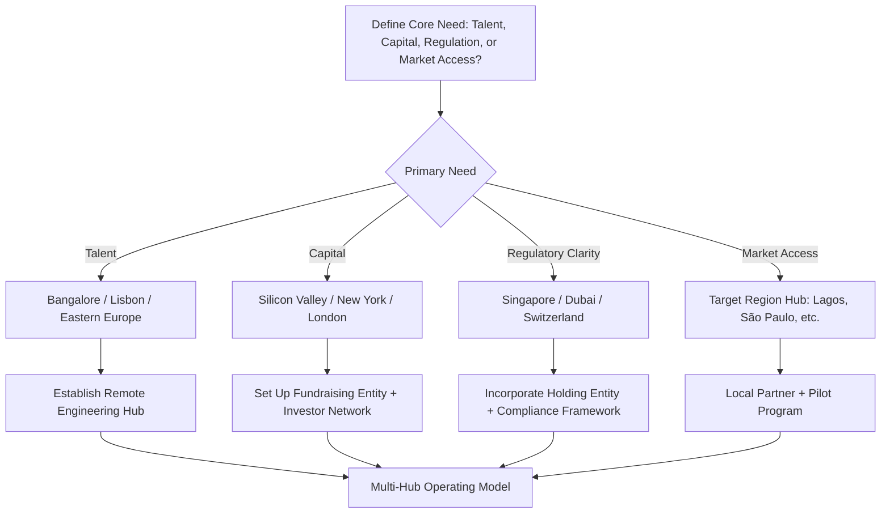

# Chapter 07: Global Perspectives - The New Innovation Map

> *Last Updated: March 2026*

> **Skim This Chapter**
> - Innovation is no longer centered in Silicon Valley -- a polycentric network of specialized hubs (Bangalore, Lagos, Dubai, Lisbon, Singapore) now offers distinct advantages in talent, regulation, capital, and culture.
> - Output: A geographic strategy framework for choosing where to incorporate, hire, raise capital, and expand based on your venture's specific domain and stage.

## 1. Introduction: Innovation Has Gone Global

The era of geographically centralized innovation is over. For decades, Silicon Valley represented not just a place but a singular innovation archetype—a concentrated ecosystem where startups, capital, and talent converged to build the digital future. Today, we've entered a fundamentally different reality where breakthrough technologies and ventures emerge from a distributed global network rather than a single geographic center.

This shift represents one of the most profound transformations in the entrepreneurial landscape. While Silicon Valley maintains significant influence, technology creation has fractured and expanded across continents, creating a polycentric innovation world where multiple hubs specialize in distinct domains and offer different competitive advantages.

For founders building in Web3 and AI, this global redistribution creates both challenges and opportunities. No longer is there a single "right" location to build a technology company—instead, geographic strategy has become a crucial decision layer requiring thoughtful consideration alongside technology, product, and capital strategy. Your physical and jurisdictional presence can create either strategic advantage or unnecessary friction depending on how intelligently you navigate this new landscape.

> **The geography advantage:** Where you incorporate, hire, and raise capital is no longer an afterthought—it is a strategic decision as important as your technology stack.

## In This Chapter, You Will

- Map where your investors, partners, and customers cluster globally
- Understand how Silicon Valley's role is evolving in the global landscape
- Learn to leverage distributed innovation ecosystems strategically
- Design geographic strategy aligned with your venture's specific needs
- Build cross-border operations without compliance risk
- Navigate cultural differences in global fundraising and expansion

## 2. Silicon Valley's Evolving Role in Global Technology

### Historical Advantage Analysis

Silicon Valley's historic dominance stemmed from the convergence of several unique advantages that created extraordinary leverage for technology creation:

**Capital Density**: Unprecedented concentration of venture capital and specialized investors who understood technology risk

**University Pipelines**: Direct connections to elite technical institutions, particularly Stanford and Berkeley

**Military-Industrial Foundation**: Early DARPA funding and defense contracts created foundational infrastructure

**Legal Frameworks**: California's approach to intellectual property and non-compete agreements enabled talent mobility

**Cultural Acceptance of Failure**: Normalized risk-taking and reduced the social cost of startup failure

**Network Density**: The proximity of technologists, founders, and investors created rapid knowledge transfer

**Early Internet Head Start**: First-mover advantage in digital infrastructure and talent concentration

Perhaps most significantly, Silicon Valley developed a distinct innovation methodology—a repeatable process for company formation, scaling, and value creation that created a powerful template for high-growth technology ventures. This "Valley playbook" became a globally exportable cultural phenomenon that transformed entrepreneurship worldwide.

### Current Position Assessment

While still commanding extraordinary resources and influence, Silicon Valley faces unprecedented challenges to its dominance:

**Rising Costs**: Prohibitive living expenses and operational costs that price out early-stage experimentation

**Regulatory Scrutiny**: Increased government oversight of technology companies and their business models

**Cultural Fatigue**: Growing disillusionment with technology's social impacts and Silicon Valley culture

**Global Competition**: Increasingly sophisticated innovation ecosystems around the world

**Remote Work Adoption**: Decoupling of talent and geography accelerated by pandemic-era work transformations

**National Security Concerns**: Technology nationalism and fragmentation of global supply chains

Despite these challenges, the region maintains significant structural advantages:

- Capital Formation: Unmatched concentration of venture capital and specialized investors
- AI Research Concentration: Leading AI labs and research institutions
- Network Effect Advantages: Density of relationships, knowledge, and talent
- Incumbent Platform Control: Home to the world's most powerful technology platforms (Google, Apple, Meta)
- Ideological Influence: Continued ability to shape global technology narratives and values

### Future Role Projection

The critical question is whether Silicon Valley will follow the path of previous innovation centers—from Renaissance Florence to Detroit's automotive golden age—eventually ceding dominance while retaining cultural and historical significance. Several scenarios appear possible:

**Meta-Hub Evolution**: Silicon Valley transforms from primary creation center to orchestration layer, focusing on capital allocation, talent development, and global coordination

**Specialized Dominance**: Maintains leadership in specific domains (AI, biotechnology) while yielding in others (fintech, e-commerce)

**Network Reconfiguration**: Distributes functions across global satellite hubs while maintaining control of value capture

**Renaissance Through Reinvention**: Adapts to challenges through institutional innovation and cultural renewal

**Relative Decline**: Gradually cedes influence as innovation disperses globally while maintaining historical significance

For founders, the implication is clear—Silicon Valley remains an important but no longer exclusive power center in global technology.

## 3. The Rise of Distributed Innovation Ecosystems

### Regional Hub Development

The most remarkable feature of the current innovation landscape is the emergence of distinctive technology hubs with unique specializations, advantages, and cultural characteristics:

**Bangalore, India**: Global-scale software engineering talent and increasingly sophisticated startup formation infrastructure specializing in developer tools, infrastructure, and enterprise applications

**Lagos, Nigeria**: Mobile-first innovation with particular strength in fintech, payments, and services for emerging market consumers

**São Paulo, Brazil**: Latin American leader in financial technology, blockchain, and consumer platforms with regional scale

**Dubai, UAE**: Regulatory innovation, capital concentration, and positioning as global-local bridge between Western and Eastern markets

**Lisbon, Portugal**: European talent magnet leveraging quality of life, governmental support, and favorable immigration policies

**Singapore**: Asian financial center with strong regulatory frameworks, capital access, and strategic positioning between China and Western markets

**Berlin, Germany**: European creative technology, cryptocurrency innovation, and alternative founder culture

**Tel Aviv, Israel**: Deep technology expertise, particularly in cybersecurity, AI, and defense applications

**Taipei, Taiwan**: Semiconductor and hardware manufacturing excellence with increasingly important geopolitical significance

**Shenzhen, China**: Unparalleled hardware prototyping, manufacturing scale, and physical product innovation

For Web3 and AI ventures specifically, several hubs have emerged with particular relevance:

- **Switzerland (Zug)**: "Crypto Valley" with regulatory clarity for digital assets
- **Singapore**: Balanced regulation of digital assets with financial system integration
- **Dubai/Abu Dhabi**: Aggressive regulatory innovation for digital assets and AI
- **Portugal**: Favorable personal tax treatment for cryptocurrency gains
- **Taiwan/South Korea**: Semiconductor infrastructure critical for AI compute
- **London**: Fintech and institutional crypto with traditional finance integration
- **New York**: Institutional adoption of digital assets and financial innovation
- **Puerto Rico**: US access with favorable tax treatment for certain individuals and entities

### Regional Innovation Snapshots: Data-Driven Analysis

#### India: The Digital Public Infrastructure Leader

**Key Indicators:**
- Developer Activity: 5.8M+ developers (world's largest, as of 2025), growing 25% annually
- Digital Infrastructure: 228B+ UPI transactions in 2025 (up from 172B in 2024); January 2026 set a single-month record of 21.7B transactions worth ₹28.33 lakh crore
- Regulatory Environment: Pro-innovation but data localization requirements
- UPI now live in seven countries (UAE, Singapore, Bhutan, Nepal, Sri Lanka, France, Mauritius)

**Innovation Advantages:**
- Cost-efficient engineering talent ($15-40K avg vs $150K+ in SF, as of 2025)
- Digital public goods expertise (Aadhaar, UPI stack, ONDC)
- Mobile-first user base (750M+ smartphone users, as of 2025); UPI user base targeting 1 billion by late 2026
- Government support for fintech/healthtech innovation
- PhonePe (48.3% market share) and Google Pay (37%) dominate the UPI ecosystem; UPI accounts for 80-90% of India's retail digital payments

**Startup Success Pattern:**
- Build for India first, then export model globally
- Leverage UPI infrastructure for payments
- Partner with traditional banks/telcos for distribution
- Focus on affordability and vernacular language support

**Notable Examples:** Razorpay (payments), Postman (developer tools), Zerodha (fintech), Polygon (blockchain infrastructure)

#### Nigeria: Crypto Adoption & Fintech Innovation

**Key Indicators:**
- Crypto Usage: 45% population owns/has used crypto (highest globally, as of 2024)
- Mobile Money: $200B+ annual transaction volume (as of 2024)
- Developer Growth: 40% YoY increase in tech talent (as of 2024)

**Innovation Advantages:**
- Highest crypto adoption due to currency volatility
- Leapfrog banking infrastructure with mobile-first solutions
- Young population (median age 18) with high mobile penetration
- Growing venture capital ecosystem: African startups raised over $3B in 2025, a solid year-on-year improvement. Nigeria, Kenya, South Africa, and Egypt continue to capture the majority. In early 2026, debt has overtaken equity as the dominant funding mechanism, with equity accounting for less than half of capital deployed

**Startup Success Pattern:**
- Address financial inclusion gaps
- Build for offline-first/low-bandwidth environments
- Use cryptocurrency to bypass traditional banking
- Partner with telecom operators for distribution

**Notable Examples:** Flutterwave (payments), Paystack (fintech), Bundle (crypto)

#### Brazil: Fintech & Consumer Innovation Hub

**Key Indicators:**
- Fintech Penetration: 87% use digital payments (vs 76% global average, as of 2025)
- Startup Ecosystem: LatAm VC totaled $4.1B across 681 rounds in 2025 (up 13.8% from 2024), with fintech capturing 61% of total funding. Brazil raised $2.1B, an increase of 10.5% from 2024
- Digital Government: PIX instant payments (150M+ users, as of 2025)

**Innovation Advantages:**
- Large domestic market (215M+ population)
- Advanced digital payment infrastructure (PIX)
- Strong fintech/consumer internet experience
- Growing tech hub in São Paulo and Rio
- 15 new VC funds launched in LatAm in 2025, raising a combined $761M (131% increase over 2024)

**Notable Examples:** Nubank (neobank—131M customers globally by December 2025, $4.9B quarterly revenue in Q4 2025, 45% YoY growth; conditional OCC approval for US bank charter in January 2026), Stone (payments), iFood (delivery)

#### Eastern Europe: Developer Talent & B2B Innovation

**Key Indicators:**
- Developer Density: 31 developers per 1000 people (vs 25 EU average, as of 2024)
- Remote Work: 65% of developers work remotely for global companies (as of 2024)
- Cost Advantage: $25-60K avg developer salaries vs $120K+ Western Europe (as of 2025)

**Innovation Advantages:**
- Highly skilled technical talent at competitive costs
- Strong education system in STEM fields
- EU market access with lower operational costs
- Growing startup ecosystems (Warsaw, Krakow, Bucharest)

**Notable Examples:** JetBrains (developer tools), UiPath (RPA), eMAG (ecommerce)

### Remote-First Company Impact

Perhaps the most transformative shift in innovation geography is the emergence of natively distributed organizations—companies designed from inception to operate without geographic center. These entities represent a fundamental evolution beyond traditional company structures:

**Cloud-Native Infrastructure**: Technology stacks designed for distributed work and coordination

**Global Talent Access**: Recruitment unconstrained by location, enabling specialized skill acquisition

**Capital Efficiency**: Reduction in office space and geographic wage premium costs

**Work-Life Autonomy**: Increased employee control over living location and lifestyle

**24-Hour Operational Cycles**: Development and service delivery across global time zones

**Multi-Jurisdiction Strategies**: Legal and regulatory positioning across multiple geographies

Remote-first organizations decouple institutional identity from geography, creating entities that exist primarily in digital rather than physical space. This represents not merely a shift in work arrangement but a fundamental reimagining of organizational design, communication patterns, and leadership approaches.

For Web3 ventures in particular, distributed autonomous organizations (DAOs) take this concept further by creating governance and coordination structures that operate entirely through protocol-based rules rather than traditional corporate hierarchies.

### Cross-Border Collaboration Models

Beyond fully distributed organizations, we're seeing increased sophistication in cross-border collaboration approaches that leverage specific geographic advantages while maintaining unified operations:

**Jurisdictional Arbitrage**: Strategic entity formation across multiple countries to optimize for regulatory treatment, tax efficiency, and operational flexibility

**Follow-the-Sun Development**: 24-hour development cycles across distributed teams

**Specialized Function Distribution**: Locating specific functions (research, development, sales) in optimal geographies

**Investment Syndication**: Cross-border investor collaborations combining local expertise with global capital

**Regulatory Navigation Partnerships**: Collaborations specifically designed to address multi-jurisdiction compliance challenges

**Cultural Translation Teams**: Specialized groups focused on adapting products and messaging for regional markets

## 4. How to Choose the Right Geography for Your Venture

### Location Factor Analysis

For founders building in Web3 and AI, geographic decisions should be driven by systematic analysis of factors most relevant to your specific venture rather than default assumptions or personal preferences. Critical considerations include:

**Talent Depth**: Availability of specialized skills required for your particular technical domain

**Cost Structures**: Living expenses, compensation requirements, office space, and operational costs

**Capital Access**: Presence of investors who understand your specific technology and business model

**Regulatory Environment**: Legal treatment of your technology, business model, and token economics

**Technical Infrastructure**: Cloud services, connectivity, hardware access, and computing resources

**Quality of Life**: Factors affecting founder and team wellbeing, productivity, and retention

**Industry Concentration**: Presence of complementary companies, partners, and specialized service providers

**Cultural Fit**: Alignment between local values and your venture's approach and philosophy

### Remote vs. Physical Considerations

The remote vs. physical decision requires nuanced analysis based on specific venture requirements rather than general preferences. 

Functions requiring physical presence include:
- Hardware Development: Physical product creation, manufacturing, and testing
- Complex Coordination: Certain types of early-stage ideation and problem-solving
- Policy Influence: Direct engagement with regulators and government bodies
- Relationship-Driven Sales: Enterprise procurement requiring in-person trust-building
- Specialized Infrastructure Access: Quantum computers, advanced chip fabrication, etc.

Conversely, functions that benefit from distributed approaches include:
- Software Development: Particularly modular, well-specified engineering tasks
- Global Customer Support: Follow-the-sun service delivery models
- Content Creation: Writing, design, and media production
- Specialized Expert Roles: Rare talent acquisition unconstrained by location

For early-stage Web3 and AI ventures specifically, consider:
- Product Development Phase: Early concept development often benefits from intense in-person collaboration
- Technical Complexity: Highly novel or complex technologies may require more in-person coordination
- Team Experience: More experienced teams generally require less physical co-location
- Regulatory Engagement Needs: Direct government interaction requirements
- Capital Raising Geography: Investor preferences for in-person relationship building

### Regulatory Environment Assessment

For Web3 and AI ventures in particular, regulatory considerations have become critical geographic decision factors, often outweighing traditional concerns like talent and capital:

**Token Classification**: Legal treatment of digital assets (security, commodity, currency, utility)

**Data Governance**: Rules regarding information collection, storage, and processing

**AI Development Frameworks**: Emerging regulations on model training, deployment, and liability

**Banking Relationships**: Access to financial services for crypto-related businesses

**Legal Entity Structures**: Recognition of DAOs, foundations, and other novel organizational forms

**Intellectual Property Protection**: Enforcement mechanisms and jurisdiction-specific limitations

**Competition Policy**: Treatment of network effects, data advantages, and platform power

The regulatory landscape creates both friction zones and opportunity spaces:
- **Friction Zones**: Jurisdictions with hostile, uncertain, or rapidly changing regulatory approaches
- **Regulatory Moats**: Advantageous treatment creating defensible market positions
- **Regulatory Arbitrage**: Strategic positioning across multiple jurisdictions
- **Pioneer Advantages**: Early mover benefits in jurisdictions developing progressive frameworks

## 5. Global Policy Watchlist: Regulatory Tracking

### AI & Machine Learning Regulations

**High Priority Jurisdictions:**
- **EU:** AI Act (entered into force August 2024) — Prohibited AI practices banned since February 2025; GPAI model obligations effective August 2025; high-risk AI system rules fully applicable by August 2026 (though the proposed "Digital Omnibus" simplification package from November 2025 may extend certain deadlines to December 2027 or August 2028). 27 member states have published national implementation plans.
- **US:** Executive Order on AI (2023) - Safety testing requirements; evolving Congressional AI legislation
- **China:** AI regulations tightening - Algorithm approval process; DeepSeek's January 2025 breakthrough demonstrated that Chinese AI labs can compete at the frontier despite export controls
- **UK:** AI White Paper - Principles-based approach; continuing pro-innovation regulatory stance

**Key Compliance Requirements:**
- High-risk AI systems need conformity assessments (EU AI Act)
- AI literacy obligations for organizations deploying AI (effective February 2025 in EU)
- Transparency obligations for AI decision-making
- Data governance and quality requirements
- Human oversight and bias testing mandates

### Cryptocurrency & Web3 Regulations

**Friendly Jurisdictions:**
- **Switzerland:** Clear token classification framework
- **Singapore:** Comprehensive Digital Payment Token framework
- **UAE:** Dubai Virtual Assets Regulatory Authority
- **Portugal:** Tax-friendly crypto environment

**Restrictive Jurisdictions:**
- **China:** Comprehensive crypto ban (mining, trading, services)
- **India:** 30% crypto tax + 1% TDS on transactions
- **Turkey:** Central bank payment ban (but trading allowed)

**Evolving Frameworks:**
- **EU:** MiCA regulation (effective 2024, full enforcement ongoing through 2026) - Comprehensive crypto framework with passport system for cross-border operations
- **US:** SEC enforcement vs Congressional legislation uncertainty; continued regulatory ambiguity driving some crypto businesses offshore
- **Japan:** Revised crypto exchange licensing

### Data Privacy & Localization

**Strict Requirements:**
- **EU:** GDPR - Extraterritorial reach, €20M/4% revenue fines
- **India:** Data Protection Bill - Localization + processing restrictions
- **China:** Cybersecurity Law - Critical data must stay in China
- **Russia:** Data localization law - Personal data of Russians

## 6. Remote-First Companies and the Geography of Talent

### Distributed Team Management

Building effective remote-first organizations requires intentional design rather than merely replicating traditional structures without offices. Key elements include:

**Documentation Culture**: Shifting from verbal to written knowledge capture and transfer

**Asynchronous Communication Norms**: Reducing meeting dependency and enabling time-shifted collaboration

**Explicit Process Definition**: Clearly articulated workflows replacing implicit understanding

**Outcome-Based Performance Evaluation**: Focusing on results rather than observed work patterns

**Deliberate Social Connection**: Structured approaches to relationship building across distance

**Synchronization Rhythms**: Intentional cadences for alignment across time zones

**Tool Mastery**: Sophisticated use of collaboration platforms and communication infrastructure

Remote-first leadership requires distinct capabilities beyond traditional management skills:
- Communication Precision: Clarity in written directives and documentation
- Cultural Intentionality: Deliberate cultivation of shared values and practices
- Trust Development: Building confidence across distance and cultural differences
- Coordination Expertise: Orchestrating complex activities across time zones
- Digital Environment Design: Creating effective virtual collaboration spaces

### Cultural Cohesion Development

The central challenge in remote and globally distributed teams is maintaining cultural coherence without physical gathering. Effective approaches include:

**Values Articulation**: Explicit definition and continuous reinforcement of core principles

**Deliberate Onboarding**: Comprehensive introduction to organizational culture and practices

**Ritual Creation**: Shared experiences creating cohesion despite distance

**Transparent Communication**: Open information sharing creating shared context

**Recognition Systems**: Acknowledgment of contributions visible across the organization

**Cultural Artifacts**: Symbols, language, and practices reinforcing identity

**Periodic Physical Gathering**: Strategically designed in-person experiences that build relationship depth

### Legal and Operational Frameworks

Global distribution creates specific operational challenges requiring specialized approaches:

**Entity Structures**: Parent-subsidiary relationships, international branches, or contractor models

**Employment Solutions**: Employer of Record (EOR) services or specialized international PEOs

**Compensation Systems**: Currency management, equity distribution, and benefits standardization

**Tax Compliance**: Income, employment, and corporate tax across multiple jurisdictions

**Intellectual Property Management**: Consistent protection across different legal systems

**Data Protection**: Compliance with region-specific privacy regulations

Web3 organizations face additional considerations:
- Token-Based Compensation: Legal and tax treatment of cryptocurrency payments
- DAO Participation: Legal status of distributed governance activities
- Smart Contract Jurisdiction: Legal recognition of on-chain agreements
- Global Contributor Networks: Engaging talent outside traditional employment models

## 7. Implementation Guide: Geographic Strategy for Global Ventures

### Location Selection Framework

Founders should approach location decisions through systematic assessment rather than default assumptions. Here's a framework for evaluation:

**1. Identify Critical Need Factors**: Determine which geographic elements most significantly impact your specific venture type
- Technical talent availability (by specific domain)
- Regulatory treatment of your particular technology
- Capital access for your venture profile
- Infrastructure requirements (computing, manufacturing, etc.)
- Customer proximity needs
- Cost structure constraints

**2. Weight Factors By Importance**: Assign relative significance based on your venture's specific requirements
- Regulatory considerations typically weight heaviest for Web3 ventures
- Technical talent often dominates for deep AI development
- Manufacturing capacity may be critical for hardware-dependent ventures

**3. Score Candidate Locations**: Evaluate potential hubs against your weighted criteria
- Consider both current conditions and likely future developments
- Assess friction costs of operating in each location
- Evaluate both primary and secondary factors

**4. Develop Geographic Staging Plan**: Create a timeline for geographic evolution as your venture develops
- Initial formation location
- Early development phase
- Growth stage positioning
- Scale phase structure

### Legal Structure Optimization

For Web3 and AI ventures, legal structure often requires multi-jurisdiction approaches that balance various considerations:

**Common Models Include:**

**Foundation + Operating Companies**: Non-profit foundation (often in Switzerland or Cayman) governing protocol with commercial entities in operational jurisdictions

**Delaware C-Corp with International Subsidiaries**: Traditional venture structure with specialized entities for specific functions or markets

**DAO + Legal Wrapper**: On-chain governance with legally recognized entity providing interface to traditional systems

**Singapore Parent + Global Subsidiaries**: Using Singapore's stable legal system and cryptocurrency clarity as primary entity location

**Key Jurisdiction Considerations:**
- **Delaware (US)**: Standard for venture-backed companies, investor familiarity, clear corporate law
- **Cayman Islands**: Asset management, foundation structures, minimal taxation, limited reporting
- **Switzerland**: Foundation models, regulatory clarity for digital assets, banking system access
- **Singapore**: Business-friendly regulation, financial infrastructure, Asian market access
- **Estonia**: Digital-first governance, e-residency program, EU market access
- **BVI**: Asset protection, privacy, limited substance requirements
- **UAE/Dubai**: Emerging crypto-friendly regulations, tax advantages, strategic location

### Operational Distribution Models

Beyond legal structure, operational distribution requires strategic design aligned with your venture's specific requirements:

**Common Approaches Include:**
- **Hub and Spoke**: Primary location with satellite operations
- **Regional Centers**: Multiple semi-autonomous operations in key markets
- **Function-Based Distribution**: Different activities in optimized locations
- **Fully Distributed**: No primary physical location
- **Periodic Convergence**: Mostly distributed with regular physical gatherings

**Element Distribution Considerations:**
- Core Development: Often benefits from co-location in early stages
- Protocol Governance: Typically distribution-native, especially for Web3
- Growth Functions: Often region-specific for market adaptation
- Operations/Finance: Can be effectively centralized or distributed
- Community Development: Usually benefits from global distribution

## 8. Partner Discovery Playbook: Building Global Networks

### Accelerator & Incubator Mapping

**Tier 1 Global Programs:**
- **Y Combinator (US):** $500K + 3-month program + alumni network
- **Techstars (Global):** $120K + mentorship + 10 cities globally
- **500 Startups (Global):** $150K + growth marketing focus
- **Rocket Internet (DE):** Operational expertise + European expansion

**Regional Specialists:**
- **India:** Indian Angel Network, Sequoia Surge, Accel India
- **Brazil:** Abstartups, 500 Startups Brasil, Canary
- **Nigeria:** CcHUB, Co-Creation Hub, TechStars Lagos
- **Eastern Europe:** Startup Wise Guys, LAUNCHub, Innovation Labs

**Web3/Crypto Focused:**
- **Binance Labs:** $100M+ fund + Binance ecosystem access
- **Consensys Mesh:** Ethereum ecosystem + technical support
- **Pantera Capital:** Crypto fund + strategic partnerships
- **a16z crypto:** $7.6B fund + crypto expertise

### Open Source Community Engagement

**Developer Platform Strategies:**
- **GitHub Sponsorships:** Fund OSS maintainers in target regions
- **Developer Advocacy:** Local dev rel hires + conference sponsorships
- **Hackathons:** Partner with local universities + tech communities
- **Documentation:** Translate core docs to local languages

**Community Building Tactics:**
- **Discord/Telegram:** Language-specific channels + local moderators
- **Local Meetups:** Monthly events in target cities
- **University Partnerships:** Student developer programs
- **Certification Programs:** Technical training + job placement

## 9. Go-To-Market Patterns By Region

### Distribution Strategy by Region

**Partnership-Driven Markets:**
- **India:** Partner with banks/telcos for customer acquisition
- **Brazil:** Use WhatsApp + local influencers for viral growth
- **Nigeria:** Leverage mobile money agents + community leaders
- **Eastern Europe:** B2B partnerships with system integrators

**Direct Marketing Effective:**
- **US:** Performance marketing + content marketing
- **UK/Germany:** SEO + thought leadership
- **Australia/Canada:** Community-driven growth

**Community-First Approach:**
- **Web3:** Discord/Telegram communities + governance tokens
- **Developer Tools:** GitHub + Stack Overflow presence
- **B2B SaaS:** LinkedIn + industry-specific communities

### Localization Requirements by Market

**High Localization:**
- Language: UI/UX translation + local customer support
- Payments: Local payment rails (UPI, PIX, mobile money)
- Compliance: Data residency + local legal entity
- Culture: Local holidays, business practices, communication styles

**Medium Localization:**
- Language: Key pages translated + multilingual support
- Payments: Major local payment methods supported
- Compliance: Basic regulatory compliance + privacy laws
- Pricing: Local currency + purchasing power adjusted pricing

**Low Localization:**
- Language: English sufficient for target audience
- Payments: International cards + PayPal sufficient
- Compliance: Basic GDPR compliance covers most markets
- Pricing: USD pricing acceptable

## 10. Regional Market Entry Playbook Template

### Target Country Assessment Framework

**Market Opportunity (30 points)**
- [ ] Market size: >$1B addressable market (10 pts)
- [ ] Growth rate: >10% annual growth in target segment (10 pts)
- [ ] Competition: <3 dominant players with similar solution (10 pts)

**Regulatory Environment (25 points)**
- [ ] Legal clarity: Clear regulations for your business model (10 pts)
- [ ] Data requirements: Manageable localization requirements (8 pts)
- [ ] Licensing: Straightforward licensing process (7 pts)

**Execution Feasibility (25 points)**
- [ ] Talent availability: Access to required skills locally (8 pts)
- [ ] Partner ecosystem: Quality local partners available (8 pts)
- [ ] Infrastructure: Adequate tech infrastructure for operations (9 pts)

**Strategic Fit (20 points)**
- [ ] Cultural alignment: Product-market fit likely (10 pts)
- [ ] Expansion potential: Stepping stone to adjacent markets (10 pts)

**Scoring:**
- 80-100: Tier 1 priority market
- 60-79: Tier 2 opportunity
- 40-59: Wait for better timing/conditions
- <40: Not suitable for expansion

### Geographic Strategy Decision Flow

### 90-Day Market Entry Sprint

**Days 1-30: Foundation**
- [ ] Legal entity setup + regulatory compliance research
- [ ] Local bank account opening + payment method integration
- [ ] Initial team hiring (country manager + customer success)
- [ ] Competitor analysis + pricing localization

**Days 31-60: Go-to-Market**
- [ ] Partner agreements signed (distribution, compliance, support)
- [ ] Marketing website localized + local domain setup
- [ ] Initial customer outreach + pilot program launch
- [ ] PR strategy + local media relationships

**Days 61-90: Scale & Optimize**
- [ ] Customer feedback integration + product localization
- [ ] Performance marketing campaigns optimized
- [ ] Team expansion based on initial traction
- [ ] Metrics dashboard + KPI tracking established

## Key Takeaways

### Geography Is Now a Strategic Layer

Location decisions have evolved from default assumptions to critical strategic choices. Founders must approach geographic positioning with the same analytical rigor applied to technology, product, and capital strategy. Your physical and jurisdictional presence creates either strategic advantage or unnecessary friction depending on how thoughtfully you navigate the global innovation landscape.

**Implementation**: Develop explicit geographic strategy as part of your venture design rather than treating location as an afterthought or default.

### Think Globally, Build Locally, Operate Cloud-Natively

The most effective ventures combine global perspective with strategic local presence and cloud-native operations. Rather than choosing between global or local approaches, sophisticated founders leverage both—accessing worldwide talent, capital, and markets while establishing strategic presence in locations that create specific advantages.

**Implementation**: Identify which functions truly benefit from specific geographic positioning while designing systems for distributed collaboration across other activities.

### The Edge Belongs to the Well-Mapped Founder

Competitive advantage increasingly accrues to founders who understand the global innovation landscape in detail—identifying non-obvious hubs, talent concentrations, regulatory opportunities, and strategic positions while competitors remain constrained by conventional thinking.

**Implementation**: Develop sophisticated understanding of global innovation geography beyond commonly discussed hubs, with particular focus on emerging ecosystems relevant to your specific domain.

### Your Venture's Jurisdictional DNA Can Be a Moat or a Weakness

For Web3 and AI ventures especially, legal and regulatory positioning creates foundational advantage or disadvantage that can determine success regardless of technology or execution quality. Regulatory clarity, banking relationships, compliance frameworks, and jurisdictional strategy have become existential rather than merely operational concerns.

**Implementation**: Prioritize jurisdictional strategy early in venture formation, engaging specialized legal expertise in emerging technology regulation across relevant markets.

### The Next Silicon Valley Is Everywhere—If You Know Where to Look

The future of innovation is polycentric—distributed across specialized hubs with unique advantages rather than concentrated in a single dominant location. Success belongs to founders who navigate this complex landscape strategically, leveraging the specific advantages of different ecosystems while avoiding their constraints.

**Implementation**: Approach geography as a dynamic system of opportunities rather than seeking a single "best" location, developing presence in multiple strategic hubs aligned with your venture's specific needs.

---

The global redistribution of innovation represents both challenge and opportunity for Web3 and AI founders. While requiring more complex geographic strategies than previous generations of technology ventures, this polycentric landscape creates unprecedented possibilities for those who navigate it skillfully. By approaching geographic positioning with strategic intent rather than default assumptions, founders can transform location from constraint to competitive advantage—accessing global talent, capital, and markets while positioning for optimal regulatory treatment and operational efficiency.

## Region × Requirement Grid

| Region | KYC/Identity | Data Residency | Payment Rails | Tax Basics |
|---|---|---|---|---|
| US | KYC/AML at on/off-ramps; sanctions screening | State/federal; sectoral rules (HIPAA, etc.) | ACH, RTP, card networks, stablecoins | Federal + state; nexus rules |
| EU | eIDAS, AMLD; strong identity frameworks | GDPR; cross‑border transfer constraints | SEPA, card networks; PSD2; stablecoins evolving | VAT; country-specific corporate taxes |
| UK | FCA KYC; AML regs | UK GDPR | Faster Payments, card networks | VAT; corporate tax 25% |
| Nigeria | CBN KYC tiers; NIN/Bank Verification Number | Emerging; sector‑specific | NIBSS/instant transfers; mobile money; crypto usage high | VAT; evolving crypto guidance |
| India | RBI KYC; Aadhaar restrictions for private use | Data Protection Bill; localization | UPI real‑time rails; card networks | GST; TDS for certain crypto |
| Brazil | Central Bank KYC; CPF/CNPJ | LGPD | PIX instant payments; boleto; cards | VAT‑style; complex state taxes |
| Singapore | Strong KYC framework | PDPA; cross-border allowed | PayNow, FAST, cards | Corporate tax 17%; crypto guidelines |
| UAE | Comprehensive KYC/AML | Limited localization | Strong banking infra; crypto-friendly | Zero corporate tax (mainland) |
| Switzerland | Swiss Banking Act KYC | FADP (similar to GDPR) | SEPA, traditional banking strong | Varied by canton; crypto-friendly |

## Founder's Checklist

- [ ] Which 2–3 regions fit our product-regulatory fit today?
- [ ] Do we have a local partner for compliance and distribution?
- [ ] What must be localized (UX, pricing, language, integrations)?
- [ ] How will we support 24/7 ops and community across time zones?
- [ ] Do we know the 3 most relevant capital hubs for us?
- [ ] Are our entities and contracts set for cross‑border flows?
- [ ] Who are our local champions in each hub?
- [ ] What signals do these markets value (and which don't translate)?

## Exercises

- Draft a one-page market entry plan for a target country
- Identify one anchor partner to unlock distribution or compliance
- Map a "minimum localization" scope for your product
- Complete regional assessment framework for top 3 target markets
- Build regulatory compliance checklist for your industry
- Create partner outreach sequence for accelerators/incubators
- Design 90-day market entry sprint for priority country
- Draft a capital access plan by hub with concrete intros
- Meet with a cross-border tax counsel; write a one-page brief
- Localize your pitch (proofs, metrics) for one target hub

### Case Study: Grab — Multi-Market Localization as Competitive Advantage

Grab, co-founded by Anthony Tan and Tan Hooi Ling in 2012, began as MyTeksi, a ride-hailing app built in Malaysia to address the specific pain points of Southeast Asian transportation: unreliable taxi services, safety concerns particularly for women passengers, and the absence of standardized digital payment infrastructure. The company's trajectory from a single-country ride-hailing app to an eight-country super-app serving over 180 million users illustrates how deep localization, rather than global standardization, can become the foundation of regional dominance.

Tan Hooi Ling, one of the few women co-founders of a publicly traded technology company in Asia, brought operational discipline and a focus on user safety that shaped Grab's product decisions from the earliest stages. Features like driver photo verification, emergency buttons, and trip-sharing were not afterthoughts but core design elements reflecting the reality that transportation safety is experienced differently across genders and geographies.

Grab's expansion strategy directly challenges the assumption that a product successful in one market can be deployed unchanged in another. In each new country, the company encountered infrastructure constraints that demanded fundamental product adaptation. In Indonesia, where two-wheeled vehicles dominate urban transportation, Grab launched GrabBike, a motorcycle ride-hailing service that had no equivalent in Western markets. In Vietnam, where cash remained the dominant payment method, Grab built cash payment workflows into its platform before layering digital payments on top. In the Philippines, where remittances represent a significant portion of GDP, Grab integrated money transfer services that addressed a genuine economic need rather than simply replicating features from other markets.

The super-app evolution further demonstrates the chapter's thesis about regional innovation models. Rather than following the Western pattern of single-purpose applications, Grab adopted the super-app model pioneered in China, integrating ride-hailing, food delivery, package delivery, digital payments, insurance, and lending into a single platform. This approach was not mere imitation but a strategic response to Southeast Asian market realities: in a region where smartphone storage is limited and data costs are high, users prefer fewer apps that do more.

Grab's path to its NASDAQ listing in 2021 via a SPAC merger valued at approximately $40 billion also illustrates the capital strategy dimensions discussed in this chapter. The company raised capital from a mix of Silicon Valley investors, Japanese conglomerates including SoftBank, and Southeast Asian sovereign wealth funds, assembling a financing structure that reflected its multi-market positioning rather than defaulting to a single capital market's norms.

For founders studying global expansion, Grab demonstrates that the most defensible international strategies are built on genuine understanding of local constraints and user needs rather than on the assumption that a product successful in one market will translate directly to others.

## Further Reading

- **The Startup Community Way** by Brad Feld and Ian Hathaway — A systems-level framework for understanding how innovation ecosystems develop and sustain themselves across different geographies.
- **AI Superpowers: China, Silicon Valley, and the New World Order** by Kai-Fu Lee — Compares the AI innovation ecosystems of the US and China, providing essential context for the global redistribution of technology creation.
- **Out-Innovate: How Global Entrepreneurs from Delhi to Detroit Are Rewriting the Rules of Silicon Valley** by Alexandre Lazarow — Documents how entrepreneurs in emerging markets build differently, with lessons on capital efficiency and resilience relevant to global founders.
- **The Future Is Asian** by Parag Khanna — Maps the rise of Asian innovation hubs and their interconnections, providing geopolitical context for the polycentric innovation landscape described in this chapter.
- **No Rules Rules: Netflix and the Culture of Reinvention** by Reed Hastings and Erin Meyer — While focused on one company, offers deep insights into building and managing distributed global teams across cultures.

## Sources

### Global Entrepreneurship and Innovation
- Isenberg, Daniel J. *Worthless, Impossible, and Stupid: How Contrarian Entrepreneurs Create and Capture Extraordinary Value*. Harvard Business Review Press, 2013.
- Ries, Eric. *The Lean Startup: How Today's Entrepreneurs Use Continuous Innovation to Create Radically Successful Businesses*. Crown Business, 2011.
- Hoffman, Reid, and Chris Yeh. *Blitzscaling: The Lightning-Fast Path to Building Massively Valuable Companies*. Currency, 2018.

### Emerging Markets and Development Economics
- Prahalad, C.K. *The Fortune at the Bottom of the Pyramid: Eradicating Poverty Through Profits*. Wharton School Publishing, 2004.
- Collier, Paul. *The Bottom Billion: Why the Poorest Countries Are Failing and What Can Be Done About It*. Oxford University Press, 2007.
- Banerjee, Abhijit V., and Esther Duflo. *Poor Economics: A Radical Rethinking of the Way to Fight Global Poverty*. PublicAffairs, 2011.
- Acemoglu, Daron, and James A. Robinson. *Why Nations Fail: The Origins of Power, Prosperity, and Poverty*. Crown Business, 2012.

### Cryptocurrency and Financial Inclusion
- Tapscott, Don, and Alex Tapscott. *Blockchain Revolution: How the Technology Behind Bitcoin Is Changing Money, Business, and the World*. Portfolio, 2016.
- Central Bank of Nigeria. "Regulatory Guidelines on Cryptocurrency Operations in Nigeria." CBN, 2021.
- Chainalysis. "The 2023 Geography of Cryptocurrency Report." chainalysis.com, 2023.
- Coinbase. "Global Crypto Adoption Index." coinbase.com/institutional/research-insights, 2023.

### African Tech Ecosystem
- Bright, Jake. "The Rise of African Tech." TechCrunch, 2022.
- Partech Partners. "Africa Tech Venture Capital Report." partechpartners.com, 2023.
- McKinsey Global Institute. "Lions Go Digital: The Internet's Transformative Potential in Africa." mckinsey.com, 2013.
- World Bank Group. "Africa's Pulse: Digital Infrastructure and Entrepreneurship." worldbank.org, 2023.

### Fintech and Digital Payments
- Skinner, Chris. *Digital Bank: Strategies to Launch or Become a Digital Bank*. Marshall Cavendish Business, 2014.
- Chishti, Susanne, and Janos Barberis. *The FINTECH Book: The Financial Technology Handbook for Investors, Entrepreneurs and Visionaries*. Wiley, 2016.
- Deloitte. "Global FinTech Report 2023." deloitte.com, 2023.

### AI Development and China Tech
- Lee, Kai-Fu. *AI Superpowers: China, Silicon Valley, and the New World Order*. Houghton Mifflin Harcourt, 2018.
- Rosen, Daniel H. *China's Economic Reckoning: The Price of Failed Reforms*. Peterson Institute for International Economics, 2021.
- Neurips Conference. "AI Research Papers from Chinese Institutions." neurips.cc, 2022-2023.
- MIT Technology Review. "China's AI Companies." technologyreview.com, 2023.

### Semiconductor Industry and Taiwan
- Miller, Chris. *Chip War: The Fight for the World's Most Critical Technology*. Scribner, 2022.
- Semiconductor Industry Association. "Global Semiconductor Industry Statistics." semiconductors.org, 2023.
- Taiwan Semiconductor Manufacturing Company. "Annual Report." tsmc.com, 2023.
- Boston Consulting Group. "Strengthening the Global Semiconductor Supply Chain." bcg.com, 2021.

### Indian Tech and Polygon Case Study
- Reserve Bank of India. "Master Direction on Digital Payment Security Controls." rbi.org.in, 2021.
- Economic Survey of India 2023. "Digital Infrastructure and Financial Inclusion." indiabudget.gov.in
- Ethereum Foundation. "Layer 2 Solutions Report." ethereum.org, 2023.
- Polygon Labs. "Polygon 2.0 Whitepaper." polygon.technology, 2023.

### Brazilian Fintech and Nubank
- Central Bank of Brazil. "Financial System Evolution and Fintech in Brazil." bcb.gov.br, 2022.
- Association of Brazilian Fintech. "Brazilian Fintech Report 2023." fintechs.com.br
- Nubank. "Annual Report and 10-K Filing." ir.nu, 2023.
- S&P Global Market Intelligence. "Latin American Fintech Analysis." spglobal.com, 2023.

### Cross-Border Business and Regulatory Frameworks
- Doern, G. Bruce, et al. *Canadian Regulatory Institutions: Converging and Colliding Regimes*. University of Toronto Press, 2019.
- OECD. "Going Digital: Shaping Policies, Improving Lives." oecd.org/going-digital, 2022.
- World Trade Organization. "E-commerce and Digital Trade." wto.org, 2023.
- European Union. "Digital Services Act and Digital Markets Act." europa.eu, 2022.

### Tax and Legal Considerations
- International Tax Review. "Cryptocurrency and Cross-Border Tax Issues." internationaltaxreview.com, 2023.
- Baker McKenzie. "Global Fintech Guide." bakermckenzie.com, 2023.
- PwC. "Crypto Tax Guide by Jurisdiction." pwc.com/cryptotax, 2023.

### Regional Innovation Hubs
- Global Startup Ecosystem Report. "Startup Genome 2023." startupgenome.com, 2023.
- Singapore Economic Development Board. "Tech Innovation Report." edb.gov.sg, 2023.
- Dealroom.co. "European Ecosystem Report." dealroom.co, 2023.
- LAVCA (Latin American Venture Capital Association). "Annual Data Report." lavca.org, 2023.

## Related Case Studies

- Nigeria's Crypto Movement: ../case-studies/compendium.md#nigerias-crypto-movement
- DeepSeek: ../case-studies/compendium.md#deepseek
- TSMC: ../case-studies/compendium.md#nvidia--tsmc
- Polygon: ../case-studies/compendium.md#polygon
- Nubank: ../case-studies/compendium.md#nubank
- See the Case Studies Compendium for curated examples relevant to this chapter: ../case-studies/compendium.md

---

**Previously:** [Chapter 06: Innovation Hierarchy](ch06-innovation-hierarchy.md) — Introduced the innovation stack from research to governance and showed how to position your venture at the right layer for maximum leverage.

**Next:** [Chapter 08: Financial Centers and Capital Access](ch08-financial-centers-capital-access.md) — Explores how capital flows follow geographic patterns and how to build cross-border funding strategies aligned with your venture.
