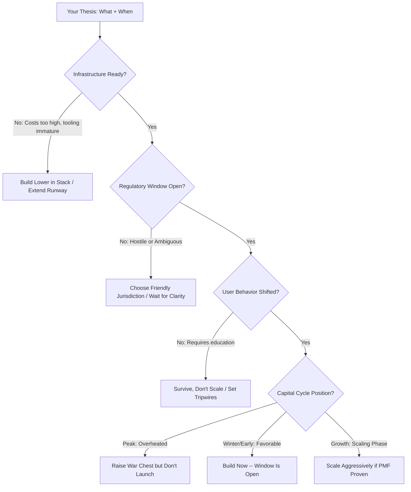

# Chapter 11: Timing — Why Now Matters More Than What

> *Last Updated: March 2026*

> **Skim This Chapter**
> - Most failed Web3/AI ventures had the right idea at the wrong time -- being too early is the default failure mode for visionary founders, and the window between "too early" and "too late" can be as short as six to eighteen months.
> - Output: A timing analysis framework built on four observable signals -- infrastructure readiness, regulatory windows, user behavior shifts, and capital cycle position -- that turns timing from luck into a learnable skill.

## In This Chapter, You Will

- Learn to diagnose whether you are too early, too late, or within the timing window for your venture
- Identify the four observable factors (infrastructure cost curves, regulatory windows, user behavior shifts, capital cycles) that determine market readiness
- Apply tripwire-based planning instead of arbitrary timelines to preserve resources until market conditions align
- Recognize and avoid the hype cycle trap that causes founders to start companies at precisely the worst moment

## 1. The Timing Paradox in Web3 and AI

Bill Gross analyzed hundreds of startups and found that timing was the single most important factor in startup success—more important than team, idea, business model, or funding. This finding should haunt every founder in Web3 and AI, because these are domains where timing failures are especially common and especially cruel.

The pattern repeats across cycles: founders see the future clearly but misjudge when it will arrive. They build the right product for a market that won't exist for another three to five years. They burn through capital educating users who aren't ready. They watch later entrants—who built the same thing with better timing—capture the market they pioneered.

The timing paradox in Web3 and AI is particularly acute because both domains are built on exponential curves. Infrastructure costs drop by orders of magnitude. User adoption follows S-curves with long flat periods before explosive growth. Regulatory frameworks shift from hostile to permissive (or vice versa) in unpredictable windows. Reading these curves correctly is the difference between being a visionary and being a cautionary tale.

## 2. Too Early: The Most Common Failure Mode

### Why Being Too Early Feels Like Being Right

The most dangerous aspect of being too early is that you *are* right about the future—you're just wrong about the calendar. This makes the failure mode psychologically devastating and strategically difficult to diagnose.

Founders who are too early often:

- **Confuse technical feasibility with market readiness.** Just because you *can* build it doesn't mean users are ready to use it. AI agents were technically feasible in 2020, but the infrastructure (reliable LLMs, tool-use APIs, embedding databases) didn't reach production quality until 2024-2025.

- **Mistake enthusiast adoption for market validation.** Early crypto adopters would use any on-chain application regardless of UX quality. This created false signals that masked the fact that mainstream users wouldn't tolerate the same friction for another several years.

- **Underestimate the infrastructure gap.** Many Web3 applications in 2017-2019 assumed Ethereum would scale to thousands of transactions per second within a year or two. It took until Layer 2 networks matured in 2023-2024 to deliver that throughput. Applications built for that assumption burned through their runway waiting.

- **Overestimate user willingness to change behavior.** Decentralized social media has been "about to take off" for a decade. The technology works. Users simply don't care enough about data ownership to switch from networks where their friends already are—at least not yet.

### Signals You're Too Early

- You spend more time explaining *why* your category exists than *why* your product is the best in it.
- Your most enthusiastic users are other founders and developers, not end users.
- The infrastructure your product depends on (wallets, gas fees, model inference costs, API reliability) requires users to tolerate friction that mainstream alternatives have eliminated.
- Your competitive landscape is empty—not because you've found a secret, but because others have tried and failed to find customers.
- Customer conversations consistently end with "this is cool, but I'll wait until..."

### What to Do When You're Too Early

**Survive, don't scale.** If you've identified that you're early, your primary job is extending your runway until the market arrives. Cut burn rate ruthlessly. Find adjacent revenue streams that sustain the team without abandoning the vision. Bitwage survived multiple crypto winters by maintaining bootstrapped profitability while waiting for mainstream crypto payroll demand.

**Build the infrastructure others will need.** If the application layer isn't ready, consider dropping down the stack. Many of the most valuable Web3 companies (Alchemy, Infura, Chainlink) started by building infrastructure that other too-early application companies needed. When the market finally arrived, they were the picks-and-shovels providers.

**Set tripwires, not timelines.** Don't set arbitrary dates for when the market should arrive. Instead, define specific, observable signals that indicate readiness: "When gas fees consistently stay below $0.10 per transaction, our application becomes viable." "When GPT-class inference drops below $0.001 per query, our unit economics work." Monitor these tripwires and preserve resources until they trigger.

## 3. Too Late: Speed Kills Slowly

### Why Being Late Is Underrated as a Risk

The Web3 and AI ecosystems have an unusually compressed window between "too early" and "too late." Once infrastructure matures and a use case becomes viable, the window for establishing a defensible position can be as short as six to eighteen months.

Being too late manifests differently than being too early:

- **The ecosystem has already chosen winners.** In Web3, liquidity concentrates fast. Once a DEX captures liquidity in a specific pair, or a lending protocol establishes a TVL moat, switching costs for users become prohibitive. Arriving after liquidity consolidation means competing against entrenched network effects.

- **Talent has been absorbed.** The best engineers, researchers, and community builders in Web3 and AI are recruited aggressively. Entering a category 18 months after the leaders often means competing for second-tier talent at first-tier prices.

- **Narratives have calcified.** Markets develop consensus stories about which approaches will win. Once the narrative solidifies—"Layer 2s will scale Ethereum," "foundation models will be dominated by three companies"—capital and attention flow to the consensus picks, starving latecomers of both funding and visibility.

### Signals You're Too Late

- The category has an established taxonomy, with clear "leaders" and "challengers" in analyst reports.
- Your differentiation requires explaining subtle technical advantages that users can't perceive.
- Incumbent network effects mean users would lose value by switching to you, even if your product is objectively better.
- The best investors in the space have already placed their bets and won't fund direct competitors to their portfolio companies.

## 4. Reading the Timing Window

Timing isn't mystical. It's the intersection of four observable factors:

### Infrastructure Readiness

Technology adoption follows a predictable pattern: raw capability appears years before the infrastructure makes it usable at scale. The key question isn't "can this be built?" but "can this be built at a cost and reliability level that supports a real business?"

Track these infrastructure indicators:
- **Cost curves.** AI inference costs dropped 95% between 2020 and 2024. Applications that were economically impossible at $20 per million tokens became viable at $0.50. Plot the cost curve for your critical infrastructure and identify the threshold where your unit economics work.
- **Reliability metrics.** Blockchain uptime, API latency, model accuracy—each has a threshold below which mainstream applications can't function. Monitor these metrics and know your minimum requirements.
- **Developer tooling maturity.** When infrastructure has good SDKs, documentation, and developer communities, application development accelerates dramatically. The maturity of tooling is a leading indicator of the application wave.

### Regulatory Windows

Regulation in Web3 and AI doesn't move linearly. It moves in windows—periods of permissiveness or clarity that open and close based on political cycles, enforcement actions, and public sentiment.

- **Post-enforcement clarity.** Paradoxically, major enforcement actions often create opportunity. After the SEC's actions against ICOs, compliant token models became viable because the rules were finally clear. Founders who entered after enforcement, armed with compliance frameworks, had an advantage over pioneers who operated in ambiguity.
- **Election cycles.** Regulatory posture toward crypto and AI shifts meaningfully with political administration changes. Track these cycles and time market entry accordingly.
- **International arbitrage windows.** When one jurisdiction tightens, others often loosen to attract displaced innovation. Singapore's regulatory clarity attracted companies pushed out of uncertain US environments.

### User Behavior Shifts

Technology adoption requires behavior change, and behavior change happens in discontinuous jumps, not gradual slopes.

- **Triggering events.** The collapse of FTX drove demand for self-custody solutions. ChatGPT's launch made millions of people comfortable interacting with AI for the first time. These triggering events compress years of gradual adoption into months. Watch for them.
- **Generational adoption.** Younger users adopt new interaction paradigms faster. If your product requires behavior change, consider whether your target demographic is already exhibiting adjacent behaviors.
- **Adjacent category validation.** When a related product category achieves mainstream adoption, your category's window may be opening. The success of peer-to-peer payments (Venmo, Zelle) validated consumer comfort with digital money transfer, creating favorable conditions for crypto payment applications.

### Capital Cycle Position

Where you are in the capital cycle determines how much runway you'll have and what your competition looks like.

- **Early cycle (post-winter).** Capital is cautious, competition is thin, talent is available. Ideal for starting. Valuations are reasonable, and you can build quietly without the distraction of a hundred funded competitors.
- **Mid cycle (growth).** Capital is flowing, narratives are forming, early winners are emerging. Ideal for scaling. If you've been building through the winter, this is your moment to accelerate.
- **Late cycle (peak).** Capital is abundant and undiscriminating, competition is fierce, valuations are disconnected from fundamentals. The worst time to start because you'll overpay for everything and face competitors with deeper pockets. Often the best time to sell or raise a war chest.
- **Correction (winter).** Capital dries up, weak competitors die, the market contracts to real use cases. If you're well-capitalized, this is the best time to build. If you're not, it's the most dangerous.

## 5. Why Most Web3/AI Founders Get Timing Wrong

### The Hype Cycle Trap

Founders disproportionately start companies during the peak of hype cycles—precisely when timing is worst. The Gartner Hype Cycle isn't just a descriptive framework; it's a predictor of founder behavior. Media coverage, conference energy, and fundraising enthusiasm create an irresistible pull to start building at the exact moment when:

- Valuations are highest (meaning you give up the most equity)
- Competition is fiercest (meaning differentiation is hardest)
- User expectations are inflated (meaning your MVP will disappoint)
- The correction is imminent (meaning your runway will be tested)

The founders who build the most enduring companies in Web3 and AI consistently start during troughs, not peaks. They use quiet periods to build foundations, develop technology, and assemble teams without the distraction of competitive frenzy or inflated expectations.

### The Founder's Temporal Bias

Founders systematically overestimate how quickly the future will arrive. This isn't a character flaw—it's selection bias. People who start companies in frontier technology domains are, by nature, people who see the future more clearly than average. But seeing the future clearly doesn't mean knowing when it will arrive.

The corrective isn't to become less visionary but to develop a more disciplined relationship with timelines. Build as if the market will arrive in three years, but plan financially as if it will take seven. Design your burn rate for the pessimistic scenario while building product for the optimistic one.

## Key Takeaways

### Timing Is a Skill, Not Luck
Study infrastructure cost curves, regulatory cycles, and user behavior shifts. Build a systematic practice of monitoring these indicators rather than relying on intuition.

### Being Too Early Is the Default Failure Mode
If you're a visionary founder in Web3 or AI, your natural bias is to be too early. Compensate by extending your runway, setting objective tripwires for market readiness, and building at lower layers of the stack when the application layer isn't ready.

### Use the Capital Cycle
Start during winters when competition is thin and talent is available. Scale during growth phases when capital flows to proven models. Raise reserves during peaks. Never start a company at the peak of a hype cycle if you can avoid it.

### Separate the What from the When
Your thesis about what the future looks like may be exactly right. The question is whether you can survive long enough for that future to arrive. Financial planning and timing analysis aren't compromises on your vision—they're what makes your vision achievable.

## Timing Signal Indicators by Domain

| Signal Category | Web3 Indicator | AI Indicator | Measurement Source |
|---|---|---|---|
| Infrastructure Cost | Gas fees < $0.10/tx consistently | Inference < $0.50/M tokens | L2Beat, model provider pricing |
| Developer Tooling | SDKs with >1K GitHub stars, <1hr setup | Fine-tuning APIs with <10 min onboarding | GitHub, provider docs |
| Regulatory Window | Post-enforcement clarity (e.g., post-MiCA) | AI Act classification finalized | Legal counsel, industry associations |
| User Behavior | Adjacent category mainstream (e.g., Venmo) | ChatGPT-level familiarity with AI interaction | App store rankings, survey data |
| Capital Cycle | Post-winter, cautious capital, thin competition | Enterprise AI budgets allocated | PitchBook, earnings calls |
| Talent Availability | Senior engineers open to startups | ML researchers leaving big labs | LinkedIn, conference circuit |

### Timing Assessment Flow

## Founder's Checklist

- [ ] Have we mapped the infrastructure cost curve for our critical dependencies and identified the threshold where unit economics work?
- [ ] Can we articulate specific, observable tripwires for market readiness rather than arbitrary timeline targets?
- [ ] Are we building financial plans for the pessimistic timeline (7 years) while building product for the optimistic one (3 years)?
- [ ] Have we assessed where we are in the capital cycle and adjusted our fundraising strategy accordingly?
- [ ] Do we spend more time explaining why our category exists than why our product is the best in it? (If yes, we may be too early.)

## Exercises

1. **Timing Audit**: For your current venture, evaluate each of the four timing factors (infrastructure readiness, regulatory window, user behavior shift, capital cycle position). Score each 1-5 and identify the weakest signal. What specific evidence would move that score up?

2. **Tripwire Design**: Define three concrete, measurable tripwires that indicate your market is ready. For each, specify the data source, the threshold value, and the action you will take when triggered. Avoid calendar dates -- use observable signals only.

3. **Capital Cycle Mapping**: Plot the last two full cycles in your domain (Web3 or AI). Identify the trough, growth, peak, and correction phases. Where are we now? What actions should you take given your current position in the cycle?

## Related Case Studies

For practical examples of the concepts in this chapter, see the [Case Studies Compendium](../case-studies/compendium.md):

- **Ethereum Cross-Stage Journey** — The full Zero-to-Three arc illustrates how timing shaped each phase, from Vitalik's 2013 whitepaper arriving at the right moment to the years-long wait for Layer 2 maturity
- **Helium Network** — Token incentives for real-world infrastructure deployment that required precise timing alignment between hardware availability, wireless demand, and crypto market cycles
- **Terra/Luna (Cautionary Tale)** — Algorithmic stablecoin that grew during favorable timing but collapsed when market conditions shifted, demonstrating that growth-phase timing validation does not guarantee durability
- **DeepSeek** — Training efficiency breakthroughs that arrived at the right moment in the AI cost curve, demonstrating how infrastructure readiness creates timing windows for alternative approaches

## Further Reading

- **Technological Revolutions and Financial Capital** by Carlota Perez — The essential framework for understanding how technology adoption follows predictable installation and deployment phases, directly applicable to timing Web3 and AI ventures.
- **Diffusion of Innovations** by Everett M. Rogers — The foundational theory of how new technologies spread through populations, providing the analytical toolkit for assessing when markets are ready for adoption.
- **Doing Capitalism in the Innovation Economy** by William H. Janeway — A venture capitalist's account of how financial speculation and technological innovation interact cyclically, offering practical insight into reading capital market timing signals.
- **The Innovator's Dilemma** by Clayton M. Christensen — Explains why incumbents fail to respond to disruptive technologies at predictable moments, helping founders identify timing windows created by incumbent inertia.

## Sources

### Startup Timing Research
- Gross, Bill. "The Single Biggest Reason Why Startups Succeed." TED Talk, 2015.
- Gartner. "Gartner Hype Cycle Methodology." gartner.com/en/research/methodologies/gartner-hype-cycle

### Technology Adoption
- Rogers, Everett M. *Diffusion of Innovations*. Free Press, 2003.
- Perez, Carlota. *Technological Revolutions and Financial Capital*. Edward Elgar, 2003.

### Market Cycles
- Huang, Shan, et al. "Crypto Market Cycles and Builder Behavior." a16z Crypto Research, 2023.
- Janeway, William H. *Doing Capitalism in the Innovation Economy*. Cambridge University Press, 2012.
