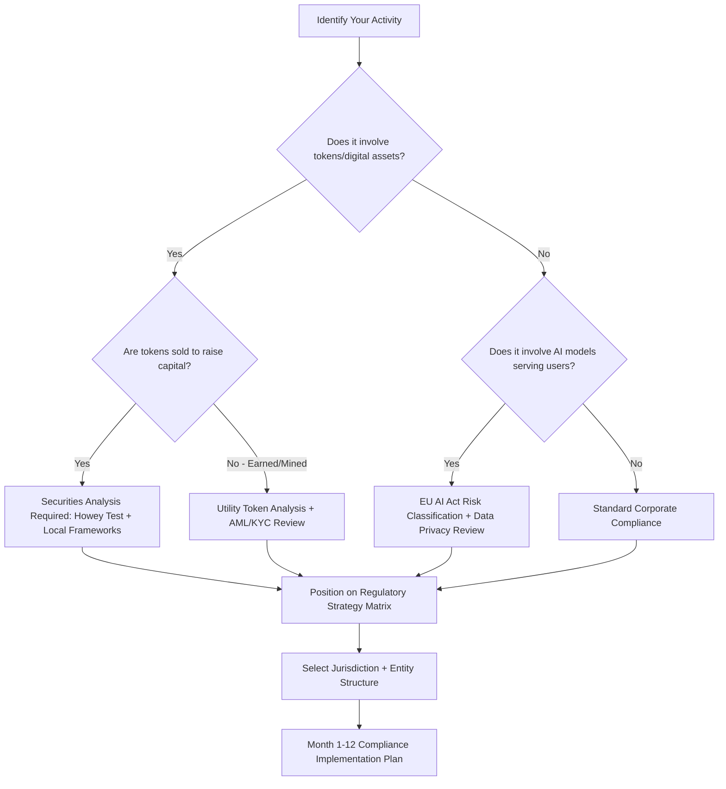

# Chapter 12: The Regulatory and Legal Landscape

> *Last Updated: March 2026*

> **Skim This Chapter**
> - Regulation is not an obstacle to defer but strategic terrain that shapes what you can build, where, and how you fund it -- the choices made in entity formation, token design, and jurisdiction selection in month one compound for years.
> - Output: A practical compliance strategy covering securities law, global regulatory frameworks (US, EU MiCA, Singapore, UAE), AI regulation, and DAO legal structures with a month-by-month implementation guide.

## 1. Introduction: Regulation as Strategic Terrain

Every technology revolution eventually meets its regulatory reckoning. The steam engine led to factory safety laws. Radio created the FCC. The internet spawned two decades of debate over Section 230, privacy rules, and antitrust enforcement. Now, Web3 and AI are converging on a regulatory moment of extraordinary complexity -- one that spans every major jurisdiction, touches every layer of the technology stack, and forces founders to navigate questions that legislators themselves have not yet resolved.

For founders building at the intersection of blockchain and artificial intelligence, regulation is not a distant concern to be deferred until scale demands it. It is foundational terrain that shapes what you can build, where you can build it, how you fund it, and who can use it. The regulatory choices you make in the first months of a venture -- entity formation, token design, data handling, jurisdiction selection -- will compound over years, creating either strategic advantage or existential liability.

The temptation is to treat regulation as an obstacle to be minimized or avoided. This instinct is understandable but dangerous. Projects that ignore regulatory realities do not escape regulation -- they simply encounter it unprepared, often at the worst possible moment. Conversely, founders who understand the regulatory landscape deeply can use it as a source of competitive advantage, building trust with users, attracting institutional capital, and creating defensible positions that less sophisticated competitors cannot replicate.

> **The regulatory edge:** Projects that ignore regulatory realities do not escape regulation—they simply encounter it unprepared, often at the worst possible moment. The founders who understand this terrain deeply use it as a source of competitive advantage.

## In This Chapter, You Will

- Understand how securities law applies to token launches and fundraising
- Compare regulatory frameworks across the US, EU, Singapore, UAE, and other key jurisdictions
- Navigate the emerging AI regulation landscape and its implications for product design
- Evaluate legal structures for DAOs and decentralized organizations
- Design a practical compliance strategy from day one
- Learn to work with regulators proactively rather than reactively
- Apply the Regulatory Strategy Matrix to your specific venture

## 2. Securities Law and Token Classification

### The Howey Test and Its Progeny

The foundational question for any Web3 founder raising capital or distributing tokens is deceptively simple: is your token a security? In the United States, the answer to this question carries enormous consequences. Securities must be registered with the Securities and Exchange Commission or qualify for an exemption, and failure to comply can result in enforcement actions, disgorgement of funds, and personal liability for founders.

The primary analytical framework remains the Howey Test, derived from a 1946 Supreme Court case involving citrus groves in Florida. Under Howey, an instrument is a security if it involves (1) an investment of money, (2) in a common enterprise, (3) with a reasonable expectation of profits, (4) derived primarily from the efforts of others. Each prong creates a distinct analytical challenge for token projects.

**Investment of money** is typically straightforward -- if someone pays ETH, USDC, or fiat currency for your token, this prong is satisfied. The more interesting questions arise around airdrops and earned tokens, where the investment may take the form of effort or attention rather than direct payment.

**Common enterprise** examines whether investors' fortunes are tied together or to the success of the promoter. Most token projects satisfy this prong because token holders share in common outcomes driven by the protocol's success.

**Expectation of profits** is where many token projects attempt to draw distinctions. If a token provides genuine utility -- access to a service, governance rights, computational resources -- its holders may not primarily expect financial returns. However, the SEC has taken an expansive view, arguing that even tokens with utility features can carry profit expectations when marketed with emphasis on potential value appreciation.

**Efforts of others** asks whether the profit potential depends primarily on the work of identifiable third parties (the founding team, a foundation, core developers). For early-stage projects where a centralized team drives all development, this prong is almost always satisfied. Genuinely decentralized protocols may have a stronger argument that no single party's efforts drive value.

### Utility Tokens vs. Security Tokens: A Spectrum, Not a Binary

The industry's early framing of "utility token vs. security token" as a clean binary was always an oversimplification. In practice, most tokens exist on a spectrum, and their classification can shift over time as the project matures.

**Factors favoring utility classification:**
- Token is required to access a functioning product or service at launch
- Pricing is set by supply and demand for the underlying service, not speculative markets
- Marketing emphasizes functionality rather than investment returns
- No lock-up periods or vesting schedules suggesting investment intent
- The network is sufficiently decentralized that no single party controls outcomes

**Factors favoring security classification:**
- Token sale occurs before the product or network is functional
- Marketing materials emphasize potential returns or price appreciation
- A centralized team retains significant control over token supply and protocol direction
- Proceeds are used primarily to fund development (investment in a common enterprise)
- Secondary market trading is the primary use case rather than protocol participation

The practical consequence is that founders must analyze their token design through the Howey framework at every stage of development. A token that begins as a security during its initial distribution may eventually become sufficiently decentralized to no longer meet the "efforts of others" prong -- a concept the SEC has acknowledged in limited contexts but never formalized into clear guidance.

### Case Study: SEC v. Ripple -- The Line Begins to Emerge

The SEC's enforcement action against Ripple Labs, filed in December 2020, became the defining legal battle over token classification in the United States. The case centered on whether XRP -- the native token of the Ripple payment network -- constituted an unregistered security.

The litigation produced a landmark partial summary judgment in July 2023 that introduced crucial distinctions into US securities law as applied to digital assets. Judge Analisa Torres ruled that Ripple's institutional sales of XRP -- direct sales to sophisticated investors through contracts -- constituted securities transactions because institutional buyers invested money in a common enterprise with an expectation of profits derived from Ripple's efforts. The contracts, marketing materials, and economic reality of these sales fit squarely within the Howey framework.

However, the court reached a different conclusion for XRP sold on public exchanges through programmatic sales. Because retail purchasers on secondary markets could not know whether their counterparty was Ripple, and because the circumstances of these blind transactions did not create the same investment-contract relationship, the court found that programmatic sales did not satisfy Howey. This distinction between institutional and programmatic sales sent shockwaves through the industry, suggesting that the same token could be a security in one context and not in another.

The ruling did not fully resolve XRP's status -- Ripple still faced penalties for its institutional sales, and the SEC appealed elements of the decision. But the case established critical precedent that context matters as much as the token itself. For founders, the implications are significant: the manner in which you distribute tokens, the representations you make to buyers, and the channels through which sales occur all affect whether you have sold a security. A token's legal classification is not an inherent property of the technology -- it is a function of the entire transaction and the expectations it creates.

The Ripple case cost the company over $200 million in legal fees across more than three years of litigation. Even for a well-capitalized company, the regulatory uncertainty consumed executive attention, deterred partnerships, and created ongoing market overhang. For early-stage founders, the lesson is unmistakable: the cost of getting token classification wrong vastly exceeds the cost of getting it right from the beginning.

## 3. Global Regulatory Frameworks: A Comparative Analysis

### The Fragmented Landscape

One of the most challenging aspects of building in Web3 and AI is that regulatory frameworks vary dramatically across jurisdictions. There is no single global regulator, no unified classification system, and no consistent enforcement philosophy. Founders must navigate a patchwork of national and regional rules that sometimes conflict with one another.

This fragmentation is not merely inconvenient -- it is strategically significant. Jurisdictional choice can determine your access to capital markets, your ability to serve certain user populations, your tax obligations, and your exposure to enforcement risk. Understanding the major regulatory regimes is therefore not optional legal trivia but essential strategic intelligence.

### United States: Enforcement-Led Regulation

The United States lacks comprehensive federal legislation governing digital assets. Instead, regulation has emerged primarily through enforcement actions and agency guidance from multiple overlapping bodies:

**SEC (Securities and Exchange Commission)**: Asserts jurisdiction over tokens it classifies as securities. Has pursued enforcement actions against dozens of projects and exchanges. The Commission's "regulation by enforcement" approach means that legal boundaries are defined after the fact through litigation rather than through clear ex ante rules.

**CFTC (Commodity Futures Trading Commission)**: Classifies Bitcoin and certain other tokens as commodities, asserting jurisdiction over derivatives markets. Has pursued enforcement actions against DeFi protocols operating as unregistered trading platforms.

**FinCEN (Financial Crimes Enforcement Network)**: Applies Bank Secrecy Act requirements to money services businesses, including certain cryptocurrency exchanges and wallet providers. Requires KYC/AML programs for covered entities.

**State Regulators**: Individual states maintain their own regulatory regimes. New York's BitLicense, established in 2015, remains the most restrictive state-level framework, while states like Wyoming have enacted legislation explicitly favorable to digital assets.

**Banking Regulators (OCC, FDIC, Federal Reserve)**: Have issued guidance on bank custody of digital assets, stablecoin reserves, and the integration of blockchain technology into the banking system.

The result is a regulatory environment defined by uncertainty, overlapping jurisdiction, and high compliance costs. Founders targeting US markets must account for federal and state-level requirements, multiple regulatory agencies, and the ever-present risk that enforcement priorities may shift without warning.

### European Union: The MiCA Framework

The European Union's Markets in Crypto-Assets Regulation (MiCA), which entered full application in December 2024, represents the most comprehensive legislative framework for digital assets enacted by any major jurisdiction. MiCA provides legal certainty across all 27 EU member states, creating a single regulatory passport for crypto-asset service providers.

**Key provisions of MiCA include:**

- **Asset-Referenced Tokens (ARTs)**: Stablecoins pegged to multiple assets or commodities face reserve requirements, redemption guarantees, and capital adequacy standards
- **E-Money Tokens (EMTs)**: Stablecoins pegged to a single fiat currency must be issued by authorized credit institutions or e-money institutions
- **Crypto-Asset Service Providers (CASPs)**: Exchanges, custodians, and other service providers must obtain authorization, maintain capital reserves, and implement governance standards
- **Market Abuse Rules**: Prohibitions on insider trading and market manipulation extended to crypto-asset markets
- **Environmental Disclosure**: Requirements for certain crypto-asset providers to disclose environmental impact data

MiCA deliberately excludes DeFi protocols that operate in a fully decentralized manner, NFTs that are truly unique, and security tokens (which fall under existing MiFID II financial regulation). This creates both clarity for covered activities and ambiguity at the boundaries -- particularly around what qualifies as "fully decentralized."

For founders, MiCA offers a significant advantage: regulatory certainty. A project that obtains CASP authorization in one EU member state can passport its services across the entire bloc. The compliance burden is substantial but predictable, which many founders prefer to the uncertainty of the US enforcement-led model. Early movers who secure MiCA authorization position themselves to serve the world's second-largest economic market with regulatory credibility that competitors lacking authorization cannot match.

### Case Study: MiCA Implementation -- Circle's Strategic Pivot to Europe

The implementation of MiCA created a revealing strategic divergence among major stablecoin issuers. Circle, the company behind USDC, made a deliberate decision to pursue early MiCA compliance as a competitive differentiator. In July 2024, Circle obtained an Electronic Money Institution license in France, making USDC and EURC the first global stablecoins to achieve full MiCA compliance.

This was not a defensive move -- it was an offensive strategic bet. By investing heavily in European compliance infrastructure before MiCA's full application date, Circle positioned USDC as the default compliant stablecoin for European institutions, exchanges, and DeFi protocols. European banks and payment processors that needed a compliant stablecoin partner had a clear choice: Circle had done the work, while competitors had not.

The contrast with Tether, the issuer of USDT and the market's dominant stablecoin by volume, was stark. Tether's more opaque reserve structure and reluctance to submit to EU regulatory oversight meant that several European exchanges delisted or restricted USDT trading pairs in anticipation of MiCA enforcement. This created a window of opportunity for USDC to gain market share in European markets precisely because Circle had treated regulation as a strategic asset rather than a cost center.

The broader lesson for founders is that regulatory transitions create competitive discontinuities. When a major jurisdiction implements new rules, the projects that comply earliest gain first-mover advantage in that market. The cost of early compliance is real, but it is often far less than the cost of being locked out of a major market or scrambling to comply under deadline pressure.

### Singapore: The Regulatory Sandbox Model

Singapore's Monetary Authority of Singapore (MAS) has developed a regulatory approach that balances innovation encouragement with financial stability through a graduated licensing framework and extensive use of regulatory sandboxes.

**The Payment Services Act (PSA)** provides a licensing framework for digital payment token (DPT) service providers, with requirements scaled to the size and risk profile of the business. MAS distinguishes between standard and major payment institution licenses, creating an on-ramp that allows smaller projects to operate under lighter regulation while scaling.

**The MAS FinTech Regulatory Sandbox** allows companies to test innovative financial products in a controlled environment with relaxed regulatory requirements. Projects accepted into the sandbox receive temporary exemptions from certain licensing requirements while demonstrating that their models work and that risks can be managed. Successful sandbox participants can then transition to full licensing.

Singapore's approach reflects a philosophy that regulation should be technology-neutral and activity-based rather than entity-based. The same activity attracts the same regulatory treatment regardless of whether it involves traditional finance or blockchain technology. This predictability has made Singapore one of the most attractive jurisdictions for Web3 companies, particularly those focused on payment infrastructure, digital asset trading, and institutional DeFi.

### United Arab Emirates: VARA and the Dubai Model

The Dubai Virtual Assets Regulatory Authority (VARA), established in 2022, represents one of the most ambitious purpose-built regulatory frameworks for digital assets. VARA operates within the broader UAE regulatory structure but with a specific mandate to regulate virtual asset activities.

**Key features of VARA's framework:**
- Activity-based licensing covering seven categories: advisory, broker-dealer, custody, exchange, lending, transfer, and management/investment services
- Graduated compliance requirements based on the scale of operations
- Mandatory segregation of customer assets
- Specific rules for marketing and promotion of virtual assets
- Requirements for token issuance and listing

The UAE's broader strategy includes the Abu Dhabi Global Market (ADGM), which operates its own regulatory framework under the Financial Services Regulatory Authority (FSRA). The ADGM framework targets more institutional-grade digital asset activities and has attracted major players seeking a regulated base for Middle Eastern and Asian operations.

For founders, the UAE offers several strategic advantages: a favorable tax environment (no personal income tax, low corporate tax), geographic positioning between European and Asian markets, aggressive government support for technology ventures, and a regulatory framework that was designed for digital assets rather than retrofitted from traditional financial regulation.

### Comparative Regulatory Matrix

| **Dimension** | **United States** | **EU (MiCA)** | **Singapore** | **UAE (VARA)** |
|---|---|---|---|---|
| **Approach** | Enforcement-led | Legislative | Sandbox + licensing | Purpose-built framework |
| **Clarity** | Low | High | Medium-High | Medium-High |
| **Compliance Cost** | High (uncertainty premium) | Medium-High (predictable) | Medium (graduated) | Medium (graduated) |
| **DeFi Treatment** | Increasingly hostile | Excluded if truly decentralized | Case-by-case | Activity-based |
| **Stablecoin Rules** | Fragmented | Comprehensive (ART/EMT) | Reserve requirements | Specific licensing |
| **Tax Treatment** | Capital gains on all dispositions | Varies by member state | No capital gains tax | No personal income tax |
| **Best For** | Projects targeting US institutional capital | Pan-European operations | Asian market access | Middle East/Asia bridge |

## 4. AI Regulation: The Emerging Framework

### The EU AI Act: Risk-Based Classification

The European Union's AI Act, which entered into force in August 2024 with phased implementation through 2027, establishes the world's first comprehensive legal framework for artificial intelligence. The Act classifies AI systems by risk level and imposes graduated obligations accordingly.

**Unacceptable Risk (Prohibited):** AI systems that manipulate human behavior through subliminal techniques, exploit vulnerabilities of specific groups, enable social scoring by governments, or perform real-time biometric identification in public spaces (with limited law enforcement exceptions). These systems are banned outright.

**High Risk:** AI systems used in critical infrastructure, education, employment, essential services, law enforcement, migration, and administration of justice. High-risk systems face mandatory requirements including risk management systems, data quality standards, technical documentation, transparency obligations, human oversight provisions, and accuracy/robustness requirements. Providers must conduct conformity assessments before placing these systems on the market.

**Limited Risk:** AI systems that interact with humans, generate synthetic content, or perform emotion recognition. These systems face transparency obligations -- users must be informed they are interacting with AI, and synthetic content must be labeled as such.

**Minimal Risk:** All other AI systems, which can be developed and deployed without additional regulatory obligations beyond existing law.

For founders, the AI Act's risk classification framework demands careful analysis of your product's use cases. An AI system designed for content recommendation (minimal risk) faces dramatically different obligations than one used for credit scoring (high risk) or employment screening (high risk). The classification is determined by the system's intended purpose and deployment context, not by its underlying technology.

### US AI Governance: Executive Orders and Sectoral Approaches

The United States has taken a markedly different approach to AI governance, relying primarily on executive orders, agency guidance, and voluntary industry commitments rather than comprehensive legislation.

Key developments include executive orders directing federal agencies to assess AI risks within their domains, voluntary commitments from major AI labs on safety testing and transparency, the NIST AI Risk Management Framework providing voluntary guidelines for responsible AI development, and state-level legislation (notably Colorado's AI Act addressing algorithmic discrimination in insurance).

The US approach reflects a philosophical preference for innovation-permissive regulation that avoids constraining development. For founders, this creates both opportunity and risk: fewer compliance obligations in the near term, but significant uncertainty about future regulatory direction and the potential for rapid, retroactive policy shifts.

### Case Study: China's AI Governance -- Comprehensive and Control-Oriented

China has developed the most extensive national AI regulatory framework, implementing a series of targeted regulations that collectively govern nearly every aspect of AI development and deployment. This approach offers an instructive contrast to both the EU's risk-based framework and the US's sectoral model.

The Algorithmic Recommendation Regulation (March 2022) requires providers of algorithm-based recommendation services to register their algorithms with the Cyberspace Administration of China, disclose the basic principles of their recommendation systems, and allow users to opt out of personalized recommendations. The regulation specifically targets the addictive engagement loops that drive social media and content platforms.

The Deep Synthesis Regulation (January 2023) governs deepfakes and AI-generated content, requiring providers to label synthetic content, verify user identities, and maintain logs of generated content. This regulation anticipated concerns about AI-generated misinformation that other jurisdictions would not address for another year or more.

The Generative AI Regulation (August 2023) requires generative AI services offered to the public in China to complete a security assessment and register with authorities before launch. Training data must reflect "core socialist values," and providers must implement measures to prevent the generation of content that undermines national unity or social stability.

For founders building AI products, China's approach illustrates that AI governance can be highly prescriptive and that compliance requirements in different markets may conflict. A generative AI system designed to comply with China's content requirements may be unable to simultaneously satisfy EU transparency obligations, while a system built for maximum openness under US norms may be unlicenseable in China. These tensions make geographic strategy for AI products particularly consequential.

## 5. Intellectual Property in Web3 and Open-Source Contexts

### The Open-Source Paradox

Web3 and AI development exist in tension with traditional intellectual property frameworks. The open-source ethos that underpins much of blockchain development -- where code is publicly visible, forkable, and composable -- creates powerful network effects and community trust. But it also raises difficult questions about how founders protect their innovations and create defensible businesses.

**Smart Contract IP**: Smart contracts deployed on public blockchains are visible to anyone. The code itself cannot be protected through trade secrets, and copyright protection for functional code is limited. Patents may apply to novel technical methods but are expensive to obtain and difficult to enforce across jurisdictions.

**Forking and Competition**: The ability to fork open-source protocols means that any successful design can be replicated. Uniswap's code has been forked hundreds of times. The defensibility comes not from the code itself but from liquidity, community, brand, and network effects -- none of which are traditional IP.

**AI Model IP**: The intellectual property status of AI models and their outputs remains deeply unsettled. Key open questions include whether AI-generated content is copyrightable (most jurisdictions currently say no without meaningful human creative input), whether training AI on copyrighted data constitutes fair use (pending litigation in multiple jurisdictions), and whether model weights constitute trade secrets when they can be reverse-engineered or extracted through careful prompting.

### Practical IP Strategy for Web3/AI Founders

Rather than relying solely on traditional IP protections, founders should build multi-layered defensibility:

**Open Core Models**: Release core protocol code as open source to build trust and community while maintaining proprietary tooling, interfaces, or optimizations as a revenue layer.

**Data Moats**: Accumulate proprietary datasets, user-generated content, or fine-tuning data that cannot be easily replicated even if the underlying model architecture is public.

**Brand and Community**: Invest in brand recognition and community loyalty that persists even when competitors fork your code.

**Strategic Patents**: File patents selectively for genuinely novel technical innovations, particularly those that competitors would need to implement (and therefore license) to be competitive.

**Contributor Agreements**: Implement clear contributor license agreements (CLAs) that define IP ownership for community-contributed code, preventing future disputes.

## 6. DAO Legal Structures and Jurisdictional Considerations

### The DAO Governance Problem

Decentralized Autonomous Organizations present a fundamental challenge to existing legal frameworks. Traditional law assumes that organizations have identifiable legal persons (natural or corporate) who bear rights and obligations. DAOs, by design, distribute governance across token holders who may be anonymous, pseudonymous, and spread across dozens of jurisdictions.

Without a legal wrapper, a DAO faces several critical risks:

**Unlimited Personal Liability**: In most jurisdictions, an unincorporated association exposes its members to joint and several personal liability. Every token holder could theoretically be sued for the DAO's obligations.

**Tax Uncertainty**: Without a recognized legal entity, tax obligations are unclear. In the US, an unincorporated DAO could be classified as a general partnership, creating pass-through tax obligations for all members.

**Contract Incapacity**: A DAO without legal personality cannot enter into contracts, lease office space, hire employees, or engage service providers in most jurisdictions.

**Regulatory Exposure**: Unstructured DAOs lack the compliance infrastructure (registered agents, AML officers, designated contacts) that regulators require for engagement.

### Case Study: Wyoming DAO LLC -- Pioneering Legal Recognition

Wyoming became the first US state to create a specific legal framework for DAOs when it enacted the Wyoming Decentralized Autonomous Organization Supplement in July 2021. The legislation allows DAOs to register as limited liability companies (LLCs) under Wyoming law while maintaining decentralized governance structures.

The Wyoming DAO LLC framework requires that the DAO's articles of organization include a statement that the company is a DAO, specify whether the DAO is member-managed or algorithmically managed, and identify the smart contracts that govern the organization. The LLC wrapper provides limited liability protection to DAO members -- meaning their personal assets are shielded from the DAO's obligations -- while preserving the governance flexibility that DAOs require.

The practical implications were significant. CityDAO, one of the first organizations to register under the Wyoming framework, used its DAO LLC structure to collectively purchase land in Wyoming, demonstrating that DAOs could interact with the traditional property rights system. The American CryptoFed DAO registered as a Wyoming DAO LLC to pursue recognition as a decentralized monetary system, though its SEC registration application was subsequently withdrawn amid regulatory challenges.

The Wyoming framework is not without limitations. Federal law and the laws of other states are not bound by Wyoming's classification, creating potential conflicts when a DAO LLC operates across jurisdictions. The SEC has not deferred to Wyoming's framework in evaluating whether DAO tokens are securities. And the tension between algorithmic governance and the legal duties of LLC managers (fiduciary duties, duty of care) remains largely unresolved.

Nevertheless, the Wyoming model established a template that other jurisdictions have studied and adapted. The Marshall Islands enacted DAO-specific legislation in 2022, and several other US states and international jurisdictions have explored similar frameworks. For founders, the existence of DAO legal wrappers -- however imperfect -- represents a meaningful step toward integrating decentralized governance with the legal infrastructure that the broader economy requires.

### Choosing a DAO Legal Wrapper

Founders implementing DAO governance should evaluate several wrapper options:

**Wyoming DAO LLC (US)**: Limited liability, pass-through taxation, smart-contract governance recognition. Best for US-nexus DAOs with identifiable members.

**Marshall Islands DAO LLC**: Offshore alternative with similar structure, potentially useful for globally distributed DAOs without strong US nexus.

**Cayman Islands Foundation Company**: Common for DeFi protocols seeking a legal entity that can hold IP, enter contracts, and interact with traditional finance while maintaining decentralized governance at the protocol level.

**Swiss Association (Verein)**: Flexible non-profit structure used by many blockchain foundations (Ethereum Foundation, Solana Foundation) for protocol stewardship.

**Singapore Foundation (CLG)**: Company limited by guarantee, used by projects seeking Asian regulatory engagement with a neutral governance structure.

The choice of legal wrapper should be driven by the DAO's specific needs: where are its members concentrated, what assets does it hold, what contracts must it enter, and which regulatory regimes must it engage?

## 7. KYC/AML Compliance for Web3 Projects

### The Non-Negotiable Foundation

Anti-money laundering (AML) and know-your-customer (KYC) requirements are among the few regulatory obligations that apply nearly universally across jurisdictions. The Financial Action Task Force (FATF) -- the global standard-setter for AML -- has issued guidance extending traditional AML obligations to Virtual Asset Service Providers (VASPs), and virtually every major jurisdiction has implemented these standards in some form.

For Web3 founders, the practical question is not whether AML compliance applies -- it almost certainly does if your project touches fiat currency, custodies user assets, or facilitates transfers between parties -- but how to implement it without destroying the user experience or undermining the privacy properties that users value.

### The Travel Rule and Its Implications

The FATF Travel Rule requires VASPs to collect, hold, and transmit originator and beneficiary information for transactions above a threshold (typically $1,000 USD equivalent). This rule, originally designed for traditional wire transfers, creates significant implementation challenges for blockchain-based transfers where counterparty information may not be readily available.

Compliance solutions are emerging -- protocols like TRISA and Shyft Network provide infrastructure for Travel Rule compliance -- but the implementation burden remains substantial, particularly for smaller projects. Founders must budget for compliance infrastructure from the earliest stages of development.

### DeFi and the Compliance Gap

Truly decentralized protocols -- where no single entity controls access, custodies assets, or facilitates transactions -- exist in a regulatory gray zone. FATF guidance suggests that the Travel Rule applies to VASPs but acknowledges that fully decentralized protocols without a controlling entity may fall outside the VASP definition.

In practice, however, regulators have taken an expansive view. The US Treasury's sanctioning of Tornado Cash in 2022 demonstrated that enforcement agencies may target protocol-level infrastructure regardless of decentralization claims. The subsequent legal challenge to these sanctions has produced mixed results, with courts grappling with whether immutable smart contracts constitute "property" that can be sanctioned.

For founders, the practical guidance is to assume that AML obligations apply unless you have strong legal advice to the contrary, and to design compliance mechanisms that can be activated or enhanced as regulatory expectations evolve. Building KYC/AML capabilities into your architecture from day one -- even if you initially deploy them selectively -- is far cheaper than retrofitting compliance onto a system designed without it.

### Practical AML Implementation Framework

**Tier 1 (Minimum Viable Compliance):**
- Wallet screening against OFAC and other sanctions lists
- Transaction monitoring for suspicious patterns
- Policies and procedures documentation
- Designated compliance officer (can be part-time at early stage)

**Tier 2 (Growth Stage):**
- Full KYC for fiat on/off-ramps
- Enhanced due diligence for high-value transactions
- Travel Rule compliance for VASP-to-VASP transfers
- Suspicious activity reporting (SARs) capability
- Regular compliance training for all team members

**Tier 3 (Scale):**
- Automated transaction monitoring systems
- Dedicated compliance team
- Regular independent audits of AML program
- Multi-jurisdiction compliance frameworks
- Engagement with regulators and industry working groups

## 8. Practical Regulatory Strategy for Founders

### The Regulatory Strategy Matrix

Every Web3/AI venture can be positioned on a two-dimensional matrix defined by regulatory intensity (how heavily regulated your activity is) and jurisdictional complexity (how many regulatory regimes you must navigate).

**Low Intensity / Low Complexity** (e.g., open-source developer tools, non-financial AI applications): Regulatory burden is minimal. Focus on standard corporate compliance, employment law, and basic IP protection. Legal costs should be modest.

**High Intensity / Low Complexity** (e.g., a regulated exchange operating in a single jurisdiction): Regulatory burden is substantial but concentrated. Invest deeply in understanding and complying with one regime. Consider regulatory licensing as a competitive moat.

**Low Intensity / High Complexity** (e.g., a globally distributed open-source protocol without token): Regulatory burden per jurisdiction is light, but the number of jurisdictions creates complexity. Focus on entity structuring and jurisdiction selection to minimize exposure points.

**High Intensity / High Complexity** (e.g., a cross-border DeFi protocol with token-based governance): Maximum regulatory challenge. Requires sophisticated legal architecture, multi-jurisdiction compliance, and significant ongoing legal spend. This is where many Web3 projects land, and where regulatory strategy most directly affects survival.

### Building Regulatory Strategy from Day One

**Month 1-3: Foundation**
- Engage experienced Web3/AI legal counsel (not general corporate attorneys)
- Determine token classification analysis if applicable
- Select entity jurisdiction(s) based on regulatory analysis, not solely tax optimization
- Document all material decisions and the reasoning behind them
- Establish basic AML/KYC framework if handling value transfers

**Month 3-6: Structure**
- Form legal entities with appropriate governance documents
- Implement compliance policies and procedures
- Obtain necessary licenses or registrations (or initiate applications)
- Establish relationships with compliance service providers (KYC, sanctions screening)
- Create a regulatory monitoring process to track relevant developments

**Month 6-12: Operationalize**
- Conduct internal compliance audit
- Train all team members on regulatory obligations
- Establish regulatory engagement strategy (direct outreach, industry association membership)
- Build compliance into product development workflow
- Prepare for external audit if required by jurisdiction

**Ongoing:**
- Quarterly regulatory landscape review
- Annual compliance program assessment
- Proactive engagement with regulatory consultations and comment periods
- Adaptation of compliance program as regulations evolve

### Case Study: Singapore's Regulatory Sandbox -- Grab Financial Group

Grab, Southeast Asia's dominant ride-hailing platform, provides an instructive example of how founders can use regulatory sandbox programs as strategic accelerants. When Grab sought to expand into financial services -- digital payments, lending, and insurance -- it faced the challenge of operating across multiple Southeast Asian jurisdictions with different financial regulatory regimes.

In Singapore, Grab Financial Group applied for and was accepted into the MAS regulatory sandbox, which allowed it to test digital payment and lending products under relaxed regulatory conditions while demonstrating its risk management capabilities. The sandbox provided a structured environment to iterate on compliance processes, build a track record with the regulator, and refine product-market fit under real conditions.

The sandbox experience was not merely a compliance exercise -- it was a strategic one. By engaging proactively with MAS, Grab built institutional credibility that facilitated its subsequent application for a full digital banking license. When MAS awarded digital bank licenses in December 2020, Grab (through its consortium with Singapore Telecommunications) was among the successful applicants, having already demonstrated its capabilities through the sandbox process.

For Web3 and AI founders, the Grab example illustrates a broader principle: regulatory engagement is not a one-time cost but an ongoing relationship. Founders who invest early in building trust with regulators -- through sandbox participation, voluntary compliance, or direct engagement -- create institutional relationships that pay dividends when regulatory decisions are made. Regulators, like all human institutions, are more likely to support organizations they know and trust than unknown entities that appear only when compelled to do so.

## 9. Working with Regulators Proactively

### The Proactive Engagement Thesis

The default founder instinct toward regulation is avoidance -- minimize contact, minimize disclosure, minimize compliance overhead. This instinct is economically rational in the short term but strategically costly over time. Founders who engage regulators proactively gain several advantages:

**Information Asymmetry**: Direct engagement with regulatory staff provides insight into enforcement priorities, upcoming rulemaking, and the agency's interpretation of ambiguous provisions. This intelligence is not available to founders who engage only through enforcement proceedings.

**Relationship Capital**: Regulators are more likely to provide informal guidance, extend compliance timelines, and consider the regulated entity's perspective when they have an existing relationship with the founders.

**Industry Shaping**: Founders who participate in regulatory consultations, submit comment letters, and engage in industry working groups have the opportunity to shape the rules that will govern their industry. Absence from these processes cedes influence to incumbents and competitors.

**Enforcement Mitigation**: When regulatory scrutiny inevitably arrives, a track record of proactive engagement and good-faith compliance can significantly influence the severity of any enforcement outcome.

### Practical Engagement Channels

**Regulatory Comment Periods**: When agencies propose new rules, they typically solicit public comment. Submitting thoughtful, well-supported comments is one of the highest-leverage activities a founder can undertake. Comments become part of the public record and can directly influence final rulemaking.

**Industry Associations**: Organizations like the Blockchain Association, DeFi Education Fund, Chamber of Digital Commerce, and their international equivalents provide collective voice, regulatory intelligence, and networking with peers facing similar challenges. Membership costs are modest relative to the value of the intelligence and advocacy they provide.

**Direct Regulatory Meetings**: Most agencies will meet with regulated entities and their counsel to discuss compliance questions. These meetings should be prepared carefully -- bring specific questions, proposed solutions, and a clear understanding of the agency's concerns.

**Academic and Policy Engagement**: Publishing research, participating in policy conferences, and engaging with academic institutions that influence regulatory thinking builds long-term credibility and positions founders as thoughtful participants in the policy ecosystem.

### Case Study: Coinbase and the Long Game of Regulatory Engagement

Coinbase's approach to US regulation illustrates both the costs and benefits of proactive regulatory engagement. From its founding, Coinbase pursued a compliance-first strategy: obtaining money transmitter licenses in every US state, registering with FinCEN, and voluntarily implementing KYC/AML standards that exceeded minimum requirements. The company engaged extensively with the SEC, seeking to register as a regulated securities exchange and broker-dealer.

Despite this proactive approach, Coinbase was not immune to enforcement action. The SEC sued Coinbase in June 2023, alleging that the exchange operated as an unregistered securities exchange, broker, and clearing agency. The enforcement action came despite Coinbase's years of regulatory engagement and its public petition asking the SEC to undertake formal rulemaking for digital assets.

The apparent failure of Coinbase's engagement strategy, however, masks its significant strategic benefits. Coinbase's compliance track record gave it credibility in its legal defense that a less compliant competitor would lack. The company's public advocacy for clear regulatory rules generated significant political support, contributing to congressional momentum for digital asset legislation. And Coinbase's regulatory infrastructure allowed it to continue operating during the litigation -- while less compliant competitors were shut down entirely.

The lesson is nuanced: proactive regulatory engagement does not guarantee favorable treatment, but it creates strategic options and credibility that pure avoidance never can. Founders should engage with regulators not because it guarantees success but because the alternative -- waiting for enforcement to define the rules -- is almost always worse.

## 10. Implementation Guide: Building Your Regulatory Compliance Program

### The Compliance Architecture

An effective compliance program is not a stack of documents in a drawer -- it is a living system integrated into your organization's operations, product development, and decision-making processes.

**Governance Layer:**
- Board or leadership team with compliance oversight responsibilities
- Designated compliance officer with direct reporting to leadership
- Clear escalation procedures for compliance issues
- Regular compliance reporting to stakeholders

**Policy Layer:**
- AML/KYC policies and procedures
- Token classification analysis and legal opinions (if applicable)
- Data protection and privacy policies (GDPR, CCPA, etc.)
- AI transparency and disclosure policies (if applicable)
- Sanctions screening procedures
- Record retention policies

**Technology Layer:**
- Automated wallet and transaction screening
- KYC verification infrastructure
- Transaction monitoring and alerting systems
- Compliance record-keeping and audit trail
- Regulatory reporting capabilities

**People Layer:**
- Compliance training for all employees
- Specialized training for customer-facing and engineering staff
- External legal counsel with relevant expertise
- Relationships with compliance service providers
- Industry association memberships

### Budgeting for Compliance

Early-stage founders frequently underestimate compliance costs. Realistic budgeting should account for the following:

**Legal Counsel**: $50,000-200,000 annually for a pre-revenue Web3 project, depending on regulatory complexity. This is not an area to economize -- experienced counsel prevents problems that cost orders of magnitude more to resolve.

**Compliance Infrastructure**: $20,000-100,000 annually for KYC/AML screening, transaction monitoring, and compliance management tools.

**Licensing and Registration**: Varies dramatically by jurisdiction, from minimal fees in some regimes to $100,000+ for comprehensive licensing in others.

**Personnel**: A dedicated compliance hire becomes necessary at growth stage; at early stage, the function can be covered part-time by a founder or operations lead with appropriate legal guidance.

**Ongoing Monitoring**: $10,000-50,000 annually for regulatory monitoring services, industry association memberships, and continuing education.

For a typical pre-seed or seed-stage Web3 project, founders should allocate 10-15% of their budget to legal and compliance. This allocation may seem high relative to other startup functions, but it reflects the reality that regulatory failure is the single most common existential risk for Web3 ventures.

### The Compliance-Product Integration Workflow

Compliance should not be a gate at the end of the product development process -- it should be integrated throughout:

1. **Feature Specification**: Before building, assess regulatory implications. Does this feature create new compliance obligations? Does it change our regulatory classification?

2. **Design Review**: Include compliance considerations in technical design reviews. Can compliance requirements be met architecturally rather than through manual processes?

3. **Implementation**: Build compliance capabilities (logging, screening, disclosure) alongside product features, not after them.

4. **Testing**: Include compliance scenarios in testing. Can the system handle sanctions list updates? Does KYC verification work for users in all target jurisdictions?

5. **Deployment**: Verify that all required disclosures, terms of service, and regulatory filings are current before launching new features.

6. **Monitoring**: Track compliance metrics alongside product metrics. Establish alerting for compliance anomalies.

## Key Takeaways

### Regulation Is Terrain, Not an Obstacle
The regulatory landscape is a strategic environment to be navigated, not a wall to be avoided. Founders who understand the terrain deeply can find paths that competitors miss. Jurisdictional selection, entity structuring, and compliance timing all create competitive advantage when executed thoughtfully.

### Token Classification Determines Destiny
For Web3 founders, the securities law analysis of your token is the single highest-stakes legal question you will face. Get the Howey analysis right from the beginning. Budget for experienced securities counsel.

### Geographic Strategy Is Regulatory Strategy
Where you incorporate, where your team sits, and which markets you serve are fundamentally regulatory decisions. The comparative regulatory matrix -- US enforcement uncertainty, EU MiCA clarity, Singapore sandbox gradualism, UAE purpose-built frameworks -- should inform your geographic strategy as much as talent availability or tax considerations.

### AI Regulation Is Accelerating
The EU AI Act establishes a classification framework that will influence global AI governance for years. Build AI systems with transparency, documentation, and human oversight capabilities from the start, even if you do not serve European users today.

### Compliance Is Cheaper Than Enforcement
Every dollar spent on proactive compliance saves multiples in enforcement defense, business disruption, and reputational damage. Budget 10-15% of your early-stage spend on legal and compliance -- it is not overhead, it is insurance.

## Founder's Checklist

- [ ] Engage experienced Web3/AI legal counsel before token design or fundraising
- [ ] Complete a thorough token classification analysis under Howey and applicable non-US frameworks
- [ ] Select entity jurisdiction(s) based on regulatory analysis, not solely on tax optimization
- [ ] Implement baseline AML/KYC infrastructure appropriate to your project's stage and risk profile
- [ ] Establish a regulatory monitoring process covering all jurisdictions where you operate or serve users
- [ ] Budget 10-15% of early-stage spend for legal and compliance
- [ ] Evaluate DAO legal wrapper options if implementing decentralized governance
- [ ] Classify your AI systems under the EU AI Act risk framework, even if not currently serving EU users
- [ ] Build compliance capabilities into your product development workflow
- [ ] Join at least one relevant industry association for regulatory intelligence and collective advocacy
- [ ] Submit comment letters on proposed regulations that affect your venture
- [ ] Conduct an internal compliance audit within your first year of operations

## Exercises

- Exercise 1: Apply the Howey Test to your token design (or a hypothetical token), analyzing each prong and identifying the strongest argument for and against security classification.
- Exercise 2: Using the Comparative Regulatory Matrix, evaluate three jurisdictions for your venture's entity formation. Score each on clarity, compliance cost, market access, tax treatment, and strategic positioning.
- Exercise 3: Map your AI system against the EU AI Act risk classification. Identify which category your system falls into and what compliance obligations that classification triggers.
- Exercise 4: Draft a 12-month regulatory strategy using the month-by-month implementation guide. Identify the three highest-priority compliance actions for your specific venture and estimate their cost.
- Exercise 5: Design a DAO legal structure for a hypothetical DeFi protocol, selecting a legal wrapper, identifying the jurisdiction, and addressing how the wrapper interacts with token-based governance.

## Further Reading

- **The Blockchain and the New Architecture of Trust** by Kevin Werbach — A rigorous examination of how blockchain technology intersects with legal and regulatory frameworks, written by a regulatory scholar who advised the FCC and FTC.
- **Cryptoassets: The Innovative Investor's Guide to Bitcoin and Beyond** by Chris Burniske and Jack Tatar — Provides a taxonomy for classifying digital assets that remains useful for navigating securities law distinctions between utility tokens, security tokens, and cryptocurrencies.
- **The Brussels Effect: How the European Union Rules the World** by Anu Bradford — Explains how EU regulatory frameworks like MiCA and the AI Act become de facto global standards, essential reading for founders building cross-jurisdictional compliance strategies.
- **Open (Source) for Business** by Heather Meeker — A practical guide to open-source licensing that addresses the legal complexities founders face when building on open protocols while maintaining regulatory compliance.
- **The Code of Capital** by Katharina Pistor — Reveals how legal coding of assets creates and destroys wealth, providing deep context for understanding why jurisdiction selection and legal structure matter as much as technology choices.

## Sources

### Securities Law and Token Classification
- SEC v. W.J. Howey Co., 328 U.S. 293 (1946).
- SEC v. Ripple Labs Inc., No. 20-cv-10832 (S.D.N.Y. 2023).
- SEC, "Framework for 'Investment Contract' Analysis of Digital Assets." sec.gov, 2019.
- Hinman, William. "Digital Asset Transactions: When Howey Met Gary (Plastic)." Speech, SEC, 2018.

### Global Regulatory Frameworks
- European Parliament. "Markets in Crypto-Assets Regulation (MiCA)." Official Journal of the European Union, 2023.
- Monetary Authority of Singapore. "A Guide to Digital Token Offerings." mas.gov.sg, 2023.
- Dubai Virtual Assets Regulatory Authority. "Virtual Assets and Related Activities Regulations." vara.ae, 2023.
- Financial Action Task Force. "Updated Guidance for a Risk-Based Approach to Virtual Assets and Virtual Asset Service Providers." fatf-gafi.org, 2021.

### AI Regulation
- European Parliament. "Artificial Intelligence Act." Official Journal of the European Union, 2024.
- Cyberspace Administration of China. "Interim Measures for the Management of Generative Artificial Intelligence Services." 2023.
- National Institute of Standards and Technology. "AI Risk Management Framework (AI RMF 1.0)." nist.gov, 2023.
- Executive Order 14110, "Safe, Secure, and Trustworthy Development and Use of Artificial Intelligence." Federal Register, 2023.

### DAO Legal Structures
- Wyoming Legislature. "Decentralized Autonomous Organization Supplement." W.S. 17-31-101 through 17-31-116, 2021.
- Brummer, Chris, and Rodrigo Seira. "Legal Wrappers and DAOs." Stanford Journal of Blockchain Law and Policy, 2022.
- Coalition of Automated Legal Applications (COALA). "Model Law for Decentralized Autonomous Organizations." 2021.

### Compliance and Practice
- Chainalysis. "The Chainalysis Crypto Crime Report." chainalysis.com, 2024.
- Elliptic. "State of Cross-Chain Crime." elliptic.co, 2023.
- Circle. "MiCA Compliance and USDC in Europe." circle.com, 2024.
- PwC. "Global Crypto Regulation Report." pwc.com, 2024.

## Related Case Studies

- See the Case Studies Compendium for curated examples relevant to this chapter: ../case-studies/compendium.md
