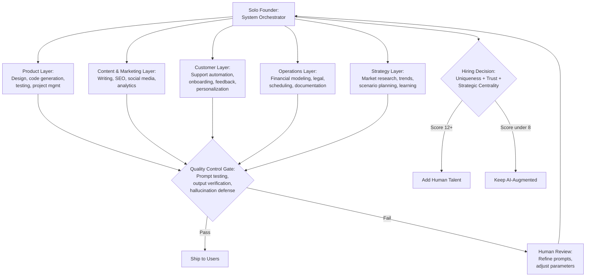

# Chapter 20: Solo Founders AI Era

> *Last Updated: March 2026*

> **Skim This Chapter**
> - AI has qualitatively transformed what a solo founder can build; the role shifts from direct executor to system orchestrator, coordinating an integrated AI stack across product, marketing, operations, and strategy with deliberate workflow design and quality control.
> - Output: an AI stack architecture for your venture, a decision framework for when to stay solo versus hire, and the new skill requirements (prompt engineering, agent design, system thinking) that define the AI-augmented founder.

## In This Chapter, You Will

- Learn how AI tools have shifted the founder-to-team ratio and created structural advantages for solo builders
- Design an integrated AI stack functioning as a virtual team across product, content, customer, operations, and strategy layers
- Apply decision frameworks for determining when to add human talent versus remain AI-augmented
- Develop the core skills of prompt engineering, agent design, and system orchestration

## 1. Introduction: A New Kind of Founder

We are witnessing the emergence of a fundamentally new type of entrepreneur: the solo founder with global reach. While conventional wisdom has long favored founding teams of two or three—distributing risk, skills, and emotional burden—artificial intelligence is rapidly rewriting these established rules. The lone builder, once limited by human capacity constraints, can now leverage AI to extend their capabilities across domains that previously required dedicated specialists.

This is not merely a productivity boost. It is a qualitative transformation in how companies are conceived, built, and scaled. The solo founder using AI effectively operates more like a conductor leading an orchestra of intelligent systems than a traditional entrepreneur attempting to do everything alone.

> **The new math:** A solo founder with the right AI tools now has capabilities that required a 15-person team three years ago. The question is no longer whether you can build alone---it is whether you should.

For founders building in Web3 and AI specifically, this shift creates unprecedented leverage. Where previous generations of solo builders faced inherent limitations in bandwidth and expertise, today's AI-augmented founders can design, develop, deploy, and distribute products with complexity that would have required substantial teams just a few years ago. The result is not just more efficient companies but fundamentally different organizational structures—built around the capabilities and vision of a single human coordinating an ecosystem of AI collaborators.

## 2. How AI is Changing the Founder-to-Team Ratio

### AI as Team Multiplier

The traditional startup trajectory typically followed a predictable pattern: founder with idea → add co-founder for complementary skills → hire specialists as funding allows → build functional teams as the company scales. This progression reflected fundamental human capacity limitations—no individual could simultaneously handle product design, engineering, marketing, customer support, operations, and financing with sufficient quality.

AI dramatically alters this equation. Today's solo founders can access:
- Design capabilities through generative visual AI (Midjourney, DALL-E, Runway)
- Content creation via large language models (GPT-4, Claude, Llama)
- Code generation and technical implementation through AI coding assistants
- Data analysis and business intelligence through natural language query systems
- Customer support automation through conversation models
- Operations management through AI-augmented workflow tools

The data supports a dramatic shift in solo founder capability. According to a 2024 McKinsey Global Institute report, generative AI tools can automate 60–70% of employee work activities across knowledge-intensive roles, effectively compressing team-equivalent output into individual workflows.¹ Y Combinator reported in its Winter 2024 batch that single-founder and two-person teams comprised a record share of applicants, with several building products that would have required 5–10 engineers just three years earlier.² GitHub's 2023 research on Copilot found that developers using AI coding assistants completed tasks 55% faster, with the effect amplified for solo practitioners who lack teammates to consult.³ Andreessen Horowitz partner Justine Moore noted in 2024 that AI-native startups are reaching $1M ARR with an average of 2.5 employees—compared to 10–15 employees in the 2018 SaaS cohort.⁴

By 2026, these trends have accelerated further. The AI coding assistant market reached $7.4 billion in 2025, with 85% of developers regularly using AI tools—up from ~40% just a year earlier. GitHub Copilot surpassed 20 million cumulative users and was adopted by 90% of Fortune 100 companies. Cursor (Anysphere) reached $1 billion+ in annualized revenue and a $29.3 billion valuation, capturing 18% market share within 18 months of launch. Agentic AI tools—where the AI can autonomously plan, execute, and iterate on multi-step tasks—have become the next frontier, with the agentic AI market valued at $7.5 billion in 2025 and projected to reach $199 billion by 2034. These agentic capabilities further amplify the solo founder advantage, enabling a single person to orchestrate complex development workflows that previously required entire engineering teams.

This transformation means you no longer need ten people to launch and scale a venture—you need ten well-configured tools and one clear directing mind. The cognitive leverage provided by these systems effectively amplifies the founder's capabilities across multiple domains simultaneously, enabling execution velocity previously unattainable for individual entrepreneurs.

> **Note on evidence**: The "10x capability multiplier" framing is directional rather than precisely measurable—individual results vary by domain, technical literacy, and tool maturity. The studies cited above measure specific productivity gains (55% faster coding, 60–70% task automation) rather than an aggregate "10x" figure. We use the framing to convey the order-of-magnitude shift, not a literal multiplier.

### Solo Founder Viability

The rising sophistication of AI tools has correspondingly elevated the credibility and viability of solo-founded ventures. Where investors and partners might previously have viewed single-founder companies with skepticism—questioning their ability to execute across necessary functions—the demonstrated capabilities of AI-augmented individuals have shifted this perception.

This viability emerges most powerfully when three elements align:
1. **Vision clarity**: A precisely articulated problem and solution understanding
2. **Execution velocity**: The ability to rapidly iterate through build-measure-learn cycles
3. **Technical literacy**: Sufficient understanding to effectively orchestrate AI capabilities

When these factors converge, solo founders can now credibly compete with conventionally structured teams—sometimes outperforming them through reduced coordination overhead and faster decision cycles.

### Competitive Advantage Shifts

This transformation creates several structural advantages for AI-augmented solo founders:

**Execution speed overtakes organizational complexity.** Traditional organizations face unavoidable coordination costs—meetings, documentation, communication overhead—that increase exponentially with team size. Solo founders working with AI systems eliminate most of these costs, enabling idea-to-implementation cycles measured in hours rather than weeks.

**Decision velocity creates market advantage.** Without the need for consensus building or stakeholder alignment, solo founders can pivot, experiment, and adapt with minimal friction. This rapid iteration enables more hypothesis testing within the same timeframe, accelerating the path to product-market fit.

**Capital efficiency generates strategic optionality.** With dramatically lower operating costs and burn rates, AI-augmented solo ventures can extend runway, delay or minimize dilution, and maintain greater control over their strategic direction—creating resilience during market downturns and reducing dependency on external financing timetables.

**AI-native workflows enable continuous product evolution.** Rather than batch-processing product improvements through development sprints, solo founders can implement real-time iteration cycles—continually refining features, messaging, and user experience based on immediate feedback and emerging opportunities.

## 3. Building with AI Co-Founders: From One Person to an Organization

The following diagram shows how a solo founder orchestrates an integrated AI stack, with the founder at the center acting as system conductor rather than direct executor, coordinating across five capability layers with quality control gates at each handoff.

### AI Tool Selection and Integration

Creating an effective AI-augmented venture requires moving beyond ad hoc tool usage to deliberate "AI stack" design—constructing an interconnected system of capabilities that function as virtual team members rather than isolated utilities. This stack typically includes:

**Product Development Layer**
- Design tools for visual asset creation and interface design
- Code generation systems for implementation
- Testing frameworks for quality assurance
- Project management assistants for coordination

**Content and Marketing Layer**
- Writing assistants for website, documentation, and marketing copy
- SEO and distribution optimization tools
- Social media content generation and scheduling systems
- Analytics and performance tracking assistants

**Customer Engagement Layer**
- Conversation models for support automation
- Onboarding and education systems
- Feedback collection and analysis tools
- Personalization engines for user experience optimization

**Operations Layer**
- Financial modeling and forecasting assistants
- Legal document generation and compliance tools
- Scheduling and coordination systems
- Documentation and knowledge management frameworks

**Strategic Layer**
- Market research and competitive analysis assistants
- Trend identification and opportunity assessment tools
- Scenario planning and decision support systems
- Learning and development resources for founder capabilities

Selecting these tools requires evaluation across multiple dimensions:
- **Reliability**: Consistency of outputs and operational stability
- **Extensibility**: Ability to customize and connect with other systems
- **Interoperability**: Integration capabilities through APIs or other mechanisms
- **Specialization**: Domain-specific capabilities versus general intelligence
- **Cost structure**: Pricing relative to value creation and usage patterns
- **Evolution path**: Ongoing development and improvement trajectory

The goal isn't assembling a collection of disconnected tools but creating an integrated system where each AI capability enhances and complements the others—functioning as a coordinated team rather than isolated assistants.

The following table compares the structural advantages and tradeoffs of the AI-augmented solo founder model versus the traditional co-founding team model across key dimensions.

| **Dimension** | **AI-Augmented Solo Founder** | **Traditional Co-Founding Team** | **When Solo Wins** | **When Team Wins** |
|---|---|---|---|---|
| Decision Speed | Near-instant; no consensus needed | Slower; requires alignment across founders | Rapid pivots, time-sensitive experiments, early-stage iteration | High-stakes strategic decisions benefiting from diverse perspectives |
| Coordination Cost | Minimal; human-AI handoffs replace meetings | High; grows exponentially with team size | Lean execution phases, pre-PMF experimentation | Complex multi-domain projects requiring simultaneous deep expertise |
| Capital Efficiency | Very high; dramatically lower burn rate | Lower; salaries, equity splits, office costs | Extended runway, bootstrapping, market downturns | Investor confidence, scaling after PMF, enterprise sales |
| Capability Breadth | Broad via AI stack (design, code, copy, analysis, support) | Broad via complementary human expertise | Standardizable tasks, content generation, data analysis | Novel creative direction, relationship-driven sales, regulatory navigation |
| Emotional Resilience | Lower; isolation, no shared burden | Higher; co-founders share psychological load | Founders with strong external support networks | High-uncertainty periods requiring sustained morale |
| Quality Control | Requires deliberate oversight systems (prompt testing, output verification) | Peer review inherent in team collaboration | Systematizable quality checks, well-defined outputs | Ambiguous deliverables requiring judgment and taste |
| Scalability Ceiling | Hits limits at coordination overhead and relationship density thresholds | Scales through human hiring and org design | Products with narrow ICP, automated delivery, digital-first | Enterprise sales, regulated industries, hardware-software integration |

### Workflow Design for Human-AI Collaboration

Effective collaboration between human founders and AI systems requires deliberate workflow design rather than ad hoc interaction. Unlike human team members who adapt to working styles and develop shared context naturally, AI collaborators need explicit structure to function effectively as organizational components.

Key workflow design principles include:

**Asynchronous Interaction Patterns** Create clear handoff points between human and AI work streams, allowing parallel processing rather than constant supervision. This might include:
- Batch processing of related tasks (generating multiple marketing assets simultaneously)
- Overnight execution of time-intensive processes
- Scheduled generation and preparation of materials for human review

**Decision Boundary Definition** Establish explicit frameworks for determining which decisions require human judgment and which can be delegated to AI systems. These boundaries typically follow patterns related to:
- Consequence magnitude (higher impact = human decision)
- Ethical complexity (value judgments = human decision)
- Creativity direction (strategic creative choices = human, execution = AI)
- Public representation (customer-facing communication = human review)

**Context Preservation Systems** Develop mechanisms for maintaining continuity across interactions, preserving relevant history and decision rationales. This may include:
- Centralized knowledge repositories accessible to all AI systems
- Standardized prompting frameworks that include necessary context
- Memory management protocols that distinguish persistent from temporary information

### Quality Control and Oversight

The delegation of substantial work to AI systems creates corresponding requirements for quality control and oversight mechanisms. Without deliberate attention to output quality, AI-augmented ventures risk errors, inconsistencies, or misalignments that can damage both product quality and market perception.

Effective quality control frameworks include:

**Prompt Testing and Optimization**
- A/B testing different prompt structures for the same task
- Documenting successful patterns for reuse and refinement
- Creating prompt libraries for consistent quality across similar tasks

**Output Verification Protocols**
- Multi-stage review processes for critical deliverables
- Automated checking for factual accuracy where applicable
- Consistency validation across related outputs

**Hallucination Defense Systems**
- Fact-checking protocols for factual claims
- Cross-reference mechanisms for verification
- Parameter adjustment to increase precision where needed

**Human-in-the-Loop Integration**
- Clear escalation paths for uncertainty or edge cases
- Sampling methodologies for quality assessment
- Feedback mechanisms to improve future performance
- Ultimate accountability resting with the human founder

## 4. The Evolution from Team-Building to System Orchestration

### Hybrid Team Structures

The AI-augmented solo founder doesn't typically operate in complete isolation but rather coordinates a flexible network of intelligence—both artificial and human—in configurations that bear little resemblance to traditional organizational structures. These hybrid teams typically include:

- **Core AI Systems**: The foundational artificial intelligence tools functioning as persistent team members across various domains.
- **Specialized AI Agents**: Purpose-built AI systems configured for specific functions or tasks, often with dedicated knowledge bases or specialized capabilities.
- **Fractional Human Talent**: Part-time specialists who provide expertise in areas where AI capabilities remain limited or where human judgment, creativity, or relationship management proves essential.
- **Project-Based Contractors**: Task-specific human contributors engaged for defined deliverables rather than ongoing roles.
- **Ecosystem Partners**: External organizations providing complementary services through API-based integration or other partnership structures.
- **Advisory Networks**: Subject matter experts and experienced operators available for occasional consultation on specific challenges or opportunities.

Coordinating these diverse elements requires different skills than traditional team leadership. Rather than managing human relationships and performance, founders must orchestrate a complex mesh of capabilities—ensuring appropriate task routing, context preservation, quality control, and system evolution across both human and artificial components.

### Management Paradigm Shifts

The transition from leading human teams to orchestrating AI-augmented systems requires fundamental shifts in management approach and mindset. Traditional management activities transform in ways that may initially seem subtle but represent profound differences in daily operation:

**Delegation Becomes Configuration**: Rather than explaining tasks to team members who interpret requirements based on experience and context, founders must explicitly configure AI systems through prompting, parameter settings, and example provision.

**Meetings Become Systems Checks**: The traditional cadence of stand-ups, reviews, and planning sessions transforms into systematic evaluation of AI system performance, output quality, and integration effectiveness.

**Feedback Shifts from Personal to Parametric**: Performance improvement happens not through human development conversations but through systematic refinement of prompts, examples, and configurations.

**Planning Centers on Capability Evolution**: Strategic planning focuses less on human capacity building and more on system capability development—identifying which AI functions to enhance, which new systems to integrate, and how to optimize the overall intelligence network.

**Culture Manifests Through Configuration**: Rather than emerging from shared human experiences and values, organizational culture becomes explicitly encoded in system parameters, allowed actions, tone guidance, and decision frameworks.

## 5. When to Stay Solo and When to Expand

### Decision Framework for Human Hiring

The AI-augmented founder's ability to accomplish previously team-requiring work raises fundamental questions about when to remain solo versus when to add human talent. Rather than following traditional hiring timelines based on funding milestones or growth metrics, these decisions require more nuanced evaluation centered on capability requirements.

An effective decision framework includes assessing functions across three key dimensions:

**Uniqueness** Does this function require novel thinking or approaches that exceed current AI capabilities?
- Creative direction that establishes new patterns rather than following existing ones
- Strategic decisions requiring integration of implicit knowledge and market intuition
- Novel problem-solving in domains without established solution patterns
- Contrarian thinking that deliberately diverges from conventional approaches

**Trust Requirements** Does this function involve sensitive relationships or information requiring human judgment?
- Investor or strategic partner relationship management
- High-stakes customer interactions involving complex emotions or needs
- Financial or strategic decisions with significant consequence magnitude
- Brand representation in public-facing or media contexts

**Strategic Centrality** Is this function core to your venture's competitive advantage or market positioning?
- Key product architecture decisions that define your technical moat
- Brand voice or creative direction that constitutes a primary differentiator
- Relationship networks that create unique access or opportunity
- Domain expertise that enables non-obvious insight or opportunity recognition

Functions scoring high across these dimensions typically warrant human talent addition, while those scoring low can generally remain AI-augmented or contractually supported.

### Scale and Complexity Thresholds

Beyond specific capability gaps, certain growth thresholds typically signal the need for human talent addition regardless of AI capabilities. These inflection points generally relate to system complexity rather than traditional metrics like revenue or user counts.

Key complexity indicators include:

**Coordination Overhead**: When managing the AI stack itself consumes excessive founder bandwidth, adding human oversight for specific systems can create leverage.

**Exception Frequency**: When AI systems regularly encounter edge cases requiring human intervention, adding specialized talent to handle these exceptions can prevent founder attention fragmentation.

**Relationship Density**: As external relationship networks grow beyond founder maintenance capacity, relationship-focused roles become necessary regardless of AI communication capabilities.

**Regulatory or Compliance Requirements**: Many industries or growth stages introduce formal requirements for designated human roles or oversight functions.

**Strategic Evolution Speed**: When market conditions or opportunities evolve faster than founder capacity for strategic recalibration, adding human talent for specific domains can create parallel processing capability.

## 6. New Skill Requirements: Prompt Engineering, Agent Design, and System Thinking

### Prompt Engineering

The effectiveness of AI collaboration depends significantly on the founder's ability to communicate clearly with these systems—making prompt engineering a fundamental rather than peripheral skill. Unlike general copywriting or programming, effective prompting requires understanding how language models process information and generate responses.

Core prompt engineering capabilities include:

**Context Design**
- Providing appropriate background information for the specific task
- Including relevant constraints, requirements, and parameters
- Establishing tone, style, and format expectations
- Setting clear objectives and success criteria

**Structure Optimization**
- Breaking complex requests into logical components
- Sequencing information for maximum comprehension
- Using clear sections and organizational elements
- Employing consistent formatting and terminology

**Chaining and Workflow Design**
- Creating multi-step processes with dependencies
- Designing information flow between different prompts
- Implementing feedback loops for iterative improvement
- Developing branching logic for different scenarios

Beyond specific techniques, effective prompt engineering requires developing mental models of how AI systems interpret information—understanding their capabilities and limitations while creating instructions that maximize performance within these boundaries.

### Agent Design

While basic AI usage involves direct human-AI interaction for specific tasks, advanced leverage comes from creating semi-autonomous agents—systems configured to perform complex, multi-step processes with minimal human intervention. This capability transforms founders from moment-by-moment directors to system architects who design workflows rather than executing them.

Essential agent design capabilities include:

**Task Decomposition**
- Breaking complex objectives into discrete, manageable steps
- Identifying dependency relationships between components
- Creating appropriate sequencing and parallel processing opportunities
- Designing validation points for quality assurance

**Memory and Context Management**
- Implementing systems for maintaining relevant information across steps
- Designing appropriate context preservation mechanisms
- Creating knowledge persistence for important insights or decisions
- Developing forgetting protocols for irrelevant or outdated information

**Error Handling and Recovery**
- Anticipating potential failure modes and edge cases
- Creating detection mechanisms for suboptimal performance
- Designing graceful degradation rather than catastrophic failure
- Implementing recovery protocols and human escalation paths

### System Thinking for Product Architecture

The emergence of AI capabilities fundamentally changes product architecture approaches—shifting from traditional software development patterns to complex adaptive systems that combine multiple intelligences with varying capabilities and responsibilities.

Essential system thinking capabilities include:

**Network Versus Hierarchy Design**
- Creating flexible connections between components rather than rigid structures
- Designing for emergence rather than exclusively predetermined behavior
- Implementing redundancy and resilience through distributed capabilities
- Developing adaptive rather than fixed interaction patterns

**Human-AI Boundary Design**
- Clearly defining interaction points between human and artificial intelligence
- Creating appropriate visibility into system operation and decision-making
- Implementing effective control mechanisms for human direction
- Designing explainability into critical system components

## 7. Case Study: Manus – Building Next-Generation Cognitive Tools as a Small Team

Manus exemplifies the new model of AI-augmented entrepreneurship—building sophisticated cognitive tools with a small founding team rather than traditional development organization. Their approach to creating an "external brain" that functions as personal memory infrastructure demonstrates how AI enables founders to tackle problems previously requiring much larger teams.

### AI Augmentation Strategy

Manus's core innovation focuses on augmenting rather than replacing human cognition—creating systems that function as memory extensions rather than autonomous agents. This approach recognizes the complementary strengths of human and artificial intelligence, with humans providing creative direction and prioritization while AI handles information processing, retrieval, and synthesis.

Key elements of their augmentation strategy include:

- **Persistent Memory**: Creating systems that capture digital interactions and make them retrievable through natural conversation rather than explicit search
- **Contextual Awareness**: Developing memory systems that understand relationships between information pieces rather than treating them as isolated facts
- **Cognitive Integration**: Building interfaces that feel like natural extensions of thought rather than external tools requiring context switching
- **Passive Capture**: Implementing ambient information collection that minimizes active management requirements

This strategy demonstrates the power of clearly defining the human-AI boundary—focusing artificial intelligence on capabilities where it excels (information processing, pattern recognition, retrieval) while preserving human agency for meaning-making and decision direction.

### Technical Architecture

Manus's technical implementation illustrates how small teams can now build sophisticated systems by orchestrating multiple AI capabilities rather than developing everything from scratch. Their architecture combines:

- **Memory Graphs**: Creating structured representations of information relationships
- **Semantic Search**: Implementing meaning-based rather than keyword-based retrieval
- **Language Model Integration**: Using LLMs for natural interaction and synthesis
- **Personalization**: Adapting behavior based on individual usage patterns and preferences

## 5. Scope, Leverage, and Partners for Solos

### Scope Design
- One ICP and one job-to-be-done until PMF; document explicit “won’t do yet” items.
- Map top 3 outcomes customers value; cut features that don’t serve them.

### Leverage With Agents and LLMs
- Roles: research agent (sources → notes), drafting agent (first pass), QA agent (fact and tone lint), support agent (FAQ + escalation).
- Guardrails: define sources of truth; retrieval for claims; evaluate outputs with a small test set.
- Treat prompts as versioned assets; keep change logs for regressions.

### Partner Strategies
- Complementarity: distribution (audience owner), credibility (domain expert), delivery (implementation partner).
- Start with rev-share pilots; milestone-based scope; clear IP and exit clauses.
- Advisory layer: 2–3 advisors covering product, tech, and capital for escalation.

### Weekly Cadence (Solo Edition)
- 3 deep-work blocks (90m) on value creation; 2 on distribution.
- One customer conversation per day (async allowed) and one ship per week.
- Friday review: what shipped, what learned, what to cut next week.

This approach demonstrates the leverage available through composition—combining existing AI capabilities into novel configurations rather than building foundational technology directly.

## Key Takeaways

### You Can Build Bigger with Less

The AI-augmented founder can now create products and services of complexity and scale previously requiring substantial teams. This capability isn't merely about productivity enhancement but fundamental transformation of what's possible as a solo builder—enabling ventures that would have been implausible for individuals in previous technological eras.

Practical implementation involves:
- Starting with ambitious rather than artificially constrained vision
- Designing specifically for AI leverage rather than traditional development
- Creating systems that complement your specific strengths and capabilities
- Focusing on value creation rather than organizational size as success metric

### From Founder to Orchestrator

The most significant mindset shift isn't viewing AI as better tools but recognizing your role transformation from direct executor to system orchestrator. This perspective changes how you allocate attention, make decisions, and evaluate progress—focusing on workflow design and optimization rather than task completion.

Practical implementation involves:
- Thinking in processes and systems rather than isolated tasks
- Developing skills in configuration rather than just execution
- Creating measurement frameworks for system performance
- Building capabilities in integration and coordination across AI services

### AI is Not Just a Tool—It's a Teammate

The most effective AI implementation comes from treating these systems as collaborative partners rather than passive utilities—creating appropriate expectations, communication patterns, and feedback loops that maximize their contribution to your venture.

Practical implementation involves:
- Developing clear communication frameworks for different AI systems
- Creating appropriate context and memory mechanisms
- Implementing feedback systems for continuous improvement
- Establishing clear responsibility boundaries and ownership

### Quality Over Size

The competitive advantage of AI-augmented founders comes not from scaling headcount but from creating high-quality, highly responsive ventures that outmaneuver larger organizations through decision speed and adaptability. This quality focus transforms how you position your venture and measure success.

Practical implementation involves:
- Prioritizing excellence in specific domains rather than breadth
- Creating deep value in narrow applications before expanding
- Developing measurement systems focused on quality and impact
- Building reputation through exceptional execution rather than size signals

### Reshape Your Startup DNA

Building as an AI-augmented founder isn't about doing the same things more efficiently but fundamentally rethinking organizational design around the capabilities of combined human-AI intelligence. This redesign affects everything from daily operations to long-term strategy.

Practical implementation involves:
- Designing workflows specifically for human-AI collaboration
- Creating information architecture optimized for AI utilization
- Developing decision processes that leverage both intelligence types
- Building culture that values augmentation over replacement

The AI-augmented solo founder represents not merely a variation on traditional entrepreneurship but a fundamentally new approach to venture building—leveraging unprecedented cognitive capabilities to create value at scales previously requiring much larger organizations. By embracing this new model and developing the specific skills it requires, founders can build ventures that combine the agility and vision clarity of solo operation with the capability scope previously available only to substantial teams.

This approach doesn't eliminate the value of human collaboration but transforms when and how it occurs—creating opportunities for more intentional team building focused on truly unique human capabilities rather than functions that can now be effectively augmented through artificial intelligence.

### Case Study: Pieter Levels (Nomad List, RemoteOK, PhotoAI) — The AI-Native Solo Founder

Pieter Levels is arguably the most visible proof that the solo-founder-with-AI model is not theoretical but already operating at scale. From his laptop — often in a different country each month — Levels has built and operates multiple products generating over $2.7 million in annual revenue with zero employees and zero outside funding.

His journey began with a public challenge in 2014: build 12 startups in 12 months. Most failed, but the exercise produced Nomad List, a community and data platform for remote workers, and RemoteOK, a remote job board. Both were built as solo projects using deliberately simple technology stacks — plain PHP, SQLite, and jQuery — optimized for a single person to maintain without DevOps overhead. This architectural minimalism is itself a lesson in solo-founder system design: choosing technologies for operational simplicity rather than theoretical scalability.

What makes Levels particularly relevant to this chapter is his aggressive adoption of AI as a force multiplier. His product PhotoAI, launched in late 2023, uses generative AI models to create professional headshots and lifestyle photos from user selfies. Levels built the entire product — model integration, payment flow, marketing site, customer support automation — as a single operator, reaching $100K monthly revenue within months of launch. He has publicly documented using AI coding assistants for rapid prototyping, large language models for copywriting and customer communication, and generative image models as the core product engine.

Levels embodies the transition from "founder to orchestrator" described in this chapter. He does not write every line of code or handle every support ticket — he configures systems to do these things, intervening only at decision boundaries that require human judgment. His weekly cadence mirrors the solo founder template: shipping constantly, measuring ruthlessly, and cutting anything that does not serve the single ICP for each product.

His approach also demonstrates the risks and limitations. Levels has been transparent about the loneliness of solo operation, the fragility of single-person systems, and the difficulty of maintaining motivation without a team. These tradeoffs are real. But his results demonstrate that AI tools have fundamentally shifted the viability threshold for solo founders — making it possible for one person with clear vision and technical literacy to build, operate, and profit from multiple concurrent products at a scale previously requiring teams.

## Founder's Checklist

- [ ] Have you mapped your current AI stack across all five layers (product, content, customer, operations, strategy)?
- [ ] Have you defined explicit decision boundaries distinguishing human-judgment tasks from AI-delegated tasks?
- [ ] Do you have quality control protocols (prompt libraries, output verification, hallucination defense) for your AI systems?
- [ ] Have you assessed each business function against the Uniqueness / Trust / Strategic Centrality framework to determine what stays AI-augmented versus what needs human talent?
- [ ] Are you following a weekly cadence (deep-work blocks, daily customer conversations, weekly ship, Friday review)?

## Exercises

1. **AI Stack Design Sprint.** Map every function your venture requires across the five layers (product, content, customer, operations, strategy). For each function, identify the specific AI tool you currently use or should evaluate. Score each tool on reliability, extensibility, interoperability, specialization, and cost. Identify the three biggest gaps where you lack AI coverage and research candidates to fill them within two weeks.

2. **Human Hiring Decision Matrix.** List the five functions consuming the most founder time. Score each on Uniqueness (1-5), Trust Requirements (1-5), and Strategic Centrality (1-5). Any function scoring 12+ across the three dimensions is a candidate for human hiring. For functions scoring under 8, document how to further automate or delegate to AI.

3. **Prompt Engineering Audit.** Select the three AI tools you use most frequently. For each, document your five most common prompts. Then systematically improve each prompt by adding explicit context, constraints, format specifications, and success criteria. A/B test the original versus improved versions on ten real tasks and measure quality improvement.

## Further Reading

- **The One-Person Business** by Elaine Pofeldt — Documents how solo entrepreneurs are building million-dollar businesses, with strategies for leveraging technology to operate at scale without traditional teams.
- **Company of One** by Paul Jarvis — Challenges the growth-at-all-costs mentality and presents a framework for building intentionally small, profitable businesses that prioritize sustainability over scale.
- **Co-Intelligence: Living and Working with AI** by Ethan Mollick — A practical guide to human-AI collaboration from Wharton's leading AI researcher, covering how to effectively partner with AI systems across creative, analytical, and operational tasks.
- **Working in Public: The Making and Maintenance of Open Source Software** by Nadia Eghbal — Explores how solo maintainers and small teams build infrastructure used by millions, with insights on community leverage and sustainability directly applicable to AI-augmented founders.

## Sources

1. McKinsey Global Institute (2024). *The Economic Potential of Generative AI: The Next Productivity Frontier*. June 2024. Estimates 60–70% of worker activities can be automated with current generative AI capabilities.

2. Y Combinator (2024). Winter 2024 Batch Demographics. Internal data reported by Garry Tan at YC Demo Day, March 2024.

3. Peng, S., Kalliamvakou, E., Cihon, P. & Demirer, M. (2023). *"The Impact of AI on Developer Productivity: Evidence from GitHub Copilot."* arXiv:2302.06590. February 2023. Controlled experiment showing 55.8% faster task completion.

4. Moore, J. (2024). *"The AI-Native Startup Playbook."* a16z Blog, April 2024. Analysis of AI-native company staffing patterns vs. 2018 SaaS cohorts.

5. Sequoia Capital (2024). *"AI-First Companies: The New Lean Startup."* Sequoia Perspectives, Q1 2024. Documents how AI tools reduce early-stage headcount requirements.

## Related Case Studies
- See the Case Studies Compendium for curated examples relevant to this chapter: ../case-studies/compendium.md

---

**Previously:** [Chapter 19: Self-Leadership](ch19-self-leadership.md) — Established the founder as the first product, covering how asymmetric insight combined with discipline creates a durable entrepreneurial edge.

**Next:** [Chapter 24: System Thinking](../part-03-one-building-systems/ch24-system-thinking.md) — Part III begins with applying systems thinking to venture building, mapping feedback loops, leverage points, and incentive structures as one interconnected system.
