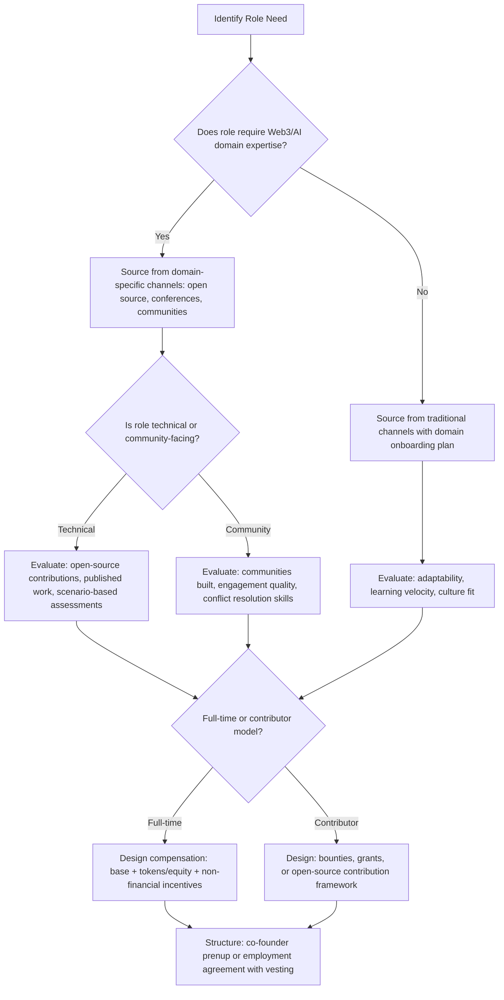

# Chapter 21: Hiring and Team Building in Web3 and AI

> *Last Updated: March 2026*

> **Skim This Chapter**
> - In Web3 and AI, the team is the product; building one requires navigating extreme talent scarcity through creative sourcing, contributor models, token-native compensation, and culture designed for global distribution rather than co-location.
> - Output: a team-building framework covering the Competency Triangle for hiring, co-founder structuring agreements, token compensation design, distributed culture rituals, and retention systems beyond salary.

## 1. Introduction: The Team Is the Product

In Web3 and AI ventures, the team is not merely an asset that builds the product -- the team *is* the product, at least in the early stages. Investors, partners, and early adopters consistently point to team composition as the single strongest predictor of startup success. Yet assembling and retaining the right people in these domains presents challenges unlike anything in traditional technology entrepreneurship.

The talent landscape is defined by scarcity, velocity, and novelty. Machine learning engineers, Solidity developers, protocol architects, tokenomics designers, and AI safety researchers represent roles that barely existed a decade ago. The supply of experienced practitioners lags far behind demand. Compensation expectations have been distorted by token-based windfalls and Big Tech salaries. And the very nature of employment is being redefined by contributor models, decentralized autonomous organizations, and globally distributed teams that operate across every time zone.

For founders navigating this landscape, traditional hiring playbooks offer limited guidance. The Silicon Valley formula of recruiting from elite universities, offering competitive equity packages, and building culture through co-located offices still has relevance -- but it describes only a narrow slice of the available strategies. Web3 and AI ventures that thrive tend to develop hiring and team-building approaches as innovative as the technologies they create.

> **The team compound effect:** Every strong hire attracts other strong hires. Every well-designed team structure accelerates execution. In a landscape where technology is open-source and ideas travel freely, the team you build becomes the most durable competitive moat available.

The founders who master these challenges create a compounding advantage. Every strong hire attracts other strong hires. Every well-designed team structure accelerates execution. Every retained key contributor preserves institutional knowledge that cannot be replaced. In a landscape where technology is often open-source and ideas travel freely, the team you build becomes the most durable competitive moat available.

## In This Chapter, You Will

- Map the Web3/AI talent landscape and identify sourcing strategies for scarce roles
- Design compensation structures that combine tokens, equity, and non-financial incentives
- Evaluate and structure technical co-founder relationships for long-term alignment
- Build culture and cohesion in globally distributed and decentralized teams
- Implement contributor models that extend your team beyond traditional employment
- Develop retention strategies for a market where top talent is always in demand

## Founder's Checklist

- What are the three most critical roles I need to fill in the next six months, and where does the talent for those roles actually live?
- How will I structure compensation to be competitive without overexposing the venture to token-price volatility?
- What is my explicit agreement with my co-founder on equity, roles, decision rights, and exit scenarios?
- What cultural rituals and practices will hold my team together when we cannot share a physical space?

## Exercises

- Map your current team's skills against the Technical-Domain-Community competency triangle and identify gaps
- Draft a contributor onboarding guide that enables someone to make a meaningful contribution within one week
- Write your co-founder prenup: a document outlining decision authority, equity vesting, and conflict resolution procedures
- Conduct a retention risk audit of your top five contributors, identifying their motivations and flight risks

## 2. The Web3/AI Talent Landscape: Scarcity as a Defining Constraint

The most fundamental challenge in building Web3 and AI teams is that the talent pool is dramatically undersized relative to demand. Understanding the specific contours of this scarcity is the first step toward developing effective responses.

### The Supply-Demand Imbalance

The numbers tell a stark story. Estimates from industry analyses in the mid-2020s suggest that global demand for machine learning engineers exceeds supply by a factor of roughly ten to one. For specialized roles such as large language model fine-tuning specialists, reinforcement learning from human feedback (RLHF) researchers, and zero-knowledge proof engineers, the imbalance is even more severe. The total global population of developers with production-level Solidity experience remains in the low tens of thousands, while thousands of projects compete for their attention.

This scarcity manifests differently across sub-domains:

**AI and Machine Learning**: The competition is primarily against well-funded incumbents. Companies like Google DeepMind, OpenAI, Anthropic, and Meta AI Research offer compensation packages that most startups cannot match in pure financial terms. The typical senior ML engineer at a major AI lab commands total compensation exceeding $500,000 annually, creating a floor that venture-backed startups struggle to meet.

**Web3 Protocol Development**: The challenge here is less about competing with incumbents and more about finding people who have the specific combination of cryptography knowledge, distributed systems experience, and blockchain-native thinking. Many of the best protocol engineers are self-taught, having entered the space through open-source contributions rather than traditional career paths.

**Tokenomics and Mechanism Design**: This role requires a rare blend of game theory, economics, behavioral psychology, and technical implementation ability. There is no established educational pipeline -- most practitioners have assembled their expertise through cross-disciplinary self-study and practical experimentation.

**AI Safety and Alignment**: As regulatory pressure increases and the consequences of deployed AI systems become more visible, demand for safety-oriented researchers and engineers has surged. This talent pool is genuinely tiny -- perhaps a few thousand people globally with deep expertise -- and heavily concentrated in a small number of academic institutions and corporate labs.

### The Competency Triangle

Effective hiring in Web3 and AI requires evaluating candidates along three dimensions that rarely appear together:

**Technical Depth**: Can the candidate write production code, design systems, and solve novel technical problems? This dimension is necessary but insufficient on its own.

**Domain Fluency**: Does the candidate understand the specific context of Web3 or AI? A brilliant software engineer who does not grasp consensus mechanisms or the nuances of transformer architectures will need substantial ramp-up time. Domain fluency includes understanding the ecosystem, the competitive landscape, and the user mental models unique to these fields.

**Community Integration**: Particularly in Web3, much of the most important work happens in public -- through governance proposals, open-source contributions, forum discussions, and social media engagement. A candidate's reputation and relationships within the community can be as valuable as their technical skills.

The strongest hires score highly on at least two of these three dimensions. The rarest and most valuable score highly on all three.

### Where the Talent Lives

Web3 and AI talent is geographically distributed in patterns that differ significantly from traditional tech:

**AI Research and Engineering**: Concentrated in the San Francisco Bay Area, London, Beijing, Toronto, and Tel Aviv, with emerging clusters in Singapore, Bangalore, and Seoul. University affiliations still matter significantly, with graduates of Stanford, MIT, Tsinghua, University of Toronto, and a handful of other programs commanding outsized demand.

**Web3 Development**: Far more geographically distributed than AI, with significant concentrations in Lisbon, Berlin, Singapore, Buenos Aires, Lagos, and Bangalore in addition to the traditional US tech hubs. The remote-first culture of crypto has enabled talent clusters to emerge in locations with favorable regulatory environments, lower cost of living, or strong developer communities.

**Cross-Disciplinary Roles**: Tokenomics designers, AI product managers, and protocol economists tend to cluster around conferences, online communities, and accelerator programs rather than specific geographies.

Understanding these distribution patterns informs sourcing strategy. A founder who looks only in San Francisco will miss most of the available Web3 talent. A founder who recruits only from traditional channels will miss most AI safety researchers.

### Web3/AI Role Sourcing and Evaluation Quick Reference

| Role | Where to Find | Key Evaluation Signal | Assessment Method |
|------|--------------|----------------------|-------------------|
| Protocol Engineer | Open-source repos (Ethereum, Cosmos, Solana); hackathons | Contribution history to security-critical codebases | Adversarial design challenges; security-focused code review |
| Tokenomics Designer | Quant finance, economics/math PhDs with crypto exposure | Published token model analysis or design work | Present a broken token model; evaluate failure mode identification |
| Community Manager | Active participants in high-quality Discord/Telegram communities | Community they have already built (quality over size) | Community strategy design exercise; conflict resolution scenarios |
| ML Engineer | Kaggle, arXiv, conference proceedings (NeurIPS, ICML) | Published research; open-source model contributions | Model design challenge with real-world constraints; system design interview |
| AI Safety Researcher | Alignment Forum, MIRI, academic labs | Published alignment research; red-teaming experience | Scenario-based reasoning about failure modes; value alignment discussion |
| Smart Contract Auditor | Bug bounty platforms (Immunefi); prior audit firm experience | Discovered vulnerabilities; audit reports | Live code review of contract with planted vulnerabilities |

**Figure 43.1: Web3/AI Hiring Decision Flow** — A systematic process from role identification through sourcing channel selection, evaluation method, and compensation structure design.

## 3. Hiring for Web3-Native Roles

Web3 has created an entirely new category of roles that have no direct precedent in traditional technology companies. Hiring for these roles requires both understanding what the role demands and recognizing that candidates' credentials may look nothing like what a conventional recruiter expects.

### Protocol Engineers

Protocol engineers design and implement the core logic of blockchain networks and decentralized applications. This is the most technically demanding role in Web3 and among the scarcest.

**What to evaluate**: Deep understanding of consensus mechanisms, cryptographic primitives, and distributed systems. The ability to reason about adversarial environments where any deployed code will be attacked by economically motivated actors. Familiarity with formal verification methods is increasingly important as the value secured by protocols grows.

**Where to find them**: Open-source contribution history is the single best signal. Active contributors to projects like Ethereum, Cosmos, Solana, or Polkadot have demonstrated both technical ability and community engagement. Hackathon participation, published research, and security audit experience also serve as strong indicators.

**How to assess**: Traditional coding interviews are insufficient. Protocol engineering assessments should include scenario-based design challenges (for example, designing a mechanism that remains secure under specific adversarial conditions), code review exercises focused on security-critical implementations, and deep technical discussions about trade-offs in existing protocols.

### Tokenomics Designers

Tokenomics designers create the economic systems that govern token-based protocols and applications. They define supply schedules, incentive structures, governance mechanisms, and value capture models.

**What to evaluate**: Quantitative modeling ability, understanding of game theory and mechanism design, familiarity with historical token models and their outcomes, and the ability to communicate complex economic concepts to non-technical stakeholders.

**Where to find them**: Academic backgrounds in economics, mathematics, or physics combined with crypto-native experience. Some of the strongest tokenomics designers come from quantitative finance or actuarial science backgrounds and transitioned into Web3.

**How to assess**: Present candidates with a broken token model and ask them to identify the failure modes. Have them design an incentive structure for a specific use case and stress-test it through discussion. Evaluate their ability to explain trade-offs clearly.

### Community Managers and Developer Relations

In Web3, community is not merely a marketing function -- it is core infrastructure. Community managers and developer relations professionals build and nurture the ecosystems on which protocols depend.

**What to evaluate**: Authentic engagement with the community (candidates who have been active members, not just observers), strong written communication, ability to manage conflict and ambiguity, cultural sensitivity for global communities, and genuine enthusiasm for the project's mission.

**Where to find them**: Discord and Telegram communities, Twitter/X, governance forums, and community-run events. The best community managers are often already active community members somewhere.

**How to assess**: Review their history of community interactions. Have them draft responses to realistic community scenarios (a contentious governance proposal, a security incident requiring transparent communication, onboarding a confused new user). Evaluate their judgment and tone under pressure.

### Case Study: Uniswap Labs' Lean Team Philosophy

Uniswap, the decentralized exchange protocol that has facilitated hundreds of billions of dollars in trading volume, built its success with a remarkably small core team. Under the leadership of founder Hayden Adams, Uniswap Labs operated with fewer than fifty employees for years while becoming one of the most significant protocols in all of decentralized finance.

This lean approach was not a limitation but a deliberate strategy rooted in the nature of decentralized protocols. Uniswap's core insight was that a protocol, once deployed, operates autonomously through smart contracts. The role of the team is not to run the protocol but to improve it, develop new interfaces, and coordinate with the broader ecosystem. This understanding shaped every hiring decision.

Uniswap Labs hired almost exclusively for depth over breadth. Each team member was expected to be among the best in the world at their specific function -- whether that was smart contract development, front-end engineering, or legal strategy. The hiring bar was extraordinarily high, with the team reportedly rejecting the vast majority of applicants even during periods when the protocol was growing rapidly and the pressure to expand headcount was intense.

The compensation model reflected this philosophy. Rather than distributing modest token allocations across a large team, Uniswap concentrated significant token grants among a small number of contributors, aligning incentives and creating genuine ownership. Early team members who helped build the protocol through its critical growth phases received allocations that made them deeply committed to the project's long-term success.

The lesson for founders is counterintuitive: in Web3, a smaller team of exceptional contributors often outperforms a larger team of competent ones. Protocols benefit from coherence, speed, and alignment in ways that make headcount expansion a cost rather than a benefit beyond a certain threshold. Founders should resist the temptation to hire aggressively simply because funding is available, and instead focus on identifying the minimum team capable of executing the next critical phase of development.

## 4. Remote-First and Globally Distributed Teams

Web3 was born remote. Bitcoin was created by a pseudonymous individual (or group). Ethereum was developed by contributors scattered across multiple continents. The cultural DNA of the crypto ecosystem assumes geographic distribution as the default rather than the exception. AI startups, while historically more concentrated in specific hubs, have increasingly adopted similar models.

### The Case for Global Distribution

Building a globally distributed team is not merely a concession to talent scarcity -- it offers genuine structural advantages:

**Access to global talent pools**: When you remove geographic constraints, you can hire the best person for each role rather than the best person within commuting distance of your office.

**Cost structure diversity**: A senior protocol engineer in Lisbon or Buenos Aires may accept compensation that is highly competitive in their local market but significantly lower than Bay Area rates. This is not about exploitation -- it is about accessing markets where the cost of living enables different economic calculations.

**Around-the-clock development**: A team distributed across time zones can maintain continuous development momentum, with handoffs between regional clusters enabling progress that never stops.

**Regulatory diversification**: In Web3, where regulatory environments vary dramatically across jurisdictions, having team members in multiple regulatory contexts provides both practical knowledge and strategic flexibility.

**Resilience**: A geographically concentrated team faces correlated risks -- natural disasters, political instability, or regulatory changes that affect an entire region. Distribution provides natural resilience.

### The Challenges of Distributed Teams

Distribution also creates challenges that must be actively managed:

**Communication overhead**: Every additional time zone gap and language difference increases the friction of coordination. What would be a five-minute hallway conversation in a co-located team becomes a scheduled call, an asynchronous message thread, or a misunderstanding that festers for days.

**Cultural fragmentation**: Without shared physical space, teams can fracture along geographic or cultural lines, with sub-teams forming that communicate primarily among themselves.

**Onboarding difficulty**: New team members in distributed environments miss the ambient learning that happens naturally in physical offices -- overhearing conversations, observing how senior people make decisions, absorbing cultural norms through proximity.

**Legal and compliance complexity**: Employing or contracting with people across multiple jurisdictions creates a tangle of tax obligations, labor law requirements, and regulatory compliance challenges.

### Building Distributed Team Infrastructure

Successful distributed Web3 and AI teams invest heavily in infrastructure that compensates for the absence of physical co-location:

**Documentation as culture**: The most effective distributed teams write everything down. Decisions, rationale, technical specifications, meeting notes, and cultural values are documented obsessively. This documentation serves as the shared context that physical proximity provides naturally.

**Asynchronous-first communication**: Rather than defaulting to synchronous meetings, distributed teams develop the discipline of asynchronous communication -- detailed written updates, recorded video explanations, and well-structured discussion threads that allow participation across time zones.

**Structured synchronous touchpoints**: While asynchronous communication is the default, regular synchronous interactions remain essential for relationship building, complex problem-solving, and cultural cohesion. The most effective distributed teams are deliberate about when and how they use synchronous time.

**In-person retreats**: Periodic gatherings -- typically quarterly or semi-annually -- where the entire team comes together for several days of intensive collaboration, strategic planning, and social bonding. These retreats generate social capital that sustains the team through months of remote work.

### Case Study: Polygon's Global Team Building

Polygon, the Ethereum scaling solution founded by Jaynti Kanani, Sandeep Nailwal, and Anurag Arjun in India, provides a compelling example of building a globally distributed team from a non-traditional tech hub. From its origins as Matic Network in Mumbai, Polygon grew into a team spanning India, Europe, the United States, and Southeast Asia.

Polygon's approach to global team building was shaped by several distinctive factors. The founders' Indian base placed them outside the traditional Silicon Valley ecosystem, which paradoxically became an advantage. Rather than trying to replicate a Bay Area-style culture, they built from the outset around the assumption that the best talent could be anywhere in the world and that the team's structure should reflect this reality.

The hiring strategy combined aggressive open-source community engagement with targeted recruitment of established engineers. Polygon's core protocol team included contributors from India, Serbia, the Netherlands, and several other countries, assembled primarily through open-source collaboration and community reputation rather than traditional recruiting channels. Many of the most important early contributors were identified through their work on Ethereum-related projects, where their code and community participation served as a richer signal of capability than any resume could provide.

Polygon also made strategic acquisitions -- including the Hermez and Mir teams -- to bring in specialized zero-knowledge proof expertise that would have been nearly impossible to recruit individually. These acquisitions were as much talent strategies as technology strategies, bringing not just codebases but entire research teams with deep domain expertise into the Polygon ecosystem.

The cultural challenge of integrating contributors from across such different backgrounds was addressed through a combination of shared mission focus (scaling Ethereum), transparent governance processes, and regular in-person gatherings at conferences and team retreats. The founding team's willingness to operate publicly -- engaging with the community through social media, governance forums, and conference appearances -- established a culture of openness that extended to how the distributed team communicated internally.

For founders building from outside traditional tech hubs, Polygon's trajectory demonstrates that geographic origin need not limit ambition. The key is building systems and culture that make global distribution a strength rather than a constraint.

## 5. Contributor Models vs. Traditional Employment

One of the most significant innovations in Web3 team building is the emergence of contributor models that exist outside traditional employment relationships. DAOs (Decentralized Autonomous Organizations), bounty systems, grants programs, and permissionless contribution frameworks offer alternatives to the conventional employer-employee relationship.

### The Contributor Spectrum

Contributor engagement exists along a spectrum from fully employed to fully independent:

**Core Team (Employed)**: Full-time employees or equivalent contractors with dedicated roles, regular compensation, and deep integration into the organization. This remains essential for roles requiring continuity, trust, and strategic context.

**Retained Contributors**: Individuals engaged on an ongoing but part-time basis, often working on specific workstreams or projects. They may contribute to multiple protocols simultaneously.

**Bounty Contributors**: People who complete specific, well-defined tasks in exchange for predetermined compensation. Bounty systems allow projects to access a wide range of skills without ongoing commitments.

**Grant Recipients**: Individuals or teams who receive funding to build specific tools, conduct research, or develop features that benefit the protocol. Grant programs are common in major Web3 ecosystems and function as a form of decentralized R&D.

**Permissionless Contributors**: People who contribute to open-source codebases, governance discussions, or community activities without any formal relationship or compensation expectation. Their motivations range from learning to reputation building to ideological commitment.

### Designing Effective Contributor Programs

Effective contributor programs share several characteristics:

**Clear scope and expectations**: Each contribution opportunity should have well-defined deliverables, timelines, and quality standards. Ambiguity is the enemy of contributor engagement.

**Fast feedback loops**: Contributors who submit work and wait weeks for review will disengage. Successful programs provide rapid feedback on submissions, enabling an iterative cycle that keeps contributors motivated.

**Transparent compensation**: Whether through bounties, grants, or token allocations, compensation should be clearly stated and reliably delivered. Trust in payment is foundational to contributor engagement.

**Reputation systems**: Mechanisms that allow contributors to build portable reputations based on their track record. This creates incentives for quality and continuity even in the absence of formal employment.

**Pathways to deeper engagement**: The most effective contributor programs function as talent pipelines, enabling exceptional contributors to transition to retained or core team roles if they choose.

### Case Study: Protocol Labs' Contributor Ecosystem

Protocol Labs, the organization behind IPFS (InterPlanetary File System) and Filecoin, developed one of the most sophisticated contributor ecosystems in Web3. Rather than concentrating all development within a single company, Protocol Labs created a network of independent teams, funded researchers, and open-source contributors working on complementary pieces of a broader technology stack.

The model was built on a fundamental insight: decentralized technology should be built by decentralized teams. Protocol Labs established multiple mechanisms for enabling and funding external contributions. The Filecoin Foundation provided grants to independent teams building tools and applications for the Filecoin network. Research grants supported academic work on distributed systems, cryptography, and related disciplines. Development bounties enabled anyone with relevant skills to contribute to specific technical challenges.

What distinguished Protocol Labs' approach was its investment in coordination infrastructure. The organization developed detailed specifications, comprehensive documentation, and structured communication channels that enabled contributors who had never met in person to collaborate effectively on complex technical projects. This coordination layer was as important as the code itself -- without it, distributed contributions would have remained fragmented and incoherent.

The economic model was also carefully designed. Rather than attempting to capture all value within a single corporate entity, Protocol Labs structured its ecosystem so that value flowed to contributors in proportion to their impact. Token allocations, grants, and bounty payments created a distribution of economic benefit that incentivized a broad base of participation. This approach traded some organizational control for a dramatically larger effective workforce and a more resilient development ecosystem.

The challenges were also real. Coordinating independent contributors required significant management overhead. Quality varied across contributions, necessitating robust review processes. Strategic alignment was harder to maintain when contributors had diverse motivations and loyalties. And some critical tasks -- particularly those requiring sustained focus over months or years -- were difficult to accomplish through bounty-style engagement.

For founders considering contributor models, Protocol Labs offers both inspiration and caution. The model can dramatically extend a project's effective reach, but it requires substantial investment in documentation, coordination, and quality assurance infrastructure. It works best as a complement to a strong core team rather than a replacement for one.

## 6. Technical Co-Founder Dynamics

The relationship between co-founders -- particularly the dynamics between technical and non-technical co-founders -- is among the most consequential and least discussed aspects of startup building. In Web3 and AI, where the technology is complex and rapidly evolving, these dynamics carry additional weight.

### Evaluating a Technical Co-Founder

Finding the right technical co-founder is not simply about finding the strongest engineer available. The evaluation should address multiple dimensions:

**Technical capability relative to the venture's needs**: Does the co-founder's technical strength align with the specific challenges your venture faces? A brilliant machine learning researcher may be the wrong technical co-founder for a project that primarily requires smart contract development, and vice versa.

**Building orientation**: Some strong technologists are researchers who want to explore possibilities. Others are builders who want to ship products. Startups need builders -- people who derive satisfaction from creating functional systems under constraints, not just elegant theoretical solutions.

**Communication ability**: The technical co-founder will need to explain complex systems to investors, customers, and non-technical team members. Technical brilliance that cannot be communicated is dramatically less valuable in a startup context.

**Risk tolerance and commitment level**: Building a startup requires accepting uncertainty and sustained intensity. A technical co-founder who is hedging their commitment -- maintaining a day job, exploring other opportunities, or requiring certainty before engaging fully -- will create problems as the venture demands increasing dedication.

**Complementarity with other founders**: The strongest founding teams combine different strengths rather than duplicating them. If you are strong in business development and fundraising, your technical co-founder should bring capabilities you lack, not mirror your own.

### Structuring the Co-Founder Relationship

The co-founder relationship should be explicitly structured from the beginning, before enthusiasm obscures the need for difficult conversations:

**Equity splits**: The default equal split (50/50 for two co-founders) is simple but often inappropriate. Equity should reflect relative contribution, commitment level, and opportunity cost. More importantly, equity should vest over time (typically four years with a one-year cliff) so that a co-founder who departs early does not retain a disproportionate share.

**Decision authority**: Clearly define which decisions each co-founder can make independently and which require consensus. In practice, this often means delineating domains -- the technical co-founder has authority over architecture and engineering decisions, while the business co-founder has authority over commercial and fundraising decisions, with strategic decisions requiring alignment.

**Conflict resolution**: Establish in advance how disagreements will be resolved. Options include designated tie-breaking authority on specific topics, advisory board consultation for major disputes, and explicit escalation procedures. The worst time to design a conflict resolution process is during a conflict.

**Exit scenarios**: The co-founder prenup should address what happens if one co-founder wants to leave, if the co-founders have irreconcilable strategic disagreements, or if one co-founder is not performing. These conversations are uncomfortable but far less painful than the alternative of navigating these situations without prior agreement.

### Managing Divergent Visions

In Web3 and AI ventures, technical and business co-founders frequently develop divergent visions as the venture evolves. The technical co-founder may want to pursue cutting-edge research while the business co-founder pushes for pragmatic product development. The technical co-founder may prioritize decentralization principles while the business co-founder sees centralized efficiency as necessary for growth. The technical co-founder may want to open-source everything while the business co-founder wants to protect proprietary advantages.

These tensions are not failures -- they are inherent in the structure of complementary founding teams. The key is managing them productively:

**Regular alignment sessions**: Schedule dedicated time (monthly or quarterly) to explicitly discuss long-term vision, strategy, and any emerging divergences. Do not wait for disagreements to become crises.

**Written strategy documents**: Maintain a shared document articulating the venture's strategic direction, updated regularly through collaborative discussion. This creates an external reference point that can anchor conversations when perspectives diverge.

**Customer and data arbitration**: When co-founders disagree about direction, the most productive resolution often comes from external data -- customer feedback, market analysis, or technical benchmarks -- rather than from the force of either person's conviction.

**Role evolution acknowledgment**: Accept that founders' roles will evolve as the venture grows. The technical co-founder who wrote the initial prototype may need to become a CTO managing a team, or may be better suited to a chief scientist role. The business co-founder who closed the first deals may need to become a CEO managing an organization. Honest conversation about these transitions prevents resentment.

## 7. Retaining Talent in a Hot Market

Hiring exceptional people is only half the challenge. In Web3 and AI, where top talent receives constant recruitment pressure, retention requires deliberate strategy and ongoing investment.

### Token Compensation and Vesting

Token-based compensation is one of the most powerful tools available to Web3 ventures, but it must be structured thoughtfully:

**Token grant design**: Grants should be sized to create meaningful ownership stakes for key contributors. The specific amount depends on the role's seniority, the stage of the venture, and the total token supply. As a rough benchmark, early core team members at a pre-launch protocol might receive allocations in the range of 0.5% to 2% of total token supply, with later hires receiving progressively smaller allocations.

**Vesting schedules**: Standard vesting in Web3 typically involves a four-year schedule with a one-year cliff, mirroring traditional equity vesting. Some protocols use more complex structures, including back-loaded vesting (larger allocations in later years to incentivize longevity) or milestone-based vesting (tied to specific deliverables rather than time).

**Lockup periods**: Token grants often include lockup periods during which tokens cannot be sold, even if they have vested. These lockups align contributor incentives with the protocol's long-term health but can create frustration if the lockup period is excessively long or if contributors face personal financial needs.

**Price volatility management**: Token prices are volatile, which means the real value of token compensation can fluctuate dramatically. Some ventures address this by offering a base salary in stablecoins or fiat currency with token grants as an additional incentive, ensuring that contributors' basic financial needs are met regardless of market conditions.

### Beyond Compensation: Non-Financial Retention

The most effective retention strategies extend well beyond compensation:

**Mission alignment**: People who believe in what they are building tolerate challenges that would drive mercenary hires to leave. Maintaining and communicating a compelling mission is a retention strategy in itself.

**Learning and growth**: Top talent in Web3 and AI is intensely motivated by the opportunity to learn. Ventures that provide exposure to cutting-edge problems, encourage conference attendance and open-source contribution, and support skill development retain people who would leave a higher-paying but less stimulating environment.

**Autonomy and ownership**: High-caliber contributors want to own outcomes, not just execute tasks. Giving team members genuine authority over their domains -- including the freedom to make mistakes -- creates the sense of ownership that builds commitment.

**Recognition and visibility**: In Web3 especially, contributors value public recognition. Attributing contributions in release notes, supporting team members' conference presentations, and encouraging individual brand building within the context of the project all reinforce retention.

**Team quality**: The single most effective retention tool is surrounding people with other exceptional people. Strong contributors want to work with peers who challenge and inspire them. Every mediocre hire makes the next exceptional hire harder to retain.

### Case Study: Stability AI's Global Talent Assembly

Stability AI, the company behind the open-source image generation model Stable Diffusion, offers a study in both the possibilities and risks of rapid global talent assembly. Under founder Emad Mostaque, Stability AI grew from a small team to over 150 employees spanning more than twenty countries in a remarkably compressed timeframe, competing directly with far better-resourced incumbents for AI research talent.

Stability AI's recruitment strategy leveraged several distinctive elements. The company's commitment to open-source AI research served as a powerful talent magnet, attracting researchers and engineers who were philosophically aligned with the mission of making AI capabilities broadly accessible rather than concentrated in a few corporate labs. This mission-driven positioning allowed Stability AI to recruit people who might have commanded higher compensation elsewhere but chose to join based on values alignment.

The compensation structure combined competitive base salaries with equity participation, but the primary draw was the opportunity to work at the frontier of generative AI research with the freedom to publish and share results openly. For researchers accustomed to the publication restrictions common at large tech companies, this openness was a significant attraction.

Geographic distribution was treated as a feature rather than a constraint. Stability AI recruited heavily from academic institutions and research labs worldwide, assembling teams in the United Kingdom, the United States, Germany, Canada, and several other countries. This distribution enabled access to talent pools that would have been inaccessible to a company insisting on a single headquarters.

However, the rapid growth also revealed the challenges of scaling a distributed team quickly. Coordination across time zones and cultures proved more difficult than anticipated. The integration of researchers with different working styles and expectations created friction. And the company's financial trajectory generated periods of uncertainty that tested the retention of team members who had joined based on mission and growth potential.

For founders, Stability AI's experience reinforces a critical lesson: mission-driven hiring can attract extraordinary talent, but mission alone does not substitute for sound organizational structure, clear communication, and financial sustainability. The most effective teams combine passionate alignment with professional infrastructure.

## 8. Building Culture in Decentralized Teams

Culture in a distributed Web3 or AI team cannot be left to emerge organically. Without the natural culture-forming mechanisms of shared physical space, founders must deliberately design and maintain the cultural practices that bind their teams together.

### Defining Culture Explicitly

In co-located companies, culture is often transmitted implicitly -- through observed behaviors, overheard conversations, and the ambient norms of a shared environment. Distributed teams lack this transmission mechanism, which means culture must be made explicit:

**Written values with behavioral anchors**: Abstract values like "transparency" or "excellence" are meaningless without concrete behavioral definitions. What does transparency look like in practice? It means posting decision rationale in public channels, sharing financial information with the full team, and admitting mistakes openly. Defining these behaviors makes values actionable.

**Decision-making frameworks**: How decisions are made is a core expression of culture. Some teams operate through rough consensus, others through designated decision-makers with input processes, and still others through formal governance proposals. Making the decision-making process explicit prevents confusion and resentment.

**Communication norms**: Establish clear expectations about response times, communication channels (what goes in Slack versus email versus forum posts), meeting cadence, and documentation practices. These norms reduce the friction that erodes culture in distributed settings.

### Cultural Rituals for Distributed Teams

Rituals create shared experiences that build connection across distance:

**Weekly all-hands**: A regular synchronous gathering where the entire team hears updates, celebrates achievements, and discusses challenges. These should be recorded for team members who cannot attend due to time zone constraints.

**Show and tell sessions**: Regular demonstrations of work in progress, where team members present what they have been building. These create visibility across functions and foster mutual respect.

**Virtual social spaces**: Dedicated channels or scheduled time for non-work interaction. Some distributed teams maintain a persistent voice channel that simulates the ambient social interaction of a physical office. Others schedule virtual coffee chats that randomly pair team members.

**Onboarding buddies**: Pairing new team members with experienced colleagues who provide guidance, context, and social connection during the critical first weeks.

**Retrospectives**: Regular reflection on what is working and what is not, creating a culture of continuous improvement and psychological safety.

### Case Study: dYdX's Culture Across Borders

dYdX, the decentralized derivatives exchange founded by Antonio Juliano in the United States, built a distinctive team culture that spanned multiple countries while maintaining coherence and high performance. As the protocol grew to become one of the leading decentralized exchanges for perpetual futures trading, the team expanded to include contributors across North America, Europe, and Asia.

What distinguished dYdX's approach was its investment in written culture. The team maintained extensive internal documentation that went beyond technical specifications to include decision logs, strategic rationale, and cultural principles. New team members could read through this documentation to understand not just what the team was building but why specific choices had been made and how the team operated.

dYdX also practiced radical transparency about its roadmap and strategy, both internally and with its broader community. This transparency served a dual purpose: it aligned the distributed team around shared objectives and gave the community context for the project's direction. When the team made the consequential decision to migrate from Ethereum to a custom Cosmos-based blockchain, the transparent communication of the rationale -- even though the decision was controversial -- demonstrated how cultural principles operated in practice.

The team's approach to in-person gatherings was also deliberate. Rather than treating offsites as purely social events, dYdX used them as intensive working sessions where the most complex and cross-functional challenges were addressed. This made the gatherings feel essential rather than optional, increasing attendance and engagement.

For founders building distributed teams, dYdX's experience highlights the importance of documentation as cultural infrastructure. In the absence of shared physical space, the written record becomes the primary medium through which culture is transmitted, maintained, and evolved.

## 9. AI-Augmented Hiring and Evolving Skill Requirements

Artificial intelligence is not only a domain in which startups hire -- it is increasingly transforming the hiring process itself and reshaping the skills that teams need.

### AI in the Hiring Pipeline

AI tools are being applied across the hiring process, creating both opportunities and risks:

**Sourcing and matching**: AI-powered platforms can scan open-source contributions, academic publications, and professional profiles to identify candidates whose demonstrated capabilities match specific role requirements. This is particularly valuable in Web3 and AI, where traditional resumes are poor predictors of relevant ability.

**Technical assessment**: Automated code review and technical assessment tools can provide initial evaluation at scale, enabling smaller teams to process larger candidate pools without proportional increases in interviewer time.

**Bias mitigation**: When thoughtfully implemented, AI hiring tools can reduce some forms of human bias -- for example, by standardizing evaluation criteria and blinding demographic information during initial screening. However, AI systems can also amplify bias if trained on historical data that reflects existing inequities, making careful design and monitoring essential.

**Communication and scheduling**: AI assistants can handle the administrative burden of candidate communication, interview scheduling, and follow-up, freeing human team members to focus on the substantive aspects of evaluation.

### Shifting Skill Requirements

AI is also changing what skills teams need:

**From coding to system design**: As AI code generation tools become more capable, the relative value of raw coding ability decreases while the value of system design, architecture, and judgment increases. Teams need people who can design the right system, not just implement one quickly.

**From individual expertise to orchestration**: The ability to effectively combine AI tools, human expertise, and automated systems becomes more valuable than deep expertise in any single technical domain.

**Prompt engineering and AI collaboration**: The ability to work effectively with AI systems -- formulating problems, evaluating outputs, and iterating on results -- is becoming a baseline skill rather than a specialty.

**Ethical reasoning and safety thinking**: As AI systems become more capable and more widely deployed, the ability to anticipate and mitigate negative consequences becomes a critical team capability rather than a nice-to-have addition.

### Implications for Team Composition

These shifts suggest that Web3 and AI teams of the near future will look different from those of today:

**Smaller core teams with broader capabilities**: AI augmentation enables smaller teams to accomplish what previously required larger headcounts, but each team member needs a broader skill set and stronger judgment.

**Greater emphasis on cross-functional ability**: The boundaries between roles become blurrier as AI tools enable non-specialists to contribute across domains. A product manager who can prototype with AI code generation tools or a community manager who can analyze data with AI assistance becomes more valuable than a narrower specialist.

**Increased importance of human-specific skills**: As AI handles more routine technical tasks, distinctly human capabilities -- creativity, judgment, empathy, ethical reasoning, and the ability to navigate ambiguity -- become the differentiating factors in team performance.

## 10. A Practical Framework for Web3/AI Team Building

Drawing together the themes of this chapter, here is a stage-based framework that founders can apply to their team-building efforts.

### Stage 1: Pre-Seed (1-3 People)

**Priority**: Finding the right co-founder(s) and establishing the foundational team dynamic.

**Actions**:
- Invest significant time in co-founder evaluation using the dimensions outlined in Section 6
- Establish the co-founder prenup: equity, vesting, roles, decision authority, and conflict resolution
- Define the minimum viable team: what roles are absolutely essential to reach the next milestone?
- Begin building community presence to attract future contributors

**Common mistakes**: Rushing to find a co-founder out of anxiety about being a solo founder. Splitting equity equally without honest discussion about relative contribution. Hiring friends for comfort rather than capability.

### Stage 2: Seed (3-10 People)

**Priority**: Building the core team that will execute the initial product vision.

**Actions**:
- Hire for the Competency Triangle: prioritize candidates strong in at least two of technical depth, domain fluency, and community integration
- Establish cultural foundations: written values, communication norms, decision-making frameworks
- Implement structured onboarding that enables productivity within the first two weeks
- Begin designing contributor programs (bounties, grants) to extend the team's reach

**Common mistakes**: Over-hiring in anticipation of future needs. Neglecting culture design because the team is small enough to coordinate informally. Failing to document decisions and rationale.

### Stage 3: Series A (10-30 People)

**Priority**: Scaling the team while preserving culture and quality.

**Actions**:
- Invest in hiring infrastructure: structured interview processes, assessment rubrics, candidate experience
- Formalize token or equity compensation frameworks with clear guidelines for different levels and roles
- Establish retention practices: learning opportunities, recognition systems, career development paths
- Build management capability: the transition from individual contributors to team leaders is one of the hardest in any startup

**Common mistakes**: Lowering the hiring bar to fill roles quickly. Promoting top individual contributors to management without assessing management aptitude. Allowing cultural drift as the team grows beyond the size where everyone knows everyone.

### Stage 4: Growth (30+ People)

**Priority**: Maintaining coherence and velocity as organizational complexity increases.

**Actions**:
- Implement contributor ecosystems (grants, bounties, partnerships) to access capabilities beyond the core team
- Develop leadership bench depth: the founding team cannot manage everything directly at this scale
- Formalize cross-functional processes while preserving the speed and adaptability that defined earlier stages
- Invest in team health: burnout prevention, conflict resolution, and cultural renewal

**Common mistakes**: Bureaucratic accumulation that slows decision-making. Loss of mission clarity as new hires dilute the founding vision. Failure to evolve the founders' own roles as the organization demands different skills at different stages.

## Key Takeaways

**1. The talent market is the primary constraint.** In Web3 and AI, the scarcity of qualified talent shapes every aspect of team building. Founders who develop creative sourcing strategies, look beyond traditional channels, and recruit globally gain a decisive advantage.

**2. Hire for the Competency Triangle.** The most valuable contributors combine technical depth, domain fluency, and community integration. Prioritize candidates who are strong in at least two of these three dimensions.

**3. Web3-native roles require Web3-native evaluation.** Protocol engineers, tokenomics designers, and community managers cannot be assessed through traditional interview processes. Open-source contribution history, community reputation, and scenario-based assessments provide far richer signals.

**4. Remote-first is the default, not the exception.** Global distribution is a strategic advantage when supported by proper infrastructure -- documentation, asynchronous communication practices, and periodic in-person gatherings.

**5. Contributor models extend your team without expanding your payroll.** Bounties, grants, and open-source contribution frameworks enable projects to access a broader talent base, but they require investment in coordination infrastructure to work effectively.

**6. The co-founder relationship must be explicitly structured.** Equity splits, decision authority, conflict resolution, and exit scenarios should be documented before enthusiasm obscures the need for these difficult conversations.

**7. Token compensation is powerful but must be designed carefully.** Combine token grants with stable base compensation, implement thoughtful vesting schedules, and manage expectations around price volatility.

**8. Culture must be designed, not hoped for.** In distributed teams, culture is transmitted through documentation, rituals, and explicit behavioral norms rather than through physical proximity.

**9. Retention is a system, not a salary.** Mission alignment, learning opportunities, autonomy, team quality, and recognition work together to retain talent that compensation alone cannot hold.

**10. AI is changing what teams need.** As AI tools augment individual capabilities, team composition shifts toward fewer people with broader skills, stronger judgment, and greater emphasis on distinctly human capabilities.

## Related Case Studies

For practical examples of the concepts in this chapter, see the [Case Studies Compendium](../case-studies/compendium.md):

- **Andela** — African engineering talent marketplace demonstrating how talent arbitrage combined with quality training builds a sustainable platform for global team building
- **Hugging Face** — Open ecosystem where community-as-platform and developer experience created a talent magnet, showing how contributor models extend teams beyond traditional employment
- **Polygon** — India's breakout Web3 infrastructure illustrating how globally distributed teams build world-class protocol infrastructure from outside traditional tech hubs
- **Canva** — Building a global company from Perth, Australia, demonstrating that world-class teams can be assembled and managed from anywhere with the right culture and processes
- **Ethereum Cross-Stage Journey** — Eight co-founders across three continents coordinating novel infrastructure development, illustrating the dynamics of distributed founding teams in frontier technology

## Further Reading

- **The Alliance: Managing Talent in the Networked Age** by Reid Hoffman, Ben Casnocha, and Chris Yeh — Reframes the employer-employee relationship as a series of mutual investment tours of duty, directly applicable to the fluid talent dynamics in Web3 and AI startups.
- **An Elegant Puzzle: Systems of Engineering Management** by Will Larson — A systems-thinking approach to engineering team building and management that addresses scaling challenges, organizational design, and technical leadership in fast-growing companies.
- **Working in Public: The Making and Maintenance of Open Source Software** by Nadia Eghbal — Essential reading for understanding contributor models, community dynamics, and the economics of open-source participation that define Web3 team structures.
- **Who: The A Method for Hiring** by Geoff Smart and Randy Street — A structured methodology for hiring decisions that reduces mis-hires, adaptable to the unique evaluation challenges of hiring for novel Web3 and AI roles.
- **Team of Teams** by General Stanley McChrystal — Demonstrates how to build adaptive, decentralized team structures that maintain coordination at scale, directly relevant to globally distributed Web3 organizations.

## Sources

1. Hayden Adams, "Uniswap v3 Core," Uniswap Labs Whitepaper, 2021.
2. Sandeep Nailwal, "Building Polygon: From India to Global Infrastructure," Keynote Address, ETHDenver, 2023.
3. Juan Benet, "Filecoin: A Decentralized Storage Network," Protocol Labs Technical Report, 2017.
4. Antonio Juliano, "dYdX: Building Decentralized Derivatives," The Defiant Podcast Interview, 2023.
5. Emad Mostaque, "Open Source AI: Building in Public," Stability AI Blog, 2023.
6. Ravi Mehta, "Hiring in Web3: Lessons from Scaling a Protocol Team," a16z crypto Blog, 2023.
7. Stanford HAI, "AI Index Report 2024: Global AI Talent Landscape," Stanford University.
8. Electric Capital, "Developer Report 2024: Web3 Developer Ecosystem Analysis," Electric Capital.
9. Molly White, "The State of Web3 Employment: Compensation, Culture, and Contributor Models," Citation Needed Blog, 2023.
10. Vitalik Buterin, "Coordination as a Service: Why Decentralized Teams Need Centralized Infrastructure," Vitalik.ca, 2022.
