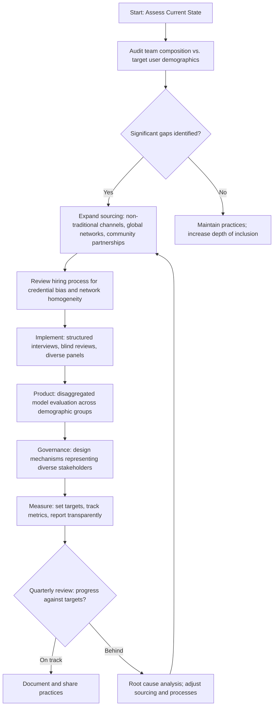

# Chapter 22: Diversity, Inclusion, and Innovation

> *Last Updated: March 2026*

> **Skim This Chapter**
> - Diversity is a competitive advantage, not a concession; diverse teams consistently produce superior innovation outcomes, and the builders of Web3 and AI systems must design for inclusion from the start or encode the biases of homogeneous teams into technologies that will shape society for decades.
> - Output: an implementation guide for inclusive hiring, algorithmic fairness auditing, DAO governance design, and measurable diversity targets with accountability systems.

## 1. Introduction: The Unfinished Revolution

The promise of Web3 and AI is fundamentally egalitarian. Decentralized networks claim to remove gatekeepers. Open-source AI promises to democratize intelligence. Tokenized governance proposes to distribute power. Yet the communities building these technologies remain strikingly homogeneous, reflecting and often amplifying the same exclusionary patterns they claim to disrupt.

This contradiction is not merely a matter of fairness or optics. It represents a structural weakness in the innovation ecosystem itself. When the builders of world-shaping technology share narrow demographic backgrounds, geographic perspectives, and life experiences, the resulting systems inherit blind spots that no amount of technical sophistication can compensate for. Algorithmic bias, exclusionary product design, and culturally narrow market assumptions are not bugs introduced by careless engineering. They are the predictable consequences of building in echo chambers.

The data tells a stark story. As of 2024, women represent approximately 13 percent of blockchain developers worldwide and hold fewer than 27 percent of AI and data science roles globally. Venture capital flowing to women-led Web3 startups hovers below 2 percent of total funding. The geographic concentration is equally severe: over 75 percent of AI research publications originate from institutions in the United States, China, and Western Europe, while Africa, Latin America, and Southeast Asia collectively account for a fraction of recognized contributions despite their rapidly growing technical communities and distinct innovation patterns.

Yet this chapter is not primarily a catalog of problems. It is a practical examination of how diverse teams, inclusive design practices, and global perspectives consistently produce superior innovation outcomes, and how founders can build companies that harness this advantage. The entrepreneurs profiled here have not succeeded despite operating outside the mainstream. They have succeeded because their unique vantage points revealed opportunities invisible to conventional founders.

> **The inclusion imperative:** When the builders of world-shaping technology share narrow backgrounds, the resulting systems inherit blind spots that no amount of technical sophistication can fix. Algorithmic bias is not a bug—it is the predictable consequence of building in echo chambers.

The choices made now about who builds, who governs, and who benefits from Web3 and AI will shape these systems for decades. Building inclusively is foundational to building systems that work.

## In This Chapter, You Will

- Understand the quantitative case for diversity as an innovation driver
- Learn from founders who have built successful ventures from underrepresented backgrounds
- Develop frameworks for inclusive product design and algorithmic fairness
- Explore alternative organizational models that broaden participation
- Build practical strategies for creating inclusive companies and teams

## Founder's Checklist

- Have I examined my assumptions about who my users are and what they need?
- Does my team reflect the diversity of the communities I aim to serve?
- What barriers to participation exist in my product, hiring, or governance processes?
- Am I sourcing perspectives from outside my immediate network and geography?

## 2. The Innovation Case for Diversity: Evidence and Mechanisms

The relationship between diversity and innovation performance is among the most thoroughly studied topics in organizational research. While the moral case for inclusion is compelling on its own terms, founders benefit from understanding precisely how diverse teams generate measurably better outcomes, particularly in complex, rapidly evolving domains like Web3 and AI.

### Quantitative Evidence

Multiple large-scale studies have established a robust correlation between team diversity and innovation metrics:

**Cognitive Diversity and Problem-Solving**

Research from organizational behavior and cognitive science demonstrates that groups composed of individuals with varied backgrounds, experiences, and thinking styles consistently outperform homogeneous groups on complex problem-solving tasks. This advantage emerges not from any individual being smarter, but from the collision of different mental models, assumptions, and analytical frameworks.

Diverse teams are more likely to:
- Identify a broader range of potential solutions to novel problems
- Challenge groupthink and premature consensus
- Detect errors and blind spots in reasoning
- Anticipate a wider range of user needs and market conditions

**Financial Performance**

Research from McKinsey, Boston Consulting Group, and academic institutions has repeatedly found that companies with above-average diversity on their leadership teams outperform peers on profitability and value creation metrics. Companies in the top quartile for gender diversity on executive teams were found to be significantly more likely to achieve above-average profitability than companies in the bottom quartile. For ethnic and cultural diversity, the performance differential was even larger.

**Startup-Specific Evidence**

Research focused specifically on startups has found that founding teams with at least one woman co-founder generate higher revenue per dollar invested than all-male founding teams. Mixed-gender teams in technology ventures demonstrate stronger capital efficiency and longer organizational survival rates. These findings hold across sectors and geographies, suggesting that diversity advantages are structural rather than contextual.

### Mechanisms: Why Diversity Drives Better Outcomes

The performance advantages of diverse teams operate through several distinct but reinforcing mechanisms:

**Information Diversity**

Homogeneous teams tend to share overlapping knowledge bases and information networks. Diverse teams access fundamentally different information sources, expanding the total knowledge available for decision-making. A team with members from different geographies, socioeconomic backgrounds, and professional histories simply has more raw material to work with.

**Constructive Conflict**

Research shows that diverse teams experience more productive disagreement during decision processes. While this can create friction, it also prevents the premature consensus and uncritical acceptance of dominant viewpoints that plague homogeneous groups. In Web3 protocol design and AI model development, where assumptions embedded early in the process become extremely difficult to change later, this constructive challenge function is particularly valuable.

**Market Insight**

Teams that reflect the diversity of their target markets possess intuitive understanding of user needs that cannot be replicated through market research alone. A team building financial services for emerging markets benefits enormously from members who have personal experience navigating those financial systems. A team building accessibility tools benefits from members who have lived experience with the barriers they aim to remove.

**Expanded Solution Space**

Perhaps most importantly, diverse teams simply consider a wider range of possible solutions. When team members bring different analogies, different reference experiences, and different assumptions about what is possible, the creative search space expands dramatically. In emerging technology domains where the most valuable innovations often come from unexpected combinations of ideas, this expanded solution space is a decisive competitive advantage.

### The Web3 and AI Context

These general diversity advantages take on particular significance in the Web3 and AI space for several reasons:

**Global Systems Require Global Perspectives.** Blockchain networks and AI systems increasingly operate across borders, cultures, and regulatory environments. Building global systems with local teams produces predictable failures.

**Bias Amplification.** AI systems can encode and amplify biases present in their training data and design processes. Diverse development teams are better positioned to identify and mitigate these biases before they scale.

**Trust Deficit.** Web3 adoption has been hampered by trust deficits among demographics underserved by early projects. Teams that understand these communities build products that address legitimate concerns rather than dismissing them.

**Untapped Markets.** The most significant growth opportunities in Web3 and AI lie in populations currently underserved by technology: the unbanked, populations with limited internet access, non-English speakers, people with disabilities. Reaching these markets requires teams that understand them.

### Diversity Gap by Domain (2024)

| Dimension | Web3 / Blockchain | AI / Machine Learning | Traditional Tech (Comparison) |
|-----------|------------------|-----------------------|-------------------------------|
| Women developers | ~13% | ~27% | ~28% |
| VC funding to women-led startups | <2% | ~5% | ~2.3% (all sectors) |
| Research contributions from Global South | <10% | <15% | ~20% |
| Non-English product interfaces | ~15% of major protocols | ~25% of major AI tools | ~40% of global SaaS |
| Leadership diversity (C-suite) | ~8% women | ~15% women | ~28% women |

**Figure 44.1: Inclusive Company Building Process** — A cyclical framework for assessing, building, and measuring diversity and inclusion across hiring, product design, and governance.

## 3. Women Founders in Web3 and AI: Navigating Barriers, Creating Breakthroughs

Women founders in Web3 and AI operate in environments where they are dramatically underrepresented and frequently face compounding disadvantages in funding, networking, and recognition. Despite these barriers, women have driven some of the most consequential innovations in both fields. Their experiences illuminate both the structural challenges that persist and the strategies that enable breakthrough success.

### The Funding Gap

The venture capital pipeline for women founders remains severely constrained. Women-founded companies receive a small fraction of total venture capital. In crypto and blockchain specifically, this percentage drops further. The pattern is self-reinforcing: with fewer women in venture capital decision-making roles, fewer women-led ventures receive funding, producing fewer successful women founders to serve as role models and investors for the next generation.

This funding gap does not reflect a shortage of qualified women founders or viable women-led ventures. Rather, it reflects pattern-matching biases in investment decision-making, network effects that concentrate capital among demographically similar founders and investors, and evaluation criteria that systematically undervalue the types of ventures women are more likely to build.

### The Recognition Gap

Beyond funding, women founders in Web3 and AI frequently encounter a recognition gap, where their contributions are attributed to male co-founders or team members, their technical expertise is questioned more aggressively, and their leadership is framed in gendered terms that undermine professional authority.

This gap is particularly acute in technical domains where credibility is partially constructed through community reputation. Conference speaking slots, media coverage, open-source contribution attribution, and social media visibility all shape perceived expertise in ways that disadvantage women in predominantly male communities.

### Case Study 1: Aya Miyaguchi and the Ethereum Foundation

Aya Miyaguchi's leadership of the Ethereum Foundation represents one of the most significant and least celebrated examples of organizational stewardship in the blockchain space. When Miyaguchi assumed the role of Executive Director in 2018, the Ethereum Foundation faced a crisis of organizational effectiveness. Despite overseeing one of the most valuable and technically ambitious blockchain ecosystems in existence, the Foundation struggled with coordination challenges, community fragmentation, and questions about its strategic direction during a period when Ethereum's transition to proof-of-stake remained uncertain.

Miyaguchi brought a distinctive leadership approach shaped by her cross-cultural background, having grown up in Japan and built her career across both Japanese and Western technology organizations. Rather than imposing top-down direction on Ethereum's famously decentralized community, she focused on building what she described as an infrastructure for collaboration: funding mechanisms, community coordination processes, and organizational structures that enabled the ecosystem's diverse contributors to work more effectively.

Under her leadership, the Ethereum Foundation restructured its grants program, expanding both the volume and diversity of funded projects. The Foundation's support for Ethereum's developer community broadened geographically, with increased investment in developer education and tooling in Asia, Africa, and Latin America. Miyaguchi championed the Devcon conference's expansion beyond its traditional Western tech hub venues, including hosting Devcon in Bogota, Colombia and Bangkok, Thailand, deliberately bringing the community to regions with growing but underrecognized Ethereum developer populations.

Perhaps most significantly, Miyaguchi's stewardship helped navigate the Ethereum Foundation through the multi-year technical transition known as "The Merge," the shift from proof-of-work to proof-of-stake consensus. This was one of the most complex coordinated upgrades in blockchain history, requiring alignment among thousands of independent developers, node operators, and stakeholders. The Foundation's role required not technical authoritarianism but precisely the kind of facilitative, relationship-centered leadership that Miyaguchi brought.

**Key Lessons from Miyaguchi's Approach:**
- Facilitative leadership can be more effective than directive leadership in decentralized ecosystems
- Cross-cultural experience provides valuable frameworks for coordinating diverse global communities
- Organizational effectiveness in Web3 requires attending to social infrastructure, not just technical infrastructure
- Expanding geographic representation in community events and funding shifts the composition of who builds

### Case Study 2: Elizabeth Stark and Lightning Labs

Elizabeth Stark co-founded Lightning Labs to address one of Bitcoin's most fundamental technical limitations: its inability to process transactions at the speed and volume required for everyday payments. The Lightning Network, which Lightning Labs has been instrumental in developing, operates as a second-layer protocol on top of Bitcoin, enabling near-instant, low-cost transactions while inheriting Bitcoin's security guarantees.

Stark's path to founding Lightning Labs was unconventional. An academic with a background in law and technology policy at Stanford and Yale, she brought a perspective that combined deep technical understanding with sophisticated analysis of how protocols interact with legal frameworks and user behavior. This interdisciplinary orientation proved crucial in designing a protocol that needed to function not just as an engineering artifact but as infrastructure for real economic activity across diverse regulatory environments.

Lightning Labs under Stark's leadership has focused deliberately on use cases in markets where traditional financial infrastructure is most inadequate. The Lightning Network has seen significant adoption in El Salvador following its adoption of Bitcoin as legal tender, in parts of sub-Saharan Africa where mobile money services charge prohibitive fees for small transactions, and among migrant worker communities sending remittances across borders. These adoption patterns reflect design choices that prioritized accessibility and low transaction costs over features primarily valued by wealthy Western users.

Stark has been vocal about the importance of building for underserved populations rather than defaulting to the assumptions of early cryptocurrency adopters. Her leadership demonstrates how a founder's analytical framework, shaped by interdisciplinary training and deliberate attention to diverse user contexts, produces fundamentally different product decisions than a purely technical orientation would generate.

**Key Lessons from Stark's Approach:**
- Interdisciplinary backgrounds (law, policy, technology) produce distinctive technical insights
- Designing for underserved markets requires explicit attention to diverse user contexts
- Protocol-level infrastructure decisions shape who ultimately benefits from technology
- Academic and policy perspectives complement engineering expertise in foundational technology

### Case Study 3: Joy Buolamwini and the Algorithmic Justice League

Joy Buolamwini's founding of the Algorithmic Justice League represents a case where a founder's personal experience with technology's failures became the catalyst for an organization that has reshaped the entire AI industry's approach to bias and fairness.

As a graduate researcher at MIT, Buolamwini discovered that commercial facial recognition systems from major technology companies consistently failed to accurately identify darker-skinned faces, particularly those of women. Her research, published as the Gender Shades study, provided rigorous quantitative evidence of what many people from underrepresented communities had experienced intuitively: AI systems worked well for the demographics they were built by and tested on, and poorly for everyone else.

Rather than treating this as a narrow technical problem to be solved with better training data, Buolamwini recognized it as a systemic issue requiring organizational, policy, and cultural responses alongside technical ones. The Algorithmic Justice League, founded in 2018, operates at the intersection of research, advocacy, art, and policy. It has produced technical audits of commercial AI systems, developed frameworks for algorithmic accountability, created educational materials that make AI bias accessible to non-technical audiences, and advocated for regulatory frameworks governing high-stakes AI applications.

The organization's impact extends far beyond its direct research output. Buolamwini's work catalyzed a broader reckoning within the AI industry about the consequences of building systems without diverse representation in development teams, testing populations, and governance structures. Major technology companies revised their facial recognition offerings, several jurisdictions enacted or considered legislation governing AI bias, and the concept of algorithmic fairness became a standard consideration in AI development processes.

The Algorithmic Justice League also demonstrates an alternative model for technology entrepreneurship. Rather than pursuing venture-backed growth toward an exit, Buolamwini built a mission-driven organization that generates impact through research, education, and policy influence. This model is particularly relevant for founders addressing problems where the primary value created is not easily captured in a revenue stream but is nevertheless enormous in societal significance.

**Key Lessons from Buolamwini's Approach:**
- Personal experience with technology's failures can identify billion-dollar blind spots
- Systemic problems require responses that combine technical, organizational, and policy dimensions
- Mission-driven organizations can reshape entire industries without following the venture-backed growth model
- Making technical issues accessible to non-technical audiences amplifies impact dramatically

## 4. Non-Western Innovation Ecosystems: Leapfrogging and Local Solutions

The dominant narrative of technology innovation positions Silicon Valley, and to a lesser extent a handful of other Western tech hubs, as the primary source of meaningful technological progress. This narrative has always been incomplete, but in the Web3 and AI era it has become actively misleading. Some of the most significant innovations in both fields are emerging from regions that the conventional narrative overlooks entirely.

### Africa: Necessity-Driven Crypto Adoption

Africa's relationship with cryptocurrency represents perhaps the clearest example of how innovation ecosystems outside the Western mainstream produce fundamentally different, and in many cases more practically significant, applications of emerging technology.

Unlike in wealthy Western nations where cryptocurrency adoption has been driven primarily by speculative investment and ideological commitment to decentralization, cryptocurrency adoption across much of Africa has been driven by practical necessity. Populations facing currency instability, limited access to traditional banking services, expensive remittance corridors, and barriers to cross-border commerce have adopted cryptocurrency as functional financial infrastructure rather than speculative asset.

Nigeria consistently ranks among the top countries globally in cryptocurrency adoption relative to population. This adoption is not driven by venture-funded startups marketing to early adopters. It is driven by individual economic actors solving real problems: freelancers receiving international payments without the friction and cost of traditional banking channels, traders conducting cross-border commerce in regions where banking infrastructure is unreliable, and families sending remittances through channels that do not extract significant percentages in fees.

**Case Study 4: Adaverse and Pan-African Web3 Venture Building**

Adaverse, a venture accelerator focused on Web3 projects across Africa, exemplifies how non-Western innovation ecosystems operate with fundamentally different assumptions and priorities than their Silicon Valley counterparts. Operating with a thesis that African markets represent the highest-impact application environment for blockchain technology, Adaverse has invested in and accelerated dozens of projects across the continent.

What distinguishes Adaverse's portfolio is not just geographic focus but problem orientation. Where Western Web3 projects frequently optimize for financialization, decentralization ideology, or speculative value, Adaverse-backed projects tend to address infrastructural gaps: agricultural supply chain transparency, cross-border payment friction, identity verification for populations without government-issued documentation, and financial services for the informally employed.

This problem-driven approach produces ventures that are less likely to appear in Western cryptocurrency media but are more likely to achieve meaningful adoption among users who derive genuine economic benefit from blockchain technology. The accelerator's approach demonstrates that the most impactful applications of emerging technology often emerge not from the most technologically advanced environments but from the environments where the need is most acute and existing alternatives most inadequate.

### India: The AI Talent Powerhouse

India's AI ecosystem illustrates a different dimension of non-Western innovation: the emergence of world-class technical capacity outside traditional centers of AI research, combined with a domestic market whose scale and complexity create unique challenges and opportunities.

India produces more AI and machine learning engineers annually than any country outside the United States and China. Indian institutions are increasingly prominent in AI research publication and citation metrics. Indian AI startups have attracted growing venture investment, particularly in sectors like healthcare, agriculture, and financial services where India's domestic market provides both massive scale and distinctive requirements.

The Indian AI ecosystem's distinctive strength lies in building AI applications for conditions that Western-designed systems handle poorly: multilingual populations speaking hundreds of distinct languages and dialects, diverse literacy levels, varying infrastructure quality, and cultural contexts that shape how people interact with technology in ways that Western-designed interfaces do not accommodate.

Indian AI companies building vernacular language processing, voice-first interfaces for low-literacy users, and AI-assisted agricultural advisory systems are not building simplified versions of Western products. They are solving harder problems, building for more diverse user populations, and developing technical approaches that may ultimately prove more robust and adaptable than systems designed for the relatively homogeneous conditions of wealthy Western markets.

### Latin America: Fintech as Financial Inclusion

Latin America's fintech revolution, driven significantly by Web3 and AI technologies, represents one of the most impactful technology-driven economic transformations of the past decade.

**Case Study 5: Nubank and Financial Inclusion at Scale**

Founded in 2013 by David Velez, a Colombian-born entrepreneur, alongside Brazilian co-founder Cristina Junqueira, Nubank has grown from a startup challenging Brazil's concentrated, fee-heavy banking sector into Latin America's largest digital bank, serving tens of millions of customers across Brazil, Mexico, and Colombia. Junqueira, as co-founder and one of the most prominent women in Latin American technology, has been instrumental in shaping Nubank's product strategy and organizational culture.

Nubank's success is inseparable from the specific conditions of Latin American financial markets. Brazil's banking sector was dominated by a small number of large institutions that charged some of the highest fees and interest rates in the world while providing service quality that left large segments of the population underserved or entirely unbanked. Nubank identified that mobile-first digital banking could serve these populations at dramatically lower cost while providing a superior user experience.

Junqueira's role in building Nubank's product organization reflects the broader theme of this chapter: her experience navigating Brazil's financial system as both a consumer and a financial services professional gave her insight into user needs and pain points that would not have been accessible to a team composed entirely of Silicon Valley transplants building from assumptions derived from the American banking experience.

Nubank's technology stack increasingly incorporates both AI and blockchain elements. Machine learning models drive credit underwriting for populations with limited traditional credit history, enabling the company to extend financial services to customers that conventional credit scoring systems would exclude. The company has explored blockchain-based loyalty programs and digital asset offerings designed specifically for its largely middle-class and lower-income customer base, rather than for the affluent early-adopter demographic that most Western crypto products target.

**Key Lessons from Non-Western Innovation Ecosystems:**
- Necessity drives adoption patterns that speculative interest alone cannot replicate
- Building for underserved markets requires lived experience with the conditions those markets face
- Technical solutions designed for complex, diverse environments often prove more robust than those designed for homogeneous ones
- The most impactful applications of emerging technology frequently emerge outside traditional tech hubs

## 5. Inclusive Product Design and Algorithmic Fairness

Building diverse teams is necessary but not sufficient. The products and systems those teams build must themselves be designed for inclusion. In Web3 and AI, where technical architecture encodes assumptions that become extremely difficult to change once deployed, inclusive design is not a refinement step applied after core engineering. It is a fundamental design requirement that must be present from the earliest stages.

### Algorithmic Fairness: Beyond Good Intentions

AI systems learn from data that reflects historical patterns, including historical patterns of discrimination, exclusion, and inequality. Without deliberate intervention, these systems reproduce and often amplify existing biases.

**Sources of Bias in AI Systems:**

- **Training data bias:** When training datasets overrepresent certain demographics, the resulting models perform better for those demographics and worse for others. Facial recognition trained primarily on lighter-skinned faces fails on darker-skinned faces. Language models trained primarily on English text perform poorly for other languages.
- **Label bias:** When human labelers bring their own biases to the annotation process, those biases become encoded in the training signal. Research has documented systematic differences in how content moderation labels are applied across cultural and linguistic contexts.
- **Deployment context bias:** Even technically fair models can produce biased outcomes when deployed in contexts different from those they were designed for. A hiring model trained on data from one industry may produce discriminatory outcomes when applied to another.
- **Feedback loop bias:** When AI systems influence the data they are subsequently trained on, initial biases compound over time. A predictive policing model that directs more patrols to certain neighborhoods generates more arrests in those neighborhoods, which in turn reinforces the model's predictions.

**Practical Fairness Frameworks:**

Founders building AI systems should implement structured fairness evaluation processes:

1. **Disaggregated evaluation:** Test model performance separately across demographic groups, geographic regions, and use case contexts rather than relying on aggregate accuracy metrics that can mask significant disparities.
2. **Stakeholder review:** Include representatives from affected communities in design review and testing processes, not as a checkbox exercise but as genuine participants with decision-making authority.
3. **Red team exercises:** Deliberately attempt to identify failure modes that disproportionately affect underrepresented groups.
4. **Ongoing monitoring:** Bias can emerge or shift over time as user populations and deployment contexts change. Fairness evaluation must be continuous, not a one-time pre-launch exercise.
5. **Transparent documentation:** Publish model cards or equivalent documentation that describes training data composition, known limitations, and performance disparities across demographic groups.

### Inclusive Web3 Design

Web3 products face distinctive inclusion challenges rooted in their technical complexity, cultural assumptions, and economic barriers:

**Wallet and Key Management:** The requirement to manage private keys and seed phrases creates a fundamental accessibility barrier. Users who are less technically sophisticated, less comfortable with English-language interfaces, or less familiar with cryptographic concepts are disproportionately excluded. Inclusive Web3 design requires abstracting this complexity without sacrificing the self-custody principles that make decentralization valuable.

**Gas Fees and Economic Barriers:** Transaction costs on many blockchain networks create economic barriers that disproportionately exclude users from lower-income populations. A gas fee that is trivial for a user in a wealthy country may represent a significant fraction of daily income for a user in a developing economy. Protocol and product design decisions about fee structures have direct implications for economic inclusion.

**Cultural and Linguistic Accessibility:** Most Web3 interfaces assume English literacy, familiarity with Western financial concepts, and cultural norms around digital interaction that are not universal. Building for global adoption requires genuine localization that goes beyond translation to encompass interface design, conceptual framing, and onboarding flows adapted to diverse cultural contexts.

**Governance Accessibility:** Token-weighted governance systems, where voting power is proportional to token holdings, replicate plutocratic structures that concentrate power among early and wealthy participants. Inclusive governance design requires exploring alternative mechanisms: quadratic voting, delegation systems, reputation-based weighting, and hybrid models that balance stakeholder influence more equitably.

## 6. DAOs as Laboratories for Inclusive Organization

Decentralized Autonomous Organizations represent perhaps the most radical organizational experiment in the Web3 ecosystem. While their track record is mixed and their governance challenges are real, DAOs offer distinctive potential as models for more inclusive organizational structures.

### The Inclusion Promise

Traditional organizational hierarchies concentrate decision-making authority in positions that are disproportionately held by members of dominant demographic groups. DAOs, by distributing governance rights through token ownership or contribution-based mechanisms, at least theoretically lower barriers to organizational participation and influence.

Several features of DAO architecture support this potential:

- **Permissionless participation:** Anyone can typically join a DAO and begin contributing without passing through hiring processes that may be influenced by demographic biases.
- **Transparent governance:** On-chain voting records and publicly visible treasury management create accountability that traditional organizations often lack.
- **Geographic distribution:** DAOs can incorporate contributors from anywhere with internet access, enabling participation by people who would be excluded from geographically concentrated traditional organizations.
- **Contribution-based recognition:** Some DAO models allocate governance rights based on verified contributions rather than financial investment, creating pathways to influence for contributors who lack capital but possess valuable skills and perspectives.

### The Inclusion Reality

In practice, many DAOs reproduce rather than resolve the inclusion challenges of traditional organizations:

- **Token concentration:** Governance tokens frequently concentrate among early participants, insiders, and wealthy investors, recreating the power asymmetries DAOs claim to transcend.
- **Technical barriers:** Participating effectively in DAO governance requires technical literacy that is not evenly distributed across demographic groups.
- **Cultural dominance:** DAO communities often develop cultural norms that reflect the backgrounds of their earliest members, creating implicit barriers for participants from different backgrounds.
- **Time zone and language bias:** Governance discussions and voting windows frequently favor participants in certain time zones and language groups.

### Designing More Inclusive DAOs

Founders building DAOs can implement specific design choices that improve inclusion outcomes:

**Governance Mechanism Design:**
- Implement quadratic voting or conviction voting to reduce the influence of large token holders
- Create delegation systems that allow less active participants to entrust their voting power to representatives they trust
- Establish governance roles for specific stakeholder groups, ensuring diverse perspectives are structurally represented

**Contribution Recognition:**
- Develop robust contribution tracking systems that recognize diverse forms of value creation, not just code contributions
- Implement reputation systems that accumulate based on sustained participation
- Create onboarding pathways with graduated complexity that allow new participants to build competence progressively

**Cultural Infrastructure:**
- Establish codes of conduct that explicitly address inclusion expectations
- Create multilingual governance materials and discussion channels
- Rotate meeting times to accommodate diverse time zones
- Invest in community management that actively identifies and addresses exclusion patterns

## 7. Barriers to Entry and Ecosystem-Level Solutions

Individual founders building inclusive companies operate within a broader ecosystem that shapes who enters entrepreneurship, who receives support, and who succeeds. Addressing diversity in Web3 and AI requires understanding and acting on these ecosystem-level barriers.

### Structural Barriers

**Educational Pipeline:** Access to computer science, mathematics, and engineering education remains unequally distributed along lines of gender, race, geography, and socioeconomic status. While these disparities are gradually narrowing, they continue to shape who enters technology careers and who possesses the technical foundations to start technology companies.

**Network Effects:** Entrepreneurial success depends heavily on access to networks of potential co-founders, advisors, investors, and early customers. These networks are shaped by educational institutions, previous employers, and social connections that tend to be demographically homogeneous. Founders from underrepresented groups often lack access to the networks that provide crucial early-stage support.

**Capital Access:** Beyond the well-documented funding gap for women and minority founders, subtler capital access barriers exist. Founders from lower socioeconomic backgrounds may lack the personal financial runway to pursue unfunded early-stage ventures. Founders in developing economies face currency disadvantages, limited local venture capital ecosystems, and higher barriers to accessing international capital.

**Cultural Barriers:** Technology culture, particularly in Web3 and cryptocurrency communities, has developed norms, language, and interaction styles that can be actively alienating to people from different backgrounds. The aggressive discourse culture on social media platforms, the use of insider jargon, and the celebration of extreme risk tolerance as a virtue can function as implicit gatekeeping mechanisms.

### Ecosystem-Level Interventions

**Accessible Funding Mechanisms:**
- Micro-grants and retroactive public goods funding lower the minimum viable funding for new ventures
- Community-governed treasuries can direct capital to underrepresented founders through transparent, accountable processes
- Revenue-based financing and alternative funding models reduce dependence on the venture capital pipeline's demographic biases
- Quadratic funding mechanisms, which amplify the impact of small contributions from many donors, can democratize capital allocation

**Education and Onboarding:**
- Free, multilingual educational resources lower the knowledge barrier to participation
- Mentorship programs that deliberately cross demographic boundaries expand access to tacit knowledge
- Hackathons and bounty programs that welcome participants without traditional credentials create alternative entry points
- Bootcamps and intensive training programs focused on underrepresented demographics build pipeline

**Community Design:**
- Codes of conduct enforced consistently across community spaces reduce hostile environment barriers
- Moderation practices that address harassment and discrimination protect participants from underrepresented groups
- Deliberate celebration of diverse contributions shifts community norms about who belongs
- Multilingual community spaces and documentation reduce language barriers

**Policy and Advocacy:**
- Regulatory frameworks that reduce barriers to compliant participation in Web3 and AI
- Immigration policies that facilitate cross-border talent mobility
- Public investment in technical education and research infrastructure in underserved regions
- Standards and certification processes for algorithmic fairness and inclusive design

## 8. Implementation Guide: Building Inclusive Companies

For founders committed to building inclusive organizations, the challenge is translating principles into daily practices. The following framework provides actionable steps across key organizational dimensions.

### Hiring and Team Composition

**Expand Sourcing:**
- Recruit from institutions and communities beyond your default networks
- Partner with organizations focused on underrepresented groups in technology
- Use structured job descriptions that emphasize skills and outcomes rather than credentials and pedigree
- Implement blind resume review processes that reduce demographic bias in initial screening

**Restructure Evaluation:**
- Use structured interviews with standardized questions and evaluation rubrics
- Implement work sample tests that assess relevant capabilities directly
- Include diverse interviewers in hiring panels
- Track demographic data on hiring pipeline stages to identify where attrition occurs

**Support Retention:**
- Create mentorship and sponsorship programs for employees from underrepresented groups
- Implement equitable compensation practices with transparent pay bands
- Build management practices that accommodate diverse communication styles and work preferences
- Establish employee resource groups with genuine organizational support

### Product Development

**Inclusive Design Process:**
- Conduct user research with deliberately diverse participant populations
- Include accessibility requirements in product specifications from the earliest stages
- Test with users across diverse demographic, geographic, and technical literacy profiles
- Implement feedback mechanisms that are accessible to users with varying technical sophistication

**Bias Auditing:**
- Establish regular auditing processes for AI models and algorithmic systems
- Engage external auditors from diverse backgrounds to identify blind spots internal teams may miss
- Publish transparency reports on model performance across demographic groups
- Create clear processes for addressing bias when it is identified

### Organizational Culture

**Norms and Expectations:**
- Establish and enforce codes of conduct that explicitly address inclusion
- Model inclusive behavior from leadership, including acknowledging mistakes and learning publicly
- Create safe channels for reporting exclusionary behavior without fear of retaliation
- Invest in regular training that addresses unconscious bias and inclusive communication

**Decision-Making:**
- Implement decision-making processes that ensure diverse perspectives are heard before conclusions are reached
- Rotate facilitation of meetings and discussions to prevent single-perspective dominance
- Create explicit processes for dissent and alternative viewpoint expression
- Track whose ideas are adopted and credited to identify attribution inequities

### Measurement and Accountability

**Track Metrics:**
- Collect and analyze demographic data across hiring, retention, promotion, and compensation
- Measure product accessibility and user satisfaction across demographic segments
- Track governance participation rates across stakeholder groups
- Monitor community health indicators disaggregated by participant demographics

**Set Targets and Report:**
- Establish specific, time-bound diversity and inclusion goals
- Report progress transparently to stakeholders, including when targets are not met
- Link inclusion outcomes to leadership evaluation and compensation where appropriate
- Conduct regular third-party assessments of inclusion practices and outcomes

## Key Takeaways

1. **Diversity is a competitive advantage, not a concession.** The evidence linking diverse teams to superior innovation outcomes is robust and particularly relevant in the complex, globally distributed domains of Web3 and AI. Founders who build homogeneous teams are making a strategic error, not just a moral one.

2. **Representation in building shapes what gets built.** The examples of Buolamwini's algorithmic bias research, Miyaguchi's global community building, and Stark's focus on underserved payment markets illustrate how founders' backgrounds and perspectives directly determine which problems get identified and which solutions get pursued.

3. **The most impactful applications often emerge from underserved markets.** Africa's necessity-driven cryptocurrency adoption, India's multilingual AI development, and Latin America's fintech revolution demonstrate that building for underserved populations produces innovations with broader applicability than building for already-served wealthy markets.

4. **Inclusive design is a technical requirement, not an afterthought.** Algorithmic fairness, accessible interfaces, and equitable governance mechanisms must be designed into systems from the earliest stages. Retrofitting inclusion onto systems built with narrow assumptions is dramatically more expensive and less effective than building inclusively from the start.

5. **Ecosystem-level barriers require ecosystem-level solutions.** Individual company efforts matter, but meaningful progress requires changes in funding mechanisms, educational pipelines, community norms, and policy frameworks that shape who enters and succeeds in the Web3 and AI ecosystem.

6. **DAOs offer real but unrealized potential for inclusive organization.** The structural features of decentralized governance could enable more inclusive participation, but only if founders make deliberate design choices that address the concentration, complexity, and cultural barriers that currently limit DAO inclusion.

7. **Measurement creates accountability.** Organizations that track diversity and inclusion metrics, set specific targets, and report transparently make more progress than those that rely on good intentions alone. What gets measured gets managed.

8. **Building inclusively is building durably.** Companies and protocols that serve diverse populations, incorporate diverse perspectives, and distribute governance equitably build more resilient systems that are better positioned for long-term success in a world that is itself diverse.

## Sources

1. World Economic Forum (2024). *Global Gender Gap Report 2024*. Geneva: World Economic Forum, June 2024.

2. McKinsey & Company (2023). *Diversity Wins: How Inclusion Matters*. McKinsey & Company Report, Updated 2023.

3. Boston Consulting Group (2023). *How Diverse Leadership Teams Boost Innovation*. BCG Henderson Institute, 2023.

4. Buolamwini, J. & Gebru, T. (2018). *"Gender Shades: Intersectional Accuracy Disparities in Commercial Gender Classification."* Proceedings of the Conference on Fairness, Accountability and Transparency, 2018.

5. Chainalysis (2024). *The 2024 Geography of Cryptocurrency Report*. Chainalysis Research, October 2024.

6. Electric Capital (2024). *Developer Report 2024*. Electric Capital, January 2024.

7. Stanford HAI (2024). *AI Index Report 2024*. Stanford University Human-Centered Artificial Intelligence, April 2024.

8. Ethereum Foundation (2023). *Annual Report 2023*. Ethereum Foundation, 2023.

9. Lightning Labs (2024). *"Lightning Network Adoption and Use Cases."* Lightning Labs Blog, 2024.

10. Kaplan, S., Klebanov, M. & Sorensen, M. (2012). *"Which CEO Characteristics and Abilities Matter?"* The Journal of Finance, 67(3), 973-1007.

11. Page, S. (2007). *The Difference: How the Power of Diversity Creates Better Groups, Firms, Schools, and Societies*. Princeton University Press.

12. Woolley, A.W. et al. (2010). *"Evidence for a Collective Intelligence Factor in the Performance of Human Groups."* Science, 330(6004), 686-688.

## In This Chapter
- The quantitative evidence linking diversity to superior innovation outcomes in Web3 and AI
- How women founders like Miyaguchi, Stark, and Buolamwini have driven breakthrough innovations
- Why non-Western innovation ecosystems produce some of the most impactful Web3 and AI applications
- Practical frameworks for algorithmic fairness and inclusive product design
- How DAOs can be designed for genuine inclusion rather than reproducing existing power structures
- An implementation guide for building inclusive companies across hiring, product, culture, and measurement

## Checklist
- [ ] Audit your team composition against the diversity of your target users
- [ ] Implement disaggregated evaluation of AI model performance across demographic groups
- [ ] Review hiring processes for credential bias and network homogeneity
- [ ] Establish measurable diversity and inclusion targets with reporting timelines
- [ ] Design governance mechanisms that structurally represent diverse stakeholder groups
- [ ] Create multilingual resources if serving global user populations

## Exercises
- Exercise 1: Conduct a "blind spot audit" of your product by having five users from demographics different from your team complete core tasks while you observe. Document every friction point.
- Exercise 2: Map your professional network and identify its demographic and geographic concentrations. Develop a 90-day plan to deliberately expand into three underrepresented communities.
- Exercise 3: Review your AI training data or product testing population for demographic representation. Create a plan to address any significant gaps identified.

## Further Reading

- **The Difference: How the Power of Diversity Creates Better Groups, Firms, Schools, and Societies** by Scott E. Page — The mathematical and empirical case for why cognitive diversity produces superior problem-solving outcomes, providing the theoretical foundation for diversity as an innovation driver.
- **Algorithms of Oppression** by Safiya Umoja Noble — Documents how search algorithms and AI systems encode racial and gender biases, essential reading for founders building AI products that serve diverse populations.
- **Race After Technology** by Ruha Benjamin — Examines how emerging technologies can reinforce existing inequalities through design choices, offering frameworks for building more equitable technology systems.
- **Invisible Women: Data Bias in a World Designed for Men** by Caroline Criado Perez — Reveals how the absence of diverse perspectives in data collection and product design creates systems that fail half the population, directly applicable to AI training data and product development.
- **Weapons of Math Destruction** by Cathy O'Neil — Analyzes how algorithmic decision-making systems amplify inequality at scale, providing cautionary examples and practical frameworks for building fairer automated systems.

## Related Case Studies
- Nubank: ../case-studies/compendium.md#nubank
- Ethereum Foundation: ../case-studies/compendium.md#ethereum
- See the Case Studies Compendium for curated examples relevant to this chapter: ../case-studies/compendium.md
