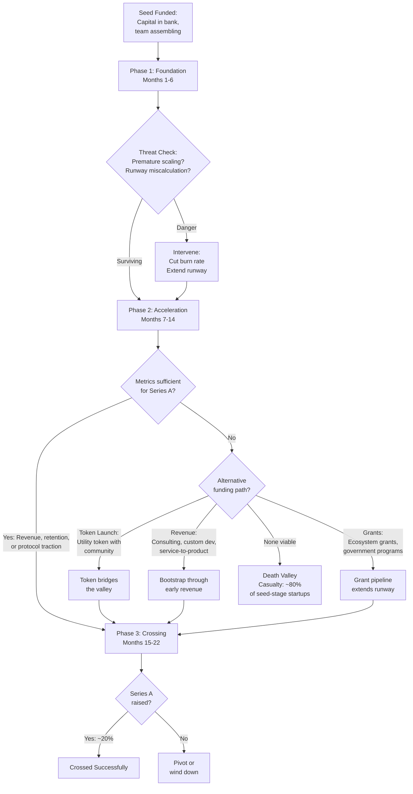

# Chapter 23: The Death Valley — Surviving Seed to Series A

> *Last Updated: March 2026*

> **Skim This Chapter**
> - Only about 20 percent of seed-funded startups successfully raise a Series A, and Web3/AI companies face amplified challenges from longer development cycles, higher infrastructure costs, and regulatory uncertainty; survival requires deliberate burn management, alternative funding (tokens, grants), and metrics discipline.
> - Output: an 18-month survival plan divided into Foundation, Acceleration, and Crossing phases, with sector-specific metrics, grant pipeline strategies, and pivot-vs-persevere decision frameworks.

## 1. Introduction: The Perilous Crossing

Every founder who has raised a seed round knows the euphoria of initial validation. Capital in the bank, a team assembling, a product taking shape. What fewer founders appreciate is the statistical reality of what comes next: the eighteen-to-twenty-four-month gauntlet between seed funding and Series A that the venture industry calls "the death valley." It is the period where more startups die than at any other stage, where optimism collides with operational reality, and where the gap between a promising idea and a fundable business becomes painfully, sometimes fatally, apparent.

The numbers are stark. According to data from Crunchbase, only about 20 percent of seed-funded startups successfully raise a Series A. The median time between seed and Series A has stretched to approximately 22 months as of 2024, up from roughly 15 months in 2018. For companies operating in Web3 and AI, the death valley presents unique and compounding challenges: longer development cycles driven by the complexity of training models or building protocol infrastructure, regulatory uncertainty that can shift the ground beneath a product overnight, and infrastructure costs that dwarf those of a typical SaaS startup. A company training even a modest language model can burn through $50,000 to $200,000 per month in compute alone, while a Web3 protocol may spend months on security audits before a single user touches the product.

> **The death valley truth:** Only about 20 percent of seed-funded startups raise a Series A. For Web3 companies, it drops to 14 percent. The death valley is not simply a funding gap—it is a crucible. The companies that emerge from it have typically discovered something fundamental about their markets, their products, and themselves. Understanding that transformation is the first step toward navigating it successfully.

The following diagram maps the death valley journey from seed funding to Series A, showing the three survival phases, the key threats at each stage, and the alternative paths (including token launches and revenue generation) that founders can use to bridge the gap.

## 2. Defining the Death Valley: What the Data Reveals

### The Statistical Landscape

The death valley is not a metaphor—it is a measurable phenomenon with well-documented contours. Venture capital data provides a clear picture of the attrition that occurs between seed and Series A rounds.

**Conversion Rates by Sector:**
- Overall seed-to-Series-A conversion: approximately 20 percent (Crunchbase, 2024)
- Web3/crypto startups: approximately 14 percent (Galaxy Digital Research, 2024)
- AI/ML startups: approximately 22 percent, though declining from 30 percent in 2021
- Traditional SaaS startups: approximately 25 percent

**Timeline Extension:**
- Median seed-to-Series-A interval in 2019: 15.2 months
- Median seed-to-Series-A interval in 2024: 21.8 months
- For Web3 companies: 24.3 months median
- For AI companies requiring custom model training: 23.1 months median

**Capital Requirements:**
- Median seed round size in 2024: $3.5 million (up from $2.1 million in 2019)
- Median Series A round size in 2024: $12 million
- The gap between what seed capital can sustain and what Series A investors demand has widened considerably

### Why Companies Die in the Valley

The causes of death valley failure cluster into predictable categories, though Web3 and AI companies experience them in distinctive ways.

**Premature Scaling:**
- Hiring ahead of product-market fit, particularly expensive ML engineers or protocol developers
- Building infrastructure for millions of users while serving hundreds
- Expanding token ecosystems before core utility is proven

**Metric Insufficiency:**
- Failing to generate the quantitative evidence Series A investors require
- Confusing vanity metrics (token price, model parameter count) with value metrics (retention, revenue, protocol revenue)
- Inability to demonstrate unit economics or a credible path to them

**Runway Miscalculation:**
- Underestimating the time required to reach Series A milestones
- Failing to account for fundraising time itself (typically 3-6 months)
- Not building buffer for unexpected setbacks: regulatory changes, market downturns, key personnel departures

**Market Timing Misalignment:**
- Building during a hype cycle and attempting to raise during the subsequent correction
- Developing technology that is ready before its market, or arriving after the market has consolidated

The following table summarizes the death valley landscape across sectors, capturing conversion rates, timelines, capital requirements, and the most common failure modes.

| **Metric** | **Overall Startups** | **Web3/Crypto** | **AI/ML** | **Traditional SaaS** |
|---|---|---|---|---|
| Seed-to-Series-A Conversion | ~20% | ~14% | ~22% (declining from 30% in 2021) | ~25% |
| Median Seed-to-Series-A Timeline | 21.8 months (2024) | 24.3 months | 23.1 months (custom model training) | 15-18 months |
| Median Seed Round Size (2024) | $3.5M | Variable; often supplemented by token sales | $3-5M (higher compute needs) | $2-3.5M |
| Top Failure Mode | Premature scaling | Market timing misalignment and regulatory shifts | Runway miscalculation from compute costs | Metric insufficiency |
| Unique Cost Burden | Standard hiring and ops | Security audits ($50K-$500K), legal/compliance ($10K-$50K/mo) | Cloud GPU compute ($10K-$500K+ per training run), ML talent ($200K-$400K/yr) | Standard cloud infrastructure |
| Time to MVP | 3-6 months | 10-16 months (protocol design + audit + testnet + mainnet) | 12-18 months (data + training + optimization + safety) | 3-6 months |

Understanding these failure modes is the first step toward avoiding them. The remainder of this chapter provides specific strategies for navigating each challenge.

## 3. Unique Death Valley Challenges for Web3 and AI Companies

Web3 and AI ventures face a compounded version of the traditional death valley. The challenges are not merely harder versions of what all startups face—they are structurally different, requiring different strategies and different mental models.

### Extended Development Cycles

Traditional SaaS companies can often reach a functional minimum viable product within three to six months. Web3 and AI companies frequently cannot.

**AI Development Timeline Realities:**
- Data collection, cleaning, and annotation: 2-6 months
- Initial model training and iteration: 3-8 months
- Inference optimization and cost reduction: 2-4 months
- Safety testing and red-teaming: 1-3 months
- Total time to a production-ready AI product: frequently 12-18 months

**Web3 Development Timeline Realities:**
- Protocol design and smart contract development: 3-6 months
- Security audits (typically requiring multiple rounds): 2-4 months
- Testnet deployment and community testing: 2-4 months
- Mainnet launch and initial liquidity bootstrapping: 1-3 months
- Total time to a functioning protocol: frequently 10-16 months

These extended timelines mean that seed capital must stretch further, and founders must demonstrate progress through intermediate milestones rather than traditional revenue metrics.

### Infrastructure Cost Burden

The cost structure of Web3 and AI companies differs fundamentally from traditional software startups.

**AI Infrastructure Costs:**
- Cloud GPU compute for model training: $10,000-$500,000+ per training run
- Ongoing inference costs: $0.01-$0.10 per query depending on model size
- Data storage and processing: $5,000-$50,000 per month
- Specialized talent (ML engineers): $200,000-$400,000 annual compensation

**Web3 Infrastructure Costs:**
- Security audits: $50,000-$500,000 per audit
- Gas fees during development and testing: variable but significant
- Node infrastructure and RPC services: $2,000-$20,000 per month
- Legal and compliance advisory: $10,000-$50,000 per month

These costs create a minimum viable burn rate that is substantially higher than traditional software ventures, compressing the runway that any given seed round provides.

### Regulatory Uncertainty

Both Web3 and AI operate in regulatory environments that are actively evolving, creating a form of risk that traditional startups rarely face at the seed stage.

**Web3 Regulatory Risks:**
- Token classification uncertainty (security vs. utility vs. commodity)
- Jurisdiction-specific compliance requirements that shift unpredictably
- Potential for retroactive enforcement actions
- KYC/AML requirements that conflict with decentralization principles

**AI Regulatory Risks:**
- Emerging AI safety legislation (EU AI Act, proposed US frameworks)
- Data privacy regulations affecting training data usage
- Liability frameworks for AI-generated outputs still being established
- Sector-specific regulations (healthcare, finance) creating compliance overhead

For founders, regulatory uncertainty does not merely create legal risk—it creates strategic risk. A product designed around one regulatory interpretation may become unviable under another, and the cost of pivoting mid-development can be catastrophic for a seed-stage company.

## 4. Case Study: Eigen Labs — Surviving the Valley Through Protocol Innovation

Eigen Labs, the company behind the EigenLayer restaking protocol on Ethereum, provides an instructive example of a Web3 project that navigated the death valley successfully by combining technical innovation with disciplined capital management.

Founded in 2021 by Sreeram Kannan, a professor at the University of Washington, EigenLayer faced the classic death valley challenge: building complex cryptographic infrastructure that required years of development before generating meaningful adoption or revenue. The protocol's core concept—allowing Ethereum stakers to "restake" their ETH to secure additional services—was technically ambitious and required extensive security research before deployment.

Eigen Labs raised a $14.5 million seed round in 2022, during one of the most challenging crypto fundraising environments in years. The team made several decisions that proved critical to their survival. First, they maintained a lean team of primarily researchers and protocol developers, avoiding the premature hiring of business development or marketing staff. Second, they published extensive academic research on restaking economics, building credibility with the Ethereum research community before launching a product. Third, they designed a phased mainnet rollout that allowed them to demonstrate traction incrementally rather than requiring a single high-stakes launch.

By early 2023, Eigen Labs had attracted significant attention from the Ethereum developer community through research papers and testnet deployments. This academic-first approach substituted for the revenue traction that traditional VCs would expect, because it demonstrated a different form of product-market fit: technical validation from the most sophisticated participants in the ecosystem. The company raised a $50 million Series A in March 2023, led by Blockchain Capital, on the strength of its research output, community engagement, and testnet metrics rather than traditional revenue figures.

The lesson from Eigen Labs is that death valley navigation in Web3 often requires redefining what "traction" means. For infrastructure protocols, peer-reviewed research, developer adoption on testnets, and community governance participation can serve as legitimate proxies for the revenue metrics that Series A investors typically demand—provided the founding team can articulate why these proxies predict future value creation.

## 5. Token Launches as Alternative to Series A

One of the most distinctive features of Web3 entrepreneurship is the availability of token launches as an alternative or complement to traditional venture fundraising. For some companies, a well-executed token launch can bridge the death valley entirely, providing capital, community, and distribution simultaneously. For others, a premature or poorly designed token launch can accelerate failure.

### When Token Launches Are Appropriate

Token launches work best when specific conditions are met:

**Strong Candidates for Token Launch:**
- Protocols where the token serves a genuine utility function (governance, staking, access)
- Projects with an active community of users or developers already engaged
- Infrastructure that benefits from decentralized participation and incentive alignment
- Products where token-based incentives genuinely improve the user experience

**Poor Candidates for Token Launch:**
- Companies using tokens primarily as a fundraising mechanism without genuine utility
- Projects without established community engagement or product usage
- Teams seeking to avoid the discipline of traditional fundraising scrutiny
- Products where tokenization adds complexity without clear user benefit

### Token Launch Models

Several token launch approaches have emerged, each with distinct risk-reward profiles:

**Community Airdrops:**
- Distributing tokens to early users, contributors, or ecosystem participants
- Advantages: builds loyalty, creates distribution, avoids securities concerns
- Risks: sell pressure from recipients, regulatory scrutiny, mercenary farming

**Liquidity Bootstrapping Pools (LBPs):**
- Algorithmic price discovery through declining-price auctions
- Advantages: fairer distribution, reduced whale manipulation, price discovery
- Risks: complexity, potential for low participation, ongoing liquidity needs

**Protocol-Owned Liquidity:**
- Building permanent liquidity reserves rather than relying on rented liquidity
- Advantages: sustainability, reduced mercenary capital dependency
- Risks: capital intensity, smart contract risk, opportunity cost

**Points Programs Leading to Token:**
- Distributing points for protocol usage, convertible to tokens at a future date
- Advantages: incentivizes genuine usage, delays token launch until appropriate
- Risks: regulatory uncertainty around points-to-token conversion, expectation management

### The Regulatory Dimension

Token launches exist in a regulatory environment that remains unsettled across most jurisdictions. Founders considering this path must engage experienced legal counsel early and design token economics that can withstand regulatory scrutiny. The costs of compliance—legal advisory, jurisdiction selection, ongoing reporting—should be factored into any token launch budget, typically ranging from $100,000 to $500,000 in legal fees alone.

## 6. Case Study: Render Network — Token Launch as Bridge

The Render Network illustrates both the potential and the complexity of using a token launch to bridge the death valley. Founded by Jules Urbach in 2017, Render aimed to create a decentralized GPU rendering network, connecting artists and studios needing computational power with GPU owners willing to provide it.

Render launched its RNDR token in 2017 through a token sale that raised approximately $5 million. The timing coincided with the initial coin offering boom, but unlike many projects of that era, Render had a concrete technical product and a founder with deep industry experience (Urbach had previously founded OTOY, a cloud rendering company). The token sale provided capital that allowed the team to continue development through the crypto winter of 2018-2019, when traditional venture capital for crypto projects nearly evaporated.

The critical insight from Render's experience is that the token did not replace the need for product development—it extended the runway during which that development could occur. The team used token sale proceeds conservatively, maintaining a small core team and focusing on technical milestones rather than marketing or ecosystem expansion. By 2020, Render had a functioning network with real rendering jobs being processed by GPU node operators, providing the traction necessary to attract additional investment and partnerships.

However, Render also faced the challenges inherent in early token launches: managing community expectations during extended development periods, navigating token price volatility that affected team morale and recruitment, and addressing regulatory questions about the token's classification. The team managed these challenges by maintaining transparent communication through regular development updates and by designing token utility that was clearly tied to network usage rather than speculative appreciation.

By 2023, the Render Network had processed millions of rendering jobs, and the RNDR token had established genuine utility as the payment mechanism for the network. The project's journey illustrates that token launches can effectively bridge the death valley, but only when the token serves genuine utility, the team maintains development discipline, and the community receives consistent, honest communication about progress and challenges.

## 7. Burn Rate Management with Expensive AI Infrastructure

For AI companies, infrastructure costs represent the single largest threat to death valley survival. The difference between a company that reaches Series A and one that runs out of capital often comes down to infrastructure cost management.

### The Compute Cost Framework

Founders should categorize compute spending into four tiers with distinct management strategies:

**Tier 1: Exploration Compute (Minimize)**
- Experimental model architectures and approaches
- Strategy: use the smallest models that can validate hypotheses
- Budget allocation: no more than 10-15 percent of total compute budget
- Key principle: fail fast with small models before investing in large ones

**Tier 2: Development Compute (Optimize)**
- Active model training for production candidates
- Strategy: leverage spot instances, optimize training pipelines, use mixed-precision training
- Budget allocation: 30-40 percent of total compute budget
- Key principle: every training run should have predefined success criteria

**Tier 3: Inference Compute (Monitor Ruthlessly)**
- Serving models to users in production
- Strategy: implement model distillation, quantization, caching, and batching
- Budget allocation: 20-30 percent of total compute budget
- Key principle: inference cost per query should decrease monthly

**Tier 4: Infrastructure Compute (Negotiate)**
- Data processing, storage, monitoring, and CI/CD pipelines
- Strategy: negotiate committed-use discounts, evaluate multi-cloud strategies
- Budget allocation: 15-20 percent of total compute budget
- Key principle: infrastructure should scale sub-linearly with usage

### Practical Cost Reduction Strategies

**Model Distillation:**
- Training smaller "student" models to replicate the behavior of larger "teacher" models
- Can reduce inference costs by 60-80 percent with modest quality degradation
- Particularly effective for domain-specific applications where general capability is less important

**Inference Optimization:**
- Quantization (reducing numerical precision) can cut memory requirements by 50-75 percent
- Batching requests improves GPU utilization from typical 30-40 percent to 70-80 percent
- Caching common queries can eliminate 20-40 percent of inference requests entirely

**Strategic Cloud Commitments:**
- One-year committed use contracts typically provide 30-40 percent discounts
- Spot/preemptible instances for training workloads offer 60-70 percent savings
- Multi-cloud strategies enable cost arbitrage but add operational complexity

**Open-Source Model Leverage:**
- Fine-tuning open-source foundation models rather than training from scratch
- Reduces training compute by 90-95 percent compared to pre-training
- Particularly effective for domain-specific applications

### The 40-30-20-10 Rule

A practical heuristic for AI startup burn rate allocation during the death valley period:

- **40 percent**: People (engineering, research, essential operations)
- **30 percent**: Compute and infrastructure
- **20 percent**: Go-to-market (sales, marketing, partnerships)
- **10 percent**: Buffer and contingency

Companies that allow compute costs to exceed 40 percent of total burn are typically in dangerous territory, as it indicates either insufficient revenue to offset infrastructure costs or inadequate optimization of compute spending.

## 8. Case Study: Adept AI — When the Valley Claims a Vision

Not every death valley story ends in successful crossing. Adept AI, founded in 2022 by former Google Brain and DeepMind researchers, provides a sobering illustration of how even well-funded, technically excellent AI companies can struggle in the gap between seed funding and sustainable operations.

Adept raised approximately $415 million across its funding rounds, with a vision to build AI agents capable of performing complex computer tasks—clicking buttons, filling forms, navigating software—on behalf of users. The founding team was exceptional by any measure: CEO David Luan had led engineering at Google Brain, and co-founders included researchers behind the influential Transformer architecture. The technical ambition was enormous, and early demonstrations captured significant attention from both investors and the technology press.

However, Adept confronted several death valley challenges simultaneously. The compute costs required to train models capable of reliably interacting with diverse software interfaces were enormous—general-purpose action models required training data and compute resources that scaled rapidly. The competitive landscape shifted beneath them as larger companies, particularly Google and Microsoft, began integrating similar agent capabilities into their existing products. And the gap between impressive demonstrations and reliable, production-ready performance proved wider than anticipated.

By 2024, Adept had pivoted its strategy multiple times, and ultimately the company's key talent and technology were acquired by Amazon in a structured deal. While the founders and investors achieved some return, the original vision of an independent AI agent company was not realized.

The lessons from Adept are instructive for any AI founder navigating the death valley. First, competing directly with well-resourced incumbents on general-purpose AI capabilities is extraordinarily difficult for seed-stage companies—differentiation through specialization is usually more viable. Second, impressive technical demonstrations do not automatically translate to product-market fit; the gap between "works in a demo" and "works reliably for paying customers" can consume years and hundreds of millions of dollars. Third, even substantial funding cannot substitute for a clear, defensible market position; capital extends runway but does not create product-market fit.

The Adept story does not represent failure in the conventional sense—the technology found a home, and the team members continue to contribute to AI advancement. But for founders planning their own death valley crossing, it serves as a reminder that technical excellence alone is insufficient, and that the valley demands commercial viability alongside technological ambition.

## 9. Revenue Generation Strategies Before Product-Market Fit

One of the most counterintuitive aspects of death valley survival is the need to generate revenue before achieving product-market fit. This is not contradictory—early revenue serves as both a survival mechanism and a learning tool, providing cash flow while simultaneously generating the customer interaction data that drives product improvement.

### Service-to-Product Revenue

The most reliable early revenue strategy for technical founders involves offering services that leverage the same expertise being productized:

**Consulting and Advisory:**
- Providing expert advisory services in AI/ML or Web3 architecture
- Typical rates: $200-$500 per hour for specialized technical consulting
- Revenue potential: $10,000-$50,000 per month with 2-3 engagements
- Risk: distraction from product development; mitigate by limiting to 20-30 percent of team capacity

**Custom Development:**
- Building bespoke solutions for enterprise clients using the same technology stack
- Advantages: validates technology in real-world contexts, builds reference customers
- Revenue potential: $50,000-$200,000 per project
- Risk: becoming a services company; mitigate by maintaining strict product roadmap boundaries

**Data Labeling and Annotation:**
- For AI companies, offering data services using the same pipelines built for internal use
- Revenue potential: $5,000-$30,000 per month
- Advantage: builds proprietary data assets while generating revenue

### Design Partner Revenue

Engaging early customers as design partners creates alignment between revenue generation and product development:

**Structure:**
- Reduced pricing (typically 50-70 percent discount) in exchange for active feedback and co-development
- Quarterly review cadence with structured feedback sessions
- Contractual commitment to case study participation and referenceability
- Typical engagement: 3-5 design partners during death valley period

**Revenue Characteristics:**
- Lower per-customer revenue but higher learning value
- More predictable than transactional sales
- Creates compelling narratives for Series A investors
- Generates the specific metrics (retention, expansion, NPS) that investors evaluate

### API and Platform Revenue

For both AI and Web3 companies, offering developer-facing APIs or platform access can generate meaningful revenue during the death valley period:

**AI API Monetization:**
- Pricing models: per-call, per-token, or tiered subscription
- Advantages: usage-based revenue scales with adoption, generates clear metrics
- Typical early-stage revenue: $5,000-$50,000 per month
- Key metric: gross margin on API revenue (target above 50 percent)

**Web3 Protocol Fees:**
- Transaction fees, staking fees, or service fees built into protocol design
- Advantages: automated revenue collection, transparent on-chain metrics
- Typical early-stage revenue: highly variable, from near-zero to millions depending on protocol type
- Key metric: fee revenue per active user

### The Revenue-Learning Loop

The strategic purpose of early revenue extends beyond cash flow. Every paying customer interaction generates data about:

- Which features customers actually value (often different from what they request)
- Price sensitivity and willingness to pay for specific capabilities
- Integration requirements and deployment challenges
- Competitive alternatives and switching costs

This learning compounds over time, creating an information advantage that is as valuable as the revenue itself.

## 10. The Metrics That Matter

Series A investors evaluate Web3 and AI companies through metrics frameworks that differ significantly from traditional SaaS playbooks. Understanding which metrics matter—and which are distractions—can mean the difference between a successful raise and an extended death valley.

### Web3 Metrics That Drive Series A Decisions

**Total Value Locked (TVL):**
- Relevant for: DeFi protocols, staking services, lending platforms
- What investors look for: organic TVL growth (not incentivized), TVL stability through market cycles
- Red flags: TVL concentrated among a few addresses, TVL dependent on high emissions
- Benchmark: $10 million+ TVL for DeFi Series A consideration

**Daily Active Addresses (DAA):**
- Relevant for: all user-facing Web3 applications
- What investors look for: growing unique addresses interacting with contracts, retention of addresses over time
- Red flags: bot activity inflating numbers, sybil addresses farming incentives
- Benchmark: 1,000+ genuine daily active addresses for application-layer Series A

**Protocol Revenue:**
- Relevant for: all Web3 protocols
- What investors look for: fee revenue generated by genuine usage, revenue per active address
- Red flags: revenue dependent on token incentives exceeding fee generation
- Benchmark: $50,000+ monthly protocol revenue demonstrates genuine demand

**Developer Activity:**
- Relevant for: infrastructure and platform protocols
- What investors look for: number of external developers building on the protocol, quality and diversity of applications
- Red flags: developer activity concentrated in grant-funded projects only
- Benchmark: 20+ active external developers for infrastructure Series A

### AI Metrics That Drive Series A Decisions

**Model Performance vs. Benchmarks:**
- Relevant for: all AI companies
- What investors look for: performance on industry-standard benchmarks, improvement trajectory over time
- Red flags: performance claims without reproducible evaluation, benchmark gaming
- Benchmark: competitive with or exceeding state-of-the-art on relevant domain benchmarks

**Inference Cost Trajectory:**
- Relevant for: all AI companies serving models in production
- What investors look for: declining cost per query over time, clear path to margin-positive inference
- Red flags: inference costs increasing with usage, no optimization strategy
- Benchmark: inference gross margins above 50 percent, or clear trajectory toward that target

**User Retention:**
- Relevant for: consumer and enterprise AI applications
- What investors look for: week-over-week and month-over-month retention curves, depth of usage per retained user
- Red flags: high initial adoption with steep dropoff, usage concentrated in novelty period
- Benchmark: 30+ percent month-one retention for consumer, 80+ percent for enterprise

**Data Moat Indicators:**
- Relevant for: AI companies whose competitive advantage depends on proprietary data
- What investors look for: unique data assets, data flywheel mechanisms, defensibility of data sources
- Red flags: reliance on publicly available datasets, no mechanism for continuous data accumulation
- Benchmark: demonstrable data advantage over competitors using the same base models

### Universal Metrics

Regardless of sector, certain metrics remain fundamental to Series A evaluation:

**Burn Multiple:**
- Net burn divided by net new ARR; measures capital efficiency
- Target: below 2x for efficient growth, above 5x indicates inefficiency
- Particularly important in current fundraising environment

**Runway:**
- Months of cash remaining at current burn rate
- Target: minimum 6 months at time of Series A fundraising initiation
- Investors typically want to see 12+ months remaining to avoid desperation dynamics

**Team Retention:**
- Percentage of seed-stage team remaining
- Target: 80+ percent retention of core technical team
- High turnover during death valley signals execution or culture problems

## 11. Strategic Partnerships as Survival Mechanism

Strategic partnerships can provide capital-efficient alternatives to some of the resources that traditional fundraising supplies. For Web3 and AI companies navigating the death valley, the right partnerships can provide compute resources, distribution, credibility, and even direct revenue.

### Types of Strategic Partnerships

**Cloud Provider Partnerships:**
- Programs like Google for Startups Cloud, AWS Activate, Microsoft for Startups
- Typical value: $50,000-$350,000 in cloud credits
- Duration: 12-24 months
- Application: direct offset to AI compute costs, the largest burn category for many AI startups
- Strategy: apply to multiple programs simultaneously; credits are non-dilutive

**Protocol Ecosystem Partnerships:**
- Integration grants from established protocols (Ethereum, Solana, Polygon, etc.)
- Typical value: $25,000-$500,000 in grants plus token allocations
- Benefits: technical support, ecosystem visibility, access to established user base
- Strategy: target ecosystems where your technology fills a demonstrated gap

**Enterprise Design Partnerships:**
- Structured collaboration with large enterprises using your technology
- Typical value: $50,000-$500,000 in contract revenue plus development resources
- Benefits: real-world validation, reference customers, product feedback
- Strategy: offer significant price concessions in exchange for co-development commitment and case study rights

**Academic and Research Partnerships:**
- Collaboration with university labs or research institutions
- Typical value: access to talent, datasets, and computational resources
- Benefits: credibility enhancement, talent pipeline, publication opportunities
- Strategy: structure partnerships around specific research questions aligned with product development

### Partnership Management During Death Valley

Partnerships require management attention that is scarce during the death valley period. A few principles help founders extract maximum value while minimizing distraction:

- **Limit active partnerships to three to five.** More partnerships create more coordination overhead than value.
- **Assign a single point of contact.** Every partnership should have one person responsible for managing the relationship.
- **Define success metrics upfront.** What specific outcomes (credits, revenue, users, data) does each partnership provide?
- **Set time boundaries.** Partnerships that are not producing measurable results within 90 days should be deprioritized.
- **Align partnerships with fundraising narrative.** Every partnership should strengthen the story told to Series A investors.

## 12. Bridge Rounds and Extension Rounds

When the path to Series A proves longer than anticipated, bridge and extension rounds can provide the additional runway needed to reach milestone achievement. These interim funding events are common but carry risks that founders must understand.

### Bridge Round Mechanics

**Definition:** A smaller round of capital, typically from existing investors, designed to extend runway until the next priced round.

**Typical Characteristics:**
- Size: 20-40 percent of the original seed round
- Structure: convertible notes or SAFEs with discount to next round
- Discount rates: typically 15-25 percent
- Valuation caps: usually set at a modest premium to seed valuation
- Timeline: typically raised within 4-8 weeks

**When Bridge Rounds Are Appropriate:**
- Clear milestones are achievable with 3-6 months of additional runway
- Existing investors remain confident and willing to participate
- Market conditions, not execution failure, are causing fundraising delays
- The team has demonstrated progress since the seed round

**When Bridge Rounds Are Dangerous:**
- Fundamental product-market fit has not been demonstrated
- Existing investors decline to participate (a strong negative signal)
- The bridge is needed because of burn rate mismanagement rather than timeline extension
- Multiple bridges have already been raised without reaching Series A milestones

### Extension Round Strategy

An extension round differs from a bridge in scope and ambition:

**Definition:** A larger round that may include new investors, priced at or near the seed valuation, intended to provide substantial additional runway.

**Typical Characteristics:**
- Size: 50-100 percent of the original seed round
- Structure: priced round or SAFE with clear terms
- Includes new investors alongside existing ones
- Provides 12-18 months of additional runway

**Strategic Considerations:**
- Dilution management: extensions at flat or down valuations create significant dilution
- Signal risk: the market may interpret an extension as inability to raise Series A
- Benefit: provides enough runway for meaningful additional milestone achievement
- Best used when the company has clear traction but needs more time to compound it

### The Decision Framework

Founders considering bridge or extension rounds should evaluate four questions:

1. **What specific milestones will this capital enable?** If the answer is vague, the round will not solve the underlying problem.
2. **Will existing investors participate?** If not, this signals deeper concerns that additional capital alone cannot address.
3. **What has changed since the seed round?** If progress has been minimal, more money is unlikely to produce different results.
4. **Is there a credible path to Series A within 12 months of closing the bridge?** If not, the bridge merely delays an inevitable outcome.

## 13. When to Pivot vs. Persevere in Web3/AI

The death valley forces a decision that defines many startups' trajectories: whether to pivot or persevere. This decision is particularly consequential in Web3 and AI, where the sunk costs of technical development are high and the distinction between "early" and "wrong" is genuinely difficult to assess.

### The Perseverance Framework

Perseverance is warranted when multiple conditions are present:

**Leading Indicators of Future Success:**
- User engagement depth is increasing even if user count is modest
- Technical performance is improving on the metrics that matter
- Design partners or early customers are expanding their usage
- The team is learning faster than competitors

**Market Validation Signals:**
- Industry analysts or researchers reference your approach favorably
- Competing products are emerging, validating market demand
- Potential customers describe your problem space as urgent
- Regulatory clarity is improving in your favor

**Resource Sufficiency:**
- Runway extends at least 9 months at current burn rate
- Key team members remain committed and motivated
- Strategic partnerships are producing tangible results
- A plausible fundraising path exists

### The Pivot Framework

Pivoting is warranted when multiple warning signs converge:

**Market Signals:**
- Potential customers express interest but consistently decline to pay
- The problem you are solving has decreased in urgency or been solved by alternatives
- Regulatory developments have undermined your approach
- Your target market has contracted rather than expanded

**Product Signals:**
- Technical challenges have proven more fundamental than anticipated
- User retention curves flatten at unsustainably low levels
- The cost to deliver your product exceeds what customers will pay
- Feature requests from users consistently point away from your core thesis

**Team Signals:**
- Key technical talent is departing for competitors or adjacent opportunities
- The founding team has lost conviction in the current direction
- Morale has declined despite reasonable effort and progress
- New information has fundamentally changed your understanding of the opportunity

### Pivot Types in Web3/AI

Not all pivots are equal. Web3 and AI companies typically pivot along one of several dimensions:

**Application Layer Pivot:** Maintaining core technology but changing the target use case (e.g., from consumer to enterprise, from DeFi to payments)

**Technology Pivot:** Maintaining the target market but changing the technical approach (e.g., from custom model training to fine-tuning, from Layer 1 to Layer 2)

**Business Model Pivot:** Maintaining product and market but changing how value is captured (e.g., from token-based to SaaS pricing, from protocol fees to enterprise licensing)

**Customer Segment Pivot:** Maintaining the product but targeting a different customer profile (e.g., from developers to end users, from crypto-native to crypto-curious)

The most successful pivots preserve the team's accumulated knowledge and technical assets while redirecting them toward more promising opportunities. Complete restarts are rarely successful during the death valley period because they reset the learning clock without resetting the burn clock.

## 14. Grant Funding as Bridge: Ecosystem Grants and Foundation Programs

Grant funding represents an underutilized survival mechanism for Web3 and AI companies navigating the death valley. Unlike venture capital, grants are non-dilutive—they provide capital without requiring equity or token allocation. Unlike revenue, they do not require a finished product. For founders willing to navigate the application process, grants can provide meaningful runway extension.

### Web3 Grant Ecosystems

The Web3 ecosystem has developed the most extensive grant infrastructure of any technology sector:

**Ethereum Foundation Grants:**
- Focus: core protocol research, developer tooling, community development
- Typical size: $10,000-$500,000
- Process: rolling applications, reviewed by technical committees
- Timeline: 4-8 weeks from application to decision
- Total distributed: over $100 million since inception

**Protocol-Specific Grant Programs:**
- Uniswap Foundation: focused on DeFi infrastructure, $1 million-$5 million annual budget
- Optimism RetroPGF: retroactive public goods funding, distributes OP tokens to impactful projects
- Solana Foundation: developer tooling and ecosystem growth, typical grants $25,000-$200,000
- Polygon: ecosystem development grants, particularly for applications targeting emerging markets

**Gitcoin Grants:**
- Quadratic funding model amplifying community contributions
- Suitable for public goods and open-source development
- Revenue per round varies dramatically based on community support
- Strategic value extends beyond capital to community building and visibility

### AI Grant and Research Programs

AI companies have access to a different but equally valuable set of grant opportunities:

**Government Research Grants:**
- NSF SBIR/STTR: $275,000 Phase I, up to $1 million Phase II
- DARPA: larger grants for defense-relevant AI research
- NIH: AI applications in healthcare and biomedical research
- Department of Energy: AI for scientific computing and climate modeling
- EU Horizon Europe: significant funding for AI research with European nexus

**Corporate Research Programs:**
- Google Research Credits: compute resources for academic and startup research
- Microsoft Research Partnerships: collaborative research opportunities
- NVIDIA Inception: GPU credits and technical support for AI startups
- Meta Research Awards: grants for specific AI research areas

**Foundation and Non-Profit Grants:**
- Open Philanthropy: AI safety and alignment research
- Patrick J. McGovern Foundation: AI for social impact
- Knight Foundation: AI applications in journalism and civic technology
- MacArthur Foundation: AI ethics and governance research

### Grant Strategy for Death Valley Navigation

Grants should be treated as a strategic tool, not a desperation measure. Effective grant strategies share several characteristics:

**Alignment with Product Roadmap:**
- Apply for grants that fund work you would do anyway
- Avoid grants that require significant deviation from core development priorities
- Frame existing work in terms that resonate with grant program objectives

**Portfolio Approach:**
- Apply to multiple programs simultaneously to diversify timing and approval risk
- Maintain a pipeline of 5-10 active applications at any time
- Track success rates and optimize applications based on feedback

**Relationship Building:**
- Engage with grant program managers before applying
- Participate in ecosystem events and governance discussions
- Share research and development outputs publicly to build credibility

**Reporting Discipline:**
- Treat grant reporting requirements as investor update practice
- Use grant milestones as internal accountability mechanisms
- Build public track record of grant execution for future applications

## 15. Case Study: Celo — From Grants to Venture Capital

Celo, the mobile-first blockchain platform focused on financial inclusion in emerging markets, provides a compelling example of a project that leveraged grant funding and non-traditional capital sources to navigate the death valley before attracting significant venture investment.

Founded in 2017 by Rene Reinsberg, Marek Olszewski, and Sep Kamvar, Celo's mission to create accessible financial tools for the developing world resonated more naturally with impact-oriented funders than with traditional venture capital firms focused on near-term returns. The founding team strategically pursued a hybrid funding approach that combined small venture investments with foundation grants and strategic partnerships.

In its early stages, Celo secured research funding through academic partnerships—Kamvar was a professor at MIT—and impact-oriented grants focused on financial inclusion. These non-dilutive capital sources funded initial protocol research and early prototyping while the team refined its technical approach and built relationships within the broader blockchain ecosystem. The team also participated actively in Ethereum research and governance, establishing credibility within the developer community.

This foundation of grant-funded research and community engagement gave Celo the technical maturity and mission-driven narrative needed to attract venture capital on favorable terms. The company raised a $6.4 million seed round and subsequently a $30 million funding round through a token sale and venture investment led by a16z crypto and Polychain Capital. Critically, by the time venture investors engaged, Celo had already demonstrated technical viability and community traction through its grant-funded work, enabling stronger negotiating position and more favorable terms.

Celo's approach demonstrates several principles applicable to death valley navigation. First, mission-aligned non-dilutive funding can serve as effective bridge capital during the research and development phase. Second, academic credibility and open-source contribution build the kind of reputation that eventually translates to venture investor confidence. Third, geographic focus on underserved markets—in Celo's case, sub-Saharan Africa and Southeast Asia—can unlock funding sources unavailable to companies targeting saturated Western markets. This non-Western focus also provided Celo with a distinctive market position, differentiating it from the crowded field of Layer 1 protocols competing primarily for DeFi users in North America and Europe.

## 16. Case Study: Stability AI — A Cautionary Tale of Scaling Without Foundations

Stability AI, the company behind the Stable Diffusion family of image generation models, offers a contrasting case study from the AI sector that illuminates the dangers of scaling ambition without corresponding commercial discipline during the death valley period.

Founded in 2020 by Emad Mostaque, Stability AI achieved remarkable initial success: its open-source release of Stable Diffusion in August 2022 was one of the most significant events in the generative AI wave, making high-quality image generation freely available to millions of users and developers. The company raised $101 million at a valuation of approximately $1 billion in October 2022, appearing to have leaped over the death valley entirely.

However, the subsequent eighteen months revealed that rapid fundraising and viral adoption had obscured fundamental business model challenges. Stability AI's open-source strategy, while generating enormous community goodwill and developer adoption, made revenue generation extraordinarily difficult. The company's compute costs were staggering—reportedly spending over $8 million per month on cloud computing—while revenue generation lagged far behind. The company burned through cash at an alarming rate, and reports emerged of unpaid computing bills and vendor disputes.

By 2024, the company had experienced significant executive turnover including the departure of founder Mostaque, multiple rounds of layoffs, and an ongoing search for sustainable business models. The core challenge was structural: the company's greatest asset—its open-source community and models—was precisely what made monetization most difficult.

The Stability AI case illustrates several death valley lessons that apply broadly. First, open-source strategies in AI require clear complementary monetization from the outset, not as an afterthought. Second, compute costs at scale can overwhelm even substantial funding if revenue does not keep pace. Third, valuation and fundraising success are not the same as business viability; a high valuation can create expectations that are impossible to meet. Fourth, the death valley challenge does not disappear simply because a company raises a large round—it merely changes shape, creating pressure to justify valuation with revenue that may not yet be achievable.

## 17. Implementation Guide: The 18-Month Survival Plan

The following framework provides a structured approach to death valley navigation, adaptable to the specific circumstances of Web3 and AI companies. It assumes a seed round has been raised and the clock is running.

### Phase 1: Foundation (Months 1-6)

**Objective:** Establish the operational disciplines and learning systems that will sustain the company through the valley.

**Financial Management:**
- Establish monthly burn rate tracking with detailed category breakdown
- Set burn rate ceiling at a level that provides 18+ months of runway
- Open conversations with cloud providers about startup credit programs
- Apply to 3-5 relevant grant programs

**Product Development:**
- Define the three to five core metrics that will demonstrate product-market fit
- Ship minimum viable product or testnet deployment by month 4
- Engage 3-5 design partners with structured feedback cadence
- Begin generating early revenue through services, consulting, or API access

**Team and Culture:**
- Establish weekly all-hands with transparent financial reporting
- Define "red line" metrics that would trigger strategy reassessment
- Document institutional knowledge to reduce key-person risk
- Create an explicit culture around capital efficiency and learning velocity

**Investor Relations:**
- Send monthly investor updates with consistent metrics format
- Identify target Series A investors and begin relationship building
- Establish 2-3 advisory relationships with operators who have navigated the valley
- Begin tracking the specific metrics your target investors prioritize

### Phase 2: Acceleration (Months 7-12)

**Objective:** Demonstrate the traction and learning velocity that will make Series A investors confident.

**Financial Management:**
- Evaluate whether bridge funding is needed and initiate conversations if necessary
- Optimize infrastructure costs based on 6 months of operational data
- Increase revenue generation efforts—target 10-20 percent of burn covered by revenue
- Execute on grant funding pipeline, apply for additional programs

**Product Development:**
- Achieve measurable improvement on core product metrics
- Expand from design partners to early customers with standard pricing
- Ship 2-3 major product iterations based on user feedback
- For Web3: demonstrate mainnet traction; for AI: demonstrate production deployment

**Market Positioning:**
- Publish thought leadership content demonstrating domain expertise
- Present at 2-3 relevant conferences or industry events
- Build strategic partnership portfolio (cloud credits, ecosystem integrations, enterprise pilots)
- Generate 1-2 customer case studies with quantitative results

**Series A Preparation:**
- Refine investor narrative based on accumulated traction data
- Prepare data room with organized metrics, financial projections, and team information
- Solicit warm introductions to target Series A investors
- Practice pitch with advisory board and friendly investors

### Phase 3: Crossing (Months 13-18)

**Objective:** Execute the Series A fundraise or alternative strategy (token launch, strategic acquisition, profitability).

**Fundraising Execution (if pursuing Series A):**
- Initiate formal fundraising process with target list of 20-30 investors
- Lead with strongest metrics and most compelling customer narratives
- Maintain operational momentum during fundraising—do not let the company stall
- Plan for 3-6 months of active fundraising effort

**Alternative Path Execution (if pivoting away from Series A):**
- Token launch: finalize tokenomics, engage legal counsel, prepare community
- Profitability path: accelerate revenue, cut costs to reach cash-flow breakeven
- Strategic partnership or acquisition: engage potential partners, prepare materials
- Extension round: approach existing investors with clear milestone plan

**Contingency Planning:**
- Identify the minimum team and burn rate that could sustain the company for 6 additional months
- Prepare pivot options based on accumulated learning
- Maintain relationships with acquirers or merger partners as insurance
- Define the specific conditions under which an orderly wind-down would be the responsible choice

### Monthly Review Cadence

Throughout all three phases, maintain a monthly strategic review that addresses four questions:

1. **Runway Check:** How many months of cash remain? Is burn trending up or down?
2. **Metric Review:** Are core metrics improving? At what rate? How does this compare to plan?
3. **Strategy Validation:** Does accumulated evidence support the current strategy? What would change our mind?
4. **Next-Month Priorities:** What are the three most important things to accomplish in the next 30 days?

This review should involve the founding team and, where appropriate, key advisors or board members. Its purpose is not bureaucratic compliance but strategic clarity—ensuring that every month in the death valley is spent deliberately rather than reactively.

## Key Takeaways

### The Death Valley Is a Feature, Not a Bug

The seed-to-Series-A gap exists because it serves a necessary function: it separates companies that have discovered genuine product-market fit from those that have not. Rather than viewing the death valley as an obstacle to survive, founders should view it as a process that will make their companies stronger—provided they approach it with the right strategies and mindset.

### Capital Efficiency Is the Primary Survival Skill

In the death valley, the companies that survive are not necessarily those with the most funding—they are those that extract the most learning and progress per dollar spent. This requires relentless attention to burn rate management, infrastructure cost optimization, and the discipline to say no to activities that consume resources without advancing core objectives.

### Alternative Funding Is Not a Consolation Prize

Token launches, grant programs, bridge rounds, and strategic partnerships are not inferior substitutes for Series A funding. When deployed strategically, they can provide non-dilutive capital, community building, and market validation that pure venture capital does not offer. The best death valley strategies typically combine multiple funding sources rather than relying exclusively on one.

### Metrics Must Match Your Stage and Sector

The metrics that matter for a Web3 protocol (TVL, daily active addresses, protocol revenue) differ fundamentally from those that matter for an AI company (model performance, inference costs, user retention). Founders who track and optimize the right metrics will build the evidence base that Series A investors require. Those who optimize vanity metrics will find themselves stranded in the valley with impressive-looking dashboards and empty bank accounts.

### The Decision to Pivot Is as Valuable as the Decision to Persevere

Some of the most successful technology companies emerged from pivots during the death valley period. The willingness to honestly assess whether the current strategy is working—and the courage to change direction when evidence warrants it—is not a sign of failure but of mature entrepreneurial judgment.

### Survival Requires Both Strategy and Psychology

Navigating the death valley is as much a psychological challenge as a strategic one. The isolation, uncertainty, and financial pressure of this period test founders in ways that cannot be fully prepared for. Building support systems—co-founders, advisors, peer founders, mentors—is not optional during this period. It is essential infrastructure for the human being behind the company.

## Founder's Checklist
- [ ] Have you calculated your precise runway and identified the date when cash reaches the critical six-month threshold?
- [ ] Are you tracking the right sector-specific metrics that Series A investors will evaluate, rather than vanity metrics?
- [ ] Have you explored alternative funding sources such as grants, token launches, or bridge rounds to extend runway without excessive dilution?
- [ ] Have you established a monthly investor update cadence with consistent metrics to build relationships before the fundraise?
- [ ] Do you have a clear pivot-versus-persevere decision framework with defined thresholds for changing direction?

---

## In This Chapter

- The death valley between seed and Series A claims approximately 80 percent of funded startups, with Web3 companies facing even lower conversion rates.
- Web3 and AI companies face amplified death valley challenges: longer development cycles, higher infrastructure costs, and regulatory uncertainty.
- Token launches can serve as alternatives to Series A funding but require genuine token utility and established community engagement.
- AI infrastructure costs demand systematic optimization through model distillation, inference batching, and strategic cloud commitments.
- Revenue generation before product-market fit serves dual purposes: extending runway and accelerating learning.
- Web3 metrics (TVL, DAA, protocol revenue) and AI metrics (model performance, inference costs, retention) differ fundamentally from traditional SaaS metrics.
- Grant funding from foundations, governments, and ecosystem programs provides non-dilutive capital during the death valley period.
- The 18-month survival plan divides the death valley into Foundation (months 1-6), Acceleration (months 7-12), and Crossing (months 13-18) phases.

## Checklist

- [ ] Calculate precise runway based on current burn rate and identify the date when cash reaches critical threshold (6 months remaining)
- [ ] Categorize all expenses into essential (product development, core team) and discretionary (nice-to-have tools, conferences, office space)
- [ ] Define the 3-5 core metrics that will demonstrate product-market fit to Series A investors
- [ ] Identify and apply to at least 3 relevant grant programs (ecosystem grants, government SBIR, corporate startup programs)
- [ ] Secure cloud computing credits from at least one major provider (AWS, Google Cloud, Azure)
- [ ] Establish monthly investor update cadence with consistent metrics reporting
- [ ] Engage 3-5 design partners with structured feedback and revenue commitment
- [ ] Build a target list of 20-30 Series A investors with warm introduction paths
- [ ] For Web3: evaluate token launch feasibility with qualified legal counsel
- [ ] For AI: implement at least one inference cost optimization (distillation, quantization, caching)
- [ ] Create contingency plan: identify minimum viable team and burn rate for 6-month runway extension
- [ ] Establish monthly strategic review cadence covering runway, metrics, strategy validation, and priorities

## Exercises

- **Exercise 1: Runway Stress Test.** Model three scenarios for your startup: optimistic (revenue hits targets, costs stay flat), base case (revenue at 50 percent of targets, costs increase 10 percent), and pessimistic (no revenue, costs increase 20 percent). For each scenario, calculate the date you run out of cash. What actions would you take in the pessimistic scenario to extend runway by 6 months?

- **Exercise 2: Metric Audit.** List all metrics your company currently tracks. Categorize each as a "vanity metric" (feels good but does not predict business viability), a "learning metric" (helps improve the product), or a "fundraising metric" (Series A investors will evaluate this). If you have more vanity metrics than fundraising metrics, redesign your metrics dashboard.

- **Exercise 3: Pre-Mortem Analysis.** Imagine it is 18 months from now and your company has failed to raise a Series A or achieve sustainability. Write a one-page analysis of why the company failed. What decisions made today would you regret? What signals did you ignore? Use this analysis to identify the three most important actions to take in the next 30 days.

- **Exercise 4: Grant Funding Pipeline.** Research and compile a list of at least 10 grant programs relevant to your company. For each, document: the program name, typical grant size, application deadline, alignment with your work, and estimated probability of success. Prioritize the top 5 and create application timelines.

- **Exercise 5: Pivot Readiness Assessment.** Evaluate your current strategy against the pivot framework in Section 13. Score each "perseverance indicator" and "pivot indicator" on a scale of 1-5. If your pivot indicators collectively outscore your perseverance indicators, draft a one-page pivot proposal identifying the most promising alternative direction.

## Related Case Studies

For practical examples of the concepts in this chapter, see the [Case Studies Compendium](../case-studies/compendium.md):

- **Nubank** — Latin American digital banking that navigated regulatory complexity and capital constraints to scale from seed through massive growth, demonstrating how to survive the death valley in a challenging market
- **Canva** — Built from Perth, Australia with limited initial venture access, demonstrating how product-led growth and freemium models can bridge funding gaps between early and growth stages
- **Helium Network** — Token incentives for real-world infrastructure showing how alternative funding mechanisms (token launches) can supplement or replace traditional venture rounds during the death valley
- **Gitcoin (Positive DAO Example)** — Quadratic funding as an alternative capital source for early-stage projects, demonstrating how grant programs sustain development when traditional funding is unavailable
- **Yield Guild Games** — Community-driven economics in the Philippines demonstrating how emerging market startups can bootstrap through creative economic models rather than relying solely on venture capital
- **Celsius Network (Cautionary Tale)** — Unsustainable economics masked by growth, illustrating how companies that survive the death valley on borrowed time rather than genuine product-market fit face larger collapses later

## Further Reading

- **The Hard Thing About Hard Things** by Ben Horowitz — The most honest account of the operational survival challenges founders face between funding rounds, covering layoffs, pivots, and the psychology of near-death startup experiences.
- **Venture Deals** by Brad Feld and Jason Mendelson — Demystifies the mechanics of venture fundraising from term sheets to board dynamics, essential for founders preparing their Series A raise.
- **The Lean Startup** by Eric Ries — The foundational methodology for validated learning and efficient resource deployment that directly addresses how to demonstrate product-market fit before capital runs out.
- **Secrets of Sand Hill Road** by Scott Kupor — An inside look at how venture capitalists evaluate companies for Series A investment, helping founders understand what metrics and milestones matter most during the death valley crossing.
- **Zero to One** by Peter Thiel — Argues that the most valuable startups create new categories rather than competing in existing ones, providing a strategic framework for the differentiation that Series A investors seek.

## Sources

1. Crunchbase (2024). *"Seed to Series A: Conversion Rates and Timeline Analysis."* Crunchbase News Research Report, Q2 2024.

2. Galaxy Digital Research (2024). *"State of Crypto Venture Funding."* Galaxy Digital Annual Report, January 2024.

3. CB Insights (2024). *"The Top 12 Reasons Startups Fail."* CB Insights Research Report, February 2024.

4. PitchBook (2024). *"Venture Monitor Q4 2024: Seed and Early-Stage Funding Trends."* PitchBook-NVCA Venture Monitor.

5. a16z crypto (2023). *"State of Crypto 2023."* Andreessen Horowitz Annual Crypto Report, April 2023.

6. Ethereum Foundation (2024). *"Ecosystem Support Program: Grants and Funding Overview."* ethereum.org/grants.

7. Stanford HAI (2024). *"AI Index Report 2024: Trends in AI Startup Funding and Costs."* Stanford Institute for Human-Centered AI, March 2024.

8. Electric Capital (2024). *"Developer Report 2024."* Electric Capital Annual Developer Report, January 2024.

9. Dealroom.co (2024). *"AI Startup Funding and Valuations: Global Analysis."* Dealroom Research, Q1 2024.

10. SemiAnalysis (2023). *"The AI Compute Cost Landscape."* SemiAnalysis Research Report, August 2023.

11. Gitcoin (2024). *"Quadratic Funding and Public Goods: Impact Report."* Gitcoin Grants Program Documentation.

12. National Science Foundation (2024). *"SBIR/STTR Program Overview and Funding Statistics."* nsf.gov/SBIR.

13. Token Terminal (2024). *"Protocol Revenue Rankings and Analysis."* Token Terminal Platform Data, Q2 2024.
