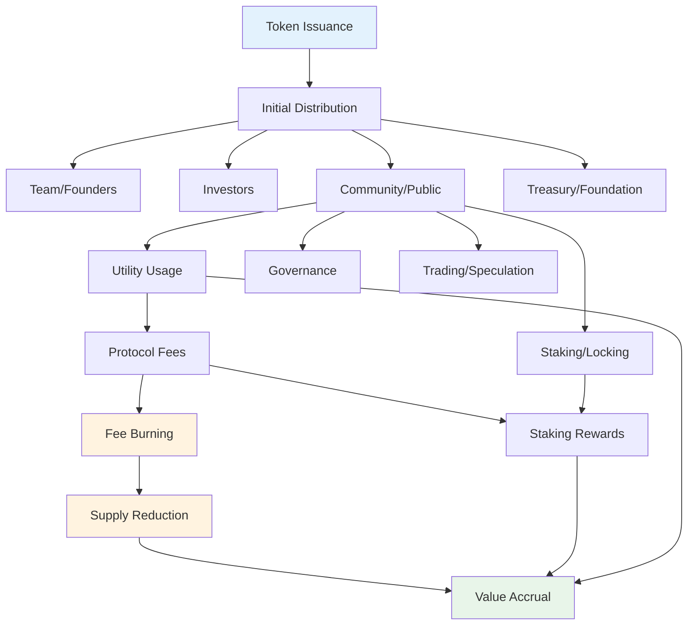

# Chapter 22: Tokenomics and Incentive Engineering

> *Last Updated: March 2026*

> **Skim This Chapter**
> - Design token economies as incentive architectures: supply mechanics, vesting, governance, and value accrual must align individual self-interest with network health
> - Output: A token design framework, 90-day sprint plan, and health metrics dashboard for building sustainable decentralized economies

> **Difficulty: Advanced** · Prerequisite Knowledge: Familiarity with blockchain basics (what tokens are, how smart contracts work) and elementary economics (supply/demand, incentives). Chapter 04 (Economic Fundamentals) provides helpful context.

> **Non-Technical Summary**
>
> Tokenomics is the art of designing economic rules for decentralized networks. Think of it as creating a small economy: you decide how much "currency" exists, who gets it, and what behaviors it rewards. Key takeaways: (1) token supply mechanics (fixed vs. elastic) determine long-term sustainability; (2) vesting schedules and distribution shape who has power and when; (3) the best token designs align incentives so that what's good for individual participants is also good for the network. If the technical details feel heavy, focus on the case studies (Uniswap, Helium, The DAO) and the Key Frameworks summary at the end.

## In This Chapter, You Will

- Learn the fundamental supply, issuance, and distribution mechanics underlying all token economies
- Evaluate trade-offs between fixed and elastic supply models, vesting schedules, and governance designs
- Apply economic security analysis to identify and defend against governance and market manipulation attacks
- Design a token prototype using the 90-day sprint framework and health metrics dashboard

## 1. Introduction: Incentives Are Architecture

Tokenomics represents far more than a marketing mechanism for fundraising or speculative investment—it constitutes a sophisticated system of rules, behaviors, and beliefs that fundamentally shapes how decentralized networks function. While traditional product designers create features and interfaces, Web3 founders must design economic systems that coordinate behavior, distribute value, and create sustainable alignment across diverse stakeholder groups.

This shift transforms founders into monetary policy designers—creating systems that function effectively across market conditions, stakeholder interests, and time horizons. Like central bankers managing national economies, token designers must balance multiple objectives: encouraging growth without creating inflation, rewarding early participants without penalizing latecomers, distributing governance appropriately while preventing capture, and creating sufficient value capture without extracting excessive fees.

> **Incentives are architecture:** Token systems create invisible structures that direct participant behavior, channel value flows, and establish relationships between ecosystem components. Like buildings, they must stand strong through various conditions—bull and bear markets, high activity and low usage, growth and maturity.

## 2. Token Design Fundamentals

### Supply Dynamics and Monetary Policy

The most fundamental tokenomic decision involves supply mechanics—determining how many tokens exist, how this quantity changes over time, and what rules govern issuance and removal. This monetary policy creates the foundation upon which all other token mechanics build.

**Fixed vs. Elastic Supply Models**

Fixed supply models implement predetermined maximum token quantities that never increase:
- Bitcoin's 21 million cap creates digital scarcity resembling precious metals
- Limited supply often appeals to investors seeking inflation protection
- Deflationary pressure emerges naturally as adoption increases relative to fixed supply
- Early participant advantage potentially creates inequitable distribution over time

Elastic supply models implement dynamic issuance responding to usage or other factors:
- Algorithmic stablecoins adjust supply to maintain price pegs
- Work-based systems issue rewards proportional to contribution
- Governance-controlled supplies adjust based on ecosystem needs
- Adaptive issuance potentially better matches token availability to actual utility demand

Many successful systems implement hybrid approaches combining elements of both models—creating bounded elasticity where supply can adjust within predefined parameters rather than remaining entirely fixed or completely unconstrained.

| Characteristic | Fixed Supply | Elastic Supply | Hybrid |
|---------------|-------------|----------------|--------|
| Example | Bitcoin (21M cap) | Algorithmic stablecoins | Ethereum (post-EIP-1559) |
| Scarcity Model | Programmatic scarcity | Demand-responsive | Bounded elasticity |
| Inflation Risk | None (deflationary) | Managed via algorithms | Burn offsets issuance |
| Early Participant Effect | Strong advantage | Moderate advantage | Balanced over time |
| Sustainability Risk | Miner/validator incentive decline | Peg failure, death spirals | Requires governance tuning |
| Best For | Store of value, digital gold | Stablecoins, payment rails | Utility platforms, DeFi |

**Issuance Schedules and Mechanisms**

Beyond total supply, issuance timing significantly impacts ecosystem development:
- Linear release distributes tokens at consistent rates regardless of external factors
- Halving events (like Bitcoin's) create predetermined supply shocks reducing issuance by half at specified intervals
- Usage-based issuance ties new token creation directly to network activity
- Milestone-triggered distributions release tokens when specific ecosystem achievements occur

The most sophisticated issuance mechanisms often include feedback loops connecting token distribution to actual network usage—creating self-regulating systems that adapt issuance based on demonstrated utility rather than arbitrary schedules.

### Inflation, Vesting, and Distribution

Beyond issuance mechanics, initial allocation and distribution schedules fundamentally shape ecosystem development—determining who receives tokens, when they become transferable, and what early power dynamics emerge.

**Initial Allocation Strategy**

Token distribution across different stakeholder groups establishes foundational ecosystem dynamics:
- Team/founder allocations provide operational runway and incentive alignment
- Investor allocations compensate risk capital enabling development
- Community allocations bootstrap initial adoption and participation
- Treasury/foundation reserves enable ongoing development and ecosystem support

The proportions allocated to each group significantly impact governance, perceived fairness, and long-term sustainability. While no universal formula exists, increasing industry consensus suggests substantial community and public allocation creates stronger foundations than distributions heavily favoring insiders.

**Vesting and Unlock Schedules**

Time-based restrictions on token transferability create both operational stability and stakeholder alignment:
- Cliff periods prevent immediate selling by requiring minimum holding duration
- Linear vesting releases tokens gradually over specified timeframes
- Milestone-based unlocking ties availability to specific achievements rather than time
- Hybrid approaches combining time and performance elements

Effective vesting balances multiple objectives: providing sufficient locked supply to prevent market flooding, creating long-term alignment through extended schedules, and maintaining liquidity for proper price discovery and network functionality.

### Governance Rights and Responsibilities

Many tokens extend beyond purely economic functions to include governance capabilities—providing holders influence over protocol parameters, treasury allocation, or other crucial decisions.

**Token Type and Function Determination**

Different token models create substantially different governance implications:
- Pure utility tokens focus exclusively on functional network access without governance rights
- Governance tokens specifically enable protocol decision participation
- Hybrid models combine functional utility with governance capabilities
- Staked governance models require locked participation for decision influence

**Participation Mechanism Design**

Governance systems offer multiple participation approaches with different implications:
- Direct voting requires engaged participation from all token holders
- Delegation enables representation through chosen agents
- Council systems establish elected representatives for decision-making
- Quadratic voting balances influence between whale and community interests

Each approach brings different tradeoffs between participation accessibility, decision quality, and capture resistance. While direct voting appears most democratic, practical experience shows most token holders lack time or expertise for direct engagement, making thoughtful delegation mechanisms increasingly important for effective governance.

## 3. Balancing Speculation and Utility

The dual nature of tokens as both functional utilities and financial instruments creates unique design challenges—requiring mechanisms that balance speculative interest against practical usage while creating sustainable value accrual aligned with ecosystem health.

### Value Accrual Mechanisms

Effective tokens establish clear connections between network usage and token value—creating systems where increased adoption directly enhances token holder value rather than requiring continuous external investment to maintain prices.

**Protocol Fee Implementations**

Many systems capture a portion of transaction value through various fee structures:
- Percentage-based models taking portion of transaction value
- Fixed-fee approaches charging standard amounts regardless of transaction size
- Tiered systems implementing different rates based on volume or user characteristics
- Hybrid models combining multiple approaches for different transaction types

The key design challenge involves balancing sufficient value capture for token holders against minimizing friction for users—creating sustainable economics without hindering adoption through excessive costs.

**Burn Mechanisms**

Token removal through burning creates potential value accrual by reducing supply:
- Transaction fee burning like Ethereum's EIP-1559 reduces supply based on usage
- Buyback-and-burn systems using protocol revenue to purchase and remove tokens
- Required burning for certain protocol actions creating functional token sinks
- Deflationary models automatically burning portion of all transactions

These approaches transform usage into supply reduction potentially benefiting all token holders proportionally rather than directing value to specific participants.

**Staking Reward Systems**

Many protocols incentivize token locking through various reward mechanisms:
- Security staking compensating validators for network maintenance
- Liquidity provision rewards encouraging trading pair depth
- Governance staking rewarding protocol stewardship participation
- Service staking qualifying providers to offer network services

### Long-Term Alignment Designs

Beyond specific mechanisms, holistic token design creates fundamentally different alignment characteristics—determining whether systems naturally encourage sustainable contribution or extractive speculation.

**Temporal Alignment Implementation**

Effective systems align incentives across different timeframes:
- Founder/team vesting extending beyond market cycles
- Value accrual mechanisms benefiting long-term rather than transient holders
- Governance systems privileging sustained participation over momentary position
- Reward structures favoring consistent contribution over opportunistic engagement

This temporal alignment prevents short-term optimization undermining long-term viability—creating systems where pursuing immediate gains naturally aligns with supporting sustainable growth rather than extracting transient value.

**Speculation Mitigation Approaches**

While speculation provides necessary liquidity and initial attention, excessive speculation often undermines sustainable development. Effective designs include:
- Utility requirements ensuring tokens serve functional rather than purely financial purposes
- Vesting mechanisms preventing immediate profit-taking
- Gradual value accrual avoiding sudden enrichment opportunities
- Education emphasizing fundamental utility over price speculation

The goal isn't eliminating speculation entirely but ensuring it remains secondary to actual utility—creating systems where price eventually reflects genuine usage value rather than merely trading momentum.

## 4. Creating Sustainable Token Economies

Beyond specific mechanisms, sustainable tokenomics requires holistic economic design—creating systems maintaining healthy function across different market conditions, usage levels, and ecosystem maturity stages.

### Equilibrium Modeling

Effective token economies maintain balance between different forces naturally pushing toward extremes—creating self-regulating systems remaining functional across varying conditions.

**Supply-Demand Balance Mechanisms**

Sustainable systems implement automatic adjustments maintaining equilibrium:
- Dynamic issuance responding to usage levels
- Elastic staking rewards adjusting to participation rates
- Variable fee structures adapting to network congestion
- Algorithmic parameter adjustment based on utilization metrics

These feedback loops create self-healing systems—automatically adjusting to changing conditions rather than requiring constant manual intervention as circumstances evolve.

**Growth-Stability Balancing**

Effective economies navigate the tension between expansion and consolidation:
- Growth incentives attracting new participants during expansion phases
- Stability mechanisms preserving core functionality during contractions
- Volatility dampening preventing excessive price fluctuation
- Reserve management ensuring operational continuity regardless of market conditions

### Token Sink Mechanisms

Sustainable tokenomics requires not only issuance but also removal mechanisms—creating balanced systems where tokens continuously flow rather than accumulating indefinitely or constantly inflating.

**Functional Token Consumption**

Many systems implement utility-driven removal mechanisms:
- Service payment requiring tokens for protocol functionality
- Access rights consuming tokens for participation privileges
- Storage fees utilizing tokens to compensate resource provision
- Membership qualification requiring tokens for ecosystem participation

These functional sinks create genuine utility demand—requiring tokens for practical purposes rather than merely financial speculation, thereby creating sustainable usage-based value.

**Automatic Burning Implementations**

Beyond utility consumption, systematic burning mechanisms reduce supply:
- Transaction fee burning removing portion of network activity value from circulation
- Regular burn schedules implementing predetermined supply reduction
- Treasury-managed burning using protocol revenues for supply management
- Deflationary monetary policy automatically reducing supply over time

## 5. Governance Through Tokenomics

Beyond direct economics, token systems increasingly implement governance mechanisms—creating decision-making processes determined by token distribution, staking patterns, or other economic activities.

### Voting Weight Systems

The method for determining decision influence fundamentally shapes governance outcomes—creating systems ranging from pure plutocracy to more nuanced influence distribution.

**Influence Determination Methods**

Different voting models create substantially different power dynamics:
- Token-weighted voting where influence directly corresponds to holdings
- Quadratic voting reducing whale dominance through square-root weighting
- Conviction voting measuring commitment duration alongside position size
- Reputation-weighted systems considering historical participation beyond current holdings

Each approach brings different tradeoffs between simplicity, capture resistance, and participation incentives.

**Anti-Capture Mechanisms**

Effective governance implements protections against various attack vectors:
- Minimum quorum requirements preventing low-participation takeovers
- Maximum influence caps limiting individual power regardless of holdings
- Time-delayed execution allowing community response to concerning proposals
- Multi-phase approval requiring sustained support rather than momentary control

### Proposal Mechanics

Beyond voting itself, the processes surrounding governance proposals significantly impact outcomes—determining what reaches consideration, how discussion occurs, and how implementation proceeds after approval.

**Proposal Lifecycle Management**

Effective governance implements structured processes for consideration progression:
- Submission requirements establishing minimum standards for formal consideration
- Discussion phases enabling community feedback before voting
- Voting periods providing sufficient time for participation while maintaining momentum
- Implementation procedures ensuring approved changes execute correctly

**Improvement Process Standardization**

Many successful protocols implement formal improvement frameworks:
- Standardized formats ensuring comprehensive proposal information
- Classification systems distinguishing different proposal types
- Numbered tracking enabling clear reference and status monitoring
- Historical archives maintaining complete governance records

These standardized approaches, exemplified by Ethereum Improvement Proposals (EIPs) or similar systems in other protocols, create clarity and accountability throughout the governance process.

## 6. Lessons from Token Ecosystem Success and Failure

Beyond theoretical models, observing actual token system performance provides crucial insights—revealing which approaches succeed in practice rather than merely appearing promising in theory.

### Helium's Evolution

The Helium Network demonstrates both the potential and challenges of using tokens to bootstrap physical infrastructure—initially creating remarkable growth in decentralized wireless coverage before facing significant economic and technical challenges.

**Initial Success Factors**

Helium's early growth demonstrated effective incentive design:
- Hardware-based mining created tangible connection between physical deployment and rewards
- Geographic-based rewards encouraged strategic coverage expansion
- Proof-of-coverage verification ensured honest participation
- Token rewards provided sufficient incentive despite limited initial utility

This incentive structure successfully bootstrapped substantial physical infrastructure—creating decentralized wireless network that would have required enormous capital investment through traditional approaches.

**Emerging Challenges**

As the network scaled, several design limitations emerged:
- Verification manipulation enabled rewards without genuine coverage
- Reward concentration in dense areas created economic misalignment with coverage goals
- Token value decoupled from actual network usage creating unsustainable economics
- Layer 1 blockchain limitations necessitated migration to Solana

The key lesson from Helium involves recognizing tokenomics as evolutionary rather than static—requiring continuous adjustment as networks grow and usage patterns emerge rather than remaining fixed from initial design.

### Ethereum's Sustainability

Ethereum's token evolution demonstrates how initially simple designs can successfully adapt to changing requirements—creating sustainable economics through deliberate, community-driven adjustments rather than remaining static.

**Proof-of-Work to Proof-of-Stake Transition**

Ethereum's consensus transition showed successful fundamental change:
- Long-term technical planning establishing clear migration path
- Community alignment building broad consensus despite significant changes
- Economic adjustment balancing validator incentives against inflation
- Security maintenance throughout transition process

**EIP-1559 Fee Mechanism**

Ethereum's fee market redesign created novel value accrual:
- Base fee burning creating direct connection between network usage and ETH scarcity
- Fee predictability improving user experience through standardization
- Priority tips maintaining validator incentives alongside burning
- Adaptive pricing automatically adjusting to demand conditions

This mechanism implementation demonstrated how tokenomic improvements can simultaneously enhance user experience, strengthen value accrual, and improve technical operation.

## 7. Economic Security in Decentralized Systems

Beyond general tokenomics, security-focused design requires specialized consideration—creating systems resilient against various economic attacks beyond purely technical exploits.

### Attack Vector Analysis

Effective security begins with comprehensive threat modeling—identifying how economic incentives might enable attacks beyond traditional security considerations.

**Governance Attack Surfaces**

Token-based governance creates potential vulnerabilities:
- Vote buying enabling temporary control through borrowing or incentives
- Flash loan attacks aggregating temporary voting power
- Long-range attacks where historical tokens gain unexpected influence
- Apathy exploitation where low participation enables minority control

**Market Manipulation Vectors**

Price-dependent systems create additional vulnerabilities:
- Oracle manipulation affecting systems relying on external price data
- Liquidity attacks creating artificial price movements
- Sandwich attacks extracting value through transaction ordering
- Arbitrage exploitation taking advantage of temporary imbalances

### Economic Defense Mechanisms

Beyond identifying vulnerabilities, tokenomic design implements specific protections—creating systems where attacking proves economically irrational rather than merely technically difficult.

**Slashing and Penalty Systems**

Many protocols implement economic consequences for malicious behavior:
- Stake slashing removing validator assets for protocol violations
- Reputation damage affecting future participation opportunities
- Timeout penalties temporarily removing participation rights
- Progressive sanctions increasing severity for repeated violations

These penalty mechanisms transform attack economics—making malicious behavior costly enough to deter rational attackers even when technical exploitation remains possible.

**Timelock and Cooldown Periods**

Temporal restrictions prevent various timing-based attacks:
- Withdrawal delays preventing sudden liquidity removal
- Voting lockups ensuring governance participants maintain exposure
- Proposal delays allowing community response to problematic submissions
- Action timelocks preventing rapid exploit execution

## 8. How to Prototype and Iterate Token Economies

Effective token design requires systematic development rather than mere inspiration—creating methodologies for testing, refining, and improving economic systems before and during deployment.

### Simulation Frameworks

Before deployment, simulation provides crucial validation—testing dynamic behaviors that might not be apparent through static analysis alone.

**Model Development Approaches**

Effective simulation begins with appropriate model creation:
- Agent-based modeling simulating individual participant behaviors
- System dynamics modeling capturing feedback relationships
- Monte Carlo simulation exploring probabilistic outcomes
- Game theory analysis examining strategic participant interactions

These modeling approaches reveal different insights—from emergent behaviors arising from individual actions to systematic relationships between different tokenomic elements.

**Scenario Testing Implementation**

Comprehensive simulation examines system behavior across various conditions:
- Bull market scenarios testing behavior during positive sentiment
- Bear market conditions examining resilience during downturns
- Black swan events testing extreme circumstance responses
- Mixed participation scenarios with varying stakeholder behaviors

### Progressive Implementation

Beyond simulation, actual deployment requires careful staging—creating appropriate evolution from initial implementation to mature system rather than attempting complete deployment immediately.

**Simplicity-First Approach**

Effective token launches begin with straightforward designs:
- Core functionality establishment before complex mechanics
- Fundamental economic relationships before sophisticated incentives
- Essential governance before elaborate participation systems
- Basic value accrual before multi-dimensional capture mechanisms

This simplified initial implementation creates foundation for learning—enabling experience-based refinement rather than attempting to perfect complex systems before gathering actual usage data.

**Observation and Analysis Systems**

Continuous improvement requires effective monitoring:
- Metric development tracking key performance indicators
- Behavior analysis examining actual versus expected participation
- Feedback collection gathering participant experience
- Comparative evaluation against similar systems

## 9. Key Takeaways: Designing Effective Incentive Systems

### Design for Use, Not Hype

Sustainable token systems prioritize genuine utility over speculative narrative—creating value through actual functionality rather than merely compelling storytelling driving initial interest.

The most enduring tokens solve specific problems or enable particular capabilities—generating demand through genuine utility rather than primarily investment speculation. This utility focus creates sustainable economics where token value ultimately reflects actual usage rather than merely trading momentum.

### Align Across Time

Effective token systems create alignment across different timeframes—ensuring participants benefiting in the short term also contribute to long-term success rather than extracting temporary value at the expense of sustainability.

This temporal alignment prevents common scenarios where early participants extract value leaving later participants holding devalued assets or where founders and investors receive disproportionate benefits compared to actual builders and users.

### Your Token Is a Social Contract

Beyond technical implementation, tokens represent implicit agreements between different stakeholders—creating expectations about participation, value distribution, and decision-making that constitute unwritten but essential social contracts.

These social dimensions often prove more consequential than technical mechanics—determining whether communities develop trust and commitment or merely transactional relationships based on temporary alignment.

### Governance Is Economics

Token-based governance represents not merely decision-making process but fundamental economic activity—allocating resources, determining value flows, and establishing power relationships with significant financial implications beyond administrative functions.

This economic dimension means governance design directly shapes token value—creating systems where decision structures and processes significantly impact investment potential beyond merely facilitating community participation.

### Sustainable Systems Require Iteration

No token design achieves perfection initially—requiring continuous refinement based on actual usage patterns, market conditions, and emerging challenges rather than assuming initial implementation will remain optimal indefinitely.

This evolutionary necessity means designing for adaptation rather than permanence—creating systems capable of improvement without disruption rather than requiring either suboptimal rigidity or complete reimplementation.

---

## Chapter Synthesis

Through these principles, founders can design token systems that genuinely align incentives across diverse stakeholder groups while creating sustainable value beyond initial enthusiasm. By focusing on utility, alignment, trust, governance, and evolution rather than merely technical mechanisms or short-term price action, tokenomic design creates systems that transform coordination possibilities—enabling new models of collaboration, value creation, and governance beyond what traditional organizational structures could achieve.

The journey from understanding tokenomics as fundraising mechanism to recognizing it as fundamental economic architecture represents a crucial evolution in Web3 founder thinking. Those who master this transition—designing economies rather than merely issuing tokens—will build the protocols and platforms that define the next generation of decentralized systems.

---

## Practical Implementation Framework

### 90-Day Token Design Sprint

**Weeks 1-2: Economic Foundation**
- Define core utility and value proposition
- Map stakeholder groups and their interests
- Establish initial supply parameters
- Design basic issuance mechanics

**Weeks 3-4: Incentive Architecture**
- Develop reward structures for desired behaviors
- Create penalty mechanisms for unwanted actions
- Design value accrual mechanisms
- Balance speculation and utility incentives

**Weeks 5-6: Governance Framework**
- Determine voting mechanisms and weights
- Establish proposal processes
- Design anti-capture protections
- Create improvement frameworks

**Weeks 7-8: Security Analysis**
- Model potential attack vectors
- Simulate economic exploits
- Design defense mechanisms
- Establish monitoring systems

**Weeks 9-10: Simulation and Testing**
- Build economic models
- Run scenario simulations
- Analyze edge cases
- Refine based on findings

**Weeks 11-12: Documentation and Launch Prep**
- Create comprehensive tokenomics documentation
- Develop community education materials
- Establish monitoring infrastructure
- Prepare phased rollout plan

### Token Health Metrics Dashboard

**Economic Indicators:**
- Velocity (transaction volume / circulating supply)
- Concentration (Gini coefficient of holdings)
- Liquidity depth across exchanges
- Price correlation with usage metrics

**Participation Metrics:**
- Active address growth rate
- Staking participation percentage
- Governance participation rates
- Developer ecosystem activity

**Security Indicators:**
- Cost of 51% attack
- Validator/node distribution
- Time-weighted average stake duration
- Flash loan attack profitability

**Sustainability Metrics:**
- Revenue/emission ratio
- Treasury runway at current burn
- User acquisition cost trends
- Protocol fee sustainability

### Case Study: Gitcoin's Quadratic Funding — Incentive Engineering for Public Goods

Gitcoin represents one of the most ambitious experiments in applied tokenomics: using mechanism design to solve the free-rider problem in public goods funding. Founded by Kevin Owocki in 2017, Gitcoin evolved from a simple bounty platform for open source contributions into a protocol-level experiment in incentive engineering, distributing over $60 million to open source projects through its Grants program (as of Q4 2024).

The core innovation is quadratic funding (QF), a mechanism designed by Vitalik Buterin, Zoe Hitzig, and Glen Weyl. In a standard funding model, a project that receives one donation of $10,000 is treated identically to one that receives 1,000 donations of $10. Quadratic funding inverts this: the matching formula weights the number of unique contributors more heavily than the amount each contributes. A project with broad community support — many small donations — receives proportionally more matching funds than one with a single wealthy backer. This directly addresses the plutocratic capture problem that plagues most token-weighted governance systems.

Gitcoin's GTC token serves as the governance layer for this system. GTC holders vote on round parameters, matching pool allocations, and protocol upgrades. The token does not accrue value through fee extraction — it accrues influence through stewardship. This design choice reflects the chapter's principle that governance is economics: the power to allocate matching funds is itself the primary economic function, and the token's value derives from the legitimacy and effectiveness of the allocation process rather than speculative trading dynamics.

The system has faced real challenges that illustrate the iterative nature of tokenomics. Sybil attacks — where single actors create multiple identities to game the quadratic formula — forced Gitcoin to develop Passport, a decentralized identity verification system. Collusion between grant applicants and voters required anti-collusion mechanisms including Minimal Anti-Collusion Infrastructure (MACI). Each attack vector revealed a gap in the incentive design that required systematic response, demonstrating the chapter's insight that sustainable systems require iteration.

Gitcoin's evolution from centralized platform to decentralized protocol (Allo Protocol) shows how incentive engineering matures. The early rounds were managed centrally, with Gitcoin controlling matching pools and eligibility. As the mechanism proved effective, governance progressively decentralized — first to GTC holders, then to independent round operators running their own instances. This progressive decentralization mirrors the chapter's recommended approach: simplicity first, with governance complexity introduced as the system demonstrates stability.

The broader lesson is that tokenomics can do more than coordinate speculation — it can fund the commons. Gitcoin's quadratic funding model demonstrates that well-designed incentive systems can align individual self-interest with collective benefit, creating sustainable public goods funding without relying on altruism alone.

---

**Key Frameworks Introduced:**
- Token Supply Design Matrix
- Incentive Alignment Framework
- Governance Attack Surface Model
- Economic Security Analysis
- Progressive Implementation Methodology

## Founder's Checklist

- [ ] Have we defined our token's core utility beyond speculative value?
- [ ] Does our vesting schedule align team and investor incentives with long-term network health?
- [ ] Have we modeled at least three economic scenarios (bull, bear, black swan) for our token economy?
- [ ] Do we have anti-capture mechanisms in our governance design (quorum, caps, timelocks)?
- [ ] Have we identified and designed token sinks to prevent unbounded supply inflation?

## Exercises

1. **Token Supply Analysis**: Choose three existing token economies (one fixed supply, one elastic, one hybrid). Map their issuance schedules, burn mechanisms, and value accrual patterns. Identify which design decisions contributed most to their sustainability or failure.

2. **Governance Attack Simulation**: Model a governance attack on your proposed token system. Calculate the cost of acquiring enough tokens for a 51% vote, identify flash loan attack vectors, and design three specific anti-capture mechanisms to defend against them.

3. **Incentive Alignment Audit**: Map all stakeholder groups in your ecosystem (founders, investors, users, validators, developers). For each pair of groups, identify where incentives align and where they conflict. Design one mechanism change that resolves the most significant misalignment.

## Related Case Studies

For practical examples of the concepts in this chapter, see the [Case Studies Compendium](../case-studies/compendium.md):

- **Uniswap** — AMM design with immutable contracts demonstrating how protocol-level incentive engineering creates sustainable liquidity through transparent, automated mechanisms
- **Helium Network** — Token incentives for real-world infrastructure illustrating work proofs, token sinks, and fraud resistance in a physical deployment context
- **Gitcoin (Positive DAO Example)** — Quadratic funding mechanisms showing how tokenomics can align individual self-interest with public goods funding at scale
- **IPFS / Filecoin** — Content-addressed storage with incentive-aligned persistence, demonstrating sustainable token sinks and protocol-level economic design
- **The DAO Hack (Cautionary Tale)** — Early governance and security failures revealing how incentive misalignment and smart contract vulnerabilities can destroy token-based systems
- **Hivemapper** — DePIN model demonstrating how token incentives coordinate physical-world data collection at global scale through carefully designed reward mechanisms

## Further Reading

- **Token Economy: How the Web3 Reinvents the Internet** by Shermin Voshmgir — A comprehensive overview of token design patterns, governance mechanisms, and the economic theory underpinning Web3 incentive systems.
- **Mechanism Design: A Linear Programming Approach** by Rakesh V. Vohra — Rigorous introduction to mechanism design theory, providing the mathematical foundations for designing incentive-compatible systems.
- **Governing the Commons** by Elinor Ostrom — Nobel Prize-winning research on how communities self-govern shared resources, directly applicable to token-based governance and common pool resource management.
- **Radical Markets: Uprooting Capitalism and Democracy for a Just Society** by Eric A. Posner and E. Glen Weyl — Proposes novel market mechanisms including quadratic voting and Harberger taxes that have influenced modern token governance design.

## Sources

1. Voshmgir, S. (2020). *Token Economy: How the Web3 Reinvents the Internet* (2nd ed.). Token Kitchen.
2. Vohra, R.V. (2011). *Mechanism Design: A Linear Programming Approach*. Cambridge University Press.
3. Ostrom, E. (1990). *Governing the Commons: The Evolution of Institutions for Collective Action*. Cambridge University Press.
4. Posner, E.A. & Weyl, E.G. (2018). *Radical Markets: Uprooting Capitalism and Democracy for a Just Society*. Princeton University Press.
5. Buterin, V. (2014). "A Next-Generation Smart Contract and Decentralized Application Platform." *Ethereum White Paper*.
6. Nakamoto, S. (2008). "Bitcoin: A Peer-to-Peer Electronic Cash System." Bitcoin.org.
7. Catalini, C. & Gans, J.S. (2020). "Some Simple Economics of the Blockchain." *Communications of the ACM*, 63(7), 80-90.
8. Cong, L.W., Li, Y. & Wang, N. (2021). "Tokenomics: Dynamic Adoption and Valuation." *Review of Financial Studies*, 34(3), 1105-1155.
9. Lalley, S.P. & Weyl, E.G. (2018). "Quadratic Voting: How Mechanism Design Can Radicalize Democracy." *AEA Papers and Proceedings*, 108, 33-37.
10. Daian, P. et al. (2020). "Flash Boys 2.0: Frontrunning, Transaction Reordering, and Consensus Instability in Decentralized Exchanges." *IEEE Symposium on Security and Privacy*, 910-927.
- **"Blockchain Token Economics: A Mean-Field-Type Game Perspective"** by Boualem Djehiche, Alain Tcheukam, and Hamidou Tembine (IEEE Access, 2020) — Academic treatment of token economics using game-theoretic modeling relevant to incentive engineering.

---

**Previously:** [Chapter 21: User Experience](ch21-user-experience.md) — Explored the psychological drivers behind technology adoption and how to design products that align with user identity, emotion, and social context.

**Next:** [Chapter 23: Web3 Architecture and Security](ch23-web3-architecture-security.md) — Breaks down blockchain architectural choices from consensus mechanisms to data models, showing how each decision shapes security, performance, and community.
