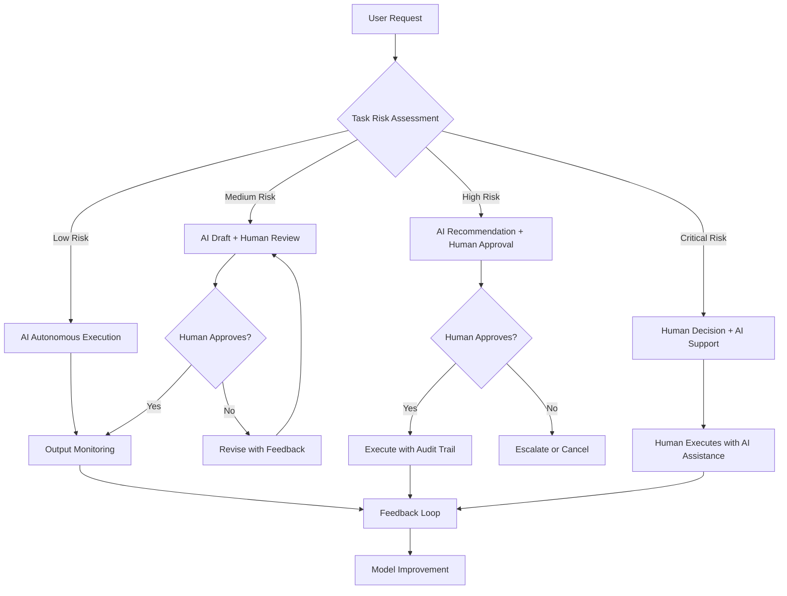

# Chapter 32: AI System Design

> *Last Updated: March 2026*

> **Skim This Chapter**
> - AI products require designing systems of intelligence, not just adding ML to software -- choosing appropriate autonomy levels, building feedback loops, and treating safety as architecture
> - Output: An autonomy matrix for your product, evaluation frameworks for pre-deploy and production, and a cost-optimization strategy for sustainable AI economics

> **Difficulty: Advanced** · Prerequisite Knowledge: Familiarity with machine learning concepts (models, training, inference), API design, and software system architecture. Some exposure to LLMs or generative AI products is helpful but not required.

> **Non-Technical Summary**
>
> AI products are not just software with machine learning bolted on — they are living systems that learn, adapt, and evolve. This chapter covers how to design them well. Key takeaways: (1) choose the right level of autonomy for each task (some things should be automated, others only assisted); (2) build feedback loops so your system gets smarter over time; (3) safety guardrails, evaluation pipelines, and fallback behaviors are architectural decisions, not afterthoughts. Focus on the Autonomy Spectrum framework and the Founder's Checklist if the technical details feel dense.

## 1. Introduction: From Tools to Systems of Intelligence

When GitHub launched Copilot in 2022, it looked like a clever autocomplete for code. By 2025, Copilot and its competitors had fundamentally changed how software is written---developers who used AI assistants completed tasks 55% faster, and 85% of professional developers had adopted AI tools. What appeared to be a feature turned out to be a paradigm shift.

The same transformation is happening across every product category. Founders are no longer building static tools with predefined pathways. They are creating systems of intelligence---cognitive ecosystems that process information, learn from interaction, and adapt their behavior based on context and feedback. Traditional software performs specific tasks according to explicit programming. AI systems improve through use, adapt to changing conditions, and develop capabilities their creators never explicitly programmed.

For founders, this demands a fundamental mindset shift: from building features to orchestrating intelligence. The most successful AI products are not tools with machine learning bolted on. They are integrated systems where intelligence forms the core architecture.

## 2. From Tools to Agents: New Possibilities in Product Design

## In This Chapter, You Will

- Select autonomy levels appropriate to risk and value
- Architect data, retrieval, and feedback for compounding quality
- Bake in safety: guardrails, evaluation, and fallback behavior
- Ship evals and telemetry to drive ongoing improvements

## Founder’s Checklist

- What tasks are safe to automate vs. assist only?
- Do we log inputs/outputs with redaction for privacy and audits?
- What are our offline and online eval suites and thresholds?
- How do we communicate limitations and provide recourse?

## Exercises

- Define an autonomy matrix for 5 core user tasks
- Add a feedback loop: capture, triage, and fine‑tune on hard cases
- Implement one red‑team scenario and document mitigations

## Related Case Studies

- Weights & Biases: ../case-studies/ai-infrastructure-case-studies.md#weights--biases-mlops-and-experiment-tracking
- Humanloop: ../case-studies/ai-infrastructure-case-studies.md#humanloop-llm-application-development-platform
- Replicate: ../case-studies/ai-infrastructure-case-studies.md#replicate-ai-model-marketplace-and-hosting
- Cursor (Anysphere): ../case-studies/ai-infrastructure-case-studies.md#anysphere-cursor-redefining-development-tools
- OpenAI: ../case-studies/compendium.md#openai
- Anthropic: ../case-studies/compendium.md#anthropic
- Hugging Face: ../case-studies/compendium.md#hugging-face

### The Autonomy Spectrum

AI products exist along a spectrum of autonomy—from minimally assistive tools requiring constant human direction to fully autonomous agents operating independently with minimal oversight.

At the lower end of this spectrum, we find augmentative tools:
- Predictive interfaces that suggest next actions or inputs
- Assistive systems that enhance human capabilities while remaining under direct control
- Co-creative tools that collaborate with humans while following explicit direction

The middle range includes semi-autonomous systems:
- Delegated workflows handling defined tasks with human oversight
- Supervised agents executing complex processes with approval gates
- Intelligent assistants making recommendations while deferring decisions

At the far end, we approach fully autonomous agents:
- Task-specific agents completing defined objectives independently
- Self-improving systems that evolve their capabilities through experience
- Multi-agent architectures coordinating different specialized intelligences

The appropriate position on this spectrum depends on numerous factors including risk tolerance, domain complexity, regulatory requirements, and user expectations. The key design challenge involves determining not merely what level of autonomy is technically possible but what level is appropriate.

### User Control Interfaces

The interface between human and AI significantly shapes interaction quality, trust development, and ultimate adoption. Key interface paradigms include:

**Prompt-Based Control**
Direct natural language instruction represents the simplest interface model, where users explicitly tell the system what to do through conversational interaction.

**Form-Based Parameter Control**
Structured interfaces with explicit controls for different parameters provide more guided interaction, allowing users to adjust specific aspects of AI behavior through familiar input mechanisms.

**Flow-Based Process Control**
Visual workflow interfaces enable users to design multi-step processes combining AI capabilities with conditional logic, human approval gates, and integration with other systems.

**Outcome-Based Direction**
Advanced interfaces focused on desired results rather than specific processes allow users to define what they want accomplished while leaving implementation details to the system.

## 3. Evaluation Frameworks (Offline + Online)

Offline Eval Suite (pre-deploy)
- Gold set: 200–1,000 labeled examples representative of production tasks
- Metrics: task-appropriate (e.g., Rouge/BLEU exact-match; rubric-based scoring; hallucination rate)
- Benchmarks: track by model, prompt, and retrieval settings; store in repo; run in CI

Example rubric (summarization):
```
Score 1–5 across: factuality, completeness, clarity, style adherence; require avg ≥4.0
Block release if any category <3.5
```

Online Eval Suite (post-deploy)
- Shadow labeling: sample 1–5% of prod interactions for human review
- Guardrail metrics: jailbreak rate, PII leakage rate, toxicity flags
- Business metrics: TTV, task success rate, p95 latency, cost per task
- Release gates: traffic ramps (1%→5%→25%→100%) when guardrails within thresholds

## 4. Data Governance Patterns

Redaction & Logging
- Redact PII at edge; hash or tokenize stable identifiers
- Store inputs/outputs with trace IDs; keep raw sensitive payloads out of logs
- Separate audit logs for privileged actions; immutable storage for 90–365 days

Access Controls
- Principle of least privilege; short-lived credentials; dual control for key changes
- Data classification policy (public/internal/restricted/secret) with retention rules

Feedback Loops
- Capture explicit user feedback; triage hard cases; add to gold set with labels
- Avoid training on sensitive or user-owned data without explicit consent

## 5. Safe Autonomy Matrix

Template:
```
Task | Autonomy | Risk | Guardrails | Human-in-Loop | Fallback
---- | -------- | ---- | ---------- | ------------- | --------
Draft email | Assist  | Low  | length/tone limits | optional review | return to template
Prod deploy | Approve | High | tests + policy gates | required       | block + alert
On-chain tx | Approve | High | dry-run + limits     | required       | cancel
```

Adopt stricter autonomy for high-impact, low-reversibility tasks. Encode guardrails in code and policy; test with red-team scenarios.

| Task Category | Autonomy Level | Risk | Guardrails | Human-in-Loop | Fallback |
|---|---|---|---|---|---|
| Content drafting (email, docs) | Assist | Low | Length/tone limits | Optional review | Return to template |
| Data analysis and reporting | Assist | Low | Output validation | Optional review | Surface raw data |
| Code generation and review | Co-pilot | Medium | Tests + linting gates | Review before merge | Flag for manual coding |
| Production deployment | Approve | High | Tests + policy gates | Required | Block + alert |
| On-chain transaction | Approve | High | Dry-run + value limits | Required | Cancel + notify |
| Medical/legal recommendation | Supervise | Critical | Domain-specific validators | Mandatory sign-off | Defer to professional |



The most effective interfaces often combine elements from multiple paradigms, balancing accessibility with flexibility.

### Task Allocation Frameworks

Determining which functions should be handled by humans versus AI represents a critical design decision significantly impacting system effectiveness, user experience, and risk management.

**Comparative Advantage Assessment**
- AI excels at pattern recognition, large-scale data processing, statistical analysis, and consistent rule application
- Humans maintain advantages in contextual understanding, ethical judgment, creative leaps, and handling novel situations

**Consequence Magnitude Evaluation**
- High-consequence decisions (medical diagnosis, financial transactions, legal judgments) typically require human involvement
- Lower-stakes areas (content suggestions, data categorization, routine communications) may support greater autonomy

**Hybrid Allocation Strategies**
- AI preparation with human approval for consequential actions
- Human initiation with AI execution for defined processes
- Parallel processing with comparative evaluation of human and AI outputs
- Progressive automation as system demonstrates reliability in specific domains

The most effective task allocation evolves over time—starting with higher human involvement during initial deployment and gradually increasing autonomy as the system demonstrates reliability in specific contexts.

## 3. Technical Architecture for AI-Native Applications

### Model Selection Strategy

The foundation of any AI system involves selecting appropriate models—a decision with profound implications for capabilities, costs, control, and competitive positioning.

**Open Source vs. API Models**
Evaluating tradeoffs between self-hosted open models and cloud API services:

*Open-Source Models (Mistral, LLaMA, Stable Diffusion)*
- Advantages: Full control over infrastructure, data privacy, customization flexibility, no per-token costs
- Challenges: Deployment complexity, infrastructure management, potentially higher fixed costs, responsibility for tuning

*API Services (OpenAI, Anthropic, Stability)*
- Advantages: Immediate access to state-of-the-art capabilities, simplified integration, managed scaling, predictable pricing
- Challenges: Data exposure concerns, vendor dependency, limited customization, vulnerability to pricing or policy changes

**Capability vs. Efficiency Tradeoffs**
- Larger models typically offer greater capabilities but with higher latency and cost
- Specialized models often outperform general models in specific domains despite smaller size
- Quantized or distilled variants provide efficiency at potential quality tradeoffs

**Model Diversity Strategy**
- Primary models handling core functionality with maximum capability
- Efficiency models for high-volume, latency-sensitive operations
- Specialized models for domain-specific tasks requiring particular expertise
- Fallback models ensuring reliability during service disruptions

The most sophisticated model strategies implement tiered approaches—using different models for different functions based on capability requirements, cost sensitivity, and strategic importance.

### Data Pipeline Design

Beyond model selection, the data infrastructure surrounding AI systems critically determines both immediate performance and long-term competitive advantage.

**Collection Infrastructure**
- User interaction capture providing context and history
- Structured data integration from internal and external sources
- Feedback mechanisms collecting explicit and implicit quality signals
- Exception tracking identifying failure modes and edge cases

**Preprocessing and Transformation**
- Cleaning procedures removing noise and inconsistencies
- Normalization creating standardized representation
- Anonymization protecting sensitive information when appropriate
- Augmentation enhancing data with additional context or metadata

**Embedding and Vectorization**
- Vector database implementation for efficient retrieval
- Embedding strategy selection appropriate to content type and use case
- Chunking approaches balancing specificity against context preservation
- Metadata enhancement enabling filtering and categorization

The most valuable data pipelines implement closed-loop architectures where system outputs generate new training data—creating virtuous cycles where usage automatically improves performance.

### Inference Optimization

Beyond model and data considerations, how systems actually generate AI outputs significantly impacts performance, costs, and user experience.

**Caching and Reuse Strategies**
- Content-based caching storing results for identical inputs
- Semantic caching identifying functionally equivalent requests
- Partial computation reuse for common operation sequences
- Progressive generation implementing save points for iterative processes

**Batching and Scheduling Approaches**
- Request aggregation combining similar operations
- Priority queuing ensuring critical operations receive appropriate resources
- Asynchronous processing decoupling request submission from result delivery
- Load balancing distributing work across available resources

**Model Optimization Techniques**
- Quantization reducing precision requirements without significant quality loss
- Pruning removing unnecessary parameters for specific applications
- Distillation creating smaller models capturing essential capabilities
- Speculative execution predicting likely paths for accelerated response

For early-stage products, focusing on cost management through efficient implementation often proves more immediately valuable than pursuing maximum performance.

## 4. Leveraging Large Language Models Beyond Chatbots

### Domain-Specific Applications

While general-purpose chatbots represent the most visible LLM applications, the most valuable implementations often involve specialized applications addressing specific domain challenges.

**Legal Intelligence Systems**
- Contract analysis identifying risks, obligations, and unusual terms
- Case research finding relevant precedents and statutory references
- Document generation creating standardized agreements from specifications
- Compliance verification checking adherence to regulatory requirements

**Creative Production Assistants**
- Writing collaboration providing suggestions, alternatives, and extensions
- Design ideation generating concepts based on stylistic parameters
- Content adaptation transforming materials for different formats or audiences
- Reference exploration finding inspirational or contextual materials

**Scientific Research Augmentation**
- Literature synthesis identifying patterns across research papers
- Hypothesis generation suggesting potential explanations for observations
- Experimental design optimization proposing efficient testing approaches
- Result interpretation contextualizing findings within broader knowledge

These domain-specific implementations typically require specialized adaptation approaches:

**Fine-Tuning Strategy**
- Domain corpus selection gathering representative materials
- Quality filtering ensuring training material accuracy
- Evaluation framework development measuring relevant metrics
- Continued adaptation maintaining alignment with evolving needs

**Prompt Engineering Approach**
- Framework development creating consistent interaction patterns
- Context design providing necessary domain background
- Instruction optimization balancing specificity with flexibility
- Template creation for common domain-specific tasks

**Retrieval Augmentation Implementation**
- Knowledge base development organizing specialized information
- Chunking strategy optimizing information retrieval granularity
- Query formulation translating needs into effective retrievals
- Response synthesis combining retrieved information with model capabilities

The most effective domain applications typically combine these approaches—using retrieval for factual accuracy, prompting for interaction structure, and potential fine-tuning for consistent domain-specific behavior.

### Multimodal Integration

While text-based interaction dominated early AI applications, the integration of multiple modalities—combining language with images, audio, video, and spatial information—enables richer interaction models addressing more complex use cases.

**Visual-Language Integration**
- Image analysis with textual explanation generating detailed descriptions
- Visual question answering responding to queries about image content
- Text-to-image generation creating visuals from textual specifications
- Document understanding extracting structured information from visual formats

**Audio-Language Processing**
- Speech transcription converting spoken language to text
- Voice synthesis generating natural speech from written content
- Audio content analysis identifying sounds, music, or environmental context
- Emotion recognition detecting affective states from vocal patterns

**Video Understanding**
- Action recognition identifying significant events in footage
- Video summarization creating textual descriptions of content
- Scene segmentation dividing content into meaningful units
- Temporal relationship analysis understanding sequences and causality

**Spatial Computing Integration**
- 3D scene interpretation extracting structure from spatial data
- Object relationship analysis understanding physical positioning
- Spatial instruction processing translating directions into 3D context
- Augmented reality enhancement providing contextual information overlay

The Luma Labs case exemplifies this frontier—building systems generating three-dimensional assets from natural language descriptions, enabling creators to produce complex spatial content without traditional modeling expertise.

### System of Systems Design

Beyond individual AI capabilities, the composition of multiple specialized components into coordinated workflows creates possibilities exceeding what any single system could achieve.

**Agent Collaboration Architectures**
- Role-based specialization assigning different functions to appropriate agents
- Communication protocol development enabling effective information exchange
- Conflict resolution mechanisms handling disagreement or uncertainty
- Collective intelligence emergence creating capabilities beyond individual components

**Workflow Orchestration Frameworks**
- Sequential processing chaining operations in appropriate order
- Parallel execution leveraging multiple systems simultaneously
- Conditional branching implementing decision-based pathways
- Error handling with graceful degradation or fallback options

**Self-Improving System Design**
- Performance monitoring identifying improvement opportunities
- Automated experimentation testing potential enhancements
- Feedback integration updating behavior based on results
- Knowledge distillation transferring capabilities between components

**Human-AI Collaboration Integration**
- Appropriate task allocation based on comparative advantage
- Smooth handoff design enabling context preservation
- Explanation generation creating understanding of system reasoning
- Trust development through consistent, transparent operation

The most advanced implementations create emergent capabilities—where the composed system demonstrates intelligence beyond what any component could provide individually.

## 5. The Economics of AI Computing and Cost Optimization

### Inference Cost Management

Unlike traditional software where marginal costs approach zero after development, AI systems involve ongoing compute expenses for each user interaction.

**Per-Interaction Cost Analysis**
- Token-level pricing evaluation for language models
- Computation time tracking for owned infrastructure
- Storage requirements for embedded representations
- Bandwidth utilization for data transmission

**Strategic Tiering Implementation**
- Premium experience provision for high-value interactions
- Efficiency optimization for routine or high-volume operations
- Latency-cost balancing appropriate to context importance
- User-specific customization based on individual requirements

**Caching Strategy Development**
- Frequently-requested information persistence
- Personalization parameter storage reducing recalculation
- Intermediate result maintenance for common operation sequences
- Predictive precomputation for likely upcoming requests

Effective cost management requires developing specific metrics connecting compute expenditure to business value—understanding not merely cost per operation but cost per customer acquisition, retention impact, or revenue generation.

### Fine-Tuning ROI Calculation

Custom model adaptation through fine-tuning represents significant investment in both data preparation and compute resources.

**Performance Improvement Assessment**
- Accuracy improvement for specific tasks or domains
- Latency reduction through specialization
- Token efficiency gains reducing operational costs
- Consistency enhancement for critical functions

**Development Cost Evaluation**
- Data collection and preparation requirements
- Engineering resources for implementation and maintenance
- Ongoing monitoring and updating needs
- Risk management for potential quality regression

**Alternative Approach Comparison**
- Prompt engineering effectiveness for specific requirements
- Retrieval augmentation capability for knowledge-intensive tasks
- Combined approaches leveraging multiple techniques
- Progressive implementation starting with simpler methods

Many organizations implement progressive strategies—beginning with zero-shot prompting, advancing to few-shot examples, then retrieval augmentation, and finally considering fine-tuning when these approaches demonstrate insufficient performance.

### Scaling Economics

As AI implementations grow from individual users to organization-wide deployment to multi-tenant services, economic models require fundamental reconsideration.

**Infrastructure Evolution Requirements**
- Distributed processing implementation for load management
- Redundancy development ensuring reliability under stress
- Automated scaling adjusting resources to demand
- Geographic distribution reducing latency across regions

**Fixed vs. Variable Cost Balancing**
- Self-hosting transition thresholds based on usage patterns
- Reserved capacity acquisition for predictable baseline demand
- On-demand resource utilization for usage spikes
- Make-vs-buy decision frameworks for specialized capabilities

**Multi-Tenant Optimization Strategies**
- Common component reuse across different customers
- Resource pooling for improved utilization
- Customization layering on shared foundations
- Cross-client learning while maintaining data separation

The most effective scaling approaches recognize that different growth stages require fundamentally different architectures rather than merely larger versions of initial implementations.

## 6. Defensive Moats in an Age of Commoditized Intelligence

### Proprietary Data Advantages

As base model capabilities rapidly commoditize, proprietary data increasingly represents the most defensible competitive advantage for AI-driven companies.

**Clean Data Architecture**
- Consistency enforcement through validation systems
- Structure implementation enabling effective utilization
- Metadata enrichment providing context and relationships
- Provenance tracking maintaining information lineage

**Private Dataset Development**
- User interaction capture creating proprietary behavior data
- Specialized collection focusing on underserved domains
- Expert labeling generating high-quality ground truth
- Synthetic data generation for sensitive or rare scenarios

**Feedback Loop Implementation**
- User correction integration refining outputs over time
- Performance tracking identifying improvement opportunities
- Continuous evaluation comparing current against historical results
- Active learning focusing data collection on valuable areas

**Data Network Effects**
- Product improvement through interaction data
- User-specific customization building switching costs
- Cross-user learning while maintaining privacy
- Collective intelligence emergence from aggregated signals

The most valuable data advantages typically combine multiple dimensions—creating datasets that are simultaneously proprietary, high-quality, properly structured, and continuously improving through usage.

### Specialized Tuning Strategies

Beyond general capabilities, encoding domain expertise into AI systems through specialized adaptation creates significant differentiation.

**Curriculum Learning Implementation**
- Foundational concept establishment before advanced applications
- Complexity graduation increasing sophistication gradually
- Error-focused reinforcement addressing specific weaknesses
- Specialized scenario emphasis on particularly valuable situations

**Strategic Fine-Tuning Approaches**
- Target task identification focusing resources efficiently
- Data quality prioritization over quantity
- Evaluation framework development ensuring improvement
- Continuous refinement maintaining capability advancement

**Context Engineering Methods**
- Reference document development containing domain expertise
- Terminology definition creating shared understanding
- Process description establishing procedural knowledge
- Example collection demonstrating desired behaviors

For founders, identifying which aspects of domain knowledge provide greatest value differentiation enables focused investment—creating strategic advantage through specialized capability in high-value areas.

### Interface and UX Innovation

While technical capabilities receive significant attention, user interface design increasingly represents crucial competitive advantage.

**Trust Surface Development**
- Capability explanation making system abilities understandable
- Confidence communication indicating reliability levels
- Control provision enabling appropriate direction
- Feedback collection gathering user experience information

**Cognitive Partnership Design**
- Complementary capability emphasis highlighting mutual strengths
- Natural division of responsibility between participants
- Context preservation maintaining shared understanding
- Progressive relationship development building trust through experience

**Multimodal Interaction Implementation**
- Input flexibility accepting various communication forms
- Output adaptation to appropriate modalities
- Context-sensitive presentation adjusting to situations
- Device-appropriate interaction respecting platform constraints

The most successful interfaces transform technical capability into user value—making sophisticated AI functions accessible through intuitive interaction rather than requiring specialized knowledge or training.

### The Open-Source vs. Closed-Source AI Decision

The competitive dynamics between open and closed AI models represent one of the most consequential strategic decisions founders face. This isn't a simple binary—it's a spectrum with significant implications for defensibility, cost, capability, and long-term positioning.

**The Current Landscape**

The AI model market has bifurcated into two distinct ecosystems:

*Closed-source frontier models* (GPT-4, Claude, Gemini) offer the highest raw capabilities, regular improvements without user effort, and managed infrastructure. They extract value through API pricing and create dependency through proprietary features and switching costs.

*Open-weight models* (Llama, Mistral, DeepSeek, Qwen) offer lower cost at scale, full control over deployment and fine-tuning, no API dependency, and growing capabilities that consistently close the gap with closed models faster than incumbents predict.

**What the Gap Really Looks Like**

The conventional narrative says closed models are dramatically better. The reality is more nuanced. For the median business use case—customer support, content generation, data extraction, code assistance—open-weight models fine-tuned on domain data often match or exceed closed model performance at a fraction of the cost. The closed model advantage is most pronounced in:

- Frontier reasoning tasks requiring the latest capabilities
- Multimodal applications where closed models have more training data
- Use cases requiring constantly updated world knowledge
- Applications where model reliability and safety filtering are critical

For everything else, the cost advantage of self-hosted open models compounds over time. A company paying $100K/month in API costs to a closed provider could, in many cases, achieve comparable results by investing $200K in fine-tuning an open model and $20K/month in inference infrastructure.

**Strategic Implications for Founders**

*If you're building an application layer company:*

Your model choice should be driven by three factors: performance requirements, cost sensitivity, and switching costs. Start with closed APIs for speed to market—they're the fastest way to validate product-market fit. But architect your system with model abstraction from day one. Your prompt engineering, evaluation pipelines, and data infrastructure should be model-agnostic. The founders who locked themselves into a single provider's API in 2023 found themselves unable to take advantage of dramatic cost reductions from competitors in 2024.

*If you're building an AI infrastructure company:*

The open-source ecosystem is your opportunity. The commoditization of base models creates enormous demand for tooling: fine-tuning platforms, inference optimization, evaluation frameworks, deployment infrastructure. These tools are needed by every company running open models, and the market is growing as open models improve. Companies like Hugging Face, Anyscale, and Modal have built substantial businesses serving this ecosystem.

*If you're building a vertical AI product:*

Domain-specific fine-tuning on open models is often your strongest competitive position. A legal AI fine-tuned on millions of case documents will outperform a general-purpose frontier model on legal tasks—and you own the resulting model, can deploy it in air-gapped environments for compliance, and aren't subject to API pricing changes. The moat isn't the base model; it's the data, the fine-tuning pipeline, and the domain expertise encoded into the system.

**The Convergence Trajectory**

The gap between open and closed models is narrowing on a predictable trajectory. DeepSeek's performance demonstrated that open models can approach frontier capabilities at dramatically lower training costs. As training techniques, data curation methods, and hardware efficiency improve, the proprietary advantage of closed model providers will increasingly shift from model quality to distribution, brand trust, and ecosystem lock-in.

Smart founders plan for this trajectory. They build products whose value comes from proprietary data, domain expertise, and user experience—not from access to a specific model provider's API. The companies that will struggle are those whose entire value proposition is "we have access to GPT-4"—because that access will become table stakes as open alternatives mature.

## 7. Case Studies in AI System Design

### DeepSeek – Building Sovereign AI Infrastructure

DeepSeek exemplifies the open-weight approach to AI development—creating models with fully accessible parameters enabling complete local deployment and customization while maintaining competitive performance with closed commercial alternatives.

**Open-Weight Model Development**
- Full parameter access enabling complete examination
- Training process transparency demonstrating methodology
- Reproducibility emphasis enabling independent verification
- Licensing structures supporting both research and commercial use

**Community-Oriented Development**
- Collaborative improvement through community contributions
- Transparent roadmap creating shared understanding
- Feedback integration from diverse stakeholders
- Educational resource provision enabling broad participation

The DeepSeek approach highlights how openness can paradoxically create greater control—providing complete visibility and modification capability rather than black-box dependencies on external providers.

### Midjourney – Community-First AI Development

Midjourney demonstrates an alternative approach to AI product development—prioritizing user experience and community engagement over academic benchmarks or traditional product release methodologies.

**Discord-Centered Deployment**
- Immediate feedback collection through visible generation
- Group learning through shared examples and experiments
- Community support through peer assistance
- Identity development through shared creative experience

**Aesthetic Prioritization**
- Style development based on user preference rather than accuracy
- Artistic evaluation emphasizing emotional impact
- Interface simplicity enabling creative flow
- Output consistency creating reliable creative tools

Midjourney's approach highlights how platform choice shapes product evolution—with Discord providing not merely distribution but vibrant community forming core product experience rather than separate support channel.

### OpenAI – Centralized AI Design at Scale

OpenAI represents the most prominent example of centralized AI development—creating powerful capabilities progressively released through controlled API access with significant safety emphasis.

**API-Controlled Ecosystem**
- Consistent service provision across applications
- Centralized improvement benefiting all users
- Usage monitoring enabling safety enforcement
- Standardized integration creating developer efficiency

**Gradual Capability Release**
- Phased access enabling impact assessment
- Feature gating based on safety evaluation
- Usage policy development through observation
- Feedback integration before broader release

OpenAI's approach highlights the tension between centralization and control versus openness and innovation—demonstrating both advantages of coordinated development and challenges of balancing safety with accessibility.

### NVIDIA – Hardware Architecture for AI Acceleration

NVIDIA demonstrates how infrastructure-level innovation creates enduring competitive advantage—building not merely chips but complete ecosystems connecting hardware, software, and development tools into integrated platform for AI creation and deployment.

**Hardware-Software Integration**
- CUDA ecosystem providing standardized development environment
- Software optimization specifically for hardware capabilities
- Driver infrastructure maintaining compatibility across generations
- Development tool provision simplifying implementation

**Acceleration Specialization**
- Parallel processing architecture matching neural network needs
- Memory hierarchy designed for AI workload patterns
- Interconnect optimization for model communication requirements
- Precision flexibility supporting different computation approaches

NVIDIA's approach highlights how controlling foundational layers creates extraordinary leverage—with their chips, software, and development tools shaping what's practically possible throughout the entire AI industry.

### Weights & Biases – MLOps for AI Development Lifecycle

Weights & Biases demonstrates how infrastructure tools can become essential for professional AI development—creating the version control, experimentation, and monitoring systems that enable teams to build AI applications systematically rather than through ad-hoc experimentation.

**Experiment Tracking and Reproducibility**
- Systematic logging of model training runs and hyperparameters
- Version control for datasets, models, and training configurations
- Collaborative workflows enabling team-based AI development
- Reproducible research through standardized experiment management

**Production Monitoring and Model Performance**
- Real-time monitoring of model performance in production environments
- Automated alerting when model accuracy degrades
- A/B testing frameworks for comparing model versions
- Data drift detection ensuring models remain effective over time

The W&B approach highlights how AI development requires specialized tooling—traditional software development practices must be augmented with experiment tracking, model versioning, and performance monitoring specifically designed for machine learning workflows.

### Humanloop – LLM Application Development Platform

Humanloop exemplifies the specialized tooling required for large language model applications—providing prompt management, model comparison, and human feedback collection specifically designed for LLM-based products rather than traditional ML applications.

**Prompt Engineering and Optimization**
- Version control for prompts and prompt templates
- A/B testing for different prompt variations
- Systematic optimization of prompt performance
- Integration with multiple LLM providers for model comparison

**Human-in-the-Loop Workflows**
- Structured collection of human feedback on model outputs
- Fine-tuning based on human preferences and corrections
- Quality assurance workflows for LLM applications
- Analytics and insights into model performance and user satisfaction

Humanloop demonstrates how LLM applications require different tooling than traditional ML—focusing on prompt optimization, human feedback, and model comparison rather than traditional training and deployment pipelines.

## 8. Implementation Guide: Building AI-Native Applications

### Architecture Patterns

Effective AI implementation requires appropriate architectural patterns—structural approaches enabling both current functionality and future evolution while managing the unique characteristics of intelligent systems.

**Modular Intelligence Design**
- Capability separation enabling independent evolution
- Interface standardization allowing component interchange
- Responsibility isolation simplifying testing and validation
- Progressive enhancement supporting incremental improvement

**Multi-Agent Organization**
- Role-based architecture assigning specific responsibilities
- Communication protocol standardization enabling collaboration
- Orchestration layer managing workflow across agents
- Conflict resolution mechanisms handling disagreements

**Layered Inference Stacks**
- Efficiency tier handling high-volume routine operations
- Specialized tier addressing domain-specific requirements
- General intelligence tier managing complex or novel situations
- Human integration layer connecting AI with human capabilities

The most effective architectures implement progressive intelligence—using simpler, more efficient systems for routine operations while reserving more powerful capabilities for complex situations requiring sophisticated reasoning.

### Development Workflows

Beyond architecture, effective AI implementation requires specialized development processes addressing the unique characteristics of intelligent systems.

**Prompt Engineering Practices**
- Version control implementation for prompt evolution
- A/B testing frameworks comparing different approaches
- Template development for consistency across similar tasks
- Documentation standards ensuring knowledge preservation

**Red-Team Integration**
- Misuse exploration attempting problematic usage
- Edge case identification finding unusual failure modes
- Bias evaluation examining systematic errors
- Security testing identifying potential vulnerabilities

**Quality Assurance Specialization**
- Behavioral validation beyond functional testing
- Performance testing across different input types
- Consistency evaluation ensuring reliable operation
- Comparative assessment against established benchmarks

The most effective development workflows recognize the fundamental difference between traditional software and AI systems—with the latter requiring continuous monitoring, evaluation, and refinement rather than merely confirming specification compliance.

### Testing and Validation

AI systems require specialized testing approaches addressing their unique characteristics—particularly their probabilistic nature, potential for emergent behaviors, and sensitivity to input variations.

**AI-Specific Quality Assessment**
- Hallucination measurement quantifying factual accuracy
- Bias evaluation identifying systematic errors
- Performance consistency testing across different scenarios
- Safety boundary verification ensuring appropriate limitations

**Behavioral Validation**
- Understanding assessment beyond mere response generation
- Reasoning evaluation examining logical consistency
- Adaptability testing with novel or unexpected inputs
- Value alignment verification ensuring appropriate priorities

**User Experience Validation**
- Expectation alignment between capabilities and interface
- Confusion tracking identifying misunderstanding patterns
- Trust development assessment through continued interaction
- Feedback integration measuring response to user input

For early-stage products, focusing validation on core user experience often proves most valuable—ensuring the system meets actual user expectations rather than merely passing abstract capability tests.

## Key Takeaways

### Design for Dialogue, Not Input

Traditional software follows transactional interaction models where users provide specific inputs receiving predetermined outputs. Effective AI design recognizes that intelligence involves ongoing conversation rather than isolated transactions.

This dialogic approach involves:
- Maintaining context across multiple interactions rather than treating each as independent
- Developing memory mechanisms preserving relevant information throughout conversations
- Creating clarification capabilities when instructions prove ambiguous or incomplete
- Building relationship rather than merely providing functionality through continued interaction

The most successful AI products function as intelligent partners rather than passive tools—engaging users in collaborative problem-solving rather than merely executing instructions.

### Compute Is Strategy

Unlike traditional software where computation represents implementation detail, AI systems make processing resources fundamental strategic consideration affecting capabilities, economics, and competitive positioning.

This strategic approach involves:
- Developing detailed understanding of inference economics across different functions
- Creating explicit resource allocation based on value differentiation
- Building infrastructure appropriate to actual rather than theoretical requirements
- Implementing efficiency optimization as core rather than secondary consideration

The most successful AI products match computational strategies to business objectives—creating sustainable economics through appropriate resource utilization rather than pursuing maximum capability without considering cost implications.

### UX Is Trust Architecture

Beyond functionality, successful AI products create appropriate trust development through interface design—building confidence through transparency, control, and consistent behavior rather than merely impressive capabilities.

This trust-centered approach involves:
- Providing appropriate capability explanation making system operation understandable
- Creating explicit confidence communication indicating reliability levels
- Developing appropriate control mechanisms enabling human direction
- Building predictable behavior patterns establishing reliability expectations

The most successful AI products establish trust through deliberate design rather than hoping it emerges naturally—creating interfaces specifically engineered to build appropriate confidence based on actual system capabilities.

### Open ≠ Inferior

While proprietary systems initially dominated AI development, open-source implementations increasingly demonstrate competitive or superior performance—particularly when supported by active communities providing continuous improvement, extensive testing, and diverse application experience.

This open recognition involves:
- Evaluating systems based on actual capabilities rather than source or brand
- Leveraging community-developed resources when appropriate
- Contributing improvements creating mutual benefit through shared advancement
- Building on open foundations while adding proprietary differentiation

The most successful AI implementations often combine open foundations with proprietary extensions—leveraging community-developed resources for general capabilities while investing in specialized differentiation for specific applications.

### System Design > Model Selection

While model capabilities receive significant attention, system design surrounding these models typically determines practical value more than base model selection—transforming raw intelligence into useful applications through appropriate architecture, integration, and interaction design.

This system-centered approach involves:
- Developing integrated architectures rather than merely implementing individual models
- Creating appropriate connections between AI and existing systems
- Building user experiences making capabilities accessible through intuitive interaction
- Implementing continuous improvement beyond initial implementation

The most successful AI products function as complete systems rather than merely model applications—creating cohesive experiences where all elements work together to deliver value rather than showcasing isolated intelligence without practical utility.

---

### Case Study: Mistral AI (Paris) — European AI System Design Outside the Duopoly

Mistral AI, founded in Paris in 2023 by Arthur Mensch, Timothee Lacroix, and Guillaume Lample — former researchers at Meta and Google DeepMind — represents a deliberate architectural bet: that efficient model design and open-weight distribution can create competitive AI systems without the compute budgets of American and Chinese hyperscalers. By September 2025, the company had raised over $3 billion in total funding---including a €1.7 billion Series C led by ASML---and achieved a valuation exceeding $14 billion, making it the most valuable AI startup in European history. Mistral forecasts revenue topping €1 billion by end of 2026.

Mistral's core system design innovation is Mixture-of-Experts (MoE) architecture, most visibly demonstrated in Mixtral 8x7B. Rather than activating all parameters for every input — as dense models like GPT-4 do — MoE routes each token through a subset of specialized expert networks. The result is a model that contains 46.7 billion total parameters but activates only approximately 12.9 billion per inference step. This architectural choice is a direct system design decision with profound economic implications: comparable output quality at a fraction of the compute cost, enabling faster inference, lower serving expenses, and viable deployment on smaller hardware.

This efficiency-first architecture reflects several principles from this chapter. On model selection strategy, Mistral demonstrates that specialized architecture can outperform raw scale — their 8x7B model matched GPT-3.5 Turbo on many benchmarks at substantially lower inference cost. On scaling economics, MoE provides a structural answer to the fixed-versus-variable cost challenge: total model capacity scales with the number of experts, but marginal inference cost remains bounded by the number of active experts per token.

Mistral's open-weight strategy is equally architecturally significant. By releasing model weights under permissive licenses, they enabled enterprises to deploy models on their own infrastructure — addressing data sovereignty concerns that are particularly acute in European markets governed by GDPR. This is not merely a business model decision but a system design choice: open weights create a different trust architecture, where users can inspect, audit, and modify the system rather than depending on opaque API access.

The company also demonstrates the defensive moat dynamics discussed in this chapter. While base model capabilities commoditize rapidly, Mistral's competitive position rests on architectural innovation (MoE efficiency), geographic positioning (European data sovereignty), and ecosystem development (partnerships with cloud providers including Microsoft Azure). Their moat is not a single model but a system of interlocking advantages — efficiency enabling deployment flexibility, openness enabling trust, and European identity enabling regulatory alignment.

Mistral's trajectory challenges the assumption that frontier AI requires frontier capital. By designing systems that optimize compute efficiency rather than maximizing compute consumption, and by leveraging open distribution to build ecosystem adoption, the company demonstrates that competitive AI system design is as much about architectural decisions as it is about training budget. For founders, the lesson is direct: system design choices made early — architecture, distribution model, deployment strategy — determine long-term competitive position more than initial model benchmarks.

---

Through these principles, founders can create AI systems that deliver genuine value—moving beyond the hype cycle to build products that solve real problems through appropriately designed intelligence. By focusing on systematic development rather than merely implementing the latest models, teams create sustainable advantages through deliberate architecture rather than temporary differentiation through access to capabilities that quickly become commoditized.


## Further Reading

- **Designing Machine Learning Systems** by Chip Huyen — Comprehensive guide to the full ML system lifecycle covering data engineering, feature stores, model deployment, and monitoring in production environments.
- **Building Machine Learning Powered Applications** by Emmanuel Ameisen — Practical guide to going from ML prototype to production system, focusing on the engineering challenges that determine whether AI delivers real value.
- **"Attention Is All You Need"** by Ashish Vaswani et al. (NeurIPS, 2017) — The foundational transformer paper that underpins modern large language models, essential context for understanding current AI architecture.
- **AI Engineering: Building Applications with Foundation Models** by Chip Huyen — Covers the emerging discipline of building applications on top of foundation models, including prompt engineering, RAG, fine-tuning, and evaluation.
- **"A Survey of Large Language Models"** by Wayne Xin Zhao et al. (2023) — Comprehensive academic survey of LLM architectures, training approaches, and deployment considerations that provides essential background for AI system designers.

## Sources

1. Russell, S. & Norvig, P. (2021). *Artificial Intelligence: A Modern Approach*. 4th ed. Pearson.
2. Bommasani, R. et al. (2021). "On the Opportunities and Risks of Foundation Models." *Stanford Center for Research on Foundation Models (CRFM)*.
3. Sculley, D. et al. (2015). "Hidden Technical Debt in Machine Learning Systems." *Advances in Neural Information Processing Systems*, 28.
4. Amershi, S. et al. (2019). "Software Engineering for Machine Learning: A Case Study." *Proceedings of the 41st International Conference on Software Engineering (ICSE)*. IEEE.
5. Kaplan, J. et al. (2020). "Scaling Laws for Neural Language Models." *arXiv preprint arXiv:2001.08361*.
6. Lewis, P. et al. (2020). "Retrieval-Augmented Generation for Knowledge-Intensive NLP Tasks." *Advances in Neural Information Processing Systems*, 33.
7. Vaswani, A. et al. (2017). "Attention Is All You Need." *Advances in Neural Information Processing Systems*, 30.
8. Amodei, D. et al. (2016). "Concrete Problems in AI Safety." *arXiv preprint arXiv:1606.06565*.
9. Patterson, D. et al. (2022). "The Carbon Footprint of Machine Learning Training Will Plateau, Then Shrink." *IEEE Computer*, 55(7), 18-28.
10. Bender, E.M. et al. (2021). "On the Dangers of Stochastic Parrots: Can Language Models Be Too Big?" *Proceedings of the 2021 ACM Conference on Fairness, Accountability, and Transparency*.

## Related Case Studies
- See the Case Studies Compendium for curated examples relevant to this chapter: ../case-studies/compendium.md
- AI Infrastructure case studies (Weights & Biases, Humanloop, Replicate, Cursor): ../case-studies/ai-infrastructure-case-studies.md

---

**Previously:** [Chapter 31: Founder's Curriculum](ch31-founders-curriculum.md) — Built a framework for continuous learning as a system, connecting skill development to each stage of the Zero to Three journey.

**Next:** [Chapter 33: Decentralized Governance](ch33-decentralized-governance.md) — Explores how to govern open, trustless, and global systems through decentralized mechanisms that balance efficiency with community ownership.
