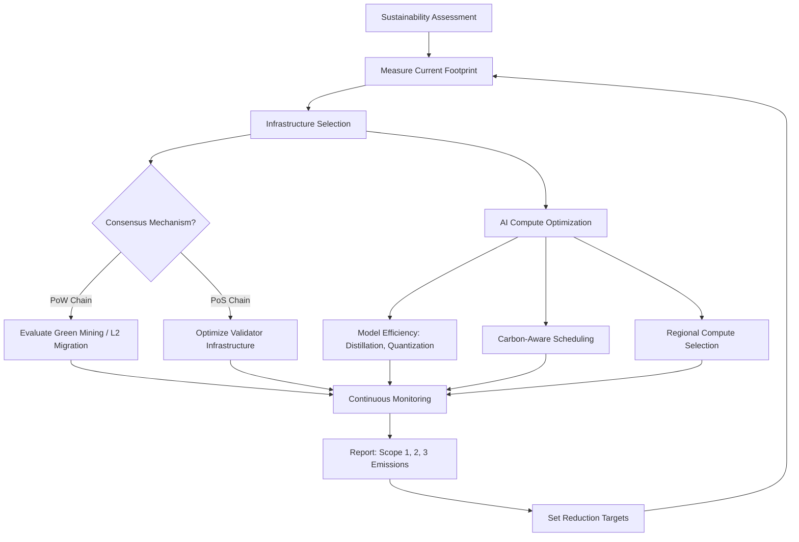

# Chapter 37: Sustainability and Climate Technology

> *Last Updated: March 2026*

> **Skim This Chapter**
> - Web3 and AI founders must address blockchain energy consumption, carbon market tokenization, and compute sustainability as both responsibilities and market opportunities
> - Output: A sustainability assessment for your tech stack, a framework for evaluating ReFi and carbon market opportunities, and a compute carbon footprint reduction plan

## In This Chapter, You Will

- Understand blockchain's energy challenge and how proof-of-stake fundamentally changed the conversation
- Evaluate carbon credit tokenization and on-chain environmental markets as entrepreneurial opportunities
- Apply AI capabilities to climate modeling, energy optimization, and sustainability verification
- Navigate the regenerative finance (ReFi) movement and its implications for venture building
- Design supply chain transparency systems that enable genuine sustainability claims
- Address the compute sustainability challenge inherent in AI-native companies
- Build ventures that treat environmental responsibility as a competitive advantage rather than a cost center

## Founder's Checklist

- What is the carbon footprint of our technology stack, and how does it compare to the legacy systems we aim to replace?
- Are we measuring environmental impact with the same rigor we apply to financial metrics?
- Which sustainability claims in our industry lack verification infrastructure, and can we build it?
- How do our tokenomics or incentive structures align participant behavior with environmental outcomes?
- What regulatory trends in carbon markets and sustainability reporting create tailwinds for our approach?

## Exercises

- Calculate the annualized energy consumption and carbon footprint of your current or planned technology infrastructure
- Map a supply chain in your target industry and identify three points where on-chain verification could replace trust-based sustainability claims
- Design a token model where environmental impact directly influences economic incentives
- Evaluate three ReFi protocols and assess which creates genuine environmental value versus speculative financial activity

## 1. Introduction: The Unavoidable Intersection

Climate change represents the defining challenge of this century, and the technologies at the center of this book---artificial intelligence and Web3---occupy a paradoxical position within that challenge. They are simultaneously among the most energy-intensive technologies ever deployed and among the most promising tools for addressing environmental degradation at scale. This tension is not a contradiction to be resolved through rhetoric but a design problem to be solved through engineering, economics, and entrepreneurial imagination.

For too long, the sustainability conversation in technology has been confined to two camps: critics who point to the enormous energy consumption of proof-of-work mining and GPU-intensive AI training, and enthusiasts who wave away these concerns with vague promises of future efficiency gains. Neither position serves founders building at the intersection of technology and climate. The reality demands a more rigorous engagement---one that honestly accounts for environmental costs while systematically pursuing the transformative potential these technologies offer for climate action.

> **The climate-tech paradox:** AI and blockchain are simultaneously among the most energy-intensive technologies ever deployed and among the most promising tools for addressing environmental degradation at scale. That tension is not a contradiction—it is a design problem.

The opportunity is substantial and urgent. Global carbon markets are projected to grow from approximately $2 billion in the voluntary segment to over $50 billion by 2030. Renewable energy investment surpassed $500 billion annually for the first time in 2022 and continues accelerating. Corporate sustainability reporting is shifting from voluntary disclosure to regulatory mandate across the European Union, the United States, and major Asian economies. These trends create enormous demand for the verification, coordination, and optimization capabilities that blockchain and AI can uniquely provide.

What follows is an honest examination of the energy problem, the emerging landscape of on-chain environmental markets, and practical frameworks for building ventures that are not merely carbon-neutral but actively regenerative—creating environmental value as a core function rather than an afterthought.

## 2. Blockchain's Energy Problem and the Proof-of-Stake Transition

### The Scale of the Problem

Any honest discussion of blockchain and sustainability must begin with energy consumption. At its peak in early 2022, the Bitcoin network consumed an estimated 150 terawatt-hours annually---comparable to the total electricity consumption of Argentina or Norway. This consumption stemmed directly from the proof-of-work consensus mechanism, which deliberately requires enormous computational effort to secure the network. Every transaction validated, every block mined, demanded a competitive expenditure of electricity that, by design, could not be reduced without compromising security.

The environmental critique was not merely theoretical. Research published in peer-reviewed journals documented that Bitcoin mining operations concentrated in regions dependent on coal-fired electricity generation. In China, before the 2021 mining ban, a significant share of mining operations drew power from coal plants in Xinjiang and Inner Mongolia. Even after the geographic redistribution of mining to North America, Kazakhstan, and other regions, the fundamental energy economics of proof-of-work remained unchanged: security required waste.

This created a profound credibility problem for any blockchain project claiming environmental benefits. How could a technology that consumed as much electricity as a mid-sized nation credibly contribute to sustainability? The answer required not incremental improvement but architectural transformation.

### The Ethereum Merge: A Case Study in Systemic Change

On September 15, 2022, the Ethereum network completed its transition from proof-of-work to proof-of-stake in an event known as "The Merge." This was not merely a software update but one of the most significant infrastructure transitions in the history of distributed systems---the equivalent of rebuilding an aircraft engine while the plane remained in flight.

The results were dramatic and immediate. Ethereum's energy consumption dropped by approximately 99.95 percent, from roughly 78 terawatt-hours per year to approximately 0.01 terawatt-hours. The network went from consuming energy comparable to the nation of Chile to consuming roughly what a few hundred American households use annually. This reduction occurred without meaningful compromise to security, decentralization, or transaction throughput.

The Merge demonstrated several principles critical for sustainability-focused founders.

**Systemic redesign outperforms incremental optimization.** The energy reduction did not come from more efficient mining hardware or greener electricity sources---it came from eliminating the need for energy-intensive computation entirely. Proof-of-stake replaced computational competition with economic staking, achieving consensus through participants risking capital rather than burning electricity. This principle applies broadly: the most impactful sustainability interventions often involve rethinking systems from their foundations rather than optimizing existing processes.

**Credible commitment requires execution under constraint.** Ethereum's transition was discussed, planned, and delayed for years. The technical risks were genuine---a failed migration could have destroyed hundreds of billions of dollars in value. The successful execution demonstrated that large-scale technical communities can coordinate around environmental improvements even when those improvements impose short-term costs on powerful stakeholders, specifically the miners whose hardware investments became obsolete.

**Measurement enables accountability.** The energy reduction was not estimated or projected---it was measured, verified, and publicly documented in real time. The Ethereum Foundation, the Cambridge Centre for Alternative Finance, and independent researchers all confirmed the magnitude of the change. This transparency transformed the sustainability conversation around Ethereum from speculative to empirical.

### The Remaining Proof-of-Work Question

Bitcoin, the largest blockchain by market capitalization, remains committed to proof-of-work, and the environmental implications of this choice persist. However, the landscape has evolved in important ways that founders should understand.

Green mining initiatives have gained significant traction. Companies like Marathon Digital Holdings and Riot Platforms have increasingly sourced renewable energy for their operations. In Texas, mining operations have established relationships with wind and solar farms, purchasing excess generation that would otherwise be curtailed. In Iceland and Norway, miners have long utilized abundant geothermal and hydroelectric power. Some operations have co-located with flared natural gas sites, capturing methane emissions that would otherwise enter the atmosphere as a greenhouse gas roughly eighty times more potent than carbon dioxide over a twenty-year horizon.

These developments do not eliminate proof-of-work's energy consumption, but they do complicate the simple narrative that mining equals environmental destruction. For founders, the key insight is that the relationship between computation and carbon is mediated by energy sourcing, grid dynamics, and geographic strategy---factors that can be deliberately designed rather than passively accepted.

| Consensus Mechanism | Annual Energy (TWh) | Carbon per Transaction | Security Model | Sustainability Rating |
|---|---|---|---|---|
| Proof-of-Work (Bitcoin) | ~150 | ~700 kg CO2 | Computational competition | Low |
| Proof-of-Work (pre-Merge Ethereum) | ~78 | ~100 kg CO2 | Computational competition | Low |
| Proof-of-Stake (Ethereum post-Merge) | ~0.01 | ~0.03 kg CO2 | Economic staking | High |
| Delegated PoS (Solana, Cosmos) | ~0.005 | ~0.01 kg CO2 | Validator delegation | High |
| Proof-of-Authority | ~0.001 | Negligible | Trusted validators | Very High (but centralized) |
| Layer 2 Rollups | Fraction of L1 | ~0.001 kg CO2 | Inherits L1 security | Very High |

## 3. Carbon Credit Tokenization and On-Chain Environmental Markets

### The Broken Infrastructure of Carbon Markets

Voluntary carbon markets have long suffered from structural problems that undermine their environmental effectiveness. Credits are frequently double-counted---sold to one buyer while simultaneously claimed by the project originator or another purchaser. Verification is inconsistent, with varying methodologies producing credits of wildly different quality. Pricing is opaque, with identical credits trading at dramatically different prices depending on the buyer's sophistication and the intermediaries involved. Retirement tracking---the process of ensuring a credit is permanently removed from circulation after being used to offset emissions---relies on fragmented registries with limited interoperability.

These problems are not primarily technological but institutional. Carbon markets developed through a patchwork of registries, standards bodies, and trading platforms, each with its own processes, databases, and incentive structures. The result is a market where trust is expensive, verification is slow, and the connection between purchasing a credit and achieving an actual environmental outcome is tenuous.

Blockchain technology offers a compelling architectural response to these specific failures.

### Toucan Protocol: Bridging Legacy Carbon to On-Chain Markets

Toucan Protocol, launched in 2021, created infrastructure for bringing verified carbon credits from legacy registries onto the blockchain. The protocol established a standardized process: credits verified by established registries such as Verra or Gold Standard could be "bridged" onto the Polygon blockchain as tokenized carbon assets called Base Carbon Tonnes (BCTs). Once on-chain, these credits gained properties impossible in legacy systems---transparent pricing, programmatic retirement, composability with other DeFi protocols, and immutable tracking of ownership and retirement status.

The protocol's design addressed several of the structural failures in traditional carbon markets. Double-counting became technically impossible because retirement was recorded on an immutable ledger. Price discovery improved because tokenized credits could be traded on decentralized exchanges with transparent order books. Quality differentiation became more tractable because metadata about the underlying project---its type, vintage, geography, and methodology---traveled with the token.

However, Toucan's experience also revealed important challenges. In its early months, the protocol attracted significant speculative activity alongside genuine environmental demand. Some participants bridged the cheapest available credits---often older vintages from projects with disputed additionality---to exploit price differentials between legacy and on-chain markets. Verra, the largest voluntary carbon credit registry, initially pushed back against unauthorized tokenization of its credits, raising questions about the legal and institutional foundations of bridging mechanisms.

These challenges illustrate a pattern that sustainability-focused founders will encounter repeatedly: technical infrastructure alone cannot create environmental integrity. Protocol design must embed quality standards, governance mechanisms, and institutional relationships that align market activity with genuine environmental outcomes.

### KlimaDAO: Incentive Engineering for Carbon Retirement

KlimaDAO, launched in October 2021, represented one of the most ambitious experiments in using tokenomics to drive environmental outcomes. The protocol's mechanism was deliberately provocative: a treasury-backed token (KLIMA) whose value was supported by carbon credits held in the protocol's reserves. By purchasing and locking carbon credits, KlimaDAO aimed to reduce the available supply in voluntary markets, theoretically increasing the price of carbon and making pollution more expensive.

The project drew direct inspiration from Olympus DAO's bonding and staking mechanics, adapting financial engineering tools for environmental purposes. At its peak, KlimaDAO's treasury held carbon credits representing millions of tonnes of CO2 equivalent, effectively removing them from circulation.

KlimaDAO's trajectory offers several instructive lessons for founders in the ReFi space. The protocol demonstrated that tokenomics could create genuine demand for carbon credits---the treasury accumulation was real, and the credits it held were genuinely removed from market circulation. However, the project also illustrated the difficulty of maintaining environmental mission alignment when financial speculation dominates participant motivation. During the broader crypto market decline of 2022, KLIMA's token price fell by over 99 percent from its all-time high, and treasury growth slowed dramatically.

The deeper lesson is about mechanism design. Financial incentives are powerful tools for driving environmental behavior, but they must be designed to remain aligned with environmental goals across market conditions---not just during periods of speculative enthusiasm. Founders building in this space should design for the bear market, creating value propositions that persist when token prices decline and speculative interest wanes.

### Framework: Evaluating On-Chain Environmental Markets

For founders considering building in carbon markets or broader environmental tokenization, the following evaluation framework distinguishes projects likely to create genuine environmental value from those that merely financialize existing assets.

**Additionality Test**: Does the market mechanism cause environmental benefits that would not have occurred otherwise? Tokenizing existing credits creates liquidity but not necessarily additional environmental impact. Mechanisms that fund new projects, accelerate retirement, or increase the effective price of carbon score higher on additionality.

**Permanence Assessment**: Are environmental claims durable? Carbon stored in forests can be released by fire; credits from avoided deforestation depend on continued enforcement. On-chain mechanisms should account for permanence risk rather than treating all credits as equivalent.

**Leakage Analysis**: Does the mechanism reduce emissions in one place while enabling them elsewhere? Supply-side approaches that merely shift credits between markets may not reduce aggregate emissions.

**Verification Depth**: How robust is the connection between the on-chain token and the real-world environmental outcome? Protocols that rely on self-reported data without independent verification create systematic quality risk.

**Governance Alignment**: Do the governance structures ensure that the protocol evolves in directions that serve environmental goals, or do token-weighted voting systems create plutocratic capture by financial rather than environmental interests?

## 4. AI for Climate Modeling and Optimization

### Transforming Climate Science

Artificial intelligence is fundamentally expanding the scope and resolution of climate modeling. Traditional climate models---General Circulation Models (GCMs)---are computationally expensive simulations that divide the atmosphere, oceans, and land surfaces into grid cells and solve physical equations at each point. The computational demands are enormous: a single high-resolution climate simulation can require millions of CPU hours.

Machine learning approaches complement traditional models in several ways. Neural networks can learn the relationships between coarse-resolution inputs and fine-resolution outputs, enabling "downscaling" that produces local climate projections from global models at a fraction of the computational cost. Generative models can produce ensembles of climate scenarios rapidly, enabling better uncertainty quantification. Pattern recognition algorithms can identify climate signals in noisy observational data, improving our understanding of feedback mechanisms and tipping points.

For founders, the opportunity lies not in replacing established climate science institutions but in making their outputs more accessible, actionable, and granular. The gap between what climate science produces (global and regional projections on decadal timescales) and what businesses and governments need (local, asset-level risk assessments on planning-relevant timescales) represents a significant market opportunity.

### Practical Applications for Founders

**Energy System Optimization**: AI enables real-time balancing of electricity grids with high penetrations of variable renewable energy. Machine learning models can predict solar and wind generation hours to days in advance, optimize battery storage dispatch, and coordinate distributed energy resources across thousands of nodes. This optimization capability becomes increasingly valuable as grids incorporate higher shares of renewables, where the intermittency challenge intensifies.

**Agricultural Climate Adaptation**: Machine learning models trained on satellite imagery, weather data, and soil sensors can provide field-level recommendations for planting timing, crop selection, irrigation scheduling, and pest management. These capabilities are particularly valuable in developing regions where traditional agricultural extension services are sparse and climate variability is increasing.

**Building Energy Management**: Commercial buildings account for roughly 40 percent of energy consumption in developed economies. AI-powered building management systems can reduce energy use by 20 to 40 percent through predictive HVAC optimization, occupancy-aware lighting control, and dynamic load management. The data required to train these systems---temperature readings, occupancy patterns, weather forecasts, energy prices---is increasingly available through IoT sensor deployments.

**Supply Chain Emissions Tracking**: AI can process the complex, multi-tier data required to calculate Scope 3 emissions---the indirect emissions in a company's value chain that typically represent 70 to 90 percent of its total carbon footprint. Natural language processing can extract emissions data from supplier reports, satellite imagery can verify land-use claims, and graph neural networks can model the propagation of emissions through complex supply networks.

## 5. The Regenerative Finance (ReFi) Movement

### Beyond Carbon Neutrality

Regenerative finance represents a philosophical and practical evolution beyond the concept of carbon neutrality or even "net zero." Where traditional sustainability thinking seeks to minimize harm---reducing emissions, limiting waste, avoiding degradation---regenerative approaches aim to actively restore and enhance natural systems. The ReFi movement applies this regenerative philosophy through financial mechanisms, particularly those enabled by blockchain technology.

The intellectual foundations draw from multiple sources: regenerative agriculture's emphasis on building soil health rather than merely sustaining it; Kate Raworth's "doughnut economics" framework balancing social foundations with ecological ceilings; and the commons governance research of Elinor Ostrom demonstrating that communities can sustainably manage shared resources without either privatization or centralized control.

In practice, ReFi encompasses a diverse ecosystem of projects, protocols, and communities. Some focus on tokenizing ecological assets---carbon credits, biodiversity credits, water quality improvements---to create liquid markets that channel capital toward environmental restoration. Others build coordination tools for community-managed natural resources. Still others develop measurement, reporting, and verification (MRV) infrastructure that provides the data foundation upon which environmental markets depend.

### The ReFi Stack

Founders entering the ReFi space should understand its emerging technology stack, which parallels the broader DeFi stack but with environmental primitives at its foundation.

**Measurement Layer**: Satellite imagery, IoT sensors, drone surveys, and ground-truth sampling provide the raw data about environmental conditions. AI models process this data into standardized environmental metrics---tonnes of carbon sequestered, hectares of biodiversity restored, cubic meters of water filtered. This layer is the foundation upon which all environmental claims rest, and its integrity determines the credibility of everything built above it.

**Verification Layer**: Independent verification transforms raw measurements into credible environmental claims. Traditional verification relies on human auditors conducting periodic site visits. Emerging approaches combine remote sensing with statistical sampling and AI-powered anomaly detection to provide continuous, scalable verification at lower cost.

**Tokenization Layer**: Verified environmental outcomes are represented as digital assets on blockchain networks. Design choices at this layer---fungibility versus uniqueness, vintaging, quality categorization, retirement mechanisms---profoundly shape market dynamics and environmental effectiveness.

**Market Layer**: Decentralized exchanges, bonding curves, automated market makers, and order books enable price discovery and trading of environmental assets. Liquidity provision, market-making incentives, and trading pair design determine market efficiency.

**Application Layer**: End-user applications translate the underlying infrastructure into products that individuals, corporations, and governments actually use---carbon footprint calculators, offset marketplaces, sustainability reporting tools, and impact investment platforms.

### Challenges and Honest Assessment

The ReFi movement faces genuine challenges that founders should acknowledge rather than dismiss. The connection between financial activity and environmental outcomes is not always as direct as proponents claim. Token speculation can dominate genuine environmental demand. Governance structures that claim to be community-driven often concentrate power among early participants and large token holders. The complexity of environmental measurement means that on-chain tokens sometimes represent claims of uncertain quality.

These challenges are not reasons to abandon the ReFi vision but rather design constraints that effective founders must address. The most successful ReFi ventures will be those that maintain rigorous connections between financial mechanisms and environmental outcomes, design governance structures that resist capture, and build verification infrastructure that earns credibility through transparency and accuracy.

## 6. Supply Chain Transparency and Sustainability Verification

### The Verification Gap

Corporate sustainability claims have proliferated dramatically. By 2025, the majority of large publicly traded companies publish sustainability reports, and consumers increasingly make purchasing decisions based on environmental claims. Yet the infrastructure for verifying these claims remains woefully inadequate.

Consider a simple claim: "This coffee is sustainably sourced." Verifying this statement requires tracing the coffee from the farm where it was grown (was shade-grown cultivation practiced? were pesticides minimized?) through processing (was water usage managed responsibly? were workers fairly compensated?) through transportation (what was the shipping route? what fuel was used?) to the retailer (were storage conditions appropriate? was waste minimized?). Each step involves different actors, different geographies, different data systems, and different verification challenges.

Blockchain technology can create an immutable, shared record of this supply chain journey, while AI can process the diverse data streams required to verify claims at each stage. Together, they address both the trust problem (can we believe the data?) and the complexity problem (can we process all the relevant information?).

### Powerledger: Decentralized Energy Tracking in Practice

Powerledger, founded in 2016 in Perth, Australia, provides a compelling case study of blockchain-based sustainability verification applied to energy markets. The platform enables peer-to-peer energy trading and, critically, transparent tracking of renewable energy generation and consumption.

In traditional energy markets, the provenance of electricity is difficult to verify. Renewable Energy Certificates (RECs) attest that a certain quantity of renewable energy was generated, but they are traded separately from the physical electricity, creating a system where a company can claim to use renewable energy by purchasing RECs while its actual electricity comes from fossil fuel plants hundreds of miles away. This disconnect between certificate and consumption undermines the environmental credibility of renewable energy claims.

Powerledger's blockchain-based system ties energy generation data from smart meters directly to consumption records, creating granular, time-matched verification of renewable energy use. Deployed across projects in Australia, Japan, India, and Europe, the platform demonstrates how distributed ledger technology can transform energy markets from trust-based to verification-based systems.

The platform's expansion into multiple Asian and European markets illustrates the geographic breadth of demand for transparent energy tracking. Japan's post-Fukushima energy transformation, India's ambitious renewable energy targets, and the European Union's increasingly stringent sustainability reporting requirements all create regulatory and market conditions favorable to verification infrastructure.

For founders, Powerledger illustrates a critical strategic principle: build verification infrastructure that becomes more valuable as regulatory requirements tighten. Companies that establish credible verification systems during periods of voluntary adoption are well-positioned when requirements become mandatory.

### Implementation Architecture

Founders building supply chain sustainability systems should consider a layered architecture:

**Data Capture Layer**: IoT sensors, satellite imagery, and automated data feeds provide raw information about environmental conditions, resource usage, and production processes. The critical design decision is determining the appropriate balance between automated and human-reported data, recognizing that fully automated systems are more trustworthy but more expensive to deploy.

**Attestation Layer**: Participants in the supply chain make verifiable claims about their activities---farmers attest to cultivation practices, processors document resource usage, transporters record routes and fuel consumption. Blockchain records create an immutable history of these attestations.

**Verification Layer**: AI-powered analysis cross-references attestations against independent data sources. Satellite imagery can verify land-use claims; weather data can corroborate agricultural practices; shipping records can confirm transportation claims. Anomaly detection identifies attestations inconsistent with supporting evidence.

**Certification Layer**: Aggregated, verified data feeds into sustainability certifications, carbon footprint calculations, and compliance reports. Smart contracts can automate certification issuance when verification criteria are met, reducing the cost and delay of traditional audit-based certification.

## 7. Energy Grid Optimization Through Decentralized Systems

### The Grid Transformation Challenge

Electricity grids worldwide face a fundamental transformation. Built for centralized, dispatchable generation from large fossil fuel and nuclear plants, they must now accommodate distributed, variable generation from millions of solar panels, wind turbines, and battery systems. This transition requires coordination capabilities that centralized grid management systems were not designed to provide.

The challenge is simultaneously technical and economic. Technically, grid operators must balance supply and demand in real time across millions of nodes with variable and partially unpredictable generation. Economically, the traditional model of centralized generation and one-way distribution is giving way to a world where consumers are also producers ("prosumers"), where energy storage creates temporal arbitrage opportunities, and where electric vehicle batteries represent both demand and potential supply.

### Decentralized Coordination Architectures

Blockchain-based systems offer architectural advantages for managing distributed energy resources. Smart contracts can encode grid participation rules---when to charge batteries, when to export solar generation, how to respond to price signals---that execute automatically without requiring centralized dispatch decisions. Tokenized incentives can align the behavior of thousands of distributed participants with grid stability requirements.

This is not a theoretical proposition. Projects across Australia, Germany, and the United States have demonstrated peer-to-peer energy trading, blockchain-based demand response, and tokenized renewable energy certificate systems. The results suggest that decentralized coordination can complement centralized grid management, particularly for local distribution network management where the granularity of centralized systems is insufficient.

### The AI-Blockchain Synergy in Energy

The combination of AI and blockchain creates particularly powerful capabilities in energy systems. AI provides the prediction and optimization layer---forecasting renewable generation, predicting demand patterns, optimizing storage dispatch---while blockchain provides the coordination and settlement layer---recording energy flows, executing trading rules, settling payments.

This combination enables several capabilities impossible with either technology alone:

**Predictive Peer-to-Peer Trading**: AI models forecast generation and consumption for individual participants, enabling forward markets where prosumers can sell anticipated solar generation before it occurs, improving planning certainty for both buyers and sellers.

**Dynamic Grid Pricing**: Machine learning models that incorporate weather forecasts, demand predictions, and generation capacity can produce real-time, location-specific energy prices that reflect the true marginal cost of electricity delivery. Blockchain settlement ensures transparent, tamper-resistant implementation of these dynamic prices.

**Autonomous Demand Response**: AI-controlled devices---smart thermostats, water heaters, electric vehicle chargers---respond to on-chain price signals, automatically shifting consumption to periods of abundant renewable generation without manual intervention from building occupants.

## 8. The Compute Sustainability Challenge

### AI's Growing Energy Footprint

While blockchain's energy problem has received extensive attention, a parallel challenge is emerging in artificial intelligence. Training large language models requires enormous computational resources: training GPT-4-class models has been estimated to consume gigawatt-hours of electricity, and training runs are growing in energy intensity as models scale. The proliferation of AI inference---running trained models in production to serve millions of users---adds a continuous and growing energy demand on top of periodic training costs.

Data centers supporting AI workloads are projected to consume 3 to 4 percent of global electricity by the late 2020s, up from roughly 1 to 2 percent today. Major technology companies are investing billions in new data center construction, and the concentration of these facilities creates localized demands that strain regional power grids. In northern Virginia, the world's largest data center market, utilities have struggled to build generation and transmission capacity fast enough to meet demand.

For founders building AI-native companies, this energy footprint is not merely an abstract concern but a direct input cost, a reputational risk, and increasingly a regulatory consideration.

### Strategies for Compute Sustainability

**Model Efficiency**: Smaller, more efficient models can dramatically reduce energy consumption per inference. Techniques such as distillation (training smaller models to mimic larger ones), quantization (reducing the numerical precision of model weights), and pruning (removing unnecessary parameters) can reduce computational requirements by factors of ten or more while preserving most task-relevant performance. Founders should resist the default assumption that larger models are always better and instead rigorously evaluate whether smaller, fine-tuned models serve their specific use case.

**Geographic and Temporal Optimization**: Not all electricity is equal from a carbon perspective. Training runs scheduled during periods of high renewable generation and located in regions with clean grids can have dramatically lower carbon footprints than the same computation performed at other times and places. Carbon-aware scheduling---automatically shifting workloads to times and places where the grid is cleanest---is an emerging practice that can reduce AI carbon footprints by 30 to 50 percent without reducing computational output.

**Hardware Efficiency**: Each generation of AI accelerator hardware delivers substantial efficiency improvements. NVIDIA's H100 GPUs, for example, deliver roughly three times the performance per watt of their A100 predecessors for transformer workloads. Founders should factor hardware refresh cycles into their sustainability planning and consider cloud providers' hardware generations when selecting compute infrastructure.

**Inference Optimization**: For many applications, the cumulative energy consumption of inference far exceeds training costs. Techniques such as caching, batching, early exit (terminating computation when confidence thresholds are met), and model cascading (using smaller models for easy queries and larger models only when necessary) can reduce inference energy consumption substantially.

### ClimateBase and the Sustainability Talent Pipeline

The compute sustainability challenge creates demand not just for technical solutions but for people who understand both technology and environmental systems. ClimateBase, a platform connecting professionals with climate-focused organizations, illustrates how the sustainability imperative is reshaping talent markets.

Founded to address the observation that many technologists wanted to work on climate problems but lacked pathways into the sector, ClimateBase has grown into a significant hub connecting climate technology companies with engineers, data scientists, product managers, and other professionals. The platform's growth reflects a broader trend: sustainability is becoming a talent acquisition advantage. Companies that credibly demonstrate environmental commitment attract engineers and researchers who increasingly prioritize mission alongside compensation.

For founders, this talent dynamic creates a strategic opportunity. Building genuine sustainability practices---not performative greenwashing but rigorous measurement, transparent reporting, and continuous improvement---becomes a competitive advantage in recruiting the technical talent required to build AI and Web3 systems.

## 9. Implementation Guide: Building a Sustainable Web3/AI Company

### Phase 1: Measurement and Baseline (Months 1-3)

Before optimizing anything, establish rigorous measurement of your venture's environmental footprint.

**Infrastructure Audit**: Catalog all compute resources, including cloud instances, on-chain transaction volumes, data storage, and network bandwidth. Map each resource to its energy consumption using provider-specific efficiency data and regional grid carbon intensity factors.

**Scope Classification**: Organize emissions into the Greenhouse Gas Protocol's three scopes. Scope 1 covers direct emissions (unlikely to be significant for most software companies). Scope 2 covers purchased electricity (primarily data center consumption). Scope 3 covers value chain emissions (employee commuting, hardware manufacturing, upstream cloud provider emissions). For AI and Web3 companies, Scope 2 typically dominates, but Scope 3 can be substantial.

**Tool Selection**: Several platforms provide carbon accounting for technology companies. Cloud providers increasingly offer carbon footprint dashboards. Specialized tools track blockchain transaction emissions. Select tools that provide granular, verifiable data rather than rough estimates.

**Baseline Documentation**: Record your baseline carbon footprint with sufficient detail to enable meaningful year-over-year comparison. Publish this baseline, even if the numbers are unflattering. Transparency builds credibility that vague commitments never achieve.

### Phase 2: Reduction Strategy (Months 3-6)

With measurement in place, pursue reductions through systematic optimization.

**Cloud Provider Selection**: Major cloud providers differ significantly in their grid carbon intensity. Google Cloud, for example, has matched 100 percent of its electricity consumption with renewable energy purchases since 2017 and is pursuing 24/7 carbon-free energy across all facilities. AWS and Azure have made similar but differently structured commitments. Evaluate providers on operational carbon intensity, not just renewable energy claims.

**Architecture Optimization**: Review system architecture for energy efficiency. Serverless architectures that scale to zero during low-demand periods consume less energy than always-on virtual machines. Efficient database design reduces storage and query energy. Caching layers reduce redundant computation.

**Blockchain Selection**: If your application requires blockchain infrastructure, chain selection has enormous carbon implications. Post-Merge Ethereum, Solana, Polygon, and other proof-of-stake networks consume orders of magnitude less energy per transaction than proof-of-work alternatives. Choose your infrastructure accordingly and document the rationale.

**AI Model Optimization**: Evaluate whether your AI workloads use appropriately sized models. Implement inference optimization techniques. Consider carbon-aware training schedules for major training runs.

### Phase 3: Compensation and Contribution (Months 6-12)

After reducing what you can, address remaining emissions and contribute to broader climate solutions.

**High-Quality Offsets**: If purchasing carbon credits, prioritize quality over cost. Credits from projects with strong additionality, permanence, and independent verification create genuine environmental value. Credits from projects with questionable methodology merely transfer money without environmental impact.

**Direct Investment**: Consider allocating a percentage of revenue or treasury to direct climate investments---renewable energy projects, carbon removal technologies, or ecosystem restoration. These investments often create stronger environmental outcomes than offset purchases and provide compelling narratives for stakeholders.

**Open-Source Contribution**: Release sustainability tools, datasets, or methodologies as open-source resources. The climate challenge requires collective action, and open-source contributions generate both environmental impact and community goodwill.

### Phase 4: Integration and Leadership (Ongoing)

Sustainability is not a project with a completion date but an ongoing practice integrated into venture operations.

**Governance Integration**: Incorporate environmental metrics into governance structures. For DAOs, this might mean requiring environmental impact assessments for major treasury decisions. For traditional companies, it means including sustainability KPIs in executive performance evaluation.

**Product Integration**: Where possible, embed sustainability features into your product. Carbon footprint tracking, environmental impact dashboards, and sustainability-optimized defaults create user awareness and differentiate your offering.

**Ecosystem Influence**: Use your position in the ecosystem to raise standards. Advocate for sustainability requirements in protocol governance. Preference suppliers and partners with strong environmental practices. Share your measurement methodologies and improvement strategies publicly.

## 10. The Regulatory Landscape and Strategic Positioning

### Emerging Mandates

The regulatory environment for sustainability disclosure is tightening rapidly across major economies. The European Union's Corporate Sustainability Reporting Directive (CSRD) requires detailed environmental reporting from thousands of companies. The U.S. Securities and Exchange Commission has pursued climate disclosure rules for public companies. The International Sustainability Standards Board (ISSB) has published global baseline standards that are being adopted across jurisdictions.

These mandates create demand for the measurement, verification, and reporting infrastructure that Web3 and AI technologies can provide. Companies that build compliant sustainability systems today will be well-positioned as requirements expand to smaller companies and additional jurisdictions.

### Carbon Border Adjustments

The European Union's Carbon Border Adjustment Mechanism (CBAM) imposes carbon costs on imports based on their embedded emissions. This mechanism creates demand for supply chain emissions tracking across international trade---precisely the capability that blockchain-based supply chain systems can provide. As other jurisdictions consider similar mechanisms, the market for verifiable supply chain emissions data will expand substantially.

### Strategic Implications for Founders

Regulatory trends create several strategic opportunities for founders:

**Compliance Infrastructure**: Build tools that help companies comply with sustainability reporting requirements. The CSRD alone creates demand from tens of thousands of European companies, many of which lack the internal capabilities to produce compliant reports.

**Verification Services**: As sustainability claims face regulatory scrutiny, demand for independent verification will grow. AI-powered verification systems that can process diverse data streams at scale will be more cost-effective than traditional audit-based approaches.

**Market Infrastructure**: As carbon pricing mechanisms expand and carbon border adjustments create cross-border compliance requirements, the infrastructure for tracking, trading, and settling carbon-related obligations becomes increasingly valuable.

## 11. Geographic Perspectives: Global Variation in Climate Technology

### Regional Dynamics

The climate technology opportunity varies significantly across geographies, creating diverse founder strategies depending on location and target markets.

**Europe** leads in regulatory infrastructure, with the EU Emissions Trading System, CSRD, and CBAM creating structured demand for sustainability technology. European founders benefit from strong regulatory tailwinds but must navigate complex compliance requirements across member states.

**Southeast Asia and the Pacific** face acute climate vulnerability---rising sea levels, extreme weather events, and agricultural disruption---creating urgent demand for adaptation technologies. Australia's leadership in distributed energy (exemplified by Powerledger and the country's high rooftop solar penetration) demonstrates how climate conditions can drive technology adoption.

**Sub-Saharan Africa** presents opportunities in leapfrog scenarios where communities adopt decentralized renewable energy and blockchain-based environmental markets without first building the centralized infrastructure of industrialized economies. Mobile money adoption patterns suggest similar leapfrog potential for climate finance tools.

**Latin America** holds enormous natural capital---the Amazon rainforest, biodiversity hotspots, extensive renewable energy resources---and blockchain-based mechanisms for valuing and protecting these assets represent significant opportunities. Brazilian and Colombian projects have pioneered biodiversity credit tokenization.

**North America** dominates in AI capabilities and venture capital availability but faces political complexity around climate policy. Founders targeting North American markets should build for regulatory variability and focus on economic value propositions that transcend political cycles.

## Key Takeaways

### The Energy Problem Is Being Solved, But Unevenly
Ethereum's Merge demonstrated that blockchain networks can dramatically reduce energy consumption through architectural change. AI's energy footprint is growing and requires deliberate management. Founders should choose energy-efficient infrastructure and measure what they consume.

### On-Chain Environmental Markets Address Real Structural Failures
Legacy carbon markets suffer from double-counting, opacity, and verification challenges that blockchain can address. However, tokenization alone does not create environmental value---mechanism design must maintain rigorous connections between financial activity and environmental outcomes.

### AI Transforms Climate Action from Estimation to Optimization
Machine learning enables granular climate modeling, real-time energy optimization, and scalable supply chain verification. The gap between climate science outputs and actionable business intelligence represents a significant market opportunity.

### Verification Infrastructure Is the Highest-Leverage Investment
As sustainability claims face increasing scrutiny from regulators, investors, and consumers, the systems that verify those claims become critical infrastructure. Build verification that becomes more valuable as standards tighten.

### Sustainability Is a Competitive Advantage, Not a Cost Center
Companies that genuinely measure, reduce, and transparently report their environmental impact attract better talent, earn customer trust, and position themselves favorably for regulatory trends.

---

## Related Case Studies

For practical examples of the concepts in this chapter, see the [Case Studies Compendium](../case-studies/compendium.md):

- **ClimateBase** — Mission-led climate community demonstrating how community building, rituals, and impact measurement create sustainable engagement around environmental goals
- **Ethereum Cross-Stage Journey** — The Merge to proof-of-stake as the most significant energy sustainability transformation in blockchain history, reducing energy consumption by over 99%
- **IPFS / Filecoin** — Protocol design for content-addressed storage with sustainable token sinks, demonstrating how infrastructure can be designed for long-term environmental efficiency
- **Hivemapper** — Decentralized mapping network showing how DePIN models can create environmental monitoring infrastructure through crowd-sourced data collection
- **Zipline** — Drone delivery replacing carbon-intensive ground logistics for medical supplies, demonstrating how technology can simultaneously improve outcomes and reduce environmental impact

## Further Reading

- **Doughnut Economics: Seven Ways to Think Like a 21st-Century Economist** by Kate Raworth — Proposes a regenerative economic framework that provides the intellectual foundation for understanding how technology can serve both human needs and planetary boundaries.
- **The New Climate Economy: Better Growth, Better Climate** by the Global Commission on the Economy and Climate — Demonstrates that economic growth and climate action are complementary rather than conflicting, essential context for climate tech founders.
- **Drawdown: The Most Comprehensive Plan Ever Proposed to Reverse Global Warming** edited by Paul Hawken — Ranks and quantifies the most impactful climate solutions, helping founders identify where technology intervention creates the greatest impact.
- **Governing the Commons** by Elinor Ostrom — Nobel Prize-winning work on collective resource management that provides theoretical grounding for decentralized environmental governance and carbon market design.

## Sources

1. Ethereum Foundation. "The Merge." ethereum.org, 2022.
2. Cambridge Centre for Alternative Finance. Cambridge Bitcoin Electricity Consumption Index. University of Cambridge.
3. Toucan Protocol. Documentation and Governance Proposals. toucan.earth.
4. KlimaDAO. Documentation and Treasury Reports. klimadao.finance.
5. Powerledger. "Technology Overview." powerledger.io.
6. International Energy Agency. "World Energy Outlook." Annual Report.
7. Greenhouse Gas Protocol. Corporate Standard and Scope 3 Standard.
8. European Commission. "Corporate Sustainability Reporting Directive (CSRD)."
9. International Sustainability Standards Board (ISSB). IFRS S1 and S2 Standards.
10. Raworth, K. (2017). *Doughnut Economics: Seven Ways to Think Like a 21st-Century Economist*. Chelsea Green Publishing.
11. Ostrom, E. (1990). *Governing the Commons: The Evolution of Institutions for Collective Action*. Cambridge University Press.
12. Global Commission on the Economy and Climate. *The New Climate Economy: Better Growth, Better Climate*.
13. Hawken, P. (Ed.) (2017). *Drawdown: The Most Comprehensive Plan Ever Proposed to Reverse Global Warming*. Penguin Books.
14. Landua, G. & Regen Network Team. "The Principles of ReFi." Regen Network.
15. ClimateBase. climatebase.org.

## Related Case Studies
- ClimateBase, Ethereum (The Merge), IPFS/Filecoin, Hivemapper, Zipline: ../case-studies/compendium.md
- Emerging climate technology ventures: ../case-studies/2025-emerging-case-studies.md
