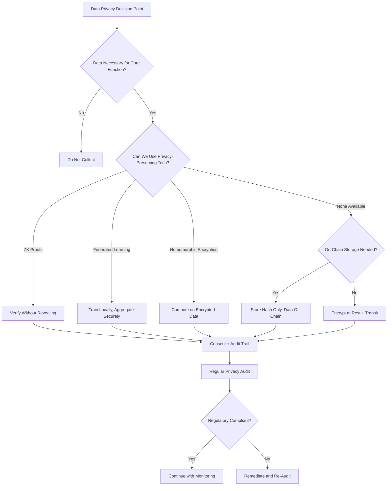

# Chapter 38: Data Privacy and Ethics

> *Last Updated: March 2026*

> **Skim This Chapter**
> - Privacy is an architectural decision, not a policy checkbox -- founders must navigate overlapping global regulations while building systems that resolve the fundamental tension between blockchain transparency and data protection
> - Output: A data protection impact assessment framework, a privacy-preserving technology selection guide, and an ethical decision-making process for AI and Web3 products

## 1. Introduction: The Trust Architecture of the New Economy

Every technology revolution reshapes the social contract between builders and users. The printing press demanded new norms around authorship and censorship. The telegraph required agreements on communication privacy. The internet introduced debates over data collection that remain unresolved decades later. Now, the convergence of Web3 and AI creates a privacy and ethics landscape of unprecedented complexity, where the rules are being written in real time by founders, regulators, and communities across the globe.

For founders building at the intersection of blockchain and artificial intelligence, data privacy and ethics are not compliance checkboxes or afterthoughts to be addressed once a product achieves traction. They are foundational architectural decisions that determine whether your product earns trust, survives regulatory scrutiny, and creates lasting value. A privacy failure can destroy a company overnight. An ethical lapse in AI can cause measurable harm to real people. Conversely, privacy-first design and robust ethical frameworks can become durable competitive advantages in markets where user trust is the scarcest resource.

The challenge is uniquely acute at the Web3-AI intersection. Blockchain systems are designed for transparency and immutability, recording transactions on public ledgers that persist indefinitely. AI systems are voracious consumers of data, requiring vast datasets to train models that improve through continuous learning. These two paradigms exist in fundamental tension with the growing global consensus that individuals should control their personal data, consent to its use, and have the right to be forgotten.

> **Privacy as architecture:** A privacy failure can destroy a company overnight. Conversely, privacy-first design can become a durable competitive advantage in markets where user trust is the scarcest resource. The choice is not whether to invest in privacy, but whether to invest before or after the crisis.

## 2. The Global Data Privacy Landscape

### The Regulatory Mosaic

Data privacy regulation has evolved from a niche concern into one of the most active areas of global lawmaking. Founders building products with any international reach must navigate a complex mosaic of overlapping and sometimes contradictory requirements.

**The European Union: GDPR as the Global Benchmark**

The General Data Protection Regulation, effective since May 2018, established the template that much of the world has followed. Its core principles include:

- **Lawful basis for processing**: Organizations must have a legitimate legal reason to collect and process personal data, whether through explicit consent, contractual necessity, legitimate interest, or other defined bases
- **Data minimization**: Collect only the data strictly necessary for the stated purpose
- **Purpose limitation**: Data collected for one purpose cannot be repurposed without additional consent
- **Right to erasure**: Individuals can request deletion of their personal data, the so-called "right to be forgotten"
- **Data portability**: Users can request their data in a machine-readable format to transfer between services
- **Privacy by design**: Data protection must be integrated into system architecture from the outset, not added retroactively

GDPR enforcement has proven consequential. The regulation carries penalties of up to four percent of global annual revenue or twenty million euros, whichever is higher. By 2025, European data protection authorities had collectively issued billions of euros in fines, with major technology companies bearing the largest penalties. These enforcement actions have established important precedents around consent mechanisms, cross-border data transfers, and algorithmic decision-making.

**The United States: Sectoral Fragmentation**

The United States lacks a comprehensive federal privacy law, creating a patchwork of state-level and sector-specific regulations. The California Consumer Privacy Act and its successor, the California Privacy Rights Act, represent the most comprehensive state-level frameworks, granting California residents rights including:

- The right to know what personal data is collected and how it is used
- The right to delete personal data held by businesses
- The right to opt out of the sale or sharing of personal data
- The right to non-discrimination for exercising privacy rights

Multiple other states have enacted or proposed their own privacy legislation, each with distinct requirements and enforcement mechanisms. This fragmentation creates significant compliance complexity for founders, particularly those building products that serve users across multiple jurisdictions. Federal proposals continue to circulate, but comprehensive national legislation remains elusive.

**Asia-Pacific: Diverse Approaches**

The Asia-Pacific region presents its own diversity. China's Personal Information Protection Law, effective since November 2021, introduced requirements comparable to GDPR in scope while adding provisions around cross-border data transfers and data localization that significantly affect companies operating in or processing data from China. Japan, South Korea, Australia, and India have each developed distinct regulatory frameworks reflecting their particular cultural and political approaches to the balance between innovation and individual rights.

**Emerging Economies: Building New Frameworks**

Brazil's Lei Geral de Protecao de Dados, Nigeria's Data Protection Act, Kenya's Data Protection Act, and similar legislation across Latin America, Africa, and Southeast Asia demonstrate that privacy regulation is not solely a concern of wealthy nations. Founders targeting emerging markets must engage with these frameworks, which often combine elements of GDPR with provisions tailored to local conditions, including considerations around digital financial services, biometric data collection, and mobile-first data practices.

### Implications for Web3 and AI Founders

This regulatory landscape creates specific challenges for founders building at the Web3-AI intersection:

**Immutability vs. Right to Erasure**

Blockchain's core value proposition of permanent, tamper-resistant records directly conflicts with GDPR's right to erasure. If personal data is written to a public blockchain, it cannot be deleted. Founders must architect systems so that personal data never touches the chain directly, using off-chain storage with on-chain references, encryption schemes where key destruction renders data inaccessible, or zero-knowledge proofs that verify claims without storing underlying data.

**AI Training Data and Consent**

AI models trained on personal data require clear legal bases for that processing. Consent obtained for one purpose does not automatically extend to model training. The emerging regulatory consensus increasingly treats model outputs as derivative of training data, potentially implicating the original data subjects' rights even after the training process is complete.

**Cross-Border Data Flows**

Decentralized systems by their nature distribute data across jurisdictions. Founders must understand how data localization requirements, cross-border transfer mechanisms, and jurisdictional conflicts affect their architecture and operations.

## 3. Self-Sovereign Identity and Decentralized Identity

### The Identity Problem

Traditional digital identity relies on centralized authorities: governments issue identity documents, corporations manage login credentials, and platforms accumulate behavioral data that forms de facto digital identities. This centralized model creates single points of failure, concentrates power over identity verification, and forces users to surrender personal information repeatedly to access services.

Self-sovereign identity represents a paradigm shift: individuals own, control, and present their identity credentials without depending on any single centralized authority. The technical infrastructure for this vision has matured significantly through decentralized identifier and verifiable credential standards.

### How Decentralized Identity Works

**Decentralized Identifiers (DIDs)**

A DID is a globally unique identifier that the subject creates and controls, anchored to a decentralized system such as a blockchain. Unlike traditional identifiers assigned by centralized authorities (email addresses, social security numbers, usernames), DIDs are:

- Created by the individual without requiring permission from any authority
- Cryptographically verifiable, proving control without revealing unnecessary information
- Resolvable to DID documents containing public keys and service endpoints
- Persistent or rotatable at the individual's discretion

**Verifiable Credentials**

Verifiable credentials are tamper-evident digital claims issued by trusted entities (universities, employers, governments) that the holder can present to verifiers without contacting the original issuer. A university can issue a credential attesting to a degree. The holder stores this credential in their digital wallet. When a potential employer requests proof of education, the holder presents the credential, which the employer can verify cryptographically without contacting the university.

### Case Study: Polygon ID and Privacy-Preserving Identity Verification

Polygon ID demonstrates how zero-knowledge proofs can enhance decentralized identity systems. Built on the Iden3 protocol, Polygon ID enables users to prove claims about themselves without revealing the underlying data. A user can prove they are over eighteen years old without revealing their birthdate. They can prove they hold a valid credential from a specific issuer without revealing which specific credential.

The system operates through three roles: the issuer who creates verifiable claims, the holder who stores credentials in their wallet, and the verifier who requests proof of specific attributes. Zero-knowledge proofs enable the holder to satisfy the verifier's requirements while minimizing data disclosure.

Polygon ID's approach illustrates a broader principle for Web3 founders: privacy-preserving identity does not require sacrificing verification capability. By separating the proof from the underlying data, systems can satisfy regulatory requirements for identity verification while respecting user privacy. This model has found particular traction in decentralized finance, where know-your-customer requirements have traditionally forced a choice between regulatory compliance and user privacy.

**Lessons for Founders:**
- Zero-knowledge identity verification can satisfy compliance requirements without creating honeypots of personal data
- Selective disclosure enables users to share only what is necessary for each interaction
- Credential portability across platforms reduces friction while increasing user control
- The issuer-holder-verifier model distributes trust rather than concentrating it

## 4. Privacy-Preserving Technologies

The tension between data utility and data privacy has driven significant innovation in technologies that enable computation on data without exposing the underlying information. Founders building privacy-first products should understand the capabilities, limitations, and appropriate applications of these technologies.

### Zero-Knowledge Proofs

Zero-knowledge proofs allow one party (the prover) to convince another party (the verifier) that a statement is true without revealing any information beyond the truth of the statement itself. In the Web3 context, ZK proofs have moved from theoretical cryptography to practical infrastructure.

**ZK-SNARKs** (Succinct Non-interactive Arguments of Knowledge) produce compact proofs that are fast to verify but require a trusted setup ceremony. **ZK-STARKs** (Scalable Transparent Arguments of Knowledge) avoid the trusted setup requirement but produce larger proofs. Both have found applications in:

- Privacy-preserving transactions (proving sufficient balance without revealing amounts)
- Identity verification (proving attributes without revealing credentials)
- Computational integrity (proving correct execution without re-running computation)
- Compliance proofs (demonstrating regulatory compliance without exposing proprietary data)

### Homomorphic Encryption

Homomorphic encryption enables computation on encrypted data, producing encrypted results that, when decrypted, match the output of the same computation on plaintext data. This means a cloud service can process sensitive data without ever seeing it in cleartext.

**Partial homomorphic encryption** supports either addition or multiplication on encrypted data and is practical for specific use cases today. **Fully homomorphic encryption** supports arbitrary computation on encrypted data but carries significant performance overhead, typically running orders of magnitude slower than plaintext computation. Recent advances have narrowed this gap considerably, and practical FHE applications are emerging in healthcare analytics, financial computation, and machine learning inference.

### Federated Learning

Federated learning enables AI model training across distributed datasets without centralizing the data. Instead of collecting data into a central repository, the model travels to the data: each participant trains the model locally on their data, and only the model updates (gradients) are shared and aggregated.

This approach offers several privacy advantages:

- Raw data never leaves the participant's control
- The central coordinator sees only model updates, not individual data points
- Differential privacy techniques can be applied to the updates to further limit information leakage
- Participants can audit what information leaves their systems

Federated learning has found traction in healthcare (training models across hospital systems without sharing patient records), mobile keyboards (improving predictions without uploading typing data), and financial services (detecting fraud patterns across institutions without sharing transaction data).

### Secure Multi-Party Computation

Secure multi-party computation enables multiple parties to jointly compute a function over their combined inputs while keeping those inputs private. No party learns anything about the others' inputs beyond what can be inferred from the output.

Practical applications include:

- Private auctions where bids remain confidential until the auction resolves
- Collaborative analytics where competing organizations compute joint statistics without sharing raw data
- Key management where private keys are split across multiple parties, requiring cooperation to sign transactions
- Salary benchmarking where companies can compute industry averages without revealing individual compensation data

### Choosing the Right Technology

Each privacy-preserving technology involves distinct tradeoffs:

| Technology | Strengths | Limitations | Best For |
|---|---|---|---|
| Zero-Knowledge Proofs | Compact verification, no interaction needed | Complex to implement, circuit design expertise required | Identity verification, compliance proofs, transaction privacy |
| Homomorphic Encryption | Computation on encrypted data | Performance overhead, limited operation support in practice | Cloud computation on sensitive data, analytics on encrypted records |
| Federated Learning | Data stays distributed, model improves | Communication overhead, potential for gradient-based attacks | AI training across organizations, mobile applications |
| Secure Multi-Party Computation | Strong privacy guarantees, flexible | High communication costs, scales poorly with many parties | Joint analytics, private auctions, distributed key management |

Founders should select technologies based on their specific threat model, performance requirements, and the nature of the data involved. Combining multiple approaches often yields stronger privacy guarantees than any single technology alone.

## 5. AI Ethics Frameworks: From Principles to Practice

### The Dimensions of AI Ethics

Building AI systems that operate ethically requires engaging with multiple interconnected dimensions, each presenting distinct challenges and requiring specific technical and organizational responses.

**Bias and Fairness**

AI systems learn from historical data, which inevitably encodes historical biases. A hiring algorithm trained on past hiring decisions will replicate the biases present in those decisions. A loan approval model trained on historical lending data will perpetuate discriminatory patterns embedded in that data. Addressing bias requires:

- **Pre-processing**: Auditing and correcting training data for demographic imbalances and historical discrimination patterns
- **In-processing**: Applying fairness constraints during model training that penalize discriminatory outputs
- **Post-processing**: Adjusting model outputs to ensure equitable outcomes across protected groups
- **Ongoing monitoring**: Continuously measuring model performance across demographic segments to detect bias drift

Fairness itself is a contested concept. Statistical parity (equal outcome rates across groups), equalized odds (equal error rates across groups), and individual fairness (similar individuals receive similar treatment) can be mathematically incompatible. Founders must make explicit choices about which fairness definitions their products will optimize for and communicate those choices transparently.

**Transparency and Explainability**

Users, regulators, and affected parties increasingly demand understanding of how AI systems reach their decisions. The EU AI Act mandates explanations for high-risk AI applications. Financial regulators require that lending decisions be explainable to applicants. Healthcare applications demand that clinicians understand the basis for diagnostic recommendations.

Technical approaches to explainability include:

- **Inherently interpretable models**: Decision trees, linear models, and rule-based systems that are transparent by design
- **Post-hoc explanation methods**: SHAP values, LIME, attention visualization, and counterfactual explanations that illuminate opaque model decisions
- **Documentation practices**: Model cards, datasheets for datasets, and system documentation that provide context for model development and intended use

**Accountability**

When an AI system causes harm, who is responsible? The developer who built the model? The company that deployed it? The user who relied on its output? Accountability frameworks must address:

- Clear allocation of responsibility across the AI value chain
- Mechanisms for redress when AI systems cause harm
- Audit trails enabling investigation of AI-driven decisions
- Insurance and liability frameworks appropriate to AI risk profiles

### Case Study: Apple's Privacy Stance as Competitive Strategy

Apple's approach to privacy demonstrates how ethical commitments can become powerful market differentiators. Beginning with the introduction of App Tracking Transparency in iOS 14.5, Apple required applications to obtain explicit user consent before tracking activity across other companies' apps and websites. This single policy change reshaped the digital advertising industry, with estimates suggesting it reduced advertising revenue for social media platforms by billions of dollars annually.

Apple's privacy strategy extends across its product ecosystem:

- On-device processing for sensitive operations like facial recognition, Siri requests, and health data analysis, minimizing data that leaves the user's device
- Differential privacy in data collection, adding mathematical noise to aggregate data to prevent identification of individual contributions
- Privacy nutrition labels in the App Store, requiring developers to disclose data collection practices before users download applications
- Mail Privacy Protection preventing email senders from tracking whether emails are opened

Apple's approach illustrates that privacy is not merely a cost center or compliance burden but can be a core product value that justifies premium pricing and deepens customer loyalty. The company's revenue growth following the implementation of these privacy features suggests that a meaningful segment of consumers will choose privacy-respecting products when given the option.

**Lessons for Founders:**
- Privacy positioning can justify premium pricing and strengthen brand loyalty
- Technical privacy measures must be paired with clear user communication to generate trust
- Industry-wide privacy improvements can redistribute value toward companies that prioritize user interests
- Privacy investments compound over time as trust becomes harder for competitors to replicate

## 6. The Blockchain Transparency-Privacy Paradox

### The Fundamental Tension

Public blockchains achieve their security and trustworthiness properties through radical transparency. Every transaction, every smart contract interaction, every token transfer is recorded on a public ledger that anyone can inspect. This transparency enables trustless verification, creates accountability, and allows anyone to audit the system's operation.

Yet this same transparency creates serious privacy concerns. On Ethereum, transaction histories are permanently visible. Wallet addresses can be linked to real-world identities through exchange interactions, ENS names, or behavioral analysis. On-chain activity can reveal financial positions, business relationships, purchasing patterns, and even physical locations.

This paradox is not merely theoretical. Blockchain analytics firms have built sophisticated capabilities for tracing funds, identifying wallet owners, and mapping transaction networks. What was once imagined as a pseudonymous financial system has become, in many cases, more transparent than traditional banking, where at least the general public cannot inspect your account activity.

### Technical Solutions to the Paradox

**Privacy-Focused Layer 1 Protocols**

Networks designed from the ground up for privacy, using techniques like ring signatures, stealth addresses, and confidential transactions, demonstrate that blockchain functionality does not require complete transparency. These protocols prove that consensus and verification can be achieved while keeping transaction details private.

**Layer 2 Privacy Solutions**

Privacy layers built atop transparent blockchains can provide selective confidentiality without sacrificing the security properties of the base layer. Zero-knowledge rollups, for example, can batch transactions off-chain and post only a validity proof to the main chain, revealing that transactions occurred correctly without exposing their details.

**Selective Disclosure Mechanisms**

Rather than binary transparency or privacy, sophisticated systems enable granular control over what information is revealed and to whom. A business might prove its quarterly revenue exceeds a threshold to secure a loan without revealing exact figures. A DeFi participant might prove sufficient collateralization without exposing their full portfolio.

### Data Ownership and the Right to Be Forgotten

Immutable blockchains present a direct challenge to the right to be forgotten enshrined in GDPR and similar regulations. Once data is written to a blockchain, it cannot be modified or deleted. This creates a fundamental architectural constraint that founders must address at the design level.

**Practical Approaches:**

- **Never store personal data on-chain**: Use the blockchain exclusively for hashes, proofs, and references, with actual personal data stored in mutable off-chain systems where deletion is technically possible
- **Encryption with key destruction**: Encrypt personal data before any on-chain reference, and treat key destruction as functional erasure even though the encrypted data persists
- **Off-chain computation with on-chain verification**: Perform all processing of personal data off-chain, publishing only the cryptographic proof of correct computation to the blockchain
- **Ephemeral identifiers**: Use temporary, unlinkable identifiers for on-chain interactions that cannot be connected back to persistent identities without additional information the user controls

## 7. Consent and Data Governance in AI Training

### The Consent Crisis in AI

The rapid development of large language models and generative AI systems has precipitated a crisis around training data consent. Models trained on vast corpora of internet text, images, and code have drawn legal challenges from content creators who argue their work was used without permission. The question of what constitutes appropriate consent for AI training data remains legally unsettled and ethically contested.

Key tensions include:

- **Scale vs. specificity**: Meaningful AI training requires datasets at scales that make individual consent impractical, yet blanket consent mechanisms often fail to inform data subjects about specific uses
- **Emergent capabilities**: Models may develop capabilities not foreseen at the time of data collection, raising questions about whether original consent extends to novel applications
- **Derivative works**: When an AI model generates output influenced by training data, the legal and ethical relationship to the original data remains contested across jurisdictions
- **Collective impact**: Individual consent decisions have aggregate effects, as widespread opt-outs could degrade model quality while widespread opt-ins create datasets that may be used in ways no individual consented to

### Case Study: Worldcoin's Biometric Controversy

Worldcoin, launched by Tools for Humanity with backing from OpenAI co-founder Sam Altman, provides a stark illustration of how privacy concerns can overshadow technological ambition. The project aimed to create a global identity and financial network by scanning the irises of participants using a custom hardware device called the Orb. In exchange for their iris scan, participants received cryptocurrency tokens.

The project generated intense controversy on multiple fronts:

- **Informed consent**: Critics questioned whether participants in developing countries, where initial sign-up campaigns concentrated, fully understood what they were consenting to. Reports emerged of sign-up events in Kenya, India, and other nations where many participants had limited digital literacy and signed up primarily for the financial incentive
- **Biometric data sensitivity**: Iris scans represent among the most sensitive possible biometric data, being permanent, unique, and usable for identification across virtually any context. Unlike passwords or even fingerprints, iris patterns cannot be changed if compromised
- **Regulatory response**: Kenya suspended Worldcoin operations. France, Germany, and other European data protection authorities launched investigations. Spain's data protection agency temporarily banned the company from collecting data in the country
- **Data governance concerns**: Questions arose about long-term data storage, potential secondary uses, and whether participants could meaningfully exercise rights to deletion given the project's architecture

The Worldcoin case illustrates several principles critical for founders:

- The sensitivity of biometric data demands the highest standards of consent and governance
- Financial incentives for data provision create coercive dynamics that undermine the voluntariness of consent
- Geographic diversity in user acquisition does not excuse lower standards of informed consent in developing markets
- Regulatory risk from data privacy failures can fundamentally threaten business viability regardless of technical innovation

### Building Ethical Data Governance for AI

Founders developing AI products should implement data governance frameworks that address these challenges proactively:

**Data Provenance and Documentation**
- Maintain detailed records of all training data sources, licenses, and consent bases
- Document the chain of custody for datasets, including any transformations or augmentations
- Create and publish datasheets for datasets following emerging best practices

**Consent Architecture**
- Design consent mechanisms that are genuinely informed, not merely technically compliant
- Provide granular consent options allowing users to participate in some data uses while opting out of others
- Build technical infrastructure for consent withdrawal that propagates through the data pipeline

**Ongoing Governance**
- Establish data ethics boards or advisory committees with diverse representation
- Conduct regular audits of data practices against stated policies
- Create clear escalation paths for data ethics concerns raised by employees or users

## 8. Case Study: The Signal Protocol and Privacy as a Foundation

The Signal Protocol, developed by Open Whisper Systems and now the Signal Foundation, represents perhaps the most successful example of privacy-first product design in the consumer technology space. Used not only in the Signal messaging app but licensed and integrated into WhatsApp, Google Messages, and Facebook Messenger, the protocol provides end-to-end encryption for billions of users worldwide.

Several aspects of Signal's approach offer lessons for Web3 and AI founders:

**Minimal Data Architecture**

Signal's design philosophy centers on collecting as little data as possible. The service does not store message contents, contact lists, group memberships, or profile information on its servers. When the United States government served Signal with a grand jury subpoena in 2021, the organization could provide only two data points per account: the date of account creation and the date of last connection. This was not an oversight but an intentional architectural choice, demonstrating that useful communication products can be built on a foundation of radical data minimization.

**Open Source Transparency**

The Signal Protocol is fully open source, enabling independent security researchers to audit the cryptographic implementation, identify vulnerabilities, and verify that the software operates as claimed. This transparency has built trust that closed-source alternatives cannot match, as users need not trust the organization's claims but can verify them directly.

**Sustainable Business Model**

As a nonprofit funded by donations and grants, Signal demonstrates that privacy-preserving products can sustain themselves without advertising-based business models that incentivize data collection. While this model may not suit every venture, it illustrates that the assumption that user data must be monetized to sustain a business is a choice, not a necessity.

**Lessons for Founders:**
- Radical data minimization reduces both privacy risk and compliance burden
- Open source cryptographic implementations build trust through verifiability
- Privacy-first architecture constrains what adversaries can obtain even if systems are compromised
- Business models that do not depend on data monetization eliminate structural incentives to erode privacy

## 9. Case Study: GDPR Enforcement and Its Lessons

GDPR enforcement actions provide concrete lessons for founders about the practical consequences of privacy failures and the evolving interpretation of privacy principles.

**Meta Platforms: Cross-Border Data Transfers**

In 2023, Meta received a record fine of 1.2 billion euros from the Irish Data Protection Commission for transferring European user data to the United States without adequate safeguards following the invalidation of the Privacy Shield framework. The case demonstrated that data transfer mechanisms previously considered adequate can be invalidated, and that companies must continuously monitor the legal landscape rather than treating compliance as a one-time exercise.

**Clearview AI: Biometric Surveillance**

Multiple European data protection authorities fined Clearview AI for scraping publicly available facial images to build a facial recognition database marketed to law enforcement. The Italian, Greek, French, and UK authorities each levied significant fines, establishing that publicly available data does not automatically become lawful to process, particularly when it involves biometric information used for identification purposes. This precedent carries significant implications for AI companies that train on publicly available data.

**Key Enforcement Patterns:**

- Regulators increasingly treat consent as requiring genuine choice, not merely the technical presence of a consent mechanism
- Data protection authorities coordinate across borders, making it difficult to exploit jurisdictional gaps
- Penalties have escalated significantly, with fines now representing material financial impact even for the largest technology companies
- Enforcement actions create precedents that affect entire industries, not just the targeted company

## 10. Implementation Guide: Building Privacy-First Web3 and AI Products

### The Privacy-First Development Lifecycle

Privacy-first development is not a feature to be added but a methodology that permeates the entire product lifecycle.

**Phase 1: Architecture and Design**

- Conduct a data protection impact assessment before writing code
- Map all data flows, identifying what personal data enters the system, where it is processed, where it is stored, and who can access it
- Apply data minimization principles: for every data element, ask whether the product can function without it
- Select privacy-preserving technologies appropriate to your threat model and performance requirements
- Design consent mechanisms into the core user experience, not as an afterthought

**Phase 2: Implementation**

- Implement encryption at rest and in transit for all personal data
- Build access controls enforcing the principle of least privilege
- Create audit logging for all access to personal data
- Implement data retention policies with automated deletion
- For blockchain components, ensure no personal data touches the chain directly
- For AI components, implement differential privacy in training pipelines and establish clear data provenance

**Phase 3: Testing and Validation**

- Conduct privacy-focused security testing, including attempts to re-identify anonymized data
- Test consent withdrawal mechanisms to ensure they function completely
- Verify that data deletion requests propagate through all systems, including backups and caches
- Engage external auditors for privacy reviews, particularly for high-risk processing activities

**Phase 4: Operations and Governance**

- Appoint a data protection officer or equivalent role
- Establish incident response procedures for data breaches
- Create processes for handling data subject access requests within regulatory timeframes
- Conduct regular privacy audits and update data protection impact assessments
- Monitor the regulatory landscape for changes affecting your operations

### Privacy Patterns for Web3 Applications

**Pattern: Off-Chain Personal Data with On-Chain Verification**

Store personal data in encrypted, mutable off-chain storage. Generate cryptographic proofs or hashes for on-chain verification. This enables the benefits of blockchain verification without the immutability problem for personal data. When deletion is required, remove the off-chain data; the on-chain hash becomes meaningless without the corresponding data.

**Pattern: Progressive Identity Disclosure**

Rather than requiring full identity verification upfront, design systems where users can progressively disclose information as they access higher-privilege features. A user might interact pseudonymously for basic functions, prove age or jurisdiction for regulated features, and provide full KYC only for high-value transactions.

**Pattern: Encrypted Data DAOs**

For governance systems requiring access to sensitive information, use multi-party computation or threshold encryption to ensure that no single party can access raw data, while the collective can perform necessary computations for governance decisions.

### Privacy Patterns for AI Applications

**Pattern: Local-First AI**

Process sensitive data on the user's device using on-device models, sending only non-sensitive aggregates or encrypted data to cloud services. This approach is increasingly practical as edge computing hardware improves and model distillation enables capable models to run on consumer devices.

**Pattern: Synthetic Data Augmentation**

Generate synthetic datasets that preserve the statistical properties of real data without containing actual personal information. Train and validate models on synthetic data, using real data only for final validation steps conducted under strict access controls.

**Pattern: Federated Model Improvement**

Rather than collecting user data centrally for model retraining, deploy model updates to user devices, train locally on the user's data, and aggregate only model weight updates using secure aggregation protocols. This enables continuous model improvement without centralizing personal data.

## 11. The Ethical Founder's Decision Framework

When confronting privacy and ethics decisions, founders face choices that resist simple rules. The following framework provides structured guidance for navigating these decisions.

**Step 1: Identify the Stakeholders**

Map all parties affected by the decision: users, data subjects, employees, regulators, investors, competitors, and the broader public. Consider both direct and indirect effects, including downstream consequences that may not be immediately apparent.

**Step 2: Apply the Reversibility Test**

Distinguish between reversible and irreversible decisions. Collecting data that you might later delete is different from publishing data to an immutable blockchain. Irreversible decisions demand higher scrutiny, broader consultation, and more conservative choices.

**Step 3: Conduct the Headline Test**

Consider how the decision would appear if reported in a news article, described by a critical regulator, or explained to the most privacy-conscious user in your community. If the framing feels uncomfortable, the decision likely warrants reconsideration.

**Step 4: Evaluate Power Asymmetry**

Assess whether the decision exploits information or power asymmetries between your organization and affected parties. Decisions that depend on users not fully understanding their implications are ethically fragile, even if technically lawful.

**Step 5: Consider the Precedent**

Evaluate what would happen if every company in your industry made the same decision. If universal adoption of your practice would create harmful outcomes, the practice may be extracting value from being an exception rather than creating genuine value.

**Step 6: Document and Revisit**

Record the decision, the reasoning, the alternatives considered, and the dissenting views. Schedule a review to assess the decision's consequences against expectations. This practice builds institutional learning and creates accountability.

## Key Takeaways

### Privacy Is Architecture, Not Policy
Genuine privacy protection is determined by technical architecture, not by privacy policies or terms of service. If your system collects unnecessary data, no policy can eliminate the risk that data creates. Design systems that cannot violate privacy, rather than systems that promise not to.

### Ethics Require Organizational Commitment
Individual good intentions are insufficient. Ethical AI and privacy-respecting products require organizational structures, processes, and incentives that systematically produce ethical outcomes. Hire for ethical reasoning, create accountability mechanisms, and establish clear escalation paths for concerns.

### The Regulatory Direction Is Clear
While specific regulations vary across jurisdictions, the global direction is unmistakable: toward stronger individual data rights, stricter consent requirements, greater algorithmic accountability, and more consequential enforcement. Building for where regulation is heading, not where it is today, creates durable competitive advantage.

### Privacy and Ethics as Moats
In markets where user trust is scarce and switching costs are low, privacy and ethical behavior become durable competitive advantages. Trust compounds over time and is expensive for competitors to replicate. Products that earn and maintain user trust through genuine privacy protection build a moat that marketing budgets cannot breach.

### The Web3-AI Convergence Demands New Solutions
Neither traditional Web2 privacy approaches nor early blockchain assumptions about pseudonymity adequately address the challenges of the Web3-AI convergence. Founders must actively engage with emerging privacy-preserving technologies, contribute to evolving standards, and build systems that resolve rather than merely acknowledge the tension between transparency and privacy.

## Founder's Checklist
- [ ] Have you designed your system architecture so that personal data never touches the blockchain directly?
- [ ] Have you mapped all personal data flows through your system and verified a lawful basis for each processing activity?
- [ ] Are your AI training datasets audited for provenance, licensing, and adequate consent from data subjects?
- [ ] Have you evaluated privacy-preserving technologies such as zero-knowledge proofs, federated learning, or homomorphic encryption for your use case?
- [ ] Have you established an ethical decision-making process with clear escalation paths for privacy and bias concerns?

## In This Chapter

- The global regulatory landscape requires founders to navigate overlapping privacy frameworks including GDPR, CCPA, and emerging legislation across dozens of jurisdictions
- Self-sovereign identity and decentralized identity systems offer a path to privacy-preserving verification without centralized data repositories
- Privacy-preserving technologies including zero-knowledge proofs, homomorphic encryption, federated learning, and secure multi-party computation enable useful computation without exposing personal data
- AI ethics encompasses bias and fairness, transparency and explainability, and clear accountability structures, each requiring technical and organizational responses
- The blockchain transparency-privacy paradox can be resolved through architectural patterns that separate personal data from on-chain records
- Data consent for AI training remains legally and ethically unsettled, demanding proactive governance frameworks rather than reactive compliance
- Real-world case studies from Worldcoin, Apple, Signal, Polygon ID, and GDPR enforcement illustrate the consequences of privacy and ethics decisions

## Checklist

- [ ] Conduct a data protection impact assessment for your product
- [ ] Map all personal data flows through your system, from collection through deletion
- [ ] Verify that no personal data is stored on-chain; use off-chain storage with on-chain references
- [ ] Implement encryption at rest and in transit for all personal data
- [ ] Design consent mechanisms that are genuinely informed and provide granular control
- [ ] Audit AI training data for provenance, licensing, and consent bases
- [ ] Test your AI systems for bias across demographic groups relevant to your use case
- [ ] Implement data retention policies with automated deletion schedules
- [ ] Establish data subject access request handling processes within required timeframes
- [ ] Create an incident response plan for data breaches
- [ ] Appoint a data protection officer or equivalent responsible role
- [ ] Conduct regular privacy and ethics audits with external review
- [ ] Document your fairness definitions and communicate them transparently
- [ ] Build technical infrastructure for consent withdrawal that propagates through all systems
- [ ] Monitor regulatory developments in all jurisdictions where you have users

## Exercises

- Exercise 1: Map the complete data lifecycle for your product, identifying every point where personal data is collected, processed, stored, shared, or deleted. For each point, document the legal basis for processing and the technical controls protecting the data.
- Exercise 2: Design a privacy-preserving identity verification flow for a DeFi application that satisfies KYC requirements without creating a centralized repository of identity documents. Specify which privacy-preserving technologies you would use and why.
- Exercise 3: Conduct a bias audit of an AI feature in your product (or a hypothetical product). Define three fairness metrics, measure your system's performance against each, and document the tradeoffs between them.
- Exercise 4: Using the Ethical Founder's Decision Framework from Section 11, analyze a real or hypothetical decision involving user data. Document each step, the alternatives considered, and your final reasoning.
- Exercise 5: Draft a data governance charter for your organization that covers training data sourcing, consent management, retention policies, and incident response. Present it to your team for review and identify gaps.

## Related Case Studies

For practical examples of the concepts in this chapter, see the [Case Studies Compendium](../case-studies/compendium.md):

- **Anthropic** — Constitutional AI and safety-by-design demonstrating how ethics-as-infrastructure and principled governance choices can become commercial advantages
- **Pangea Social** — Privacy-preserving social platform addressing trust, identity, and moderation design at the intersection of data privacy and community building
- **JustiGuide** — AI for immigration justice illustrating mission alignment, risk management, and data ethics in high-stakes domains where privacy failures cause direct harm
- **OpenAI** — System design and safety frameworks showing how data governance decisions shape platform trust and regulatory positioning at scale
- **FTX (Cautionary Tale)** — Catastrophic failure of data governance and transparency, where lack of ethical infrastructure enabled misuse of user funds and information

## Further Reading

- **Privacy's Blueprint: The Battle to Control the Design of New Technologies** by Woodrow Hartzog — Argues that privacy must be designed into technology from the ground up, providing frameworks directly applicable to Web3 and AI product design.
- **Weapons of Math Destruction** by Cathy O'Neil — Exposes how algorithmic systems can perpetuate bias and inequality, essential reading for founders building AI systems that affect people's lives.
- **"Model Cards for Model Reporting"** by Margaret Mitchell et al. (FAccT, 2019) — Proposes a standardized framework for documenting ML model capabilities, limitations, and ethical considerations that every AI builder should adopt.
- **The Age of Surveillance Capitalism** by Shoshana Zuboff — Landmark analysis of how personal data extraction became a dominant business model, providing essential context for founders building privacy-respecting alternatives.
- **"Datasheets for Datasets"** by Timnit Gebru et al. (Communications of the ACM, 2021) — Establishes documentation standards for training datasets covering provenance, consent, and bias considerations critical for ethical AI development.

## Sources

1. European Commission. "General Data Protection Regulation (GDPR)." Official Journal of the European Union, 2016.
2. California Legislature. "California Consumer Privacy Act (CCPA) / California Privacy Rights Act (CPRA)."
3. W3C. "Decentralized Identifiers (DIDs) v1.0." W3C Recommendation, 2022.
4. W3C. "Verifiable Credentials Data Model v1.1." W3C Recommendation, 2022.
5. Polygon ID Documentation. "Introduction to Polygon ID." Polygon Labs.
6. Ben-Sasson, E. et al. (2013). "SNARKs for C: Verifying Program Executions Succinctly and in Zero Knowledge." Advances in Cryptology.
7. McMahan, B. et al. (2017). "Communication-Efficient Learning of Deep Networks from Decentralized Data." Proceedings of AISTATS.
8. Goldreich, O. (2004). *Foundations of Cryptography: Volume 2, Basic Applications*. Cambridge University Press.
9. Mitchell, M. et al. (2019). "Model Cards for Model Reporting." Proceedings of FAccT.
10. Gebru, T. et al. (2021). "Datasheets for Datasets." Communications of the ACM.
11. Signal Foundation. "Signal Protocol Technical Documentation."
12. European Data Protection Board. "Guidelines on Data Protection Impact Assessment." EDPB, 2017.
13. Narayanan, A. & Shmatikov, V. (2008). "Robust De-anonymization of Large Sparse Datasets." IEEE Symposium on Security and Privacy.
14. Hartzog, W. (2018). *Privacy's Blueprint: The Battle to Control the Design of New Technologies*. Harvard University Press.
15. O'Neil, C. (2016). *Weapons of Math Destruction*. Crown Publishing.
16. Zuboff, S. (2019). *The Age of Surveillance Capitalism*. PublicAffairs.

## Related Case Studies
- Signal Protocol, Worldcoin, Apple privacy architecture, Polygon ID: ../case-studies/compendium.md
- GDPR enforcement case studies and privacy-first ventures: ../case-studies/2025-emerging-case-studies.md
