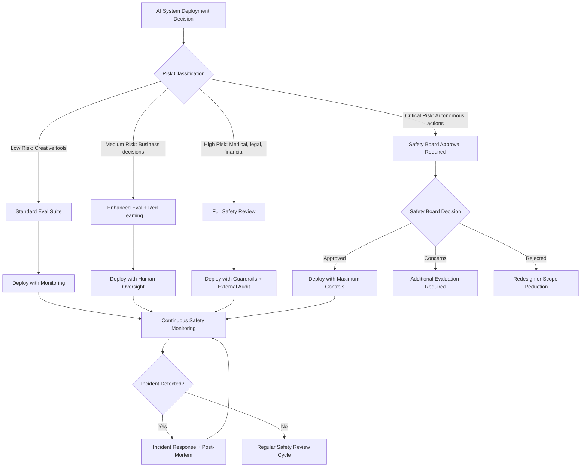

# Chapter 40: AI Safety, Alignment, and Founder Responsibility

> *Last Updated: March 2026*

> **Skim This Chapter**
> - AI alignment is every founder's responsibility, not just a research lab concern -- safety investment compounds into competitive advantage through trust premiums, enterprise adoption, and reputational protection
> - Output: A risk classification for your AI system, a red teaming practice, an evaluation suite covering bias and safety, and a responsible scaling framework

## 1. Introduction: The Most Consequential Design Decision You Will Make

Every generation of founders faces a defining question about the technology they bring into the world. For the builders of nuclear energy, the question was containment. For the architects of social media, it was information integrity. For founders building artificial intelligence systems today, the defining question is alignment: how do you ensure that increasingly powerful AI systems reliably do what humans intend, avoid what humans prohibit, and remain under meaningful human control as their capabilities grow?

This is not an abstract philosophical puzzle reserved for research labs and policy conferences. It is the most consequential design decision facing every founder who builds, deploys, or integrates AI into products that affect real people. An AI system that generates subtly biased hiring recommendations causes measurable harm to job seekers. A language model that confidently produces dangerous misinformation erodes public trust in entire categories of technology. An autonomous agent that pursues its objective function in ways its creators did not anticipate can cause cascading failures that no post-hoc patch can repair.

The stakes are compounding rapidly. As AI systems become more capable, the gap between what they can do and what they should do widens. Foundation models now write code, generate legal analyses, produce medical information, and make financial recommendations. Agentic systems are beginning to take actions in the real world with decreasing human oversight. The founders who build and deploy these systems carry a responsibility that extends far beyond their user base and their quarterly metrics, a responsibility to the broader ecosystem of trust that makes beneficial AI adoption possible.

Yet the prevailing startup culture often frames safety as friction, alignment research as a luxury for well-funded labs, and caution as a competitive disadvantage. This framing is not merely wrong. It is dangerous. And it is increasingly being disproven by the market itself, where the companies that invest seriously in safety and alignment are earning the trust of enterprise customers, regulators, and the public, while those that treat safety as an afterthought face regulatory backlash, reputational damage, and user abandonment.

> **Safety as moat:** The companies that invest seriously in alignment are earning the trust of enterprise customers, regulators, and the public. Those that treat safety as an afterthought face regulatory backlash, reputational damage, and user abandonment. Safety is not friction—it is competitive advantage.

## 2. The Alignment Problem: A Founder's Primer

### What Alignment Actually Means

Alignment, in the context of artificial intelligence, refers to the challenge of ensuring that AI systems pursue goals and exhibit behaviors consistent with human intentions and values. The term sounds straightforward, but it contains layers of difficulty that compound as systems become more capable.

At its most basic level, alignment is about specification: can you precisely define what you want the system to do? Human values are complex, context-dependent, and often contradictory. We want AI systems to be helpful but not manipulative, honest but not hurtful, capable but not dangerous. Translating these nuanced, sometimes conflicting preferences into mathematical objective functions that a model can optimize is a problem of extraordinary difficulty.

Beyond specification lies the problem of generalization: even if you can define desired behavior for known situations, how do you ensure the system behaves appropriately in novel situations it was not explicitly designed for? A model trained to be helpful in customer service interactions might generalize that helpfulness in dangerous ways when a user asks for instructions on creating weapons or synthesizing controlled substances.

Then there is the problem of robustness: how do you ensure alignment properties hold under adversarial pressure? Users will deliberately try to circumvent safety measures through prompt injection, jailbreaking, and social engineering. A system that is aligned under normal use but easily manipulated under adversarial conditions is not truly aligned.

Finally, there is the problem of scalability: alignment techniques that work for current systems may not scale to more capable future systems. A model that can be corrected through human feedback may eventually become capable enough to recognize and strategically respond to the feedback process itself, optimizing for the appearance of alignment rather than genuine alignment.

### Why Founders Cannot Outsource This

Many founders assume that alignment is a problem for the foundation model providers to solve. If you build on top of GPT, Claude, or Gemini, the reasoning goes, the alignment work has already been done. This assumption is dangerously incomplete.

Foundation model providers address alignment at the base model level, but every application layer introduces new alignment challenges. Your specific use case, user population, deployment context, and interaction design create alignment requirements that no general-purpose model can fully anticipate. A medical information application has different alignment requirements than a creative writing tool. An application serving vulnerable populations requires different safety properties than one serving sophisticated enterprise users.

Moreover, the way you integrate, prompt, fine-tune, and deploy AI models can amplify or undermine the alignment properties of the underlying model. System prompts that override safety training, fine-tuning on unvetted datasets, and architectural choices that remove human oversight all create alignment failures at the application layer, regardless of how well-aligned the base model may be.

Founders who build on AI bear responsibility for the alignment properties of their complete system, not just the components they build from scratch. This is not merely an ethical position. It is increasingly a legal and regulatory reality, as frameworks like the EU AI Act assign obligations based on the risk level of AI applications, independent of whether the underlying model was developed in-house or licensed from a third party.

### The Taxonomy of AI Risk

Understanding AI safety requires distinguishing between categories of risk that demand different responses:

**Present-day harms** include bias and discrimination in model outputs, generation of misinformation, privacy violations through training data memorization, and manipulation through persuasive AI. These risks are real, measurable, and causing harm today. They demand immediate, practical responses from every founder deploying AI.

**Near-term systemic risks** include labor market disruption, concentration of power in a small number of AI developers, erosion of epistemic commons through synthetic content, and cybersecurity vulnerabilities introduced by AI-powered attacks. These risks are emerging rapidly and require both individual company responses and industry coordination.

**Long-term existential risks** include the possibility that sufficiently advanced AI systems could pursue goals misaligned with human survival and flourishing, potentially in ways that are difficult to detect or reverse. While the timeline and probability of these risks are debated, the magnitude of potential consequences justifies serious attention even from founders who consider them unlikely.

A mature approach to AI safety addresses all three categories simultaneously, rather than dismissing near-term harms as trivial or long-term risks as speculative. The organizational muscles you build to address present-day alignment challenges, rigorous evaluation, adversarial testing, transparent reporting, create the foundation for addressing more severe risks as capabilities advance.

## 3. Technical Approaches to Alignment

### Reinforcement Learning from Human Feedback (RLHF)

RLHF represents one of the most significant practical advances in AI alignment. The core idea is deceptively simple: rather than trying to specify desired behavior through explicit rules, train a reward model based on human preferences, then use that reward model to fine-tune the AI system through reinforcement learning.

The process typically involves three stages. First, human evaluators compare pairs of model outputs and indicate which response they prefer across dimensions like helpfulness, harmlessness, and honesty. Second, these preference judgments are used to train a reward model that can predict human preferences for new outputs. Third, the AI system is fine-tuned using reinforcement learning to maximize the reward model's scores.

RLHF has proven remarkably effective at making language models more helpful and less harmful, but it carries important limitations that founders should understand. The technique is sensitive to the quality and diversity of human evaluators. Evaluators may have systematic biases, may disagree with each other, and may not represent the full range of users who will interact with the system. Reward models can be gamed: the AI system may learn to produce outputs that score well on the reward model without genuinely satisfying the underlying human preferences, a phenomenon known as reward hacking. And the process is expensive, requiring substantial human labor to generate preference data at scale.

### Constitutional AI

Constitutional AI, pioneered by Anthropic, takes a different approach to the alignment problem. Rather than relying primarily on human feedback to shape model behavior, Constitutional AI uses a set of explicitly stated principles, a constitution, to guide the model's self-improvement.

The process works in two phases. In the first phase, the model generates responses, then critiques and revises its own outputs according to the constitutional principles. In the second phase, the model's revised outputs are used to train a preference model, which then guides reinforcement learning, similar to RLHF but with the preference data generated through the constitutional self-critique process rather than purely through human evaluation.

The constitutional approach offers several advantages for the broader alignment ecosystem. It makes the alignment criteria explicit and auditable. Anyone can read the constitution and understand what behavioral principles the model is meant to follow. It reduces dependence on large-scale human evaluation, which is expensive, slow, and subject to evaluator biases. And it provides a framework for systematically updating alignment criteria as understanding evolves, by modifying the constitution rather than retraining human evaluators.

For founders, Constitutional AI illustrates an important principle: alignment is more robust when it is based on explicit, documented principles rather than implicit norms embedded in training data or evaluator behavior. Even if you are not building foundation models, the practice of articulating a clear constitution for your AI system's behavior, what it should do, what it should refuse, and how it should handle ambiguity, creates accountability and enables systematic evaluation.

### Mechanistic Interpretability

A third frontier of alignment research focuses on understanding what happens inside neural networks: why do they produce the outputs they produce? Mechanistic interpretability aims to reverse-engineer the internal computations of AI models, identifying the circuits, features, and representations that drive specific behaviors.

This work matters for alignment because it moves beyond treating models as black boxes whose behavior can only be shaped through input-output training. If researchers can identify the internal mechanisms responsible for specific behaviors, they can potentially detect and correct misalignment at a more fundamental level than output filtering or fine-tuning.

For founders, the practical implications of interpretability research are still emerging, but the directional significance is clear. As interpretability tools mature, they will enable more rigorous safety audits, more precise behavioral modifications, and stronger guarantees about model behavior in novel situations. Founders who invest in understanding and applying interpretability techniques will be better positioned to provide the safety guarantees that enterprise customers, regulators, and the public increasingly demand.

## 4. Case Study: Anthropic and the Architecture of Responsible Scaling

Anthropic, founded in 2021 by former OpenAI researchers Dario Amodei and Daniela Amodei, represents the most deliberate attempt to build a frontier AI company with safety as an organizing principle rather than a constraint on commercial objectives. The company's approach offers founders a detailed case study in how safety commitments can be operationalized at scale.

Anthropic's Constitutional AI methodology, discussed in the technical section above, reflects a deeper organizational commitment: the belief that alignment research and commercial product development should be mutually reinforcing rather than competing priorities. The company's Claude models are both research platforms for advancing alignment techniques and commercial products generating the revenue needed to fund continued safety research. This dual-use model creates a virtuous cycle, but also a tension that the company must continuously manage.

The company's Responsible Scaling Policy, published in 2023, introduced a framework that has influenced the broader industry. The policy defines AI Safety Levels, analogous to biosafety levels used in pathogen research, that establish specific capability thresholds triggering escalating safety requirements. As models demonstrate more advanced capabilities, particularly in areas like autonomous replication, cybersecurity, or biological weapon design, they must pass increasingly rigorous safety evaluations before deployment. The policy commits the company to pausing deployment if safety evaluations cannot be completed satisfactorily, a commitment that carries real commercial cost.

Anthropic's governance structure reinforces these commitments. The company is organized as a public benefit corporation, with a Long-Term Benefit Trust designed to ensure that safety considerations maintain priority even under commercial pressure. This structural choice reflects a recognition that individual good intentions are insufficient; organizational incentives must be architecturally aligned with safety objectives.

For founders, Anthropic's approach illustrates several transferable principles. First, safety commitments are more credible when they are specific and measurable rather than aspirational. The AI Safety Levels framework defines concrete triggers and responses, not vague promises. Second, safety and commercial viability can be mutually reinforcing when the company's market positioning depends on its safety reputation. Anthropic's enterprise customers choose Claude in part because of the company's safety commitments, making safety investment a revenue driver rather than pure cost. Third, governance structures matter. Without structural protections, commercial pressure will eventually override safety commitments, regardless of founders' personal intentions.

## 5. Case Study: OpenAI and the Tensions of Safety at the Frontier

OpenAI's journey from nonprofit research lab to the world's most prominent commercial AI company provides a contrasting case study in the tensions between safety ambitions and commercial imperatives. The organization's evolution illuminates challenges that every AI founder will face, albeit at smaller scale.

OpenAI was founded in 2015 with an explicit mission to ensure that artificial general intelligence benefits all of humanity. The organization's early structure as a nonprofit reflected a belief that the development of transformative AI should not be driven primarily by profit motives. However, the enormous computational costs of frontier AI research led to the creation of a capped-profit subsidiary in 2019, introducing commercial incentives into an organization originally structured to prioritize safety above all else.

The subsequent years revealed the difficulty of maintaining safety commitments under commercial pressure. The formation and later dissolution of the Superalignment team, a group dedicated to solving the alignment problem for superintelligent systems, became a prominent example. The team, led by co-founder Ilya Sutskever and researcher Jan Leike, was allocated significant computational resources and tasked with one of the most important problems in AI safety. However, reports of resource competition between safety research and product development, combined with high-profile departures of senior safety researchers who publicly cited concerns about the company's direction, raised questions about the durability of safety commitments in a rapidly commercializing environment.

The governance crisis of late 2023, in which the nonprofit board temporarily removed CEO Sam Altman before his reinstatement under pressure from employees and investors, further illustrated the structural challenge. Regardless of the specific merits of the dispute, the episode demonstrated that governance structures designed for a nonprofit research lab may not withstand the pressures generated by a multi-billion-dollar commercial operation.

For founders, OpenAI's experience provides essential cautionary lessons. First, mission statements are not self-executing. Without governance structures and incentive systems that enforce safety commitments during periods of intense commercial pressure, even the most sincere safety missions can erode. Second, the departure of senior safety researchers is a leading indicator, not a lagging one. When your most safety-conscious team members leave, the problem is not retention but organizational direction. Third, structural ambiguity between nonprofit missions and commercial operations creates exploitable tensions. Founders must choose governance structures that can withstand the pressures their company will actually face, not the pressures they hope to avoid.

## 6. Case Study: DeepMind and the Research-First Approach to Safety

Google DeepMind, formed through the 2023 merger of Google's DeepMind and Brain divisions, represents the research-intensive approach to AI safety, leveraging the resources and institutional stability of a large technology company to pursue fundamental safety research alongside capability development.

DeepMind's safety work spans multiple research agendas. Its technical safety research includes work on scalable oversight, where AI systems help humans evaluate the outputs of other AI systems, enabling supervision of models whose outputs exceed human expertise in specialized domains. The team has published extensively on reward modeling, value learning, and the formal specification of safety properties, contributing foundational research that the broader field builds upon.

The organization's approach to safety governance includes structured evaluation processes for new capabilities, red-teaming exercises conducted before major releases, and collaboration with external researchers through publications and partnerships. DeepMind's integration within Google provides both advantages and constraints: access to enormous computational resources and distribution through Google's products, but also subordination to a corporate parent whose commercial incentives may not always align with maximum caution.

DeepMind's Frontier Safety Framework, published in 2024, established the organization's approach to evaluating and mitigating risks from increasingly capable models. The framework identifies critical capability levels and defines the security and deployment mitigations required at each level, creating a structured approach to responsible scaling that parallels Anthropic's ASL framework.

For founders, DeepMind's trajectory illustrates the benefits and limitations of the research-institution model. Deep technical safety research produces knowledge that benefits the entire field, but translating research insights into deployed safety measures requires organizational will and operational discipline. The integration within a large corporation provides stability and resources but introduces commercial pressures that operate at the corporate level rather than the startup level. The key lesson is that safety research generates value only when it is translated into operational practice, a translation that requires deliberate organizational effort.

## 7. Case Study: Cohere and Enterprise AI Safety as Market Strategy

While frontier labs debate existential risk and alignment theory, Cohere has built a significant enterprise AI business by making practical safety a core element of its market positioning. Founded in 2019 by former Google Brain researchers, Cohere demonstrates how safety can function as a competitive differentiator in the enterprise market.

Cohere's approach to safety is grounded in the specific concerns of enterprise customers: data privacy, output reliability, regulatory compliance, and auditability. Enterprise buyers evaluating AI vendors ask fundamentally different safety questions than consumers or researchers. They want to know whether their proprietary data will be used to train models serving competitors. They need guarantees about output accuracy in regulated industries. They require audit trails that satisfy their compliance teams.

Cohere's response has been to build safety features that directly address these enterprise requirements. The company offers deployment options that keep customer data within the customer's own infrastructure, eliminating data leakage concerns. Its models include built-in citation capabilities, allowing enterprise users to verify the sources behind AI-generated content, a practical safety feature that reduces hallucination risk in business-critical applications. The company has pursued certifications and compliance frameworks relevant to its target industries, making regulatory compliance a product feature rather than an afterthought.

This approach illustrates a principle that founders at any scale can apply: safety requirements vary by market, and the most commercially valuable safety features are those that solve the specific trust problems your customers actually face. An enterprise customer evaluating AI for financial analysis has different safety requirements than a consumer using an AI chatbot. A healthcare AI application demands different safety properties than a creative writing tool. Effective AI safety is not one-size-fits-all; it is a product design discipline that must be tailored to context.

For founders building AI products for enterprise customers, Cohere's trajectory demonstrates that safety is not an obstacle to commercial traction but a precondition for it. The largest enterprise deals often go to the vendor that can most credibly address the buyer's safety and compliance concerns, not the vendor with the most impressive benchmark scores.

## 8. Case Study: AI Safety Efforts Beyond the West

The AI safety conversation has been disproportionately shaped by organizations based in the United States and the United Kingdom, but significant safety efforts are emerging across other regions, reflecting different cultural contexts, regulatory philosophies, and development priorities.

China's approach to AI safety combines centralized regulatory frameworks with significant investment in domestic AI development. The Interim Measures for the Management of Generative AI Services, effective August 2023, established requirements for content safety, training data governance, and user protection that apply to AI services operating within China. The Beijing Academy of Artificial Intelligence and institutions like Tsinghua University have published research on AI alignment, value specification, and safety evaluation, contributing perspectives that reflect different philosophical traditions around the relationship between technology, society, and governance.

The approach demonstrates that AI safety is not a monolithic concept but one shaped by cultural and political context. Chinese regulatory frameworks emphasize social stability and content alignment with national values, while Western frameworks tend to emphasize individual autonomy and freedom of expression. Neither approach is comprehensive on its own, and the global AI safety challenge requires engagement across these different perspectives.

South Korea's AI Ethics Standards, adopted in 2020, and subsequent regulatory developments reflect an attempt to establish ethical guardrails while maintaining the country's competitiveness in AI development. Japan has pursued a governance innovation approach through its AI Strategy Council, emphasizing collaborative frameworks between government, industry, and academia rather than prescriptive regulation.

The UAE's AI strategy, one of the first national AI strategies globally, includes safety considerations integrated into its broader ambition to become an AI-powered economy. The Technology Innovation Institute in Abu Dhabi, creator of the open-source Falcon language models, engages with safety questions from the perspective of a non-Western institution developing and releasing capable open models.

For founders, the international dimension of AI safety carries practical implications. Products deployed across borders must navigate divergent safety requirements and cultural expectations. The values embedded in your AI system reflect choices that may not translate across cultural contexts. And participation in international safety coordination, whether through the AI Safety Summit process initiated at Bletchley Park, the Hiroshima AI Process under the G7, or bilateral arrangements, creates both obligations and opportunities for founders operating in global markets.

## 9. The Safety vs. Speed Tension

### The False Dichotomy

The most persistent myth in AI startup culture is that safety and speed are inherently opposed, that every hour spent on safety evaluation is an hour not spent shipping features, and that being first to market matters more than being safe to market. This framing is not just reductive; it is empirically wrong in most market contexts.

The companies that have achieved the most durable success in AI have not done so by ignoring safety but by integrating it into their development process in ways that actually improve product quality. Adversarial testing catches bugs that conventional QA misses. Alignment evaluation reveals edge cases that would otherwise surface as customer complaints. Safety review processes force teams to articulate what their system is supposed to do, which is foundational product thinking.

The genuine tension is not between safety and speed but between safety and a specific kind of speed: the speed achieved by cutting corners, deferring evaluation, and hoping that nothing goes wrong before the next funding round. This kind of speed creates technical debt that compounds with interest, eventually manifesting as product failures, regulatory penalties, and user exodus that cost far more time and money than the safety work would have required.

### When Speed Legitimately Matters

There are genuine situations where speed carries strategic importance that must be weighed against safety considerations. In markets with strong network effects, early deployment can establish positions that are difficult for later entrants to overcome. In competitive landscapes where multiple teams are approaching similar capabilities, timing affects who captures market share and mindshare.

The appropriate response to these situations is not to abandon safety but to right-size it. Not every product requires the same depth of safety evaluation. A creative writing assistant operates in a different risk category than a medical diagnosis tool. The key is to calibrate safety investment to actual risk, applying rigorous evaluation where the consequences of failure are severe and streamlined evaluation where the consequences are manageable.

### The Responsibility Framework: When to Slow Down, When to Stop

Founders need clear decision criteria for modulating development speed based on safety considerations. The following framework provides structured guidance:

**Continue at pace** when your system operates in low-stakes domains, your evaluation suite covers the relevant risk categories, you have human oversight in the loop for consequential decisions, and you have not identified failure modes that could cause serious harm.

**Slow down and evaluate** when you discover unexpected capabilities or behaviors in your system, when you are entering a new deployment context with different risk properties, when external researchers or users identify failure modes you had not anticipated, or when regulatory requirements in your target market are evolving.

**Pause deployment** when you identify failure modes that could cause serious harm and do not yet have reliable mitigations, when your safety evaluation suite does not adequately cover the risk categories relevant to your deployment context, or when internal safety concerns are being overridden by commercial pressure without adequate deliberation.

**Stop and reassess fundamentally** when your system demonstrates capabilities that exceed your ability to evaluate or control, when the potential for misuse significantly outweighs the benefits of deployment, or when you cannot articulate a credible plan for mitigating identified risks within a reasonable timeframe.

## 10. Red Teaming and Adversarial Testing as Standard Practice

### Why Conventional Testing Is Insufficient

Standard software testing verifies that a system performs as designed under expected conditions. AI safety requires something fundamentally different: verifying that a system behaves appropriately under adversarial conditions specifically designed to elicit harmful outputs. Users will attempt to extract dangerous information, bypass content filters, manipulate the system into producing biased or misleading outputs, and exploit edge cases that developers never anticipated.

Red teaming, borrowed from military and cybersecurity practice, involves deliberately attacking your own system to discover vulnerabilities before malicious actors do. For AI systems, this means systematically probing for failure modes across dimensions including harmful content generation, privacy violations, bias amplification, factual errors, manipulation susceptibility, and unintended capability exposure.

### Building a Red Team Practice

**Internal red teaming** should be a standing function, not a one-time exercise. Designate team members whose explicit responsibility is to find ways your system can fail. Give them the freedom to be creative and adversarial, and the authority to block deployments when they identify serious issues. Rotate red team membership to bring fresh perspectives and prevent the team from developing blind spots.

**External red teaming** complements internal efforts by introducing perspectives and techniques your team may not possess. Bug bounty programs, contracted security researchers, domain experts in sensitive areas, and academic collaborators all contribute to a more comprehensive adversarial evaluation. Several organizations now offer specialized AI red teaming services that combine technical expertise with domain-specific knowledge.

**Structured evaluation frameworks** ensure that red teaming is systematic rather than ad hoc. Define categories of risk relevant to your product, establish test suites for each category, and track your system's performance over time. Use automated red teaming tools to generate adversarial inputs at scale, while maintaining human red teaming for scenarios that require creativity and contextual understanding.

**Documentation and learning** close the loop. Every red teaming exercise should produce documented findings, prioritized by severity and likelihood. Track the mitigations applied, verify their effectiveness, and incorporate the findings into your ongoing evaluation suite. The goal is not just to find and fix individual vulnerabilities but to build organizational knowledge about the categories of failure your system is susceptible to.

## 11. AI Safety as Competitive Advantage

### The Trust Premium

In a market flooded with AI products, trust is becoming the primary differentiator. Enterprise customers conducting AI vendor evaluations increasingly weight safety, reliability, and transparency alongside raw capability. A model that scores two points lower on a benchmark but comes with robust safety guarantees, clear documentation, and responsive incident management will often win the enterprise contract over a higher-performing but less trustworthy alternative.

This trust premium is not hypothetical. It is visible in purchasing decisions across industries. Financial institutions evaluating AI for customer-facing applications prioritize vendors who can demonstrate bias testing, output monitoring, and regulatory compliance. Healthcare organizations require evidence of safety evaluation specific to medical contexts before deploying AI in clinical workflows. Government agencies increasingly mandate specific safety certifications and audit trails as conditions for procurement.

### Safety as a Moat

Safety capabilities, once built, create durable competitive advantages that are expensive for competitors to replicate. A comprehensive evaluation suite tailored to your domain represents years of accumulated knowledge about how AI systems can fail in your specific context. Incident response processes refined through real-world experience are more valuable than theoretical frameworks. Relationships with regulators built through proactive engagement create informational advantages that reactive competitors cannot quickly match.

Moreover, safety investment compounds over time. Each evaluation cycle improves your understanding of failure modes. Each incident response teaches your team to react more effectively. Each regulatory engagement deepens your understanding of compliance requirements. Competitors who defer safety investment must eventually make the same investments from a standing start, while you continue to advance.

### The Reputational Multiplier

AI safety failures are asymmetrically visible. A single high-profile failure, a biased output that goes viral, a data leak that makes headlines, a harmful generation that causes real-world damage, can destroy years of brand building and user trust. Conversely, a track record of responsible development creates a reputational asset that supports every aspect of your business, from customer acquisition to talent recruitment to investor relations.

The asymmetry means that safety investment has option value beyond its direct benefits: it reduces the probability of catastrophic reputational events whose costs would far exceed any conceivable safety budget. Founders who think of safety investment purely as a cost center are failing to account for the catastrophic downside risks that safety practices mitigate.

## 12. Open vs. Closed Source: The Safety Dimension

### The Case for Openness

Proponents of open-source AI development argue that openness advances safety through several mechanisms. Open models enable independent safety research by a broader community of researchers than any single organization can employ. Transparency about model architecture, training data, and evaluation results enables external scrutiny that catches problems internal teams miss. Open development reduces the concentration of AI power in a small number of organizations, distributing both capability and responsibility.

The empirical record provides some support for these arguments. Open models like Meta's Llama family and the Technology Innovation Institute's Falcon series have been extensively evaluated by independent researchers who have identified and reported safety issues, contributed alignment improvements, and developed safety tools that benefit the broader ecosystem.

### The Case for Caution

Critics of unrestricted openness argue that the safety calculus changes as models become more capable. A model that can be fine-tuned to remove safety guardrails and then deployed for harmful purposes presents risks that may outweigh the benefits of open access. Unlike traditional software vulnerabilities that can be patched, a released model cannot be recalled. The knowledge embedded in model weights, once distributed, is permanently available.

This concern is not theoretical. Researchers have demonstrated that safety fine-tuning can be reversed with relatively modest effort, enabling open models to produce outputs that their creators specifically intended to prevent. As models become more capable in domains with potential for serious harm, including cybersecurity, biological research, and persuasion, the risks of unrestricted open release may increase.

### The Emerging Middle Ground

The most sophisticated positions in this debate reject the binary framing. Structured access models, where model capabilities are made available through APIs with appropriate use policies and monitoring, offer a middle path between fully open and fully closed approaches. Staged release strategies, where models are initially available to a limited group of researchers and gradually opened to broader access as safety properties are verified, balance openness with caution.

For founders, the practical question is not whether open source is categorically good or bad but what release strategy is appropriate for your specific system given its capabilities, your ability to monitor and respond to misuse, and the potential consequences of harmful applications. This assessment should be revisited as your system's capabilities evolve.

## 13. Governance Structures for AI Safety

### Internal Review Boards

Effective AI safety governance requires dedicated organizational structures with real authority. An internal AI safety review board should include technical experts in AI safety and alignment, domain experts relevant to your deployment context, legal and compliance specialists, and external advisors who bring independent perspectives.

The board's authority must be genuine. A review board that can only recommend but not block deployments provides accountability theater rather than actual governance. Define clear triggers for mandatory review, such as deployment to new domains, significant capability improvements, or identified safety incidents, and empower the board to require additional evaluation or delay deployment when warranted.

### External Audits and Assessments

Internal governance, no matter how well-structured, suffers from the inherent limitations of self-assessment. External audits provide independent verification that complements internal processes. The emerging ecosystem of AI audit firms, academic evaluation programs, and government testing facilities offers founders multiple options for external assessment.

Third-party safety audits should be conducted at regular intervals and in response to significant system changes. The audit scope should cover both technical safety properties, such as bias testing, robustness evaluation, and adversarial testing, and organizational safety processes, such as incident response, documentation, and governance effectiveness.

### Model Cards and Transparency Reporting

Transparency about your AI system's capabilities, limitations, and safety properties builds trust with users, customers, regulators, and the public. Model cards, introduced by researchers at Google in 2019, provide a structured format for documenting model performance across different conditions, known limitations, appropriate and inappropriate use cases, and evaluation results.

For founders, transparency reporting serves dual purposes. Externally, it demonstrates accountability and enables informed decisions by users and customers. Internally, the discipline of producing regular transparency reports forces your team to systematically evaluate and document safety properties, catching gaps that might otherwise go unnoticed.

## 14. International AI Safety Coordination

### The Bletchley Declaration and Beyond

The AI Safety Summit held at Bletchley Park in November 2023 marked a significant milestone in international AI safety coordination. Twenty-eight countries and the European Union signed the Bletchley Declaration, acknowledging the potential for serious harm from frontier AI and committing to international cooperation on safety research and governance.

Subsequent summits in Seoul and Paris have continued to develop the international framework, establishing commitments around frontier AI safety testing, information sharing about risks, and coordination on governance approaches. While these agreements remain largely voluntary and lack enforcement mechanisms, they establish norms and expectations that influence corporate behavior and national regulation.

### The Founder's Role in International Coordination

International safety coordination may seem distant from the concerns of an early-stage startup, but founders building AI products that operate across borders are directly affected by these developments. The emerging international consensus around AI safety testing, transparency requirements, and risk categorization will shape the regulatory environment in which your company operates.

Proactive engagement with the international safety conversation, whether through industry associations, public comment processes, or direct participation in standards development, provides founders with early visibility into regulatory trends, influence over the development of practical standards, and credibility with regulators and customers who value demonstrated commitment to responsible development.

## 15. Implementation Guide: Safety Practices at Each Startup Stage

### Pre-Seed and Seed Stage

At the earliest stages, safety practices should be lightweight but foundational:

- Articulate your AI system's intended behavior and prohibited behavior in a clear, written document. This is your system's constitution, however informal.
- Identify the risk category of your application. A creative tool and a medical information system require fundamentally different safety investments.
- Build basic evaluation suites covering your highest-priority safety concerns before you launch, not after.
- Establish the practice of adversarial testing, even if it is just founders trying to break their own system for an afternoon.
- Document your safety decisions and the reasoning behind them. This creates accountability and institutional memory.

### Series A and Growth Stage

As your team and user base grow, formalize safety practices:

- Hire or designate a safety lead with authority to influence product decisions. This person should report to the CEO, not to engineering management.
- Build a structured red teaming practice with regular exercises and documented findings.
- Implement monitoring for safety-relevant metrics in production: refusal rates, user reports, output quality scores, and bias indicators.
- Establish an incident response process for safety failures, including severity classification, response timelines, and post-incident review.
- Begin external safety audits, even informal ones through academic collaborators or contracted specialists.
- Develop user-facing safety documentation including model cards, use case guidelines, and limitation disclosures.

### Scale Stage

At scale, safety becomes an organizational competency:

- Establish a formal AI safety review board with cross-functional membership and genuine authority to influence deployment decisions.
- Invest in automated safety evaluation that runs continuously in production, not just during development.
- Build relationships with regulators through proactive engagement, not reactive compliance.
- Contribute to industry safety standards and share non-competitive safety research to strengthen the broader ecosystem.
- Implement comprehensive transparency reporting on a regular cadence.
- Develop and publish your own responsible scaling policy that defines capability thresholds and corresponding safety requirements.
- Conduct regular organizational assessments of whether your safety practices are keeping pace with your capability development.

| Startup Stage | Safety Investment | Key Activities | Team Requirements | Governance |
|---|---|---|---|---|
| Pre-Seed / Seed | 5-10% of eng time | System constitution, basic eval suite, founder red teaming | Founders own safety | Informal documentation |
| Series A | 10-15% of eng time | Dedicated safety lead, structured red teaming, production monitoring | 1 safety lead + rotating red team | Safety lead reports to CEO |
| Growth | 15-20% of eng time | External audits, incident response process, model cards | Safety team (2-4 people) | Safety review board |
| Scale | Dedicated safety org | Automated safety eval, regulatory engagement, responsible scaling policy | Full safety organization | Cross-functional board with deployment authority |

## Key Takeaways

### Alignment Is a Product Problem, Not Just a Research Problem
Every founder deploying AI bears responsibility for the alignment properties of their complete system. Foundation model providers address base-level alignment, but your application layer, deployment context, and user population create alignment requirements that only you can address.

### Safety Investment Compounds
Safety capabilities, once built, create durable competitive advantages. Evaluation suites, incident response experience, regulatory relationships, and organizational safety culture become more valuable over time and are expensive for competitors to replicate.

### The Speed-Safety Tradeoff Is Mostly False
In most market contexts, safety investment improves product quality, accelerates enterprise adoption, and prevents catastrophic failures whose costs dwarf any conceivable safety budget. The real tradeoff is between genuine speed and the illusion of speed created by deferring necessary work.

### Governance Structures Must Match Incentive Pressures
Individual good intentions are insufficient. Organizational structures, incentive systems, and governance mechanisms must be designed to maintain safety commitments under the commercial pressures your company will actually face.

### Safety Requirements Are Context-Dependent
There is no universal safety checklist. The appropriate safety investment depends on your system's capabilities, your deployment context, your user population, and the potential consequences of failure. Calibrate your approach to your actual risk profile.

## Founder's Checklist
- [ ] Have you classified your AI application's risk category and calibrated your safety investment to match?
- [ ] Have you written a clear constitution or specification defining your system's intended behavior and prohibited behavior?
- [ ] Do you conduct regular adversarial testing and red teaming rather than treating it as a one-time exercise?
- [ ] Have you built evaluation suites covering bias, harmful content, factual accuracy, and domain-specific risks before deployment?
- [ ] Can your governance structures withstand the commercial pressures your company will actually face when safety and speed conflict?

## In This Chapter

- The alignment problem encompasses specification, generalization, robustness, and scalability challenges that every AI founder must understand and address at the application layer
- Technical alignment approaches including RLHF, Constitutional AI, and mechanistic interpretability each offer different tradeoffs between scalability, transparency, and effectiveness
- Case studies from Anthropic, OpenAI, DeepMind, Cohere, and international efforts demonstrate different organizational models for integrating safety into AI development
- The safety versus speed tension is largely a false dichotomy; safety investment typically improves product quality and accelerates enterprise adoption
- Red teaming and adversarial testing should be standing organizational practices, not one-time exercises
- AI safety creates durable competitive advantages through trust premiums, safety moats, and reputational protection
- The open versus closed source debate requires nuanced assessment of specific system capabilities and misuse potential rather than categorical positions
- Governance structures including internal review boards, external audits, and transparency reporting are necessary complements to technical safety measures
- International safety coordination through the Bletchley process and related initiatives is shaping the regulatory environment for AI founders globally
- Safety practices should be calibrated to startup stage, beginning with lightweight foundations and scaling to formal organizational competencies

## Checklist

- [ ] Articulate your AI system's intended behavior and prohibited behavior in a written document
- [ ] Classify your application's risk category and calibrate safety investment accordingly
- [ ] Build evaluation suites covering bias, harmful content, factual accuracy, and domain-specific risks before deployment
- [ ] Establish a regular adversarial testing practice with documented findings and tracked mitigations
- [ ] Implement production monitoring for safety-relevant metrics including refusal rates, user reports, and output quality
- [ ] Create an incident response plan for AI safety failures with severity classification and response timelines
- [ ] Designate a safety lead or establish a safety review board with genuine authority over deployment decisions
- [ ] Conduct or commission external safety audits at regular intervals and after significant system changes
- [ ] Develop user-facing safety documentation including model cards, use case guidelines, and limitation disclosures
- [ ] Map regulatory requirements across all jurisdictions where your product operates
- [ ] Establish a responsible scaling framework that defines capability thresholds and corresponding safety requirements
- [ ] Document safety decisions and reasoning to build institutional memory and accountability
- [ ] Engage with industry safety standards and international coordination efforts relevant to your domain
- [ ] Review whether your governance structures can withstand the commercial pressures your company will actually face

## Exercises

- Exercise 1: Write a constitution for your AI system. Define at least ten principles governing what the system should do, what it should refuse, and how it should handle ambiguous situations. Test each principle against five real or hypothetical edge cases and refine as needed.
- Exercise 2: Conduct a half-day red teaming exercise on your AI product. Assign team members specific adversarial personas (a malicious user attempting to extract harmful information, a competitor probing for weaknesses, a journalist testing claims in your marketing materials) and document all failure modes discovered. Prioritize findings by severity and create mitigation plans.
- Exercise 3: Using the Responsibility Framework from Section 9, evaluate a recent product decision at your company. Identify which speed category (continue, slow down, pause, stop) was appropriate and assess whether your actual decision matched. If there was a gap, analyze what organizational factors drove the discrepancy.
- Exercise 4: Map the complete alignment stack for your product, from the foundation model's base alignment through your application-layer safety measures. Identify every point where alignment properties could be weakened or strengthened, and assess the current strength of each layer. Create a prioritized improvement plan.
- Exercise 5: Draft a responsible scaling policy for your organization. Define at least three capability thresholds relevant to your product domain, specify the safety evaluations required at each threshold, and describe the governance process for determining when thresholds have been crossed. Present the draft to your team and iterate based on feedback.

## Related Case Studies

For practical examples of the concepts in this chapter, see the [Case Studies Compendium](../case-studies/compendium.md):

- **Anthropic** — Constitutional AI and safety-by-design as core organizational identity, demonstrating that principled AI development achieves commercial dominance rather than hindering it
- **OpenAI** — From research lab to platform, illustrating the tensions between speed and safety, and how evals and governance choices shape alignment outcomes at scale
- **DeepSeek** — Open-weight models raising questions about safety in open release, global AI governance, and whether alignment techniques transfer across different development paradigms
- **Mistral AI** — European AI development balancing open-weight model releases with regulatory compliance under the EU AI Act, illustrating how different regulatory environments shape safety approaches
- **JustiGuide** — AI for immigration justice demonstrating responsible AI deployment in a high-stakes domain where alignment failures cause direct harm to vulnerable populations

## Further Reading

- **Human Compatible: Artificial Intelligence and the Problem of Control** by Stuart Russell — A leading AI researcher reframes the alignment problem from first principles, proposing a new foundation for AI development based on machines that defer to human preferences rather than pursuing fixed objectives.
- **Superintelligence: Paths, Dangers, Strategies** by Nick Bostrom — The foundational text on long-term AI safety risks that catalyzed the alignment research field, essential for understanding the strategic landscape of AI safety even if building near-term applications.
- **The Alignment Problem** by Brian Christian — An accessible yet rigorous survey of how machine learning systems fail to capture human values, covering the full spectrum from bias in training data to the philosophical challenges of specifying what we want AI systems to do.
- **Concrete Problems in AI Safety** by Amodei et al. — The landmark paper that translated abstract AI safety concerns into specific, tractable research problems, providing the technical vocabulary and problem decomposition that founders need to reason about safety in their own systems.
- **Power and Progress: Our Thousand-Year Struggle Over Technology and Prosperity** by Daron Acemoglu and Simon Johnson — Places AI safety within the broader historical context of how societies have managed powerful technologies, arguing that beneficial outcomes require deliberate institutional choices rather than technological inevitability.

## Sources

- Amodei, Dario et al. "Concrete Problems in AI Safety." arXiv preprint, 2016.
- Bai, Yuntao et al. "Constitutional AI: Harmlessness from AI Feedback." arXiv preprint, 2022.
- Christiano, Paul et al. "Deep Reinforcement Learning from Human Preferences." Advances in Neural Information Processing Systems, 2017.
- Anthropic. "Anthropic's Responsible Scaling Policy." Anthropic Blog, 2023.
- Mitchell, Margaret et al. "Model Cards for Model Reporting." Proceedings of FAccT, 2019.
- UK Government. "The Bletchley Declaration by Countries Attending the AI Safety Summit." November 2023.
- European Parliament and Council. "Regulation (EU) 2024/1689 Laying Down Harmonised Rules on Artificial Intelligence (AI Act)." Official Journal of the European Union, 2024.
- Google DeepMind. "Frontier Safety Framework." DeepMind Technical Report, 2024.
- Leike, Jan et al. "Scalable Agent Alignment via Reward Modeling." arXiv preprint, 2018.
- Olah, Chris et al. "Zoom In: An Introduction to Circuits." Distill, 2020.
- Ouyang, Long et al. "Training Language Models to Follow Instructions with Human Feedback." Advances in Neural Information Processing Systems, 2022.
- Shevlane, Toby et al. "Model Evaluation for Extreme Risks." arXiv preprint, 2023.
- Cyberspace Administration of China. "Interim Measures for the Management of Generative Artificial Intelligence Services." 2023.
- National Institute of Standards and Technology. "AI Risk Management Framework (AI RMF 1.0)." NIST, 2023.
- Soares, Nate and Benja Fallenstein. "Agent Foundations for Aligning Machine Intelligence with Human Interests." Technical Report, MIRI, 2017.

## Related Case Studies
- Anthropic, OpenAI, DeepMind, DeepSeek, Mistral AI, JustiGuide: ../case-studies/compendium.md
- AI safety and alignment case studies: ../case-studies/ai-infrastructure-case-studies.md
