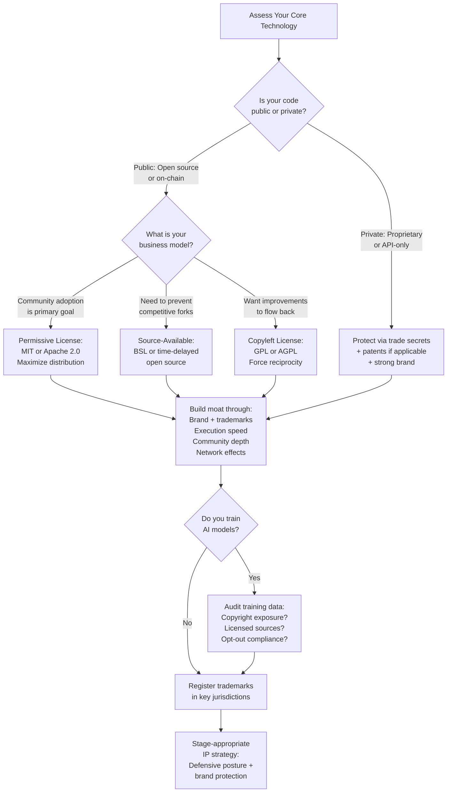

# Chapter 41: Intellectual Property Strategy in Open-Source and Web3

> *Last Updated: March 2026*

> **Skim This Chapter**
> - In Web3, AI, and open source, traditional IP assumptions break down--code can be copied in minutes, so defensibility comes from brand, community, and strategic license choices rather than patents and secrecy.
> - Output: A stage-appropriate IP strategy framework covering license selection, trademark protection, defensive patent posture, and AI IP risk management for open-source and decentralized ventures.

## 1. Introduction: The IP Paradox

Intellectual property strategy has always been central to building defensible ventures. But for founders working at the intersection of Web3, AI, and open source, the traditional playbook is not merely outdated -- it is actively misleading. The assumptions that governed IP strategy for the past century -- that secrecy creates value, that patents provide protection, that ownership is binary -- break down when your code is public, your protocol is permissionless, and your AI model was trained on the collective output of the internet.

This creates what we call the IP Paradox: the technologies that define the current era are built on principles of openness, composability, and permissionless innovation, yet the legal frameworks governing intellectual property were designed for a world of closed systems, proprietary control, and clearly delineated ownership. Founders who ignore this paradox risk either over-investing in protections that provide no real defense or under-investing in strategies that could secure lasting competitive advantage.

The paradox runs deeper than a mismatch between old laws and new technology. In Web3, your most valuable asset -- your protocol's code -- is often published for the world to inspect and copy. In AI, the question of who owns what is genuinely unresolved: training data is scraped from millions of sources, model architectures are described in public papers, and the outputs generated by AI systems occupy a legal gray zone that no jurisdiction has fully addressed. In open source, you deliberately give away the very thing that traditional IP strategy would tell you to lock down.

Yet within this paradox lies opportunity. Founders who understand the new IP landscape can make strategic choices that create genuine defensibility without depending on legal fictions or unenforceable claims. They can select licenses that encourage adoption while preserving commercial leverage. They can build brand and community moats that resist the commoditizing force of open code. They can navigate the emerging patchwork of global AI regulation to position their ventures for long-term advantage.

> **The IP paradox:** In Web3 and AI, the technologies you build on demand openness, but the businesses you build require defensibility. The founders who thrive are those who understand which assets to share and which to protect—and why the answer is rarely obvious.

## In This Chapter, You Will

- Understand how patents, copyrights, trade secrets, and trademarks function differently in open-source and Web3 contexts
- Evaluate open-source license options and their strategic implications for your venture
- Navigate the unresolved legal questions around AI model ownership, training data, and outputs
- Design a defensive IP strategy that protects your freedom to operate without undermining community trust
- Protect your brand and trademarks in decentralized ecosystems
- Apply a stage-appropriate IP strategy framework from pre-seed through maturity

## Founder's Checklist

- Have you identified which aspects of your venture are genuinely protectable and which are not?
- Have you selected an open-source license that aligns with your business model?
- Do you have a trademark strategy for your protocol, product, and community brand?
- Have you assessed your AI training data pipeline for copyright exposure?
- Is your defensive patent posture sufficient to deter trolls without alienating your community?
- Have you evaluated IP risk across your target geographies?

## Exercises

- Exercise 1: Audit your current codebase and classify each component by the type of IP protection available (patent, copyright, trade secret, trademark, none). Identify the three highest-value assets and the protection mechanism most appropriate for each.
- Exercise 2: Compare three open-source licenses (MIT, Apache 2.0, BSL 1.1) against your business model. For each, analyze how it affects your ability to capture commercial value, attract contributors, and defend against competitive forks.
- Exercise 3: Map your AI model's training data sources. For each source, classify the data by license type, copyright status, and jurisdictional risk. Identify the three highest-risk sources and draft a mitigation plan.
- Exercise 4: Design a brand protection strategy for a hypothetical DeFi protocol launching across five jurisdictions. Include trademark filing priorities, domain strategy, social media handle protection, and community enforcement guidelines.
- Exercise 5: Using the Implementation Guide in Section 13, draft a 12-month IP strategy for your venture. Prioritize the five most critical actions and estimate their cost.

## 2. IP Fundamentals Reimagined for Web3 and AI

The four pillars of intellectual property -- patents, copyrights, trade secrets, and trademarks -- each behave differently when applied to decentralized protocols, open-source software, and AI systems. Founders need to understand not just what these protections theoretically provide but how they function in practice within the specific dynamics of the current technology landscape.

### Patents in a Permissionless World

Patents grant the holder the exclusive right to make, use, or sell an invention for a limited period, typically twenty years. In exchange, the inventor must publicly disclose the invention in sufficient detail for a person skilled in the relevant art to reproduce it.

For Web3 founders, this bargain is often a poor trade. The disclosure requirement means publishing the precise details of your innovation, giving competitors a roadmap to design around your claims. The enforcement mechanism requires filing lawsuits -- an expensive, slow, and uncertain process that runs counter to the ethos of most Web3 communities. And the territorial nature of patents means that protection in one jurisdiction does nothing to prevent deployment of your protocol on a global, borderless network.

That said, patents are not worthless in Web3. They serve two specific functions that founders should understand:

**Defensive deterrence.** A patent portfolio, even one you never intend to assert offensively, can deter patent trolls and aggressive competitors from targeting your venture. Cross-licensing agreements and patent pledges (discussed in Section 9) create mutual assurance that reduces litigation risk for the entire ecosystem.

**Acquisition and fundraising leverage.** Investors and acquirers often view patents as tangible assets, particularly in later-stage transactions. A well-constructed patent portfolio can meaningfully affect valuation, even if the patents themselves would be difficult to enforce.

### Copyright in the Age of Open Source

Copyright protects the specific expression of an idea, not the idea itself. In software, this means copyright covers the particular code you write -- the specific sequence of instructions -- but not the underlying algorithm, method, or concept.

For open-source projects, copyright is the mechanism that makes licensing work. When you release code under an open-source license, you are not abandoning your copyright. You are using your copyright to grant specific permissions under specific conditions. This distinction is critical: the license is enforceable precisely because you hold the copyright and can dictate the terms under which others use your code.

Copyright also protects documentation, user interfaces (to a limited degree), and creative elements of your project. In AI, copyright's role becomes far more contested, as we will examine in Section 7.

### Trade Secrets in a Transparent Ecosystem

A trade secret is information that derives economic value from not being generally known and is subject to reasonable efforts to maintain its secrecy. The classic examples are formulas, algorithms, customer lists, and business processes.

In open-source and Web3 contexts, trade secret protection is inherently limited by the transparency that these ecosystems demand. Your smart contract code is on-chain for anyone to read. Your protocol's logic is published in your GitHub repository. Your governance processes are conducted in public forums.

Yet trade secrets remain relevant in specific areas:

- **Proprietary infrastructure and tooling.** The internal systems you use to develop, test, and deploy your protocol need not be open-sourced. Deployment configurations, monitoring systems, and operational procedures can constitute protectable trade secrets.
- **Business strategy and roadmap details.** While your code is public, your strategic plans, partnership negotiations, and product roadmap need not be.
- **Proprietary data and models.** If your venture involves proprietary datasets or fine-tuned AI models, these can be maintained as trade secrets even if the underlying architecture is open.
- **Off-chain components.** Many Web3 applications involve significant off-chain infrastructure -- APIs, indexing services, user interfaces -- that can be kept proprietary.

### Trademarks as the Anchor of Decentralized Identity

Of all traditional IP protections, trademarks are arguably the most important for Web3 and open-source ventures. When your code can be freely copied and your protocol can be forked, your brand becomes the primary marker of authenticity, quality, and community trust.

Trademarks protect names, logos, slogans, and other identifiers that distinguish the source of goods or services. Unlike patents and copyrights, trademarks can last indefinitely as long as they remain in active use and continue to identify a single source.

For Web3 founders, trademark strategy should encompass:

- **Protocol names and logos.** Register your core brand elements in every jurisdiction where you have significant user activity.
- **Domain names and social handles.** Secure your brand across DNS, ENS (Ethereum Name Service), and major social platforms.
- **Community identifiers.** If your community develops recognizable symbols, catchphrases, or visual elements, consider whether trademark protection is appropriate.
- **Defensive registrations.** Register common misspellings, related terms, and adjacent categories to prevent brand confusion.

The following decision tree helps founders determine the right IP strategy for their venture based on the nature of their technology, their competitive context, and their community model.

The following table compares the four pillars of intellectual property and how each functions in the specific context of Web3, AI, and open-source ventures.

| **IP Type** | **What It Protects** | **Effectiveness in Web3/AI** | **Key Limitation** | **Best Use For** |
|---|---|---|---|---|
| Patents | Inventions; exclusive right to make, use, or sell for ~20 years | Low in Web3 (borderless networks, pseudonymous deployers, community backlash); moderate in AI (specific technical improvements) | Disclosure requirement gives competitors a roadmap; enforcement is expensive and slow; territorial limits vs. global networks | Defensive deterrence against patent trolls; acquisition and fundraising leverage |
| Copyright | Specific expression of ideas (code, documentation, creative works) | Moderate; enables open-source licensing enforcement; protects documentation and UI elements | Does not protect algorithms, methods, or APIs (post-Google v. Oracle); on-chain bytecode is visible regardless | Enforcing license terms on open-source code; protecting documentation and educational content |
| Trade Secrets | Information deriving value from secrecy (formulas, processes, data) | Limited by transparency demands of open-source and on-chain code; still relevant for operational knowledge, proprietary data, and off-chain components | Requires reasonable secrecy efforts; lost once disclosed; incompatible with fully open protocols | Proprietary infrastructure/tooling, business strategy, proprietary datasets, unreleased innovations |
| Trademarks | Names, logos, and identifiers distinguishing source of goods/services | High; arguably the most important IP protection when code is open and protocols are forkable | Requires active enforcement; community-driven brand evolution may exceed founder control | Protocol names and logos, domain/ENS names, community identifiers, anti-impersonation defense |

## 3. The Open-Source License Landscape

Choosing an open-source license is one of the most consequential IP decisions a Web3 or AI founder will make. The license you select determines who can use your code, how they can use it, and what obligations they incur when they do. It shapes your competitive dynamics, your community's growth trajectory, and your options for commercial value capture.

### Permissive Licenses: MIT and Apache 2.0

**MIT License.** The MIT License is the simplest and most permissive widely used open-source license. It allows anyone to use, copy, modify, merge, publish, distribute, sublicense, and sell copies of the software, subject only to the requirement that the original copyright notice and license text be included in all copies. The MIT License imposes no obligation to share modifications, no patent grant, and no copyleft requirements.

**Strategic implications:** MIT-licensed code maximizes adoption by minimizing friction. Anyone can incorporate your code into proprietary products without restriction. This makes MIT ideal for foundational libraries and developer tools where widespread adoption is the primary goal. The downside is that competitors can take your code, improve it, and offer a proprietary product without contributing anything back.

**Apache 2.0 License.** The Apache License is similarly permissive but adds two important features: an explicit patent grant and a patent retaliation clause. Contributors to an Apache-licensed project automatically grant users a license to any patents that cover their contributions. If a user initiates patent litigation against the project, their patent license is automatically terminated.

**Strategic implications:** Apache 2.0 is generally preferred over MIT for projects where patent risk is a concern, which includes most enterprise-oriented Web3 and AI projects. The patent grant provides users with greater legal certainty, while the retaliation clause creates a deterrent against patent aggression within the ecosystem.

### Copyleft Licenses: GPL and AGPL

**GNU General Public License (GPL).** The GPL requires that any derivative work incorporating GPL-licensed code must also be distributed under the GPL. This "viral" or "copyleft" provision ensures that improvements to the code remain open. The GPL applies when the software is distributed -- if you run GPL software on your own servers without distributing it, you are not obligated to release your modifications.

**Affero GPL (AGPL).** The AGPL closes the "SaaS loophole" by extending the copyleft obligation to network interaction. If you modify AGPL-licensed code and make it available as a network service, you must release your modifications under the AGPL, even if you never distribute the software in the traditional sense.

**Strategic implications:** Copyleft licenses are a double-edged sword for Web3 founders. On one hand, they ensure that improvements flow back to the community, preventing competitors from capturing value through proprietary extensions. On the other, they can deter corporate adoption and limit the commercial models available to the project's maintainers.

### Source-Available and Delayed Open Source: BSL and SSPL

**Business Source License (BSL).** The BSL allows source code to be viewed, modified, and used for non-production purposes. Production use requires a commercial license from the copyright holder. After a specified period (typically two to four years), the code automatically converts to a fully open-source license (usually Apache 2.0 or GPL).

**Server Side Public License (SSPL).** Created by MongoDB, the SSPL requires that anyone offering the software as a service must release the entire service stack -- including management, monitoring, and orchestration tools -- under the SSPL. This provision is so broad that the Open Source Initiative does not consider the SSPL to be an open-source license.

**Strategic implications:** BSL and SSPL represent a middle ground between full open source and proprietary software. They allow founders to share their code while preserving commercial exclusivity for a defined period or use case. These licenses are increasingly popular among venture-backed companies that want the community and trust benefits of open source without giving competitors unrestricted access to their core technology.

### Case Study: Uniswap v3 and the Business Source License

When Uniswap Labs released version 3 of its decentralized exchange protocol in March 2021, it made a licensing choice that sent shockwaves through the DeFi community: the core smart contracts were released under the Business Source License 1.1, not the GPL v2 that had governed Uniswap v2.

The BSL granted anyone the right to view, copy, and modify the code, but prohibited commercial or production use without a license from Uniswap Labs for a period of two years, after which the code would automatically convert to GPL v2. The practical effect was that no one could deploy a competing protocol using Uniswap v3's concentrated liquidity mechanism until April 2023.

The decision was driven by a specific and painful experience. Uniswap v2, released under GPL v2, had been forked within months by SushiSwap (discussed below), which attracted billions of dollars in liquidity away from Uniswap through a token incentive program built on top of functionally identical code. The v3 BSL was Uniswap Labs' attempt to protect its investment in innovation while still making the code publicly auditable.

The community response was polarized. Supporters argued that the BSL was a pragmatic solution to the free-rider problem: Uniswap Labs had invested millions in researching and developing concentrated liquidity, and a two-year head start was a reasonable return on that investment. Critics contended that the BSL violated the ethos of DeFi, which was built on the principle of permissionless composability. Some argued that if Uniswap could restrict its protocol's use, the entire foundation of open DeFi was at risk.

The outcome was instructive. Despite the BSL, competitors developed alternative concentrated liquidity implementations that did not directly copy Uniswap's code. Trader Joe, for instance, launched its Liquidity Book model on Avalanche, achieving similar functionality through a different technical approach. When the BSL expired in April 2023, the expected flood of direct forks did not materialize -- the competitive landscape had already evolved. The lesson for founders: a time-limited license restriction can buy breathing room, but it cannot prevent determined competitors from pursuing the same idea through independent implementation.

## 4. IP Strategy When Your Code Is Public

Open-sourcing your code does not mean abandoning IP protection. It means shifting from a strategy centered on secrecy and exclusion to one built on selective openness, brand strength, and execution speed.

### What You Can Still Protect

Even when your core code is public, several categories of intellectual property remain protectable:

**Brand and Trademarks.** Your project's name, logo, and visual identity are protectable regardless of your code's license. The Linux Foundation, for example, vigorously enforces the Linux trademark even though the kernel itself is GPL-licensed.

**Proprietary Extensions and Services.** Many successful open-source companies maintain a "core open, extensions proprietary" model. The open-source core attracts users and contributors, while proprietary features, hosted services, or enterprise tools generate revenue.

**Documentation and Educational Content.** Your technical documentation, tutorials, and educational materials are copyrightable works that can be licensed separately from your code.

**Design and User Experience.** While functional elements of a user interface are generally not copyrightable, distinctive visual designs and creative arrangements can be protected.

### What You Cannot Protect

Founders must also recognize the limits of IP protection for open-source projects:

**Algorithms and Methods.** Copyright does not protect algorithms, mathematical formulas, or abstract methods. If your innovation is primarily algorithmic, publishing the code means publishing the algorithm.

**APIs and Interfaces.** Following the Supreme Court's decision in Google v. Oracle, the use of APIs for reimplementation purposes is likely to be considered fair use, limiting the ability to lock users into specific interfaces.

**On-Chain Logic.** Smart contracts deployed to public blockchains are inherently transparent. While the source code may be copyrighted, the on-chain bytecode is visible to anyone, and the functional behavior can be reverse-engineered regardless.

### The Execution Moat

For most open-source and Web3 ventures, the strongest form of protection is not legal but operational: the ability to ship faster, integrate more deeply, and serve users more effectively than anyone working from a copy of your code.

This execution moat has several dimensions:

- **Speed of iteration.** The team that wrote the code understands it most deeply and can evolve it most quickly.
- **Community relationships.** Contributors, users, and partners develop loyalty to projects that treat them well, not to codebases.
- **Institutional knowledge.** The understanding of why certain design decisions were made -- the context behind the code -- does not transfer through a fork.
- **Ecosystem integrations.** As your project integrates with more partners and services, the switching costs for users increase, even if the underlying code is freely available.

## 5. Smart Contract IP Considerations

Smart contracts occupy a unique position in the IP landscape. They are software, which means they are subject to copyright. They implement methods, which means they may be patentable. They execute on public blockchains, which means they are inherently transparent. And they often involve financial instruments, which brings additional regulatory dimensions to IP strategy.

### Can You Patent a Protocol?

The short answer is: sometimes, but it is difficult and often counterproductive.

Patent eligibility for software in the United States is governed by the Alice Corp. v. CLS Bank decision, which established that abstract ideas implemented on a computer are not patentable. Many smart contract innovations -- automated market making, yield optimization, token distribution mechanisms -- risk being classified as abstract financial concepts implemented on a blockchain, which would place them outside the scope of patent protection.

However, smart contract innovations that involve specific technical improvements -- novel cryptographic techniques, specific data structure optimizations, particular methods of achieving consensus -- may be patentable if they can be framed as improvements to the functioning of a computer rather than abstract business methods.

### The Transparency Problem

Even if you obtain a patent on a smart contract innovation, enforcement presents unique challenges:

- **Pseudonymous deployment.** Identifying infringers on a permissionless network where deployers may be pseudonymous is difficult.
- **Jurisdictional ambiguity.** Where does infringement occur when a smart contract executes on a globally distributed network of nodes?
- **Community backlash.** Enforcing patents against other DeFi projects is likely to generate significant negative sentiment, potentially damaging the enforcer's brand more than the infringement damages their market position.

### Practical Approaches

Rather than relying on patents, smart contract developers typically protect their innovations through a combination of:

- **License selection** (as discussed in Section 3) to control commercial use
- **Rapid innovation** to stay ahead of copycats
- **Brand and community building** to establish authenticity
- **Network effects** that make the original deployment more valuable than any copy

## 6. Forking as IP Challenge

In open-source and Web3, forking -- taking a copy of a project's code and developing it independently -- is not a bug but a feature. It is the mechanism by which communities can exit bad governance, experiment with alternative approaches, and ensure that no single entity holds permanent control over a shared resource. But for founders, forking also represents the most direct form of competitive threat: a rival that starts with your entire codebase.

### Case Study: The SushiSwap Fork

In August 2020, an anonymous developer known as Chef Nomi launched SushiSwap by forking Uniswap v2's GPL-licensed code nearly line for line. SushiSwap added one significant feature: the SUSHI token, which rewarded liquidity providers with governance tokens on top of the trading fees they were already earning on Uniswap.

The impact was immediate and dramatic. Through a mechanism called a "vampire attack," SushiSwap offered enhanced rewards to liquidity providers who migrated their capital from Uniswap to SushiSwap. Within two weeks, over one billion dollars in liquidity had moved. Uniswap, which had pioneered the automated market maker model and invested years in building its platform, found itself losing users to an overnight copy of its own code.

The episode exposed a fundamental tension in open-source DeFi. Uniswap's code was GPL-licensed, and SushiSwap's fork was legally permissible under that license. The innovation that SushiSwap added -- token-based liquidity incentives -- was not a technical breakthrough but a mechanism design choice. Uniswap had no legal recourse, despite having created the foundational technology.

The aftermath shaped the entire DeFi industry's approach to IP. Uniswap responded by launching its own governance token (UNI) and, as discussed above, releasing Uniswap v3 under the BSL to prevent a repeat. Chef Nomi's initial attempt to extract personal profit from the SUSHI treasury led to community backlash, and control of SushiSwap was eventually transferred to a multisig governed by prominent DeFi figures. SushiSwap survived but never recaptured its early momentum.

For founders, the SushiSwap fork illustrates a critical lesson: in a world where code can be copied in minutes, your defensibility must come from something other than the code itself. Brand trust, community loyalty, execution speed, and governance legitimacy are the moats that resist forking. Code alone is not enough.

### Anti-Fork Strategies

While you cannot prevent forking of open-source code, you can make forks less viable through several strategies:

- **Community depth.** Build deep relationships with contributors, users, and ecosystem partners. These relationships do not transfer through a fork.
- **Governance legitimacy.** Establish transparent, respected governance processes that give stakeholders a voice. Communities fork when they feel unheard, not when they want slightly different code.
- **Continuous innovation.** Stay far enough ahead technically that forks are always working with yesterday's code.
- **Network effects and integrations.** Build integrations with wallets, aggregators, and other protocols that create switching costs for users.
- **Brand strength.** Invest in brand recognition and trust so that users can distinguish the original from imitators.

## 7. AI Model IP: The Great Unresolved Question

No area of intellectual property law is evolving more rapidly or more contentiously than AI model ownership. The fundamental questions -- who owns training data, who owns model weights, who owns outputs -- remain unresolved across every major jurisdiction, creating both risk and opportunity for founders.

### Training Data and Copyright

Most modern AI models are trained on vast datasets scraped from the internet, including copyrighted text, images, code, and other creative works. Whether this training constitutes fair use (in the US) or falls under other copyright exceptions (in other jurisdictions) is the subject of active litigation and legislative debate.

The core legal question is whether training an AI model on copyrighted material constitutes a "transformative use" that is sufficiently different from the original works to qualify as fair use. Proponents of AI training argue that the model does not store or reproduce the training data but rather learns statistical patterns that constitute a fundamentally new work. Opponents argue that the model's ability to generate outputs similar to its training data demonstrates that training is essentially a form of copying.

### Case Study: Stability AI and the Copyright Frontier

Stability AI, the company behind the open-source image generation model Stable Diffusion, became the focal point of the AI copyright debate when it faced multiple lawsuits beginning in early 2023 from artists, photographers, and stock image companies including Getty Images.

The plaintiffs alleged that Stability AI had trained Stable Diffusion on billions of copyrighted images without permission, effectively allowing anyone to generate images that competed with and sometimes closely resembled the original copyrighted works. Getty Images' lawsuit was particularly significant because it included evidence that Stable Diffusion could generate images containing distorted but recognizable Getty watermarks -- suggesting the model had ingested watermarked images wholesale rather than training only on properly licensed material.

Stability AI's defense rested on several arguments: that training on publicly available images constituted fair use, that the model learned abstract patterns rather than copying specific images, and that the outputs were new creative works rather than reproductions. The company also pointed to the broader public interest in AI research and the transformative nature of diffusion models.

The legal proceedings, which extended across multiple jurisdictions including the United States and the United Kingdom, highlighted the geographic complexity of AI IP law. US fair use doctrine, with its flexible four-factor test, offered Stability AI more favorable terrain than the UK's narrower copyright exceptions. The EU's Text and Data Mining exceptions under the Digital Single Market Directive introduced yet another framework, one that allowed training on copyrighted works for research purposes but gave rights holders the ability to opt out for commercial applications.

For founders building AI products, the Stability AI litigation underscored a practical reality: the legal questions around training data will not be fully resolved for years, and ventures that depend on legally contested data practices carry meaningful risk. Prudent founders are investing in data provenance tracking, curating training datasets from explicitly licensed or public domain sources, and building the ability to remove specific data sources from their training pipelines if required by future court decisions or legislation.

### Model Weights: The New Battleground

If training data ownership is contested, model weight ownership is even more ambiguous. Model weights -- the millions or billions of numerical parameters that define a trained model's behavior -- are the product of a computational process applied to training data using a specific architecture. They are not direct copies of any training data, yet they encode patterns learned from that data.

No court has definitively ruled on whether model weights are copyrightable, patentable, or constitute trade secrets. In practice, companies protect model weights through a combination of contractual restrictions (terms of service, license agreements), technical measures (API-only access, no weight downloads), and trade secret claims (keeping weights confidential).

### AI Outputs: Who Owns What the Machine Creates?

The US Copyright Office has taken a clear position: works created entirely by AI without meaningful human creative input are not copyrightable. This creates a paradox for AI-assisted creation, where the boundary between human-directed and AI-generated output is often blurry.

Founders building AI tools should consider:

- **Degree of human direction.** The more specific and creative the human input (prompts, curation, editing), the stronger the copyright claim over the output.
- **Terms of service.** Clearly specify who owns AI-generated outputs in your platform's terms. Different platforms take different approaches -- some assign ownership to users, others retain rights.
- **Downstream liability.** If your AI generates output that infringes existing copyrights, who bears liability? This question is particularly acute for code generation tools, where the AI may reproduce open-source code verbatim.

### Licensing Strategies for AI Models

The AI industry is developing a range of licensing approaches that fall on a spectrum from fully open to fully proprietary:

**Fully Open (Apache 2.0 or similar).** Models released under standard open-source licenses with no restrictions on use. Examples include some models from EleutherAI and certain smaller models from various research labs.

**Open Weights with Use Restrictions.** Models whose weights are publicly available but whose licenses restrict certain uses. Meta's Llama models are the most prominent example: the weights are freely available for most purposes, but the license prohibits use by organizations with more than 700 million monthly active users and requires that derivative models include "Llama" in their names.

**API-Only Access.** Models accessible only through an API, with no weight distribution. OpenAI's GPT-4 and Anthropic's Claude follow this model, maintaining control over the model while monetizing through usage fees.

**Research-Only Licenses.** Models available for academic and non-commercial research but requiring commercial licenses for production use.

Each approach reflects a different strategic calculation about the relative value of adoption, control, and monetization.

## 8. NFTs and Digital Property Rights

Non-fungible tokens introduced the concept of verifiable digital ownership, but the relationship between owning an NFT and owning the intellectual property associated with it remains widely misunderstood.

### What NFT Ownership Actually Means

Purchasing an NFT typically grants ownership of the token itself -- the on-chain record -- but not the underlying intellectual property. Unless the sale explicitly includes an IP transfer or license, the creator retains copyright over the artwork, music, or other content associated with the NFT.

This distinction has practical consequences. An NFT holder who does not hold the copyright cannot legally create derivative works, license the image for commercial products, or prevent others from viewing or sharing the associated content.

### Creative Approaches to NFT IP

Some projects have experimented with broader IP grants:

- **Full commercial rights.** Certain projects grant NFT holders full commercial rights to the associated artwork, allowing holders to create merchandise, derivative works, and commercial products.
- **Tiered licensing.** Some projects offer different levels of IP rights based on the type of NFT held, the quantity owned, or the holder's participation in governance.
- **Community IP pools.** Some DAOs have experimented with pooling IP rights and licensing them collectively, with revenue shared among token holders.

## 9. Defensive Patent Strategies for Web3 Companies

While offensive patent assertion is generally counterproductive in Web3, defensive patent strategies can provide meaningful protection against external threats, particularly patent trolls -- entities that acquire patents solely to extract licensing fees through litigation.

### Case Study: The Patent Troll Threat in Web3

In 2022, a non-practicing entity (NPE) called TrustToken Technologies (no relation to the TrueFi protocol) filed a series of patent infringement claims against multiple DeFi protocols, alleging that their automated token swap mechanisms infringed on patents originally filed in 2014 covering automated asset exchange systems. The patents had been acquired from a defunct fintech company and were broadly written, covering concepts that the DeFi community considered obvious applications of smart contract technology.

The targeted protocols faced an unpleasant choice: pay licensing fees to make the litigation go away (the typical NPE business model, with settlements often ranging from hundreds of thousands to millions of dollars), or fight the claims in court at significant expense and distraction. Several smaller protocols chose to settle, calculating that litigation costs would exceed settlement amounts. Two larger protocols, backed by well-resourced foundations, chose to fight, arguing that the patents were invalid due to prior art in the blockchain space.

The episode highlighted the vulnerability of Web3 projects to patent trolls. Most DeFi protocols are developed by small teams with limited legal budgets, making them attractive targets for NPEs that profit from the asymmetry between the cost of filing a patent claim and the cost of defending against one. It also demonstrated the value of defensive measures: protocols that had joined patent defense organizations and maintained documentation of prior art were better positioned to respond.

### Building a Defensive Patent Posture

**Patent pledges.** Public commitments not to assert patents offensively, often with exceptions for defensive use. The Open Invention Network (OIN) is the most prominent example, providing a patent non-aggression zone for Linux-related technologies.

**Defensive patent pools.** Organizations like the LOT Network and the Unified Patents coalition pool resources to challenge weak patents and reduce the threat of trolls.

**Prior art documentation.** Systematically documenting your innovations through publications, conference presentations, and prior art databases creates a record that can be used to invalidate patents filed by others after your innovation.

**Strategic patent filing.** Filing patents on your core innovations -- not to assert them offensively but to prevent others from patenting the same concepts and using them against you. Some companies combine patent filing with public pledges not to assert the patents except in defense.

## 10. IP Considerations in DAO Structures

Decentralized autonomous organizations present unique challenges for intellectual property management. Traditional IP requires an identifiable owner -- a person or legal entity that holds the rights and can enforce them. DAOs, particularly those without legal wrappers, may lack the legal personality necessary to hold, manage, or enforce IP.

### IP Ownership in DAOs

Several models have emerged for managing IP within DAO structures:

**Foundation model.** A legal entity (foundation, association, or LLC) holds IP on behalf of the DAO, with governance rights determining how the IP is managed. This is the most common approach and provides the clearest legal framework.

**Contributor assignment model.** Individual contributors assign their IP to the DAO's legal wrapper as a condition of participation. This requires clear contributor agreements and a functioning legal entity to receive the assignments.

**Shared licensing model.** Contributors retain their IP but grant the DAO a broad license to use, modify, and sublicense their contributions. This approach preserves individual contributors' rights while giving the DAO operational flexibility.

### Enforcement Challenges

Even when a DAO holds clear IP rights through a legal wrapper, enforcement presents practical challenges:

- **Decision-making speed.** IP enforcement often requires rapid response (cease-and-desist letters, preliminary injunctions). DAO governance processes may be too slow for time-sensitive legal actions.
- **Funding allocation.** Litigation is expensive. Allocating DAO treasury funds for legal action requires governance approval, which may be difficult to obtain.
- **Jurisdictional complexity.** DAOs often have contributors and users in many jurisdictions, making it unclear where to file legal actions and which law applies.

## 11. Trade Secrets in a Transparent Ecosystem

The tension between transparency and trade secret protection is not absolute. Even in the most open Web3 and AI ecosystems, founders can maintain trade secrets in several areas without undermining community trust.

### What Can Remain Secret

**Operational knowledge.** How you deploy, monitor, and maintain your systems. Your incident response procedures. Your testing methodologies. These operational details are rarely public and can constitute valuable trade secrets.

**Business intelligence.** Market analysis, user behavior data, competitive intelligence, and strategic plans. The insights you derive from public data can be trade secrets even if the underlying data is not.

**Unreleased innovations.** Work in progress -- features under development, research findings not yet published, architectural plans for future versions -- can be maintained as trade secrets until you choose to release them.

**Proprietary datasets.** Curated, cleaned, and annotated datasets used for AI training or analytics. While individual data points may be public, the specific compilation and annotation represent protectable trade secrets.

### Case Study: Non-Western Approaches to Web3 IP

China's approach to blockchain and AI intellectual property offers a striking contrast to Western frameworks and illustrates how geographic variation creates both challenges and opportunities for global Web3 ventures.

China has emerged as the world's most prolific filer of blockchain-related patents, with Chinese entities holding more blockchain patents than the rest of the world combined by some counts. Major technology companies including Ant Group, Tencent, and Ping An have built massive blockchain patent portfolios, driven by a national strategy that treats patent volume as a measure of innovation leadership and a tool of industrial policy.

This patent-heavy approach coexists with a restrictive stance toward decentralized finance and cryptocurrency trading, creating an apparent paradox: China encourages blockchain innovation through patents while prohibiting many of the decentralized applications that Western Web3 communities consider the technology's primary purpose.

For non-Chinese founders, this dynamic creates specific risks. Chinese patent holders may assert their patents against foreign companies operating in or seeking to enter the Chinese market. The breadth of China's blockchain patent portfolio means that novel approaches developed elsewhere may nonetheless infringe Chinese patents, even if the Chinese patent holders have no operational presence in DeFi.

Japan and South Korea have taken different paths. Japan's 2023 revisions to its Unfair Competition Prevention Act explicitly addressed AI training data and model weights, providing clearer protection for trade secrets in AI contexts than most Western jurisdictions. South Korea's approach emphasizes utility model patents -- a form of protection with lower novelty requirements and faster prosecution than full patents -- as a tool for protecting incremental blockchain innovations.

For founders operating globally, the practical implication is that IP strategy cannot be one-size-fits-all. A defensive patent portfolio filed only in the US provides no protection in Asia. A trade secret strategy designed for US law may not satisfy the requirements for trade secret protection in the EU, where the Trade Secrets Directive imposes specific procedural obligations. And a licensing strategy that works under US fair use doctrine may be impermissible under more restrictive copyright regimes.

## 12. Brand Protection and Trademark Strategy in Decentralized Ecosystems

In decentralized ecosystems where code is open and protocols are permissionless, brand is often the single most important differentiator between the original project and its imitators. Trademark strategy deserves disproportionate attention from Web3 founders.

### The Unique Challenges of Decentralized Branding

**Impersonation and phishing.** Decentralized ecosystems are rife with impersonation -- fake tokens, copycat websites, and fraudulent social media accounts that exploit brand confusion to steal user funds.

**Cross-chain brand consistency.** If your protocol deploys across multiple blockchains, maintaining consistent branding and preventing unauthorized deployments that trade on your name becomes more complex.

**Community-driven brand evolution.** Decentralized communities often develop their own terminology, memes, and visual identity that may evolve beyond the founding team's control.

### Practical Trademark Strategy

**File early and broadly.** Trademark protection generally goes to the first to file (in most jurisdictions) or the first to use (in the US). File applications as early as possible, covering your core goods and services as well as related categories.

**Monitor aggressively.** Use trademark monitoring services to identify potential infringers. In Web3, this includes monitoring token names, ENS registrations, and social media handles.

**Enforce consistently.** Trademark rights can be lost through failure to enforce. Develop a consistent enforcement policy and apply it uniformly, even when infringement comes from within your community.

**Distinguish trademark from protocol.** Clearly separate your trademark (the brand) from your protocol (the code). Anyone can run the code, but only authorized entities can use the brand. This distinction allows you to maintain brand integrity even in a permissionless ecosystem.

## 13. Implementation Guide: IP Strategy by Stage

IP strategy should evolve as your venture matures. The following framework provides stage-appropriate guidance:

### Pre-Seed / Ideation (Months 0-3)

**Priority actions:**
- Conduct a comprehensive trademark search for your proposed project name
- File trademark applications in your primary jurisdiction
- Secure domain names, ENS names, and social media handles
- Select an open-source license that aligns with your business model
- Establish contributor agreements that clarify IP ownership

**Budget allocation:** 5-10% of initial legal spend on IP

### Seed / Early Development (Months 3-12)

**Priority actions:**
- File trademark applications in secondary jurisdictions where you expect user activity
- Implement a prior art documentation process for all innovations
- Evaluate whether any innovations warrant patent filing (defensive purposes)
- Establish internal trade secret policies for proprietary components
- Review AI training data sources for copyright risk

**Budget allocation:** 10-15% of legal spend on IP

### Growth / Post-Launch (Months 12-36)

**Priority actions:**
- Build a defensive patent portfolio if operating in a patent-dense domain
- Join relevant patent defense organizations (OIN, LOT Network)
- Implement trademark monitoring and enforcement program
- Conduct a comprehensive IP audit covering all protectable assets
- Develop licensing strategy for proprietary extensions or datasets

**Budget allocation:** 15-20% of legal spend on IP

### Scale / Maturity (36+ Months)

**Priority actions:**
- Evaluate patent portfolio for licensing or cross-licensing opportunities
- Consider patent pledges to strengthen community trust
- Expand trademark portfolio to cover new products and markets
- Establish IP governance processes for DAO or community-governed assets
- Review and update all licenses and contributor agreements

**Budget allocation:** Ongoing IP management as part of legal operations

## Key Takeaways

### Code Is Not Your Moat -- Brand and Community Are

In an ecosystem where code can be copied in minutes, traditional IP protections for software provide limited defense. The most durable assets for Web3 and AI ventures are brand trust, community loyalty, and the institutional knowledge that cannot be forked.

### License Choice Is Strategy, Not Paperwork

Your open-source license is not a formality. It is a strategic decision that shapes your competitive dynamics, your community's composition, and your commercial options. Choose deliberately, with full understanding of the trade-offs each license entails.

### AI IP Is Unresolved -- Plan for Uncertainty

The legal frameworks governing AI training data, model weights, and outputs are actively being litigated and legislated across every major jurisdiction. Founders should build flexibility into their AI IP strategies, maintaining the ability to adapt as the legal landscape clarifies.

### Defensive Beats Offensive in Web3

Patent aggression is generally counterproductive in Web3, where community trust is essential and the ethos favors openness. Defensive strategies -- patent pledges, prior art documentation, defensive filing -- provide meaningful protection without alienating your community.

### Trademarks Deserve Disproportionate Attention

For open-source and Web3 ventures, trademarks are the most practically important form of IP protection. They distinguish your project from imitators, protect users from fraud, and can last indefinitely. Invest early and enforce consistently.

### IP Strategy Must Be Jurisdiction-Aware

Patent, copyright, trademark, and trade secret law varies significantly across jurisdictions. A strategy designed for one legal system may be inadequate or counterproductive in another. Global ventures need global IP strategies.

### Execution Speed Is the Ultimate Protection

No legal instrument can substitute for the ability to innovate faster than your competitors. The best IP strategy buys time; the best teams use that time to build capabilities that cannot be replicated through copying alone.

## Checklist

- [ ] Select and implement an open-source license aligned with your business model
- [ ] File trademark applications for your project name and logo in primary jurisdictions
- [ ] Secure domain names, ENS names, and social media handles across all relevant platforms
- [ ] Establish contributor license agreements that clarify IP ownership for all contributions
- [ ] Audit AI training data sources for copyright risk and maintain a data provenance record
- [ ] Document all innovations through publications, presentations, or prior art databases
- [ ] Implement internal trade secret policies for proprietary components, operational procedures, and datasets
- [ ] Evaluate defensive patent filing for core innovations in patent-dense domains
- [ ] Join at least one patent defense organization if operating in a patent-active sector
- [ ] Set up trademark monitoring for your brand across token registries, ENS, and social platforms
- [ ] Review your AI model licensing terms to ensure they align with your commercial objectives
- [ ] Develop a written IP enforcement policy and apply it consistently
- [ ] Conduct an annual comprehensive IP audit covering all protectable assets
- [ ] Budget 10-20% of legal spend on IP protection and enforcement

## Exercises

- Exercise 1: Audit your current codebase and classify each component by the type of IP protection available (patent, copyright, trade secret, trademark, none). Identify the three highest-value assets and the protection mechanism most appropriate for each.
- Exercise 2: Compare three open-source licenses (MIT, Apache 2.0, BSL 1.1) against your business model. For each, analyze how it affects your ability to capture commercial value, attract contributors, and defend against competitive forks.
- Exercise 3: Map your AI model's training data sources. For each source, classify the data by license type, copyright status, and jurisdictional risk. Identify the three highest-risk sources and draft a mitigation plan.
- Exercise 4: Design a brand protection strategy for a hypothetical DeFi protocol launching across five jurisdictions. Include trademark filing priorities, domain strategy, social media handle protection, and community enforcement guidelines.
- Exercise 5: Using the Implementation Guide in Section 13, draft a 12-month IP strategy for your venture. Prioritize the five most critical actions and estimate their cost.

## Sources

### Intellectual Property Fundamentals
- U.S. Patent and Trademark Office. "General Information Concerning Patents." uspto.gov.
- World Intellectual Property Organization. "Understanding Industrial Property." wipo.int, 2023.
- Alice Corp. v. CLS Bank International, 573 U.S. 208 (2014).
- Google LLC v. Oracle America, Inc., 593 U.S. 1 (2021).

### Open-Source Licensing
- Open Source Initiative. "The Open Source Definition." opensource.org.
- Uniswap Labs. "Uniswap v3 Core: License." github.com/Uniswap, 2021.
- MariaDB Corporation. "Business Source License 1.1." mariadb.com.
- MongoDB, Inc. "Server Side Public License (SSPL)." mongodb.com, 2018.
- Free Software Foundation. "GNU General Public License, Version 3." gnu.org, 2007.

### AI and Copyright
- U.S. Copyright Office. "Copyright Registration Guidance: Works Containing Material Generated by Artificial Intelligence Systems." Federal Register, 2023.
- Getty Images v. Stability AI, No. 1:23-cv-00135 (D. Del. 2023).
- Andersen v. Stability AI et al., No. 3:23-cv-00201 (N.D. Cal. 2023).
- European Parliament. "Directive on Copyright in the Digital Single Market." Official Journal of the European Union, 2019.

### AI Model Licensing
- Meta Platforms, Inc. "Llama 2 Community License Agreement." ai.meta.com, 2023.
- Responsible AI Licenses (RAIL). "Open RAIL-M License." bigscience.huggingface.co, 2022.

### Web3 and Patent Strategy
- Open Invention Network. "About OIN." openinventionnetwork.com.
- LOT Network. "How LOT Works." lotnet.com.
- Unified Patents. "Prior Art and Patent Challenge Programs." unifiedpatents.com.

### DAO and Decentralized IP
- Brummer, Chris, and Rodrigo Seira. "Legal Wrappers and DAOs." Stanford Journal of Blockchain Law and Policy, 2022.
- Coalition of Automated Legal Applications (COALA). "Model Law for Decentralized Autonomous Organizations." 2021.
- Wyoming Legislature. "Decentralized Autonomous Organization Supplement." W.S. 17-31-101 through 17-31-116, 2021.

### Geographic IP Variations
- China National Intellectual Property Administration. "Blockchain Patent Statistics." cnipa.gov.cn, 2023.
- Japan Patent Office. "AI and IP Policy Report." jpo.go.jp, 2023.
- European Union. "Trade Secrets Directive 2016/943." Official Journal of the European Union, 2016.

### Brand and Trademark
- The Linux Foundation. "Linux Trademark Policy." linuxfoundation.org.
- ICANN. "Uniform Domain-Name Dispute-Resolution Policy." icann.org.

## Further Reading

- **Open (Source) for Business** by Heather Meeker — The most practical guide to open-source licensing for commercial ventures, written by the attorney who drafted the Business Source License and other key licenses used in Web3 and AI projects.
- **The Code of Capital: How the Law Creates Wealth and Inequality** by Katharina Pistor — Reveals how legal instruments encode economic power, providing essential context for understanding why IP strategy decisions in open-source and Web3 carry outsized long-term consequences.
- **Intellectual Property and Open Source** by Van Lindberg — A developer-oriented guide to navigating patent, copyright, and trademark law in open-source contexts, directly applicable to founders building on permissionless protocols.
- **Against Intellectual Monopoly** by Michele Boldrin and David K. Levine — A provocative economic argument that patents and copyrights often hinder rather than promote innovation, offering a theoretical framework for understanding why open strategies can create more value than closed ones.

## Related Case Studies

- See the Case Studies Compendium for curated examples relevant to this chapter: ../case-studies/compendium.md
