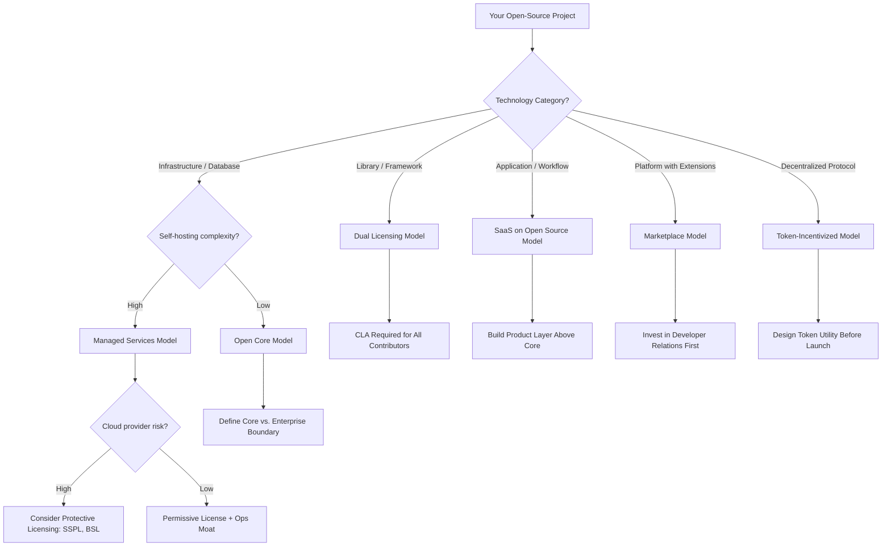

# Chapter 47: Open-Source Business Models

> *Last Updated: March 2026*

> **Skim This Chapter**
> - Open source is a distribution strategy, not a pricing decision -- the moat is never the code itself but the community, brand trust, operational expertise, and ecosystem effects that surround it
> - Output: A business model decision framework matching your technology category to the right monetization approach, plus governance and sustainability design patterns

## In This Chapter, You Will

- Understand the open-source paradox and why giving away code can be the foundation of a defensible business
- Evaluate five proven business models for monetizing open-source software in the Web3 and AI era
- Analyze how token-incentivized open source creates new native monetization strategies for protocol developers
- Study how companies from Hugging Face to n8n to Uniswap have built billion-dollar outcomes on open foundations
- Design governance structures that balance community participation with commercial sustainability
- Navigate the sustainability challenges that cause most open-source ventures to fail
- Apply a practical decision framework for choosing the right open-source business model for your venture

## Founder's Checklist

- What value does your project create that cannot be fully captured by the open-source artifact alone?
- Which open-source business model aligns with your technology, your market, and your team's capabilities?
- How will you sustain contributor motivation beyond the initial launch enthusiasm?
- What governance model ensures community trust while preserving your ability to execute commercially?
- Are you building genuine community or merely using open source as a marketing channel?
- How does your licensing strategy protect against cloud providers commoditizing your work?
- If you are pursuing a token model, does the token create real utility or is it a speculative overlay?

## Exercises

- Exercise 1: Map the value chain around your open-source project. Identify where users encounter friction, complexity, or risk that they would pay to resolve. These friction points are your monetization opportunities.
- Exercise 2: Analyze three open-source projects in your domain. For each, identify the business model, the conversion mechanism from free user to paying customer, and the governance structure. Assess which elements you would adopt or avoid.
- Exercise 3: Draft a licensing strategy for your project. Consider how different licenses (MIT, Apache 2.0, GPL, AGPL, BSL, SSPL) would affect adoption, competition, and monetization. Write a one-page rationale for your choice.
- Exercise 4: Design a contributor incentive system for your project that sustains motivation across three phases: initial launch, growth, and maturity. Specify how contributors are recognized, rewarded, and given voice in governance.
- Exercise 5: Using the Open-Source Business Model Decision Framework from Section 11, evaluate your venture against each criterion and select the model with the strongest fit. Document the tradeoffs you are accepting.

## 1. Introduction: The Paradox of Giving It Away

> **The open-source moat:** The moat is never the code itself. It is the community, brand trust, operational expertise, and ecosystem effects that surround it. Give away the code; own the context.

In 1998, Netscape released the source code of its browser, an act that many in the software industry regarded as corporate surrender. The company was losing the browser war to Microsoft, and making its code freely available seemed like an admission of defeat rather than a strategy. Yet that decision catalyzed a movement that would reshape the entire technology industry. Today, open-source software underpins virtually every significant technology system on the planet---from the Linux kernel running the majority of the world's servers to the TensorFlow and PyTorch frameworks powering the AI revolution.

For founders building in Web3 and AI, open source is not merely an option. It is often an expectation. Blockchain protocols demand transparency and auditability as prerequisites for trust. AI researchers and developers gravitate toward open frameworks where they can inspect model architectures, reproduce results, and build on each other's work. Communities form around open codebases with an energy and loyalty that proprietary products struggle to generate.

Yet the fundamental question persists: how do you build a sustainable business when your core product is available to anyone for free? This is the open-source paradox, and resolving it requires more than clever licensing. It requires a deep understanding of where value actually resides in modern software ecosystems, how to create durable advantages around freely available code, and how emerging paradigms in Web3 and AI are inventing entirely new models for open-source monetization.

The stakes are substantial. GitHub hosts over 400 million repositories as of 2024. The open-source software market, measured by the commercial ecosystem built on top of freely available code, exceeds $30 billion annually and is growing at double-digit rates. Some of the most valuable technology companies of the past two decades---Red Hat (acquired by IBM for $34 billion), MongoDB (market capitalization exceeding $25 billion), and Elastic (acquired by its management)---were built on open-source foundations. In the Web3 space, protocols like Uniswap, Aave, and Compound have created billions in value from fully open-source codebases.

This chapter provides a comprehensive framework for navigating the open-source business landscape. We will examine the proven business models that have generated sustainable revenue from open code, explore how Web3 token mechanisms create native monetization strategies for open-source projects, study companies and protocols that have successfully resolved the open-source paradox, and provide a practical decision framework for founders choosing their path.

The core thesis is this: open source is not a sacrifice of commercial potential. It is a strategic choice that, when paired with the right business model, creates competitive advantages unavailable to proprietary alternatives. The companies that understand this distinction will define the next generation of technology infrastructure.

## 2. Why Open Source Wins: Strategic Advantages for Founders

Before examining specific business models, founders must understand why open source has become the dominant paradigm in infrastructure software and why this dominance is accelerating in the Web3 and AI era.

### Distribution Without a Sales Team

Open-source software distributes itself. Developers discover it on GitHub, install it with a package manager, and integrate it into their projects without speaking to a salesperson, requesting a demo, or signing a contract. This organic adoption creates a distribution engine that would cost tens of millions of dollars to replicate through traditional enterprise sales channels.

The economics are striking. A well-maintained open-source project can achieve adoption among thousands of development teams at near-zero marginal cost. Each adoption creates a potential future customer for premium offerings, establishes switching costs as the technology becomes embedded in production systems, and generates word-of-mouth referrals within developer communities. This bottom-up adoption model is particularly powerful for infrastructure software, developer tools, and platform technologies---exactly the categories where most Web3 and AI ventures operate.

### Trust Through Transparency

In an era of increasing skepticism toward technology companies, open source provides a trust mechanism that no amount of marketing can replicate. Users can inspect the code to verify security claims, audit data handling practices, and understand exactly how the software behaves. This transparency is not merely a philosophical preference; it translates directly into faster sales cycles, higher enterprise adoption rates, and stronger community engagement.

For Web3 projects, this transparency is existential. A blockchain protocol that asks users to trust their assets to closed-source smart contracts faces an uphill battle for adoption. An AI company that open-sources its model weights and training methodology earns credibility that proprietary competitors cannot match on trust grounds alone.

### Community as a Competitive Moat

Open-source projects that attract genuine communities benefit from a form of competitive advantage that is extraordinarily difficult to replicate. Contributors improve the software, write documentation, answer questions, create integrations, and evangelize the project within their networks. This community constitutes a moat because it represents thousands of hours of invested effort, social relationships, and accumulated knowledge that cannot be forked alongside the code.

When SushiSwap forked Uniswap's code in 2020, it replicated the smart contracts perfectly. What it could not replicate was the developer ecosystem, the integration partnerships, the brand trust, and the governance community that Uniswap had built. The code was identical; the competitive position was not.

### Talent Acquisition and Retention

Open-source companies enjoy significant advantages in recruiting and retaining top engineering talent. Many elite developers prefer working on open-source projects because their contributions are visible, their skills are transferable, and their work impacts a broader community. Companies like Canonical, HashiCorp, and Hugging Face have consistently attracted talent that their revenue alone could not command because developers value the opportunity to work in the open.

## 3. The Five Core Open-Source Business Models

Five business models have emerged as proven approaches for building sustainable companies on open-source foundations. Each has distinct characteristics, strengths, and limitations that make it more or less suitable depending on the nature of the technology, the target market, and the competitive landscape.

### Model 1: Open Core

The open-core model offers a fully functional open-source product alongside proprietary extensions, features, or modules that target enterprise requirements. The open-source core provides the distribution engine and community adoption, while the proprietary additions generate revenue from organizations willing to pay for capabilities that matter primarily at scale or in enterprise environments.

**How It Works**: The core product is released under an open-source license (typically Apache 2.0, MIT, or a similar permissive license). Enterprise features---advanced security, role-based access control, audit logging, compliance tools, performance optimizations, or administrative interfaces---are available only through a commercial license.

**Strengths**: The model preserves the distribution and trust advantages of open source while creating a clear monetization path. It aligns with enterprise purchasing behavior, where organizations expect to pay for production-grade software. The open-source community continuously improves the core product, reducing engineering costs.

**Risks**: The most significant risk is the boundary problem---deciding which features belong in the open-source core and which are reserved for the commercial offering. Draw the line too aggressively, and the open-source version feels crippled, undermining adoption and community trust. Draw it too generously, and few users have reason to convert to paying customers. GitLab, MongoDB, and Confluent have all navigated this tension with varying degrees of success and community friction.

**Best For**: Developer tools, databases, infrastructure software, and platforms where enterprise requirements (security, compliance, administration) differ meaningfully from individual or small-team needs.

### Model 2: Managed Services and Cloud Hosting

The managed-services model offers a hosted, fully managed version of an open-source product, eliminating the operational burden of self-hosting. The software remains freely available for anyone to run themselves, but the company provides a turnkey cloud service with reliability guarantees, automatic scaling, security patches, and professional support.

**How It Works**: The company operates the open-source software as a service, charging subscription fees based on usage, capacity, or feature tiers. The value proposition is operational: customers pay not for the software itself but for the expertise and infrastructure required to run it reliably in production.

**Strengths**: Strong alignment between customer value and revenue. Organizations that depend on infrastructure software in production are willing to pay significant premiums to avoid the complexity, risk, and staffing costs of managing it themselves. The model also benefits from economies of scale, as the company accumulates operational expertise that individual organizations cannot match.

**Risks**: Cloud platform providers---Amazon Web Services, Google Cloud, and Microsoft Azure---have repeatedly demonstrated willingness to offer managed versions of popular open-source software, often undercutting the original creators on price while leveraging their existing customer relationships and infrastructure advantages. This dynamic prompted MongoDB, Elastic, and Redis Labs to adopt more restrictive licenses specifically designed to prevent this form of competition.

**Best For**: Databases, message queues, monitoring systems, and other infrastructure software where operational complexity is high and self-hosting requires specialized expertise.

### Model 3: Dual Licensing

Dual licensing offers the same software under two different licenses: an open-source license (often a copyleft license like GPL or AGPL) for community use and a commercial license for organizations that cannot or choose not to comply with the open-source license's requirements.

**How It Works**: The copyleft license requires that derivative works also be released under the same license. Organizations that want to embed the software in proprietary products, avoid open-source disclosure obligations, or obtain indemnification purchase a commercial license. The creator earns revenue from the commercial license while the community benefits from the freely available version.

**Strengths**: Clean separation between community and commercial users. Organizations that derive significant commercial value from the software self-select into the commercial license. The model is straightforward to explain and does not require maintaining separate feature sets.

**Risks**: Requires the company to own or control copyright for the entire codebase, which limits community contributions (contributors must typically sign contributor license agreements assigning copyright). The model also becomes less effective as permissively licensed alternatives emerge, giving potential commercial licensees an option to switch rather than pay.

**Best For**: Libraries, frameworks, and components that are embedded in other products, where the copyleft license's sharing requirements create genuine friction for commercial users.

### Model 4: SaaS on Open Source

Distinct from managed services, the SaaS-on-open-source model builds a differentiated product experience on top of an open-source foundation. The open-source project provides the engine, but the commercial product adds a user interface, workflow automation, integrations, analytics, and other product layers that transform raw technology into a complete solution.

**How It Works**: The open-source project solves a technical problem. The SaaS product solves a business problem by wrapping that technology in a user-friendly interface with additional functionality. The SaaS product is not merely a hosted version of the open source---it is a substantially different product built on the same foundation.

**Strengths**: Creates significant differentiation between the open-source project and the commercial product, making direct competition from cloud providers less threatening. The product layer can evolve rapidly based on customer feedback while the open-source core benefits from community contributions to the underlying technology.

**Risks**: Requires strong product design and user experience capabilities in addition to core technology skills. The gap between the open-source project and the SaaS product must be wide enough to justify pricing but not so wide that the open-source version feels like abandonware.

**Best For**: Technology categories where the gap between raw capability and usable product is large---workflow automation, data pipelines, monitoring and observability, and AI/ML platforms.

### Model 5: Marketplace and Ecosystem

The marketplace model creates a platform around an open-source project where third parties can build, distribute, and sell extensions, integrations, plugins, or services. The open-source project creator earns revenue through marketplace commissions, certification programs, partner fees, or premium ecosystem services.

**How It Works**: The company establishes the open-source project as a platform with well-defined extension points and APIs. An ecosystem of developers, consultants, and companies builds on this platform, and the creating company monetizes the ecosystem through various mechanisms---marketplace transaction fees, partner certification programs, premium support tiers, or enterprise ecosystem management tools.

**Strengths**: Revenue scales with ecosystem growth rather than requiring the company to build every feature itself. Creates powerful network effects as the ecosystem expands, reinforcing the platform's dominance. Aligns incentives across a broad community of stakeholders.

**Risks**: Requires achieving sufficient adoption and developer interest to create a viable marketplace. The company must invest heavily in platform stability, documentation, and developer relations before revenue materializes. Ecosystem management is a distinct organizational capability that many engineering-led companies struggle to develop.

| Business Model | Revenue Source | Best Technology Category | Cloud Provider Risk | Example Companies |
|---|---|---|---|---|
| Open Core | Enterprise features | Dev tools, databases, infrastructure | Medium | GitLab, MongoDB, Confluent |
| Managed Services | Hosted operations | Databases, queues, monitoring | High | Elastic, Redis Labs |
| Dual Licensing | Commercial licenses | Libraries, embedded components | Low | MySQL (Oracle), Qt |
| SaaS on Open Source | Product layer | Workflow, data pipelines, AI/ML | Low | n8n, Hugging Face |
| Marketplace/Ecosystem | Commissions, certs | Platforms with extension points | Low | WordPress, Odoo |
| Token-Incentivized (Web3) | Protocol fees, token value | Protocols, decentralized infra | Very Low | Uniswap, Optimism |

**Best For**: Platforms with natural extension points, content management systems, e-commerce platforms, and infrastructure with diverse use cases requiring specialized integrations.

## 4. Case Study: Hugging Face and the Community-Driven Model

Hugging Face, founded in 2016 as a chatbot company, pivoted to become the central hub for open-source AI and machine learning. By 2024, the company had raised over $395 million at a valuation exceeding $4.5 billion, making it one of the most valuable open-source companies in the AI ecosystem. Its trajectory illustrates a distinctive business model that combines elements of SaaS, marketplace, and managed services into something genuinely novel: a community platform for AI.

The company's strategic foundation rests on a simple insight. AI development requires more than models. It requires an infrastructure for sharing, discovering, evaluating, and deploying models, datasets, and applications. Just as GitHub became essential infrastructure for software development by hosting code repositories, Hugging Face positioned itself as essential infrastructure for AI development by hosting model repositories.

The Hugging Face Hub hosts hundreds of thousands of models, datasets, and demo applications (called Spaces) contributed by researchers, companies, and individual developers worldwide. The open-source Transformers library, which provides a unified interface for working with thousands of pre-trained models, has become one of the most downloaded Python packages in the AI ecosystem. These freely available resources drive adoption that converts into revenue through multiple channels.

Enterprise customers pay for private model repositories, dedicated computing infrastructure, and advanced security and compliance features. The Inference API provides serverless model deployment, charging based on compute consumption. Hugging Face Spaces offers a platform for building and hosting AI applications, with premium tiers for production workloads. The company also earns revenue through partnerships with cloud providers, hardware vendors, and AI companies that integrate with the Hugging Face ecosystem.

What distinguishes Hugging Face is the depth of its community engagement. The platform does not merely host models; it hosts the conversations, collaborations, and evaluations that surround them. Model cards document capabilities and limitations. Discussion threads enable community review. Evaluation benchmarks allow standardized comparison. This social layer transforms a repository into a community, and it is this community---not the code---that constitutes Hugging Face's primary moat.

The model offers several lessons for founders. First, owning the community layer around open-source technology can be more valuable than owning the technology itself. Second, the path from free adoption to commercial revenue requires deliberate design of conversion mechanisms that feel natural rather than extractive. Third, becoming essential infrastructure for a growing field creates compounding returns as the field expands. Hugging Face grows not because it is selling harder but because AI itself is growing, and Hugging Face has positioned itself at the center of how that work gets done.

## 5. Case Study: n8n and Open-Core Workflow Automation from Berlin

n8n, founded in 2019 by Jan Oberhauser in Berlin, provides a compelling example of the open-core model applied to workflow automation. The company builds an extensible platform that enables users to connect applications, automate workflows, and build complex integrations---competing in a market dominated by proprietary incumbents like Zapier and Make (formerly Integromat).

The company's open-source core, licensed under a sustainable-use license that permits self-hosting and modification while restricting certain commercial uses, includes a powerful workflow engine, a visual editor, and over 400 integrations with third-party services. This core product is fully functional and used in production by thousands of organizations that self-host n8n on their own infrastructure.

The commercial layer---n8n Cloud---adds managed hosting, team collaboration features, execution history, enterprise authentication (SAML, LDAP), role-based access control, and dedicated support. This division maps cleanly onto the open-core model: individual developers and technical teams use the open-source version, while organizations that need reliability guarantees, collaboration tools, and enterprise compliance capabilities pay for the cloud offering.

n8n's geographic context matters to its story. Building from Berlin rather than San Francisco gave the company access to strong engineering talent at lower cost, proximity to the European market with its distinct attitudes toward data sovereignty and self-hosting, and a regulatory environment where GDPR compliance is a baseline expectation. The self-hosting option, which some open-core companies treat as an afterthought, became a genuine differentiator in European markets where organizations are often reluctant to send data to US-hosted cloud services.

The company raised over $50 million in venture capital by 2023, demonstrating that open-core companies outside Silicon Valley can attract significant investment when the business model is sound and the market opportunity is clear. The community around n8n grew to include over 40,000 members who contributed integrations, shared workflows, and provided mutual support, creating the community effects that reduce support costs and accelerate product improvement.

n8n's approach illustrates several principles relevant to founders. The open-core model works best when the boundary between free and paid aligns with genuine value differences rather than artificial limitations. Self-hosting is not a threat to be managed but a distribution advantage to be embraced, particularly in markets that value data control. Building from a non-Silicon-Valley location can be a strategic advantage when your target market values the cultural and regulatory attributes of your home base. Finally, the workflow automation category demonstrates that open source can succeed in markets previously dominated by proprietary SaaS companies if the open-source alternative provides sufficient capability and community support to overcome the convenience of turnkey commercial products.

## 6. Case Study: Uniswap and the Open-Source Protocol Economy

Uniswap represents the purest expression of the open-source paradox in the Web3 era: a fully open-source protocol that has facilitated over $2 trillion in cumulative trading volume while its core smart contracts remain freely available for anyone to fork, deploy, and modify. The protocol's trajectory---from a proof-of-concept built by a single developer to the dominant decentralized exchange---illuminates how open-source protocols create and capture value in ways that defy traditional business logic.

Hayden Adams launched Uniswap v1 in November 2018 as an implementation of a concept originally proposed by Vitalik Buterin. The entire protocol consisted of approximately 300 lines of Solidity code implementing an automated market maker based on the constant product formula. There was no token, no company in the traditional sense, and no proprietary technology. Everything was open source from day one.

What happened next demonstrated the power of open-source network effects in DeFi. Liquidity providers deposited assets into Uniswap's pools, creating the liquidity that made the exchange useful. Developers integrated Uniswap into their applications, using its pools as price oracles and liquidity sources. Traders chose Uniswap because it had the deepest liquidity, which attracted more liquidity providers, which attracted more traders---a classic flywheel that the open-source code enabled but could not itself create.

When SushiSwap forked Uniswap's code in August 2020 and launched a "vampire attack" designed to drain Uniswap's liquidity by offering additional token incentives, the episode tested whether open-source code could sustain a competitive advantage. SushiSwap temporarily attracted significant liquidity, but Uniswap ultimately retained its dominant position. The code was identical; the community, the development velocity, the brand trust, and the integration partnerships were not.

Uniswap Labs, the company behind the protocol, eventually introduced the UNI governance token, which gave holders voting rights over protocol development and a claim on future fee switches. The company generates revenue through a front-end fee on its web interface, professional API access, and other services built around the protocol. The protocol itself remains open source and can be accessed through any compatible front end, but Uniswap Labs captures value through the layers built above it.

For founders, Uniswap demonstrates that in protocol-level open source, the moat is not the code. It is the liquidity, the integrations, the governance community, and the brand. These assets cannot be forked. A founder building an open-source protocol should invest disproportionately in these non-code assets, because they determine whether a fork becomes a competitor or merely a compliment.

## 7. Token-Incentivized Open Source: Web3 Native Models

Web3 introduces monetization mechanisms for open-source software that have no precedent in the traditional software industry. Token models create the possibility of aligning contributor incentives, user adoption, and value capture in ways that neither donation-based nor enterprise-licensing models can achieve.

### Protocol Tokens as Open-Source Business Models

The most distinctive Web3 contribution to open-source business models is the protocol token. In this model, an open-source protocol issues a token that serves one or more functions: governance (voting on protocol changes), utility (paying for protocol services), staking (securing the network), or access (unlocking premium capabilities).

The token creates a direct economic link between the protocol's success and the token's value. Contributors who receive tokens for their work benefit financially when the protocol succeeds. Users who hold tokens to access protocol services become stakeholders with an interest in the protocol's improvement. Investors who purchase tokens provide capital for development while receiving an asset whose value is tied to protocol adoption.

This model resolves a fundamental challenge in traditional open-source development: the free-rider problem. In conventional open source, companies that derive enormous value from open-source software often contribute nothing to its maintenance. The maintainers who keep critical infrastructure running frequently do so without compensation. Token models create mechanisms for value to flow back to contributors proportional to the value they create.

### Retroactive Public Goods Funding

Optimism, the Ethereum Layer 2 network, pioneered a mechanism called Retroactive Public Goods Funding (RetroPGF) that represents an innovative approach to sustainable open-source development. Rather than trying to predict which projects will be valuable and funding them prospectively, RetroPGF evaluates projects after they have demonstrated value and rewards them retroactively.

The mechanism works through periodic funding rounds where a pool of tokens (funded by protocol revenue) is distributed to projects that the community and a designated group of "badgeholders" determine to have created public goods. Projects do not need to have a revenue model; they need to have created value for the ecosystem. This inverts the traditional startup logic: build something valuable first, and the funding follows.

For open-source founders, RetroPGF and similar mechanisms create a novel sustainability path. A project can be fully open source, charge nothing for its use, and still receive significant funding if it demonstrates clear value to its ecosystem. Gitcoin Grants, Protocol Guild, and similar initiatives have collectively distributed hundreds of millions of dollars to open-source contributors, creating an emerging infrastructure for sustainable public goods funding.

### Risks of Token Models

Token models are not without significant risks. Regulatory uncertainty around token issuance remains a persistent concern, particularly in the United States where the Securities and Exchange Commission has taken an expansive view of which tokens constitute securities. Token price volatility can create misaligned incentives, where contributors focus on token price appreciation rather than product development. Governance tokens can concentrate in the hands of early investors and insiders, undermining the decentralized ethos that justifies the model.

Founders pursuing token-based open-source models should design for resilience. The token should serve a genuine function that would exist regardless of speculative trading activity. Governance should include mechanisms that prevent plutocratic capture. Contributor rewards should vest over sufficiently long periods to align interests with long-term project health rather than short-term price movements.

## 8. Case Study: Meta's Llama and the Strategic Open-Source Play

Meta's release of the Llama family of large language models represents a fundamentally different motivation for open source---one driven not by monetization of the open-source artifact itself but by strategic disruption of competitors' business models. Understanding Meta's logic illuminates an important category of open-source strategy that founders should recognize and potentially adapt.

When Meta released Llama 2 in July 2023 and subsequently Llama 3 in 2024, each under licenses permitting broad commercial use, the company was not trying to build an open-source business. Meta does not charge for Llama, does not offer a managed Llama service, and does not sell enterprise Llama support. The models are genuinely free.

Meta's strategic calculus operates at a different level. The company's core business depends on AI for content recommendation, advertising optimization, and user engagement across its family of applications. If the AI model layer becomes dominated by a single proprietary provider---most obviously OpenAI---Meta faces a dependency that threatens its strategic autonomy. By making powerful open models freely available, Meta ensures that the model layer remains competitive and commoditized, preventing any single company from extracting monopoly rents for foundational AI capabilities.

This strategy has produced measurable results. The Llama ecosystem grew rapidly, with thousands of fine-tuned variants, specialized applications, and commercial products built on Llama foundations. Cloud providers, startups, and enterprises adopted Llama as a foundational model, reducing OpenAI's potential for monopolistic pricing and ensuring that Meta retains access to state-of-the-art models regardless of competitive dynamics.

For founders, Meta's Llama strategy illustrates the concept of strategic open source---releasing software as open source not to monetize the software directly but to shape the competitive landscape in ways that benefit the releasing company's core business. This strategy is available to any company whose primary revenue comes from a product or service that benefits from a commoditized software layer. By open-sourcing that layer, the company simultaneously creates community goodwill, attracts talent, and prevents competitors from using the software layer as leverage.

However, founders should note the asymmetry. Meta can afford to develop models costing hundreds of millions of dollars in compute and release them for free because its advertising business generates tens of billions in revenue. Founders without an existing revenue base cannot pursue this strategy in isolation. The lesson is not to give everything away but to identify which components of your technology stack benefit from commoditization and which must remain proprietary to sustain your business.

## 9. Case Study: Odoo and the Open-Source ERP from Belgium

Odoo, founded by Fabien Pinckaers in 2005 in Ramillies, Belgium, demonstrates how open source can disrupt markets traditionally dominated by expensive proprietary enterprise software. The company builds an integrated suite of business applications---enterprise resource planning, customer relationship management, e-commerce, accounting, human resources, project management, and more---with an open-source core and a commercial enterprise edition.

Odoo's approach is distinctive in its breadth. While most open-source business models focus on a single technology category, Odoo built an entire business application suite, competing directly with proprietary incumbents like SAP, Oracle, and Microsoft Dynamics. The open-source Community Edition includes the core framework and a set of essential applications. The Enterprise Edition adds advanced features, proprietary applications, hosting, and support.

The company's impact has been particularly significant in emerging markets and small-to-medium enterprises worldwide. In Southeast Asia, West Africa, and Latin America, Odoo has become a dominant business application platform, adopted by organizations that could never afford SAP or Oracle licenses. A network of over 3,500 official partners across more than 120 countries provides localization, implementation, and support, creating a global ecosystem that serves markets largely ignored by enterprise software incumbents.

By 2024, Odoo had grown to serve over 12 million users worldwide, employed more than 3,700 people, and achieved an annual revenue run rate in the hundreds of millions of euros---all while keeping its core applications open source. The company has remained majority founder-owned, rejecting the Silicon Valley model of aggressive venture fundraising and early exits.

Odoo's trajectory offers several lessons for founders considering open-source business models. First, open source can work in application software, not just infrastructure. While infrastructure software dominates open-source business success stories, Odoo proves that end-user applications can also thrive with an open-core model if the value proposition is strong enough. Second, emerging markets are natural territory for open-source business applications, where proprietary licensing costs represent a prohibitive barrier. Third, building a partner ecosystem can be as important as building the technology itself. Odoo's 3,500 partners provide local presence, domain expertise, and implementation capacity that no central engineering team could replicate. Fourth, long-term thinking and founder ownership enable strategic patience that venture-backed companies often cannot sustain. Pinckaers built Odoo over nearly two decades, a timeline that few VC-backed founders could maintain.

## 10. Governance, Sustainability, and the Maintainer Crisis

### The Governance Challenge

Open-source governance determines who makes decisions about a project's direction, what contributions are accepted, how conflicts are resolved, and how resources are allocated. Good governance is invisible; bad governance destroys projects.

Three models dominate open-source governance:

**Benevolent Dictator for Life (BDFL)**: A single individual holds final decision-making authority. This model is efficient and provides clear direction, as demonstrated by Linus Torvalds with Linux and Guido van Rossum with Python. However, it creates bus-factor risk and can become problematic as projects grow beyond the capacity or interest of a single leader.

**Foundation Governance**: A nonprofit foundation provides institutional structure, manages intellectual property, and establishes decision-making processes. The Linux Foundation, Apache Software Foundation, and Cloud Native Computing Foundation exemplify this model. Foundation governance provides institutional continuity and legal protection but can become bureaucratic and slow.

**DAO Governance**: Decentralized autonomous organizations use token-weighted voting to make governance decisions. This model is native to Web3 and has been adopted by projects like Uniswap, Compound, and MakerDAO. DAO governance offers transparency and broad participation but faces challenges around voter apathy, plutocratic concentration, and the difficulty of making nuanced technical decisions through binary votes.

For founders, governance is not a theoretical concern. The governance model you choose determines your ability to make rapid product decisions, your community's sense of ownership and investment, and your legal and organizational structure. A mismatch between governance model and business model creates friction that compounds over time.

### The Sustainability Crisis

The open-source ecosystem faces a persistent sustainability crisis that founders must understand and actively address. The majority of open-source projects are maintained by small numbers of individuals---often one or two people---who receive little or no compensation for work that critical infrastructure depends upon.

The consequences of this crisis emerge periodically in high-profile incidents. The Heartbleed vulnerability in OpenSSL, used by the majority of secure web servers worldwide, was the product of a chronically underfunded project with effectively two part-time maintainers. The Log4Shell vulnerability in Log4j exposed a similar pattern: a ubiquitous library maintained by a handful of volunteers without the resources for rigorous security review.

Several mechanisms have emerged to address this crisis, each with limitations:

**Corporate Sponsorship**: Companies that depend on open-source software fund maintainers directly. Tidelift, Open Source Collective, and GitHub Sponsors facilitate these arrangements. The challenge is that sponsorship is often inconsistent and rarely covers the full cost of maintenance.

**Foundation Funding**: Foundations like the Linux Foundation and the Open Source Security Foundation pool corporate contributions to fund critical projects. This model works for high-profile infrastructure but leaves thousands of smaller but important projects unfunded.

**Grant Programs**: Government grants (the European Union's Next Generation Internet initiative, the US National Science Foundation) and philanthropic funding (the Ford Foundation, the Sloan Foundation) provide project-based support. These grants are valuable but time-limited and require significant administrative overhead to obtain.

**Token-Based Sustainability**: As discussed in Section 7, token models offer a Web3-native approach where protocol revenue can be directed to maintainers and contributors. This model is promising but currently limited to projects with token-based business models.

Founders building on open-source foundations have both an ethical obligation and a strategic interest in contributing to the sustainability of their dependencies. Companies that free-ride on unmaintained dependencies expose themselves to security vulnerabilities, quality degradation, and the risk that critical dependencies simply stop being maintained.

## 11. The Open-Source Business Model Decision Framework

Choosing the right open-source business model is one of the most consequential strategic decisions a founder will make. The wrong model creates friction that compounds over time---antagonizing the community, confusing customers, or failing to generate sufficient revenue. The right model creates alignment between community growth and commercial success.

### Step 1: Assess Your Technology Category

The nature of your technology is the single strongest predictor of which business model will work.

**Infrastructure software** (databases, message queues, runtime environments): Managed services and open-core models have the strongest track records. Users adopt the technology because it solves a technical problem; they pay because running it in production is complex.

**Developer tools** (IDEs, CLI tools, testing frameworks): Open-core and SaaS-on-open-source models work well. Individual developers use the free version; teams and organizations pay for collaboration, integration, and enterprise features.

**Protocols and standards** (blockchain protocols, communication protocols, data formats): Token-based models and foundation models are most appropriate. The protocol itself cannot easily be monetized through traditional software licensing; value capture must occur at adjacent layers.

**AI models and frameworks** (foundation models, training frameworks, inference engines): Platform and SaaS models work best. The model itself may be open, but the infrastructure for fine-tuning, deploying, and monitoring models at scale creates monetization opportunities.

**Business applications** (ERP, CRM, project management): Open-core models with a focus on enterprise features, customization, and partner ecosystems have proven effective.

### Step 2: Evaluate Your Market

**Enterprise vs. developer markets**: Enterprise buyers expect to pay for production software and value support, compliance, and reliability guarantees. Developer markets resist payment for tools and prefer self-service models.

**Self-hosting culture**: Some markets (European enterprises, government agencies, highly regulated industries) strongly prefer self-hosted solutions for data sovereignty reasons. These markets are well-served by open-core models with strong self-hosted options.

**Cloud-native expectations**: Markets that have fully adopted cloud-native practices expect SaaS delivery and are comfortable with managed services. These markets penalize solutions that require significant operational investment.

### Step 3: Assess Your Competitive Landscape

**Cloud provider risk**: If Amazon, Google, or Microsoft could offer a managed version of your open-source project, you must account for this in your strategy. Restrictive licenses, differentiated products, or non-replicable network effects can mitigate this risk.

**Fork risk**: Assess how easily a competitor or community faction could fork your project and build a competing business. Projects with strong brands, extensive ecosystems, and rapid development velocity are more resilient to forks than those whose value is concentrated in the code itself.

### Step 4: Design the Conversion Mechanism

Every open-source business model requires a clear mechanism for converting free users into paying customers. This conversion must feel natural rather than extractive. The best conversion mechanisms emerge from genuine value differences between the free and paid offerings:

- Free users hit scaling limits that the paid version resolves
- Teams adopt features that are inherently collaborative and therefore commercial
- Production deployments require reliability guarantees that the paid offering provides
- Compliance requirements mandate capabilities available only in the enterprise tier

### Step 5: Plan for Governance Evolution

Your governance model must evolve as your project matures. Early-stage projects benefit from BDFL governance---rapid decision-making by a founder with clear vision. Growth-stage projects require more inclusive governance structures that give contributors a voice without sacrificing execution speed. Mature projects often benefit from foundation governance that provides institutional continuity and legal protection.

Plan your governance transitions in advance. A sudden shift from founder control to community governance creates confusion and conflict. A planned transition with clearly communicated milestones builds trust and prepares both the organization and the community for the change.

## 12. Protocol-Level Monetization Strategies

For founders building open-source protocols---blockchain protocols, communication protocols, data standards---traditional software monetization models do not apply directly. The protocol itself is a public good; charging for its use would undermine the network effects that make it valuable. Instead, protocol creators must monetize at layers adjacent to the protocol.

### The Protocol Value Stack

Value capture in open-source protocols occurs across a stack of layers:

**Protocol Layer**: The open-source rules and logic that define how the system works. This layer is typically not monetizable directly but creates the foundation for all other value.

**Infrastructure Layer**: The nodes, validators, relayers, and other infrastructure required to operate the protocol. Value capture occurs through staking rewards, transaction fees, and infrastructure-as-a-service offerings.

**Tooling Layer**: Development tools, SDKs, analytics platforms, and monitoring services that make the protocol easier to build on and operate. These can be monetized through SaaS models, freemium offerings, or enterprise licenses.

**Application Layer**: End-user applications built on the protocol. These are typically the most direct path to revenue through traditional SaaS, transaction fees, or premium features.

**Interface Layer**: The front-end interfaces through which users interact with the protocol. As Uniswap Labs demonstrated, capturing the primary interface to a protocol creates monetization opportunities even when the underlying protocol is fully open and permissionless.

### Fee Switch Mechanisms

Many DeFi protocols include a "fee switch" mechanism in their smart contracts---a governance-controlled parameter that, when activated, directs a portion of protocol-generated fees to token holders or the protocol treasury. Uniswap's fee switch has been a subject of extensive governance debate, illustrating both the potential and the complexity of protocol-level monetization.

The fee switch represents a form of deferred monetization. The protocol grows and attracts usage without extracting fees, building network effects and market share. Once sufficiently dominant, the fee switch can be activated to generate revenue without significantly affecting user behavior, because the switching costs (primarily liquidity and integration depth) exceed the fee burden.

For founders, fee switches offer an important design pattern: build the network first, monetize later. This sequencing is particularly powerful in protocol-level businesses where early fee extraction would slow adoption and provide an opening for fee-free competitors.

## 13. Open-Source AI Model Economics

The economics of open-source AI models represent a distinct and rapidly evolving category within open-source business models. The cost structure of AI development---where training a frontier model can cost tens or hundreds of millions of dollars in compute alone---creates dynamics unlike those in traditional open-source software.

### The Spectrum of Openness

AI "openness" exists on a spectrum, and founders should understand where different projects sit:

**Fully Open**: Model weights, training code, training data, and evaluation benchmarks are all publicly available. Examples include BLOOM (BigScience), OLMo (AI2), and certain research models. This level of openness enables full reproducibility and maximum community benefit but provides no direct monetization path from the model itself.

**Open Weights**: Model weights are released, allowing anyone to run and fine-tune the model, but training data and code may be proprietary. Meta's Llama models exemplify this approach. Users benefit from access to powerful models, but the releasing company maintains advantages through superior training infrastructure and data.

**Open API**: The model is accessible through an API, but weights are not released. OpenAI's GPT models operate in this category. This approach provides broad access while maintaining full control over the model and enabling usage-based monetization.

### Monetization Paths for Open AI Models

Founders releasing open AI models can pursue several monetization strategies:

**Fine-Tuning-as-a-Service**: Provide infrastructure and tooling for customizing open models to specific domains, industries, or tasks. The model is free; the fine-tuning platform generates revenue.

**Inference Infrastructure**: Offer optimized inference serving for open models, with performance, reliability, and cost advantages over self-hosting. Together AI and Anyscale exemplify this approach.

**Enterprise Support and Indemnification**: Provide enterprise-grade support, security review, compliance documentation, and legal indemnification for organizations deploying open models in production. The open model is free; the enterprise wrapper around it generates revenue.

**Data and Evaluation Services**: Offer curated training datasets, evaluation benchmarks, and quality assurance services that complement open models. The model is freely available; the data and evaluation infrastructure creates revenue.

## Key Takeaways

### Open Source Is a Distribution Strategy, Not a Pricing Decision
Founders who view open source primarily as a cost-reduction measure misunderstand its value. Open source creates distribution advantages, community effects, and trust that proprietary models cannot replicate. The business model determines how you monetize; open source determines how you reach the market.

### The Moat Is Never the Code
In an open-source business, the code can be copied by anyone. The moat is built from assets that cannot be forked: community, brand trust, operational expertise, data network effects, integration partnerships, and execution velocity. Invest disproportionately in these non-code assets.

### Choose Your Business Model Based on Technology Category and Market
The decision framework exists because different models work for different situations. A database company pursuing a marketplace model or a protocol project pursuing dual licensing will struggle not because the team is inadequate but because the model does not fit the context.

### Token Models Are Powerful But Not Universal
Web3 native monetization through protocol tokens and retroactive public goods funding represents genuine innovation in open-source sustainability. But these models work only when the token serves a real function and the community is genuinely decentralized.

### Sustainability Requires Intentional Design
The default state of an open-source project is unsustainable. Maintainer burnout, funding gaps, and community fragmentation are not exceptional events; they are the expected trajectory absent deliberate counter-measures. Build sustainability into your project's structure from day one.

---

## In This Chapter

- The open-source paradox is resolved not by charging for code but by monetizing the value that surrounds it: operational expertise, enterprise features, community, and ecosystem services
- Five proven business models---open core, managed services, dual licensing, SaaS on open source, and marketplace---each serve different technology categories and market conditions
- Token-incentivized open source creates Web3-native monetization mechanisms including protocol tokens, retroactive public goods funding, and fee switch mechanisms
- Hugging Face demonstrates that owning the community layer around open-source technology can be more valuable than owning the technology itself
- n8n illustrates how open-core models work in application categories, with geographic positioning as a strategic advantage for European markets
- Uniswap proves that open-source protocols can sustain dominant market positions despite being fully forkable, because network effects and community cannot be copied
- Meta's Llama strategy shows how large companies use open source strategically to commoditize layers of the technology stack that competitors might otherwise monopolize
- Odoo demonstrates that open source can disrupt enterprise software markets, particularly in emerging economies, through partner ecosystems and long-term strategic patience
- Governance design and maintainer sustainability are existential concerns that require deliberate attention from the earliest stages of an open-source venture

## Checklist

- [ ] Identify your technology category and map it to the most appropriate business model using the decision framework
- [ ] Define the boundary between your open-source offering and your commercial product
- [ ] Choose an open-source license that aligns with your business model and protects against platform commoditization
- [ ] Design a conversion mechanism that transforms free users into paying customers through genuine value differences
- [ ] Establish a governance model appropriate for your project's current stage with a plan for evolution
- [ ] Create a contributor incentive system that rewards and recognizes contributions beyond code
- [ ] Assess cloud provider risk and develop mitigation strategies
- [ ] Build relationships with the maintainers of your critical open-source dependencies
- [ ] Establish a community code of conduct and enforcement mechanisms
- [ ] If pursuing a token model, verify genuine token utility and consult legal counsel on regulatory compliance
- [ ] Develop metrics to track community health alongside traditional business metrics
- [ ] Plan for governance transitions as your project matures from founder-led to community-governed

## Related Case Studies

For practical examples of the concepts in this chapter, see the [Case Studies Compendium](../case-studies/compendium.md):

- **Hugging Face** — Open ecosystem for models, datasets, and spaces where community-as-platform and developer experience create a moat, demonstrating how giving away core artifacts builds commercial dominance
- **Uniswap** — Immutable open-source protocol with transparent contracts showing how open code creates trust and adoption while governance tokens enable sustainable development funding
- **Mistral AI** — European AI sovereignty built on open-weight models competing with closed alternatives 10x their size, demonstrating that open-source commitment and commercial success are complementary
- **DeepSeek** — Open-weight models released under MIT license demonstrating how open-source strategy creates global distribution and ecosystem adoption at a fraction of closed competitors' costs
- **IPFS / Filecoin** — Open protocol design for content-addressed storage with token-incentivized sustainability, illustrating how public goods and sustainable token sinks coexist

## Further Reading

- **Working in Public: The Making and Maintenance of Open Source Software** by Nadia Eghbal — The definitive study of modern open-source economics, community dynamics, and the sustainability challenges that every open-source founder must navigate.
- **The Cathedral and the Bazaar** by Eric S. Raymond — The foundational essay on open-source development methodology that established the intellectual framework for understanding why open development models can outperform closed ones.
- **Open (Source) for Business** by Heather Meeker — A practical guide to open-source licensing strategies written by the attorney who drafted many of the most important open-source licenses, essential for choosing the right license for your business model.
- **The Success of Open Source** by Steven Weber — A political economy analysis of why open-source production works, examining the governance structures and incentive systems that sustain collaborative software development.

## Sources

- Nadia Eghbal, *Working in Public: The Making and Maintenance of Open Source Software* (Stripe Press, 2020)
- Eric S. Raymond, *The Cathedral and the Bazaar: Musings on Linux and Open Source by an Accidental Revolutionary* (O'Reilly Media, 1999)
- Peter Levine, "Why There Will Never Be Another Red Hat: The Economics of Open Source," Andreessen Horowitz (2019)
- Joseph Jacks (OSS Capital), "Commercial Open Source Software (COSS) Company Index"
- Heather Meeker, *Open (Source) for Business: A Practical Guide to Open Source Software Licensing* (2020)
- Uniswap Labs, "Uniswap v3 Core" whitepaper and governance documentation
- Hugging Face documentation, model hub, and company blog
- n8n documentation and community resources, n8n.io
- Optimism Collective, "RetroPGF: Retroactive Public Goods Funding" documentation
- Dirk Riehle, "The Economic Motivation of Open Source Software," IEEE Computer (2007)
- Odoo S.A., company documentation and open-source community resources, odoo.com
- Meta AI, "Llama 2: Open Foundation and Fine-Tuned Chat Models" (2023)
- GitHub, "The State of the Octoverse" (annual report)
- Linux Foundation, "Census of Free and Open Source Software" reports
- Vitalik Buterin, "Retroactive Public Goods Funding," blog post (2021)
