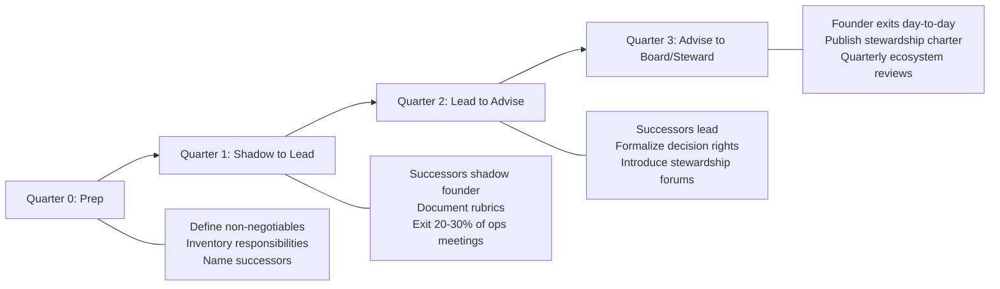

# Chapter 34: Ecosystem Leadership

> *Last Updated: March 2026*

> **Skim This Chapter**
> - Ecosystem leaders create value by designing standards, grants programs, and governance structures that empower others to build--not by controlling every outcome directly.
> - Output: Frameworks for grants program design, credible neutrality guardrails, role migration planning, and go-to-market strategies for creative-technical ventures.

## Introduction: The Counterintuitive Power of Letting Go

The Ethereum Foundation's grants program did not build Ethereum's application layer—it funded the independent teams who did, catalyzing an ecosystem now worth hundreds of billions of dollars in cumulative value created. The Linux Foundation did not write Kubernetes, but by establishing governance standards and neutral stewardship it shaped the entire cloud-native industry that Fortune 500 companies now depend on. In both cases, the ecosystem leader's greatest leverage came not from building products but from designing the conditions under which others could build.

> **The ecosystem leader's paradox:** The more control you give away, the more value you create. The best ecosystem leaders design systems where others succeed—and the ecosystem compounds as a result.

This chapter is about that form of leadership: designing standards, grants programs, governance structures, and incentive systems that compound ecosystem value far beyond what any single organization could produce alone. For founders transitioning from product builders to system stewards, the challenge is learning to lead without controlling—and to measure success by the achievements of others building on your foundations.

## In This Chapter, You Will

- Lead without control: standards, interfaces, and norms
- Design grant and incentive programs that compound ecosystem value
- Balance credible neutrality with a strong point of view
- Build institutions that survive leadership transitions

## Founder’s Checklist

- What standards or APIs could unlock 10x downstream creation?
- How do we avoid capture while funding ecosystem work?
- Where do we publish roadmaps and accept community RFDs/RFCs?
- Who are our emerging leaders and how do we support them?

## Exercises

- Launch a focused grants program with clear outcomes and audits
- Propose a standards effort; convene 3 external stakeholders
- Document a succession and stewardship plan for key roles

## Related Case Studies

**Web3 Ecosystem Leadership:**
- Farcaster: ../case-studies/2025-emerging-case-studies.md#farcaster-decentralized-social-infrastructure
- Zora: ../case-studies/2025-emerging-case-studies.md#zora-creative-economy-infrastructure
- Privy: ../case-studies/2025-emerging-case-studies.md#privy-embedded-wallet-infrastructure

**Established Ecosystem Leaders:**
- Cosmos: ../case-studies/compendium.md#cosmos
- Polygon: ../case-studies/compendium.md#polygon
- Hugging Face: ../case-studies/compendium.md#hugging-face

## Case Studies: Creative Technology Pioneers

### Luma Labs: Empowering Creative Expression Through AI

Luma Labs bridges creation and technology, demonstrating how technical founders can empower creative communities:

- **Creator tools:** Making 3D generation accessible to artists without technical backgrounds
- **Technical innovation:** Neural radiance fields democratized for everyone
- **Business model:** Subscription-based creative platform with tiered access
- **Community:** Artists pushing tool boundaries and defining new aesthetic categories
- **Vision:** Democratizing 3D content creation beyond traditional production pipelines

Their success shows how technical founders can create genuine value by deeply understanding creative workflows and needs rather than simply building tools and hoping creators will adapt.

### Midjourney: The Artist-Engineer Hybrid

Midjourney's unique position demonstrates the power of creator-founder convergence:

- **Founder background:** David Holz's blend of design intuition and engineering capability
- **Aesthetic focus:** Prioritizing beauty and artistic expression over mere accuracy
- **Community-driven:** Discord as both product interface and distribution mechanism
- **Independent path:** Bootstrapped growth without traditional VC funding dependencies
- **Cultural impact:** Defining AI art aesthetics and influencing entire creative movements

### RunwayML: Professional Creative Tools

RunwayML's creator-first approach shows how to build for professional creative workflows:

- **Film industry focus:** Tools specifically designed for video professionals
- **Educational mission:** Teaching AI concepts to creatives rather than assuming technical knowledge
- **Workflow integration:** Fitting existing creative processes rather than forcing adoption of new paradigms
- **Research to product:** Translating academic papers into practical creative tools
- **Creator economy:** Enabling new business models through accessible AI capabilities

### Hugging Face: The Creative Developer Platform

Hugging Face enables creator-developers through accessible AI infrastructure:

- **Model accessibility:** One-click deployments removing technical barriers
- **Creative applications:** Supporting everything from text to image to music generation
- **Community sharing:** Models become creative tools shared across the ecosystem
- **Low-code options:** Spaces platform for non-developers to experiment and deploy
- **Remix culture:** Building on others' work through accessible model sharing

## Where Web3 and AI Create Entirely New Market Possibilities

### Intersection Analysis Framework

The most valuable opportunities emerge where complementary capabilities address limitations each technology faces individually—creating solutions impossible through either approach alone. Effective analysis requires systematic rather than merely intuitive assessment.

**Capability Complementarity Assessment**

Identifying how technologies address each other's limitations:
- AI's centralization challenge meets Web3's decentralization mechanisms
- Web3's computational efficiency limitations meet AI's processing capabilities
- AI's trust and verification issues meet Web3's cryptographic guarantees
- Web3's coordination complexity meets AI's optimization capabilities
- AI's alignment challenges meet Web3's incentive design mechanisms
- Creator monetization challenges meet programmable ownership solutions

This complementarity assessment transforms opportunity identification from random combination to strategic integration—finding intersections where technologies solve each other's fundamental challenges.

**The "Venn of Viability" Implementation**

Evaluating opportunities across three essential dimensions:
- **Desirability:** Solving problems people genuinely care about addressing
- **Feasibility:** Creating technically implementable solutions with reasonable resources
- **Alignment:** Generating appropriate incentives and governance across stakeholders

### Novel Use Case Identification

Beyond general frameworks, specific convergence patterns create recognizable opportunity categories—emerging use cases that demonstrate how AI-Web3-Creator integration creates genuinely novel capabilities.

**Autonomous On-Chain Agents**

AI-powered entities operating through blockchain infrastructure:
- Self-executing smart contracts with intelligence beyond predefined conditions
- Autonomous market makers optimizing parameters through learning
- DAO-governed agents performing complex tasks with accountability
- Creative agents generating content with verifiable provenance
- Economic actors participating in markets with sophisticated strategies

**Reputation-Based Model Access**

Credential systems merging on-chain history with AI capability:
- Access control based on verifiable past behavior rather than simple payment
- Contribution-based qualification for advanced model capabilities
- Creator verification systems ensuring authentic human artistic contribution
- Sybil-resistant systems preventing manipulation through identity verification
- Progressive capability unlocking through demonstrated responsibility

**Decentralized AI Orchestration**

Distributed coordination of intelligence without central control:
- Federated model training across decentralized data sources
- Competitive improvement through multiple model providers with shared standards
- Creator-owned AI models trained on individual artistic styles
- Resource allocation through market mechanisms rather than platform control
- Collective governance of parameters and capabilities

**Crypto-Funded Creative Collectives**

Community-organized development through tokenized mechanisms:
- Pooled resources enabling large-scale training beyond individual capacity
- Tokenized governance determining creative direction and application
- Shared ownership of resulting capabilities through contribution-based allocation
- Creator DAOs funding and governing artistic AI development
- Transparent development visible to all participants rather than proprietary progress

## Multi-Agent Systems with On-Chain Verification

One particularly promising convergence area involves multi-agent systems with blockchain verification—creating intelligent, autonomous systems with cryptographically verifiable behavior impossible through either AI or blockchain technology independently.

### Architecture Design

Effective multi-agent systems with on-chain verification require deliberate architectural approaches integrating AI capabilities with blockchain mechanisms in ways that leverage their complementary strengths.

**Agent Composition and Interaction Models**

Designing effective agent ecosystems:
- Specialized agent roles creating division of labor with appropriate expertise
- Communication protocols enabling effective information exchange
- Coordination mechanisms ensuring aligned rather than conflicting actions
- Creative collaboration patterns between human creators and AI agents
- Escalation pathways determining when human involvement occurs

**Blockchain Integration Patterns**

Creating effective connection between agents and distributed ledgers:
- Event monitoring enabling agent response to on-chain activities
- Transaction submission providing agent capability to modify state
- Storage utilization balancing on-chain and off-chain information management
- Creative work provenance tracking through immutable records
- Key management ensuring appropriate authentication and authorization

### Trust and Verification Mechanisms

Beyond basic architecture, specific mechanisms create verifiable trust in autonomous systems—addressing the fundamental challenge of ensuring reliable operation without constant human oversight.

**Output Signing and Verification**

Cryptographic approaches to action attribution:
- Digital signatures ensuring agent action authenticity
- Provenance tracking maintaining complete creative work history
- Identity verification confirming appropriate authorization
- Version control establishing which agent version performed actions
- Creative attribution ensuring proper crediting of human and AI contributions

**On-Chain Checkpointing Implementation**

Establishing verifiable state records at regular intervals:
- Periodic state commitment recording system status
- Hash verification enabling state consistency confirmation
- Creative work milestone recording preserving development history
- Anomaly detection identifying unexpected changes
- Rollback mechanisms providing recovery capability

## Founder Evolution: Exec 360 and Role Migration

As ecosystems scale, founders must evolve from product operators to system stewards. Bake in feedback and design an explicit migration path for roles.

### Executive 360 Template (Lightweight)

Scope: CEO/founding execs; quarterly; anonymous plus attributed components.

- Outcomes & Strategy
  - Clarity of strategy (1–5) with examples
  - Quality of prioritization and tradeoffs (1–5)
  - Evidence of long‑term thinking vs. short‑term optimization

- Leadership & Org Health
  - Talent density and hiring bar upheld (Y/N with examples)
  - Delegation effectiveness; clear ownership and decision rights (1–5)
  - Psychological safety and candor indicators (1–5)

- Ecosystem Stewardship
  - Quality of external forums/standards participation (1–5)
  - Grants/public goods alignment with mission (1–5)
  - Neutrality vs. capture balance; conflict of interest handling

- Governance & Execution
  - Predictability of commitments; slips transparently managed (1–5)
  - Incident response quality and learning loops (1–5)
  - Board/community communication cadence and substance

- Open Feedback
  - Start/Stop/Continue (3 bullets each)
  - One decision you would reverse; one you would double down on

Process:
- 10–12 raters (peers, reports, key external partners); mix attributed (board/ELT) and anonymous (reports/peers).
- Synthesis memo with themes, actions, and owner; publish an internal summary.
- Track 2–3 commitments next quarter; revisit completion.

### Role Migration Plan (Sample)



Goal: Transition founder from Head of Everything → System Leader over 2–3 quarters without execution gaps.

Quarter 0 (Prep)
- Define non‑negotiables for the role (vision, governance, external alliances).
- Inventory critical founder‑held responsibilities and decision types.
- Name successors/owners; draft RACI for each domain.

Quarter 1 (Shadow → Lead)
- Successors shadow founder on decisions; founder documents rubrics and playbooks.
- Weekly “decision review” to calibrate judgments and thresholds.
- Founder exits 20–30% of operational meetings; installs dashboards for visibility.

Quarter 2 (Lead → Advise)
- Successors lead; founder attends only escalation checkpoints.
- Formalize decision rights; update org chart and comms.
- Introduce external stewardship forums (standards, grants, councils) as founder’s primary lane.

Quarter 3 (Advise → Board/Steward)
- Founder fully exits day‑to‑day ops for migrated domains.
- Publish a stewardship charter (what the founder will and won’t do).
- Establish quarterly ecosystem review in place of weekly ops.

Guardrails
- Red‑flag re‑entry: define criteria for the founder to step back in (security, solvency, existential alignment breaches).
- Post‑mortems on migration misses; adjust rubrics rather than re‑centralizing by default.

## The Creator-Founder Journey: From Art to Enterprise

### Identity Evolution

The transition from pure creator to founder requires fundamental shifts in identity and approach:

**From Creator to Entrepreneur**
- Balancing artistic vision with business sustainability
- Understanding market needs without compromising creative integrity
- Building teams that amplify rather than constrain creative vision
- Developing business skills while maintaining artistic sensibility
- Creating sustainable practices that support long-term creative work

**Technology as Creative Medium**
- AI as creative partner rather than replacement
- Blockchain for attribution and ownership verification
- Computational creativity expanding expressive possibilities
- Generative systems enabling new forms of artistic expression
- Programmable ownership creating new revenue models

### Business Models for Creator-Founders

**Subscription Creative Platforms**
- Tiered access to AI-powered creative tools
- Community features enabling collaboration and sharing
- Educational content teaching both creativity and technology
- Professional services for enterprise creative workflows
- Marketplace dynamics connecting creators with audiences

**NFTs and Programmable Ownership**
- Smart contracts enabling automatic royalty distribution
- Fractional ownership of creative works enabling broader participation
- Dynamic NFTs that evolve based on on-chain or real-world events
- Creator DAOs governing collective creative projects
- Utility tokens providing access to exclusive creative tools or content

**Token-Funded Creative Development**
- Community funding for large-scale creative projects
- Governance tokens enabling audience participation in creative decisions

---

## Grants Program Rubric

Score proposals consistently and publish rationale. Suggested weights in parentheses.

| Dimension | Weight | What to Evaluate |
|---|---|---|
| Problem Clarity | 15% | Specific, validated need; users identified; not duplicative |
| Ecosystem Value | 25% | Open standards, reusable modules, docs; positive spillovers |
| Feasibility | 15% | Team capability, milestones, risks, dependencies |
| Alignment | 10% | With roadmap, values, credible neutrality |
| Execution Plan | 15% | Milestones, budget by workstream, testing/validation plan |
| Sustainability | 10% | Maintainer plan, ongoing funding, handoff path |
| Transparency | 10% | Public repo, regular updates, artifact plan |

Scoring: 0–5 per dimension; fund >3.5 weighted average; require minimum 3 on Ecosystem Value and Transparency.

Required sections (template)
```
Title & Summary
Problem & Users
Proposed Work (milestones & deliverables)
Open Outputs (code/docs/standards)
Team & Track Record
Budget (by milestone; disbursement schedule)
Risks & Dependencies
Success Criteria & Measurement
Maintenance & Sustainability Plan
Disclosure (funding, affiliations, conflicts)
```

## Reporting Template (Grantees)

Cadence: monthly for active grants; final report at completion. All reports public by default.

```
Project: <name>
Grant ID: <id>
Period: <YYYY‑MM>

Summary (3–5 bullets)
Milestone Status
- M1: <desc> — Done/On Track/At Risk/Blocked
- M2: <desc> — …

Artifacts
- Code/Docs/Specs links
- Demos/videos

Metrics
- Adoption/usage (if applicable)
- Quality/reliability (tests, issues)

Budget
- Disbursed this period: $X
- Burn vs. plan: On track / +/- %

Risks/Issues
- New risks, mitigations, asks

Next Period Plan
- Goals & deliverables

Compliance
- License, IP status
- Conflict disclosures (updates)
```

## Credible Neutrality Guardrails

Design processes to minimize capture and favoritism.

- Open Calls: published eligibility, timeline, and rubric before review starts
- Reviewer Pool: diverse, rotating; publish selection criteria; publish reviewer list ex post
- Conflict Policy: mandatory disclosure; abstain from related reviews; publish recusal log
- Decision Records: publish scores, comments (redacted if needed), funding rationale, minority opinions
- Caps & Diversification: per‑team cap; portfolio balance across categories and geographies
- Milestone‑Based Disbursement: release funds upon artifact review; clawback clause for non‑delivery
- Appeals: structured appeals window (e.g., 14 days) to independent steward group
- Transparency Hub: single page with active grants, budgets, timelines, artifacts, and reports

Anti‑capture practices
- Term limits for stewards; separation of grant ops vs. strategic council
- Public office hours; Q&A logs; publish all questions and answers
- Use open standards and neutral infra; avoid tying grants to proprietary lock‑in
- Shadow evaluations to detect bias; periodic external audit of outcomes vs. rubric
- Reward distribution based on creative contribution measurement
- Tokenized creative education and skill development programs
- Creator-owned platforms competing with traditional gatekeepers

### Community Building for Creator-Founders

**Fan Engagement Evolution**
- Direct creator-audience relationships without platform intermediaries
- Programmable fan rewards based on engagement and support
- Collaborative creation opportunities enabled by blockchain governance
- Exclusive access to creative processes and behind-the-scenes content
- Community-driven creative direction through tokenized voting

**Creative DAOs and Collectives**
- Shared ownership of creative tools and resources
- Collective funding of ambitious creative projects beyond individual means
- Open-source artistic development with attribution tracking
- Remix culture with automatic attribution and compensation
- Global creative collaboration enabled by trustless coordination

## Implementation Guide: Building at the Creative-Technical Intersection

### Opportunity Assessment Framework

Effective creator-founder convergence begins with structured evaluation—identifying genuine opportunities where creative, technical, and economic innovation intersect meaningfully.

**Creative Problem Identification**

Finding challenges requiring both artistic vision and technical innovation:
- Accessibility barriers preventing creators from using advanced tools
- Attribution problems in collaborative or AI-assisted creative work
- Monetization challenges for emerging creative mediums
- Distribution limitations constraining creative reach and impact
- Collaboration difficulties across geographic and cultural boundaries

**Stakeholder Analysis Implementation**

Mapping potential participants in creative-technical ecosystems:
- Creator communities identifying specific needs and workflows
- Technical developers understanding implementation requirements
- Audience segments evaluating demand for new creative experiences
- Platform incumbents assessing competitive dynamics
- Economic participants understanding value flow and capture mechanisms

### Technical Feasibility Analysis

Beyond opportunity identification, creator-founder innovation requires realistic technical assessment—understanding implementation requirements for both creative and technical components.

**Creative Workflow Integration**

Assessing how technology fits into actual creative processes:
- User experience design prioritizing creative flow over technical complexity
- Performance requirements ensuring real-time creative interaction
- Learning curve evaluation minimizing barriers to creative adoption
- Professional workflow compatibility fitting existing creative industry standards
- Collaboration capability enabling multi-creator and creator-audience interaction

**Economic Mechanism Design**

Understanding tokenomics and incentive structures for creative ecosystems:
- Value capture mechanisms ensuring creators receive fair compensation
- Distribution algorithms balancing various stakeholder interests
- Governance systems enabling community participation in platform evolution
- Scalability considerations for growing creator and audience communities
- Regulatory compliance ensuring sustainable operation across jurisdictions

### Go-to-Market Strategy for Creator-Founder Ventures

**Community-First Approaches**

Building user base through creative community development:
- Artist residency programs demonstrating platform capabilities
- Educational initiatives teaching both creativity and technology
- Collaborative projects showcasing new possibilities
- Open-source tool development building developer and creator ecosystems
- Cultural events and exhibitions highlighting platform-enabled creativity

**Partnership-Based Introduction**

Leveraging existing relationships and platforms:
- Gallery and museum partnerships for digital art initiatives
- Educational institution collaboration for creative technology programs
- Brand partnerships enabling commercial creative applications
- Platform integrations expanding reach through existing creator communities
- Industry conference participation establishing thought leadership

## The Future of Creative Technology Entrepreneurship

### Role Transformation in Creative Industries

**Creator-to-Platform Evolution**

The transformation from individual creator to platform builder:
- Personal creative work scaling through technology platforms
- Community building around creative tools and processes
- Educational content creation teaching creative technology skills
- Consultation services for creative industry transformation
- Investment and mentorship in other creator-founder ventures

**Collaborative Intelligence Integration**

The evolution of human-AI creative collaboration:
- AI tools augmenting rather than replacing human creativity
- Creative direction and curation as distinctly human contributions
- Technical implementation handled by AI with human oversight
- Quality assessment and aesthetic judgment remaining human-driven
- Strategic business development requiring human relationship building

### Income Distribution Models for Creative Entrepreneurs

**Contribution-Based Value Sharing**

Creating direct value recognition for creative work:
- Automated tracking of creative contribution to platform value
- Impact assessment measuring cultural and economic influence
- Attribution systems ensuring proper crediting across collaborative works
- Reward distribution providing compensation proportional to value creation
- Transparency mechanisms ensuring visible and verifiable processes

**Token-Based Creative Economics**

Implementing programmable economics for creative value distribution:
- Creative work tokenization enabling fractional ownership and trading
- Governance participation through creative contribution rather than just financial stake
- Automatic royalty distribution through smart contract implementation
- Community funding mechanisms enabling ambitious creative projects
- Liquidity provision enabling creators to realize value when needed

## Key Takeaways: Building at the Creative-Technical Frontier

### Convergence Creates Primitives, Not Just Products

The most valuable opportunities often involve fundamental capability creation rather than merely specific applications—establishing new technological and creative primitives enabling diverse implementation rather than narrow point solutions addressing limited use cases.

These primitives transform possibility space beyond particular products—creating foundation for entire categories of innovation rather than merely individual offerings potentially generating extraordinary rather than ordinary value through enabling rather than merely implementing capability.

### Creators + Technology = New Economic Models

The combination of creative vision with technical capability creates particularly transformative possibilities—enabling new forms of value creation, distribution, and recognition beyond what either domain alone could achieve.

This combination transforms creative work from individual to collaborative endeavors with programmable economics—creating sustainable creative careers through novel monetization mechanisms while maintaining artistic integrity.

### The Stack Is Becoming Creative—and Decentralized

The technology infrastructure itself is evolving toward creative capability and distributed control—creating systems with unprecedented artistic potential and creator ownership through complementary characteristics previously considered contradictory.

This evolution transforms creative infrastructure from extractive platforms to creator-owned systems—enabling environmental rather than merely tooling change potentially representing fundamental shift in creative-economic relationships.

### New Categories Demand New Mental Models

Successfully identifying and executing on creator-founder opportunities requires different thinking—creating appropriate conceptual frameworks for understanding novel creative-technical categories rather than merely applying existing models potentially inadequate for genuine innovation.

This conceptual development transforms opportunity recognition beyond pattern matching—creating ability to perceive genuinely novel patterns rather than merely variations on familiar categories potentially limiting innovation to incremental rather than transformative possibilities.

### What You Build Now May Define Creative Culture for Generations

Early creator-founder innovation creates potential for extraordinary cultural impact—establishing foundations others build upon rather than merely creating specific products potentially generating outsized influence through cultural rather than merely application-level contribution.

This foundation development transforms potential impact from product to infrastructure scale—creating lasting cultural value through establishing essential rather than optional capabilities potentially determining fundamental rather than incidental characteristics of future creative expression and economic opportunity.

### Case Study: Shopify — Ecosystem Leadership as Economic Empowerment

Shopify, founded by Tobi Lutke in Ottawa, Canada, provides one of the most instructive examples of ecosystem leadership at scale. What began as an online snowboard shop in 2006 evolved into a platform powering millions of merchants across 175 countries, supported by an ecosystem of over 8,000 third-party applications and tens of thousands of developers, designers, and service partners.

Shopify's ecosystem leadership model embodies the core principle of this chapter: leading without control. Lutke and his team made a deliberate architectural decision early on to build a platform that empowered others to create value rather than attempting to capture every function internally. The Shopify App Store allowed independent developers to build integrations covering everything from inventory management to email marketing to accounting. Rather than competing with these partners, Shopify provided the rails and let ecosystem participants specialize.

This approach required the credible neutrality guardrails discussed in this chapter. Shopify had to resist the temptation to build first-party alternatives to its most successful partners, and when it did enter adjacent areas such as payments and fulfillment, it had to demonstrate that its platform remained open and fair. The company published transparent API documentation, maintained consistent partner revenue shares, and invested in programs like Shopify Partners and Shopify Plus that gave ecosystem participants predictable economics.

The grants and incentive design parallels are equally instructive. Shopify invested heavily in developer education, partner programs, and ecosystem tooling. Its annual Unite and Editions events functioned like the standards-setting convenings described in this chapter's framework, where the company shared its roadmap openly and invited ecosystem participants to shape platform direction. The Shopify Fund invested directly in companies building on the platform, aligning the company's financial interests with ecosystem health.

What makes Shopify particularly relevant for founders studying ecosystem leadership is its demonstration of the multiplier effect. By enabling millions of merchants to start and grow businesses, Shopify created economic value far exceeding what any single company could produce alone. During the early period of the COVID-19 pandemic, the platform enabled thousands of businesses to move online within days, demonstrating how ecosystem infrastructure can respond to crises faster than any centralized solution.

Shopify's journey from a single storefront to a global commerce ecosystem illustrates this chapter's thesis that the most durable technology companies often succeed not by building the best product but by building the best platform for others to build upon.

---

*The convergence of creativity, AI, and Web3 represents more than technological evolution—it's the emergence of entirely new forms of artistic expression and economic organization. For creator-founders building at this intersection, the opportunity exists not just to create successful companies but to define the fundamental architecture of how creativity, technology, and value creation will operate in the cultural economy of the future.*


## Further Reading

- **Platform Revolution** by Geoffrey G. Parker, Marshall W. Van Alstyne, and Sangeet Paul Choudary — The foundational text on how platform businesses create value by facilitating interactions across multi-sided ecosystems.
- **The Wide Lens** by Ron Adner — Examines why innovation success depends on managing ecosystem risks and aligning partners, not just building great products.
- **Governing the Commons** by Elinor Ostrom — Nobel Prize-winning research on how communities self-govern shared resources, directly applicable to decentralized ecosystem governance.
- **The Keystone Advantage** by Marco Iansiti and Roy Levien — Analyzes how ecosystem leaders create shared value and maintain network health, drawing parallels between biological and business ecosystems.
- **Blockchain and the Law** by Primavera De Filippi and Aaron Wright — Explores how decentralized technologies reshape governance, ownership, and coordination in digital ecosystems.

## Sources

1. Adner, R. (2017). "Ecosystem as Structure: An Actionable Construct for Strategy." *Journal of Management*, 43(1), 39-58.
2. Jacobides, M.G., Cennamo, C., & Gawer, A. (2018). "Towards a Theory of Ecosystems." *Strategic Management Journal*, 39(8), 2255-2276.
3. Gawer, A. & Cusumano, M.A. (2014). "Industry Platforms and Ecosystem Innovation." *Journal of Product Innovation Management*, 31(3), 417-433.
4. Iansiti, M. & Levien, R. (2004). *The Keystone Advantage: What the New Dynamics of Business Ecosystems Mean for Strategy, Innovation, and Sustainability*. Harvard Business School Press.
5. Baldwin, C.Y. & Clark, K.B. (2000). *Design Rules: The Power of Modularity*. MIT Press.
6. Ostrom, E. (1990). *Governing the Commons: The Evolution of Institutions for Collective Action*. Cambridge University Press.
7. Parker, G.G., Van Alstyne, M.W., & Choudary, S.P. (2016). *Platform Revolution: How Networked Markets Are Transforming the Economy*. W.W. Norton.
8. De Filippi, P. & Wright, A. (2018). *Blockchain and the Law: The Rule of Code*. Harvard University Press.

---

**Previously:** [Chapter 33: Community Building](ch33-community-building.md) — Provided frameworks for building sustainable communities through contributor ladders, incentive design, governance basics, and health metrics.

**Next:** [Chapter 35: Operational Excellence](ch35-operational-excellence.md) — Addresses how to build systematic approaches to quality, efficiency, and reliability that sustain growth without sacrificing innovation.
