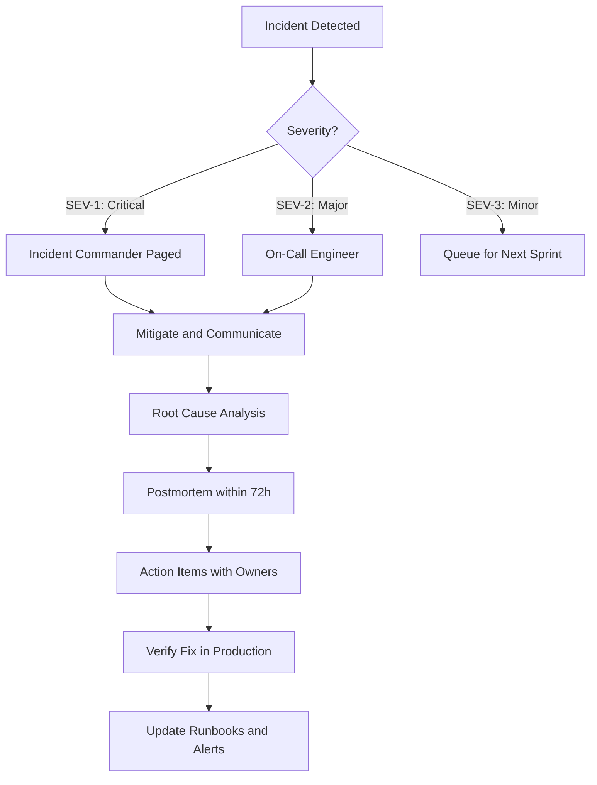

# Chapter 35: Operational Excellence

> *Last Updated: March 2026*

> **Skim This Chapter**
> - Operational excellence is the difference between ventures that scale and those that collapse under their own growth; it requires designing anti-fragile systems, predictive operations, and clear incident response before crises force your hand.
> - Output: Operations maturity model, scaling playbooks by function, cost curve frameworks, growth stall diagnostics, re-architecture decision criteria, and onboarding templates.

## The Foundation of Sustainable Growth

In 2019, Coinbase processed a few hundred thousand transactions per day. By 2021, daily volumes had surged a hundredfold during peak market activity. The engineering team that could handle the earlier load was suddenly drowning---and every outage during a market spike cost millions in lost revenue and user trust. Coinbase survived because it had invested in operational infrastructure before it was urgently needed. Many competitors did not.

The pattern repeats across every scaling venture: early-stage companies succeed through vision, agility, and creative problem-solving. But scaling organizations live or die on systematic approaches to quality, efficiency, and reliability. The question is not whether you will need operational excellence---it is whether you will build it before or after a crisis forces your hand.

## Systems Thinking for Operations

### Process Design vs. Process Optimization

Most scaling companies fall into the trap of optimizing broken processes rather than redesigning systems for scale. Operational excellence begins with understanding the difference between incremental improvements and fundamental system redesign.

**System Redesign Principles:**
- Design for 10x growth, not 2x improvement
- Eliminate handoffs rather than optimizing them
- Build measurement into processes from the beginning
- Create self-correcting rather than managed systems
- Focus on outcomes, not activities

### The Operations Maturity Model

**Level 1: Heroic Operations**
- Individual expertise drives results
- Tribal knowledge and informal processes
- Reactive problem-solving and firefighting
- Success depends on specific people being available
- Documentation is sparse and quickly outdated

**Level 2: Process-Driven Operations**
- Documented procedures and workflows
- Clear roles and responsibilities
- Standardized tools and technologies
- Basic monitoring and alerting systems
- Regular team meetings and status updates

**Level 3: Measurement-Based Operations**
- Key performance indicators (KPIs) and service level objectives (SLOs)
- Data-driven decision making processes
- Automated monitoring and incident response
- Performance benchmarking and optimization
- Regular retrospectives and process improvements

**Level 4: Predictive Operations**
- Proactive issue identification and resolution
- Capacity planning and scaling automation
- Machine learning for anomaly detection
- Self-healing systems and autonomous operations
- Continuous optimization and adaptation

**Level 5: Ecosystem Operations**
- Operations excellence extends to partners and customers
- Shared operational standards and practices
- Community-driven improvement and innovation
- Operations as a competitive differentiator
- Exponential value creation through operational leverage

| Maturity Level | Decision Style | Documentation | Failure Response | Scaling Model |
|---|---|---|---|---|
| Level 1: Heroic | Ad hoc, individual | Sparse, tribal | Reactive firefighting | Hire more heroes |
| Level 2: Process-Driven | Role-based, procedural | Documented workflows | Structured triage | Replicate processes |
| Level 3: Measurement-Based | Data-informed | KPIs and SLOs tracked | Automated alerting | Optimize bottlenecks |
| Level 4: Predictive | ML-assisted, proactive | Self-updating runbooks | Self-healing systems | Capacity auto-scaling |
| Level 5: Ecosystem | Community-governed | Shared standards | Anti-fragile adaptation | Partner-extended |



### Building Anti-Fragile Operations

Inspired by Nassim Taleb's concept of anti-fragility, excellent operations don't just survive disruption—they get stronger from it. This requires designing systems that benefit from volatility and uncertainty.

**Anti-Fragile Design Patterns:**

1. **Redundancy with Diversity**: Multiple pathways to achieve the same outcome
2. **Controlled Failure**: Regular testing of failure scenarios (chaos engineering)
3. **Adaptive Capacity**: Systems that automatically adjust to changing conditions
4. **Learning Amplification**: Converting every incident into organizational knowledge
5. **Loose Coupling**: Independent components that can fail without cascading effects

**Implementation Strategies:**

- **Chaos Engineering**: Regularly inject failures to test system resilience
- **Circuit Breakers**: Automatic protection against cascading failures
- **Feature Flags**: Ability to quickly enable/disable functionality
- **Blue-Green Deployments**: Zero-downtime deployment strategies
- **Observability**: Deep visibility into system behavior and performance

### Quality as a System Property

Quality cannot be inspected or added after the fact—it must be designed into the system architecture. This requires thinking about quality as an emergent property of good systems rather than a separate function.

**Quality System Components:**
- Clear definition of done for every process
- Automated checking where possible
- Human judgment for complex decisions
- Fast feedback loops for continuous improvement
- Error prevention over error detection

### The Quality Engineering Framework

**1. Prevention Over Detection**

Rather than catching defects after they occur, build systems that make defects impossible or immediately obvious:

- **Type Safety**: Use strong typing to prevent entire classes of errors
- **Contract Testing**: Ensure interfaces between components remain compatible
- **Static Analysis**: Catch issues before code is executed
- **Design Reviews**: Identify potential issues in system architecture
- **Progressive Deployment**: Limit blast radius of changes

**2. Shift-Left Testing Strategy**

Move quality assurance activities earlier in the development lifecycle:

- **Test-Driven Development (TDD)**: Write tests before implementing functionality
- **Continuous Integration**: Run tests on every code change
- **Local Testing**: Ensure developers can test changes before committing
- **Property-Based Testing**: Generate test cases automatically
- **Mutation Testing**: Verify test quality by introducing bugs

**3. Production Quality Monitoring**

Quality doesn't end at deployment—monitor and measure quality in production:

- **Error Rate Monitoring**: Track and alert on increasing error rates
- **Performance Regression Detection**: Identify performance degradation
- **User Experience Monitoring**: Measure real user impact
- **Business Metrics Correlation**: Connect technical quality to business outcomes
- **Continuous Deployment Confidence**: Automate rollback decisions

**4. Quality Culture Development**

- **Blameless Post-mortems**: Focus on system improvements, not individual blame
- **Quality Champions**: Dedicated roles for promoting quality practices
- **Cross-functional Reviews**: Include multiple perspectives in quality assessments
- **Customer Impact Awareness**: Connect quality issues to customer outcomes
- **Continuous Learning**: Regular training and skill development

## Technology Infrastructure for Scale

### Beyond Traditional DevOps

Web3 and AI-native companies require infrastructure approaches that go beyond traditional software development practices. The distributed, autonomous nature of these systems creates new requirements for monitoring, debugging, and optimization.

**Infrastructure Considerations:**
- Multi-chain deployment strategies
- AI model versioning and rollback capabilities
- Decentralized monitoring and alerting
- Privacy-preserving analytics
- Autonomous system health checking

### Web3-Specific Operational Challenges

**Immutable Infrastructure Management:**
Unlike traditional software, smart contracts cannot be easily updated once deployed. This requires:

- **Proxy Patterns**: Upgradeable contract architectures
- **Migration Strategies**: Moving state between contract versions
- **Governance Mechanisms**: Community-driven upgrade decisions
- **Emergency Procedures**: Circuit breakers for critical vulnerabilities
- **Audit Trails**: Immutable logs of all operational changes

**Multi-Chain Operations:**
Managing operations across multiple blockchains introduces complexity:

- **Cross-Chain Monitoring**: Tracking transactions across different networks
- **Unified Dashboards**: Single pane of glass for multi-chain systems
- **Bridge Monitoring**: Special attention to cross-chain bridge health
- **Gas Optimization**: Managing transaction costs across networks
- **Regulatory Compliance**: Different requirements per jurisdiction/chain

**Decentralized Infrastructure:**
Operating truly decentralized systems requires new approaches:

- **Node Health Monitoring**: Tracking validator/node performance
- **Consensus Monitoring**: Ensuring network health and participation
- **Slashing Protection**: Preventing validator penalties
- **Decentralized Alerting**: Alert systems that don't rely on centralized services
- **Community Operations**: Engaging token holders in operational decisions

### AI-Specific Operational Excellence

**Model Lifecycle Management:**

- **Version Control**: Track model versions, training data, and performance
- **A/B Testing**: Compare model performance in production
- **Model Decay Monitoring**: Detect when models become less accurate
- **Automated Retraining**: Trigger retraining based on performance thresholds
- **Rollback Capabilities**: Quick reversion to previous model versions

**Data Pipeline Operations:**

- **Data Quality Monitoring**: Detect drift, anomalies, and quality issues
- **Feature Store Management**: Centralized feature management and versioning
- **Privacy Compliance**: Ensure data handling meets regulatory requirements
- **Bias Detection**: Monitor for algorithmic bias in model outputs
- **Explainability**: Maintain audit trails for model decisions

**Inference Infrastructure:**

- **Auto-scaling**: Handle varying inference loads efficiently
- **Latency Optimization**: Minimize response times for real-time applications
- **Cost Management**: Balance performance with infrastructure costs
- **Error Handling**: Graceful degradation when models fail
- **Caching Strategies**: Optimize for repeated similar requests

### Cloud-Native Operations

**Container Orchestration:**
- **Kubernetes Management**: Declarative infrastructure management
- **Service Mesh**: Traffic management and security between services
- **Resource Optimization**: Right-sizing compute and memory allocation
- **Multi-Zone Deployments**: High availability across failure domains
- **Secrets Management**: Secure handling of sensitive configuration

**Observability Stack:**
- **Distributed Tracing**: Track requests across microservices
- **Metrics Collection**: Time-series data for performance monitoring
- **Centralized Logging**: Searchable logs across all services
- **Alerting Rules**: Proactive notification of issues
- **Dashboard Automation**: Self-updating operational dashboards

**Security Operations (SecOps):**
- **Vulnerability Scanning**: Continuous scanning of dependencies
- **Compliance Monitoring**: Automated compliance checking
- **Incident Response**: Rapid response to security incidents
- **Access Management**: Principle of least privilege access
- **Security Metrics**: Track security posture over time

## In This Chapter, You Will

- Establish lightweight processes that increase speed and quality
- Instrument your system with SLOs, runbooks, and postmortems
- Create hiring, onboarding, and leadership routines that scale
- Align operations with governance and community promises

## Founder’s Checklist

- Do we have a single source of truth for priorities?
- Are on‑call, incidents, and postmortems real and used?
- What’s our definition of done (tests, docs, security checks)?
- How do we keep meetings short and decisions documented?

## Exercises

- Write a 2‑page operating cadence (rituals, artifacts, roles)
- Add SLOs and an incident template; run a tabletop incident
- Create a new‑hire onboarding checklist and a 30/60/90 plan

### Data Architecture for Decision Making

Operational excellence requires data-driven decision making, but this means designing data collection and analysis capabilities from the ground up rather than retrofitting analytics onto existing systems.

**Data System Requirements:**
- Real-time operational dashboards
- Predictive analytics for capacity planning
- Privacy-compliant user behavior analysis
- Cross-system correlation and analysis
- Automated anomaly detection and alerting

### Modern Data Stack for Operations

**Data Collection Layer:**
- **Application Metrics**: Performance, usage, and error metrics
- **Infrastructure Metrics**: System resource utilization
- **Business Metrics**: Revenue, conversion, and engagement metrics
- **User Behavior Analytics**: Privacy-preserving user interaction tracking
- **External Data Sources**: Market data, competitor analysis, economic indicators

**Data Processing Pipeline:**
- **Stream Processing**: Real-time data transformation and enrichment
- **Batch Processing**: Large-scale data analysis and reporting
- **Data Validation**: Ensuring data quality and consistency
- **Data Lineage**: Tracking data flow and transformations
- **Data Cataloging**: Searchable metadata about available datasets

**Analytics and ML Platform:**
- **Exploratory Data Analysis**: Tools for data scientists and analysts
- **Automated ML Pipeline**: From feature engineering to model deployment
- **A/B Testing Framework**: Statistical testing for operational decisions
- **Predictive Analytics**: Forecasting for capacity planning and risk management
- **Anomaly Detection**: Automated identification of unusual patterns

**Data Governance:**
- **Privacy by Design**: Built-in privacy protection mechanisms
- **Data Retention Policies**: Automated data lifecycle management
- **Access Controls**: Role-based access to sensitive data
- **Audit Logging**: Track all data access and modifications
- **Compliance Reporting**: Automated compliance verification and reporting

### Decision Intelligence Framework

**1. Data-Driven Culture:**
- Every decision includes relevant data analysis
- Hypothesis formation before implementing changes
- Measurement plans for all significant initiatives
- Regular review of decision outcomes vs. predictions
- Celebration of learning from failed hypotheses

**2. Self-Service Analytics:**
- Business users can answer their own questions
- Pre-built dashboards for common operational questions
- SQL training for non-technical team members
- Automated report generation and distribution
- Data democratization without sacrificing governance

**3. Real-Time Decision Making:**
- Live dashboards for operational decisions
- Automated alerting for threshold breaches
- Integration with incident response systems
- Mobile access for on-call teams
- Context-aware notifications and recommendations

## Team Structure and Culture

### Distributed Excellence

Building operational excellence in distributed teams requires different approaches than traditional co-located organizations. Excellence becomes a cultural practice rather than a management function.

**Distributed Excellence Practices:**
- Documentation as the primary communication medium
- Asynchronous decision-making processes
- Clear ownership and accountability frameworks
- Transparent progress tracking and reporting
- Regular system health reviews and improvements

### Remote-First Operational Practices

**Communication Excellence:**

- **Written-First Communication**: Default to written communication with clear action items
- **Timezone-Aware Scheduling**: Plan meetings and deadlines considering global teams
- **Async Decision Making**: Use tools like RFCs and decision documents
- **Video Communication Standards**: When and how to use synchronous communication
- **Cultural Bridge Building**: Regular virtual team building and cross-cultural awareness

**Documentation as Infrastructure:**

- **Living Documentation**: Documentation that updates with code changes
- **Searchable Knowledge Base**: Centralized, searchable repository of information
- **Onboarding Documentation**: Self-service onboarding for new team members
- **Decision Records**: Architecture Decision Records (ADRs) for significant choices
- **Runbook Standards**: Consistent format for operational procedures

**Accountability Without Micromanagement:**

- **Outcome-Based Performance**: Focus on results rather than activity
- **Public Progress Tracking**: Transparent visibility into work progress
- **Self-Reporting Systems**: Team members report their own status and blockers
- **Trust and Verification**: Trust by default, verify through systems
- **Regular Check-ins**: Structured but not bureaucratic progress reviews

### High-Performance Team Dynamics

**Psychological Safety:**
- Create environment where team members feel safe to report errors
- Encourage experimentation and intelligent risk-taking
- Focus on learning from failures rather than assigning blame
- Support team members during high-pressure situations
- Celebrate both successes and valuable failures

**Continuous Improvement Culture:**
- Regular retrospectives with actionable outcomes
- Kaizen approach to incremental improvement
- Innovation time for exploring new approaches
- External learning and conference attendance
- Internal knowledge sharing sessions

**Operational Excellence Champions:**
- Dedicated roles focused on operational improvement
- Cross-functional teams for major operational initiatives
- Mentorship programs for operational skills
- Recognition and rewards for operational contributions
- Career progression paths that value operational expertise

### Continuous Learning Systems

Operational excellence requires organizations that learn faster than their environment changes. This means building learning directly into operational processes rather than treating it as a separate activity.

**Learning System Components:**
- Post-incident learning sessions (not blame sessions)
- Regular process retrospectives and improvements
- Knowledge sharing across teams and functions
- External learning through conferences and communities
- Experimentation as part of regular operations

### Learning Organization Practices

**Systematic Knowledge Capture:**

- **Incident Analysis**: Comprehensive post-incident reviews focused on system improvements
- **Success Pattern Analysis**: Document what worked well and why
- **External Learning**: Regular review of industry best practices and trends
- **Customer Feedback Loops**: Systematic collection and analysis of user feedback
- **Competitive Intelligence**: Understanding how others solve similar problems

**Knowledge Sharing Mechanisms:**

- **Internal Tech Talks**: Regular presentations on lessons learned
- **Cross-Team Rotation**: Temporary assignments to spread knowledge
- **Communities of Practice**: Groups focused on specific operational domains
- **Mentorship Programs**: Pairing experienced with newer team members
- **External Speaking**: Sharing knowledge with broader community

**Experimentation Framework:**

- **Hypothesis-Driven Improvements**: Test assumptions before making changes
- **Safe-to-Fail Experiments**: Low-risk ways to test new approaches
- **Measurement and Learning**: Clear metrics for experiment success
- **Rapid Iteration Cycles**: Quick feedback loops for learning
- **Failure Celebration**: Recognition for valuable learning from failed experiments

**Learning Metrics:**

- **Mean Time to Recovery (MTTR)**: How quickly we resolve issues
- **Learning Velocity**: How fast we implement lessons learned
- **Knowledge Retention**: Measuring effectiveness of knowledge transfer
- **Innovation Rate**: Frequency of operational improvements
- **External Recognition**: Industry acknowledgment of operational excellence

### Case Study: Netflix's Operational Excellence

**Chaos Engineering:**
Netflix pioneered chaos engineering with tools like Chaos Monkey, deliberately introducing failures to test system resilience. This approach has been adapted by Web3 and AI companies to test their distributed systems.

**Key Lessons:**
- Regular failure injection builds system resilience
- Teams become more comfortable with uncertainty
- Systems are designed with failure as a default assumption
- Recovery procedures are regularly tested and improved
- Operational excellence becomes a competitive advantage

**Adaptation for Web3/AI:**
- Test smart contract upgrade procedures
- Simulate node failures in blockchain networks
- Test AI model fallback systems
- Practice incident response for data breaches
- Regular disaster recovery exercises

### Case Study: Ethereum's Operational Evolution

**Merge Preparation:**
The Ethereum Merge represents one of the most complex operational transitions in blockchain history, moving from Proof of Work to Proof of Stake while maintaining network continuity.

**Operational Excellence Principles:**
- Extensive testing on testnets before mainnet deployment
- Community-wide coordination and communication
- Multiple fallback plans and rollback procedures
- Continuous monitoring and automated alerting
- Transparent reporting throughout the process

**Lessons for Scaling Companies:**
- Major operational changes require extensive preparation
- Community stakeholder management is crucial
- Testing environments must closely mirror production
- Communication plans are as important as technical plans
- Operational excellence enables ambitious transformations

## Scaling Playbooks by Function

### Infrastructure Scaling Playbook (SRE)

**Stage 1: MVP Infrastructure (0-1K users)**
```
Service Level Objectives (SLOs):
┌─────────────────────────────┬─────────────┬─────────────┬─────────────┐
│ Service                     │ Availability │ Latency     │ Error Budget │
├─────────────────────────────┼─────────────┼─────────────┼─────────────┤
│ Web Application             │ 95%          │ P95 < 2s    │ 36h/month    │
│ API Endpoints               │ 95%          │ P95 < 500ms │ 36h/month    │
│ Database                    │ 99%          │ P95 < 100ms │ 7h/month     │
│ Background Jobs             │ 90%          │ < 5min      │ 72h/month    │
└─────────────────────────────┴─────────────┴─────────────┴─────────────┘

Infrastructure Actions:
☐ Basic monitoring (CPU, memory, disk, network)
☐ Application performance monitoring (APM)
☐ Log aggregation (ELK/Datadog)
☐ Basic alerting (PagerDuty/OpsGenie)
☐ Single region deployment
☐ Database backups (daily, 7-day retention)
☐ SSL certificates and basic security
```

**Stage 2: Growth Infrastructure (1K-10K users)**
```
Service Level Objectives (SLOs):
┌─────────────────────────────┬─────────────┬─────────────┬─────────────┐
│ Service                     │ Availability │ Latency     │ Error Budget │
├─────────────────────────────┼─────────────┼─────────────┼─────────────┤
│ Web Application             │ 99%          │ P95 < 1s    │ 7h/month     │
│ API Endpoints               │ 99%          │ P95 < 300ms │ 7h/month     │
│ Database                    │ 99.5%        │ P95 < 50ms  │ 3.6h/month   │
│ Smart Contracts             │ 99.9%*       │ Network dep │ 43m/month    │
│ AI Model Inference          │ 98%          │ P95 < 2s    │ 14h/month    │
└─────────────────────────────┴─────────────┴─────────────┴─────────────┘
*Subject to blockchain network availability

Infrastructure Actions:
☐ Auto-scaling groups and load balancers
☐ Database read replicas and connection pooling
☐ CDN for static assets (CloudFlare/AWS)
☐ CI/CD pipeline with automated testing
☐ Blue-green or canary deployments
☐ Incident response procedures
☐ Performance testing and capacity planning
```

**Stage 3: Scale Infrastructure (10K+ users)**
```
Service Level Objectives (SLOs):
┌─────────────────────────────┬─────────────┬─────────────┬─────────────┐
│ Service                     │ Availability │ Latency     │ Error Budget │
├─────────────────────────────┼─────────────┼─────────────┼─────────────┤
│ Web Application             │ 99.9%        │ P95 < 500ms │ 43m/month    │
│ API Endpoints               │ 99.9%        │ P95 < 200ms │ 43m/month    │
│ Database Cluster            │ 99.95%       │ P95 < 20ms  │ 22m/month    │
│ Multi-region Failover       │ 99.99%       │ RTO < 5min  │ 4m/month     │
│ AI Model Inference          │ 99.5%        │ P95 < 1s    │ 3.6h/month   │
└─────────────────────────────┴─────────────┴─────────────┴─────────────┘

Infrastructure Actions:
☐ Multi-region deployments with global load balancing
☐ Database sharding and distributed caching
☐ Microservices architecture with service mesh
☐ Advanced monitoring (distributed tracing, chaos engineering)
☐ Disaster recovery and business continuity planning
☐ Security compliance (SOC2, GDPR, CCPA)
☐ Cost optimization and FinOps processes
```

### Organizational Scaling Playbook (Pods & DRI)

**Team Structure Evolution:**

**Stage 1: Single Team (3-8 people)**
```
Structure: Flat hierarchy, everyone knows everything
Decision-making: Consensus-based
Communication: Daily standups, weekly retros
Ownership: Collective ownership

Roles:
• Technical Lead (1)
• Product Lead (1) 
• Engineers (3-5)
• Designer (0.5-1)
```

**Stage 2: Multiple Teams (8-25 people)**
```
Structure: 2-3 feature teams + 1 platform team
Decision-making: DRI (Directly Responsible Individual) model
Communication: Weekly cross-team sync, monthly all-hands
Ownership: Team-based ownership with clear boundaries

Pod Structure:
Frontend Pod (3-4 people):
• DRI: Senior Frontend Engineer
• Engineers (2-3)
• Designer (1)

Backend/API Pod (4-5 people):
• DRI: Senior Backend Engineer
• Engineers (3-4)
• DevOps Engineer (1)

Product/Growth Pod (3-4 people):
• DRI: Product Manager
• Growth Engineer (1-2)
• Data Analyst (1)
• Marketing/Community (1)
```

**Stage 3: Multiple Product Lines (25-75 people)**
```
Structure: Business unit pods with enabling teams
Decision-making: Distributed decision-making with escalation paths
Communication: Monthly planning cycles, quarterly OKRs
Ownership: Business outcome ownership per pod

Business Unit Pods (8-12 people each):
• Pod Lead (Product/Engineering hybrid)
• Engineers (4-6)
• Product Manager (1)
• Designer (1)
• QA/DevOps (1)
• Community/Support (1)

Enabling Teams:
Platform Team (5-8 people):
• Staff Engineer (DRI)
• Platform Engineers (3-5)
• Security Engineer (1)
• DevOps/SRE (1-2)

Data Team (3-5 people):
• Data Engineering Lead (DRI)
• Data Engineers (2-3)
• Data Scientist (1)
```

**DRI Decision Framework:**
```
Level 1 Decisions (Pod-level):
• Feature prioritization within pod scope
• Technical implementation choices
• Sprint planning and resource allocation
• DRI: Pod Lead
• Escalation: Only if cross-pod impact

Level 2 Decisions (Cross-pod):
• API contracts and service boundaries
• Shared infrastructure changes
• Cross-pod resource dependencies
• DRI: Engineering Manager/CTO
• Escalation: CEO for business impact

Level 3 Decisions (Company-level):
• Major architectural changes
• New product lines
• Significant budget allocation
• DRI: CEO/Leadership team
```

### Go-to-Market Scaling Playbook (ICP & Channels)

**Stage 1: Product-Market Fit (0-100 customers)**
```
Ideal Customer Profile (ICP) Discovery:

Customer Research Framework:
☐ Interview 20+ early users/prospects
☐ Identify common pain points and use cases
☐ Segment by company size, industry, role
☐ Map buyer journey and decision process
☐ Calculate customer lifetime value (CLV)

Initial ICP Definition:
• Company Size: [X-Y employees, $A-B revenue]
• Industry: [Primary 1-2 verticals]
• Role: [Primary buyer persona]
• Pain Point: [Specific problem solved]
• Urgency: [Why they need solution now]

Channels (MVP Stage):
• Founder-led sales (100%)
• Product demos and pilots
• Industry conferences and events
• Content marketing (blog, technical content)
• Community building (Discord, forums)
```

**Stage 2: Channel Optimization (100-1,000 customers)**
```
Refined ICP:

Segment A (High-Value):
• Enterprise (500+ employees)
• ACV: $25K-100K annually
• Sales cycle: 3-6 months
• Decision makers: VP+ level

Segment B (Volume):
• Mid-market (50-500 employees)
• ACV: $5K-25K annually
• Sales cycle: 1-3 months
• Decision makers: Director level

Segment C (Self-Serve):
• Startups/SMB (<50 employees)
• ACV: $1K-5K annually
• Sales cycle: Self-serve to 2 weeks
• Decision makers: Individual contributors/managers

Channel Mix:
• Direct sales (40% of revenue)
• Inbound marketing (30%)
• Partner referrals (20%)
• Community/product-led growth (10%)

Channel Metrics:
┌────────────────────┬───────────┬─────────────┬─────────┐
│ Channel            │ CAC       │ Conversion  │ LTV/CAC │
├────────────────────┼───────────┼─────────────┼─────────┤
│ Direct Sales       │ $2,000    │ 25%         │ 15:1    │
│ Inbound Marketing  │ $500      │ 8%          │ 12:1    │
│ Partner Referral   │ $800      │ 35%         │ 18:1    │
│ Community PLG      │ $200      │ 15%         │ 8:1     │
└────────────────────┴───────────┴─────────────┴─────────┘
```

**Stage 3: Scale Channels (1,000+ customers)**
```
Advanced ICP Segmentation:

Enterprise Segment:
• Fortune 1000 companies
• ACV: $100K+ annually
• Multi-year contracts
• Custom implementations

Mid-Market Segment:
• Fast-growing companies (100-1000 employees)
• ACV: $25K-100K annually
• Standard product + customization
• Annual contracts

SMB Segment:
• Self-service + light touch sales
• ACV: $1K-25K annually
• Product-led growth
• Monthly/quarterly contracts

Channel Specialization:
• Enterprise sales team (hunters + farmers)
• Inside sales for mid-market
• Self-serve product for SMB
• Partner channel program
• Vertical-specific marketing
```

## Cost Curves and Hiring Ramps

### Technology Cost Scaling

**Infrastructure Cost Curve:**
```
User Growth vs Infrastructure Costs:

0-1K users: $1,000-3,000/month
• Basic cloud infrastructure
• Simple monitoring and backups
• Single-region deployment
• Cost per user: $2-3

1K-10K users: $3,000-15,000/month
• Auto-scaling infrastructure
• Advanced monitoring and alerting
• CDN and database optimization
• Cost per user: $1.50-2.50

10K-100K users: $15,000-75,000/month
• Multi-region deployment
• Database sharding and caching
• Advanced security and compliance
• Cost per user: $0.75-1.50

100K+ users: $75,000-500,000+/month
• Global edge network
• Microservices architecture
• Advanced AI/ML infrastructure
• Cost per user: $0.50-1.00

Cost Optimization Triggers:
☐ When cost per user exceeds target margins
☐ Monthly infrastructure cost growth >50%
☐ Vendor costs become >30% of revenue
☐ Performance degrades with scale
```

### Hiring Cost and Timeline Projections

**Engineering Team Scaling:**
```
Stage 1 (MVP): 2-5 engineers
Hiring Pace: 1 engineer per 2-3 months
Average Salary: $120K-180K (varies by location)
Time to Productivity: 6-8 weeks
Total Cost: $300K-900K annually

Stage 2 (Growth): 5-15 engineers
Hiring Pace: 2-3 engineers per month
Average Salary: $130K-200K
Time to Productivity: 4-6 weeks  
Total Cost: $700K-3M annually

Stage 3 (Scale): 15-50 engineers
Hiring Pace: 5-10 engineers per month
Average Salary: $140K-220K
Time to Productivity: 3-4 weeks
Total Cost: $2.1M-11M annually

Hiring Cost Breakdown (per hire):
• Recruiting fees: $15K-30K (15-20% of salary)
• Equipment/setup: $3K-5K
• Training/onboarding: $5K-10K
• Productivity ramp cost: $20K-40K
• Total cost per hire: $43K-85K
```

**Sales Team Scaling:**
```
Stage 1 (Founder-led): 0-1 sales hires
Hiring: 1st sales hire at $50K MRR
OTE: $120K-150K (50/50 base/commission)
Ramp time: 3-6 months to full productivity
Quota: $500K-800K annually

Stage 2 (Scale sales): 2-8 sales hires
Hiring: 1 new hire per $200K incremental ARR
OTE: $150K-200K
Ramp time: 2-4 months
Quota: $800K-1.2M annually

Stage 3 (Sales machine): 8-25 sales hires
Hiring: Predictable hiring based on pipeline
OTE: $180K-250K
Ramp time: 1-3 months
Quota: $1M-1.5M annually

Sales Efficiency Metrics:
• Sales Efficiency Ratio: >0.8 (ARR added / sales cost)
• Ramp Time: <90 days to 70% of quota
• Quota Attainment: >75% of reps hit quota
• Rep Tenure: >18 months average
```

## Growth Stall Diagnostics and Remedies

### Common Stall Patterns

**Technical Stalls:**
```
Symptoms:
☐ Increasing page load times
☐ Rising error rates
☐ Frequent outages or degraded service
☐ Development velocity slowdown
☐ Customer complaints about performance

Root Causes:
• Database bottlenecks
• Monolithic architecture constraints
• Technical debt accumulation
• Inadequate monitoring/alerting
• Poor code quality practices

Remedies (3-6 month timeline):
1. Immediate: Add database read replicas
2. Short-term: Implement caching layer
3. Medium-term: Database sharding/optimization
4. Long-term: Microservices migration
5. Ongoing: Tech debt reduction sprints
```

**Organizational Stalls:**
```
Symptoms:
☐ Declining employee satisfaction scores
☐ Increasing time-to-decision
☐ Cross-team communication breakdowns
☐ Feature delivery delays
☐ High performer attrition

Root Causes:
• Unclear decision-making authority
• Information silos between teams
• Overloaded managers
• Misaligned incentives
• Cultural drift from founding values

Remedies (2-4 month timeline):
1. Implement DRI model for decisions
2. Create cross-functional pods
3. Establish clear communication cadences
4. Align OKRs across teams
5. Invest in manager training
```

**Market Stalls:**
```
Symptoms:
☐ Declining conversion rates
☐ Increasing customer acquisition costs
☐ Flat or declining user engagement
☐ High churn rates
☐ Competitive losses

Root Causes:
• Product-market fit deterioration
• Market saturation in current segment
• Competitive pressure
• Changing customer needs
• Pricing/positioning misalignment

Remedies (6-12 month timeline):
1. Customer research and ICP refinement
2. Product roadmap realignment
3. New market segment exploration
4. Competitive differentiation initiative
5. Pricing and packaging optimization
```

### Stall Recovery Framework

**Diagnostic Process:**
```
Week 1-2: Data Collection
☐ Gather quantitative metrics (growth, performance, financial)
☐ Conduct qualitative interviews (customers, employees, partners)
☐ Competitive analysis and market research
☐ Technical architecture review

Week 3-4: Root Cause Analysis
☐ Identify primary vs secondary causes
☐ Assess impact and urgency of each issue
☐ Evaluate resource requirements for solutions
☐ Create action plan with timeline and owners

Week 5-8: Implementation Sprint
☐ Address highest-impact, lowest-effort fixes first
☐ Weekly progress reviews with leadership team
☐ Adjust plan based on early results
☐ Communicate progress to team and stakeholders

Month 3+: Sustained Improvement
☐ Implement systemic changes
☐ Monitor leading indicators of improvement
☐ Build processes to prevent future stalls
☐ Document lessons learned
```

## When to Re-architect: Decision Criteria and Runbooks

### Re-architecture Triggers

**Technical Triggers:**
```
🔴 Immediate Action Required:
☐ System cannot scale to meet demand
☐ Performance degrades exponentially with users
☐ Security vulnerabilities cannot be patched
☐ Development velocity drops >50%
☐ Infrastructure costs grow faster than revenue

⚠️ Plan Within 6 Months:
☐ Technical debt exceeds 30% of development effort
☐ New feature development takes >2x historical time
☐ System reliability falls below SLO thresholds
☐ Compliance requirements cannot be met
☐ Key dependencies become end-of-life

✅ Consider for Next Planning Cycle:
☐ Alternative approaches offer 10x improvements
☐ Talent acquisition hampered by tech stack
☐ Competitive disadvantage from architecture
☐ Market shifts require new capabilities
```

**Business Triggers:**
```
🔴 Immediate Action Required:
☐ Cannot support enterprise security requirements
☐ Multi-tenancy impossible with current architecture
☐ Geographic expansion blocked by architecture
☐ New product lines require different approach

⚠️ Plan Within 6 Months:
☐ Customer requests consistently blocked by tech
☐ Integration partnerships limited by architecture
☐ Operational costs unsustainable at scale
☐ Team productivity significantly impacted

✅ Consider for Strategic Planning:
☐ Market opportunities require new capabilities
☐ Acquisition/merger integration challenges
☐ Platform/ecosystem strategy needs different base
☐ Technology trends create competitive advantage
```

### Re-architecture Decision Framework

**Assessment Matrix:**
```
┌──────────────────────────────┬────────────┬────────────┬────────────┐
│ Factor                       │ Current    │ After      │ Improvement│
├──────────────────────────────┼────────────┼────────────┼────────────┤
│ Performance (requests/sec)   │ 1,000      │ 10,000     │ 10x        │
│ Development velocity (feat/mo)│ 2          │ 8          │ 4x         │
│ Infrastructure cost/user     │ $2.50      │ $0.80      │ 3x         │
│ Time to market (weeks)       │ 8          │ 3          │ 2.7x       │
│ System reliability (9s)      │ 99%        │ 99.9%      │ 10x        │
└──────────────────────────────┴────────────┴────────────┴────────────┘

Decision Criteria:
✅ Proceed if >3x improvement in key metrics
✅ Proceed if blocking critical business objectives
✅ Proceed if current system at end-of-life
❌ Defer if <2x improvement across the board
❌ Defer if team lacks expertise for new architecture
❌ Defer if business cannot afford 6+ month investment
```

### Re-architecture Execution Runbook

**Phase 1: Planning and Design (Month 1-2)**
```
Week 1-2: Architecture Design
☐ Define target architecture and technology stack
☐ Create detailed migration plan with milestones
☐ Identify risks and mitigation strategies
☐ Estimate resources and timeline
☐ Get stakeholder approval and budget

Week 3-4: Team Preparation
☐ Form dedicated migration team (30-50% of engineering)
☐ Upskill team on new technologies
☐ Set up new development/deployment pipelines
☐ Create parallel environment for new system
☐ Define success metrics and acceptance criteria

Week 5-8: Proof of Concept
☐ Build core functionality in new architecture
☐ Performance testing and validation
☐ Security review and compliance check
☐ Integration testing with existing systems
☐ Go/no-go decision point
```

**Phase 2: Migration Execution (Month 3-8)**
```
Strangler Fig Pattern (Recommended):
Month 3-4: Core Services Migration
☐ Migrate authentication and user management
☐ Implement new data layer
☐ Set up service-to-service communication
☐ Establish monitoring and observability

Month 5-6: Feature Migration
☐ Migrate features one by one
☐ A/B test old vs new implementation
☐ Gradually shift traffic to new system
☐ Monitor performance and reliability

Month 7-8: Complete Migration
☐ Migrate remaining legacy components
☐ Decommission old systems
☐ Full traffic cutover
☐ Post-migration optimization

Risk Mitigation:
☐ Feature flags for instant rollback
☐ Database migration with zero downtime
☐ Gradual traffic shifting (1% → 10% → 50% → 100%)
☐ Automated rollback triggers on SLO violation
☐ 24/7 monitoring during cutover periods
```

**Phase 3: Optimization and Documentation (Month 9+)**
```
Month 9: Performance Optimization
☐ Profile and optimize bottlenecks
☐ Fine-tune infrastructure configuration
☐ Implement advanced monitoring
☐ Validate all success metrics achieved

Month 10+: Knowledge Transfer
☐ Document new architecture and processes
☐ Train entire engineering team
☐ Update deployment and operational procedures
☐ Conduct post-migration retrospective
☐ Share lessons learned with broader organization
```

## Key Takeaways

### Excellence as Strategy

Operational excellence isn't just about efficiency—it's a strategic differentiator that enables sustainable competitive advantage through superior execution. Companies with superior operations can:

- **Move Faster**: Reduced friction enables rapid iteration and deployment
- **Take More Risks**: Strong operational foundation supports bold initiatives  
- **Scale Efficiently**: Systems-based approach reduces marginal costs
- **Attract Talent**: Excellence attracts people who want to do their best work
- **Build Trust**: Reliable execution builds confidence with all stakeholders

### Systems Over Heroes

Sustainable operations depend on systems that work without heroic individual effort. Building these systems requires upfront investment but creates long-term leverage:

- **Predictable Outcomes**: Systems deliver consistent results regardless of individual variation
- **Scalable Processes**: Systems can handle increased load without proportional increase in human effort
- **Knowledge Preservation**: Systems capture and preserve institutional knowledge
- **Risk Reduction**: Systems reduce dependency on specific individuals
- **Continuous Improvement**: Systems can be optimized over time

### Measurement Enables Improvement

You cannot improve what you cannot measure, but measurement must be designed to drive the right behaviors rather than just track activity:

- **Leading Indicators**: Measure predictive factors, not just outcomes
- **Behavioral Alignment**: Ensure metrics encourage desired behaviors
- **Context Awareness**: Include context that helps interpret metrics
- **Action Orientation**: Every metric should have an associated action plan
- **Regular Review**: Metrics should be regularly reviewed and updated

### Culture Eats Process

The best processes fail without the right culture, while strong culture can overcome process weaknesses. Focus on building culture that values excellence in execution:

- **Values Integration**: Operational excellence must be a core organizational value
- **Leadership Modeling**: Leaders must demonstrate commitment to excellence
- **Recognition Systems**: Celebrate and reward operational improvements
- **Learning Orientation**: Frame mistakes as learning opportunities
- **Community Building**: Create shared identity around operational excellence

### Operational Excellence Maturity Indicators

**Beginner Level:**
- Reactive problem-solving
- Manual processes and tribal knowledge
- Individual heroics drive results
- Limited monitoring and alerting
- Ad hoc communication

**Intermediate Level:**
- Some documented processes
- Basic monitoring and alerting
- Regular team meetings
- Clear roles and responsibilities
- Process-driven improvements

**Advanced Level:**
- Comprehensive automation
- Proactive monitoring and prediction
- Data-driven decision making
- Self-healing systems
- Continuous improvement culture

**Expert Level:**
- Anti-fragile system design
- Predictive operational intelligence
- Community-driven operational practices
- Operational excellence as competitive advantage
- Systems thinking applied across entire organization


---

## Operating Cadence (Artifact)

Keep it lightweight, visible, and outcome‑focused. One page for rituals and one for artifacts/roles.

### Rituals (sample)

- Daily: Async standup in `#status` by 10:00 local — yesterday/today/risks
- Twice Weekly: Triage (Mon/Thu 30m) — inbox zero for issues/PRs; assign owners
- Weekly: Ship Review (Wed 45m) — demo shipped/blocked; decide tradeoffs; update roadmap
- Weekly: Infra/On‑Call Sync (Fri 30m) — SLOs, top incidents, toil, reliability plan
- Biweekly: Product Council (60m) — bets, metrics, research, approvals for RFCs
- Monthly: Retrospective (60m) — what helped/hurt; top 3 improvements; owners/dates
- Quarterly: Planning (half‑day) — 3–5 objectives with measurable KRs; resourcing; risks

### Artifacts & Ownership

- Source of Truth: `ROADMAP.md` with now/next/later; DRI per item
- RFCs: `/rfcs/YYYY-MM-<slug>.md` — template, review window, decision log
- SLOs & Error Budgets: `/ops/slo.yml`; dashboards linked
- Runbooks: `/ops/runbooks/<service>.md` — pager, playbooks, rollback
- Incident Log: `/ops/incidents/` — one file per incident; linked postmortems
- Decision Log: `/ops/decisions/YYYY-<seq>-<topic>.md` — context, options, decision, owner

Roles
- DRI: accountable for outcome; not a gatekeeper
- On‑Call: rotates weekly; owns incident response
- EM/TPM: clears blockers, staffing, cross‑team alignment
- QA/Release Captain: coordinates releases, checklists, sign‑offs

## Incident Template

Severity levels
- SEV‑1: Customer/data loss, security breach, or major outage
- SEV‑2: Degraded service; material customer impact; workaround available
- SEV‑3: Limited impact; noticeable but minor; no data loss

```
Incident ID: INC-YYYYMMDD-XX
Start Time (UTC):
Detected by: monitor | customer | on‑call | other
Severity: SEV-1 | SEV-2 | SEV-3
Affected Systems/Users:

Coordinator:
Comms Lead:
Technical Lead:

Timeline
- T0 detection:
- T+X diagnosis:
- T+Y mitigation:
- T+Z resolved:

Impact Summary (what/whom/how long)
Root Cause (5 Whys or causal chain)
Mitigations Applied
Evidence (logs, PRs, commits, dashboards)

Follow‑ups (owners, due dates)
- [ ] Action — Owner — Due
- [ ] …

Customer Comms (if any)
Lessons Learned (3–5 bullets)
```

## Sources

1. Grove, A.S. (1983). *High Output Management*. Random House.
2. Forsgren, N., Humble, J., & Kim, G. (2018). *Accelerate: The Science of Lean Software and DevOps*. IT Revolution Press.
3. Kim, G., Behr, K., & Spafford, G. (2013). *The Phoenix Project: A Novel About IT, DevOps, and Helping Your Business Win*. IT Revolution Press.
4. Goldratt, E.M. (1984). *The Goal: A Process of Ongoing Improvement*. North River Press.
5. Taleb, N.N. (2012). *Antifragile: Things That Gain from Disorder*. Random House.
6. Skelton, M. & Pais, M. (2019). *Team Topologies: Organizing Business and Technology Teams for Fast Flow*. IT Revolution Press.
7. Larson, W. (2019). *An Elegant Puzzle: Systems of Engineering Management*. Stripe Press.
8. Beyer, B., Jones, C., Petoff, J., & Murphy, N.R. (2016). *Site Reliability Engineering: How Google Runs Production Systems*. O'Reilly Media.
9. Rosenthal, C., & Jones, N. (2020). *Chaos Engineering: System Resiliency in Practice*. O'Reilly Media.
10. Humble, J. & Farley, D. (2010). *Continuous Delivery: Reliable Software Releases through Build, Test, and Deployment Automation*. Addison-Wesley.
11. Deming, W. E. (1986). *Out of the Crisis*. MIT Press.
12. Liker, J. K. (2004). *The Toyota Way: 14 Management Principles from the World's Greatest Manufacturer*. McGraw-Hill.
13. Reinertsen, D. G. (2009). *The Principles of Product Development Flow: Second Generation Lean Product Development*. Celeritas Publishing.
14. Meadows, D. H. (2008). *Thinking in Systems: A Primer*. Chelsea Green Publishing.
15. DeMarco, T. & Lister, T. (2013). *Peopleware: Productive Projects and Teams* (3rd ed.). Addison-Wesley.
16. Doerr, J. (2018). *Measure What Matters: How Google, Bose, and the Gates Foundation Rock the World with OKRs*. Portfolio/Penguin.

## Related Case Studies
- See the Case Studies Compendium for curated examples relevant to this chapter: ../case-studies/compendium.md
Communications checklist
- Status doc created; single source of truth
- Internal updates every 30–60m for SEV‑1/2
- External comms approved by Comms Lead (if applicable)
- Postmortem scheduled within 72h; blameless; publish sanitized summary

## Onboarding Plan (30/60/90)

Goals
- 30: Ship small change; set up local; understand team charter; shadow on‑call
- 60: Own a small feature or runbook; demo to team; contribute to docs
- 90: Lead a mini‑project/RFC; on‑call ready; mentor a newcomer

Checklist (first week)
- Access: repos, CI, environments, analytics, dashboards
- Setup: dev env, secrets handling, coding standards, review norms
- Read: `ROADMAP.md`, top 5 design docs, runbooks for your area
- People: meet DRI, EM/TPM, adjacent teams, support

30/60/90 template
```
Role: <title> | Manager: <name>

30 Days
- Objectives:
- Deliverables:
- Learning:

60 Days
- Objectives:
- Deliverables:
- Learning/Ownership:

90 Days
- Objectives:
- Deliverables:
- Leadership/Impact:

Support & Resources
- Mentor(s):
- Shadowing: on‑call, rituals
- Training: security, privacy, customer support
```

## Further Reading

- **High Output Management** by Andrew S. Grove — Intel's legendary CEO distills decades of operational wisdom into frameworks for managing teams, meetings, and decision-making at scale.
- **An Elegant Puzzle: Systems of Engineering Management** by Will Larson — A modern guide to engineering operations covering team sizing, technical debt management, and organizational design for growing companies.
- **Accelerate** by Nicole Forsgren, Jez Humble, and Gene Kim — Research-backed analysis of the practices that drive software delivery performance and organizational outcomes, essential for engineering-led operational excellence.
- **The Goal** by Eliyahu M. Goldratt — The classic introduction to the Theory of Constraints, teaching how to identify and eliminate bottlenecks in any operational system.
- **Team Topologies** by Matthew Skelton and Manuel Pais — A practical framework for organizing teams around software architecture to optimize flow and reduce cognitive load as organizations scale.

---

**Previously:** [Chapter 34: Ecosystem Leadership](ch34-ecosystem-leadership.md) — Showed how to lead ecosystems through standards, interfaces, grant programs, and institutions that survive leadership transitions.

**Next:** [Chapter 36: System Leadership](../part-05-three-leading-systems/ch36-system-leadership.md) — Part V begins with the evolution from product builder to system architect, nurturing living systems that self-organize and generate value beyond any founder's direct control.
