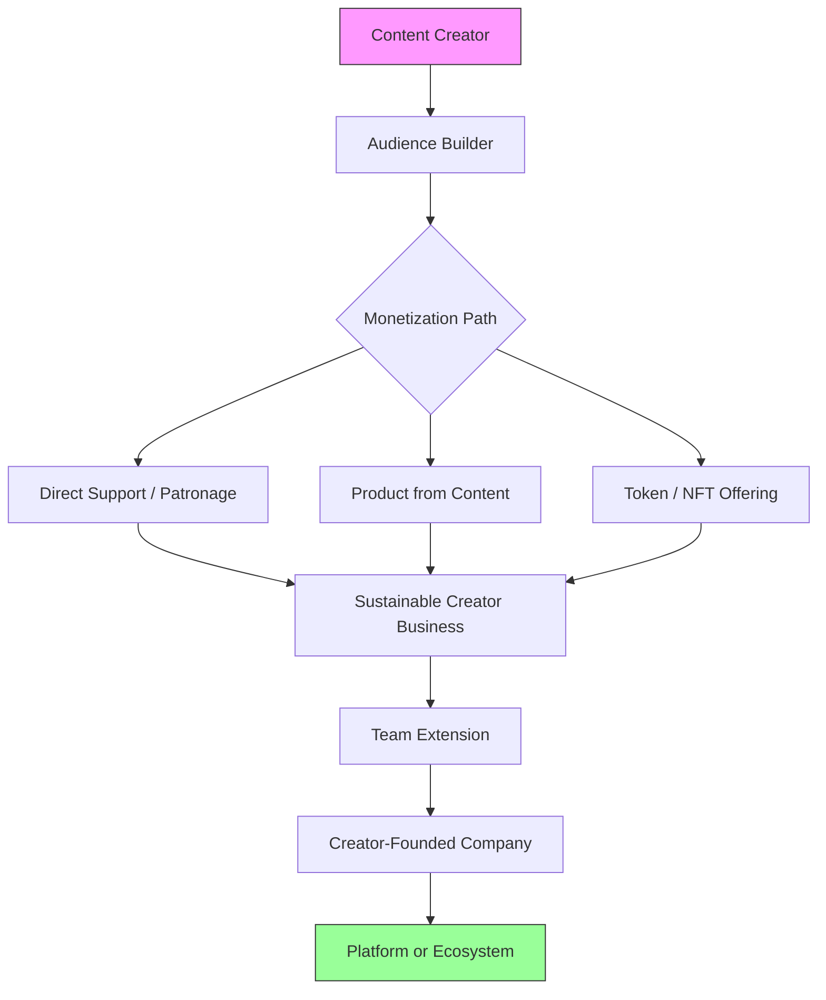

# Chapter 48: The Creator-Founder Crossroad - Convergence Opportunities

> *Last Updated: March 2026*

> **Skim This Chapter**
> - The boundaries between creator and founder have dissolved; the most effective path to building a venture now runs through audience, narrative, and identity rather than product launches alone.
> - Output: A practical playbook for leveraging creative capital as startup infrastructure--from audience development through monetization to scaling beyond the individual.

## In This Chapter, You Will
- Learn why founder storytelling and content strategy are now prerequisites for product distribution
- Identify the creator economy tooling and monetization models best suited to your venture stage
- Apply frameworks for transforming content audiences into product markets and co-creation communities
- Evaluate when and how to scale beyond the individual creator-founder into a team-based operation

## 1. Introduction: Why Creators Are Founders—and Founders Are Creators

The traditional boundaries between content creators and company founders have dissolved. We have entered an era where the most effective distribution doesn't begin with product launches or marketing campaigns but with personal identity, narrative, and direct audience relationships. This transformation represents more than a tactical shift—it reflects a fundamental reimagining of how value is created, shared, and monetized in the digital economy.

Today's most compelling founders often establish themselves first as teachers, storytellers, or public figures—building audiences through valuable content before introducing products. Simultaneously, successful creators increasingly recognize that their influence, expertise, and audience relationships represent foundation for ventures extending beyond content alone into products, platforms, and ecosystems.

This convergence creates the creator-founder: individuals who leverage personal brands, audience relationships, and content expertise as foundation for building companies rather than treating these elements as merely marketing channels for separately conceived ventures. The infrastructure enabling this crossover has matured significantly—with creator economy platforms providing sophisticated monetization tools, Web3 technologies enabling new ownership and participation models, and AI dramatically expanding individual creative capability.

> **The creator-founder advantage:** The most effective distribution channel in 2026 is not a platform algorithm. It is a founder who has earned trust by teaching before they ever had something to sell.

## 2. Founders as Cultural Producers

The most effective founders increasingly recognize that their role extends beyond product development and company operations into cultural production—creating narratives, perspectives, and content that shape perception, establish authority, and build relationship foundation for eventual product adoption.

### Content Strategy for Founders

Deliberate narrative development creates competitive advantage through attention and trust impossible through product features alone, particularly during early stages when tangible offerings remain limited.

**Narrative Arc Development**

Effective founder storytelling follows an evolving progression rather than a static message. It typically begins with origin stories that establish an authentic connection to the problem and the solution—why this founder, why this problem, why now. From there, behind-the-scenes sharing creates transparency and a sense of relationship, letting the audience feel invested in the journey rather than merely observing a polished outcome. As the founder's credibility builds, process documentation demonstrates expertise and thoughtful execution, showing rather than claiming competence. The arc then expands outward: vision-casting broadens the audience's perspective beyond the current implementation toward a larger possibility, while industry analysis positions the founder as an insightful observer and participant whose perspective is worth following independent of any single product.

**Channel and Format Diversification**

Sophisticated strategies leverage multiple content forms:
- Newsletters providing detailed, nuanced perspective and direct relationship
- Podcasts creating intimate, voice-based connection and conversation
- Visual content offering immediate, emotional engagement through images and video
- Written analysis demonstrating depth and thoughtfulness through detailed exploration
- Social commentary showing relevance and contextual understanding through timely response

**Consistency and Cadence Implementation**

Effective storytelling requires reliable presence:
- Regular publishing schedules establishing expectation and habit
- Consistent voice creating recognizable identity across platforms
- Thematic coherence maintaining focus despite format variation
- Progressive depth building relationship through evolving engagement
- Responsive adaptation showing attentiveness to audience interests and feedback

### Thought Leadership Development

Beyond general storytelling, specific expertise demonstration creates authority and influence—establishing founders as trusted guides whose eventually offered solutions gain credibility through previously demonstrated understanding.

**Process and Insight Sharing**
- Decision framework explanation showing analytical approach
- Experiment documentation demonstrating empirical rather than merely theoretical understanding
- Trend analysis revealing pattern recognition capability
- Problem exploration demonstrating deep understanding before solution proposal
- Learning documentation showing growth and adaptability through experience

**Industry Contribution Beyond Self-Promotion**
- Research publication advancing collective understanding
- Standard development supporting ecosystem improvement
- Educational content helping others develop capability
- Mentorship providing individual guidance and support
- Perspective sharing offering insight applicable beyond specific offerings

### Media and Narrative Creation

**Platform-Specific Strategy Development**

Effective media presence recognizes distinct environment characteristics:
- YouTube enabling detailed explanation and demonstration through long-form video
- Twitter/X supporting rapid commentary and conversation through concise messaging
- Farcaster providing crypto-native audience engagement through specialized discussion
- TikTok enabling creative, entertainment-focused connection through short-form video
- Podcasts creating deeper relationship through extended voice-based interaction

**Narrative Positioning Implementation**
- Character development establishing distinct persona and perspective
- Journey documentation creating progression narrative over time
- Conflict presentation showing challenges and their navigation
- Relationship building through interaction and collaboration with others
- Purpose connection demonstrating meaning beyond merely commercial motivation

## 3. Creator Economy Tooling Meets Startup Infrastructure

The technology enabling creator-founder convergence has evolved dramatically—creating unprecedented capability for individual builders to manage audience relationships, monetize value, and scale impact without requiring traditional company infrastructure or substantial initial investment.

### Platform Selection and Integration

**Web2 and Web3 Integration Strategy**

Effective approaches combine established and emerging platforms:
- Substack providing subscription-based newsletter infrastructure with proven monetization
- YouTube offering unmatched video distribution with sophisticated recommendation and audience development
- Mirror enabling crypto-native publishing with integrated tokenization and crowdfunding
- Lens Protocol creating decentralized social graph with creator ownership and portability
- Paragraph supporting token-gated content with ownership integration

**Audience Ownership Prioritization**
- Direct contact information collection enabling platform-independent communication
- First-party data gathering creating proprietary audience understanding
- Portable content strategy allowing platform migration without starting over
- Multi-platform presence preventing single-point dependency
- Self-hosted components maintaining critical infrastructure control

**Technology Stack Integration**
- CRM tools managing individual relationship data and interaction history
- Analytics platforms providing behavioral and preference understanding
- Payment infrastructure enabling diverse monetization approaches
- Community platforms facilitating member interaction and engagement
- Production tools supporting efficient content creation and distribution

### Monetization Strategy

**Diverse Revenue Integration**

Effective approaches implement multiple complementary models:
- Direct support through tips, donations, and patronage expressing appreciation
- Subscription access providing predictable revenue through regular payment
- Token mechanisms enabling community participation and value sharing
- NFT offerings creating unique digital asset ownership and collection
- Product sales extending from content into related tools or resources

**Identity-Integrated Economics**
- Value alignment ensuring revenue generation matches creator positioning
- Authentic offering development extending naturally from established expertise
- Pricing philosophy reflecting core values and audience relationship
- Exclusivity approach balancing access with appropriate scarcity
- Community investment creating participation rather than merely transaction

**Progressive Monetization Implementation**
- Free value establishing expertise and relationship before monetization
- Entry-level offerings creating initial purchase experience
- Premium options providing additional value for committed supporters
- Exclusive experiences offering unique opportunities beyond digital content
- Ownership models enabling community participation in value creation

### Audience as Initial Market

**Waitlist and Early Access Implementation**
- Exclusive preview offering creating special access appreciation
- Feedback opportunity providing valued input on development
- Recognition mechanisms acknowledging early supporter contribution
- Community development facilitating connection among initial users
- Progress sharing maintaining engagement throughout development

**Testing and Validation Through Audience**
- Concept validation testing response to potential development directions
- Prototype assessment gathering direct experience feedback
- Pricing evaluation testing willingness to pay at different levels
- Messaging refinement improving communication clarity and effectiveness
- Feature prioritization identifying most valued capabilities

**Narrative as Minimum Viable Product**
- Problem framing establishing shared understanding before solution
- Approach explanation creating methodology appreciation before implementation
- Result sharing demonstrating potential impact before product availability
- Process documentation showing capability before formal offering
- Vision articulation creating anticipation before launch

## 4. Solo Creators as Microfounders

Beyond merely building audience for eventually launching traditional companies, creators increasingly develop business models extending directly from their content—creating ventures uniquely aligned with their expertise, audience, and creative output.

### Scalable Creator Businesses

**Media Brand Development**

Content evolving into multi-creator platforms:
- Voice and perspective expansion beyond founder alone
- Team building creating production capacity beyond individual limits
- Format diversification reaching different audience segments
- Distribution channel expansion increasing reach and accessibility
- Business model sophistication moving beyond direct support alone

**Agency Model Implementation**

Expertise extension through service offering:
- Consulting providing direct application of demonstrated knowledge
- Implementation delivering outcomes beyond merely advising
- Team assembly extending capability beyond founder alone
- Process systematization creating consistent rather than personalized delivery
- Client portfolio development establishing sustainable business beyond individual relationships

**Tool and Infrastructure Creation**

Many creators identify needs through their own work that become product opportunities:
- Workflow solutions addressing creator-specific challenges
- Template development systematizing repeatable processes
- Resource creation packaging expertise for self-service application
- Platform building enabling other creators' success
- Network development connecting ecosystem participants

### From Content to Product

**Knowledge Packaging Evolution**

Systematic transformation from information to product:
- Content identifying problems and approaches through explanation
- Templates systematizing processes for repeatable application
- Tools automating workflows previously requiring manual execution
- Software productizing solutions for independent usage
- Platforms enabling ecosystem development beyond individual application

**Tutorial-to-Product Transformation**

Educational content naturally reveals product opportunities:
- Teaching highlights friction points in current approaches
- Instruction creates process documentation forming product roadmap
- Feedback identifies specific pain points requiring solution
- Community questions reveal common challenges warranting automation
- Implementation difficulties demonstrate market needs beyond information alone

**Complementary Product Development**

Creating offerings enhancing rather than replacing content value:
- Application tools extending knowledge through practical implementation
- Community platforms facilitating connection among audience members
- Data resources providing valuable information supplementing explanation
- Event experiences creating in-person extension of digital relationship
- Certification programs validating expertise developed through content consumption

### Investment and Growth Models

**Creator Fund Utilization**

Platform-specific financing designed for content-based businesses:
- YouTube offering creator-specific investment and grants
- Substack providing advances against future subscription revenue
- Patreon Capital offering funding based on membership history
- Web3 platforms implementing creator-focused grant programs
- Specialized VC funds focusing specifically on creator ventures

**Revenue Share and Partnership Models**

Alternative financing avoiding traditional equity dilution:
- Platform revenue sharing providing percentage of generated income
- Brand partnership offering guaranteed minimums against collaboration
- Licensing deals monetizing existing IP through third-party application
- Distribution agreements trading exclusivity for financial support
- Co-development arrangements sharing costs and revenue for new products

**Audience-Backed Financing**

Direct community participation in funding:
- Crowdfunding campaigns enabling collective project support
- Membership programs providing recurring revenue for ongoing development
- Pre-sales generating capital before production completion
- Token offerings allowing audience ownership and participation
- Community investment pools enabling formal but distributed investment

## 5. Building for Expression, Not Just Scale

Beyond audience monetization, the creator-founder intersection generates distinctive product approaches emphasizing expression, creativity, and aesthetic value alongside or even above pure utility or efficiency—creating different design priorities than conventional product development typically employs.

### Creative Tools Development

**AI-Powered Creation Enablement**

New generation tools enhancing human creativity:
- RunwayML offering accessible yet powerful video generation and editing
- Midjourney providing text-to-image creation with distinctive aesthetic quality
- Luma Labs enabling 3D model generation through simple interfaces
- Various AI writing tools augmenting human expression through suggestion and enhancement
- Music generation platforms enabling composition without traditional technical requirements

**Democratized Professional Capability**

Making previously exclusive tools accessible without technical expertise:
- Professional-grade functionality without requiring extensive training
- Interface simplification making powerful features approachable
- Workflow streamlining reducing steps between concept and realization
- Accessibility improvements enabling participation regardless of physical limitation
- Cost reduction making previously expensive capabilities widely available

**Expression-First Design Philosophy**

Prioritizing creative possibility alongside or above pure efficiency:
- Exploration encouragement through open-ended rather than prescriptive interfaces
- Serendipity design allowing unexpected discovery and creation
- Constraint flexibility supporting diverse rather than standardized approaches
- Identity expression enabling personal rather than generic output
- Community sharing facilitating inspiration and collaboration

### Inspiration-Based Design

**Emotional Resonance Prioritization**

Design centering feeling alongside function:
- Aesthetic consideration beyond merely functional requirements
- Experience quality emphasizing joy, surprise, or wonder
- Interface delight creating pleasure beyond mere usability
- Brand personality establishing emotional rather than purely rational connection
- Narrative integration making usage feel like story participation

**Muse-Like Inspiration Facilitation**

Products designed to spark creativity beyond merely executing commands:
- Suggestion mechanisms offering unexpected possibilities
- Constraint introduction creating productive creative boundaries
- Reference integration providing inspiration alongside tools
- Playfulness encouragement supporting experimental usage
- Community inspiration showcasing diverse application possibilities

### Community Co-Creation

**Public Creation Loops**

Visible creative process creating collective advancement:
- Output sharing enabling inspiration and learning
- Technique discussion revealing diverse approaches
- Problem-solving collaboration addressing common challenges
- Experiment documentation showing exploration boundaries
- Remix and adaptation demonstrating possibility expansion

**User-Driven Direction Evolution**

Community usage patterns guiding product development:
- Unexpected application discovery revealing new possibilities
- Feature request patterns identifying common needs
- Usage limitation identification through community discussion
- Creative workaround observation suggesting desired capabilities
- Aesthetic trend emergence showing evolving preferences

## 6. Case Studies in Creator-Founder Success

### RunwayML – Creative Empowerment Through AI

RunwayML demonstrates successful creator-founder convergence through democratizing previously specialized video and image capabilities—transforming professional-grade creative tools from exclusive to accessible without sacrificing sophistication or expression potential.

**Community-Centered Development Approach**
- Early creative partnership establishing direct relationship with eventual users
- Feedback integration creating continuous improvement through user experience
- Public showcase highlighting diverse application possibilities
- Educational content helping users maximize capability utilization
- Collaboration facilitation connecting creators for mutual advancement

**Technical Capability Democratization**
- Interface simplification reducing learning curve without compromising power
- Workflow streamlining eliminating unnecessary technical complexity
- Process automation handling technical aspects while preserving creative control
- Knowledge embedding making expertise available through intelligent assistance
- Incremental advancement enabling progressive capability development

**Creative Agency Preservation**
- Direction control maintaining user creative vision
- Style flexibility supporting diverse aesthetic approaches
- Process transparency ensuring understanding of capability function
- Output customization allowing personalization and uniqueness
- Iteration support encouraging refinement and experimentation

### Wryter Inc. – Narrative Design and Screenwriting with AI

While RunwayML focuses on visual creation, Wryter demonstrates successful application of AI to narrative development—creating professional screenwriting tools that augment rather than replace human storytelling capability through appropriate assistance rather than creative direction.

**Format Fidelity Implementation**
- Screenplay format maintenance ensuring professional standards
- Industry compatibility supporting workflow integration
- Technical automation handling formatting details
- Consistent structure implementation across different writing phases
- Export standardization enabling seamless production handoff

**Creative Autonomy Prioritization**
- Suggestion rather than prescription enabling choice
- Voice preservation maintaining writer's distinctive style
- Structure support without rigid formula imposition
- Character consistency assistance maintaining integrity
- Possibility expansion offering options without forcing selection

**Professional Workflow Integration**
- Collaboration support enabling team development
- Revision tracking maintaining version clarity
- Feedback incorporation facilitating improvement
- Production preparation simplifying transition from writing to filming
- Industry standard compatibility ensuring seamless professional usage

### Midjourney – Community-First Visual Creation

Beyond specific capability development, Midjourney demonstrates how community-centered approaches create distinctive advantage—establishing product culture and identity through shared exploration rather than merely technical capability delivery through conventional product development approaches.

**Discord-Centered Product Experience**
- Public creation making process visible rather than isolated
- Immediate sharing enabling collective inspiration
- Direct feedback creating continuous improvement
- Community presence establishing relationship beyond mere tool usage
- Shared discovery facilitating collective learning and advancement

**Aesthetic Boundary Exploration**
- Style discovery through collective exploration
- Technique sharing expanding capability understanding
- Parameter experimentation revealing possibility boundaries
- Prompt engineering advancing through community learning
- Unexpected application revealing diverse usage potential

**Vibe as Distribution Strategy**
- Community feeling attracting through culture rather than merely features
- Shared excitement generating organic rather than paid growth
- Aesthetic distinctiveness creating recognizable output identity
- Experimental spirit encouraging participation and contribution
- Inclusive approach welcoming diverse creator involvement

### Luma Labs – High-Fidelity 3D Tools for Designers

While previous examples focus on established creative domains, Luma demonstrates creator-founder opportunity in emerging fields—creating tools for immersive 3D content that establish new creative possibilities through technical innovation made accessible through thoughtful design rather than remaining confined to specialized technical users.

**Spatial Computing Democratization**
- Complex 3D creation simplified through intuitive interfaces
- Technical barrier reduction enabling broader creator participation
- Quality maintenance despite simplified creation process
- Workflow integration supporting professional application
- Knowledge embedding reducing expertise requirements

**Multi-Industry Application Support**
- Gaming integration enabling interactive experience development
- Film production supporting virtual production workflows
- Augmented reality preparation facilitating spatial content creation
- Architecture visualization enabling immersive space presentation
- Product design supporting three-dimensional prototyping

**Interface as New Industry Foundation**
- Simplified creation lowering participation barriers
- Format standardization enabling ecosystem development
- Workflow integration connecting with existing creative processes
- Education incorporation building necessary capability understanding
- Community development establishing shared practice and knowledge

## 7. The Evolution of Monetization Models

The creator-founder intersection has generated distinctive approaches to value capture—creating business models specifically adapted to creation-centered ventures rather than merely applying conventional software or content monetization approaches regardless of fit.

| Monetization Model | Best For | Revenue Pattern | Audience Relationship | Key Risk |
|---|---|---|---|---|
| Subscription | Ongoing content or tool access | Recurring, predictable | Continuous engagement | Churn if value stalls |
| NFT / Ownership | Collectible or identity-driven assets | Lumpy, event-driven | Collector and investor identity | Market volatility |
| Token-based DAO | Community governance and value sharing | Variable, governance-linked | Co-ownership and participation | Regulatory uncertainty |
| Patronage / Membership | Direct creator support | Recurring, relationship-driven | Personal connection | Dependency on single creator |
| Product Sales | Expertise packaged as tools or courses | Transactional | Expertise-driven trust | Requires ongoing product development |

### Subscription vs. Ownership

**Access Model Optimization**

Subscription appropriateness assessment:
- Ongoing value delivery creating natural recurring relationship
- Regular content or capability updates justifying continued payment
- Service rather than product orientation supporting subscription logic
- Community access providing relationship beyond merely functional value
- Resource intensity requiring predictable recurring revenue

**Ownership Value Implementation**

NFT and purchase model consideration:
- Collector motivation supporting ownership beyond mere utility
- Identity expression enabling value beyond functional application
- Status signaling creating social rather than merely practical value
- Investment potential offering financial upside alongside utility
- Perpetual value delivery justifying one-time payment model

### Token-Based Creator Economies

**Creator DAO Implementation**

Decentralized autonomous organization adapted to creative contexts:
- Community governance enabling collective decision-making
- Treasury management providing sustainable funding mechanisms
- Contribution reward creating aligned incentive systems
- Ownership distribution establishing shared rather than centralized benefit
- Value capture mechanisms ensuring creator compensation

**Fan Ownership Integration**

Community participation beyond mere consumption:
- Governance rights providing influence over direction
- Financial participation enabling value sharing as growth occurs
- Exclusive access creating special relationship for token holders
- Identity demonstration showing support through verifiable ownership
- Status differentiation establishing recognition within community

### Patron and Community Support

**Modern Patronage Systems**

Direct support beyond specific product purchase:
- Recurring contribution enabling consistent creator support
- Membership offering relationship rather than merely transaction
- Public recognition acknowledging supporter contribution
- Special access providing additional value for committed patrons
- Direct relationship establishing connection beyond merely financial exchange

**Crypto-Native Funding Mechanisms**

Blockchain-specific support approaches:
- Gitcoin grants providing community-guided funding allocation
- On-chain tipping enabling frictionless micropayments
- Bounty systems supporting specific task completion funding
- Quadratic funding amplifying small donations through matching
- Token-based patronage creating permanent support through ownership

## 8. Implementation Guide: Building at the Intersection of Creation and Entrepreneurship

Moving from conceptual understanding to practical application requires systematic approach—creating effective development strategy for navigating the creator-founder intersection successfully rather than merely understanding its potential theoretically.

### Audience Development

**Content Focus Selection**

Establishing distinctive positioning through specific approach:
- Teaching providing value through knowledge transfer and capability development
- Meme creation offering entertainment and cultural participation
- Documentation sharing behind-the-scenes process insight
- Philosophy exploring fundamental questions and perspective development
- Case study examining specific examples for practical understanding

**Consistency and Cadence Implementation**

Building relationship through reliable presence:
- Regular publishing schedule establishing expectation and habit
- Consistent voice creating recognizable identity
- Thematic coherence maintaining focus despite topic variation
- Progressive depth building relationship through evolving engagement
- Responsive adaptation showing attentiveness to audience interests

**Vulnerability and Insight Integration**

Creating genuine connection beyond merely informational relationship:
- Personal experience sharing establishing authentic rather than merely professional connection
- Challenge acknowledgment demonstrating honesty and relatability
- Learning documentation showing growth mindset and development
- Perspective offering revealing distinctive viewpoint and values
- Question exploration demonstrating thoughtfulness beyond mere assertion

### Product–Content Integration

**Narrative-Roadmap Alignment**

Creating coherent story connecting content to product:
- Problem exploration establishing shared understanding before solution
- Process documentation showing capability development journey
- Solution evolution revealing thoughtful development rather than sudden appearance
- Future vision articulation creating anticipation and context
- User story integration demonstrating actual rather than theoretical application

**Public Building Documentation**

Sharing development journey alongside eventual product:
- Progress updates creating engagement throughout process
- Challenge sharing demonstrating authentic experience
- Decision explanation revealing thoughtful consideration
- Learning documentation showing growth and adaptation
- Community involvement enabling participation before completion

**Feedback Loop Integration**

Incorporating audience insight throughout development:
- Concept testing gathering response before significant investment
- Prototype sharing enabling early experience feedback
- Preference collection informing priority determination
- Problem validation confirming actual rather than merely assumed needs
- Solution refinement improving through diverse perspective incorporation

### Scaling Beyond the Individual

**Team Extension Strategy**

Building appropriate capability augmentation:
- Ghostwriter and editor engagement expanding content production
- Engineer partnership enabling technical implementation beyond founder capability
- Designer collaboration creating professional visual presentation
- Producer support facilitating consistent content delivery
- Manager addition enabling operational functionality without founder bottleneck

**Founder Superpower Concentration**

Focusing personal effort on highest-value activities:
- Distinctive expertise application where unique capability exists
- Vision direction establishing overall trajectory and priorities
- Key relationship management maintaining critical connections
- Creative direction ensuring concept integrity and coherence
- Culture establishment creating organizational identity and values

**Culture and Process Documentation**

Creating scalable rather than founder-dependent systems:
- Value articulation establishing clear guiding principles
- Quality standard definition ensuring consistent output
- Decision framework development enabling distributed judgment
- Communication protocol establishment facilitating effective interaction
- Knowledge management creating accessible rather than personal information

## Key Takeaways

### Every Founder Is Now a Publisher

The era where product could speak for itself without creator narrative has largely ended—requiring deliberate publishing strategy regardless of whether ventures identify primarily as content-focused or product-centered businesses.

### Build a Vibe Before You Build a Product

Cultural and aesthetic elements previously considered secondary now frequently represent primary competitive advantage—creating distinctive identity through feeling and association potentially more defensible than merely functional differentiation.

### Creative Capital Is the New Seed Round

Audience development frequently provides more sustainable early-stage advantage than traditional fundraising—creating runway, validation, and distribution through direct relationship rather than merely financial resources.

### Community Is Product

The environment surrounding offerings increasingly represents as much value as functional capability itself—creating distinctive experience through relationship rather than merely utility.

### Make Culture, Not Just Software

The most enduring ventures create meaning beyond merely utility—establishing systems encoding values, identity, and purpose alongside solving practical problems.

## Founder's Checklist
- [ ] Have I established a consistent content publishing cadence and channel strategy?
- [ ] Am I building an owned audience (email list, direct contacts) rather than relying solely on platform algorithms?
- [ ] Have I identified how my content expertise naturally extends into product opportunities?
- [ ] Do I have a progressive monetization plan that moves from free value to premium offerings?
- [ ] Have I documented which activities require my unique creative input versus what can be delegated?

## Exercises

1. **Creator-Founder Audit:** Map your current content output across all channels. For each piece of content, identify whether it serves audience building, product validation, thought leadership, or monetization. Identify the gaps and create a 30-day content calendar that addresses all four functions.

2. **Audience-to-Product Pipeline Design:** Starting from your existing audience, design a three-step funnel that moves followers from free content consumers to paying customers. Define the free offering, the entry-level product, and the premium experience. Test messaging for each tier with 20 audience members.

3. **Scaling Assessment:** List every activity you personally perform in your creator-founder role. Categorize each as "only I can do this" or "someone else could do this with guidance." For the delegatable items, draft a brief playbook documenting your process, quality standards, and decision criteria.

---

The creator-founder crossroad represents more than a tactical opportunity—it signals a fundamental shift in how value is created, distributed, and captured in the digital economy. Those who understand and leverage this convergence will build ventures that transcend traditional boundaries, creating lasting impact through the powerful combination of creative expression and entrepreneurial execution.

### Case Study: Sahil Lavingia and Gumroad — The Creator-Founder Identity Crisis

Sahil Lavingia's journey with Gumroad is one of the most candid, publicly documented accounts of the creator-founder crossroad in action. In 2011, Lavingia left his role as the second employee at Pinterest to build Gumroad, a platform enabling creators to sell digital products directly to their audiences. The early trajectory looked like a classic Silicon Valley success story: he raised $8 million in venture funding, hired a team of over twenty people, and pursued aggressive growth targets.

Then reality intervened. When Gumroad failed to hit the metrics needed for a Series B, Lavingia faced the crossroad this chapter describes. He laid off nearly his entire team, watched the company's valuation collapse, and confronted a question every creator-founder eventually encounters: was he building a venture-scale business, or had he created something valuable on different terms?

What makes Lavingia's story instructive is what happened next. Rather than shutting down or pivoting into a conventional SaaS growth playbook, he rebuilt Gumroad as a lean, profitable company with a small remote team and no outside pressure to achieve hypergrowth. He wrote openly about the experience, publishing essays on failure, revenue numbers, and the emotional toll of the transition. That radical transparency itself became a form of creator-founder convergence: his personal narrative about building Gumroad generated more distribution and trust than any marketing campaign could have produced.

Lavingia's path illustrates several themes from this chapter. First, audience-as-distribution: by sharing his story publicly, he attracted exactly the kind of creators who would become Gumroad's ideal customers. Second, building for expression rather than just scale: Gumroad succeeded by serving creators who wanted sustainable businesses, not unicorn outcomes. Third, the monetization evolution: Gumroad moved from a venture-backed growth model to a community-aligned business where the founder's creative output and the company's product reinforced each other.

The Gumroad case demonstrates that the creator-founder crossroad is not a one-time decision but an ongoing negotiation between creative vision and operational demands. Lavingia chose to prioritize alignment between his identity as a creator and his role as a founder, and the result was a company that reached profitability, processed over $500 million in creator sales, and proved that the intersection of personal narrative and product building can create durable value without conforming to conventional scaling expectations.

## Related Case Studies
- [Gumroad — Creator-Founder Identity and Lean Rebuilding](../case-studies/compendium.md#gumroad)
- [RunwayML — Democratizing Creative AI Tools](../case-studies/compendium.md#runwayml)
- [Midjourney — Community-First Visual Creation](../case-studies/compendium.md#midjourney)

## Sources

1. Hagiu, A. & Wright, J. (2015). "Multi-Sided Platforms." *International Journal of Industrial Organization*, 43, 162-174.
2. Caves, R.E. (2000). *Creative Industries: Contracts between Art and Commerce*. Harvard University Press.
3. SignalFire (2020). "Creator Economy Market Map." SignalFire Research Report.
4. Li, J. (2020). "What the Creator Economy Promises—And What It Actually Does." *Harvard Business Review*.
5. Kelly, K. (2008). "1,000 True Fans." *The Technium*.
6. Howkins, J. (2001). *The Creative Economy: How People Make Money from Ideas*. Penguin Books.
7. Davidson, A. (2020). *The Passion Economy: The New Rules for Thriving in the Twenty-First Century*. Knopf.
8. Jarvis, P. (2019). *Company of One: Why Staying Small Is the Next Big Thing for Business*. Houghton Mifflin Harcourt.
9. Kleon, A. (2014). *Show Your Work!: 10 Ways to Share Your Creativity and Get Discovered*. Workman Publishing.
10. Csikszentmihalyi, M. (1996). *Creativity: Flow and the Psychology of Discovery and Invention*. HarperCollins.
11. Pink, D. H. (2001). *Free Agent Nation: The Future of Working for Yourself*. Warner Books.
12. Lavingia, S. (2021). *The Minimalist Entrepreneur: How Great Founders Do More with Less*. Portfolio/Penguin.
13. Amabile, T. M. (1996). *Creativity in Context: Update to the Social Psychology of Creativity*. Westview Press.
14. Shirky, C. (2010). *Cognitive Surplus: Creativity and Generosity in a Connected Age*. Penguin Press.
15. Hsieh, T. (2010). *Delivering Happiness: A Path to Profits, Passion, and Purpose*. Grand Central Publishing.

## Further Reading

- **The Passion Economy** by Adam Davidson — Explores how individuals can build businesses around unique skills and personal brands in the modern economy.
- **Company of One** by Paul Jarvis — A practical guide to building a sustainable business as a solo creator-founder without chasing growth for its own sake.
- **Show Your Work!** by Austin Kleon — A concise framework for how creators can build audiences by sharing their creative process, directly applicable to the creator-founder journey.
- **The Creator Economy: How to Make a Living Doing What You Love** by Hugo Amsellem and Nathan Baschez — Analyzes the infrastructure, economics, and strategies behind the convergence of content creation and company building.
- **1,000 True Fans** by Kevin Kelly — The seminal essay on how creators can build sustainable businesses through direct audience relationships rather than mass-market scale.

---

**Previously:** [Chapter 36: Creating Defensible Advantages](../part-03-one-building-systems/ch36-creating-defensible-advantages.md) — Showed how to build lasting moats through network effects, data advantages, and layered defensibility when features are easily replicated.

**Next:** [Chapter 44: Community Building](ch44-community-building.md) — Covers how to transform word-of-mouth from accident to system, designing contributor pathways that turn users into advocates, maintainers, and co-owners.
