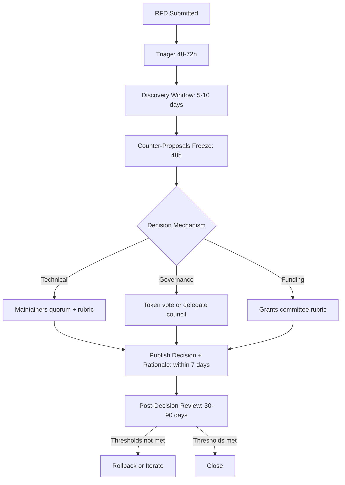

# Chapter 49: System Leadership

> *Last Updated: March 2026*

> **Skim This Chapter**
> - System leadership is the transition from building products to nurturing living ecosystems that self-repair, evolve, and generate value beyond any founder's direct control.
> - Output: Principles for orchestration over control, dispute resolution flows, fork policies, and practical tests to determine whether your venture has truly reached the "Three" stage.

## From Product to Organism: The Evolution to Living Systems

The journey from Zero to One creates something from nothing, while the path from One to Two establishes distribution and community. The evolution to Three represents a fundamentally different transformation—moving beyond creating and scaling products to nurturing living systems that evolve, adapt, and generate value beyond any founder's direct control.

System leaders recognize that the most powerful ventures aren't merely tools or platforms but complex adaptive organisms with their own emergent properties and self-sustaining dynamics. Rather than commanding from the center, these leaders focus on designing environments where others can build, contribute, and self-organize toward shared objectives without requiring constant direction.

This transition from product builder to system architect represents the most profound evolution in the founder's journey. It requires letting go of control while maintaining influence, shifting focus from direct creation to environmental design, and measuring success not by personal impact but by system health and resilience.

> **The system leadership test:** If your venture would collapse without your daily involvement, you have built a product. If it would thrive without you, you have built a system.

The resulting ventures develop characteristics resembling living ecosystems: they self-repair, they distribute intelligence across the network, and they advance through evolution rather than centralized direction. Examples span both Web3 and AI domains---from blockchain protocols enabling interoperability between sovereign chains to semiconductor infrastructures powering global technological advancement. Despite their technical differences, these systems share a defining property: they create value far beyond what their creators originally envisioned.

## In This Chapter, You Will

- Orchestrate standards, incentives, and norms across many actors
- Create forums and processes that convert conflict into progress
- Fund and govern public goods without capture
- Measure ecosystem health, not just product metrics

## Founder’s Checklist

- What must be neutral, and where can we take a strong stance?
- Do we have a credible path to reduce our central role?
- How do we handle forks, disputes, and incompatible visions?
- Which shared metrics indicate ecosystem flourishing?

## Exercises

- Draft a minimal “ecosystem constitution” with scope and values
- Launch a quarterly ecosystem review with public notes and actions
- Design a grants rubric that rewards leverage and openness

## Case Studies

### Cosmos
*Ecosystem Leadership*

Cosmos demonstrates system leadership through:

- **Protocol Governance**: Coordinating multiple independent chains
- **Standards Development**: IBC as interoperability standard
- **Ecosystem Funding**: Grants and accelerator programs
- **Technical Leadership**: Research and development coordination
- **Community Alignment**: Shared vision across sovereign chains

Their approach shows how to lead without direct control, creating frameworks that enable others to build.

### Bitmask
*Infrastructure for Decentralized Coordination*

Bitmask enables system leadership by:

- **Identity Infrastructure**: Foundation for decentralized systems
- **Social Protocols**: Nostr integration for coordination
- **Privacy Primitives**: Enabling secure communication
- **Interoperability**: Connecting disparate systems
- **Bottom-Up Organization**: Tools for grassroots leadership

They demonstrate how foundational infrastructure enables new forms of organizational leadership.

## What Makes Three Different from Scaling

Many founders confuse Three with "very successful Two." The distinction is qualitative, not quantitative. Scaling means doing more of what works. Three means becoming something fundamentally different—infrastructure that others build on.

**The Test for Three:**
Ask yourself these questions. If you answer "no" to most of them, you're still at Two:

- Could a competitor build a successful business on top of your platform without your approval?
- If your entire founding team disappeared tomorrow, would the system continue functioning and evolving?
- Are independent developers extending your system in ways you never anticipated?
- Do industry participants treat your standards or protocols as defaults?
- Does the ecosystem generate more total value than your organization captures?

**The Transition Trap:**
The hardest part of reaching Three isn't building—it's letting go. Founders who excel at One and Two often sabotage Three by maintaining too much control. Every governance decision you centralize, every API you make proprietary, every partner you require approval from is a step back toward Two. System leadership requires the discipline to design constraints and then trust others to operate within them.

**What Three Costs:**
Reaching Three demands real sacrifices that most business books won't acknowledge:

- **Revenue capture decreases.** You'll capture a smaller percentage of total ecosystem value. Ethereum's foundation captures a tiny fraction of DeFi's total value. This is a feature, not a bug—it's what makes the ecosystem credible.
- **Control becomes influence.** You can suggest, incentivize, and model behavior, but you can no longer dictate. Protocol changes require community consensus, not executive decisions.
- **Speed decreases.** Coordinating an ecosystem is slower than commanding a team. Governance processes, standards bodies, and community deliberation take time.
- **Credit disperses.** The best systems make their founders invisible. If the ecosystem is working, most participants won't know or care who built the foundation.

The founders who reach Three accept these costs because they understand the trade: what you lose in control, you gain in durability and impact that outlasts your direct involvement.

## System Leadership Principles

1. **Orchestration Over Control**
   - Setting parameters, not giving orders
   - Creating incentive structures
   - Enabling autonomous action
   - Designing environments where good outcomes emerge from self-interested behavior

2. **Protocol Design**
   - Rules that scale without intervention
   - Self-enforcing mechanisms
   - Evolutionary frameworks
   - Backward-compatible upgrades that don't fracture the ecosystem

3. **Ecosystem Cultivation**
   - Nurturing developer communities
   - Funding public goods
   - Creating shared resources
   - Making it easier to build *on* your system than to build *around* it

4. **Decentralized Governance**
   - Token-based voting
   - Quadratic funding
   - Futarchy and prediction markets
   - Liquid democracy
   - Credible neutrality—the system must be seen as fair by all participants, not just its creators

5. **Network Effects Management**
   - Understanding feedback loops
   - Managing growth dynamics
   - Preventing centralization
   - Monitoring for winner-take-all dynamics that could undermine ecosystem health

| Stage | Two (Scaling) | Three (System Leadership) |
|---|---|---|
| Decision Authority | Executive team decides | Community governance decides |
| Revenue Model | Capture majority of value | Capture small fraction; ecosystem captures most |
| Speed | Fast; team executes directly | Slower; governance and consensus required |
| Success Metric | Product metrics (DAU, revenue) | Ecosystem health (third-party value, contributor diversity) |
| Founder Role | Operational leader | Protocol designer and steward |
| Failure Mode | Product stalls | Ecosystem capture or governance deadlock |

## Dispute Resolution Flow

Clear, predictable dispute handling converts conflict into progress and reduces the incentive to fork prematurely. Use a lightweight, time‑boxed flow that separates discovery, proposal, and decision:

1. Intake and Triage (48–72h)
   - Any contributor submits a Request for Decision (RFD) with: context, options, risks, and a recommended path.
   - Triage stewards tag: scope (technical, governance, resourcing), impact level (low/med/high), and required reviewers.

2. Discovery Window (5–10 days)
   - Dedicated discussion thread + synchronous forum if needed; capture all data in a public doc.
   - Identify non‑negotiables (security, credible neutrality, legal) and trade space where compromise is allowed.

3. Counter‑Proposals Freeze (48h)
   - Final set of proposals is frozen. Each proposal must include: acceptance criteria, rollback plan, and measurable success thresholds.

4. Decision Mechanism (per scope)
   - Technical: Maintainers quorum with published rubric (e.g., safety, performance, compatibility).
   - Governance: Token vote, delegate council, or bicameral check depending on constitution.
   - Funding: Grants committee rubric; conflicts disclosed; recusal recorded.

5. Publication and Implementation (within 7 days)
   - Publish decision, rationale, dissent summaries, and review date.
   - Assign owners, milestones, and monitoring metrics.

6. Post‑Decision Review (30–90 days)
   - Compare outcomes to acceptance criteria; execute rollback or iterate if thresholds not met.

Artifacts to maintain:
- RFD template, decision log, reviewer registry, rubrics, appeals policy.

## Fork Policy

Forks should be a last resort, not a first move. Establish norms that reduce destructive splits while preserving exit rights:

- Philosophy: “Exit is a governance primitive.” Maintain dignity and clarity for both paths.
- Preconditions for Legitimate Fork
  - Substantive values or security conflict documented in RFD log.
  - Good‑faith dispute process completed (discovery + decision cycle) with rationale published.
  - Viable maintainer set and sustainability plan for the fork.
- Neutral Infrastructure
  - Namespace and versioning to avoid user confusion (e.g., `org/project` vs `org‑alt/project`).
  - Shared data export and migration tooling; no lock‑in.
  - Neutral registries list both mainline and fork with objective metadata.
- User Protection
  - Clear compatibility statement, divergence timeline, and deprecation notices.
  - Security backports policy during transition window.
- Reconciliation Path
  - Periodic “merge summit” to evaluate re‑convergence on common standards.
  - Minimal interop layer (adapters, bridges) encouraged and funded as public good.

Recommended templates to add to your repo/docs:
- RFD.md (decision request)
- DECISIONS.md (decision log)
- GOVERNANCE.md (decision mechanisms and quorum)
- FORK_POLICY.md (preconditions, process, and comms checklist)

## Leading Without Authority

- **Influence Through Code**: Protocol changes as leadership
- **Economic Alignment**: Token incentives guide behavior
- **Cultural Leadership**: Memes and narratives
- **Technical Excellence**: Leading by example
- **Community Empowerment**: Distributing decision-making

## Key Takeaways

### Three Is Qualitatively Different from Two

Scaling means doing more of what works. Reaching Three means becoming infrastructure that others build upon--a shift that demands relinquishing control while maintaining influence through protocol design and incentive architecture.

### Orchestration Replaces Command

System leaders set parameters, create incentive structures, and design environments where good outcomes emerge from self-interested behavior--they do not give orders or micromanage outcomes.

### Dispute Resolution Is a Design Problem

Clear, time-boxed dispute flows--from intake through counter-proposals to published decisions--convert conflict into progress and reduce the incentive to fork prematurely.

### What You Lose in Control, You Gain in Durability

Revenue capture decreases, speed decreases, and credit disperses at stage Three, but what emerges is impact that outlasts any founder's direct involvement.

## Further Reading

- **Thinking in Systems: A Primer** by Donella H. Meadows — The essential introduction to systems thinking, explaining feedback loops, leverage points, and system behavior patterns critical for anyone leading complex adaptive systems.
- **Leadership and the New Science** by Margaret J. Wheatley — Reimagines leadership through the lens of quantum physics, biology, and chaos theory, showing how living systems principles apply to organizational design.
- **The Fifth Discipline** by Peter M. Senge — The foundational work on learning organizations, introducing systems thinking as a leadership discipline for building organizations that continuously adapt.
- **Reinventing Organizations** by Frederic Laloux — Maps the evolution of organizational models and presents frameworks for self-managing, purpose-driven organizations that operate as living systems.
- **Antifragile** by Nassim Nicholas Taleb — Explores how certain systems gain from disorder, providing a conceptual framework for designing organizations and protocols that strengthen under stress.

## Sources

### Books
- Sinek, Simon. *Leaders Eat Last: Why Some Teams Pull Together and Others Don't*. Portfolio, 2014.
- Heifetz, Ronald A. *Leadership Without Easy Answers*. Harvard University Press, 1994.
- Wheatley, Margaret J. *Leadership and the New Science: Discovering Order in a Chaotic World*. Berrett-Koehler, 2006.
- Brown, Tim. *Change by Design: How Design Thinking Transforms Organizations*. HarperBusiness, 2009.
- Laloux, Frederic. *Reinventing Organizations: A Guide to Creating Organizations Inspired by the Next Stage of Human Consciousness*. Nelson Parker, 2014.

### Blockchain Governance Research
- Buterin, Vitalik. "Notes on Blockchain Governance." Vitalik.ca, 2017.
- De Filippi, Primavera, and Aaron Wright. *Blockchain and the Law: The Rule of Code*. Harvard University Press, 2018.
- Zhang, Zixuan, and Michael Reiter. "Blockchain Governance: A Survey." ACM Computing Surveys, 2021.
- Brennan, Conor, and William Lunn. "Blockchain Governance and the Role of Trust Service Providers." Computer Law & Security Review, 2016.

### Decentralized Autonomous Organizations (DAOs)
- Hassan, Samer, and Primavera De Filippi. "Decentralized Autonomous Organization." Internet Policy Review, 2021.
- Wright, Aaron, and Primavera De Filippi. "Decentralized Blockchain Technology and the Rise of Lex Cryptographia." SSRN, 2015.
- Wang, Shuai, et al. "An Overview of Smart Contract: Architecture, Applications, and Future Trends." IEEE Intelligent Systems, 2019.

### Systems Thinking and Complexity
- Meadows, Donella H. *Thinking in Systems: A Primer*. Chelsea Green Publishing, 2008.
- Senge, Peter M. *The Fifth Discipline: The Art & Practice of The Learning Organization*. Doubleday, 2006.
- Mitchell, Melanie. *Complexity: A Guided Tour*. Oxford University Press, 2009.
- Bar-Yam, Yaneer. *Making Things Work: Solving Complex Problems in a Complex World*. NECSI Knowledge Press, 2004.

### Governance and Institutional Design
- Ostrom, Elinor. *Governing the Commons: The Evolution of Institutions for Collective Action*. Cambridge University Press, 1990.
- North, Douglass C. *Institutions, Institutional Change and Economic Performance*. Cambridge University Press, 1990.
- Acemoglu, Daron, and James A. Robinson. *Why Nations Fail: The Origins of Power, Prosperity, and Poverty*. Crown Business, 2012.

### Network Effects and Platform Economics
- Parker, Geoffrey G., et al. *Platform Revolution: How Networked Markets Are Transforming the Economy*. W. W. Norton, 2016.
- Eisenmann, Thomas, et al. "Platform Envelopment." Strategic Management Journal, 2011.
- Rochet, Jean-Charles, and Jean Tirole. "Platform Competition in Two-Sided Markets." Journal of the European Economic Association, 2003.

### Case Study Sources
- Cosmos Network Documentation. "Cosmos Hub Governance." cosmos.network/governance
- Interchain Foundation. "Cosmos Network Whitepaper." cosmos.network/resources/whitepaper
- Bitmask Technologies. "Nostr Protocol Integration." bitmask.app/documentation
- Web3 Foundation. "Polkadot Governance." polkadot.network/governance

### Technical Standards and Protocols
- Zamfir, Vlad. "Introducing Casper." Ethereum Blog, 2015.
- Wood, Gavin. "Polkadot: Vision for a Heterogeneous Multi-Chain Framework." polkadot.network/whitepaper
- Internet Engineering Task Force (IETF). "Request for Comments (RFC) Process."
- World Wide Web Consortium (W3C). "Web Standards and Governance."

## Related Case Studies
- See the Case Studies Compendium for curated examples relevant to this chapter: ../case-studies/compendium.md

---

**Previously:** [Chapter 46: Operational Excellence](../part-04-two-scaling-systems/ch46-operational-excellence.md) — Covered how to design operations for ten-times growth through process redesign, measurement, and self-correcting systems rather than heroic management.

**Next:** [Chapter 50: Future Paradigms](ch50-future-paradigms.md) — Looks ahead to emerging paradigm shifts including the autonomous economy, cognitive infrastructure, and how system leaders can recognize and shape these transformations.
