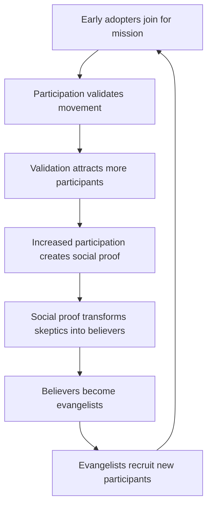

# Chapter 51: Building Movements

> *Last Updated: March 2026*

> **Skim This Chapter**
> - The most valuable companies transcend product-market fit to achieve movement-market fit--solving for identity and belonging, not just utility.
> - Output: Design frameworks for participation pyramids, co-creation models, ritual and culture systems, and phased implementation from founding community through institutional governance.

## In This Chapter, You Will
- Learn how movements create gravitational pull that attracts talent, capital, and attention through mission alignment rather than marketing spend
- Identify the five levels of the participation pyramid and design contribution pathways that accommodate diverse skills and commitment levels
- Apply co-creation frameworks that transform passive customers into active builders who accelerate product innovation beyond what any centralized team could achieve
- Evaluate your movement's health using community engagement metrics, cultural cohesion indicators, and resilience factors while avoiding common pitfalls like authenticity traps and purity spirals

## Why Startups Become Movements

The most valuable companies don't just solve problems—they solve for identity. When Tesla owners became evangelists, when Notion users became productivity philosophers, when Ethereum developers became decentralization activists, these companies transcended product-market fit to achieve something more powerful: movement-market fit.

In the convergence of Web3 and AI, this pattern becomes even more critical. These technologies aren't just tools—they're worldviews. They represent fundamentally different assumptions about how society should organize, how value should flow, and how humans and machines should interact. Companies that recognize this don't just build products; they build movements that reshape entire industries.

> **Movement-market fit:** When your users do not just adopt your product but adopt your worldview, you have unlocked the most powerful growth engine in technology.

### The Identity Transformation

| Dimension | Product Thinking | Movement Thinking |
|---|---|---|
| User Need | Users have problems | Users seek identity and belonging |
| Product Role | Products solve problems | Products enable identity expression |
| Success Metric | Satisfied customers | Transformed participants |
| Growth Driver | Features and marketing | Mission and meaning |
| Competitive Moat | Feature differentiation | Cultural identity and community |
| Churn Defense | Switching costs | Social identity fusion |

Traditional product thinking starts with users who have problems and builds products that solve them, measuring success by customer satisfaction and driving growth through features and marketing. Movement thinking inverts every one of those assumptions. It starts with users who seek identity and belonging, builds products that enable identity expression, measures success by the depth of participant transformation, and drives growth through mission and meaning rather than feature announcements.

When someone joins a movement, they're not just adopting a tool—they're adopting a worldview. They're saying something about who they are, what they believe, and what future they want to build.

## Creating Gravitational Pull

Movements create their own gravity, attracting talent, capital, and attention in ways that traditional companies cannot. This gravitational pull becomes a compounding advantage that accelerates everything the organization does.

### The Attraction Framework

**Talent Magnetism:**
The best people don't just want jobs—they want missions. Movements offer purpose beyond profit, community beyond colleagues, impact beyond individual contribution, and learning beyond skill development.

Example: Anthropic doesn't just hire ML engineers; it attracts researchers who believe in AI safety. This self-selection creates teams unified not just by skills but by values, dramatically reducing coordination costs and increasing innovation velocity.

**Capital Attraction:**
Movements attract a different kind of capital:
- Mission-aligned investors who provide more than money
- Community funding that comes with built-in distribution
- Token economies that align incentives across stakeholders
- Grant funding from organizations supporting the mission

**Attention Economics:**
Movements generate organic attention through:
- Community-created content that scales without cost
- Controversy and debate that drives engagement
- Success stories that become recruiting tools
- Cultural moments that transcend product launches

### Network Effects of Belief

Traditional network effects are about utility—each new user makes the product more valuable. Movement network effects are about identity—each new participant strengthens the shared belief system.

**Belief Reinforcement Cycle:**

This cycle creates exponential growth that's nearly impossible for competitors to replicate because they'd need to copy not just features but culture, values, and community.

## Designing Participation

Movements succeed when they transform passive users into active participants. This requires intentional design of contribution pathways that accommodate different skills, commitment levels, and motivations.

### The Participation Pyramid

**Level 1: Curious Observers**
- Low commitment: Following social media, reading content
- Gateway activities: Joining Discord, attending virtual events
- Recognition: Welcome messages, newbie badges
- Next step: First contribution or purchase

**Level 2: Active Users**
- Regular engagement: Using products, participating in discussions
- Contribution: Bug reports, feature requests, content sharing
- Recognition: User spotlights, feedback implementation
- Next step: Community involvement

**Level 3: Community Contributors**
- Consistent participation: Answering questions, creating content
- Contribution: Tutorials, translations, community moderation
- Recognition: Contributor status, special access, tokens/rewards
- Next step: Core development

**Level 4: Core Builders**
- Deep involvement: Code contributions, protocol development
- Contribution: Feature development, governance participation
- Recognition: Core team status, significant token allocation
- Next step: Leadership roles

**Level 5: Movement Leaders**
- Strategic direction: Vision setting, resource allocation
- Contribution: Ecosystem development, partnership building
- Recognition: Public platform, decision-making authority
- Evolution: Spawning related movements

### Contribution Design Principles

**Multiple Pathways:**
Not everyone codes. Successful movements create diverse contribution opportunities:
- Technical: Development, testing, documentation
- Creative: Design, content, storytelling
- Social: Community management, education, support
- Strategic: Business development, partnerships, governance

**Progressive Complexity:**
Start with simple wins:
- One-click actions (sharing, voting, reacting)
- Template-based contributions (bug reports, testimonials)
- Guided creation (tutorials with frameworks)
- Open innovation (proposing new directions)

**Visible Impact:**
Contributors need to see their impact:
- Public attribution for contributions
- Metrics showing reach and influence
- Direct feedback from beneficiaries
- Integration into official products/documentation

## The Psychology of Belonging

Movements tap into fundamental human needs for belonging, status, and meaning. Understanding this psychology enables deliberate community design that strengthens over time rather than diluting with scale.

### Identity and Status Systems

**Identity Markers:**
- Visual badges and credentials
- Exclusive access and privileges
- Public recognition and attribution
- Participation in origin stories

**Status Hierarchies:**
Healthy movements create multiple status games:
- Technical mastery for developers
- Content quality for creators
- Community building for organizers
- Economic success for entrepreneurs

This multiplicity prevents single-dimension competition and enables diverse participants to find their niche.

### Ritual and Culture

**Shared Rituals:**
- Weekly community calls
- Seasonal hackathons
- Annual conferences
- Milestone celebrations

**Cultural Artifacts:**
- Memes and inside jokes
- Origin stories and legends
- Shared vocabulary and concepts
- Visual style and aesthetics

**Values Reinforcement:**
- Community guidelines that reflect values
- Recognition systems that reward aligned behavior
- Consequences for values violations
- Stories that illustrate principles

### The Belonging Gradient

People need different levels of belonging at different times:

**Lightweight Belonging:**
- Social media following
- Newsletter subscriptions
- Occasional event attendance
- Casual product usage

**Medium Belonging:**
- Regular community participation
- Content creation and sharing
- Peer relationships
- Identity signaling

**Deep Belonging:**
- Core team involvement
- Significant time investment
- Economic dependence
- Social identity fusion

Successful movements accommodate all levels while creating pathways for deepening involvement.

## Transforming Customers into Co-Creators

The ultimate expression of movement building is when customers become co-creators, actively shaping the products and services they use. This transformation requires both mindset shifts and structural changes.

### The Co-Creation Spectrum

**Feedback → Feature Requests → Prototypes → Products**

Each stage requires different infrastructure:

**Feedback Systems:**
- Public roadmaps with voting
- Community forums with official responses
- Regular user research and interviews
- Transparent decision documentation

**Feature Development:**
- Bounty programs for specific features
- Hackathons with implementation paths
- Open source contributions with clear guidelines
- Community funding for priority features

**Product Innovation:**
- Plugin/extension ecosystems
- API access for third-party development
- Composable architectures
- Governance tokens for direction setting

### Economic Alignment

Co-creation requires economic alignment between the platform and participants:

**Value Sharing Models:**
- Revenue sharing for contributed features
- Token rewards for participation
- Equity or equity-like instruments
- Retroactive public goods funding

**Intellectual Property Approaches:**
- Open source with attribution
- Contributor license agreements
- Patent pools and defensive publications
- Creative Commons frameworks

### Case Study: Midjourney's Co-Creation Model

Midjourney transformed users into co-creators through:

**Public Development:**
- All development happens in public Discord channels
- Users see features being built in real-time
- Direct interaction between developers and users
- Community votes on prioritization

**Collaborative Exploration:**
- Public galleries showcase all creations
- Remix culture encourages building on others' work
- Style sharing creates collective knowledge
- Community-discovered techniques become features

**Economic Participation:**
- Power users become community moderators
- Top creators gain platform visibility
- Community-driven education creates consulting opportunities
- Collective intelligence improves the product for everyone

Result: A product that evolves faster than any traditional company could achieve, with a community that feels deep ownership over its success.

## Implementation Guide

### Phase 1: Foundation (Months 0-6)

**Define the Mission:**
- What broken system are you fixing?
- What future are you building toward?
- What values guide your decisions?
- Who benefits from success?

**Build Core Community:**
- Recruit 50-100 true believers
- Create initial gathering spaces (Discord/Telegram)
- Establish communication rhythms
- Document early history and decisions

**Create Initial Value:**
- Launch MVP that demonstrates the mission
- Generate early wins for participants
- Establish feedback loops
- Begin recognition systems

### Phase 2: Expansion (Months 6-18)

**Scale Participation:**
- Design contribution pathways
- Launch education programs
- Create economic incentives
- Build collaboration tools

**Develop Culture:**
- Codify values and principles
- Create rituals and traditions
- Develop visual identity
- Strengthen status systems

**Generate Momentum:**
- Public storytelling and content
- Strategic controversy and debate
- Partnership announcements
- Metrics demonstrating growth

### Phase 3: Institution (Months 18+)

**Governance Evolution:**
- Formal decision-making processes
- Community representation
- Conflict resolution mechanisms
- Leadership development

**Economic Sustainability:**
- Diversified revenue streams
- Community treasury management
- Long-term incentive alignment
- Value capture mechanisms

**Ecosystem Development:**
- Spin-off projects and initiatives
- Integration with adjacent movements
- Standard setting and adoption
- Knowledge preservation

## Metrics and Measurement

### Community Health Metrics

**Engagement Depth:**
- Active participants (daily/weekly/monthly)
- Contribution frequency and quality
- Retention rates by cohort
- Time to first contribution

**Growth Indicators:**
- New participant acquisition
- Referral rates and sources
- Geographic and demographic diversity
- Cross-platform presence

**Value Creation:**
- Community-generated content volume
- Third-party integrations and tools
- Economic activity within ecosystem
- External recognition and awards

### Movement Strength Indicators

**Cultural Cohesion:**
- Values alignment in decisions
- Consistent messaging across participants
- Resistance to co-optation attempts
- Narrative coherence over time

**Innovation Velocity:**
- Feature development speed
- Community-driven improvements
- Experimental project launches
- Knowledge sharing effectiveness

**Resilience Factors:**
- Leadership distribution
- Funding diversity
- Platform independence
- Community conflict resolution

## Common Pitfalls and Solutions

### The Authenticity Trap

**Problem:** Movements that feel manufactured or inauthentic fail to generate genuine participation.

**Solution:** 
- Start with genuine belief, not market opportunity
- Embrace transparency about challenges and failures
- Let community shape direction, not just execute
- Acknowledge trade-offs and difficult decisions

### The Purity Spiral

**Problem:** Movements can become increasingly exclusive as they define themselves by who they exclude rather than include.

**Solution:**
- Design for "progressive decentralization"—start focused, expand gradually
- Create multiple ways to belong
- Celebrate diverse contributions
- Focus on positive vision, not just opposition

### The Governance Crisis

**Problem:** Movements often face governance crises as they scale, with original leaders struggling to maintain control while enabling participation.

**Solution:**
- Plan governance evolution from the start
- Create clear phases with different structures
- Document decision-making processes early
- Build leadership pipeline intentionally

### The Economic Extraction

**Problem:** Success attracts those who want to extract value rather than create it.

**Solution:**
- Design economic systems that reward long-term participation
- Create vesting schedules and time locks
- Implement reputation systems that can't be bought
- Maintain mission alignment in partnership decisions

## Case Study Synthesis

### Web3 Movement Builders

**Ethereum:** Built a movement around programmable money and decentralized computation, attracting developers who wanted to build the future of finance and coordination.

**Gitcoin:** Transformed public goods funding into a movement, creating new mechanisms for community-driven capital allocation.

**BanklessDAO:** Evolved from a media property into a movement for financial sovereignty, spawning multiple sub-projects and initiatives.

### AI Movement Catalysts

**Hugging Face:** Democratized AI by building a movement around open model sharing, creating the GitHub of machine learning.

**EleutherAI:** Volunteer researchers creating open alternatives to closed AI systems, proving distributed development could compete with corporate labs.

**Stability AI:** Made generative AI accessible to creators, spawning an ecosystem of tools and applications.

### Cross-Domain Innovators

**Replit:** Transformed coding education into a movement of builders, where learning and creating blur together.

**Mirror:** Reimagined publishing as collective creation, where writers become stakeholders in each other's success.

**Sound.xyz:** Turned music into a participatory experience where fans become patrons and co-owners.

## Key Takeaways

### Movements Solve for Identity, Not Just Utility

The most powerful companies transcend product-market fit by enabling users to express who they are and what future they want to build--creating deeper engagement than any feature set alone.

### Gravitational Pull Compounds Over Time

Movements attract talent, capital, and attention through mission alignment rather than marketing spend, creating a self-reinforcing cycle that competitors cannot replicate by copying features.

### Participation Design Determines Movement Health

Multiple contribution pathways with progressive complexity ensure that people with different skills and commitment levels can find their place--from casual observers to core builders.

### Co-Creation Is the Ultimate Expression of Movement Building

When customers become co-creators who actively shape the product and direction, innovation accelerates beyond what any centralized team could achieve.

## Founder's Checklist

- [ ] Define clear mission that addresses identity and belonging, not just functional needs
- [ ] Design participation pyramid with pathways for different skills and commitment levels
- [ ] Create economic alignment between platform success and participant value
- [ ] Build cultural artifacts including rituals, vocabulary, and visual identity
- [ ] Establish governance structures that can evolve with growth
- [ ] Implement measurement systems for community health and movement strength
- [ ] Document origin stories and early decisions for future participants
- [ ] Develop multiple status games to accommodate diverse contributors
- [ ] Create transparent communication channels between leadership and community
- [ ] Plan for sustainability with diversified funding and value capture

## Exercises

1. **Movement Thesis:** Write a one-page manifesto for your movement. What's broken in the world? What future are you building? Why should people care? Test this with 10 potential participants and iterate based on what resonates.

2. **Participation Mapping:** Design your participation pyramid. For each level, specify: What can people do? How are they recognized? What tools do they need? What's the next step? Create at least 5 different contribution pathways.

3. **Cultural Design:** Define 3 rituals, 3 values, and 3 status markers for your movement. How will you reinforce these? What stories will you tell? How will you recognize aligned behavior?

4. **Co-Creation Experiment:** Identify one feature or decision you can open to community input. Run a 2-week experiment where participants help shape the outcome. Document what worked, what didn't, and what you learned.

5. **Movement Metrics:** Define 10 metrics that would indicate your movement is healthy and growing. Set up systems to track at least 3 of these. Review weekly and adjust your activities based on what you learn.

## Related Case Studies

For practical examples of the concepts in this chapter, see the [Case Studies Compendium](../case-studies/compendium.md):

- **Ethereum Cross-Stage Journey** — The most complete example of a technology project becoming a global movement, where developers became decentralization activists and the community created gravitational pull that reshaped an entire industry
- **Midjourney** — Community-first product where aesthetic identity and shared creative values built a movement around AI art generation, transcending product-market fit to achieve movement-market fit
- **Gitcoin (Positive DAO Example)** — Public goods funding movement that aligned individual economic incentives with collective benefit, demonstrating how mission-driven communities sustain engagement across market cycles
- **Nigeria's Crypto Movement** — Grassroots adoption under financial constraints showing how movements emerge when technology becomes a vehicle for economic freedom and identity expression
- **ClimateBase** — Mission-led community demonstrating how rituals, shared purpose, and impact measurement transform a talent network into a movement for climate action
- **Nouns DAO (Positive DAO Example)** — Cultural identity (the Nouns glasses meme) creating coordination without hierarchy, showing how visual identity and shared artifacts fuel movement building

## Sources

1. Sinek, S. (2009). *Start with Why: How Great Leaders Inspire Everyone to Take Action*. Portfolio.
2. Alinsky, S.D. (1971). *Rules for Radicals: A Practical Primer for Realistic Radicals*. Random House.
3. Tufekci, Z. (2017). *Twitter and Tear Gas: The Power and Fragility of Networked Protest*. Yale University Press.
4. Gladwell, M. (2000). *The Tipping Point: How Little Things Can Make a Big Difference*. Little, Brown and Company.
5. Tajfel, H. & Turner, J.C. (1979). "An Integrative Theory of Intergroup Conflict." *The Social Psychology of Intergroup Relations*, 33-47.
6. Anderson, B. (1983). *Imagined Communities: Reflections on the Origin and Spread of Nationalism*. Verso Books.
7. Engler, M. & Engler, P. (2016). *This Is an Uprising: How Nonviolent Revolt Is Shaping the Twenty-First Century*. Nation Books.
8. Hanlon, P. (2006). *Primal Branding: Create Zealots for Your Brand, Your Company, and Your Future*. Free Press.

## Further Reading

- **Rules for Radicals** by Saul D. Alinsky — The classic playbook for building grassroots movements, with timeless strategies for organizing people around shared purpose and identity.
- **The Tipping Point** by Malcolm Gladwell — Analyzes how small actions at the right time can trigger large-scale social change, directly applicable to understanding when movements reach critical mass.
- **Start with Why** by Simon Sinek — Explains how leaders who articulate purpose before product inspire loyalty and movement-like followings, with frameworks for defining mission-driven narratives.
- **This Is an Uprising** by Mark Engler and Paul Engler — Examines the strategic logic behind successful social movements, offering a practical framework for how decentralized movements achieve outsized impact.
- **Primal Branding** by Patrick Hanlon — Deconstructs the seven elements that transform brands into belief systems, showing how companies create the kind of tribal loyalty that fuels movements.

---

**Previously:** [Chapter 50: Future Paradigms](ch50-future-paradigms.md) — Mapped emerging paradigm shifts from the autonomous economy to cognitive infrastructure, showing how system leaders can shape transformations before they crystallize.

**Next:** [Chapter 52: Legacy Systems](ch52-legacy-systems.md) — Confronts the innovation paradox where yesterday's breakthroughs become tomorrow's constraints, and shows how to design systems that evolve gracefully over time.
