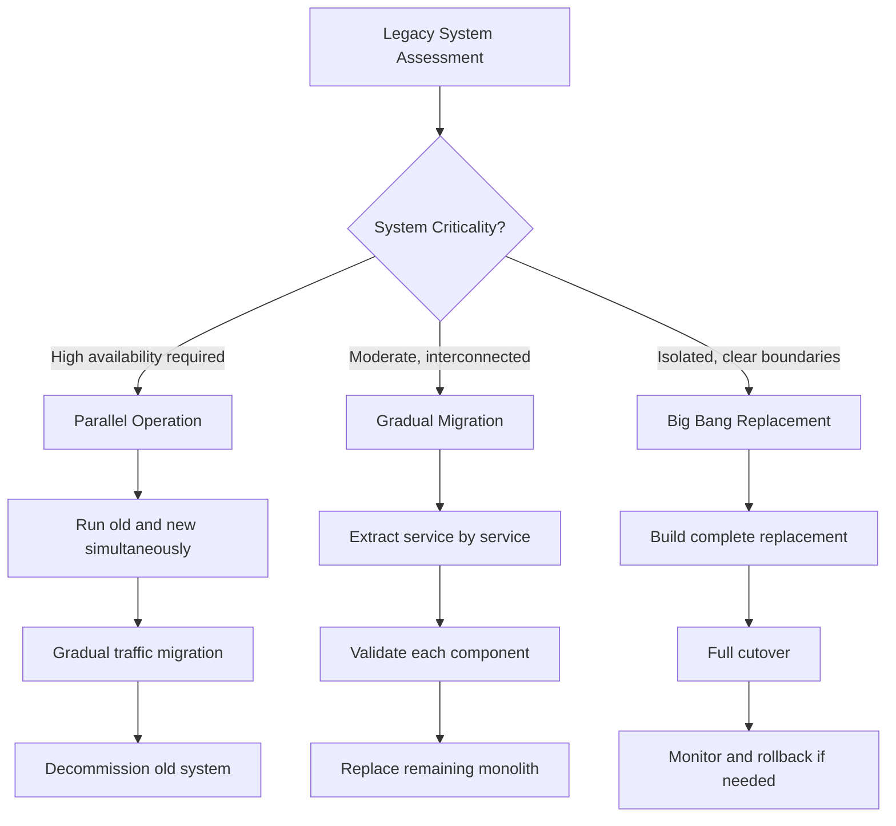

# Chapter 58: Legacy Systems

> *Last Updated: March 2026*

> **Skim This Chapter**
> - Legacy systems are inevitable in successful ventures; the goal is not to avoid them but to manage them strategically through modular architecture, proactive technical debt management, and deliberate governance design.
> - Output: Replacement and modernization strategy frameworks, organizational legacy management practices, and design principles for systems that evolve gracefully rather than brittly.

## In This Chapter, You Will
- Learn why legacy formation is inevitable and how to manage it as a strategic asset rather than a liability
- Identify the unique legacy challenges in Web3 (immutable contracts) and AI (rapid model obsolescence)
- Apply replacement, modernization, and migration strategies appropriate to your system's characteristics
- Evaluate organizational culture and knowledge management practices that determine legacy resilience

## 1. Introduction: The Innovation Paradox

Every successful technology venture faces a fundamental paradox: the infrastructure and systems that enabled initial success eventually become constraints that limit future growth. This challenge becomes particularly acute in rapidly evolving domains like Web3 and AI, where the pace of technological change can quickly render previously cutting-edge solutions obsolete.

Rather than viewing legacy as inevitably negative, founders who understand this paradox can design systems that evolve gracefully---turning accumulated infrastructure into a competitive advantage rather than a constraint.

## 2. Understanding Legacy Formation

### The Lifecycle of Innovation

**Innovation Phase:**
- Rapid experimentation and iteration
- Minimal technical debt acceptable
- Speed prioritized over sustainability
- Small team with direct communication

**Growth Phase:**
- Scaling challenges require architectural decisions
- Technical debt accumulation accelerates
- Process and structure become necessary
- Team growth complicates communication

**Maturity Phase:**
- Existing systems become deeply embedded
- Change becomes increasingly expensive
- Risk aversion increases with scale
- Legacy systems provide stability but limit innovation

### Inevitability vs. Management

Legacy system formation is largely inevitable, but its impact can be managed through:
- Deliberate architectural choices
- Proactive technical debt management
- Cultural practices that maintain adaptability
- Strategic system replacement planning

## 3. The Web3/AI Legacy Challenge

### Unique Characteristics

**Immutable Infrastructure:**
Web3 systems often involve immutable smart contracts that cannot be easily updated once deployed, creating permanent legacy systems that must be designed carefully from the beginning.

**Rapid AI Evolution:**
AI models and techniques evolve so rapidly that systems built on today's state-of-the-art may become obsolete within months rather than years.

**Network Effects and Lock-in:**
Both Web3 and AI systems often exhibit strong network effects that make migration extremely difficult once established.

### Strategic Implications

**Design for Evolution:**
- Modular architectures that enable component replacement
- Interface stability despite implementation changes
- Migration pathways built into initial designs
- Upgrade mechanisms that preserve network effects

**Manage Technical Debt Proactively:**
- Regular refactoring and system cleanup
- Clear documentation and knowledge transfer
- Automated testing to enable confident changes
- Monitoring and alerting for system health

## 4. Legacy System Strategies

### Replacement Strategies

| Strategy | Risk Level | Resource Cost | Best For | Key Requirement |
|---|---|---|---|---|
| Big Bang | High | Medium (concentrated) | Isolated systems with clear boundaries | Extensive pre-deployment testing |
| Gradual Migration | Medium | Medium (distributed) | Complex, interconnected systems | Careful interface management |
| Parallel Operation | Low | High (dual systems) | Critical, high-availability systems | Sufficient infrastructure budget |

**Big Bang Replacement:**
- Complete system replacement in single deployment
- High risk but potentially high reward
- Requires extensive testing and preparation
- Suitable for isolated systems with clear boundaries

**Gradual Migration:**
- Incremental replacement of system components
- Lower risk with continuous value delivery
- Requires careful interface design and management
- Suitable for complex, interconnected systems

**Parallel Operation:**
- New and old systems run simultaneously
- Gradual traffic migration from old to new
- Highest resource requirements but lowest risk
- Suitable for critical systems with high availability requirements

### Modernization Approaches

**Interface Modernization:**
- Maintain legacy backend with modern interfaces
- Quick improvements to user experience
- Preserves existing business logic and data
- Lowest risk and development cost

**Data Migration:**
- Extract value from legacy systems through data
- Modern systems built around migrated data
- Legacy systems maintained for historical access
- Suitable when data is the primary value

**Service Extraction:**
- Extract specific functionality into microservices
- Legacy system becomes collection of services
- Enables incremental replacement and scaling
- Balances modernization with risk management

## 5. Case Studies

### Ethereum's Evolution

**Legacy Challenges:**
- Proof of Work consensus mechanism
- Limited throughput and high gas costs
- Technical debt from rapid early development
- Immutable contracts creating permanent legacy

**Migration Strategy:**
- Ethereum 2.0 as parallel development
- Gradual migration path preserving value
- Layer 2 solutions as interim scalability
- Community governance for major changes

**Lessons:**
- Long-term planning for major architectural changes
- Community engagement essential for network migrations
- Incremental improvements while planning major upgrades
- Preserving network effects during transitions

### OpenAI's Model Evolution

**Approach:**
- Continuous model improvements and releases
- API compatibility maintained across versions
- Deprecation schedules for legacy models
- Migration tools and documentation for developers

**Key Practices:**
- Clear communication about deprecation timelines
- Migration assistance and tooling
- Gradual performance improvements to encourage adoption
- Backwards compatibility during transition periods

## 6. Organizational Legacy

### Cultural Systems

**Innovation Culture:**
- Maintaining startup mentality at scale
- Encouraging experimentation despite risks
- Learning from failures without blame
- Continuous learning and skill development

**Process Evolution:**
- Lightweight processes that scale appropriately
- Decision-making frameworks that remain agile
- Communication systems that preserve transparency
- Hiring practices that maintain culture

### Knowledge Management

**Documentation Systems:**
- Architecture decision records
- System design documentation
- Troubleshooting guides and runbooks
- Historical context and reasoning

**Knowledge Transfer:**
- Mentorship and apprenticeship programs
- Code review and pair programming
- Cross-functional collaboration
- Retention of institutional knowledge

## 7. Planning for Legacy

### Design Principles

**Modularity:**
- Clear separation of concerns
- Well-defined interfaces between components
- Minimal coupling between system parts
- Independent deployment and scaling capabilities

**Extensibility:**
- Plugin architectures for new functionality
- Configuration systems for behavioral changes
- API design for future requirements
- Database schemas that support evolution

**Observability:**
- Comprehensive logging and monitoring
- Performance metrics and alerting
- User behavior tracking and analysis
- System health and status dashboards

### Governance Frameworks

**Technical Governance:**
- Architecture review processes
- Code quality standards and enforcement
- Security review and vulnerability management
- Performance and scalability monitoring

**Business Governance:**
- Strategic roadmap planning and communication
- Resource allocation for maintenance vs. innovation
- Risk assessment and mitigation planning
- Stakeholder communication and expectation management

## 8. The Opportunity in Legacy

### Competitive Advantages

**Stability and Reliability:**
- Proven systems with known characteristics
- Established operational procedures
- Experienced team knowledge
- Customer trust and confidence

**Data and Learning:**
- Historical data for training and analysis
- Understanding of user behavior patterns
- Knowledge of edge cases and failure modes
- Established business relationships

**Network Effects:**
- Established user bases and communities
- Integration with external systems
- Brand recognition and market position
- Economic incentives for continued use

### Strategic Leverage

Rather than viewing legacy as purely constraining, successful organizations find ways to:
- Extract maximum value from existing investments
- Use legacy stability to enable innovation elsewhere
- Leverage established relationships for new opportunities
- Build new capabilities on proven foundations

### Case Study: The Linux Foundation — Building Legacy Through Open Governance

The Linux operating system, created by Linus Torvalds in 1991, represents perhaps the most successful example of a technology project that transcended its founder to become true legacy infrastructure. Today Linux runs on over 90 percent of the world's cloud servers, powers every Android device, operates inside most embedded systems, and underpins the infrastructure of virtually every major technology company. It achieved this not despite being a legacy system but because its governance structures were designed to make legacy a strength rather than a constraint.

The early history of Linux illustrates the lifecycle of innovation described in this chapter. Torvalds began with rapid experimentation, accepting contributions from anyone willing to submit patches. As the project grew, the organizational challenges became acute: thousands of contributors across different time zones, competing priorities between enterprise users and hobbyists, and the constant risk that a single person's departure could destabilize critical subsystems.

The creation of the Linux Foundation in 2000 (originally as the Open Source Development Labs) addressed these challenges through institutional design. The Foundation established governance frameworks that separated technical leadership from organizational management. Torvalds retained authority over kernel development decisions, but the Foundation handled funding, legal protection, infrastructure, and ecosystem coordination. This division mirrors the role migration plan outlined in this chapter: the founder moved from operational leader to technical steward while institutional structures absorbed the functions that no individual could sustain indefinitely.

Linux's approach to legacy system management also demonstrates the modernization strategies discussed in this chapter. The kernel's modular architecture allows individual subsystems to be replaced or upgraded without destabilizing the whole. The release cadence, with new versions every nine to ten weeks, ensures that technical debt is addressed continuously rather than accumulating until a disruptive rewrite becomes necessary. The maintainer hierarchy, with subsystem maintainers responsible for specific areas of the codebase, distributes knowledge and prevents any single contributor from becoming an irreplaceable bottleneck.

The project's longevity offers a critical lesson for founders thinking about legacy: the technology that endures is not the technology that resists change but the technology whose governance structures enable continuous adaptation. Linux has survived multiple hardware revolutions, the rise of cloud computing, the mobile era, and the emergence of AI workloads, not because it was perfectly designed in 1991 but because its institutional architecture allowed it to evolve without breaking. For founders building systems intended to outlast their direct involvement, the Linux Foundation model demonstrates that legacy is not an accident of survival but a product of deliberate governance design.

## Key Takeaways

### Legacy Is Inevitable--Management Is Optional

Every successful technology venture accumulates legacy systems; the difference between thriving and stagnating organizations is whether they manage that legacy proactively through modular architecture and deliberate debt reduction or reactively through crisis-driven rewrites.

### Immutability and Rapid Evolution Create Unique Pressures

Web3's immutable smart contracts and AI's rapid model obsolescence demand legacy strategies unlike traditional software--requiring migration pathways, upgrade mechanisms, and deprecation schedules designed from day one.

### Legacy Can Be Competitive Advantage

Stability, accumulated data, institutional knowledge, network effects, and established relationships represent strategic assets that new entrants cannot easily replicate--provided they are maintained rather than allowed to decay.

### Governance Determines Legacy Resilience

As the Linux Foundation demonstrates, technology that endures is not technology that resists change but technology whose governance structures enable continuous adaptation without breaking.

## Founder's Checklist
- [ ] Have I designed my system architecture with modular boundaries that allow component replacement without full rewrites?
- [ ] Do I have a proactive technical debt budget (time and resources allocated each sprint or quarter)?
- [ ] Are migration pathways built into my initial design, especially for immutable components?
- [ ] Is institutional knowledge documented in architecture decision records, not just tribal knowledge?
- [ ] Have I established clear deprecation timelines and communication practices for legacy components?

## Exercises

1. **Legacy Audit:** Inventory your current systems and categorize each component as Innovation Phase, Growth Phase, or Maturity Phase using the lifecycle framework in this chapter. For components in the Maturity Phase, assess whether they are strategic assets (providing stability and data advantage) or strategic liabilities (constraining growth). Create an action plan for each liability.

2. **Migration Strategy Selection:** Choose your most critical legacy component and evaluate it against the three replacement strategies (Big Bang, Gradual Migration, Parallel Operation). Document the risk profile, resource requirements, and timeline for each approach. Present the trade-offs to your team and select a strategy with clear milestones.

3. **Knowledge Preservation Plan:** Identify the three areas of your system where institutional knowledge is most concentrated in individual people (highest "bus factor" risk). For each, create an architecture decision record template, schedule a knowledge transfer session, and establish a documentation standard that future team members can maintain.

## Sources

1. Feathers, M.C. (2004). *Working Effectively with Legacy Code*. Prentice Hall.
2. Ford, N., Parsons, R., & Kua, P. (2017). *Building Evolutionary Architectures: Support Constant Change*. O'Reilly Media.
3. Kleppmann, M. (2017). *Designing Data-Intensive Applications*. O'Reilly Media.
4. Christensen, C.M. (1997). *The Innovator's Dilemma: When New Technologies Cause Great Firms to Fail*. Harvard Business School Press.
5. Buterin, V. (2022). "Endgame." Ethereum Foundation Blog.
6. Kim, G., Humble, J., Debois, P., & Willis, J. (2016). *The DevOps Handbook*. IT Revolution Press.
7. Newman, S. (2019). *Monolith to Microservices: Evolutionary Patterns to Transform Your Monolith*. O'Reilly Media.
8. Lehman, M.M. (1980). "Programs, Life Cycles, and Laws of Software Evolution." *Proceedings of the IEEE*, 68(9), 1060-1076.

## Further Reading

- **Working Effectively with Legacy Code** by Michael C. Feathers — The definitive guide to understanding, testing, and safely modifying legacy codebases, with techniques directly applicable to evolving established technical systems.
- **Building Evolutionary Architectures** by Neal Ford, Rebecca Parsons, and Patrick Kua — Provides frameworks for designing systems that can evolve over time, helping founders avoid the trap of architectures that resist change.
- **The Phoenix Project** by Gene Kim, Kevin Behr, and George Spafford — A narrative-driven introduction to DevOps principles that illustrates how organizations can transform legacy IT operations into competitive advantages.
- **Designing Data-Intensive Applications** by Martin Kleppmann — A comprehensive guide to the principles behind reliable, scalable, and maintainable systems, essential for understanding how to modernize data architectures without losing accumulated value.

## Related Case Studies
- See the Case Studies Compendium for curated examples relevant to this chapter: ../case-studies/compendium.md

---

**Previously:** [Chapter 51: Building Movements](ch51-building-movements.md) — Showed how to create gravitational pull by building movements that transform users into identity-driven advocates and co-creators.

**Next:** [Chapter 53: Exponential Impact](../part-06-beyond-three/ch53-exponential-impact.md) — Part VI begins with moving beyond linear growth to exponential value creation, covering power-law dynamics, impact measurement, and ethical guardrails.
