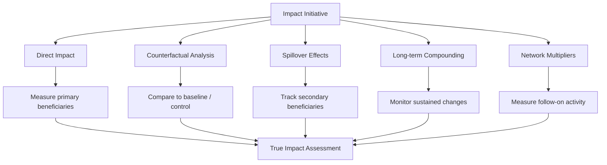

# Chapter 61: Exponential Impact

> *Last Updated: March 2026*

> **Skim This Chapter**
> - Exponential impact follows power-law dynamics where a small number of well-positioned initiatives create the majority of societal value; achieving it requires portfolio thinking, rigorous counterfactual measurement, and ethical guardrails.
> - Output: Impact measurement frameworks covering direct effects, counterfactuals, spillovers, and compounding; ethical externality assessment tools; and portfolio construction models for maximizing expected value.

## Creating Compounding Returns for Society

Moving beyond linear growth to exponential value creation.

> **The exponential test:** If your venture disappeared tomorrow, would the gap it left be linear (easily filled by a competitor) or exponential (a cascading loss across an entire ecosystem)? The answer reveals whether you have built a product or a platform for compounding impact.

## In This Chapter, You Will

- Understand power-law dynamics versus survivorship bias in impact assessment
- Build measurement frameworks that capture counterfactuals and spillover effects
- Navigate ethical externalities and design appropriate guardrails
- Apply portfolio thinking to maximize leverage across initiatives

## Founder's Checklist

- What are our true counterfactual impacts versus correlation effects?
- Which ethical externalities require active mitigation versus acceptance?
- How do we measure spillover effects beyond direct beneficiaries?
- Where can small inputs create disproportionate positive outcomes?

## Exercises

- Design an impact measurement framework with baseline, counterfactual, and spillover tracking
- Create an ethics impact assessment for your most ambitious initiative
- Map power-law opportunities in your domain using the portfolio framework

## Case Studies

### OpenAI
*Exponential AI Impact Through Strategic Positioning*

OpenAI demonstrates exponential impact through:

- **Research Leverage**: Fundamental breakthroughs creating platform effects
- **Safety Leadership**: Setting industry standards for responsible development
- **Democratic Access**: Reducing AI capability barriers through APIs
- **Educational Spillovers**: Training effects across the broader ecosystem
- **Policy Influence**: Shaping regulatory frameworks globally

Their approach shows how positioning at inflection points can create outsized societal impact.

### Ethereum
*Platform Effects Creating Exponential Value*

Ethereum's exponential impact model:

- **Developer Multiplier**: Enabling thousands of applications
- **Financial Infrastructure**: Creating new economic primitives
- **Governance Innovation**: Experimenting with collective decision-making
- **Global Accessibility**: Reducing barriers to financial participation
- **Composability Effects**: Value compounding through interoperability

Their platform strategy demonstrates how enabling others can create greater impact than direct action.

### Bitcoin
*Monetary Innovation with Generational Effects*

Bitcoin's exponential impact through:

- **Store of Value**: Preserving wealth across unstable economies
- **Censorship Resistance**: Enabling financial freedom under authoritarian regimes
- **Monetary Education**: Teaching sound money principles globally
- **Innovation Catalyst**: Inspiring broader blockchain experimentation
- **Geopolitical Balance**: Providing alternatives to dominant monetary systems

Their approach shows how fundamental infrastructure changes can have generational compounding effects.

### Case Study: M-Pesa — Exponential Impact Through Infrastructure Leapfrogging

M-Pesa, launched in 2007 by Safaricom in Kenya, is one of the most striking examples of exponential impact in the history of technology. A simple SMS-based mobile money system created financial inclusion for over 50 million previously unbanked users across East Africa, fundamentally reshaping the continent's financial infrastructure and demonstrating how a single well-positioned intervention can generate compounding returns for an entire society.

The system's design was born from constraint rather than abundance. In Kenya in the mid-2000s, traditional banking infrastructure served less than 20 percent of the adult population. Bank branches were concentrated in urban areas, ATM networks were sparse, and the cost structures of conventional banking made small-balance accounts economically unviable. M-Pesa's founders, working within Safaricom under the leadership of teams that included women in key product and operations roles, recognized that the mobile phone network already reached far deeper into the population than banking infrastructure ever had. By building a payment system on top of SMS, the most basic mobile capability, they created financial services that worked on any handset without requiring internet access, bank accounts, or literacy in English.

The exponential dynamics of M-Pesa illustrate several principles from this chapter's framework. The direct impact was immediate: millions of people gained the ability to send money, pay bills, and store value securely for the first time. But the spillover effects dwarfed the direct impact. M-Pesa became the rails on which an entire ecosystem of services was built: microinsurance products, savings tools, agricultural payment systems, salary disbursement for small businesses, and eventually lending products that used transaction history as a credit score substitute. Each layer of services attracted more users to the platform, and each new user made the platform more valuable to existing participants, creating the network effects and compounding returns that define exponential impact.

The counterfactual analysis is particularly instructive. Research estimated that M-Pesa lifted roughly 2 percent of Kenyan households out of extreme poverty, with disproportionate effects on women-headed households. These gains came not from direct wealth transfers but from enabling economic participation that was previously impossible: a farmer could receive payment without traveling to a distant bank branch, a parent could send school fees to a child in another city instantly and without intermediary fees, and a small business owner could build a verifiable financial history.

M-Pesa's impact extended beyond Kenya. The model was replicated and adapted across Tanzania, Mozambique, India, and other markets, each adaptation demonstrating how infrastructure designed for local constraints can achieve global relevance. The system's success also influenced global development policy, shifting attention from traditional banking expansion to mobile-first financial inclusion strategies.

For founders seeking exponential impact, M-Pesa demonstrates that the greatest compounding returns often come not from building the most sophisticated technology but from identifying the leverage point where simple, accessible infrastructure can unlock participation for populations previously excluded from economic systems entirely.

## Understanding Power Laws and Impact

### Power Law Dynamics vs. Survivorship Bias

Most impact initiatives follow normal distributions, but exponential impact follows power law distributions where outcomes are extremely unequal:

**Power Law Characteristics:**
- Small number of initiatives create majority of impact
- Outcomes are heavy-tailed and highly concentrated
- Network effects and feedback loops amplify successful initiatives
- Timing and positioning matter more than linear effort

**Survivorship Bias Risks:**
- Overestimating success rates by focusing only on visible winners
- Underestimating the role of luck and external factors
- Misattributing outcomes to easily observable features
- Creating false patterns from small sample sizes

**Distinguishing Signal from Noise:**

1. **Look for Mechanisms**: Identify causal pathways, not just correlations
2. **Measure Baselines**: Compare outcomes to realistic counterfactuals
3. **Track Failures**: Learn from unsuccessful initiatives systematically
4. **Consider Context**: Account for environmental factors and timing
5. **Validate Retrospectively**: Test predictive models against historical data

### Portfolio Thinking for Impact Initiatives

Apply venture portfolio logic to maximize expected value:

**Portfolio Construction:**
- **70% Safe Bets**: High-probability, moderate-impact initiatives
- **20% Calculated Risks**: Medium-probability, high-impact opportunities
- **10% Moonshots**: Low-probability, exponential-impact possibilities

**Key Principles:**
- Optimize for expected value, not success rate
- Accept high failure rates if upside is asymmetric
- Diversify across different impact vectors
- Reserve capacity for unexpected opportunities
- Learn from failures to improve hit rates

**Mathematical Framework:**

Expected Portfolio Value = Σ(Probability × Impact × Leverage Factor)

Where leverage factors account for:
- Network effects and virality
- Platform effects enabling others
- Timing advantages at inflection points
- Compounding returns over time

## Impact Measurement Framework

### Comprehensive Measurement Approach

| Measurement Layer | What It Captures | Example Method | Common Pitfall |
|---|---|---|---|
| Direct Impact | Primary beneficiaries reached | User counts, transaction volumes | Confusing activity with outcomes |
| Counterfactual | What would have happened without you | RCTs, difference-in-difference | Assuming all observed change is causal |
| Spillover Effects | Secondary and tertiary beneficiaries | Ecosystem surveys, network analysis | Ignoring negative spillovers |
| Long-term Compounding | Sustained behavior and system changes | Longitudinal cohort tracking | Discounting delayed effects |
| Network Multipliers | Others inspired or enabled by your work | Follow-on activity measurement | Double-counting shared impact |



**1. Direct Impact Metrics**
- Primary beneficiaries reached
- Immediate outcomes achieved
- Resources deployed effectively
- Time-to-impact measurements

**2. Counterfactual Analysis**
- What would have happened without intervention?
- Attribution versus correlation effects
- Displacement of other activities
- Substitution effects and dead weight loss

**3. Spillover Effects**
- Secondary beneficiaries affected
- Knowledge and capacity building
- Market creation and ecosystem development
- Policy and regulatory changes influenced

**4. Long-term Compounding**
- Sustained behavior changes
- Institutional capacity building
- Cultural and norm shifts
- Infrastructure and platform effects

**5. Network and Multiplier Effects**
- Others inspired to similar action
- Resources mobilized beyond direct investment
- Collaborative partnerships formed
- Standards and practices adopted

### Measurement Implementation

**Baseline Establishment:**
- Pre-intervention conditions
- Comparable control groups
- Historical trend analysis
- External benchmarking

**Data Collection Framework:**
- Quantitative outcome tracking
- Qualitative impact assessment
- Stakeholder feedback systems
- Independent evaluation processes

**Attribution Methods:**
- Randomized controlled trials where feasible
- Difference-in-difference analysis
- Regression discontinuity design
- Instrumental variable approaches

**Reporting Standards:**
- Transparent methodology disclosure
- Confidence intervals on impact claims
- Sensitivity analysis for key assumptions
- Regular updating as data improves

## Ethics and Externalities

### Identifying Ethical Externalities

**Positive Externalities:**
- Knowledge spillovers to other initiatives
- Capacity building in local communities
- Standard-setting for industry practices
- Inspiration effects on other founders

**Negative Externalities:**
- Unintended consequences for vulnerable populations
- Market concentration reducing competition
- Resource displacement from alternative uses
- Cultural or social disruption effects

**Distributional Effects:**
- Who benefits versus who bears costs?
- Income and wealth distribution impacts
- Geographic concentration of benefits
- Intergenerational equity considerations

### Ethical Guardrails Framework

**1. Consent and Agency**
- Meaningful consent from affected communities
- Preservation of individual and collective choice
- Transparent communication about trade-offs
- Respect for right to refuse or withdraw

**2. Harm Minimization**
- Proactive identification of potential harms
- Design features to prevent negative outcomes
- Monitoring systems for early warning
- Rapid response capabilities for mitigation

**3. Distributive Justice**
- Fair sharing of benefits and costs
- Progressive rather than regressive impact patterns
- Attention to most vulnerable populations
- Compensation mechanisms for unavoidable harms

**4. Procedural Fairness**
- Inclusive decision-making processes
- Transparent governance structures
- Appeals and redress mechanisms
- Regular stakeholder engagement

**5. Accountability Systems**
- Clear responsibility assignment
- Independent oversight mechanisms
- Public reporting on impact and ethics
- Corrective action capabilities

### Redress and Correction Mechanisms

**Harm Identification:**
- Community feedback systems
- Independent monitoring
- Academic and journalistic oversight
- Whistleblower protections

**Correction Approaches:**
- Direct compensation for quantifiable harms
- Process changes to prevent recurrence
- Community investment in affected areas
- Policy advocacy for broader protection

**Institutional Design:**
- Ethics review boards with external members
- Regular impact audits by independent parties
- Stakeholder representation in governance
- Sunset clauses for initiatives causing net harm

## Building for Exponential Impact

1. **Platform Strategy**
   - Enable others to create value
   - Design for composability and interoperability
   - Create network effects and virality
   - Build on existing platforms and networks

2. **Timing and Positioning**
   - Identify inflection points and paradigm shifts
   - Position at leverage points in systems
   - Anticipate rather than react to trends
   - Build for future rather than current conditions

3. **Measurement and Learning**
   - Implement comprehensive impact tracking
   - Distinguish correlation from causation
   - Learn from both successes and failures
   - Adapt strategies based on evidence

4. **Ethical Integration**
   - Design ethics into core systems
   - Monitor for unintended consequences
   - Engage stakeholders in governance
   - Maintain accountability and transparency

5. **Portfolio Approach**
   - Diversify across impact vectors
   - Accept high variance in outcomes
   - Optimize for expected value
   - Reserve capacity for unexpected opportunities

## Power Laws Appendix: Mathematical Intuition

### Understanding Power Law Distributions

In normal distributions, most outcomes cluster around the average. In power law distributions, a small number of outcomes dominate:

**Key Properties:**
- Heavy tails: extreme outcomes are much more likely than normal distributions predict
- Scale invariance: patterns repeat at different scales
- No characteristic scale: there's no "typical" outcome size
- Winner-take-all dynamics: success breeds more success

**Examples in Impact:**
- Academic citations: few papers get most citations
- Wealth creation: small percentage of entrepreneurs create majority of value
- Social movements: few initiatives create most social change
- Technology adoption: few platforms capture majority of users

### Portfolio Mathematics for Impact

**Expected Value Calculation:**
```
E(Impact) = Σ[P(success) × Impact(success) × Leverage(network effects)]
```

**Risk-Adjusted Returns:**
- Sharpe Ratio equivalent: (Expected Impact - Baseline) / Impact Volatility
- Diversification benefits: correlation between different impact vectors
- Option value: preserving ability to scale successful initiatives

**Practical Implications:**
- Don't optimize for success rate; optimize for expected value
- Seek uncorrelated impact vectors for diversification
- Reserve resources to scale unexpectedly successful initiatives
- Accept high failure rates if upside potential is extreme

This mathematical framework helps founders think systematically about impact allocation while avoiding common cognitive biases that lead to suboptimal strategies.

## Key Takeaways

### Power Laws Dominate Impact Outcomes

A small number of initiatives create the majority of societal value; optimizing for expected value rather than success rate means accepting high failure rates when upside potential is extreme.

### Counterfactual Analysis Separates Real Impact from Attribution Theater

Measuring what would have happened without your intervention--not just what happened after it--is the only way to understand whether your initiative created genuine value or merely correlated with it.

### Ethical Guardrails Are Not Optional at Scale

Exponential impact amplifies both positive and negative externalities; consent, harm minimization, distributive justice, and accountability systems must be designed into core operations, not bolted on after the fact.

### Platform Strategy Creates the Highest Leverage

Enabling others to create value--through composable infrastructure, open APIs, and network effects--generates greater total impact than direct action alone, as demonstrated by M-Pesa, Ethereum, and similar infrastructure innovations.

## Sources

1. Taleb, N.N. (2007). *The Black Swan: The Impact of the Highly Improbable*. Random House.
2. West, G. (2017). *Scale: The Universal Laws of Growth, Innovation, Sustainability, and the Pace of Life*. Penguin Press.
3. Barabasi, A.L. (2003). *Linked: How Everything Is Connected to Everything Else and What It Means for Business, Science, and Everyday Life*. Plume.
4. Singer, P. (2015). *The Most Good You Can Do: How Effective Altruism Is Changing Ideas About Living Ethically*. Yale University Press.
5. Ismail, S., Malone, M.S., & Van Geest, Y. (2014). *Exponential Organizations*. Diversion Books.
6. Banerjee, A.V. & Duflo, E. (2011). *Poor Economics: A Radical Rethinking of the Way to Fight Global Poverty*. PublicAffairs.
7. Epstein, M.J. & Yuthas, K. (2014). *Measuring and Improving Social Impacts: A Guide for Nonprofits, Companies, and Impact Investors*. Berrett-Koehler.
8. Rawls, J. (1971). *A Theory of Justice*. Harvard University Press.
9. Meadows, D.H. (2008). *Thinking in Systems: A Primer*. Chelsea Green Publishing.

## Further Reading

- **Scale** by Geoffrey West — A physicist's exploration of the universal laws governing growth in biological organisms, cities, and companies, revealing why some systems achieve exponential impact while others plateau.
- **The Most Good You Can Do** by Peter Singer — Introduces effective altruism principles and rigorous frameworks for maximizing positive impact, directly applicable to founders seeking to create compounding social returns.
- **Exponential Organizations** by Salim Ismail, Michael S. Malone, and Yuri van Geest — Analyzes how organizations achieve disproportionate output relative to their peers by leveraging network effects, platforms, and information-based assets.
- **Measuring and Improving Social Impacts** by Marc J. Epstein and Kristi Yuthas — A practical guide to building measurement frameworks that capture the full scope of social impact including spillover effects and counterfactuals.
- **The Black Swan** by Nassim Nicholas Taleb — Explains why rare, high-impact events dominate outcomes in complex systems, providing essential context for understanding power-law dynamics in impact creation.

## Related Case Studies
- See the Case Studies Compendium for curated examples relevant to this chapter: ../case-studies/compendium.md

---

**Previously:** [Chapter 52: Legacy Systems](../part-05-three-leading-systems/ch52-legacy-systems.md) — Addressed the innovation paradox and showed how to turn accumulated infrastructure into a competitive advantage rather than a constraint.

**Next:** [Chapter 54: Cross-Industry Transformation](ch54-cross-industry-transformation.md) — Explores how Web3 and AI are transforming traditional sectors like healthcare, energy, manufacturing, and agriculture where the greatest real-economy value creation lies ahead.
